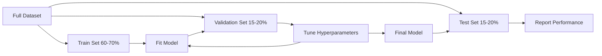

# Evaluación de modelo

> El buen y el mal de un modelo depende de cómo lo mida.

**Type:** Build
**Languages:** Python
**先修要求：**Fase 1 ((Probabilidad y distribución, estadísticas para ML) Fase 2 Lecciones 1-8
**Time:** ~90 分钟

## El objetivo del aprendizaje

- Desde la implementación de K-fold y la validación cruzada de K-fold estratificada,并 explicar por qué la estratificación a los datos desequilibrados es importante
- Desde la precisión de cálculo de cero, recalque, F1, AUC-ROC, así como índice de regresión (MSE, RMSE, MAE, R-squared)
- 解读 curvas de aprendizaje, modelo de diagnóstico ¿existe un alto sesgo o una alta variación
- 识别常见评估错误, incluyendo filtración de datos, selección de métricas equivocadas, así como contaminación del conjunto de ensayos

##  problemas

Has entrenado un modelo... ha alcanzado el 95% de precisión en tus datos... ¿Está bien?

Quizás bueno. Quizás malo. Si el 95% de tus datos pertenecen a la misma clase, entonces un modelo de predicción de esta clase también puede obtener una precisión del 95%, pero no es completamente útil. Si evalúas el 95% en el mismo conjunto de datos que has utilizado en el entrenamiento, este número no tiene sentido, porque el modelo sólo recuerda la respuesta. Si tu conjunto de datos tiene un componente de tiempo, y estás en la parte anterior de la interrupción de datos, entonces el modelo puede estar utilizando el futuro de los datos para predecir el pasado.

La evaluación de modelos es el lugar donde la mayoría de los proyectos de ML salen errados. Las métricas erradas hacen que el modelo sea diferente. Parece muy bueno. La división errónea hace que el modelo sea diferente.

## 概念

### El tren, la validación, la prueba



Tres partes, tres usos:

- **Training set**En el entrenamiento, verá estas muestras.
- **Validation set**Para mejorar los hiperparámetros, y hacer la selección entre varios modelos. El modelo no se entrenará en estos datos, pero su decisión se verá influenciada por ellos.
- **Test set**Sólo en el último contacto, para informar el rendimiento final. Si ves el rendimiento del test, luego vuelve a modificar el modelo, ya no es un conjunto de pruebas.

El conjunto de pruebas es su garantía de mantenimiento, para garantizar el rendimiento del informe  refleja el modelo en la realidad no vista de los datos 

### Validación cruzada de K-doble

 para el pequeño conjunto de datos, separado por tren/validación, se produce una estimación más ruidosa.

```mermaid
flowchart TB
    subgraph Fold1["Fold 1"]
        direction LR
        V1["Val"] --- T1a["Train"] --- T1b["Train"] --- T1c["Train"] --- T1d["Train"]
    end
    subgraph Fold2["Fold 2"]
        direction LR
        T2a["Train"] --- V2["Val"] --- T2b["Train"] --- T2c["Train"] --- T2d["Train"]
    end
    subgraph Fold3["Fold 3"]
        direction LR
        T3a["Train"] --- T3b["Train"] --- V3["Val"] --- T3c["Train"] --- T3d["Train"]
    end
    subgraph Fold4["Fold 4"]
        direction LR
        T4a["Train"] --- T4b["Train"] --- T4c["Train"] --- V4["Val"] --- T4d["Train"]
    end
    subgraph Fold5["Fold 5"]
        direction LR
        T5a["Train"] --- T5b["Train"] --- T5c["Train"] --- T5d["Train"] --- V5["Val"]
    end
    Fold1 --> R["Average scores"]
    Fold2 --> R
    Fold3 --> R
    Fold4 --> R
    Fold5 --> R
```



1. Dividir los datos en K 个大相等的折叠
2. Para cada plegado, en K-1 plegadas entrenamiento, y en el resto de plegados
3. Por lo tanto, el valor de la evaluación de la evaluación de la evaluación de la evaluación de la evaluación de la evaluación de la evaluación de la evaluación de la evaluación de la evaluación de la evaluación de la evaluación de la evaluación de la evaluación de la evaluación de la evaluación de la evaluación de la evaluación de la evaluación de la evaluación de la evaluación de la evaluación de la evaluación de la evaluación de la evaluación de la evaluación de la evaluación de la evaluación de la evaluación de la evaluación de la evaluación de la evaluación de la evaluación de la evaluación de la evaluación de la evaluación de la evaluación de la evaluación de la evaluación de la evaluación de la evaluación de la evaluación de la evaluación de la evaluación de la evaluación de la evaluación de la evaluación de la evaluación de la evaluación de la evaluación de la evaluación de la evaluación de la evaluación de la evaluación de la evaluación de la evaluación de la evaluación de la evaluación de la evaluación de la evaluación de la evaluación de la evaluación de la evaluación de la evaluación de la evaluación de la evaluación de la evaluación de la evaluación de la evaluación de la evaluación de la evaluación de la evaluación de la evaluación de la evaluación de la evaluación de la evaluación de la evaluación de la evaluación de la evaluación de la evaluación de la evaluación de la evaluación de la evaluación de la evaluación de la evaluación de la evaluación de la evaluación de la evaluación de la evaluación de la evaluación de la evaluación de la evaluación de la evaluación de la evaluación de la evaluación de la evaluación de la evaluación de la evaluación de la evaluación de la evaluación de la evaluación de la evaluación de la evaluación de la evaluación de la evaluación de la evaluación de la evaluación de la evaluación de la evaluación de la evaluación de la evaluación de la evaluación de la evaluación de la evaluación de la evaluación de la evaluación de la evaluación de la evaluación de la evaluación de la evaluación de la evaluación de la evaluación de la evaluación de la evaluación de la evaluación de la evaluación de la evaluación de la evaluación de la cuadro de la evaluación de la evaluación de la evaluación de la cuadro de la cuadro de la cuadro de la cuadro de la cuadro de la cuadro de la cuadro de la cuadro de la cuadro de la cuadro de la cuadro de la cuadro de la cuadro de la cuadro de la cuadro de la cuadro de la cuadro de la cuadro de la cuadro de la cuadro de la cuadro de la cuadro de la cuadro de la cuadro de la cuadro de la cuadro de cuadro

K=5 o K=10 es el estándar de selección. Cada punto de datos fue utilizado para validar una vez.

**Stratified K-fold**En cada pliegue, mantenga la distribución de clases. Si su conjunto de datos es de 70% de clase A y 30% de clase B, entonces cada pliegue mantendrá aproximadamente la misma proporción. Esto es importante para los conjuntos de datos desequilibrados, ya que, a su vez, la división puede colocar todas las muestras de minorías en un mismo pliegue.

### Clasificación indicación

**Confusion matrix**:基础── Para la clasificación binaria:

|  | Predicted Positive | Predicted Negative |
|--|---|---|
| Actually Positive | True Positive (TP) | False Negative (FN) |
| Actually Negative | False Positive (FP) | True Negative (TN) |

De esta Matrix se pueden obtener todos los demás indicadores:

- **Accuracy**= (TP + TN) / (TP + TN + FP + FN)。预测正确的比例──当类 不平衡时会产生误导──
- **Precision**= TP / (TP + FP) ――En todos los objetos de pronóstico positivos, ¿cuánto es realmente positivo?
- **Recall**(sensibilidad) = TP / (TP + FN) ――En todos los positivos reales, ¿cuánto hemos capturado?
- **F1 score**= 2 * precisión * recall / (precisión + recall) ――precisión 和 recall mean harmónico──当二者都不明显更重要时,用它来平衡两者──
- **AUC-ROC**:Receptor Operating Characteristic curve 下的面积──它在不同分类门下绘制 true positive rate与 false positive rate──AUC = 0.5 表示随机猜测,AUC = 1.0 表示完美分离──它与门无关:衡量的是模型将将正面排在负面前面的能力,而不受你选择的切断影响──

### Regreso de la actividad

- **MSE**(Medio de Error Cuadrado) = medio de y_true - y_pred) ^2)
- **RMSE**(Erro cuadrado de la mediana raíz) = sqrt(MSE)。 con la variable objetivo 单位相同──比 MSE 更容易解释──
- **MAE**(Medio de error absoluto) = medio de error y verdad - y_precedencia)
- **R-squared**= 1 - SS_res / SS_tot, en el cual SS_res = suma(((y_true - y_pred) ^2), SS_tot = suma((((y_true - y_mean) ^2)。 muestra modelo 解释了多少方差──R^2 = 1.0 表示完美──R^2 = 0.0 表示模型 并不比总是预测平均值更好──如果模型比预测均还差,R^2 可能为负──

### Curvas de aprendizaje

La función de la calificación de entrenamiento y validación se puede calcular en el tamaño del conjunto de entrenamiento:

- **High bias（underfitting）**Dos curvas reciben un puntaje más bajo.
- **High variance（overfitting）**El resultado de la formación es alto, pero el resultado de la validación es bajo. La diferencia entre ambos es grande.

### Curvas de validación

Para el entrenamiento y la validación de puntajes  dibujar para una función de un hiperparámetro:

- 低复杂度时: dos puntuaciones 都低(falto de ajuste)
- 合适复杂度时: dos puntuaciones son altas y cercanas
- Alta complejidad时: puntaje de entrenamiento  mantener más alto, pero el puntaje de validación  下降(overfitting)

El mejor valor de hiperparámetro es el puntaje de validación  alcanzar la posición de la máxima valoración 

### 常见评估错误

**Data leakage**Por ejemplo: en el caso de la división, antes de la escalación del conjunto de datos completo, en la predicción de series de tiempo, contiene datos futuros, utilizando la característica de la entrega de la meta, siempre primero la división, luego el preprocesamiento.

**Class imbalance**:99% de las transacciones son legítimas, 1% son fraudulentas.

**Wrong metric**El método de recalcar (medical diagnosis) se debe mejorar en la precisión, o en el caso de que los datos tengan graves anomalías, se debe mejorar el RMSE (medical diagnosis) y el uso de la MAE (medical diagnosis).

**Not using stratified splits**Para los datos desequilibrados, la división de las probabilidades puede hacer que la validación se repida entre las muestras minoritarias                                                                                                                                                                                                                                                                                                                                                                                                                                                                                                 

**Testing too often**Cada vez que revisas el rendimiento del examen no se hace ajuste, todo se adapta a un conjunto de pruebas.


```figure
precision-recall-threshold
```

## Construirlo

### 步骤 1: Treno/validación/dividir las pruebas

```python
import random
import math


def train_val_test_split(X, y, train_ratio=0.6, val_ratio=0.2, seed=42):
    random.seed(seed)
    n = len(X)
    indices = list(range(n))
    random.shuffle(indices)

    train_end = int(n * train_ratio)
    val_end = int(n * (train_ratio + val_ratio))

    train_idx = indices[:train_end]
    val_idx = indices[train_end:val_end]
    test_idx = indices[val_end:]

    X_train = [X[i] for i in train_idx]
    y_train = [y[i] for i in train_idx]
    X_val = [X[i] for i in val_idx]
    y_val = [y[i] for i in val_idx]
    X_test = [X[i] for i in test_idx]
    y_test = [y[i] for i in test_idx]

    return X_train, y_train, X_val, y_val, X_test, y_test
```

### Paso 2: Validación cruzada de K-doble y de K-doble estratificado

```python
def kfold_split(n, k=5, seed=42):
    random.seed(seed)
    indices = list(range(n))
    random.shuffle(indices)

    fold_size = n // k
    folds = []

    for i in range(k):
        start = i * fold_size
        end = start + fold_size if i < k - 1 else n
        val_idx = indices[start:end]
        train_idx = indices[:start] + indices[end:]
        folds.append((train_idx, val_idx))

    return folds


def stratified_kfold_split(y, k=5, seed=42):
    random.seed(seed)

    class_indices = {}
    for i, label in enumerate(y):
        class_indices.setdefault(label, []).append(i)

    for label in class_indices:
        random.shuffle(class_indices[label])

    folds = [{"train": [], "val": []} for _ in range(k)]

    for label, indices in class_indices.items():
        fold_size = len(indices) // k
        for i in range(k):
            start = i * fold_size
            end = start + fold_size if i < k - 1 else len(indices)
            val_part = indices[start:end]
            train_part = indices[:start] + indices[end:]
            folds[i]["val"].extend(val_part)
            folds[i]["train"].extend(train_part)

    return [(f["train"], f["val"]) for f in folds]


def cross_validate(X, y, model_fn, k=5, metric_fn=None, stratified=False):
    n = len(X)

    if stratified:
        folds = stratified_kfold_split(y, k)
    else:
        folds = kfold_split(n, k)

    scores = []
    for train_idx, val_idx in folds:
        X_train = [X[i] for i in train_idx]
        y_train = [y[i] for i in train_idx]
        X_val = [X[i] for i in val_idx]
        y_val = [y[i] for i in val_idx]

        model = model_fn()
        model.fit(X_train, y_train)
        predictions = [model.predict(x) for x in X_val]

        if metric_fn:
            score = metric_fn(y_val, predictions)
        else:
            score = sum(1 for yt, yp in zip(y_val, predictions) if yt == yp) / len(y_val)
        scores.append(score)

    return scores
```

### Paso 3: Matriz de confusión y Indicador de clasificación

```python
def confusion_matrix(y_true, y_pred):
    tp = sum(1 for yt, yp in zip(y_true, y_pred) if yt == 1 and yp == 1)
    tn = sum(1 for yt, yp in zip(y_true, y_pred) if yt == 0 and yp == 0)
    fp = sum(1 for yt, yp in zip(y_true, y_pred) if yt == 0 and yp == 1)
    fn = sum(1 for yt, yp in zip(y_true, y_pred) if yt == 1 and yp == 0)
    return tp, tn, fp, fn


def accuracy(y_true, y_pred):
    tp, tn, fp, fn = confusion_matrix(y_true, y_pred)
    total = tp + tn + fp + fn
    return (tp + tn) / total if total > 0 else 0.0


def precision(y_true, y_pred):
    tp, tn, fp, fn = confusion_matrix(y_true, y_pred)
    return tp / (tp + fp) if (tp + fp) > 0 else 0.0


def recall(y_true, y_pred):
    tp, tn, fp, fn = confusion_matrix(y_true, y_pred)
    return tp / (tp + fn) if (tp + fn) > 0 else 0.0


def f1_score(y_true, y_pred):
    p = precision(y_true, y_pred)
    r = recall(y_true, y_pred)
    return 2 * p * r / (p + r) if (p + r) > 0 else 0.0


def roc_curve(y_true, y_scores):
    thresholds = sorted(set(y_scores), reverse=True)
    tpr_list = []
    fpr_list = []

    total_positives = sum(y_true)
    total_negatives = len(y_true) - total_positives

    for threshold in thresholds:
        y_pred = [1 if s >= threshold else 0 for s in y_scores]
        tp = sum(1 for yt, yp in zip(y_true, y_pred) if yt == 1 and yp == 1)
        fp = sum(1 for yt, yp in zip(y_true, y_pred) if yt == 0 and yp == 1)

        tpr = tp / total_positives if total_positives > 0 else 0.0
        fpr = fp / total_negatives if total_negatives > 0 else 0.0

        tpr_list.append(tpr)
        fpr_list.append(fpr)

    return fpr_list, tpr_list, thresholds


def auc_roc(y_true, y_scores):
    fpr_list, tpr_list, _ = roc_curve(y_true, y_scores)

    pairs = sorted(zip(fpr_list, tpr_list))
    fpr_sorted = [p[0] for p in pairs]
    tpr_sorted = [p[1] for p in pairs]

    area = 0.0
    for i in range(1, len(fpr_sorted)):
        width = fpr_sorted[i] - fpr_sorted[i - 1]
        height = (tpr_sorted[i] + tpr_sorted[i - 1]) / 2
        area += width * height

    return area
```

### Paso 4: Regreso de los indicadores

```python
def mse(y_true, y_pred):
    n = len(y_true)
    return sum((yt - yp) ** 2 for yt, yp in zip(y_true, y_pred)) / n


def rmse(y_true, y_pred):
    return math.sqrt(mse(y_true, y_pred))


def mae(y_true, y_pred):
    n = len(y_true)
    return sum(abs(yt - yp) for yt, yp in zip(y_true, y_pred)) / n


def r_squared(y_true, y_pred):
    mean_y = sum(y_true) / len(y_true)
    ss_res = sum((yt - yp) ** 2 for yt, yp in zip(y_true, y_pred))
    ss_tot = sum((yt - mean_y) ** 2 for yt in y_true)
    if ss_tot == 0:
        return 0.0
    return 1.0 - ss_res / ss_tot
```

### 步骤 5: Curvas de aprendizaje

```python
def learning_curve(X, y, model_fn, metric_fn, train_sizes=None, val_ratio=0.2, seed=42):
    random.seed(seed)
    n = len(X)
    indices = list(range(n))
    random.shuffle(indices)

    val_size = int(n * val_ratio)
    val_idx = indices[:val_size]
    pool_idx = indices[val_size:]

    X_val = [X[i] for i in val_idx]
    y_val = [y[i] for i in val_idx]

    if train_sizes is None:
        train_sizes = [int(len(pool_idx) * r) for r in [0.1, 0.2, 0.4, 0.6, 0.8, 1.0]]

    train_scores = []
    val_scores = []

    for size in train_sizes:
        subset = pool_idx[:size]
        X_train = [X[i] for i in subset]
        y_train = [y[i] for i in subset]

        model = model_fn()
        model.fit(X_train, y_train)

        train_pred = [model.predict(x) for x in X_train]
        val_pred = [model.predict(x) for x in X_val]

        train_scores.append(metric_fn(y_train, train_pred))
        val_scores.append(metric_fn(y_val, val_pred))

    return train_sizes, train_scores, val_scores
```

### Paso 6: Un clasificador simple para probar, así como una demostración completa

```python
class SimpleLogistic:
    def __init__(self, lr=0.1, epochs=100):
        self.lr = lr
        self.epochs = epochs
        self.weights = None
        self.bias = 0.0

    def sigmoid(self, z):
        z = max(-500, min(500, z))
        return 1.0 / (1.0 + math.exp(-z))

    def fit(self, X, y):
        n_features = len(X[0])
        self.weights = [0.0] * n_features
        self.bias = 0.0

        for _ in range(self.epochs):
            for xi, yi in zip(X, y):
                z = sum(w * x for w, x in zip(self.weights, xi)) + self.bias
                pred = self.sigmoid(z)
                error = yi - pred
                for j in range(n_features):
                    self.weights[j] += self.lr * error * xi[j]
                self.bias += self.lr * error

    def predict_proba(self, x):
        z = sum(w * xi for w, xi in zip(self.weights, x)) + self.bias
        return self.sigmoid(z)

    def predict(self, x):
        return 1 if self.predict_proba(x) >= 0.5 else 0


class SimpleLinearRegression:
    def __init__(self, lr=0.001, epochs=200):
        self.lr = lr
        self.epochs = epochs
        self.weights = None
        self.bias = 0.0

    def fit(self, X, y):
        n_features = len(X[0])
        self.weights = [0.0] * n_features
        self.bias = 0.0
        n = len(X)

        for _ in range(self.epochs):
            for xi, yi in zip(X, y):
                pred = sum(w * x for w, x in zip(self.weights, xi)) + self.bias
                error = yi - pred
                for j in range(n_features):
                    self.weights[j] += self.lr * error * xi[j] / n
                self.bias += self.lr * error / n

    def predict(self, x):
        return sum(w * xi for w, xi in zip(self.weights, x)) + self.bias


def standardize(values):
    n = len(values)
    mean = sum(values) / n
    var = sum((v - mean) ** 2 for v in values) / n
    std = math.sqrt(var) if var > 0 else 1.0
    return [(v - mean) / std for v in values], mean, std


def make_classification_data(n=300, seed=42):
    random.seed(seed)
    X = []
    y = []
    for _ in range(n):
        x1 = random.gauss(0, 1)
        x2 = random.gauss(0, 1)
        label = 1 if (x1 + x2 + random.gauss(0, 0.5)) > 0 else 0
        X.append([x1, x2])
        y.append(label)
    return X, y


def make_regression_data(n=200, seed=42):
    random.seed(seed)
    X = []
    y = []
    for _ in range(n):
        x1 = random.uniform(0, 10)
        x2 = random.uniform(0, 5)
        target = 3 * x1 + 2 * x2 + random.gauss(0, 2)
        X.append([x1, x2])
        y.append(target)
    return X, y


def make_imbalanced_data(n=300, minority_ratio=0.05, seed=42):
    random.seed(seed)
    X = []
    y = []
    for _ in range(n):
        if random.random() < minority_ratio:
            x1 = random.gauss(3, 0.5)
            x2 = random.gauss(3, 0.5)
            label = 1
        else:
            x1 = random.gauss(0, 1)
            x2 = random.gauss(0, 1)
            label = 0
        X.append([x1, x2])
        y.append(label)
    return X, y


if __name__ == "__main__":
    X_clf, y_clf = make_classification_data(300)

    print("=== Train/Validation/Test Split ===")
    X_train, y_train, X_val, y_val, X_test, y_test = train_val_test_split(X_clf, y_clf)
    print(f"  Train: {len(X_train)}, Val: {len(X_val)}, Test: {len(X_test)}")
    print(f"  Train class distribution: {sum(y_train)}/{len(y_train)} positive")
    print(f"  Val class distribution: {sum(y_val)}/{len(y_val)} positive")

    model = SimpleLogistic(lr=0.1, epochs=200)
    model.fit(X_train, y_train)

    print("\n=== Classification Metrics ===")
    y_pred = [model.predict(x) for x in X_test]
    tp, tn, fp, fn = confusion_matrix(y_test, y_pred)
    print(f"  Confusion matrix: TP={tp}, TN={tn}, FP={fp}, FN={fn}")
    print(f"  Accuracy:  {accuracy(y_test, y_pred):.4f}")
    print(f"  Precision: {precision(y_test, y_pred):.4f}")
    print(f"  Recall:    {recall(y_test, y_pred):.4f}")
    print(f"  F1 Score:  {f1_score(y_test, y_pred):.4f}")

    y_scores = [model.predict_proba(x) for x in X_test]
    auc = auc_roc(y_test, y_scores)
    print(f"  AUC-ROC:   {auc:.4f}")

    print("\n=== K-Fold Cross-Validation (K=5) ===")
    cv_scores = cross_validate(
        X_clf, y_clf,
        model_fn=lambda: SimpleLogistic(lr=0.1, epochs=200),
        k=5,
        metric_fn=accuracy,
    )
    mean_cv = sum(cv_scores) / len(cv_scores)
    std_cv = math.sqrt(sum((s - mean_cv) ** 2 for s in cv_scores) / len(cv_scores))
    print(f"  Fold scores: {[round(s, 4) for s in cv_scores]}")
    print(f"  Mean: {mean_cv:.4f} (+/- {std_cv:.4f})")

    print("\n=== Stratified K-Fold Cross-Validation (K=5) ===")
    strat_scores = cross_validate(
        X_clf, y_clf,
        model_fn=lambda: SimpleLogistic(lr=0.1, epochs=200),
        k=5,
        metric_fn=accuracy,
        stratified=True,
    )
    strat_mean = sum(strat_scores) / len(strat_scores)
    strat_std = math.sqrt(sum((s - strat_mean) ** 2 for s in strat_scores) / len(strat_scores))
    print(f"  Fold scores: {[round(s, 4) for s in strat_scores]}")
    print(f"  Mean: {strat_mean:.4f} (+/- {strat_std:.4f})")

    print("\n=== Imbalanced Data: Why Accuracy Lies ===")
    X_imb, y_imb = make_imbalanced_data(300, minority_ratio=0.05)
    positives = sum(y_imb)
    print(f"  Class distribution: {positives} positive, {len(y_imb) - positives} negative ({positives/len(y_imb)*100:.1f}% positive)")

    always_negative = [0] * len(y_imb)
    print(f"  Always-negative baseline:")
    print(f"    Accuracy:  {accuracy(y_imb, always_negative):.4f}")
    print(f"    Precision: {precision(y_imb, always_negative):.4f}")
    print(f"    Recall:    {recall(y_imb, always_negative):.4f}")
    print(f"    F1 Score:  {f1_score(y_imb, always_negative):.4f}")

    X_tr_i, y_tr_i, X_v_i, y_v_i, X_te_i, y_te_i = train_val_test_split(X_imb, y_imb)
    model_imb = SimpleLogistic(lr=0.5, epochs=500)
    model_imb.fit(X_tr_i, y_tr_i)
    y_pred_imb = [model_imb.predict(x) for x in X_te_i]
    print(f"\n  Trained model on imbalanced data:")
    print(f"    Accuracy:  {accuracy(y_te_i, y_pred_imb):.4f}")
    print(f"    Precision: {precision(y_te_i, y_pred_imb):.4f}")
    print(f"    Recall:    {recall(y_te_i, y_pred_imb):.4f}")
    print(f"    F1 Score:  {f1_score(y_te_i, y_pred_imb):.4f}")

    print("\n=== Regression Metrics ===")
    X_reg, y_reg = make_regression_data(200)

    col0 = [x[0] for x in X_reg]
    col1 = [x[1] for x in X_reg]
    col0_s, m0, s0 = standardize(col0)
    col1_s, m1, s1 = standardize(col1)
    X_reg_scaled = [[col0_s[i], col1_s[i]] for i in range(len(X_reg))]

    X_tr_r, y_tr_r, X_v_r, y_v_r, X_te_r, y_te_r = train_val_test_split(X_reg_scaled, y_reg)
    reg_model = SimpleLinearRegression(lr=0.01, epochs=500)
    reg_model.fit(X_tr_r, y_tr_r)
    y_pred_r = [reg_model.predict(x) for x in X_te_r]

    print(f"  MSE:       {mse(y_te_r, y_pred_r):.4f}")
    print(f"  RMSE:      {rmse(y_te_r, y_pred_r):.4f}")
    print(f"  MAE:       {mae(y_te_r, y_pred_r):.4f}")
    print(f"  R-squared: {r_squared(y_te_r, y_pred_r):.4f}")

    mean_baseline = [sum(y_tr_r) / len(y_tr_r)] * len(y_te_r)
    print(f"\n  Mean baseline:")
    print(f"    MSE:       {mse(y_te_r, mean_baseline):.4f}")
    print(f"    R-squared: {r_squared(y_te_r, mean_baseline):.4f}")

    print("\n=== Learning Curve ===")
    sizes, train_sc, val_sc = learning_curve(
        X_clf, y_clf,
        model_fn=lambda: SimpleLogistic(lr=0.1, epochs=200),
        metric_fn=accuracy,
    )
    print(f"  {'Size':>6} {'Train':>8} {'Val':>8}")
    for s, tr, va in zip(sizes, train_sc, val_sc):
        print(f"  {s:>6} {tr:>8.4f} {va:>8.4f}")

    print("\n=== Statistical Model Comparison ===")
    model_a_scores = cross_validate(
        X_clf, y_clf,
        model_fn=lambda: SimpleLogistic(lr=0.1, epochs=100),
        k=5, metric_fn=accuracy,
    )
    model_b_scores = cross_validate(
        X_clf, y_clf,
        model_fn=lambda: SimpleLogistic(lr=0.1, epochs=500),
        k=5, metric_fn=accuracy,
    )
    diffs = [a - b for a, b in zip(model_a_scores, model_b_scores)]
    mean_diff = sum(diffs) / len(diffs)
    std_diff = math.sqrt(sum((d - mean_diff) ** 2 for d in diffs) / len(diffs))
    t_stat = mean_diff / (std_diff / math.sqrt(len(diffs))) if std_diff > 0 else 0.0
    print(f"  Model A (100 epochs) mean: {sum(model_a_scores)/len(model_a_scores):.4f}")
    print(f"  Model B (500 epochs) mean: {sum(model_b_scores)/len(model_b_scores):.4f}")
    print(f"  Mean difference: {mean_diff:.4f}")
    print(f"  Paired t-statistic: {t_stat:.4f}")
    print(f"  (|t| > 2.78 for significance at p<0.05 with df=4)")
```

## Usalo

Utilización de un poco de aprendizaje, evaluación ya está en el flujo de trabajo:

```python
from sklearn.model_selection import cross_val_score, StratifiedKFold, learning_curve
from sklearn.metrics import (
    accuracy_score, precision_score, recall_score, f1_score,
    roc_auc_score, confusion_matrix, mean_squared_error, r2_score,
)
from sklearn.linear_model import LogisticRegression

model = LogisticRegression()
scores = cross_val_score(model, X, y, cv=StratifiedKFold(5), scoring="f1")
```

Desde la versión de la implementación de zero se mostrará claramente la validación cruzada hasta el final de lo que se ha hecho (¡no hay magia, sólo para-loops y seguimiento de índices)  cada métrica cómo calcular (¡sólo estadística TP/FP/TN/FN), así como por qué la estratificación  es importante  mantener las relaciones de clases en cada pliegue  las versiones de la biblioteca ofrecen paralelismo  más opciones de puntuación, así como la integración con las tuberías 

##  entregarlo

Encuentro de trabajo:
- `outputs/skill-evaluation.md`- una cobertura de Clasificación y Modelos de Regresión  Evaluación de la habilidad de la estrategia

##  ejercicios

1. 实现 curvas de recalco de precisión: en diferentes umbrales, 下绘制精度与回忆――计算平均精度(PR curve 下的面积) ―― en un conjunto de datos desequilibrado, 上比较PR curve 和 ROC curve,并解释什么时候哪一个有更多信息量──
2. Construir un bucle de validación cruzada en nicho: bucle de exterior  evaluación del rendimiento del modelo, bucle de interior 调优超参数── utilizarlo equitativamente comparar dos modelos, evitar que los datos de validación 泄漏到评估 中──
3. 实现用于模型比较的变换测试:打乱标签、重新训练并衡量性能──重复 100 次构建零分布──计算观察模型性能相对这个分布的p-值──

## 关键术语: "El hombre es un hombre"

| Term | 人们通常怎么说 | 它实际是什么意思 |
|------|----------------|----------------------|
| Overfitting | “记住了 training data” | model 捕捉了 training data 中的噪声，在 training 上表现好，但在 unseen data 上表现差 |
| Cross-validation | “在不同子集上测试” | 系统地轮换用于 validation 的数据部分，并对所有轮换的结果求平均 |
| Precision | “预测为 positive 的里面有多少是正确的” | TP / (TP + FP)：positive predictions 中实际为 positive 的比例 |
| Recall | “我们找到了多少真实 positives” | TP / (TP + FN)：actual positives 中被正确识别出来的比例 |
| AUC-ROC | “model 区分类别的能力有多好” | 在所有 thresholds 下，true positive rate 与 false positive rate 曲线下的面积，范围从 0.5（随机）到 1.0（完美） |
| R-squared | “解释了多少方差” | 1 -（squared residuals 之和 / total sum of squares）：model 捕捉到的 target variance 比例 |
| Data leakage | “model 作弊了” | 在 training 期间使用了 prediction time 不可用的信息，导致 evaluation 过于乐观 |
| Learning curve | “数据更多时 performance 如何变化” | training 和 validation scores 相对于 training set size 的图，用来揭示 underfitting 或 overfitting |
| Stratified split | “保持 class ratios 平衡” | split 数据时，让每个 subset 中各 class 的比例与完整 dataset 相同 |

## 延伸阅读

- [scikit-learn Model Selection Guide](https://scikit-learn.org/stable/model_selection.html)-                                                                                                                                                                                                                                                                                                                                                                                                                                                                                                                             
- [Beyond Accuracy: Precision and Recall (Google ML Crash Course)](https://developers.google.com/machine-learning/crash-course/classification/precision-and-recall)- 带交互示例的清晰解释
- [A Survey of Cross-Validation Procedures (Arlot & Celisse, 2010)](https://projecteuclid.org/journals/statistics-surveys/volume-4/issue-none/A-survey-of-cross-validation-procedures-for-model-selection/10.1214/09-SS054.full)- Discuta con rigurosa precisión sobre las diferentes estrategias de CV y cuándo y por qué son efectivas
