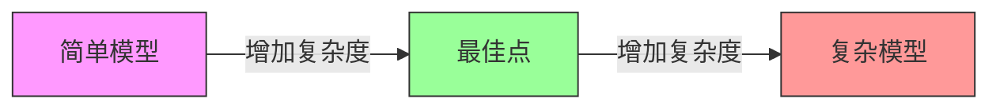
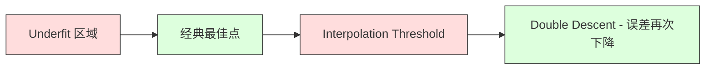
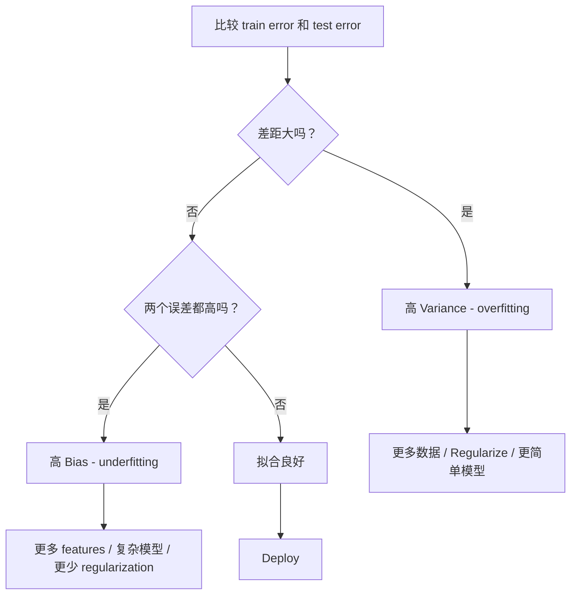
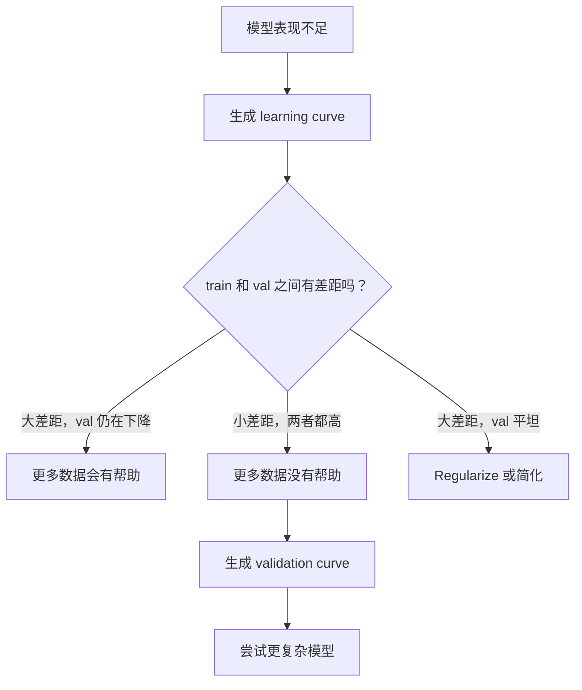

# Compartición de variaciones

> Cada tipo de error de modelo proviene de una de las tres fuentes: Prejuicios, Variantes o ruido.

**Type:** Learn
**Language:**Python
**Prerequisites:** Phase 2, Lessons 01-09（ML 基础、Regression、Classification、评估）
**Time:** ~75 分钟

## El objetivo del aprendizaje
- 推导期望预测 errores de la variación de la variación de la variación de la variación de la variación de la variación de la variación de la variación de la variación de la variación de la variación de la variación de la variación de la variación de la variación de la variación de la variación de la variación de la variación de la variación de la variación de la variación de la variación de la variación de la variación de la variación de la variación de la variación de la variación de la variación de la variación de la variación de la variación de la variación de la variación de la variación de la variación de la variación de la variación de la variación de la variación de la variación de la variación de la variación de la variación de la variación de la variación de la variación de la variación de la variación de la variación de la variación de la variación de la variación de la variación de la variación de la variación de la variación de la variación de la variación de la variación de la variación de la variación de la variación de la variación de la variación de la variación de la variación de la variación de la variación de la variación de la variación de la variación de la variación de la variación de la variación de la variación de la variación de la variación de la variación de la variación de la variación de la variación de la
- Uso de entrenamiento de errores y pruebas de errores de diagnóstico de modelos de existencia de alta prejuicio o alta variación
- 解释 Regularization 技术(L1、L2、dropout、early stopping) cómo usar el sesgo 换取 Varianza
-                                                                                                                                                                                                                                                                                                                                                                                                                                                                                                                              

##  problemas
¿Has entrenado un modelo? ¿Hay un error en los datos de los exámenes? ¿De dónde viene este error?

Si tu modelo es demasiado simple (por ejemplo, en un conjunto de datos de curvatura), continuará errando por el modelo real. Esto es el Bias. Si tu modelo es demasiado complejo (por ejemplo, en un polinomio de grado 20 en 15 puntos de datos), se adaptará perfectamente a los datos de entrenamiento, pero en los nuevos datos se predicen cambios significativos.

 Para la capacidad de un modelo fijo, no puedes minimizar ambos simultáneamente  Reducir la Preciencia, la Variación se eleva  Reducir la Variación, la Preciencia se eleva  Comprender este tradeoff es la habilidad de diagnóstico más útil en el aprendizaje automático  Dirá que debes hacer que el modelo sea más complejo o más simple, que debes obtener más datos o mejorar las características de la ingeniería, que debes fortalecer o disminuir la Regularización 

## 概念
### Prejuicios: 系统性错差

El prejuicio mide la diferencia entre el valor real y el promedio del modelo. Si se entrena en un mismo modelo en muchos conjuntos de entrenamiento diferentes de la misma distribución, y se mide el promedio del pronóstico, el prejuicio es la diferencia entre el valor medio y el valor real.

El alto sesgo significa que el modelo es demasiado duro, imposible de captar el modelo real.

```
高 Bias（underfitting）：
  模型总是预测大致相同的错误结果。
  训练误差：高
  测试误差：高
  二者差距：小
```

### Variante: sensibilidad a los datos de entrenamiento

La variación es la medida de cuántos cambios se producen cuando se practica en diferentes conjuntos de datos. Si los cambios pequeños en el conjunto de entrenamiento provocan grandes cambios en el modelo, la variación es muy alta.

Alta Variación significa que el modelo se encuentra en el ruido de los datos de entrenamiento adecuado, en lugar de la señal de fondo. El polinomio de 20 grados atravesará cada punto de entrenamiento, pero entre ellos se oscilará intensamente.

```
高 Variance（overfitting）：
  模型完美拟合训练数据，但在新数据上失败。
  训练误差：低
  测试误差：高
  二者差距：大
```

### La descomposición

Para cualquier punto x, el esperado error de previsión bajo el perdido cuadrado se puede desglosar con precisión en:

```
Expected Error = Bias^2 + Variance + Irreducible Noise

where:
  Bias^2   = (E[f_hat(x)] - f(x))^2
  Variance = E[(f_hat(x) - E[f_hat(x)])^2]
  Noise    = E[(y - f(x))^2]             (sigma^2)
```

- `f(x)`Es una función real
- `f_hat(x)`Es un modelo
- `E[...]`Es la expectativa de diferentes grupos de entrenamiento
- `y`Es la etiqueta de la observación (la verdadera función es el aumento del ruido)

En los datos de ruido, ningún modelo puede hacer mejor que sigma^2. Tu tarea es encontrar el equilibrio correcto entre el sesgo^2 y la variación.

### Complejidad del modelo frente a error



经典的 U 形曲线:

| Complexity | Bias | Variance | Total Error |
|-----------|------|----------|-------------|
| 过低 | 高 | 低 | 高（underfitting） |
| 刚刚好 | 中等 | 中等 | 最低 |
| 过高 | 低 | 高 | 高（overfitting） |

### 作为偏差变化 控制的规范化 作为偏差变化 控制的规范化 作为偏差变化 控制的规范化 作为偏差变化 控制的规范化 作为偏差变化 控制的规范化

La regularización aumentará los prejuicios para reducir la variación.

- **L2 (Ridge):**La propiedad se volverá a reducir a cero.
- **L1 (Lasso):**Se puede utilizar el sistema de control de la función de la función de la función de la función de la función de la función de la función de la función de la función de la función de la función de la función de la función de la función de la función de la función de la función de la función de la función de la función de la función de la función de la función de la función de la función de la función de la función de la función de la función de la función de la función de la función de la función de la función de la función de la función de la función de la función de la función de la función de la función de la función de la función de la función de la función de la función de la función de la función de la función de la función de la función de la función de la función de la función de la función de la función de la función de la función de la función de la función de la función de la función de la función de la función de la función de la función de la función de la función de la función de la función de la función de la función de la función de la función de la función de la función de la función de la función de la función de la función de la función de la función de la función de la función de la función de la función de la función de la función de la función de la cual se ejecutable.
- **Dropout:**Durante el entrenamiento, las neuronas se bloquean.
- **Early stopping:**En el modelo completamente adaptado entrenamiento datos antes de detener el entrenamiento.

La regularización 强度(lambda、drop-out rate、epoch 数) irá directamente controlar tu posición en la curva de la variación de sesgos―más Regularización significa más sesgos―menos variación―

### Descenso doble: 现代视角

经典理论认为: después de superar el mejor punto, más complejidad siempre es perjudicial. Pero los estudios realizados desde 2019 muestran un fenómeno inesperado. Si continuas aumentando la capacidad del modelo hasta superar el umbral de interpolación, el modelo tiene suficientes parámetros para poder encajar perfectamente en la posición del entrenamiento, el error de prueba podría disminuir nuevamente.



Este "doble descenso" explica por qué las redes neuronales sobreparametrizadas a gran escala (en el caso de las redes neuronales, el número de parámetros es mucho mayor que el de las muestras de entrenamiento) todavía pueden generalizarse muy bien.

 Sobre el doble descenso 关键观察:
- Se presenta en modelos lineales, árboles de decisión y redes neuronales.
- En la interpolación  región, más datos en realidad puede ser perjudicial
- 更多 entrenamiento épocas También puede llevar a ella(epoca-wise descenso doble)
- La regularización se planea, pero no lo elimina.

¿Por qué ocurre esta situación? En el umbral de interpolación, el modelo acaba de tener suficiente capacidad para adaptarse a todos los puntos de entrenamiento. Se ve obligado a entrar en una solución muy específica, esta solución atravesando cada punto, las pequeñas perturbaciones en los datos conducen a un cambio enorme en el umbral. Aquí es la variación.

| Regime | Parameters vs Samples | Behavior |
|--------|----------------------|----------|
| Underparameterized | p << n | 经典 tradeoff 适用 |
| Interpolation threshold | p ~ n | Variance 达到峰值，测试误差激增 |
| Overparameterized | p >> n | Implicit regularization 开始起作用，测试误差下降 |

Desde el punto de vista práctico: si utilizas redes neuronales o grandes conjuntos de árboles, no te detengas en el umbral de interpolación, o bien bien bien lejos de ella, o bien bien bien lejos de ella.

### Diagnosticando su modelo



| Symptom | Diagnosis | Fix |
|---------|-----------|-----|
| 高 train error，高 test error | Bias | 更多 features、复杂模型、更少 regularization |
| 低 train error，高 test error | Variance | 更多数据、regularization、更简单模型、dropout |
| 低 train error，低 test error | 拟合良好 | Ship it |
| Train error 下降，test error 上升 | Overfitting 正在发生 | Early stopping |

### Estrategias prácticas

**当 Bias 是问题时：**
- 添加 polinomio o características de interacción
- Uso de modelos más flexibles (por ejemplo, uso de árboles en lugar de lineal)
-  降低 fuerza de regularización
- 訓練更久 (si aún no ha recibido)

**当 Variance 是问题时：**
-  obtener más datos de entrenamiento
- Uso de bolsas (foresta aleatoria)
- 增加 regularisation ((更高 lambda、更多 abandono)
- Selección de características (muy noido)
- Utiliza la validación cruzada  Como pronto lo encuentre

### Métodos de ensamblaje y diferencia de reducción

Los métodos de ensamblaje son los instrumentos más prácticos para la lucha contra la variación.

**Bagging (Bootstrap Aggregating)**Las muestras de diferentes arranques de datos de entrenamiento se entrenan en varios modelos, luego se prevé que el promedio. Cada modelo individual tiene una alta variación, pero la variación media tiene que ser mucho menor.

Es matemáticamente válido porque si la media de N 个独立预测, cada variación de la predicción es sigma^2, entonces la variación de la media de valor es sigma^2 / N. Estos modelos no son realmente independientes, por lo que la reducción de la amplitud es menor que 1/N, pero sigue siendo bastante observable.

**Boosting**通过顺序构建模型来降低 Bias, cada uno de los nuevos modelos se centran en los errores del conjunto actual.  El aumento de gradiente y el AdaBoost son ejemplos principales.

| Method | Primary Effect | Bias Change | Variance Change |
|--------|---------------|-------------|-----------------|
| Bagging | 降低 Variance | 不变 | 降低 |
| Boosting | 降低 Bias | 降低 | 可能增加 |
| Stacking | 同时降低两者 | 取决于 meta-learner | 取决于 base models |
| Dropout | Implicit bagging | 略微增加 | 降低 |

**实践规则：**Si tu modelo base tiene altas variaciones (árboles profundos, polinomios de alto grado), usa embalaje (sacking). Si tu modelo base tiene altas prejuicios (shallow stumps, simple linear models), usa impulso (boosting).

### Curvas de aprendizaje

Las curvas de aprendizaje se trazarán como un conjunto de funciones de entrenamiento de tamaño pequeño. Son las herramientas de diagnóstico más prácticas que usted tenga.


¿Cómo las interpretar?

| Scenario | Training Error | Validation Error | Gap | What It Means | What to Do |
|----------|---------------|-----------------|-----|---------------|------------|
| 高 Bias | 高 | 高 | 小 | 模型无法捕捉模式 | 更多 features、复杂模型、更少 regularization |
| 高 Variance | 低 | 高 | 大 | 模型记忆训练数据 | 更多数据、regularization、更简单模型 |
| 拟合良好 | 中等 | 中等 | 小 | 模型 generalizes well | Ship it |
| 高 Variance，正在改善 | 低 | 随更多数据下降 | 缩小 | 数据可以修复的 Variance 问题 | 收集更多数据 |
| 高 Bias，平坦 | 高 | 高且平坦 | 小且平坦 | 更多数据没有帮助 | 改变 model architecture |

关键洞察: Si las dos curvas están a la altura, la diferencia es pequeña pero los dos errores son altos, no se usan más datos. Necesitas un mejor modelo.

### cómo generar curvas de aprendizaje

Hay dos métodos:

**Approach 1: 改变训练集大小，固定模型。**保持模型和超参数 不变──在越来越大的训练数据集上训练──测量每小小下的训练误差和验证误差──这是标准学习曲线──

**Approach 2: 改变模型复杂度，固定数据。**保持数据不变──扫描一个复杂度参数(grado polinómico、altura de árbol、capas 数量)── medir cada complejidad bajo el error de entrenamiento y el error de prueba── esta es una curva de validación, mostrará directamente el Tradeoff de variación de sesgo──

Estos dos métodos se complementan entre sí. El primero le dice si más datos ayudan. El segundo le dice si diferentes modelos ayudan. Antes de decidir el siguiente paso, ambos deben funcionar.




```figure
bias-variance
```

## Construirlo
`code/bias_variance.py`Se trata de un método de forma gradual.

### Paso 1: generación de datos de la función conocida

Nosotros usamos con el ruido gaussiano de `f(x) = sin(1.5x) + 0.5x`◊ saber las funciones reales nos permite calcular con precisión los prejuicios y las variaciones.

```python
def true_function(x):
    return np.sin(1.5 * x) + 0.5 * x

def generate_data(n_samples=30, noise_std=0.5, x_range=(-3, 3), seed=None):
    rng = np.random.RandomState(seed)
    x = rng.uniform(x_range[0], x_range[1], n_samples)
    y = true_function(x) + rng.normal(0, noise_std, n_samples)
    return x, y
```

### Paso 2: Muestreo de bootstrap y ajuste polinómico

 Para cada grado polinómico, extraemos muchos conjuntos de entrenamiento de arranque, adaptamos el polinomio y fijamos la cuadrícula de prueba  记录预测── esto proporcionará una distribución de predicción para cada prueba.

```python
def fit_polynomial(x_train, y_train, degree, lam=0.0):
    X = np.column_stack([x_train ** d for d in range(degree + 1)])
    if lam > 0:
        penalty = lam * np.eye(X.shape[1])
        penalty[0, 0] = 0
        w = np.linalg.solve(X.T @ X + penalty, X.T @ y_train)
    else:
        w = np.linalg.lstsq(X, y_train, rcond=None)[0]
    return w
```

Se encuentran en 200 muestras de arranque diferentes, pero contienen puntos diferentes.

### 步骤 3: Computación de la desviación de la variación

Con 200 grupos de predicción en cada punto de prueba, podemos calcular directamente según la definición:

```python
mean_pred = predictions.mean(axis=0)
bias_sq = np.mean((mean_pred - y_true) ** 2)
variance = np.mean(predictions.var(axis=0))
total_error = np.mean(np.mean((predictions - y_true) ** 2, axis=1))
```

- `mean_pred`Es de muestras de arranque  estimación de E[f_hat(x)
- `bias_sq`Es el cuadrado de la diferencia entre el valor promedio y el valor real
- `variance`Es decir, el número de muestras de bootstrap de la empresa de la empresa de la empresa de la empresa de la empresa de la empresa de la empresa de la empresa de la empresa de la empresa de la empresa de la empresa de la empresa de la empresa de la empresa de la empresa de la empresa de la empresa de la empresa de la empresa de la empresa de la empresa de la empresa de la empresa de la empresa de la empresa de la empresa de la empresa de la empresa de la empresa de la empresa de la empresa de la empresa de la empresa de la empresa de la empresa de la empresa de la empresa de la empresa de la empresa de la empresa de la empresa de la marca de la marca de la marca de la marca de la marca de la marca de la marca de la marca de la marca de la marca de la marca de la marca de la marca de la marca de la marca de la marca de la marca de la marca de la marca de la marca de la marca de la marca de la marca de la marca de la marca de la marca de la marca de la marca de la marca de la marca de la marca de la marca de la marca de la marca de la marca de la marca de la marca de la marca de la marca de la marca de la marca de la marca de la marca de la marca de la marca de la marca de la marca de la marca de la marca de la marca de la marca de la marca de la marca de la marca de la marca de la marca de la marca de la marca de la marca de la marca de la marca de la marca de la marca de la marca de la marca de la marca de la marca de la marca de la marca de la marca de la marca de la marca de la marca de la marca de la marca de la marca de la marca de la marca de la marca de la marca de la marca de marca de la marca de marca de marca de la marca de la marca de la marca de la marca de marca de la marca de marca de marca de la marca de la marca de marca de la marca de marca de marca de la marca de marca de marca de marca de marca de marca de marca de marca de marca de marca de marca de marca de marca de marca de marca de marca de marca de marca de marca de marca de marca de marca de marca de marca de marca de marca de marca de marca de marca de marca de marca de marca de marca de marca de marca de marca de marca de marca de marca de marca de marca de
- `total_error` debería aproximarse igual a sesgo^2 + variación + ruido

### Paso 4: Curvas de aprendizaje

Las curvas de aprendizaje en mantener la complejidad del modelo fija mientras que las curvas de aprendizaje son grandes. Muestran que tu modelo es limitado por datos o por capacidad.

```python
def demo_learning_curves():
    sizes = [10, 15, 20, 30, 50, 75, 100, 150, 200, 300]
    degree = 5

    for n in sizes:
        train_errors = []
        test_errors = []
        for seed in range(50):
            x_train, y_train = generate_data(n_samples=n, seed=seed * 100)
            w = fit_polynomial(x_train, y_train, degree)
            train_pred = predict_polynomial(x_train, w)
            train_mse = np.mean((train_pred - y_train) ** 2)
            test_pred = predict_polynomial(x_test, w)
            test_mse = np.mean((test_pred - y_test) ** 2)
            train_errors.append(train_mse)
            test_errors.append(test_mse)
        # 对多次运行取平均，得到 learning curve 上的点
```

对于高变化模型 (小数据上的 grado 5), verás:
- El error de entrenamiento al principio era muy bajo, con más datos hace que la memoria sea difícil de mejorar.
- 测试差一开始很高, con el modelo obtener más señales y bajar
- La diferencia se reduce con más datos

对于高偏见 模型 ((1°), dos errores rápidamente reciben el mismo valor alto, más datos no ayudan.

### Sector de la industria y la industria

代码 también contiene `demo_regularization_sweep()`, fija un polinomio de alto grado (grado 15), y se va a regular la fuerza de la Ridge de 0,001 扫描到100── esto muestra desde otro ángulo el Tradeoff de Bias-Variance: nosotros no cambiamos la complejidad del modelo, sino cambiar la intensidad del grupo──

```python
def demo_regularization_sweep():
    alphas = [0.001, 0.005, 0.01, 0.05, 0.1, 0.5, 1.0, 5.0, 10.0, 50.0, 100.0]
    for alpha in alphas:
        results = bias_variance_decomposition([15], lam=alpha)
        r = results[15]
        print(f"alpha={alpha:.3f}  bias={r['bias_sq']:.4f}  var={r['variance']:.4f}")
```

En el bajo alfa, bajo el grado 15, el polinomio  casi no está limitado. La variación  dominante, ya que el modelo persegue el ruido de cada muestra de arranque. En el alto alfa, el castigo es fuerte para que el modelo se convierta en una función de la constante.

Esto se produce con el grado de cambio polinómico, que obtiene la misma curva U, pero se puede controlar con el ciclo continuo en lugar de separar opciones. En la práctica, la regularización es la forma preferida de controlar el tradeoff, ya que permite el control de la granulometría, sin necesidad de cambiar el conjunto de características.

## Usalo
sklearn  proporcionar `learning_curve`Y `validation_curve`, puede automatizar estos diagnósticos, sin necesidad de escribir bucles de arranque.

### Curva de validación: análisis Complejidad del modelo

```python
from sklearn.model_selection import validation_curve
from sklearn.pipeline import make_pipeline
from sklearn.preprocessing import PolynomialFeatures
from sklearn.linear_model import Ridge

degrees = list(range(1, 16))
train_scores_all = []
val_scores_all = []

for d in degrees:
    pipe = make_pipeline(PolynomialFeatures(d), Ridge(alpha=0.01))
    train_scores, val_scores = validation_curve(
        pipe, X, y, param_name="polynomialfeatures__degree",
        param_range=[d], cv=5, scoring="neg_mean_squared_error"
    )
    train_scores_all.append(-train_scores.mean())
    val_scores_all.append(-val_scores.mean())
```

Esto te dará directamente la curva de comercio de variaciones de sesgo. Cuando el puntaje de validación comparado con el puntaje del tren, la variación ocupa la posición dominante.

### Curva de aprendizaje: tamaño del conjunto de entrenamiento

```python
from sklearn.model_selection import learning_curve

pipe = make_pipeline(PolynomialFeatures(5), Ridge(alpha=0.01))
train_sizes, train_scores, val_scores = learning_curve(
    pipe, X, y, train_sizes=np.linspace(0.1, 1.0, 10),
    cv=5, scoring="neg_mean_squared_error"
)
train_mse = -train_scores.mean(axis=1)
val_mse = -val_scores.mean(axis=1)
```

¿ Qué ?`train_mse`Y `val_mse`En comparación con`train_sizes`El dibujo de la curva te dice todo sobre el modelo.

### Utiliza la regularización 扫描的 cruzada validación

```python
from sklearn.model_selection import cross_val_score

alphas = [0.001, 0.01, 0.1, 1.0, 10.0, 100.0]
for alpha in alphas:
    pipe = make_pipeline(PolynomialFeatures(10), Ridge(alpha=alpha))
    scores = cross_val_score(pipe, X, y, cv=5, scoring="neg_mean_squared_error")
    print(f"alpha={alpha:>7.3f}  MSE={-scores.mean():.4f} +/- {scores.std():.4f}")
```

Esto se debe a la complejidad fija del modelo de la fuerza de regularización de la exploración. Usted verá el mismo Bias-Variance Tradeoff: bajo alfa significa alta varianza, alto alfa significa alta Bias.

### 整合起来: diagnóstico completo Flujo de trabajo

En la práctica, usted hará estos diagnósticos en orden.

1. 訓練你的模型──计算列车 和 prueba error──
2. Si los dos están altos: tienes prejuicios  problema ∞
3. Si el tren 低但测 高:你有变化 问题── generar una curva de aprendizaje, ver si más datos ayudan―. Si no, regularizar―.
4. Cumplir la curva de validación, analizar los principales parámetros de complejidad.
5. En el mejor de los puntos, genera una curva de aprendizaje. Si la diferencia sigue siendo grande, necesitas más datos o regularización.
6. Uso `cross_val_score`尝试不同 alpha 值的 Ridge/Lasso── seleccionar el error de validación cruzada, el más bajo de los alfa──

Para la mayoría de los conjuntos de datos tablales, esto requiere 10-15 minutos de tiempo de cálculo, pero puede ahorrar un número de horas de adivinación 

##  entregarlo
本课产 出:`outputs/prompt-model-diagnostics.md`

##  ejercicios
1. Uso `noise_std=0`¿Qué ocurrirá? ¿La complejidad mejor cambiará?

2. ¿Cómo afectará esto el componente de variación? ¿El grado polinómico óptimo se moverá?

3. Para experimentar la regularización de L2 (Ridge regreso) ⋅ para un polinomio de alto grado fijo (grado 15) ⋅ para calcular la variación de la función de variación de la lambda ⋅ para calcular la variación de la variación de la variación de la variación de la lambda ⋅ para calcular la variación de la variación de la variación de la variación de la variación de la longitud de la longitud de la longitud de la longitud de la longitud de la longitud de la longitud de la longitud de la longitud de la longitud de la longitud de la longitud de la longitud de la longitud de la longitud de la longitud de la longitud de la longitud de la longitud de la longitud de la longitud de la longitud de la longitud de la longitud de la longitud de la longitud de la longitud de la longitud de la longitud de la longitud de la longitud de la longitud de la longitud de la longitud de la longitud de la longitud de la longitud de la longitud de la longitud de la longitud de la longitud de la longitud de la longitud de la longitud de la longitud de la longitud de la longitud de la longitud de la longitud de la longitud de la longitud de la longitud de la longitud de la longitud de la longitud de la longitud de la longitud de la longitud de la longitud de la longitud de la longitud de la longitud de la longitud de la longitud de la longitud de la longitud de la longitud de la longitud de la longitud de la longitud de la longitud de la longitud de la longitud de la longitud de la longitud de la longitud de la longitud de la longitud de la longitud de la longitud de la longitud de la longitud de la longitud de la longitud de la longitud de la longitud de la longitud de la longitud de la longitud de la longitud de la longitud de la longitud de la longitud de la longitud de la longitud de la longitud de la longitud de la longitud de la longitud de la longitud de la longitud de la longitud de la longitud de la longitud de la longitud de la longitud de la longitud de la longitud de la longitud de la longitud de la longitud de la longitud de la longitud de la longitud de la longitud de la longitud de la longitud de la longitud de la longitud de la longitud de la longitud de la longitud de la longitud de la longitud de la longitud de la longitud de la longitud de la longitud de la longitud de la longitud de la longitud de la longitud de la longitud de la longitud de la longitud de la longitud de la longitud de la longitud de

4. 将真实函数 de polinomio 修改为 `sin(x)`¿Cómo se ha cambiado la variación de sesgo? ¿Existe todavía un grado óptimo de claridad?

5. 实现一个简单的bootstrap agregando(bagging) wrapper: en muestras de bootstrap 上训练 10 个模型并平均预测──展示这会降低变化,且几乎不增加偏见──

## 关键术语: "El hombre es un hombre"
| Term | What people say | What it actually means |
|------|----------------|----------------------|
| Bias | “模型太简单” | 来自错误假设的系统性误差。平均模型预测与真实值之间的差距。 |
| Variance | “模型在 overfitting” | 来自对训练数据敏感性的误差。预测在不同训练集之间变化的程度。 |
| Irreducible error | “数据中的噪声” | 来自真实数据生成过程中的随机性的误差。没有模型能消除它。 |
| Underfitting | “学得不够” | 模型有高 Bias。即使在训练数据上也会错过真实模式。 |
| Overfitting | “记住了数据” | 模型有高 Variance。它拟合了训练数据中无法 generalize 的噪声。 |
| Regularization | “约束模型” | 添加惩罚来降低模型复杂度，用 Bias 换取更低 Variance。 |
| Double descent | “更多参数可能有帮助” | 当模型容量远超 interpolation threshold 时，测试误差会再次下降。 |
| Model complexity | “模型有多灵活” | 模型拟合任意模式的容量。由 architecture、features 或 regularization 控制。 |

## 延伸阅读
- [Hastie, Tibshirani, Friedman: Elements of Statistical Learning, Ch. 7](https://hastie.su.domains/ElemStatLearn/)-- Bias-Variance 分解的权威论述
- [Belkin et al., Reconciling modern machine learning practice and the bias-variance trade-off (2019)](https://arxiv.org/abs/1812.11118)-- doble descenso 论文
- [Nakkiran et al., Deep Double Descent (2019)](https://arxiv.org/abs/1912.02292)-- de acuerdo con la época y el doble descenso de la muestra
- [Scott Fortmann-Roe: Understanding the Bias-Variance Tradeoff](http://scott.fortmann-roe.com/docs/BiasVariance.html)-- 清晰的可视化解释 (explicación de la visión de la luz)
