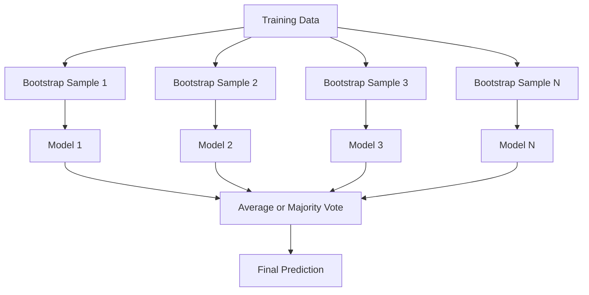
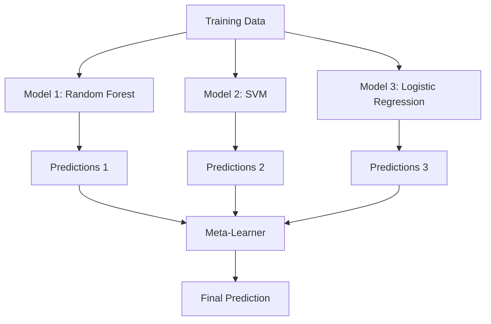

# Métodos de ensamblaje

> Un grupo de estudiantes débiles, si se correctamente forman, se convertirán en un aprendiz fuerte.

**Type:** Build
**Language:**Python
**Prerequisites:** Phase 2, Lesson 10 (Bias-Variance Tradeoff)
**Time:** ~120 分钟

## El objetivo del aprendizaje

- Desde el zero lograr AdaBoost y gradiente de aumento,并 explicar el aumento  cómo por orden reducir el sesgo
- Construir un conjunto de embalaje, y mostrar a los modelos relacionados cómo reducir la variación en un caso de no aumentar el sesgo
- Desde cada método se dirige a componentes de error desde el punto de vista de la embalaje, el refuerzo y la embalaje
-  evalúa la diversidad del conjunto,并 explica por qué con la incorporación de más estudiantes débiles independientes, la precisión de la mayoría de los votos aumentará

##  problemas

单个决策树 训练速度快且易解释,但会过. 单个线性模型在复杂边界上会过. 单个线性模型在复杂边界上会过. 您可以花几天时间设计完美的模型架构. 或, usted puede reunir un montón de modelos imperfectos, obtener un resultado mejor que cualquiera de ellos.

Los métodos de ensamblaje se hacen así. Son los datos tablales de la competencia de la tecnología más fiable, apoyan la mayoría de los sistemas de producción de ML, y muestran de forma real el efecto real de la compensación de variaciones de sesgo.

## 概念

### ¿Por qué los conjuntos son efectivos?

假设你有N 个独立分类器, cada una de ellas tiene una precisión de p > 0.5──la precisión de la mayoría de los votos 为:

```
P(majority correct) = sum over k > N/2 of C(N,k) * p^k * (1-p)^(N-k)
```

 Para 21  la precisión  media es del 60% de los clasificadores, la precisión de la mayoría de votos  aproximadamente es del 74% Si hay 101  clasificadores, se elevará al 84% Cuando el modelo comete diferentes errores, los errores se oponen mutuamente

关键要求是 **diversity**Si todos los modelos cometen los mismos errores, la combinación de ellos no ayuda. Los modelos son efectivos porque generan modelos diversos de la siguiente manera:

- No es igual.
- Diferentes subconjuntos de características (patio de bosques aleatorios)
- 顺序式 corrección de error(refuerzo)
- Diferente de modelos familiares

### El producto se utiliza para la fabricación de productos de la industria de la industria de la industria de la industria de la industria de la industria de la industria de la industria de la industria de la industria de la industria de la industria de la industria de la industria de la industria de la industria de la industria de la industria de la industria de la industria de la industria de la industria de la industria de la industria de la industria de la industria de la industria de la industria de la industria de la industria de la industria de la industria de la industria de la industria de la industria de la industria de la industria de la industria de la industria de la industria de la industria de la industria de la industria de la industria de la industria de la industria de la industria de la industria de la industria de la Unión.

Saqueando datos de diferentes muestras de arranque de entrenamiento para crear diversidad en cada modelo de entrenamiento.



La muestra de bootstrap es la misma que la muestra de extracción obtenida de los datos originales. En cada bootstrap, el 63,2% de las muestras originales aparecen. El 36,8% restante de las muestras extraídas de la bolsa) proporciona un conjunto de validación gratuito.

El embalaje en casi ningún aumento de sesgo reduce la variación. Cada árbol individual se sobrepone a su propia muestra de arranque, pero el sobrepone de cada árbol es diferente, por lo que se necesita una media para evitar el ruido.

**Random Forests**Es un mecanismo extra de embalaje: en cada división, sólo se considera el subconjunto de características de cada momento. Esto obliga a generar más diversidad entre los árboles.`sqrt(n_features)`, y la Regresión en medio de`n_features / 3`¿Qué es eso?

### Mejorando(顺序式 Corrección de error)

Mejorar el modelo de entrenamiento en orden. Cada nuevo modelo está preocupado por ejemplos de errores previos.


Incentivo  Reducción de sesgo― Cada nuevo modelo se corrige correctamente ante el conjunto de errores sistemáticos― La predicción final es la suma ponderada de todos los modelos, en los que los mejores modelos que se muestran obtendrán un mayor peso―.

Peso en: si se ejecuta demasiada rueda, el impulso puede ser demasiado adecuado, ya que se adaptará continuamente a ejemplos más difíciles, mientras que algunos de ellos pueden ser sólo ruido.

### AdaBoost

AdaBoost (Aumento Adaptivo) es el primer algoritmo de impulso práctico. Puede ser utilizado con cualquier estudiante base, usualmente con troncos de decisión (deep-1 trees)

算法:

```
1. Initialize sample weights: w_i = 1/N for all i

2. For t = 1 to T:
   a. Train weak learner h_t on weighted data
   b. Compute weighted error:
      err_t = sum(w_i * I(h_t(x_i) != y_i)) / sum(w_i)
   c. Compute model weight:
      alpha_t = 0.5 * ln((1 - err_t) / err_t)
   d. Update sample weights:
      w_i = w_i * exp(-alpha_t * y_i * h_t(x_i))
   e. Normalize weights to sum to 1

3. Final prediction: H(x) = sign(sum(alpha_t * h_t(x)))
```

El modelo más bajo obtendrá un alfa más alto. Las muestras de clasificación errónea obtendrán pesos más altos, permita que el siguiente modelo se centre en ellos.

### Un aumento gradual

El aumento de gradiente aumentará la generalización a la función de pérdida arbitraria. No es una reapreciación de muestras, sino que permite que cada nuevo modelo se adapte a los residuos del conjunto actual.

```
1. Initialize: F_0(x) = argmin_c sum(L(y_i, c))

2. For t = 1 to T:
   a. Compute pseudo-residuals:
      r_i = -dL(y_i, F_{t-1}(x_i)) / dF_{t-1}(x_i)
   b. Fit a tree h_t to the residuals r_i
   c. Find optimal step size:
      gamma_t = argmin_gamma sum(L(y_i, F_{t-1}(x_i) + gamma * h_t(x_i)))
   d. Update:
      F_t(x) = F_{t-1}(x) + learning_rate * gamma_t * h_t(x)

3. Final prediction: F_T(x)
```

Para la pérdida cuadrada de error, los pseudo-residuos son los residuos reales:`r_i = y_i - F_{t-1}(x_i)`◊ Cada árbol                                                                                                                                                                                                                                                                                                                                                                                                                                                                                                                         

Rate de aprendizaje (concisión) control de cada árbol grado de contribución.

### XGBoost: ¿Por qué es que se ejecuta Datos tablales

XGBoost (eXtreme Gradient Boosting) es un aumento de gradientes de ingeniería optimizada, que hace que sea rápido, preciso y no fácil de sobresalir:

- **Regularized objective:**Para los pesos de las hojas 施1 y L2 penalidades, evitar el árbol  exceso de confianza
- **Second-order approximation:**Con el mismo tiempo utilizar los derivados de primera y segunda etapa de pérdida, para tomar mejores decisiones de división
- **Sparsity-aware splits:**                                                                                                                                                                                                                                                              
- **Column subsampling:**Como los bosques aleatorios, en cada división, las características se toman para aumentar la diversidad
- **Weighted quantile sketch:**En los datos distribuidos 上高效 buscar características continuas de puntos de división
- **Cache-aware block structure:** para las líneas de caché de CPU  optimización de la disposición de la memoria

 Para los datos tablales, XGBoost (y su sucesor LightGBM) continúa mejor que la Red Neural― esto no cambiará en el corto plazo― si tus datos pueden ser colocados en el cuadro de las filas y columnas , por favor, comience con el aumento de gradiente 

### La acumulación (Meta-Learning)

La acumulación de predicciones de varios modelos básicos como características de meta-aprendizaje 



El meta-aprendizaje aprenderá para qué entradas debería confiar en qué modelo base. Si el bosque aleatorio en ciertas regiones se desempeña mejor, mientras que el SVM en otras regiones se desempeña mejor, el meta-aprendizaje aprenderá a realizar el proceso de correspondencia.

Para evitar la fuga de datos, las predicciones del modelo base deben pasar por el conjunto de entrenamiento de validación cruzada.

### Votación

La más simple de los conjuntos.

- **Hard voting:**En el caso de las etiquetas de clase, se vota por mayoría.
- **Soft voting:**Para las probabilidades previstas 求平均, seleccionar la probabilidad media de la clase máxima―, normalmente es mejor, ya que utiliza información de confianza―.


```figure
f3-ensemble-average
```

## Construirlo

### 步骤 1: Decision Stump (Primero aprendiz)

`code/ensembles.py`En el código medio desde cero todo se ha logrado.

```python
class DecisionStump:
    def __init__(self):
        self.feature_idx = None
        self.threshold = None
        self.polarity = 1
        self.alpha = None

    def fit(self, X, y, weights):
        n_samples, n_features = X.shape
        best_error = float("inf")

        for f in range(n_features):
            thresholds = np.unique(X[:, f])
            for thresh in thresholds:
                for polarity in [1, -1]:
                    pred = np.ones(n_samples)
                    pred[polarity * X[:, f] < polarity * thresh] = -1
                    error = np.sum(weights[pred != y])
                    if error < best_error:
                        best_error = error
                        self.feature_idx = f
                        self.threshold = thresh
                        self.polarity = polarity

    def predict(self, X):
        n = X.shape[0]
        pred = np.ones(n)
        idx = self.polarity * X[:, self.feature_idx] < self.polarity * self.threshold
        pred[idx] = -1
        return pred
```

### Paso 2: Implementar AdaBoost desde cero

```python
class AdaBoostScratch:
    def __init__(self, n_estimators=50):
        self.n_estimators = n_estimators
        self.stumps = []
        self.alphas = []

    def fit(self, X, y):
        n = X.shape[0]
        weights = np.full(n, 1 / n)

        for _ in range(self.n_estimators):
            stump = DecisionStump()
            stump.fit(X, y, weights)
            pred = stump.predict(X)

            err = np.sum(weights[pred != y])
            err = np.clip(err, 1e-10, 1 - 1e-10)

            alpha = 0.5 * np.log((1 - err) / err)
            weights *= np.exp(-alpha * y * pred)
            weights /= weights.sum()

            stump.alpha = alpha
            self.stumps.append(stump)
            self.alphas.append(alpha)

    def predict(self, X):
        total = sum(a * s.predict(X) for a, s in zip(self.alphas, self.stumps))
        return np.sign(total)
```

### Paso 3: Implementar el impulso gradual desde cero

```python
class GradientBoostingScratch:
    def __init__(self, n_estimators=100, learning_rate=0.1, max_depth=3):
        self.n_estimators = n_estimators
        self.lr = learning_rate
        self.max_depth = max_depth
        self.trees = []
        self.initial_pred = None

    def fit(self, X, y):
        self.initial_pred = np.mean(y)
        current_pred = np.full(len(y), self.initial_pred)

        for _ in range(self.n_estimators):
            residuals = y - current_pred
            tree = SimpleRegressionTree(max_depth=self.max_depth)
            tree.fit(X, residuals)
            update = tree.predict(X)
            current_pred += self.lr * update
            self.trees.append(tree)

    def predict(self, X):
        pred = np.full(X.shape[0], self.initial_pred)
        for tree in self.trees:
            pred += self.lr * tree.predict(X)
        return pred
```

### Paso 4: Comparar con el mercado

代码会验证 Nuestras implementaciones desde cero si pueden producirse con sklearn `AdaBoostClassifier`Y `GradientBoostingClassifier`La exactitud de la comparación es similar a la de la comparación de todos los métodos.

## Usalo

### ¿Cuándo usar cada método

| Method | Reduces | Best for | Watch out for |
|--------|---------|----------|---------------|
| Bagging / Random Forest | Variance | noisy data、features 很多 | 对 bias 没有帮助 |
| AdaBoost | Bias | clean data、简单 base learners | 对 outliers 和 noise 敏感 |
| Gradient Boosting | Bias | tabular data、比赛 | 训练慢，不调参容易 overfit |
| XGBoost / LightGBM | Both | 生产环境 tabular ML | hyperparameters 很多 |
| Stacking | Both | 争取最后 1-2% accuracy | 复杂，存在 meta-learner overfitting 风险 |
| Voting | Variance | 快速组合 diverse models | 只有在模型足够 diverse 时才有帮助 |

### Datos tablales de la pila de producción

Para la mayoría de los problemas de predicción tabular, se sugiere que se realicen los siguientes ensayos:

1. Uso de los valores de**LightGBM 或 XGBoost**
2. 调优 n_estimators、learning_rate、max_depth、min_child_weight
3. Si se necesita una mejora del 0,5% final, construye un conjunto de apilamiento que contenga 3-5 modelos diversos
4. Válido cruzado de uso completo

Aunque el estudio continúa, la Red Neural en los datos tabulares es casi siempre un incremento en el gradiente de la diferencia.

##  entregarlo

本课会产出                                                                                                                                                                                                                                                                                                                                                                                                                                                                                                                         `outputs/prompt-ensemble-selector.md`-- Una ayuda para que usted para un conjunto de datos determinado  seleccionar el método de conjunto adecuado  describir sus datos  tamaño  tipos de características  nivel de ruido  balance de clases) y el problema que está resolviendo  Este prompt le guiará a completar una lista de verificación de decisión, sugerir un método, sugerir para iniciar los hiperparámetros,并提醒该方法常见错误── también se producirá `outputs/skill-ensemble-builder.md`, que contiene la dirección de selección completa.

##  ejercicios

1. 修改 AdaBoost 实现, seguir la precisión de entrenamiento cada una de las rondas posteriores― dibujar la precisión frente al número de estimadores―¿¿¿¿¿¿¿¿¿¿¿¿¿¿¿¿¿¿¿¿¿¿¿¿¿¿¿¿¿¿¿¿¿¿¿¿¿¿¿¿¿¿¿¿¿¿¿¿¿¿¿¿¿¿¿¿¿¿¿¿¿¿¿¿¿¿¿¿¿¿¿¿¿¿¿¿¿¿¿¿¿¿¿¿¿¿¿¿¿¿¿¿¿¿¿¿¿¿¿¿¿¿¿¿¿¿¿¿¿¿¿¿¿¿¿¿¿¿¿¿¿¿¿¿¿¿¿¿¿¿¿¿¿¿¿¿¿¿¿¿¿¿¿¿¿¿¿¿¿¿¿¿¿¿¿¿¿¿¿¿¿¿¿¿¿¿¿¿¿¿¿¿¿¿¿¿¿¿¿¿¿¿¿¿¿¿¿¿¿¿¿¿¿¿¿¿¿¿¿¿¿¿¿¿¿¿¿¿¿¿¿¿¿¿¿¿¿¿¿¿¿¿¿¿¿¿¿¿¿¿¿¿¿¿¿¿¿¿¿¿¿¿¿¿¿¿¿¿¿¿¿¿¿¿¿¿¿¿¿¿¿¿¿¿¿¿¿¿¿¿¿¿¿¿¿¿¿¿¿¿¿¿¿¿¿¿¿¿¿¿¿¿¿¿¿¿¿¿¿¿¿¿¿¿¿¿¿¿¿¿¿¿¿¿¿¿¿¿¿¿¿¿¿¿¿¿¿¿¿¿¿¿¿¿¿¿¿¿¿¿¿¿¿¿¿¿¿¿¿¿¿¿¿¿¿¿¿¿¿¿¿¿¿¿¿¿¿¿¿¿¿¿¿¿¿¿¿¿¿¿¿¿¿¿¿¿¿¿¿¿¿¿¿¿¿¿¿¿¿¿¿¿¿¿¿¿¿¿¿¿¿¿¿¿¿¿¿¿¿¿¿¿¿¿¿¿¿¿¿¿¿¿¿¿¿¿¿¿¿¿¿¿¿¿¿¿¿¿¿¿¿¿¿¿¿¿¿¿¿¿¿¿¿¿¿¿¿¿¿¿¿¿¿¿

2. 通过向回归树 添加随机特征子样本,从零实现一个随机森林──使用 `max_features=sqrt(n_features)`训练 100 树 并对预测 求平均――将变差减少与单树比较――

3. En el aumento de gradiente 实现中添加早期停止: cada ronda después de seguir la pérdida de validación, si las 10 radas continuas no se elevan entonces se detiene.

4. Construir un conjunto de empilhamiento de un metaaprendizaje de regresión logística (con tres modelos básicos)                                                                                                                                                                                                                                                

5. En el mismo conjunto de datos, la función de XGBoost se ejecuta con un parámetro por defecto. ¿Cuál es la diferencia de velocidad entre el parámetro de datos y el parámetro de datos?

## 关键术语: "El hombre es un hombre"

| Term | 常见说法 | 实际含义 |
|------|----------------|----------------------|
| Bagging | “在 random subsets 上训练” | Bootstrap aggregating：在 bootstrap samples 上训练模型，对 predictions 求平均以降低 variance |
| Boosting | “关注 hard examples” | 按顺序训练模型，每个模型纠正当前 ensemble 的错误，以降低 bias |
| AdaBoost | “重新加权数据” | 通过 sample weight updates 实现 boosting；misclassified points 会在下一个 learner 中获得更高 weight |
| Gradient boosting | “拟合 residuals” | 通过让每个新模型拟合 Loss Function 的 negative Gradient 来实现 boosting |
| XGBoost | “Kaggle 武器” | 带有 regularization、second-order optimization 和系统级加速技巧的 gradient boosting |
| Stacking | “模型叠在模型上” | 将 base models 的 predictions 作为 meta-learner 的 input features |
| Random forest | “许多 randomized trees” | 使用 decision trees 的 bagging，并在每次 split 时加入 random feature subsampling 以增加 diversity |
| Ensemble diversity | “犯不同错误” | 模型的错误必须不相关，ensemble 才能优于单个模型 |
| Out-of-bag error | “免费 validation” | 不在某次 bootstrap draw 中的 samples（约 36.8%）可作为 validation set，无需单独 holdout |

## 延伸阅读

- [Schapire & Freund: Boosting: Foundations and Algorithms](https://mitpress.mit.edu/9780262526036/)-- AdaBoost 创建者所著的书
- [Friedman: Greedy Function Approximation: A Gradient Boosting Machine (2001)](https://statweb.stanford.edu/~jhf/ftp/trebst.pdf)-- original gradiente de aumento 论文
- [Chen & Guestrin: XGBoost (2016)](https://arxiv.org/abs/1603.02754)-- XGBoost 论文
- [Wolpert: Stacked Generalization (1992)](https://www.sciencedirect.com/science/article/abs/pii/S0893608005800231)-- 原始堆 论文
- [scikit-learn Ensemble Methods](https://scikit-learn.org/stable/modules/ensemble.html)-- 实用参考
