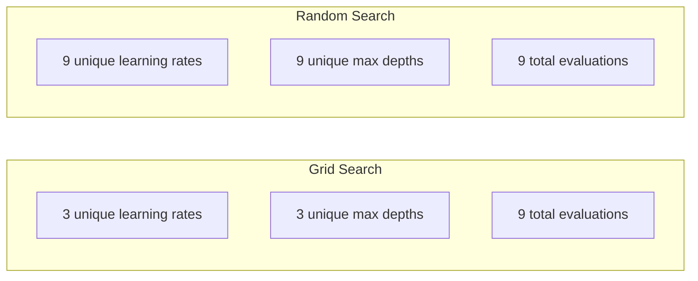
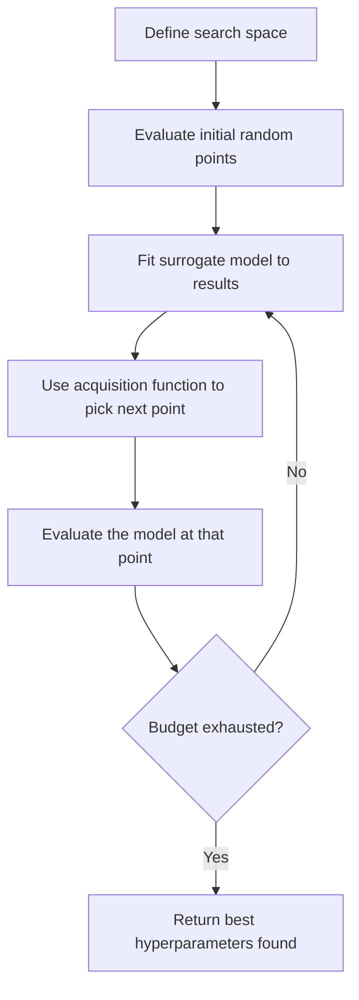
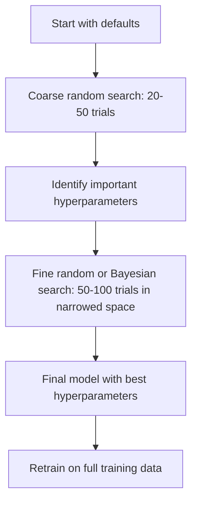
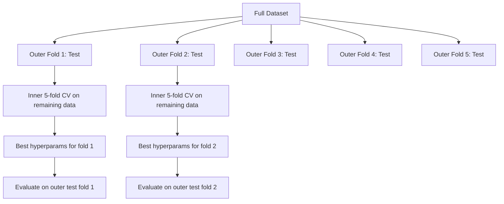

# El ajuste de los hiperparámetros

> Los hiperparámetros son los que se usan para regular el movimiento.

**Type:** Build
**Language:**Python
**Prerequisites:** Phase 2, Lesson 11 (Ensemble Methods)
**Time:** ~90 分钟

## El objetivo del aprendizaje
- Desde la búsqueda en la red de cero, la búsqueda aleatoria y la optimización bayesiana, y comparar su eficiencia de toma de datos
- Explica por qué cuando la mayoría de los hiperparámetros de la dimensión efectiva es menor, la búsqueda aleatoria será mejor que la búsqueda de la cuadrícula
- Utiliza modelo sustituto y la función de adquisición  Construir optimización bayesiana  ciclo para guiar la búsqueda
-  diseñar un tipo de ajuste de hiperparámetro  estrategia, a través de la validación cruzada  evitar el conjunto de validación  sobreadaptar

##  problemas
Su gradiente de aumento  modelo tiene tasa de aprendizaje ∞ número de árboles ∞ máxima profundidad ∞ min muestras por hoja ∞ submuestra ratio 和 columna muestra ratio ∞ es decir, seis hiperparámetros ∞ Si cada uno tiene 5 ∞ razonable ∞ valor, entonces la cuadrícula ∞ tiene 5^6 = 15,625 ∞ ∞ ∞ ∞ ∞ ∞ ∞ ∞ ∞ ∞ ∞ ∞ ∞ ∞ ∞ ∞ ∞ ∞ ∞ ∞ ∞ ∞ ∞ ∞ ∞ ∞ ∞ ∞ ∞ ∞ ∞ ∞ ∞ ∞ ∞ ∞ ∞ ∞ ∞ ∞ ∞ ∞ ∞ ∞ ∞ ∞ ∞ ∞ ∞ ∞ ∞ ∞ ∞ ∞ ∞ ∞ ∞ ∞ ∞ ∞ ∞ ∞ ∞ ∞ ∞ ∞ ∞ ∞ ∞ ∞ ∞ ∞ ∞ ∞ ∞ ∞ ∞ ∞ ∞ ∞ ∞ ∞ ∞ ∞ ∞ ∞ ∞ ∞ ∞ ∞ ∞ ∞ ∞ ∞ ∞ ∞ ∞ ∞ ∞ ∞ ∞ ∞ ∞ ∞ ∞ ∞ ∞ ∞ ∞ ∞ ∞ ∞ ∞ ∞ ∞ ∞ ∞ ∞ ∞ ∞ ∞ ∞ ∞ ∞ ∞ ∞ ∞ ∞ ∞ ∞ ∞ ∞ ∞ ∞ ∞ ∞ ∞ ∞ ∞ ∞ ∞ ∞ ∞ ∞ ∞ ∞ ∞ ∞ ∞ ∞ ∞ ∞ ∞ ∞ ∞ ∞ ∞ ∞ ∞ ∞ ∞ ∞ ∞ ∞ ∞ ∞ ∞ ∞ ∞ ∞ ∞ ∞ ∞ ∞ ∞ ∞ ∞ ∞ ∞ ∞ ∞ ∞ ∞ ∞ ∞ ∞ ∞ ∞ ∞ ∞ ∞ ∞ ∞ ∞ ∞ ∞ ∞ ∞ ∞ ∞ ∞ ∞ ∞ ∞ ∞ ∞ ∞ ∞ ∞ ∞ ∞ ∞ ∞ ∞

La búsqueda de redes es el método más intuitivo, también el más pobre de la escala. La búsqueda aleatoria con menos cantidades de cálculo puede hacerse mejor. La optimización bayesiana  a través de la evaluación pasada, el efecto también será mejor.  saber qué estrategias se deben usar, así como qué hiperparámetros son realmente importantes, puede tener en cuenta los días de CPU  tiempo 

## 概念
### Parámetros frente a hiperparámetros

Los parámetros son los que se obtienen durante el proceso de entrenamiento (peso, prejuicios, umbrales separados).

| Hyperparameter | 控制什么 | 典型范围 |
|---------------|-----------------|---------------|
| Learning rate | 每次更新的步长 | 0.001 到 1.0 |
| Number of trees/epochs | 训练时长 | 10 到 10,000 |
| Max depth | 模型复杂度 | 1 到 30 |
| Regularization (lambda) | 防止过拟合 | 0.0001 到 100 |
| Batch size | Gradient 估计噪声 | 16 到 512 |
| Dropout rate | 被丢弃的 neurons 比例 | 0.0 到 0.5 |

### Buscar en la red

La búsqueda de red evaluará cada tipo de conjunto de valores especificados.

```
Grid for 2 hyperparameters:

  learning_rate: [0.01, 0.1, 1.0]
  max_depth:     [3, 5, 7]

  Evaluations: 3 x 3 = 9 combinations

  (0.01, 3)  (0.01, 5)  (0.01, 7)
  (0.1,  3)  (0.1,  5)  (0.1,  7)
  (1.0,  3)  (1.0,  5)  (1.0,  7)
```

La búsqueda de la red tiene una deficiencia fundamental: si un hiperparámetro es importante, mientras que otro no es importante, la mayoría de las evaluaciones se desperdician.

### Buscar al azar

La búsqueda aleatoria no es de la cuadrícula, sino de la distribución de los hiperparámetros de la muestra.



¿Por qué al azar 会胜过网(Bergstra & Bengio, 2012):

- La mayoría de los hiperparámetros tienen una dimensión muy baja. Para un determinado problema, los 6 hiperparámetros suelen ser de sólo 1 o 2 significativos.
- La búsqueda de la red evaluará los desperdicios en dimensiones no importantes.
- En el mismo presupuesto, la búsqueda aleatoria cubrirá más intensamente las dimensiones importantes.
- En 60 ensayos aleatorios, si hay un punto óptimo en el espacio de búsqueda, tienes un 95% de probabilidades de encontrar un punto óptimo en el 5%

### Optimización bayesiana

La búsqueda aleatoria ignorará los resultados. No aprenderá hasta mayores tasas de aprendizaje.



两个 componentes clave:

**Surrogate model:**Un modelo de evaluación de bajo costo (normalmente proceso de Gauss), utilizado para una función objetiva de costo aproximado, proporciona un valor de pronóstico y una estimación de incertidumbre en cualquier punto del espacio de búsqueda.

**Acquisition function:**通过平衡利用 (在已知好点附近搜索) y exploración (在不确定性高的区域搜索)), decide el siguiente paso para evaluar dónde.

- **Expected Improvement (EI):**¿Qué valor mejoramos en este punto en comparación con el actual?
- **Upper Confidence Bound (UCB):**预测值加上某倍数的不确定性――更高的 UCB indicó que este punto tiene potencial, o aún no ha explorado suficientemente――
- **Probability of Improvement (PI):**¿Cuál es la probabilidad de que este punto superen el valor óptimo actual?

La optimización bayesiana normalmente puede utilizarse en comparación con la búsqueda aleatoria menos 2-5 veces de las veces de evaluación para encontrar mejores hiperparámetros.

### Pararse temprano

No es necesario que cada entrenamiento se complete. Si una configuración es muy mala después de 10 épocas, deja de hacerlo y sigue haciendo la siguiente.

策略:
- **Patience-based:**Si la pérdida de validación 连续 N 个 épocas 没有提升,就停止
- **Median pruning:**Si el resultado medio de un ensayo es inferior al resultado medio de los ensayos completados en el mismo paso, se detiene.
- **Hyperband:**Debería asignar a muchas asignaciones un presupuesto más pequeño, y luego incrementar gradualmente el presupuesto de la mejor asignación

La hipervínculo especialmente eficaz──consiste en 1 época  iniciar 81 configuraciones, conservar el anterior, darles 3 épocas, volver a conservar el anterior, en comparación con la evaluación del presupuesto completo, esto puede encontrar una buena configuración―10-50 veces.

### Programadores de tasas de aprendizaje

La tasa de aprendizaje es casi siempre el hiperparámetro más importante.

| Scheduler | Formula | 何时使用 |
|-----------|---------|-------------|
| Step decay | 每 N 个 epochs 乘以 0.1 | 经典 CNN 训练 |
| Cosine annealing | lr * 0.5 * (1 + cos(pi * t / T)) | 现代默认选择 |
| Warmup + decay | 先线性增加，再 cosine decay | Transformers |
| One-cycle | 在一个 cycle 内先增加再减少 | 快速收敛 |
| Reduce on plateau | 指标停滞时按因子降低 | 稳妥默认选择 |

### Importancia de los hiperparámetros

No todos los hiperparámetros son igualmente importantes. Los estudios sobre bosques aleatorios y el aumento de los gradientes muestran un modelo de coincidencia:

**高重要性：**
- Taxa de aprendizaje (始终优先调)
- Número de estimadores / épocas(Utilizar parada temprana, en lugar de调它)
- Fuerza de regularización

**中等重要性：**
- Profundidad máxima / número de capas
- Minimas muestras por hoja / desintegración de peso
- Proporción de submuestras

**低重要性：**
- Max características(para bosques aleatorios)
- 具体激活函数 的选择
- Tamaño de lote ((在合理范围内)

Primero, lo importante, el resto se mantiene en el valor de la memoria.

### Estrategia práctica



具体工作流:

1. **从库的默认值开始。**Se seleccionan por practicantes experimentados, y suelen alcanzar el 80% de los resultados.
2. **粗粒度 random search。**Uso largo de las pruebas, 20-50 veces. Uso de las pruebas de detener temprano.
3. **分析结果。**¿Qué hiperparámetros están relacionados con la performance?
4. **精细搜索。**En el espacio de reducción posterior, se utiliza la optimización bayesiana o la búsqueda aleatoria de enfoque.
5. **使用找到的最佳 hyperparameters 在全部训练数据上重新训练。**

### Validación cruzada 集成

En una sola división de validación, los hiperparámetros de alta definición tienen riesgo. Los mejores hiperparámetros pueden adaptarse a un pliegue de validación específico.

- **Outer loop**(evaluación): se dividirán los datos en tren+val y prueba.
- **Inner loop**(调优):将 train+val 拆分为 train 和 val── buscar los mejores hiperparámetros──



Cada pieza externa encontrará independientemente sus mejores hiperparámetros.

Uso de la máquina:

```python
from sklearn.model_selection import cross_val_score, GridSearchCV
from sklearn.ensemble import GradientBoostingRegressor

inner_cv = GridSearchCV(
    GradientBoostingRegressor(),
    param_grid={
        "learning_rate": [0.01, 0.05, 0.1],
        "max_depth": [2, 3, 5],
        "n_estimators": [50, 100, 200],
    },
    cv=5,
    scoring="neg_mean_squared_error",
)

outer_scores = cross_val_score(
    inner_cv, X, y, cv=5, scoring="neg_mean_squared_error"
)

print(f"Nested CV MSE: {-outer_scores.mean():.4f} +/- {outer_scores.std():.4f}")
```

Esto es muy caro, pero puede dar una estimación de rendimiento confiable. Cuando se informa en el artículo sobre el resultado final, o el riesgo de decisión es mayor cuando se utiliza.

### Consejos prácticos

**从 learning rate 开始。**Para el método basado en gradientes, siempre es el hiperparámetro más importante. La mala tasa de aprendizaje hará que todas las demás configuraciones pierdan sentido.

**对 learning rate 和 regularization 使用 log-uniform distributions。**Las diferencias entre 0.001 y 0.01 son igualmente importantes.

**使用 early stopping，而不是调 n_estimators。**Para impulsar y redes neuronales, por ejemplo, si los n_estimatores o épocas se establecen más altos, deja que la parada temprana decida cuándo parar. Esto eliminará de la búsqueda un hiperparámetro.

**预算分配。**El 60% del presupuesto de ajuste se gastó en los dos hiperparámetros más importantes. El 40% restante se utilizó para todos los demás parámetros.

**尺度很重要。**永远不要在日志尺度上搜索批量(16、32、64 就可以) ・・・始终在日志尺度上搜索学习率──让搜索分布匹配超参数 影响模型的方式──

| Model Type | Top Hyperparameters | Recommended Search | Budget |
|-----------|--------------------|--------------------|--------|
| Random Forest | n_estimators, max_depth, min_samples_leaf | Random search，50 次 trials | 低（训练快） |
| Gradient Boosting | learning_rate, n_estimators, max_depth | Bayesian，100 次 trials + early stopping | 中 |
| Neural Network | learning_rate, weight_decay, batch_size | Bayesian 或 random，100+ 次 trials | 高（训练慢） |
| SVM | C, gamma (RBF kernel) | 在 log scale 上 grid，25-50 次 trials | 低（2 个参数） |
| Lasso/Ridge | alpha | 在 log scale 上 1D search，20 次 trials | 很低 |
| XGBoost | learning_rate, max_depth, subsample, colsample | Bayesian，100-200 次 trials + early stopping | 中 |

**拿不准时：**Usar búsqueda aleatoria, ensayos números al menos para hiperparámetros número 2 veces (por ejemplo, 6 个超参数 = al menos 12 veces ensayos)  Usted se sorprenderá de encontrar, 50 veces ensayos de búsqueda aleatoria 经常能击败精心设计的网格搜索──


```figure
k-fold-cv
```

## Construirlo
### Paso 1: desde cero realizar búsqueda de red

`code/tuning.py`El código medio desde cero ha realizado la búsqueda en cuadrícula, búsqueda aleatoria y un simple optimizador bayesiano.

```python
def grid_search(model_fn, param_grid, X_train, y_train, X_val, y_val):
    keys = list(param_grid.keys())
    values = list(param_grid.values())
    best_score = -float("inf")
    best_params = None
    n_evals = 0

    for combo in itertools.product(*values):
        params = dict(zip(keys, combo))
        model = model_fn(**params)
        model.fit(X_train, y_train)
        score = evaluate(model, X_val, y_val)
        n_evals += 1

        if score > best_score:
            best_score = score
            best_params = params

    return best_params, best_score, n_evals
```

### Paso 2: Desde el cero realizar búsqueda aleatoria

```python
def random_search(model_fn, param_distributions, X_train, y_train,
                  X_val, y_val, n_iter=50, seed=42):
    rng = np.random.RandomState(seed)
    best_score = -float("inf")
    best_params = None

    for _ in range(n_iter):
        params = {k: sample(v, rng) for k, v in param_distributions.items()}
        model = model_fn(**params)
        model.fit(X_train, y_train)
        score = evaluate(model, X_val, y_val)

        if score > best_score:
            best_score = score
            best_params = params

    return best_params, best_score, n_iter
```

### 步骤 3: Optimización bayesiana (Bayesian Optimization)

核心思想:将Gaussian process 拟合到已观测的(hiperparámetro, puntaje)配对上, luego con la función de adquisición decide el siguiente paso看哪里──

```python
class SimpleBayesianOptimizer:
    def __init__(self, search_space, n_initial=5):
        self.search_space = search_space
        self.n_initial = n_initial
        self.X_observed = []
        self.y_observed = []

    def _kernel(self, x1, x2, length_scale=1.0):
        dists = np.sum((x1[:, None, :] - x2[None, :, :]) ** 2, axis=2)
        return np.exp(-0.5 * dists / length_scale ** 2)

    def _fit_gp(self, X_new):
        X_obs = np.array(self.X_observed)
        y_obs = np.array(self.y_observed)
        y_mean = y_obs.mean()
        y_centered = y_obs - y_mean

        K = self._kernel(X_obs, X_obs) + 1e-4 * np.eye(len(X_obs))
        K_star = self._kernel(X_new, X_obs)

        L = np.linalg.cholesky(K)
        alpha = np.linalg.solve(L.T, np.linalg.solve(L, y_centered))
        mu = K_star @ alpha + y_mean

        v = np.linalg.solve(L, K_star.T)
        var = 1.0 - np.sum(v ** 2, axis=0)
        var = np.maximum(var, 1e-6)

        return mu, var

    def _expected_improvement(self, mu, var, best_y):
        sigma = np.sqrt(var)
        z = (mu - best_y) / (sigma + 1e-10)
        ei = sigma * (z * norm_cdf(z) + norm_pdf(z))
        return ei

    def suggest(self):
        if len(self.X_observed) < self.n_initial:
            return sample_random(self.search_space)

        candidates = [sample_random(self.search_space) for _ in range(500)]
        X_cand = np.array([to_vector(c) for c in candidates])
        mu, var = self._fit_gp(X_cand)
        ei = self._expected_improvement(mu, var, max(self.y_observed))
        return candidates[np.argmax(ei)]

    def observe(self, params, score):
        self.X_observed.append(to_vector(params))
        self.y_observed.append(score)
```

GP sustituta en cada candidato da dos cosas: predicción de la cantidad de puntos de venta y la incertidumbre de los candidatos.

### Paso 4: Comparar todos los métodos

En el mismo objetivo sintético 上运行三种方法并比较── este comparativo utiliza un envase simplificado, directamente con la función objetivo 调用每个优化器(没有模型训练), por lo que la API con respecto a los modelos anteriores 实现 diferente:

```python
def synthetic_objective(params):
    lr = params["learning_rate"]
    depth = params["max_depth"]
    return -(np.log10(lr) + 2) ** 2 - (depth - 4) ** 2 + 10

param_grid = {
    "learning_rate": [0.001, 0.01, 0.1, 1.0],
    "max_depth": [2, 3, 4, 5, 6, 7, 8],
}

grid_best = None
grid_score = -float("inf")
grid_history = []
for combo in itertools.product(*param_grid.values()):
    params = dict(zip(param_grid.keys(), combo))
    score = synthetic_objective(params)
    grid_history.append((params, score))
    if score > grid_score:
        grid_score = score
        grid_best = params

param_dist = {
    "learning_rate": ("log_float", 0.001, 1.0),
    "max_depth": ("int", 2, 8),
}

rand_best = None
rand_score = -float("inf")
rand_history = []
rng = np.random.RandomState(42)
for _ in range(28):
    params = {k: sample(v, rng) for k, v in param_dist.items()}
    score = synthetic_objective(params)
    rand_history.append((params, score))
    if score > rand_score:
        rand_score = score
        rand_best = params

optimizer = SimpleBayesianOptimizer(param_dist, n_initial=5)
bayes_history = []
for _ in range(28):
    params = optimizer.suggest()
    score = synthetic_objective(params)
    optimizer.observe(params, score)
    bayes_history.append((params, score))
bayes_score = max(s for _, s in bayes_history)

print(f"{'Method':<20} {'Best Score':>12} {'Evaluations':>12}")
print("-" * 50)
print(f"{'Grid Search':<20} {grid_score:>12.4f} {len(grid_history):>12}")
print(f"{'Random Search':<20} {rand_score:>12.4f} {len(rand_history):>12}")
print(f"{'Bayesian Opt':<20} {bayes_score:>12.4f} {len(bayes_history):>12}")
```

En el mismo presupuesto, la optimización bayesiana suele encontrar el mejor puntaje más rápido, ya que no evalúa el desperdicio en regiones claramente malas.

## Usalo
### Optuna en práctica

Optuna es una recomendación de ajuste de hiperparámetros estricto.

```python
import optuna

def objective(trial):
    lr = trial.suggest_float("learning_rate", 1e-4, 1e-1, log=True)
    n_est = trial.suggest_int("n_estimators", 50, 500)
    max_depth = trial.suggest_int("max_depth", 2, 10)

    model = GradientBoostingRegressor(
        learning_rate=lr,
        n_estimators=n_est,
        max_depth=max_depth,
    )
    model.fit(X_train, y_train)
    return mean_squared_error(y_val, model.predict(X_val))

study = optuna.create_study(direction="minimize")
study.optimize(objective, n_trials=100)

print(f"Best params: {study.best_params}")
print(f"Best MSE: {study.best_value:.4f}")
```

Características clave de la opción:
- `suggest_float(..., log=True)`Usado para el mejor adaptado en la escala de registro de la búsqueda de los parámetros de la tasa de aprendizaje  regularidad)
- `suggest_int`Usar para los parámetros enteros
- `suggest_categorical`Usado para separar
- Interior MedianPruner, para tratar de malos ensayos  para realizar una parada temprana
- `study.trials_dataframe()`Usado para analizar

### Optuna con poda

La recortada de pruebas de corte se detiene sin esperanzas, ahorrando así un gran número de cálculos.

```python
import optuna
from sklearn.model_selection import cross_val_score

def objective(trial):
    params = {
        "learning_rate": trial.suggest_float("lr", 1e-4, 0.5, log=True),
        "max_depth": trial.suggest_int("max_depth", 2, 10),
        "n_estimators": trial.suggest_int("n_estimators", 50, 500),
        "subsample": trial.suggest_float("subsample", 0.5, 1.0),
    }

    model = GradientBoostingRegressor(**params)
    scores = cross_val_score(model, X_train, y_train, cv=3,
                             scoring="neg_mean_squared_error")
    mean_score = -scores.mean()

    trial.report(mean_score, step=0)
    if trial.should_prune():
        raise optuna.TrialPruned()

    return mean_score

pruner = optuna.pruners.MedianPruner(n_startup_trials=10, n_warmup_steps=5)
study = optuna.create_study(direction="minimize", pruner=pruner)
study.optimize(objective, n_trials=200)
```

`MedianPruner`El promedio de los ensayos completados es menor cuando se detiene.`trial.report()`报告中间指标,并调用 `trial.should_prune()`检查该审判是否应该停止──`n_startup_trials=10` asegurarse de que al menos hay 10 ensayos  completos, el corte  sólo se iniciará                                                                                                                                                                                                                                                  

### Los Tuners incorporados de sklearn

Para el experimento rápido, aprende.`GridSearchCV`¿Qué es esto?`RandomizedSearchCV`Y `HalvingRandomSearchCV`¿Qué es esto ?

```python
from sklearn.model_selection import RandomizedSearchCV
from scipy.stats import loguniform, randint

param_dist = {
    "learning_rate": loguniform(1e-4, 0.5),
    "max_depth": randint(2, 10),
    "n_estimators": randint(50, 500),
}

search = RandomizedSearchCV(
    GradientBoostingRegressor(),
    param_dist,
    n_iter=100,
    cv=5,
    scoring="neg_mean_squared_error",
    random_state=42,
    n_jobs=-1,
)
search.fit(X_train, y_train)
print(f"Best params: {search.best_params_}")
print(f"Best CV MSE: {-search.best_score_:.4f}")
```

Para el ritmo de aprendizaje y la regularización de la utilización de la enseñanza`loguniform`△ para un número total de hiperparámetros `randint`¿Qué es eso?`n_jobs=-1`Se marcó en todos los núcleos de la CPU.

### Sincronización de hiperparámetro

**通过 preprocessing 产生 data leakage。**Si en la validación cruzada antes de en el conjunto completo de datos arriba se ajusta a un escalador, la información de la validación se va a filtrar al entrenamiento en el entrenamiento.`Pipeline`Así que sólo encajará en el pliegue de entrenamiento.

**对 validation set 过拟合。**运行数千次试验 实际上等于在验证套上训练――最终性能估计应使用嵌套交叉验证,或留出一个在调优期间从未触碰的独立试验套――

**搜索范围太窄。**Si su mejor valor se encuentra en la frontera del espacio de búsqueda, indique que el alcance de búsqueda no es suficientemente amplio.

**忽略交互效应。**En el aumento, la tasa de aprendizaje y el número de estimadores tienen una fuerte interacción.

**没有对 iterative models 使用 early stopping。**Para aumentar el gradiente y las redes neuronales, se establecerán n_estimatores o épocas                                                                                                                                                                                                                                                                                                                                                                                                                                                                                                        

##  ejercicios
1. Usando el mismo presupuesto total para realizar búsquedas en la red y búsquedas aleatorias (por ejemplo, 50 veces evaluar) ◊ Compare encontrar la mejor porcentaje ◊ Usando diferentes semillas 运行实验 10 veces ◊ ¿Cuántas veces ganó la búsqueda aleatoria?

2. Desde la implementación de hipervínculo de cero, desde 81 configuraciones, cada entrenamiento comienza 1 época.

3. 给中课11的梯度增强 实现添加一个学习率调度器 () △¿Ha ayudado en comparación con la tasa de aprendizaje fija?

4. Usar Optuna en el conjunto de datos reales (por ejemplo, el conjunto de datos sobre cáncer de mama de sklearn)`optuna.visualization.plot_param_importances(study)`查看哪些超参数最重要――¿¿Esto es lo que corresponde a la orden de importancia de esta clase?

5. 实现 una simple función de adquisición  预期改善),并演示探索与利用──绘制替代模型的平均值和不确定性,并演示 EI 选择下一步评估的位置──

## 关键术语: "El hombre es un hombre"
| Term | 人们通常说 | 实际含义 |
|------|----------------|----------------------|
| Hyperparameter | “你选择的一个设置” | 训练前设置的值，用来控制学习过程，不是从数据中学习得到的 |
| Grid search | “尝试每一种组合” | 在指定 parameter grid 上进行穷举搜索。成本呈指数级增长。 |
| Random search | “就是随机采样” | 从分布中采样 hyperparameters。比 grid search 更好地覆盖重要维度。 |
| Bayesian optimization | “智能搜索” | 使用 objective 的 surrogate model 来决定下一步评估哪里，平衡 exploration 和 exploitation |
| Surrogate model | “一个便宜的近似” | 一个模型（通常是 Gaussian process），根据已观测评估来近似昂贵的 objective function |
| Acquisition function | “下一步看哪里” | 通过平衡 expected improvement 和不确定性，为候选点打分。EI 和 UCB 是常见选择。 |
| Early stopping | “停止浪费时间” | 当 validation performance 停止提升时，提前终止训练 |
| Hyperband | “配置的锦标赛分组” | 自适应资源分配：用小预算启动许多 configs，保留最好的并增加它们的预算 |
| Learning rate scheduler | “训练期间改变 lr” | 一个函数，用于在训练过程中调整 learning rate，以获得更好的收敛 |

## 延伸阅读
- [Bergstra & Bengio: Random Search for Hyper-Parameter Optimization (2012)](https://jmlr.org/papers/v13/bergstra12a.html)-- 证明 random 胜过网 的论文
- [Snoek et al., Practical Bayesian Optimization of Machine Learning Algorithms (2012)](https://arxiv.org/abs/1206.2944)-- Utilizando la optimización bayesiana de ML
- [Li et al., Hyperband: A Novel Bandit-Based Approach (2018)](https://jmlr.org/papers/v18/16-558.html)-- Hiperbanda 论文
- [Optuna: A Next-generation Hyperparameter Optimization Framework](https://arxiv.org/abs/1907.10902)-- Optuna 论文
- [Probst et al., Tunability: Importance of Hyperparameters (2019)](https://jmlr.org/papers/v20/18-444.html)-- 哪些 hiperparámetros 重要
