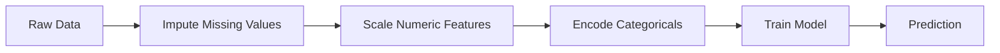
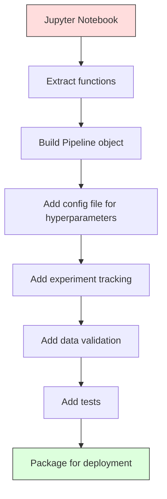

# Líneas de tuberías ML

> 模型不是 producto. ‧Pipeline 才是─Pipeline 覆盖从原始数据到部署预测的全部过程,并且每一步都必须可复现──

**Type:** Build
**Language:**Python
**Prerequisites:** Phase 2, Lesson 12 (Hyperparameter Tuning)
**Time:** ~120 minutes

## El objetivo del aprendizaje
- Desde la construcción de una tubería de ML, imputando, escalar, codificar y entrenar el modelo se conectará a un único objeto que se puede realizar.
- 识别数据泄漏 场景,并解释管道 如何通过仅在训练数据 上拟合变压器以防止泄漏
- Construir una ColumnaTransformer, para las características numéricas y categoricas  Aplicar diferentes preprocesamiento
-                                                                                                                                                                                                                                                                                                                                                                                                                                                                                                                              

##  problemas
Tienes un cuaderno: se carga datos, se llena con medianas valores faltantes, se aclimatan las características, se entrenan modelos, se imprime con precisión.

Un mes después, alguien volvió a entrenar el modelo, pero obtuvo diferentes resultados. El mediano está en el conjunto completo de datos que contiene los datos de prueba.

Estos no son supuestos. Son las causas más comunes de los sistemas de inteligencia artificial que fracasan en la producción.

## 概念
### Qué es un oleoducto

El pipeline es un conjunto de transformaciones de datos ordenadas, posteriormente un modelo. Cada paso es el siguiente paso de salida como entrada. El pipeline entero sólo se combina en los datos de entrenamiento.



El gasoducto .
- Las transformaciones sólo en los datos de formación
- Inferencia 时应用 totalmente las mismas transformaciones
- Todo el objeto puede ser serializado, y como un artefacto
- La validación cruzada se aplicará en cada pliegue en el oleoducto, para evitar las fugas de detalles

### Datos de fuga: asesino silencioso

Las filtraciones de datos se producen en el conjunto de pruebas o en el futuro en el entrenamiento de contaminación de la información en los datos.

**Leaky（错误）：**
```python
X = df.drop("target", axis=1)
y = df["target"]

scaler = StandardScaler()
X_scaled = scaler.fit_transform(X)

X_train, X_test = X_scaled[:800], X_scaled[800:]
y_train, y_test = y[:800], y[800:]
```

Escalador 看到了 pruebas de datos. Mediano 和 desviación estándar 包含 pruebas de muestras. Esto exagerará la precisión 估计.

**Correct：**
```python
X_train, X_test = X[:800], X[800:]

scaler = StandardScaler()
X_train_scaled = scaler.fit_transform(X_train)
X_test_scaled = scaler.transform(X_test)
```

Usando el pipeline, no necesitas pensar en esto.

### Especialización de la producción de gas

de sklearn `Pipeline`Las transformaciones se conectan y el estimador se expone.`.fit()`¿Qué es esto?`.predict()`Y `.score()`, según el orden de aplicación de todos los pasos:.

```python
from sklearn.pipeline import Pipeline
from sklearn.preprocessing import StandardScaler
from sklearn.linear_model import LogisticRegression

pipe = Pipeline([
    ("scaler", StandardScaler()),
    ("model", LogisticRegression()),
])

pipe.fit(X_train, y_train)
predictions = pipe.predict(X_test)
```

Cuando tú调用 `pipe.fit(X_train, y_train)`时:
1. Escaler en X_train 上调用 `fit_transform`
2. Modelo en escala X_train 上调用 `fit`

Cuando tú调用 `pipe.predict(X_test)`时:
1. Escalador en X_test 上调用 `transform`(no es que se transforme)
2. Modelo en escala X_test 上调用 `predict`

En el proceso de montaje nunca veremos los datos de prueba.

### ColumnaTransformer:不同列使用不同管道

El conjunto de datos real contiene columnas numéricas y categoricas, que requieren un proceso de pre-procesamiento diferente.`ColumnTransformer` responsable de tratar esta situación.

```python
from sklearn.compose import ColumnTransformer
from sklearn.preprocessing import StandardScaler, OneHotEncoder
from sklearn.impute import SimpleImputer

numeric_pipe = Pipeline([
    ("impute", SimpleImputer(strategy="median")),
    ("scale", StandardScaler()),
])

categorical_pipe = Pipeline([
    ("impute", SimpleImputer(strategy="most_frequent")),
    ("encode", OneHotEncoder(handle_unknown="ignore")),
])

preprocessor = ColumnTransformer([
    ("num", numeric_pipe, ["age", "income", "score"]),
    ("cat", categorical_pipe, ["city", "gender", "plan"]),
])

full_pipeline = Pipeline([
    ("preprocess", preprocessor),
    ("model", GradientBoostingClassifier()),
])
```

OneHotEncoder 中的 `handle_unknown="ignore"`Para la producción 至关重要── Cuando surge una nueva categoría (por ejemplo, modelos de ciudades nunca vistas) se produce un vector total, en lugar de un colapso directo―.

### El seguimiento de los experimentos

Pipeline 让训练可复现, pero también necesitas rastrear los experimentos 之间发生了什么: utiliza qué hiperparámetros 哪个数据集版本、测量是什么、运行的是哪个代码──

**MLflow**Es la solución de código abierto más común:

```python
import mlflow

with mlflow.start_run():
    mlflow.log_param("max_depth", 5)
    mlflow.log_param("n_estimators", 100)
    mlflow.log_param("learning_rate", 0.1)

    pipe.fit(X_train, y_train)
    accuracy = pipe.score(X_test, y_test)

    mlflow.log_metric("accuracy", accuracy)
    mlflow.sklearn.log_model(pipe, "model")
```

Cada vez que se ejecuta, se registran parámetros, métricas, objetos y modelos completos. Puedes comparar ejecuciones, realizar cualquier experimento, y implementar cualquier versión de modelo.

**Weights & Biases (wandb)**提供 la misma función,并带有托管仪表板:

```python
import wandb

wandb.init(project="my-pipeline")
wandb.config.update({"max_depth": 5, "n_estimators": 100})

pipe.fit(X_train, y_train)
accuracy = pipe.score(X_test, y_test)

wandb.log({"accuracy": accuracy})
```

### Modelo de versión

completar el seguimiento de experimentos  Después, necesitas administrar versiones de modelos  ¿Qué modelo está en producción? ¿Cuál está en etapa? ¿Cuál es el que se utiliza durante la semana?

Registro de modelos de MLflow 提供:
- **Version tracking:**Cada modelo que se conserva obtiene un número de versión
- **Stage transitions:**"Enscenamiento""",Producción""",Archivo"
- **Approval workflow:**El modelo debe ser claramente promovido a la producción
- **Rollback:**立即切回 precedente versión

### Versión de datos con DVC

代码使用 git hacer versioning;; datos también deberían ser versionados, pero git 无法处理大文件;;DVC (Data Version Control) 解决了这个问题;;

```
dvc init
dvc add data/training.csv
git add data/training.csv.dvc data/.gitignore
git commit -m "Track training data"
dvc push
```

DVC almacenará datos reales en almacenamiento remoto en S3 ̊ GCS ̊ Azure) y guardará un pequeño en git ̊`.dvc`Cuando te has hecho un pago,`dvc checkout`Se recuperará el dato exacto utilizado en ese momento.

Esto significa que cada compromiso de Git está fijado al mismo tiempo el código y los datos.

### Experimentos reproducibles

Un experimento replicable necesita cuatro cosas:

1. **Fixed random seeds:**Para la configuración de semillas
2. **Pinned dependencies:**Uso con precisión de la versión de requisitos.txt o poetry.lock
3. **Versioned data:**Utiliza DVC o herramientas similares
4. **Config files:**Todos los hiperparámetros están en configuración, no codificados.

```python
import numpy as np
import random

def set_seed(seed=42):
    random.seed(seed)
    np.random.seed(seed)
    try:
        import torch
        torch.manual_seed(seed)
        torch.cuda.manual_seed_all(seed)
        torch.backends.cudnn.deterministic = True
    except ImportError:
        pass
```

### Desde el cuaderno hasta la producción



典型演进过程:

1. **Notebook exploration:**快速 experimentaciones  visualizaciones  ideas de características
2. **Extract functions:**El proceso de preprocesamiento, la ingeniería de características, la evaluación, la transferencia de módulos
3. **Build Pipeline:**将 transformaciones 串联成 sklearn Pipeline o clase personalizada
4. **Config management:**Para transferir todos los hiperparámetros a la configuración YAML/JSON
5. **Experiment tracking:**添加 MLflow o registro de la vara
6. **Data validation:**En el entrenamiento pre-check esquemas, distribuciones y patrones de valores faltantes
7. **Tests:**Para transformadores  redacción de pruebas de unidad, para la integración completa de la tubería  redacción de pruebas de integración
8. **Deployment:**Serializa Pipeline, utiliza API(FastAPI、Flask)封装,并 contenerize

### Errores comunes en el oleoducto

| Mistake | Why it is bad | Fix |
|---------|-------------|-----|
| 在 splitting 前对完整数据 fitting | Data leakage | 使用带 cross_val_score 的 Pipeline |
| 在 Pipeline 外做 feature engineering | Train 与 serve 时 transforms 不一致 | 把所有 transforms 放入 Pipeline |
| 不处理 unknown categories | Production 中出现新值会崩溃 | OneHotEncoder(handle_unknown="ignore") |
| Hardcoded column names | schema 变化时会出错 | 从 config 使用 column name lists |
| 没有 data validation | bad data 会导致悄无声息的错误 predictions | 在 prediction 前添加 schema checks |
| Training/serving skew | 模型在 prod 中看到不同 features | training 和 serving 共用一个 Pipeline 对象 |


```figure
f3-pipeline-flow
```

## Construirlo
`code/pipeline.py`En el código de medio, construye una línea de tuberías de ML completa desde cero:

### Paso 1: Transformador personalizado

```python
class CustomTransformer:
    def __init__(self):
        self.means = None
        self.stds = None

    def fit(self, X):
        self.means = np.mean(X, axis=0)
        self.stds = np.std(X, axis=0)
        self.stds[self.stds == 0] = 1.0
        return self

    def transform(self, X):
        return (X - self.means) / self.stds

    def fit_transform(self, X):
        return self.fit(X).transform(X)
```

### Paso 2: Construcción de tuberías desde cero

```python
class PipelineFromScratch:
    def __init__(self, steps):
        self.steps = steps

    def fit(self, X, y=None):
        X_current = X.copy()
        for name, step in self.steps[:-1]:
            X_current = step.fit_transform(X_current)
        name, model = self.steps[-1]
        model.fit(X_current, y)
        return self

    def predict(self, X):
        X_current = X.copy()
        for name, step in self.steps[:-1]:
            X_current = step.transform(X_current)
        name, model = self.steps[-1]
        return model.predict(X_current)
```

### Paso 3: Utiliza el oleoducto  realizar la validación cruzada

代码演示了使用管道的跨验证 如何防止数据泄漏:scaler 会分别在每个折的训练数据上适应──

### Paso 4: utilizar la línea de producción completa de la tienda

Un oleoducto completo, que contiene`ColumnTransformer`、多条 caminos de preprocesamiento 和一个模型,并使用正确的交叉验证与实验记录 进行训练──

##  entregarlo
本课产 出:
- `outputs/prompt-ml-pipeline.md`-- Con la habilidad de construir y modificar las tuberías de ML
- `code/pipeline.py`-- Un gasoducto completo, desde cero  implementado hasta sklearn  versión

##  ejercicios
1. Construir una tubería, procesar que contiene 3 columnas numéricas y 2 columnas categoricas del conjunto de datos── utilizar `ColumnTransformer`Para la numérica  aplicar imputación mediana + escala, para categorías  aplicar imputación más frecuente + codificación de una sola calidez― utilizar 5 veces validación cruzada  realizar entrenamiento―

2. Por lo tanto, la información se filtró en el sistema de datos de la empresa de la empresa de la industria de la información.

3. Uso `joblib.dump`En un solo guión en español, se incluyen las predicciones de la serie de su pipeline.

4. hacia el oleoducto  Añadir un transformador personalizado, para las dos columnas numéricas más importantes  Crear características polinómicas  grado 2)―¿debería colocarse en qué posición del oleoducto?

5. Por el pipeline  configuración de seguimiento de flujo de ML.`mlflow ui`) Compare carreras,并选择最佳模型──

## 关键术语: "El hombre es un hombre"
| Term | What people say | What it actually means |
|------|----------------|----------------------|
| Pipeline | "Chain of transforms + model" | 一组有序的已拟合 transformers 和一个模型，作为一个整体应用以防止泄漏 |
| Data leakage | "Test info leaked into training" | 使用 training set 之外的信息构建模型，从而夸大 performance estimates |
| ColumnTransformer | "Different preprocessing per column" | 对不同列子集应用不同 Pipelines，并合并结果 |
| Experiment tracking | "Logging your runs" | 为每次 training run 记录 parameters、metrics、artifacts 和 code versions |
| MLflow | "Track and deploy models" | 用于 experiment tracking、model registry 和 deployment 的 open-source platform |
| DVC | "Git for data" | 面向 large data files 的 version control system，在 git 中存储 hashes，在 remote storage 中存储数据 |
| Model registry | "Model version catalog" | 使用 stage labels（staging、production、archived）追踪 model versions 的系统 |
| Training/serving skew | "It worked in the notebook" | Training 与 inference 期间数据处理方式存在差异，导致 silent errors |
| Reproducibility | "Same code, same result" | 使用相同代码、数据和配置获得完全相同结果的能力 |

## 延伸阅读
- [scikit-learn Pipeline docs](https://scikit-learn.org/stable/modules/compose.html)-- 官方 referencia de la tubería
- [MLflow documentation](https://mlflow.org/docs/latest/index.html)-- el seguimiento de experimentos y el registro de modelos
- [DVC documentation](https://dvc.org/doc)-- versión de datos
- [Sculley et al., Hidden Technical Debt in Machine Learning Systems (2015)](https://papers.nips.cc/paper/2015/hash/86df7dcfd896fcaf2674f757a2463eba-Abstract.html)--  sobre la complejidad de los sistemas de inteligencia artificial
- [Google ML Best Practices: Rules of ML](https://developers.google.com/machine-learning/guides/rules-of-ml)--  producción práctica ML 建议
