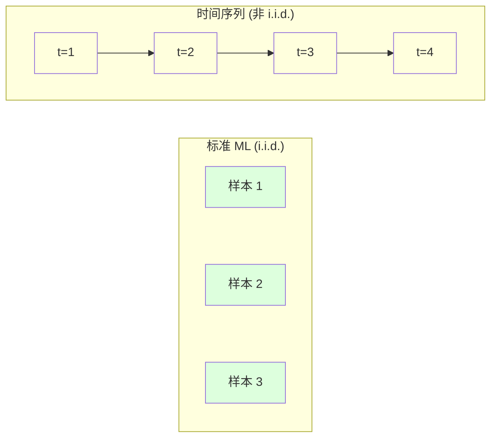
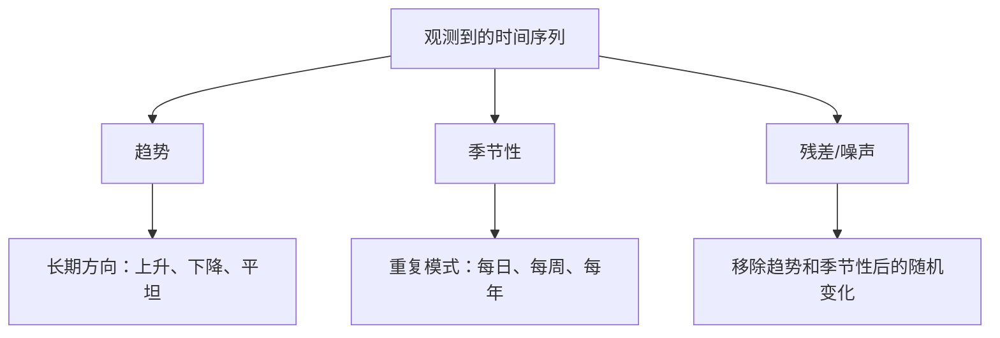
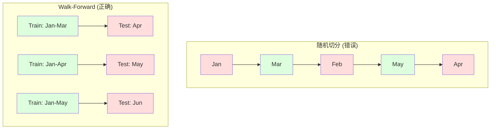

# 时间序列基础  tiempo y tiempo

> El comportamiento del pasado puede predecir el resultado futuro                                                                                                                                                                                                                                                         

**Type:** Build
**Language:**Python
**Prerequisites:** Phase 2, Lessons 01-09
**Time:** ~90 分钟

## El objetivo del aprendizaje

- Desglosar la secuencia de tiempo en componentes de tendencias, estaciones y residuos, y comprobar la estabilidad.
-  lograr las características de atraso y la estadística de rotación, transformar la secuencia de tiempo en el problema de supervisión de aprendizaje
- Construir una validación avanzada  marco, prevenir futuras fugas de datos en el entrenamiento
- Explicar por qué la división de tren/prueba de la secuencia de tiempo no funciona, y mostrar la diferencia de rendimiento entre la secuencia de tiempo y la secuencia de tiempo real

##  problemas

Tienes datos de tiempo en orden. Tienen datos de ventas diarias, temperatura por hora, CPU por minuto, precio de las acciones por semana.

Usted saca el estándar ML 工具箱:随机火车/测试分分,cross-validation,输入特征矩阵,输出预测,每一步都是错的,

 La secuencia de tiempo rompe el estándar ML Depende de la hipótesis― la muestra no es independiente― la temperatura de hoy depende de la temperatura de ayer―, a medida que el tiempo se separa, el futuro se derrumba de información hacia el pasado―, en las pruebas posteriores, parecen muy buenas características, hasta que el medio ambiente de producción fracasó, ya que dependen de un modelo de desplazamiento del tiempo―,

Un modelo con validación cruzada al azar obtiene una precisión del 95%, con una evaluación correcta basada en el tiempo es posible solo en un 55%. Esta diferencia no es un detalle técnico.

Este curso abarca los siguientes temas básicos: ¿Qué es diferente en el tiempo, cómo evaluar honestamente el modelo y cómo convertir la secuencia de tiempo en características estándar del modelo ML que se pueden utilizar:

## 概念

### ¿Qué es diferente en el tiempo?

标准 ML 假设 i.i.d. -- 独立同分布── cada muestra se extrae de la misma distribución, y se independiza de otras muestras── tiempo secuencia simultáneamente infringe estos dos puntos:

- **不独立。**El precio de las acciones de hoy depende del precio de ayer.
- **不同分布。**Las ventas de diciembre se ven diferentes a las de 3 meses.

Estas infracciones no son insignificantes. Cambiarán la forma en que construyes características, la forma en que evalúas modelos y los algoritmos disponibles.



En el estándar ML, los muestras se pueden intercambiar.

### 时间序列的组成部分

Cada secuencia de tiempo es un conjunto de los siguientes contenidos:



- **趋势**El aumento de las tasas de producción y de producción de productos agrícolas en el sector de la agricultura
- **季节性**El volumen de ventas en el mercado aumentó en diciembre.
- **残差**Si el residuo parece un ruido blanco, se puede desglosar la captura de la señal.

### Establishment

Si la estadística de una secuencia de tiempo (por ejemplo, la media, la diferencia, la relación entre sí) no cambia con el tiempo, es que es plana. La mayoría de los métodos de predicción suponen que es plana.

**为什么重要：**En el modelo de entrenamiento en datos de enero, el promedio de los resultados obtenidos será diferente al promedio presentado en los resultados de enero.

**如何检查：**En la ventana se calcula la media de rodamiento y la desviación estándar de rodamiento. Si se desplazan, el orden es poco estable.

**如何修复：**差分── no construye el valor original, sino que construye los cambios entre los valores continuos:

```
diff[t] = value[t] - value[t-1]
```

Si una vez la diferencia no puede hacer que la secuencia se estabilice, se vuelve a aplicar una vez más. La mayoría de las secuencias del mundo real necesitan dos veces.

**示例：**

Iniciado por el grupo de los "Primeros"
Un阶差分: [2, 4, 6, 8]
二阶差分: [2, 2, 2](con frecuencia -- 平稳)

El primer orden tiene dos tendencias. Una diferencia lo convierte en tendencia lineal. La segunda diferencia lo hace llanear. En la práctica, rara vez necesitas más de dos diferencias.

**形式化检验：**El test de Dickey-Fuller (ADF) aumentado es un examen estadístico estándar de estabilidad plana. La hipótesis original es un análisis de p-valor inferior a 0.05 que muestra que puedes rechazar la hipótesis original y obtener una conclusión estabilidad.

### Desde el

La función de autocorrelación (ACF) trazará esta correlación de cada tiempo de retraso k.

**ACF 告诉你：**
- 序列能记住多远──如果 ACF en lag 5 后降到零, entonces el valor de 5 步前没有关键──
- Si el ACF se encuentra en un punto más alto del período de 12 meses, entonces existe una temporada anual.
- Para crear un poco de atraso, utilizar hasta que el ACF se vuelva algo que se puede ignorar.

**PACF (Partial Autocorrelation Function)**Se trata de un proceso de transferencia indirecta. Si hoy está relacionado con 3 天前, simplemente porque los dos están relacionados con ayer, entonces el lag 3 de PACF será cero, y el lag 3 de ACF no será cero.

### 滞后特征:把时间序列转换为监督学习

标准 ML 模型 需要特征矩阵 X 和目标 y. 时间序列只给你一列值. 桥梁就是滞后特征.

取序列 [10, 12, 14, 13, 15], crear lag-1 和 lag-2 características:

| lag_2 | lag_1 | target |
|-------|-------|--------|
| 10    | 12    | 14     |
| 12    | 14    | 13     |
| 14    | 13    | 15     |

Ahora tienes un estándar de Regresión 问题── cualquier modelo de ML 模型(regreso lineal、foresta aleatoria、 aumento gradiente) puede ser utilizado para el retraso 预测 objetivo──

Otras características de la ingeniería:
- **Rolling statistics:**Últimamente k 个值的 mean、std、min、max
- **Calendar features:**Es un día de fiesta, es un fin de semana.
- **Differenced values:**En comparación con el paso anterior
- **Expanding statistics:**累计平均 累计 suma
- **Ratio features:**当前值 / rolling mean (precio de la media de la fecha)
- **Interaction features:**1 * día de la semana ((工作日对动量的影响)

**多少个 lag？**Utilice la función de autocorrelación. Si el ACF hasta el lag 10 es significativo, use al menos 10 lag. Si existe una temporada de tiempo, incluye lag 7 (también puede incluir 14) más lag dará más información histórica al modelo, pero también aumentará la cantidad de características que se necesitan para adaptarse, lo que aumentará el riesgo de sobreajuste.

**target 对齐陷阱。**Cuando se crea un rasgo atrasado, el objetivo debe ser el valor de tiempo t, y todos los rasgos deben usar el valor de tiempo t-1 o más temprano. Si no tienes la intención de incluir el valor del tiempo t como un rasgo, tienes un predictor perfecto y un modelo completamente inútil. Este es el error más común en el diseño de rasgos de secuencias de tiempo.

### Validación de la marcha hacia adelante

Este es el concepto más importante de esta clase. La validación cruzada estándar de k-fold se distribuye de forma aleatoria a los trenes y a los test.



Validación previa:
1. Entrenamiento en datos de hasta el momento
2. 预测时间 t+1(或用于多步预测的 t+1 hasta t+k)
3. La ventana hacia adelante
4. ¿Qué es esto ?

Cada test se completa con sólo los datos posteriores a la formación. No hay fuentes futuras. Esto le dará una estimación honesta, que indica cómo se desempeñará el modelo después de su implementación.

**Expanding window**Utiliza todos los datos históricos para entrenar (en inglés).**Sliding window**Cuando creas que los datos más antiguos siguen siendo relevantes, usa la expansión, cuando el mundo está cambiando y los datos viejos son perjudiciales, usa el deslizamiento.

### ARIMA 直觉

ARIMA es el modelo clásico de secuencias de tiempo. Tiene tres componentes:

- **AR (Autoregressive):**Desde el pasado valor para realizar un pronóstico.
- **I (Integrated):**通过差分实现平稳性──I(d) 应用 d 次差分──
- **MA (Moving Average):**Desde pasado prevé errores realizar prevé.

ARIMA(p, d, q) 组合了三者──你基于ACF/PACF 分析或自动搜索(auto-ARIMA) seleccionar p、d、q──

No vamos a implementar ARIMA desde cero - requiere optimización numérica, más allá del alcance de este curso. La clave de la comprensión es entender el papel de cada componente, para que puedas explicar los resultados de ARIMA, y saber cuándo usarlo.

### ¿Cuándo usar qué

| Approach | Best For | Handles Seasonality | Handles External Features |
|----------|---------|-------------------|------------------------|
| 滞后特征 + ML | 有很多外部特征的表格数据 | 通过 calendar features | 是 |
| ARIMA | 单个单变量序列、短期 | SARIMA 变体 | 否（ARIMAX 支持有限） |
| Exponential smoothing | 简单趋势 + 季节性 | 是（Holt-Winters） | 否 |
| Prophet | 业务预测、节假日 | 是（Fourier terms） | 有限 |
| Neural networks (LSTM, Transformer) | 长序列、多序列 | 学习得到 | 是 |

 Para la mayoría de los problemas reales, el aumento de la tragamonía + gradiente es el punto de partida más fuerte.                                                                                                                                                                                                                                                

### 预测 Horizonte y estrategia

单步预测会预测未来一个时间步――多步预测会预测多个时间步―― hay tres estrategias:

**Recursive (iterated):**预测 siguiente paso, considerar el resultado del pronóstico como la entrada del siguiente paso.

**Direct:**Para cada horizonte  entrenar modelos individuales―Modelo-1  predicción t+1,Modelo-5  predicción t+5― no hay errores acumulados, pero cada modelo tiene menos ejemplos de entrenamiento, y no comparten información―

**Multi-output:**训练一个同时输出所有视界的模型――跨视界共享信息,但需要支持多输出模型(或自定义 Loss Function) ――

 Para la mayoría de los problemas reales, horizonte corto 1-5 步) desde recursivo 开始, horizonte largo 

### 时间序列中的常见错误

| Mistake | Why it happens | How to fix |
|---------|---------------|-----------|
| 随机 train/test split | 来自标准 ML 的习惯 | 使用 walk-forward 或 temporal split |
| 使用未来特征 | 误把时间 t 的特征包含进去 | 审计每个特征的时间对齐 |
| 对季节性 overfitting | 模型记住了日历模式 | 在 test set 中留出一个完整季节周期 |
| 忽略尺度变化 | 收入翻倍但模式保持 | 建模百分比变化而非绝对值 |
| 过多滞后特征 | “更多历史更好” | 使用 ACF 确定相关 lag |
| 不做差分 | “模型会自己搞定” | 树模型能处理趋势；线性模型需要平稳性 |


```figure
f3-series-decompose
```

## Construirlo

`code/time_series.py`El código central desde cero ha logrado el bloque de construcción central.

### 滞后特征创建器

```python
def make_lag_features(series, n_lags):
    n = len(series)
    X = np.full((n, n_lags), np.nan)
    for lag in range(1, n_lags + 1):
        X[lag:, lag - 1] = series[:-lag]
    valid = ~np.isnan(X).any(axis=1)
    return X[valid], series[valid]
```

Esto transformará la secuencia 1D en una matriz de características, cada una de ellas en la línea más reciente.`n_lags`个值作为特征,并以当前值作为目标──

### Validación cruzada de la marcha hacia adelante

```python
def walk_forward_split(n_samples, n_splits=5, min_train=50):
    assert min_train < n_samples, "min_train must be less than n_samples"
    step = max(1, (n_samples - min_train) // n_splits)
    for i in range(n_splits):
        train_end = min_train + i * step
        test_end = min(train_end + step, n_samples)
        if train_end >= n_samples:
            break
        yield slice(0, train_end), slice(train_end, test_end)
```

Cada vez que se hace un corte, se asegura que los datos de entrenamiento sean estrictos antes de los datos de prueba.

### 简单 Autoregressive 模型

El modelo de pura AR es una regresión lineal de las características de la latencia:

```python
class SimpleAR:
    def __init__(self, n_lags=5):
        self.n_lags = n_lags
        self.weights = None
        self.bias = None

    def fit(self, series):
        X, y = make_lag_features(series, self.n_lags)
        # Solve via normal equations
        X_b = np.column_stack([np.ones(len(X)), X])
        theta = np.linalg.lstsq(X_b, y, rcond=None)[0]
        self.bias = theta[0]
        self.weights = theta[1:]
        return self
```

Esto es exactamente lo mismo en el concepto que la regresión lineal en la Lección 02 , sólo se aplica en la versión posterior del tiempo de la misma variación.

### Inspección de la estabilidad

代码计算 rolling statistics, para la evaluación de la visibilidad y la estabilidad numérica:

```python
def check_stationarity(series, window=50):
    rolling_mean = np.array([
        series[max(0, i - window):i].mean()
        for i in range(1, len(series) + 1)
    ])
    rolling_std = np.array([
        series[max(0, i - window):i].std()
        for i in range(1, len(series) + 1)
    ])
    return rolling_mean, rolling_std
```

Si el promedio de rodaje 漂移或 rolling std 变化,序列就是非平稳的──应用差分后再检查一次──

El código también pasará por la primera mitad y la segunda mitad de la secuencia de comparación para comprobar la estabilidad. Si la diferencia media de valor supera la mitad de la diferencia estándar, o la diferencia de cuadro supera 2 veces, la secuencia se marcará como no estabilidad.

### Desde el

```python
def autocorrelation(series, max_lag=20):
    n = len(series)
    mean = series.mean()
    var = series.var()
    acf = np.zeros(max_lag + 1)
    for k in range(max_lag + 1):
        cov = np.mean((series[:n-k] - mean) * (series[k:] - mean))
        acf[k] = cov / var if var > 0 else 0
    return acf
```

## Usalo

Usando el método de cálculo, puedes transmitir directamente las características de atraso a cualquier regresor:

```python
from sklearn.linear_model import Ridge
from sklearn.ensemble import GradientBoostingRegressor

X, y = make_lag_features(series, n_lags=10)

for train_idx, test_idx in walk_forward_split(len(X)):
    model = Ridge(alpha=1.0)
    model.fit(X[train_idx], y[train_idx])
    predictions = model.predict(X[test_idx])
```

对于ARIMA, utilizar modelos de estadísticas:

```python
from statsmodels.tsa.arima.model import ARIMA

model = ARIMA(train_series, order=(5, 1, 2))
fitted = model.fit()
forecast = fitted.forecast(steps=30)
```

`time_series.py`El código de medio ha demostrado dos métodos, y ha utilizado la validación de marcha hacia adelante para realizar comparaciones.

### sklearn TimeSeriesSplit

sklearn  proporcionó la validación de marcha adelante `TimeSeriesSplit`¿Qué es esto ?

```python
from sklearn.model_selection import TimeSeriesSplit

tscv = TimeSeriesSplit(n_splits=5)
for train_index, test_index in tscv.split(X):
    X_train, X_test = X[train_index], X[test_index]
    y_train, y_test = y[train_index], y[test_index]
    model.fit(X_train, y_train)
    score = model.score(X_test, y_test)
```

Es lo que hemos conseguido desde cero.`walk_forward_split`, pero se ha integrado en el marco de validación cruzada de sklearn.`cross_val_score`Una utilización:

```python
from sklearn.model_selection import cross_val_score

scores = cross_val_score(model, X, y, cv=TimeSeriesSplit(n_splits=5))
print(f"Mean score: {scores.mean():.4f} +/- {scores.std():.4f}")
```

###  evaluación indicador

时间序列预测 utiliza Regressión indicación, pero带有时间感知的 上下文:

- **MAE (Mean Absolute Error):**Y_true - y_precedencia de la media de valor, fácil de usar para explicar en unidades originales, y_precedencia de diferencia de 3,2°.
- **RMSE (Root Mean Squared Error):**El medio de error cuadrado de la raíz cuadrada. En comparación con MAE, se trata de un error mayor que muchos errores menores.
- **MAPE (Mean Absolute Percentage Error):**El error / verdadero_valor es el valor medio de * 100, no está relacionado con la medida, es adecuado para comparación con diferentes secuencias, pero los valores verdaderos no están definidos.
- **Naive baseline comparison:**始终与简单基线比较――季节性天才基线 会预测上一周期的价值(昨天、上周) ―― Si tu modelo no puede vencer a los ingenuos, explica que hay problemas―

### Características de rodamiento

El código muestra características de atraso y añade estadísticas de rodaje (en los ventanas 7 天 y 14 天)  media, std, min, max.  Estas características proporcionan al modelo información de tendencias y volatilidad a corto plazo, mientras que esta información solo se puede capturar gracias a las características de atraso.

Por ejemplo, si la media de rotación está en aumento, se explica que hay una tendencia de aumento. Si la rotación está en aumento, se explica que la volatilidad está en crecimiento.

##  entregarlo

本课产 出:
- `outputs/prompt-time-series-advisor.md`-- Una pregunta para definir el tiempo de la secuencia de preguntas
- `code/time_series.py`-- 滞后特征、前行验证、AR 模型、平稳性检查

### Tienes que derrotar la línea de base

Antes de construir cualquier modelo, primero establecer la línea de base:

1. **Last value (persistence).**预测 Mañana y hoy es lo mismo. Para muchos sucesos, es difícil de vencer.
2. **Seasonal naive.**预测 Hoy se reunirá y la semana pasada es el mismo día  o el mismo día del año pasado. Si tu modelo no puede vencerlo, es decir que no ha aprendido ningún modelo útil fuera de la temporada.
3. **Moving average.**预测 reciente k 个值的平均值──能平滑噪音, pero no puede captar cambios──

Si tu modelo de ML superior da una base de base estacional ingenua, tienes un error. Lo más común es: fugas futuras en los rasgos, métodos de evaluación erróneos, o que el secuencia en sí misma es realmente casualidad e impredecible.

### 实用建议

1. **从绘图开始。**Antes de cualquier construcción, primero dibuje la secuencia original. Busca tendencias, estaciones, rupturas estructurales, cambios repentinos en el comportamiento.

2. **先差分，再建模。**Si la secuencia tiene una tendencia evidente, antes de crear las características de atraso, se hace una diferenciación. Los modelos basados en árboles pueden manejar la tendencia, pero los modelos lineales no pueden, y la diferenciación generalmente no tiene problemas.

3. **至少留出一个完整季节周期。**Si hay una semana de temporada, el ensayo se establece al menos necesita una semana completa. Si es de temporada de meses, al menos necesita un mes completo.

4. **在生产中监控。**Con el cambio del mundo, el modelo de secuencias de tiempo se degrada con el tiempo                                                                                                                                                                                                                                                     

5. **警惕 regime changes。**Los modelos entrenados en datos previos a la epidemia no pueden predecir el comportamiento posterior a la epidemia.

6. **对偏斜序列做 log-transform。**收入、价格和计数通常右偏──取 log 可以稳定方差,并把乘法模式变成加法模式,从而让线性模型能够处理──在 log 空间预测,再取指数回到原始单位──

##  ejercicios

1. **平稳性实验。**¿Cuántas rondas de diferencia se necesitan para la segunda tendencia?

2. **Lag 选择。**En la serie de estaciones (periodo 7) calculado ACF. ¿Cuál es el mayor de los retrasos? ¿Utiliza solo estos retrasos? ¿Crear características de retrasos? ¿La precisión mejora o no en comparación con el retraso de uso 1 a 7?

3. **Walk-forward vs random split。**En la trayectoria de regreso de la Ridge, la evaluación de la velocidad de la velocidad de la velocidad de la velocidad de la velocidad de la velocidad de la velocidad de la velocidad de la velocidad de la velocidad de la velocidad de la velocidad de la velocidad de la velocidad de la velocidad de la velocidad de la velocidad de la velocidad de la velocidad de la velocidad de la velocidad de la velocidad de la velocidad de la velocidad de la velocidad de la velocidad de la velocidad de la velocidad de la velocidad de la velocidad de la velocidad de la velocidad de la velocidad de la velocidad de la velocidad de la velocidad de la velocidad de la velocidad de la velocidad de la velocidad de la velocidad de la velocidad de la velocidad de la velocidad de la velocidad de la velocidad de la velocidad de la velocidad de la velocidad de la velocidad de la velocidad de la velocidad de la velocidad de la velocidad de la velocidad de la velocidad de la velocidad de la velocidad de la velocidad de la velocidad de la velocidad de la velocidad de la velocidad de la velocidad de la velocidad de la velocidad de la velocidad de la velocidad de la velocidad de la velocidad de la velocidad de la velocidad de la velocidad de la velocidad de la velocidad de la velocidad de la velocidad de la velocidad de la velocidad de la velocidad de la velocidad de la velocidad de la velocidad de la velocidad de la velocidad de la velocidad de la velocidad de la velocidad de la velocidad de la velocidad de la velocidad de la velocidad de la velocidad de la velocidad de la velocidad de la velocidad de la velocidad de la velocidad de la velocidad de la velocidad de la velocidad de la velocidad de la velocidad de la velocidad de la velocidad de la velocidad de la velocidad de la velocidad de la velocidad de la velocidad de la velocidad de la velocidad de la velocidad de la velocidad de la velocidad de la velocidad de la velocidad de la velocidad de la velocidad de la velocidad de la velocidad de la velocidad de la velocidad de la

4. **特征工程。**Para la actualización de la información, el usuario puede utilizar la información de la información de la página web de la página web de la página web de la página web de la página web de la página web de la página web de la página web de la página web de la página web de la página web de la página web de la página web de la página web de la página web de la página web de la página web de la página web de la página web de la página web de la página web de la página web de la página web de la página web de la página web de la página web de la página web de la página web de la página web de la página web de la página web de la página web de la página web de la página web de la página web de la página web de la página web de la página web de la página web de la página web de la página web de la página web de la página web de la página web de la página web de la página web de la página web de la página web de la página web de la página web de la página web de la página web de la página web de la página web de la página web de la página web de la página web de la página web de la página web de la página web de la página web de la página web de la página web de la página web de la página web de la página web de la página web de la página web de la página web de la página web de la página web de la página web de la página web de la página web de la página web de la página web de la página web de la página web de la página web de la página web de la página web de la página web de la página web de la página web de la página web de la página web de la página web de la página de la página web de la web de la web de la web de la web de la web de la web de la web de la web de la web de la web de la web de la web de la web de la web de la web de la web de la web de la web de la web de la web de la web de la web de la web de la web de la web de la web de la web de la web de la web de la web de la web de la web de la web de la web de la web de la web de la web de la web de la web de la web de la web de la web de la web de la web de la web de la web

5. **多步预测。**修改 AR 模型,让它预测未来 5 步而不是 1 步──比较两种策略:(a) 预测一步,把预测作为下一步的输入(recursive),以及 (b) 为每个视界 训练单独模型(直)──哪个更准确?

## 关键术语: "El hombre es un hombre"

| Term | What people say | What it actually means |
|------|----------------|----------------------|
| Stationarity | “统计量不随时间变化” | 均值、方差和自相关结构随时间保持不变的序列 |
| Differencing | “连续值相减” | 计算 y[t] - y[t-1] 来移除趋势并实现平稳性 |
| Autocorrelation (ACF) | “一个序列与自身的相关程度” | 时间序列与自身滞后副本之间的相关性，作为 lag 的函数 |
| Partial autocorrelation (PACF) | “只有直接相关” | 移除所有更短 lag 的影响后，lag k 上的自相关 |
| Lag features | “把过去值作为输入” | 使用 y[t-1]、y[t-2]、...、y[t-k] 作为特征来预测 y[t] |
| Walk-forward validation | “尊重时间顺序的 cross-validation” | 训练数据在时间上始终先于测试数据的评估方式 |
| ARIMA | “经典时间序列模型” | AutoRegressive Integrated Moving Average：组合过去值（AR）、差分（I）和过去误差（MA） |
| Seasonality | “重复的日历模式” | 与日历周期（每日、每周、每年）相关的、规则且可预测的时间序列周期 |
| Trend | “长期方向” | 序列水平随时间持续上升或下降 |
| Expanding window | “使用所有历史” | 训练集随每个 fold 增长的 walk-forward validation |
| Sliding window | “固定大小的历史” | 训练集是向前滑动的固定长度窗口的 walk-forward validation |

## 延伸阅读

- [Hyndman and Athanasopoulos, Forecasting: Principles and Practice (3rd ed.)](https://otexts.com/fpp3/)--el mejor tiempo libre de predicción
- [scikit-learn Time Series Split](https://scikit-learn.org/stable/modules/generated/sklearn.model_selection.TimeSeriesSplit.html)-- el separador de sklearn para avanzar
- [statsmodels ARIMA docs](https://www.statsmodels.org/stable/generated/statsmodels.tsa.arima.model.ARIMA.html)-- 带诊断的ARIMA 实现
- [Makridakis et al., The M5 Competition (2022)](https://www.sciencedirect.com/science/article/pii/S0169207021001874)-- 展示 ML 方法与统计方法 大规模预测竞赛 展示 ML 方法与统计方法的大规模预测竞赛 展示 ML 方法与统计方法的大规模预测竞赛
