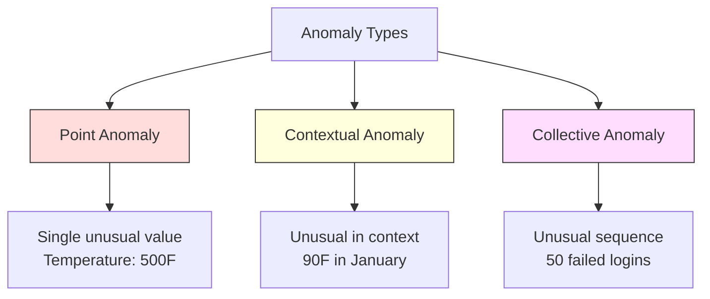
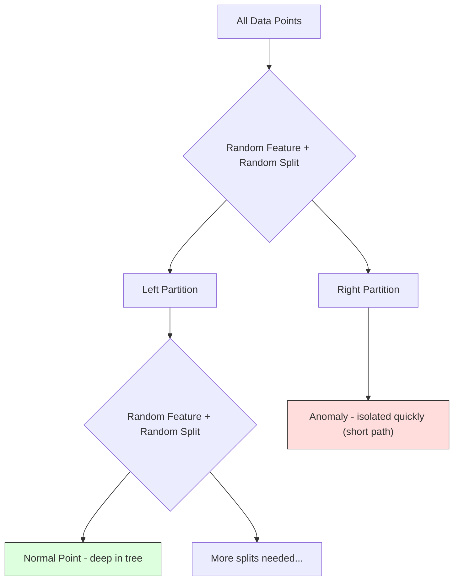
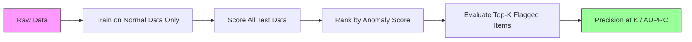

# Detección de anomalías

> Normal es fácil de definir.

**Type:** Build
**Language:**Python
**Prerequisites:** Phase 2, Lessons 01-09
**Time:** ~75 minutes

## El objetivo del aprendizaje

- Desde el 0 de la realización de Z-score, IQR y aislamiento de la detección de anomalías forestales
- 区分点、文脈和集体异常,并为每种选择合适的检测方法, y también para cada método de análisis que se ha elegido
- 解释为什么异常检测被表述为对正常数据 建模,而不是对异常进行分类
- Comparar la detección de anomalías no supervisadas con la clasificación supervisada, y evaluar la anomalía nueva  cobertura y precisión 

##  problemas

Una tarjeta de crédito en Nueva York se utilizó a las 2 de la tarde, luego en Tokio a las 2:05 de la tarde se utilizó. Una tarjeta de crédito en una fábrica tiene una lectura de 150 grados, mientras que el rango normal es de 80-120 grados. Un servidor envía 50.000 solicitudes por segundo, mientras que el promedio diario es de 200.

Estas son anomalías. Encontrarlas es importante. El fraude causará pérdidas de miles de millones de dólares.

El reto es que: usted muy pocas veces posee anomalías con etiquetas Muestras. El fraude sólo ocupa el 0,1% de las transacciones.

Detección de anomalías Reverso ha cambiado el problema. No se aprenda lo que es anormal, sino lo que es normal. Cualquier desviación de lo normal es cuestionable. Este método no necesita etiquetado, puede adaptarse a nuevos tipos de anomalías y puede extenderse a un conjunto de datos de la masa.

## 概念

### Tipo de anomalías

No todas las anomalías son las mismas:

- **Point anomalies.**单个数据点无论上下文如何都很异常──500 度的温度读数──一个通常消费 $50 的账户发生 $50.000 de las transacciones.
- **Contextual anomalies.**某数据点在给定下文下异常──90° en verano es normal, en invierno es anormal──同一个值,不同上下文──
- **Collective anomalies.**Un grupo de puntos de datos como un todo es inusual, incluso si cada punto de datos individual puede ser normal.

La mayoría de los métodos de análisis de anomalías de puntos. Las anomalías contextuales necesitan tiempo o características de posición.



### No supervisado

En la Clasificación Estándar, tienes dos categorías de etiquetas. En la Detección de Anomalías, normalmente te encuentras con una de las siguientes tres situaciones:

1. **Fully unsupervised.**完全没有标签──你在所有数据上配合探测器,并希望异常 足够稀少,不会污染"正常"模型──
2. **Semi-supervised.**Tienes un conjunto de datos que sólo contiene datos normales. Te adaptas a este conjunto de datos, y luego te adaptas a todos los demás datos. Si es posible, es la configuración más fuerte.
3. **Weakly supervised.**Usted tiene una pequeña cantidad de anomalías de etiquetas. Los utilizará para evaluar, en lugar de entrenar.

关键洞见:Detección de anomalías y clasificación Hay diferencias de calidad.

### Supervisado vs No supervisado:权衡

Si realmente hay anomalías de etiquetado, ¿deberíamos usarlas para entrenar la Clasificación supervisada, o solo para evaluar la detección no supervisada?

**Supervised（当作 Classification 处理）：**
- 能捕捉你以前见过的确定的异常 类型
- Tipo de anomalía conocida con mayor precisión
- Se perderá completamente la anomalía de la novela
- Cuando surge una nueva anomalía, se necesita reentrenamiento.
-  necesita suficiente de anomalía ejemplos ((generalmente demasiado poco)

**Unsupervised（对 normal 建模，标记偏离项）：**
- 能 captar cualquier situación que se aleje de lo normal, incluyendo el tipo de novela 
- No necesita llevar anómalas etiquetas
- tasa de falsos positivos (más alto)
- Para el cambio de distribución más robusto

实践中,最好的系统会结合两者: con detección no supervisada 获得广覆盖, con modelos supervisados 处理已知的高优先级异常 类型,并让人工审查模糊案例──

### Z-Score 方法

El método más simple es calcular la media y la desviación estándar de cada característica.

```text
z_score = (x - mean) / std
anomaly if |z_score| > threshold
```

默认门是3.0(Para la distribución gaussiana, el 99,7% de los datos normales 落在 3 个标准偏差范围内) ]]

**优点：**简单――快速――可解释("Este valor a distancia de lo normal tiene 4,5 desviaciones estándar")

**缺点：**假设数据服从正常分布──对训练数据中的异差点 敏感(异差点会移动 mean并增大std,使它们更难被检测出来)──在多模分布上失效──

**适用场景：**Datos de gran tamaño de la distribución de la hora  monitoreo ⋅ tiempo de respuesta del servidor ⋅ tiempo de fabricación ⋅ cantidad de sensores de base estable ⋅

**失效场景：**Muchos clusters de datos (dos oficinas con diferentes puntos de referencia) ̊ datos distorsionados (en el volumen de operaciones de 1000$) ̊ muy poco se ve pero no es anómalo) ̊ entrenamiento concentración contiene datos de valores excepcionales¬¬¬¬¬¬¬¬¬¬¬¬¬¬¬¬¬¬¬¬¬¬¬¬¬¬¬¬¬¬¬¬¬¬¬¬¬¬¬¬¬¬¬¬¬¬¬¬¬¬¬¬¬¬¬¬¬¬¬¬¬¬¬¬¬¬¬¬¬¬¬¬¬¬¬¬¬¬¬¬¬¬¬¬¬¬¬¬¬¬¬¬¬¬¬¬¬¬¬¬¬¬¬¬¬¬¬¬¬¬¬¬¬¬¬¬¬¬¬¬¬¬¬¬¬¬¬¬¬¬¬¬¬¬¬¬¬¬¬¬¬¬¬¬¬¬¬¬¬¬¬¬¬¬¬¬¬¬¬¬¬¬¬¬¬¬¬¬¬¬¬¬¬¬¬¬¬¬¬¬¬¬¬¬¬¬¬¬¬¬¬¬¬¬¬¬¬¬¬¬¬¬¬¬¬¬¬¬¬¬¬¬¬¬¬¬¬¬¬¬¬¬¬¬¬¬¬¬¬¬¬¬¬¬¬¬¬¬¬¬¬¬¬¬¬¬¬¬¬¬¬¬¬¬¬¬¬¬¬¬¬¬¬¬¬¬¬¬¬¬¬¬¬¬¬¬¬¬¬¬¬¬¬¬¬¬¬¬¬¬¬¬¬¬¬¬¬¬¬¬¬¬¬¬¬¬¬¬¬¬¬¬¬¬¬¬¬¬¬¬¬¬¬¬¬¬¬¬¬¬¬¬¬¬¬¬¬¬¬¬¬¬¬¬¬¬¬¬¬¬¬¬¬¬¬¬¬¬¬¬¬¬¬¬¬¬¬¬¬¬¬¬¬¬¬¬¬¬¬¬¬¬¬¬¬¬¬¬¬¬¬¬¬¬¬¬¬¬¬¬¬¬¬¬¬¬¬¬¬¬¬¬¬¬¬¬¬¬¬¬¬¬¬¬¬¬¬¬¬¬¬¬¬¬¬¬¬¬¬¬¬¬¬¬¬¬¬¬¬¬¬

### RSI 方法

Más robusto que el Z-score, utiliza el rango intercuartilar, en lugar de la media y la desviación estándar.

```
Q1 = 25th percentile
Q3 = 75th percentile
IQR = Q3 - Q1
lower_bound = Q1 - factor * IQR
upper_bound = Q3 + factor * IQR
anomaly if x < lower_bound or x > upper_bound
```

El factor de admisión es 1,5:

**优点：**Para valores fuera de línea robustos (%) los porcentajes no se ven afectados por el extremo extremo ().

**缺点：**                                                                                                                                                                                                                                                              

**实践说明：**El factor 1.5 en el IQR para la relación entre los bigotes en el gráfico de la caja.

### Bosque aislado

关键洞见: las anomalías son de menor cantidad y con mucha gente. Cuando se hace una partición aleatoria de datos, las anomalías son más fáciles de separar, solo necesitan menos divisiones aleatorias para poder separarse del resto de datos.



**工作方式：**
1. Construir muchos árboles aleatorios (un bosque aislado)
2. En cada nodo, elegir una característica, y en esa característica de min y max  entre elegir un valor dividido
3. continuos divididos, hasta que cada punto está separado  en su propia hoja)
4. Anomalias en todos los árboles arriba con más cortas medias de longitud del camino

**为什么有效：**Los puntos normales se encuentran en regiones densas. Se necesitan muchas divisiones aleatorias para separar un punto de sus vecinos. Las anomalías se encuentran en regiones escasas.

Anomaly score  Based on all trees                                                                                                                                                                                                                                                                                                                                                                                                                                                                                                                    

```
score(x) = 2^(-average_path_length(x) / c(n))
```

Entre ellos `c(n)`Es decir, el número de muestras de la muestra es de 0,0 y el número de muestras es de 0,0 y el número de muestras es de 0,0 y el número de muestras es de 0,0 y el número de muestras es de 0,0 y el número de muestras es de 0,0 y el número de muestras es de 0,0 y el número de muestras es de 0,0 y el número de muestras es de 0,0 y el número de muestras es de 0,0 y el número de muestras es de 0,0 y el número de muestras es de 0,0 y el número de muestras es de 0,0 y el número de muestras es de 0,0 y el número de muestras es de 0,0 y el número de muestras es de 0,0 y el número de muestras es de 0,0 y el número de muestras es de 0,0 y el número de muestras es de 0,0 y el número de muestras es de 0,0 y el número de muestras es de 0,0 y el número de muestras es de 0, y el número de muestras es de 0, y el número de muestras es de 0, y el número de muestras es de la cifra es de la cifra de la cifra de la cifra de la cifra de la cifra de la cifra de la cifra de la cifra de la cifra de la cifra de la cifra de la cifra de la cifra de la cifra de la cifra de la cifra de la cifra de la cifra de la cifra de la cifra de la cifra de la cifra de la cifra de la cifra de la cifra de la cifra de la cifra de la cifra de la cifra de la cifra de la cifra de la cifra de la cifra de la cifra de la cifra de la cifra de la cifra de la cifra de la cifra de la cifra de la cifra de la cifra de la cifra de la cifra de la cifra de la cifra de la cifra de la cifra de la cifra de la cifra de la cifra de la cifra de la cifra de la cifra de la cifra de la cifra de la cifra de la cifra de la cifra de la cifra de la cifra de la cifra de la que se ha de la que se habiendo en la que se habiendo en la que se habiendo en el de la del del del del del del del del del del del del del del del del del del del del del del del del del del del del del del del del del del del del del del del del del del del del

**优点：**没有 hipótesis de distribución── se aplica a grandes dimensiones── expand性好(由于每棵树使用子样本,所以相对于样本大小是子线性)──处理混合特征类型──

**缺点：**难以处理密集地区 中的异常 (异异异异异异异异异异异异异异异异异异异异异异异异异异异异异异异异异异异异异异异异异异异异异异异异异异异异异异异异异异异异异异异异异异异异异异异异异异异异异异异异异异异异异异异异异异异异异异异异异异异异异异异异异异异异异异异异异异异异异异异异异异异异异异异异异异异异异异异异异异异异异异异异异异异异异异异异异异异异异异异异异异异异异异异异异异异异异异异异异异异异异异异异异异异异异异异异异异异异异异异异异异异异异异异异异异异异异异异异异异异异异异异异异异异异异异异异异异异异异异异异异异异异异异异异异异异异异异异异异异异异异异异异异异异异异异异异异异异异异异异异异异异异异异异异异异异异异异异异异异异异异异异异异异异异异异异异异异异异异异异异异异异异异异异异异异异异异异异异异异异异异异异异异异异异异异异异异异异异异异异异异异异异异异异异异异异异异异异异异异异异异异异异异异异异异异异异异异异异异异异异异异异异异异异异异异异异异异异异异异异异异异异异异异异异异异异异异异异异异异异异异

**关键 hyperparameters：**
- `n_estimators`Los árboles: Número, 100 normalmente suficiente, más árboles traerán puntuaciones más estables, pero calcular más lento.
- `max_samples`: Muestras de cada árbol Número de ejemplos. El valor de parámetro es de 256 ejemplos.
- `contamination`预期异常比例──只用于设置门──不影响分 本身──

### Factor local de extranjero (LOF)

LOF comparará la densidad local alrededor de un punto con la densidad de sus vecinos.

**工作方式：**
1. Para cada punto, encontrar su k vecinos más cercanos
2. 计算 local de la densidad de accesibilidad (desacidad de accesibilidad local)
3. Comparar la densidad de cada punto con la densidad de sus vecinos
4. Si la densidad de un punto es menor que la de sus vecinos, es más extrema.

**LOF score：**
- LOF  cerca de 1.0 Muestra densidad con los vecinos
- LOF mayor a 1.0 muestra densidad  inferior a los vecinos(可能異常)
- LOF 远大于 1.0 (por ejemplo, 2.0+) significa densidad 显著更低 (se puede decir que es una anomalía)

"local" 部分至关重要── considerar un conjunto de datos de dos cúmulos: uno que contiene un cúmulo denso de 1000 puntos, otro que contiene un cúmulo escaso de 50 puntos── un cúmulo escaso de 50 puntos 边缘的一个点并非全局不寻常,它有50邻居── pero si sus vecinos directos son más densos que él, entonces es lo suficientemente inusual──LOF 捕捉到全球方法会漏掉这种微微差──

**优点：**检测 local anomalies (en sus vecinos de dominio de puntos de anomalía, incluso si no son de anomalía de la zona entera) ⋅ se aplica a grupos de diferentes densidades ⋅

**缺点：**En grandes datos, la implementación es lenta (n^2): (■) en las dimensiones muy altas, el efecto es malo (■) en las dimensiones muy altas, la maldición de la dimensión afectará los cálculos de distancia).

### En comparación

| Method | Assumptions | Speed | Handles High Dims | Detects Local Anomalies |
|--------|------------|-------|-------------------|------------------------|
| Z-score | Normal distribution | 非常快 | 是（逐 feature） | 否 |
| IQR | 无（逐 feature） | 非常快 | 是（逐 feature） | 否 |
| Isolation Forest | 无 | 快 | 是 | 部分 |
| LOF | Distance 有意义 | 慢 | 较差 | 是 |

###  evaluar el reto

evaluación de detectores de anomalías en comparación con los clasificadores de evaluación

- **Extreme class imbalance.**Si las anomalías representan el 0,1%, se predice que todo el contenido es "normal" y obtiene una precisión del 99,9%.
- **AUROC 具有误导性。**En un grave desequilibrio, incluso en los umbrales reales, el AUROC también puede parecer mal.
- **更好的 metrics：**Precision@k(top k 被标记项中的多少是真相异常) 、AUPRC(precision-recall curve 下面积),以及在固定假正率下的回忆──



### El gasoducto de detección de anomalías

实践中,Detección de Anomaly  seguir el siguiente flujo de trabajo:

1. **收集 baseline data.**En el caso ideal, elegir una que sepa que no hay (o casi no) anomalías de los períodos.
2. **Feature engineering.**Las características primitivas, además de las características derivadas, las estadísticas de desplazamiento, las características temporales, las relaciones)
3. **训练 detector.**En los datos de base, los modelos de aprendizaje "normal" se encuentran en el mismo estado.
4. **对新数据打分.**Cada nueva observación obtendrá una puntuación de anomalía.
5. **Threshold selection.**选择分分截止――这是业务决策:更高门意味着虚警报更少,但错过异常更多――
6. **Alert and investigate.**El punto de marcado entra en la revisión artificial o en la respuesta automática.
7. **Feedback collection.**记录被标记项是真实异常也是假警报――使用这些数据评估探测器,并随着时间调整门──

El gasoducto ∼ siempre no está "hecho"― Las distribuciones de datos 会漂移, nuevas anomalías 类型 aparecerán, umbrales también necesitan ser ajustados―把 Anomaly Detection 当作一个持续运行的系统,而不是 un modelo de una sola vez―


```figure
f3-anomaly-fence
```

## Construirlo

`code/anomaly_detection.py`El código medio desde cero ha logrado el Z-score, el IQR y el Bosque de aislamiento.

### Detector de puntaje Z

```python
def zscore_detect(X, threshold=3.0):
    mean = X.mean(axis=0)
    std = X.std(axis=0)
    std[std == 0] = 1.0
    z = np.abs((X - mean) / std)
    return z.max(axis=1) > threshold
```

简单且向量化──如果任何特征 超过门,就标记该点──

### Detector de RIC

```python
def iqr_detect(X, factor=1.5):
    q1 = np.percentile(X, 25, axis=0)
    q3 = np.percentile(X, 75, axis=0)
    iqr = q3 - q1
    iqr[iqr == 0] = 1.0
    lower = q1 - factor * iqr
    upper = q3 + factor * iqr
    outside = (X < lower) | (X > upper)
    return outside.any(axis=1)
```

### Desde el punto de vista de la aislamiento del bosque

Desde la versión de implementar de cero construir árboles de aislamiento, realizar una partición aleatoria en el espacio de características:

```python
class IsolationTree:
    def __init__(self, max_depth):
        self.max_depth = max_depth

    def fit(self, X, depth=0):
        n, p = X.shape
        if depth >= self.max_depth or n <= 1:
            self.is_leaf = True
            self.size = n
            return self
        self.is_leaf = False
        self.feature = np.random.randint(p)
        x_min = X[:, self.feature].min()
        x_max = X[:, self.feature].max()
        if x_min == x_max:
            self.is_leaf = True
            self.size = n
            return self
        self.threshold = np.random.uniform(x_min, x_max)
        left_mask = X[:, self.feature] < self.threshold
        self.left = IsolationTree(self.max_depth).fit(X[left_mask], depth + 1)
        self.right = IsolationTree(self.max_depth).fit(X[~left_mask], depth + 1)
        return self
```

隔离某个点所需的路径长度决定它的异常分数――更短的路径表示更异常――

`IsolationForest`clase 包装了多棵树:

```python
class IsolationForest:
    def __init__(self, n_estimators=100, max_samples=256, seed=42):
        self.n_estimators = n_estimators
        self.max_samples = max_samples

    def fit(self, X):
        sample_size = min(self.max_samples, X.shape[0])
        max_depth = int(np.ceil(np.log2(sample_size)))
        for _ in range(self.n_estimators):
            idx = rng.choice(X.shape[0], size=sample_size, replace=False)
            tree = IsolationTree(max_depth=max_depth)
            tree.fit(X[idx])
            self.trees.append(tree)

    def anomaly_score(self, X):
        avg_path = average path length across all trees
        scores = 2.0 ** (-avg_path / c(max_samples))
        return scores
```

Fáctor de normalización `c(n)`Está en el árbol de búsqueda binaria de n 个元素 中一次失败搜索的预期路径长度──它等于`2 * H(n-1) - 2*(n-1)/n`, entre ellos `H`Es un número armónico. Esta normalización garantiza que los puntajes se comparan entre diferentes grupos de datos.

### Demo 场景

代码生成多个测试场景:

1. **Single cluster with outliers.**Un cúmulo Gaussian 2D, y en una posición muy alejada del centro inyectan anomalías. Todos los métodos aquí deben ser eficaces.
2. **Multimodal data.**Tres grupos de diferentes dimensiones y densidades. Los puntos entre los grupos son anómalicos.
3. **High-dimensional data.**50 características, pero las anomalías sólo están en 5 de ellas.

Cada demo utiliza precisión, recall, F1 y Precision@k

## Usalo

Utiliza sklearn( utiliza库实现, en lugar de desde零实现):

```python
from sklearn.ensemble import IsolationForest
from sklearn.neighbors import LocalOutlierFactor

iso = IsolationForest(n_estimators=100, contamination=0.05, random_state=42)
iso.fit(X_train)
predictions = iso.predict(X_test)

lof = LocalOutlierFactor(n_neighbors=20, contamination=0.05, novelty=True)
lof.fit(X_train)
predictions = lof.predict(X_test)
```

Atención,`contamination`设置预期异常例如──正确设置它很重要,太低会漏掉异常,太高会产生假警报──

`anomaly_detection.py`El código medio se compara en los mismos datos desde la versión de implementación a la versión de sklearn.

### Parámetro de contaminación de sklearn

sklearn 中的 `contamination`Parámetro decide cómo convertir los puntajes de continuidad de anomalía en el umbral de predicciones binarias.

```python
iso_5 = IsolationForest(contamination=0.05)
iso_10 = IsolationForest(contamination=0.10)
```

两者产生相同的异常分数.`iso_5`标记 top 5%, y `iso_10`标记 top 10%── Si no sabes la tasa de anomalía real (normalmente no sabes), la contaminación se establecerá como "auto",并 directamente utilizar puntajes crudos── basándose en los falsos positivos y los falsos negativos  costo peso establecer su propio umbral──

### M.S.V. de una clase

Otro detektor de anomalías no supervisadas que vale la pena conocer. Un SVM de una clase se encuentra en un espacio de características de alta dimensión alrededor de datos normales.

```python
from sklearn.svm import OneClassSVM

oc_svm = OneClassSVM(kernel="rbf", gamma="auto", nu=0.05)
oc_svm.fit(X_train)
predictions = oc_svm.predict(X_test)
```

`nu`Parámetro 近似表示异常的比例──One-Class SVM 在小到中等数据集上效果很好,但无法扩展到非常大的数据(núcleo matrix 会平方增长)──

### Autoencoder enfoque(预览)

Autoencoder es el aprendizaje de compresión y reestructuración de datos de la red neuronal. En los datos normales, las anomalías tendrán un mayor número de errores de reconstrucción, ya que la red sólo ha aprendido a reestructurar patrones normales.

Esto se desarrollará en la Fase 3 del aprendizaje profundo, pero el principio es el mismo:

### Ensemble Detección de Anomalias

Así como los métodos de conjunto, ¿Cómo mejorar la Clasificación? (lección 11) , ¿Cómo mejorar el resultado de la prueba?

1. 运行多个探测器(Z-score、IQR、isolación Forest、LOF)
2. Los puntajes de cada detector se normalizarán a [0, 1]
3. Para las puntuaciones normalizadas                                                                                                                                                                                                                                                                                                                                                                                                                                                                                                                      
4. 标记平均分高于门 的点

Esto reducirá los falsos positivos, ya que los diferentes métodos tienen diferentes modos de fracaso. Los puntos marcados por cuatro métodos son casi definitivamente anómalicos.

Más complejos conjuntos se asignarán de peso en función de la estimación de la fiabilidad de cada detector (si hay un conjunto de validación de anomalías conocidas, se puede medir en él)

### ¿Cuál es el ambiente de producción?

1. **Threshold drift.**随着数据分布 漂移, fijación del umbral 会过时――监控 anomaly scores 的分布,并定期调整──
2. **Alert fatigue.**Las alarmas falsas 太多时, los operadores se detendrán de prestar atención.
3. **Ensemble approach.**En el entorno de producción, la combinación de varios detectores. Sólo en varios métodos se considera que un punto es anómalo cuando se marca. Esto reduce significativamente los falsos positivos.
4. **Feature engineering.**Las características primitivas normalmente no son suficientes. Añadir estadísticas de rodamiento, ratios, tiempo desde el último evento y características específicas de dominio.
5. **Feedback loop.**Cuando los operadores de la investigación confirman o rechazan los datos marcados, estos sistemas de entrada se van a utilizar para evaluar y mejorar el detector.

##  entregarlo

本课产 出:
- `outputs/skill-anomaly-detector.md`-- Una habilidad para elegir un detector de la decisión
- `code/anomaly_detection.py`-- desde cero logrado Z-score、IQR y bosque de aislamiento, y comparación con el sklearn

### 选择 Umbral

El puntaje anómalo es el valor continuo. Necesitas un umbral para tomar decisiones binarias.

考虑两个 escenarios:
- **Fraud detection.**漏掉欺诈代价很高(拒付、客户信任) ――El costo de las falsas alarmas es un análisis artificial 5 分钟── se establecerá un umbral bajo para capturar más fraude, y recibir más falsas alarmas──
- **Equipment maintenance.**Falso alarma significa una vez no es necesario parar, el costo es $50,000。missed failure 意味着 $El objetivo de la Comisión es establecer un umbral de 500.000 de reparaciones para equilibrar estos costes.

En dos casos, el umbral óptimo depende de la proporción de costes entre falsos positivos y falsos negativos.

###  Extensión a medio ambiente de producción

对于生产环境中的实时异常检测:

1. **Batch training, online scoring.**定期(每天、每周) en datos normales de reciente período 上训练模型── cada nueva observación hasta el momento de realizar puntuaciones──
2. **Feature computation must match.**Si en el entrenamiento se utilizan las estadísticas de rodamiento de 30 天 ventanas, entonces se necesita 30 天历史 para una nueva observación 计算功能──缓存需要历史──
3. **Score distribution monitoring.**Seguir las puntuaciones de anomalía con el tiempo  distribución  Si la puntuación media se mueve, o los datos están cambiando, o el modelo  ya pasó 
4. **Explainability.**Cuando usted marque una anomalía 时,说明原因──Z-score:"Figuración X superior a la norma Alta 4.2 个标准偏差──"Islación Bosque:" este punto promedio en 3.1 veces se divide en separados(puntos normales 需要8.5 veces)──"

##  ejercicios

1. **Threshold tuning.**Utilice un detector de puntaje Z desde 1.0 hasta 5.0  Cuál es el mejor punto de equilibrio de sus datos?

2. **Multivariate anomalies.** Crea datos 2D, cada una de las características 单独看都像正常, pero la combinación se encuentra anómala, por ejemplo, lejos de los puntos diagonales del cúmulo principal.

3. **从零实现 LOF.**Utiliza k-vicinos más cercanos                                                                                                                                                                                                                                                                                                                                                                                                                                                                                                                    

4. **Streaming Anomaly Detection.**Modificar el detector de Z-score, hacer que sea en el entorno de transmisión.

5. **Real-world evaluation.** seleccionar un conjunto de datos con anomalías conocidas (por ejemplo, fraude de tarjetas de crédito de Kaggle)  utilizar precision@100、precision@500 和 AUPRC 评估全部四种方法──哪种方法效果最好?为什么?

## 关键术语: "El hombre es un hombre"

| Term | 人们通常怎么说 | 它实际意味着什么 |
|------|----------------|----------------------|
| Anomaly | "Outlier，异常点" | 一个明显偏离 normal data 预期模式的数据点 |
| Point anomaly | "单个奇怪的值" | 一个无论上下文如何都异常的单独 observation |
| Contextual anomaly | "normal 值，错误上下文" | 一个在给定上下文（时间、位置等）下异常、但在另一个上下文中可能 normal 的 observation |
| Isolation Forest | "用 random splits 找 outliers" | 一种 random trees 的 ensemble，它能用比 normal points 更少的 splits 隔离 anomalies |
| Local Outlier Factor | "把 density 和 neighbors 比较" | 一种标记 local density 明显低于其 neighbors density 的点的方法 |
| Z-score | "距离 mean 的 standard deviations 数" | (x - mean) / std，用 standard deviation 为单位衡量某个点距离中心有多远 |
| IQR | "Interquartile range" | Q3 - Q1，衡量数据中间 50% 的 spread，用于 robust outlier detection |
| Contamination | "预期 anomalies 比例" | 一个 hyperparameter，用于告诉 detector 应该将数据中多大比例标记为 anomalous |
| Precision@k | "top k flags 中有多少是真的" | 只在 k 个最可疑点上计算的 precision，适用于 imbalanced Anomaly Detection |
| AUPRC | "Precision-recall curve 下的面积" | 一个汇总所有 thresholds 下 precision-recall 表现的 metric，对 imbalanced data 比 AUROC 更好 |

## 延伸阅读

- [Liu et al., Isolation Forest (2008)](https://cs.nju.edu.cn/zhouzh/zhouzh.files/publication/icdm08b.pdf)-- 原始 aislamiento bosque 论文
- [Breunig et al., LOF: Identifying Density-Based Local Outliers (2000)](https://dl.acm.org/doi/10.1145/342009.335388)-- 原始 LOF 论文
- [scikit-learn Outlier Detection docs](https://scikit-learn.org/stable/modules/outlier_detection.html)-- Todos los detectores de anomalías de la tienda
- [Chandola et al., Anomaly Detection: A Survey (2009)](https://dl.acm.org/doi/10.1145/1541880.1541882)-- Anomalia Detección 方法的综合综述
- [Goldstein and Uchida, A Comparative Evaluation of Unsupervised Anomaly Detection Algorithms (2016)](https://journals.plos.org/plosone/article?id=10.1371/journal.pone.0152173)-- En el conjunto de datos real comparar las pruebas de 10 métodos
