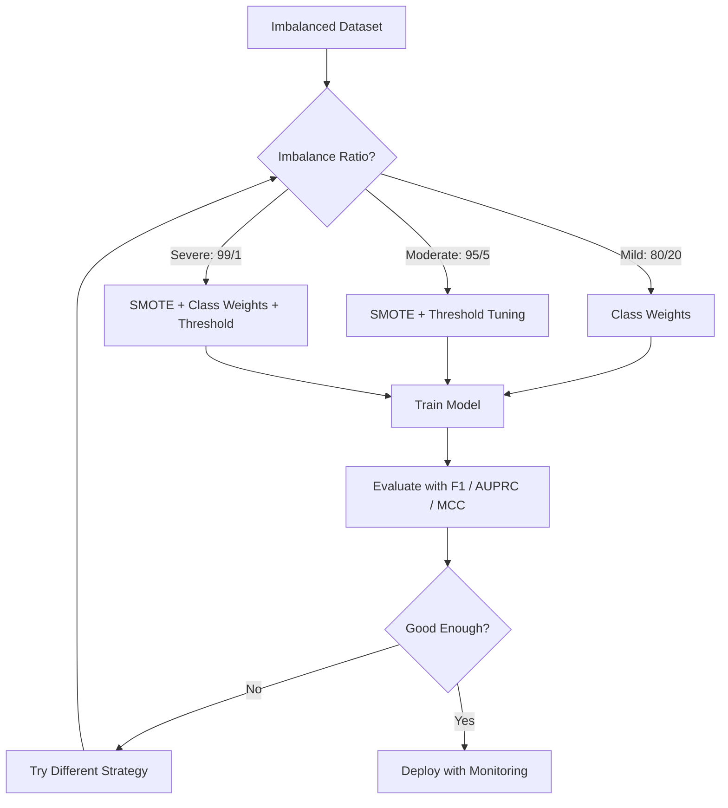
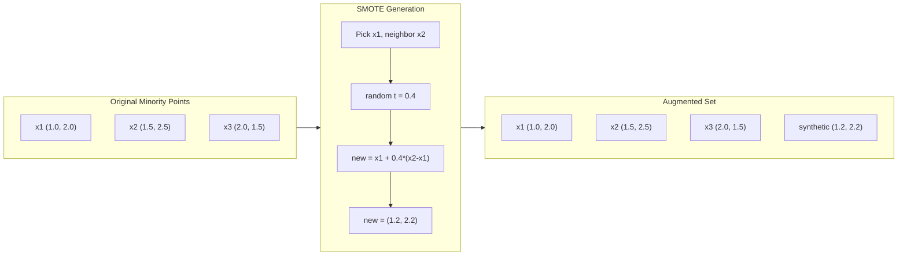
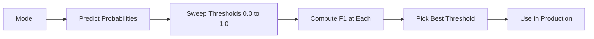
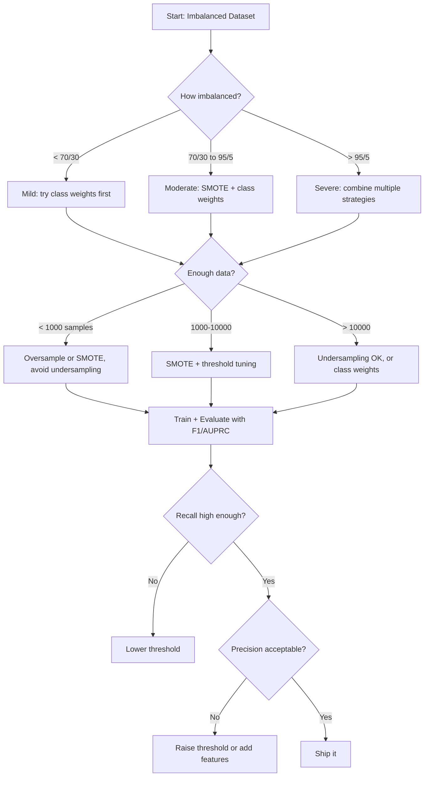

# 处理不平衡数据

> Cuando tu datos tienen el 99% de ellos son normales, la precisión es una mentira.

**类型：**Construir
**语言：**Python
**先修要求：**Fase 2, Lecciones 01-09 (especialmente evaluación de los indicadores)
**时间：**90 minutos

## El objetivo del aprendizaje

- Desde la implementación de SMOTE,并 explica la diferencia entre el sobresampliado sintético y la copia de forma automática
- Utiliza F1、AUPRC 和 Matthews Coefficient de Correlación  evalúa el clasificador de desequilibrio, en lugar de usar la precisión
- Comparar la ponderación de clase, el ajuste del umbral y la estrategia de repetición,并为给定的不平衡比例选择合适方法
- Construir un completo oleoducto de datos desequilibrados, en combinación con SMOTE 、 pesos de clase y optimización del umbral

##  problemas

Usted construyó un modelo de análisis de fraude. Llegó a un 99,9% de precisión. Usted está muy contento. Luego se dio cuenta de que se predice a cada transacción como una transacción no fraudulenta.

Esto no es un error. Cuando solo el 0,1% de las transacciones son engañosas, es una práctica racional. El modelo aprendido es que siempre se puede minimizar el error general.

Clasificación 场景,都会遇到这种情况──疾病诊断:1% 阳性率──网络入侵:0.01% 攻击──制造缺陷:0.5% 缺陷率──垃圾邮件过:20% 垃圾邮件──流失预测:5% 流失用户──少数群 越重要,往往越稀少──

La precisión fracasará, porque trata todas las predicciones correctas de igual manera. La precisión marca una transacción legal y la correcta captura de una estafa, todo esto sólo se calcula en parte por la precisión. Pero la captura de estafa es la razón por la cual el modelo existe. Necesitamos poder obligar al modelo a prestar atención a los rares pero importantes tipos de indicadores, técnicas y estrategias de entrenamiento.

## 概念

### ¿Por qué la precisión fracasará ?

考虑一个包含1000 样本的数据集:990 个负,10 个正――一个始终预测负的模型:

|  | Predicted Positive | Predicted Negative |
|--|---|---|
| Actually Positive | 0 (TP) | 10 (FN) |
| Actually Negative | 0 (FP) | 990 (TN) |

Precisión = (0 + 990) / 1000 = 99,0%

El modelo ha capturado el engaño de la infamiación, la enfermedad y la falta de la precisión, pero el 99% de la precisión es el resultado de la precisión.

### Mejor indicador

**Precision**= TP / (TP + FP) ―― En todos los ejemplos marcados como positivos, ¿hay realmente mucho positivo?

**Recall**= TP / (TP + FN) ⋅ En todos los ejemplos de verdadero positivo, ¿qué cantidad hemos capturado?

**F1 Score**= 2 * precisión * recuerdo / (precisión + recuerdo) ――调和平均数──相比算术平均数,它会更严厉地惩罚精度和回忆 之间极端不平衡──

**F-beta Score**= (1 + beta^2) * precisión * recuerdo / (beta^2 * precisión + recuerdo) ―― cuando beta > 1 时, recuerdo 更重要──当 beta < 1 时, precisión 更重要──F2 在欺诈检测中很常见(漏掉欺诈比误报更糟)

**AUPRC**(Area Bajo Curva de Recuerdo de Precisión) ―― similar a AUC-ROC, pero para los datos no equilibrados tiene más información.

**Matthews Correlation Coefficient**= (TP * TN - FP * FN) / sqrt((TP+FP)(TP+FN)(TN+FP)(TN+FN))。 Rango de -1 a +1。 Sólo cuando el modelo en dos categorías se desempeñe bien, cuando sólo dará un alto分── incluso si la diferencia de tamaño de las categorías es grande, también mantener el equilibrio──

对于上始终预测负的模型:精度 = 0/0(未定义,通常设为0),回忆 = 0/10 = 0,F1 = 0,MCC = 0──这些指标正确地识别出该模型无价值──

### Inequilibrio de datos



### SMOTE: Técnica de sobresamplificación de la minoría sintética

随时过样本会复制现有的少数样本──这能起作用,但有过适合风险,因为模型会反复看到完全相同点──

SMOTE se creará un nuevo ejemplar de minoría sintética, estos ejemplos parecen razonables, pero no secundarios.

1. Para cada minoría muestra x, entre otras minorías muestra encontrar su k 个近邻
2. 随机选择一个邻居
3. En la línea entre x y el vecino crear un nuevo modelo

公式:`new_sample = x + random(0, 1) * (neighbor - x)`

Esto se realizará en la verdadera minoría de puntos entre valores, en la misma región del espacio de características, en lugar de simplemente copiar los datos existentes.



### Estrategia de muestreo

**Random Oversampling**: Copia minoría 样本, haciendo que su número coincida con la mayoría¬
- 优点:简单, no hay pérdida de información
- 缺点: completa重复 conducirá a la sobreadaptación, aumentar el tiempo de entrenamiento

**Random Undersampling**: Eliminar la mayoría de los ejemplos, haciendo que su número coincida con la minoría.
- 优点: entrenamiento rápido,简单
- 缺点: Perder la mayoría potencialmente útil Datos, cuadro

**SMOTE**Por medio de la creación de una minoría sintética
- 优点: generar nuevos datos, en comparación con el sobre-muestreo aleatorio  reducido sobre-realización
- 缺点:可能在决策边界 附近创建噪声样本,不考虑多数阶级的分布

| Strategy | Data Changed | Risk | When to Use |
|----------|-------------|------|-------------|
| Oversample | 复制 minority | 过拟合 | 小数据集，中等不平衡 |
| Undersample | 移除 majority | 信息损失 | 大数据集，需要快速训练 |
| SMOTE | 添加 synthetic minority | 边界噪声 | 中等不平衡，有足够 minority 样本用于 k-NN |

### Peso de clase

En lugar de cambiar los datos, no se puede cambiar el modelo de manejo de errores.

 Para un ejemplar de dos divisas que contiene 950 negativos y 50 positivos:
- clase negativa 的权重 = n_samples / (2 * n_negativo) = 1000 / (2 * 950) = 0.526
- clase positiva 的权重 = n_samples / (2 * n_positive) = 1000 / (2 * 50) = 10,0

clase positiva  obtuvo 19 倍权重──误分类 错分类 错分类 错分类 错分类 错分类 19 负类 错分类 错分类 错分类 错分类 错分类 负类 模型被迫关注少数阶级──

En la regresión logística, esto modificará la función de pérdida:

```
weighted_loss = -sum(w_i * [y_i * log(p_i) + (1-y_i) * log(1-p_i)])
```

Entre ellos, se basa en la categoría de muestras.

Los pesos de clase en el sentido esperado y el sobre-muestreo en el precio matemático, pero no crean nuevos puntos de datos. Esto los hace más rápidos, y evita el riesgo de sobreadaptación de repetición de muestras.

### La regulación del umbral

La mayoría de los clasificadores se producen con una probabilidad. Si P (p) = 0.5, el valor de la probabilidad es 0.5.

流程:
1. 训练一个模型
2. En el conjunto de validación 上获取预测概率
3. De 0.0 a 1.0  Valor de la exploración
4. En cada valor calculado F1 ((o indicador de tu elección)
5. 选择使指标最大的值



Un modelo puede ser clasificado como no fraudulento en un negocio de fraude P (fraude) = 0.15♦ en el valor de 0.5♦, se clasificará como no fraudulento en el valor de 0.10♦, se clasificará correctamente en el caso de la clasificación. La importancia de la calificación de la probabilidad es menor que la de la clasificación: siempre que la probabilidad de obtener una muestra de fraude sea mayor que la de no fraude, existe un valor que puede dividirlas.

### Aprendizaje económico

Forma generalizada de los pesos de clase: no se utiliza el coste de la unificación, sino que se distribuye un coste de la clasificación de la clase:

| | Predict Positive | Predict Negative |
|--|---|---|
| Actually Positive | 0 (correct) | C_FN = 100 |
| Actually Negative | C_FP = 1 | 0 (correct) |

漏掉一笔欺诈交易 (FN) 漏掉一笔欺诈交易 (FN) 漏掉一笔欺诈交易 (FN) 漏掉一笔欺诈交易 (FP) 漏掉一笔欺诈交易 (FP) 漏掉一笔欺诈交易 (FP) 漏掉一笔欺诈交易 (FP) 漏掉一笔欺诈交易 (FP) 漏掉一笔欺诈交易 (FP) 漏掉一笔欺诈交易) 漏掉一笔欺诈交易 (FP) 漏掉一笔欺诈交易 (FP) 漏掉一笔欺诈交易 (FP) 漏掉一笔欺诈交易 (FP) 漏掉一次) 漏掉一笔欺诈交易 (FP) 漏掉一次的成本比一次错报 (FP) 漏错报) 漏错误总成本,而不是总错误数――

Cuando se puede estimar el costo del mundo real, es el método más cómplicado. El diagnóstico de cáncer y una mala notificación provocan extraspectaciones, cuyos costos son completamente diferentes.

###                                                                                                                                                                                                                                                                                                                                                                                                                                                                                                                              




```figure
class-imbalance
```

## Construirlo

### Paso 1: Generar un conjunto de datos desequilibrado

```python
import numpy as np


def make_imbalanced_data(n_majority=950, n_minority=50, seed=42):
    rng = np.random.RandomState(seed)

    X_maj = rng.randn(n_majority, 2) * 1.0 + np.array([0.0, 0.0])
    X_min = rng.randn(n_minority, 2) * 0.8 + np.array([2.5, 2.5])

    X = np.vstack([X_maj, X_min])
    y = np.concatenate([np.zeros(n_majority), np.ones(n_minority)])

    shuffle_idx = rng.permutation(len(y))
    return X[shuffle_idx], y[shuffle_idx]
```

### Paso 2: desde el cero la realización de SMOTE

```python
def euclidean_distance(a, b):
    return np.sqrt(np.sum((a - b) ** 2))


def find_k_neighbors(X, idx, k):
    distances = []
    for i in range(len(X)):
        if i == idx:
            continue
        d = euclidean_distance(X[idx], X[i])
        distances.append((i, d))
    distances.sort(key=lambda x: x[1])
    return [d[0] for d in distances[:k]]


def smote(X_minority, k=5, n_synthetic=100, seed=42):
    rng = np.random.RandomState(seed)
    n_samples = len(X_minority)
    k = min(k, n_samples - 1)
    synthetic = []

    for _ in range(n_synthetic):
        idx = rng.randint(0, n_samples)
        neighbors = find_k_neighbors(X_minority, idx, k)
        neighbor_idx = neighbors[rng.randint(0, len(neighbors))]
        t = rng.random()
        new_point = X_minority[idx] + t * (X_minority[neighbor_idx] - X_minority[idx])
        synthetic.append(new_point)

    return np.array(synthetic)
```

### Paso 3: Muestreo aleatorio y muestreo inferior

```python
def random_oversample(X, y, seed=42):
    rng = np.random.RandomState(seed)
    classes, counts = np.unique(y, return_counts=True)
    max_count = counts.max()

    X_resampled = list(X)
    y_resampled = list(y)

    for cls, count in zip(classes, counts):
        if count < max_count:
            cls_indices = np.where(y == cls)[0]
            n_needed = max_count - count
            chosen = rng.choice(cls_indices, size=n_needed, replace=True)
            X_resampled.extend(X[chosen])
            y_resampled.extend(y[chosen])

    X_out = np.array(X_resampled)
    y_out = np.array(y_resampled)
    shuffle = rng.permutation(len(y_out))
    return X_out[shuffle], y_out[shuffle]


def random_undersample(X, y, seed=42):
    rng = np.random.RandomState(seed)
    classes, counts = np.unique(y, return_counts=True)
    min_count = counts.min()

    X_resampled = []
    y_resampled = []

    for cls in classes:
        cls_indices = np.where(y == cls)[0]
        chosen = rng.choice(cls_indices, size=min_count, replace=False)
        X_resampled.extend(X[chosen])
        y_resampled.extend(y[chosen])

    X_out = np.array(X_resampled)
    y_out = np.array(y_resampled)
    shuffle = rng.permutation(len(y_out))
    return X_out[shuffle], y_out[shuffle]
```

### Paso 4: Retrocesión logística de los pesos de las clases

```python
def sigmoid(z):
    return 1.0 / (1.0 + np.exp(-np.clip(z, -500, 500)))


def logistic_regression_weighted(X, y, weights, lr=0.01, epochs=200):
    n_samples, n_features = X.shape
    w = np.zeros(n_features)
    b = 0.0

    for _ in range(epochs):
        z = X @ w + b
        pred = sigmoid(z)
        error = pred - y
        weighted_error = error * weights

        gradient_w = (X.T @ weighted_error) / n_samples
        gradient_b = np.mean(weighted_error)

        w -= lr * gradient_w
        b -= lr * gradient_b

    return w, b


def compute_class_weights(y):
    classes, counts = np.unique(y, return_counts=True)
    n_samples = len(y)
    n_classes = len(classes)
    weight_map = {}
    for cls, count in zip(classes, counts):
        weight_map[cls] = n_samples / (n_classes * count)
    return np.array([weight_map[yi] for yi in y])
```

### 步骤 5:Aunificación del umbral

```python
def find_optimal_threshold(y_true, y_probs, metric="f1"):
    best_threshold = 0.5
    best_score = -1.0

    for threshold in np.arange(0.05, 0.96, 0.01):
        y_pred = (y_probs >= threshold).astype(int)
        tp = np.sum((y_pred == 1) & (y_true == 1))
        fp = np.sum((y_pred == 1) & (y_true == 0))
        fn = np.sum((y_pred == 0) & (y_true == 1))

        if metric == "f1":
            precision = tp / (tp + fp) if (tp + fp) > 0 else 0.0
            recall = tp / (tp + fn) if (tp + fn) > 0 else 0.0
            score = 2 * precision * recall / (precision + recall) if (precision + recall) > 0 else 0.0
        elif metric == "recall":
            score = tp / (tp + fn) if (tp + fn) > 0 else 0.0
        elif metric == "precision":
            score = tp / (tp + fp) if (tp + fp) > 0 else 0.0

        if score > best_score:
            best_score = score
            best_threshold = threshold

    return best_threshold, best_score
```

### 步骤 6: evaluación de la función

```python
def confusion_matrix_values(y_true, y_pred):
    tp = np.sum((y_pred == 1) & (y_true == 1))
    tn = np.sum((y_pred == 0) & (y_true == 0))
    fp = np.sum((y_pred == 1) & (y_true == 0))
    fn = np.sum((y_pred == 0) & (y_true == 1))
    return tp, tn, fp, fn


def compute_metrics(y_true, y_pred):
    tp, tn, fp, fn = confusion_matrix_values(y_true, y_pred)
    accuracy = (tp + tn) / (tp + tn + fp + fn)
    precision = tp / (tp + fp) if (tp + fp) > 0 else 0.0
    recall = tp / (tp + fn) if (tp + fn) > 0 else 0.0
    f1 = 2 * precision * recall / (precision + recall) if (precision + recall) > 0 else 0.0

    denom = np.sqrt(float((tp + fp) * (tp + fn) * (tn + fp) * (tn + fn)))
    mcc = (tp * tn - fp * fn) / denom if denom > 0 else 0.0

    return {
        "accuracy": accuracy,
        "precision": precision,
        "recall": recall,
        "f1": f1,
        "mcc": mcc,
    }
```

### Paso 7: Compara todos los métodos

```python
X, y = make_imbalanced_data(950, 50, seed=42)
split = int(0.8 * len(y))
X_train, X_test = X[:split], X[split:]
y_train, y_test = y[:split], y[split:]

# Baseline: no treatment
w_base, b_base = logistic_regression_weighted(
    X_train, y_train, np.ones(len(y_train)), lr=0.1, epochs=300
)
probs_base = sigmoid(X_test @ w_base + b_base)
preds_base = (probs_base >= 0.5).astype(int)

# Oversampled
X_over, y_over = random_oversample(X_train, y_train)
w_over, b_over = logistic_regression_weighted(
    X_over, y_over, np.ones(len(y_over)), lr=0.1, epochs=300
)
preds_over = (sigmoid(X_test @ w_over + b_over) >= 0.5).astype(int)

# SMOTE
minority_mask = y_train == 1
X_minority = X_train[minority_mask]
synthetic = smote(X_minority, k=5, n_synthetic=len(y_train) - 2 * int(minority_mask.sum()))
X_smote = np.vstack([X_train, synthetic])
y_smote = np.concatenate([y_train, np.ones(len(synthetic))])
w_sm, b_sm = logistic_regression_weighted(
    X_smote, y_smote, np.ones(len(y_smote)), lr=0.1, epochs=300
)
preds_smote = (sigmoid(X_test @ w_sm + b_sm) >= 0.5).astype(int)

# Class weights
sample_weights = compute_class_weights(y_train)
w_cw, b_cw = logistic_regression_weighted(
    X_train, y_train, sample_weights, lr=0.1, epochs=300
)
probs_cw = sigmoid(X_test @ w_cw + b_cw)
preds_cw = (probs_cw >= 0.5).astype(int)

# Threshold tuning (tune on held-out validation set, not test set)
probs_val = sigmoid(X_val @ w_cw + b_cw)
best_thresh, best_f1 = find_optimal_threshold(y_val, probs_val, metric="f1")
preds_thresh = (probs_cw >= best_thresh).astype(int)
```

El código de archivo se ejecutará en un guión y se imprimirá el resultado.

## Usalo

借助小学学习和失衡学习, estas técnicas son sólo necesarias:

```python
from sklearn.linear_model import LogisticRegression
from sklearn.metrics import classification_report, f1_score
from sklearn.model_selection import train_test_split
from imblearn.over_sampling import SMOTE
from imblearn.under_sampling import RandomUnderSampler
from imblearn.pipeline import Pipeline

X_train, X_test, y_train, y_test = train_test_split(X, y, stratify=y)

model_weighted = LogisticRegression(class_weight="balanced")
model_weighted.fit(X_train, y_train)
print(classification_report(y_test, model_weighted.predict(X_test)))

smote = SMOTE(random_state=42)
X_resampled, y_resampled = smote.fit_resample(X_train, y_train)
model_smote = LogisticRegression()
model_smote.fit(X_resampled, y_resampled)
print(classification_report(y_test, model_smote.predict(X_test)))

pipeline = Pipeline([
    ("smote", SMOTE()),
    ("model", LogisticRegression(class_weight="balanced")),
])
pipeline.fit(X_train, y_train)
print(classification_report(y_test, pipeline.predict(X_test)))
```

Desde la versión de la implementación de cero se mostrará claramente cada tipo de tecnología específica ha hecho lo que ha hecho.

##  entregarlo

Encuentro de trabajo:
- `outputs/skill-imbalanced-data.md`-- una parte de tratamiento desequilibrio Clasificación  decisión del problema

##  ejercicios

1. **Borderline-SMOTE**: Modificar SMOTE 实现, sólo para la minoría cerca de la frontera de decisión 点生成合成样本(即那些 k-nearest neighbours contain majority class 样本的点) ;;

2. **Cost matrix optimization**• Realizar el aprendizaje sensible al coste, en el que la matriz de costes es un parámetro.

3. **Threshold calibration**• Realizar la escalación plana (en el modelo original, en el modelo original, en el modelo original, en el modelo original, en el modelo original, en el modelo original, en el modelo original, en el modelo original, en el modelo original, en el modelo original, en el modelo original, en el modelo original, en el modelo original, en el modelo original, en el modelo original, en el modelo original, en el modelo original, en el modelo original, en el modelo original, en el modelo original, en el modelo original, en el modelo original, en el modelo original, en el modelo original, en el modelo original, en el modelo original, en el modelo original, en el modelo original, en el modelo original, en el modelo original, en el modelo original, en el modelo, en el modelo, en el modelo, en el modelo, en el modelo, en el modelo, en el modelo, en el modelo, en el modelo, en el modelo, en el modelo, en el modelo, en el modelo, en el modelo, en el modelo, en el modelo, en el modelo, en el modelo, en el modelo, en el modelo, en el modelo, en el modelo, en el modelo, en el modelo, en el modelo, en el modelo, en el modelo, en el modelo, en el modelo, en el modelo, en el modelo, en el modelo, en el modelo, en el modelo, en el modelo, en el modelo, en el modelo, en el modelo, en el modelo, en el modelo, en el modelo, en el modelo, en el modelo, en el modelo, en el modelo, en el modelo, en el modelo, en el modelo, en el modelo, en el modelo, en el modelo, en el que se muestra, en el, en el, en el que se utiliza en el, en el, en el, en el, en el, en el caso de, en el, en el, en el caso, en el, en el, en el caso de, en el, en el, en el, en el, en el, en el, en el caso de, en el, en el, en el, en el, en el que se, en el, en el, en el, en el, en el, en el, en el, en el, en el que se, en el, en el, en el, en el, en el, en

4. **Ensemble with balanced bagging**: entrenar varios modelos, cada modelo utiliza un bootstrap equilibrado 样本(todos los grupos de minorías + mayoría de los cuales se preparan por lo general.

5. **Imbalance ratio experiment**:Tenga un conjunto de datos de equilibrio, y gradualmente aumente la proporción de desequilibrio ((50/50、70/30、90/10、95/5、99/1)  Entrenamiento a cada proporción, entre el uso y el no uso de SMOTE  dibujar dos métodos de ratio F1 vs desequilibrio  En qué proporción, SMOTE  comienza a generar diferencias significativas?

## 关键术语: "El hombre es un hombre"

| Term | What people say | What it actually means |
|------|----------------|----------------------|
| Class imbalance | “一个类别的样本多得多” | 数据集中类别分布显著偏斜，导致模型偏向 majority class |
| SMOTE | “Synthetic oversampling” | 通过在现有 minority 样本及其 k-nearest minority neighbors 之间插值，创建新的 minority 样本 |
| Class weights | “让 rare class 上的错误代价更高” | 用特定类别的权重乘以 Loss Function，使模型对 minority 误分类施加更重惩罚 |
| Threshold tuning | “移动 decision boundary” | 将 Classification 的概率 cutoff 从默认 0.5 改为能优化目标指标的值 |
| Precision-recall tradeoff | “你不能两者兼得” | 降低阈值会抓住更多 positive（更高 recall），但也会标记更多 false positive（更低 precision），反之亦然 |
| AUPRC | “PR curve 下的面积” | 将 precision-recall curve 汇总为一个数字；当类别严重不平衡时，比 AUC-ROC 信息量更大 |
| Matthews Correlation Coefficient | “平衡指标” | 预测标签与真实标签之间的相关性；只有模型在两个类别上都表现良好时才会产生高分 |
| Cost-sensitive learning | “不同错误的代价不同” | 将现实世界中的误分类成本纳入训练目标，使模型优化总成本，而不是错误数量 |
| Random oversampling | “复制 minority” | 重复 minority class 样本以平衡类别数量；简单，但有过拟合到重复点的风险 |

## 延伸阅读

- [SMOTE: Synthetic Minority Over-sampling Technique (Chawla et al., 2002)](https://arxiv.org/abs/1106.1813)-- Origins SMOTE 论文, hasta el momento sigue siendo el trabajo más citado en el aprendizaje desequilibrado
- [Learning from Imbalanced Data (He & Garcia, 2009)](https://ieeexplore.ieee.org/document/5128907)-- Proyectos de muestreo integral y de nivel de algoritmo
- [imbalanced-learn documentation](https://imbalanced-learn.org/stable/)-- Python 库, proveer SMOTE 变体、subsampling  estrategias y tuberías 集成
- [The Precision-Recall Plot Is More Informative than the ROC Plot (Saito & Rehmsmeier, 2015)](https://journals.plos.org/plosone/article?id=10.1371/journal.pone.0118432)-- ¿Cuándo y por qué en el problema de desequilibrio se debe priorizar el uso de curvas de relaciones públicas en lugar de curvas de ROC
