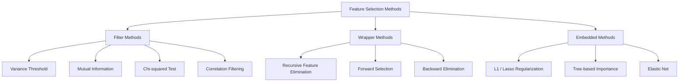
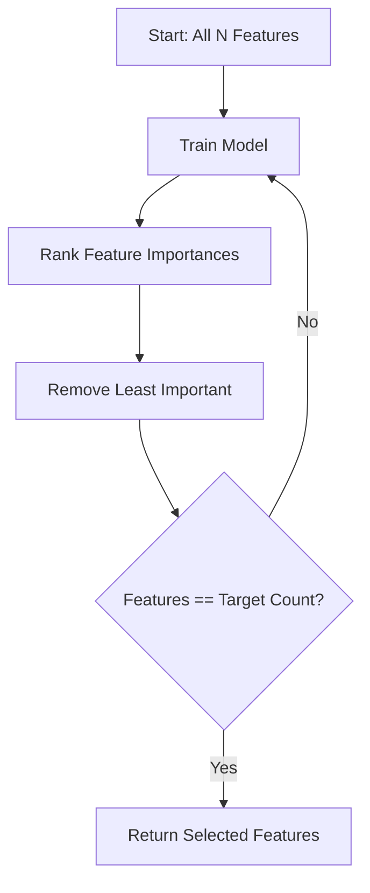
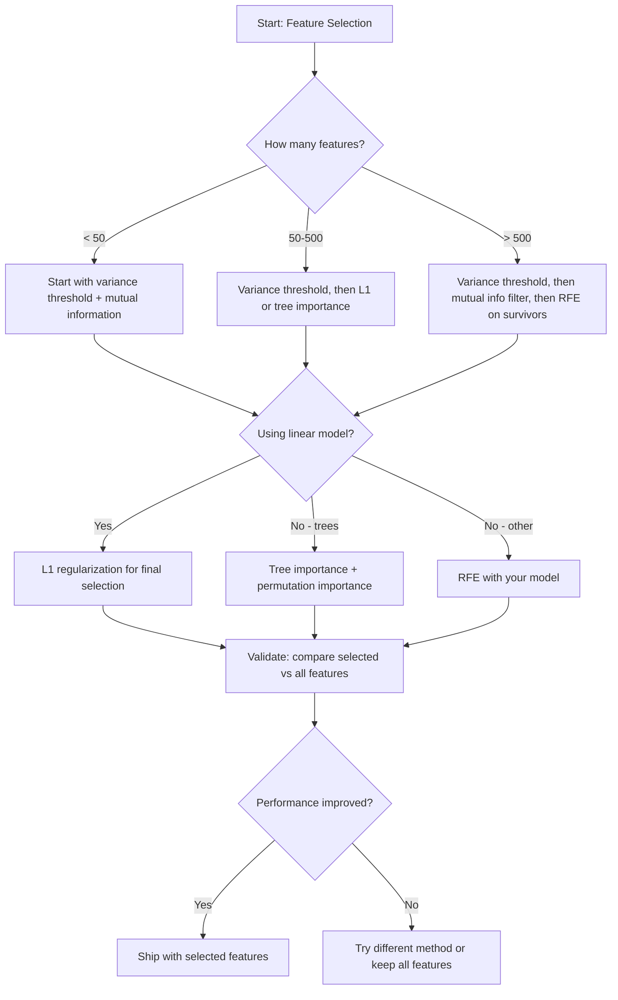

# Selección de características

> Más características no mejor. Las características reales son mejores.

**Type:** Build
**Language:**Python
**先修要求：**Fase 2, Lecciones 01-09, 08
**Time:** ~75 分钟

## El objetivo del aprendizaje
- Desde el punto de vista de la aplicación de métodos de filtro (~~~~~~~~~~~~~~~~~~~~~~~~~~~~~~~~~~~~~~~~~~~~~~~~~~~~~~~~~~~~~~~~~~~~~~~~~~~~~~~~~~~~~~~~~~~~~~~~~~~~~~~~~~~~~~~~~~~~~~~~~~~~~~~~~~~~~~~~~~~~~~~~~~~~~~~~~~~~~~~~~~~~~~~~~~~~~~~~~~~~~~~~~~~~~~~~~~~~~~~~~~~~~~~~~~~~~~~~~~~~~~~~~~~~~~~~~~~~~~~~~~~~~~~~~~~~~~~~~~~~~~~~~~~~~~~~~~~~~~~~~~~~~~~~~~~~~~~~~~~~~~~~~~~~~~~~~~~~~~~~~~~~~~~~~~~~~~~~~~~~~~~~~~~~~~~~~~~~~~~~~~~~~~~~~~~~~~~~~~~~~~~~~~~~~~~~~~~~~~~~~~~~~~~~~~~~~~~~~~~~~~~~~~~~~~~~~~~~~~~~~~~~~~~~~~~~~~~~~~~~~~~~~~~~~~~~~~~~~~~~~~~~~~~~~~~~~~~~
-  Explicar por qué la información mutua                                                                                                                                                                                                                                                                                                                                                                                                                                                                                                                     
- Comparar la regularización de L1 (clasificación integrada) con la selección de envases (RFE) (clasificación de envases),并评估它们的计算权衡
- Construir un conjunto de métodos de selección de características, y mostrar que en los datos mantenidos mejorará los efectos de la generalización

##  problemas
Tienes 500 características. Tu modelo se entrena lentamente, se supera a la regla, y nadie puede explicar lo que ha aprendido.

Esto es la maldición de la dimensionalidad. Con las características de aumento de la cantidad, el espacio de características de la masa se expande explosivamente.

La selección de características es una solución. La eliminación del ruido. La eliminación de la redundancia. La conservación de las características que realmente llevan a cabo el objetivo.

El objetivo no es utilizar toda la información disponible, sino utilizar la información correcta.

## 概念
### Selección de características de tres tipos de métodos

Cada tipo de selección de características 方法都属于以下三类之一:



**Filter methods**Utilizan estadísticas independientemente para cada característica 打分── ellas no usan modelos──速度快, pero se pierden las interacciones de las características──

**Wrapper methods** entrenamiento modelo para evaluar los subconjuntos de características utilizan el rendimiento del modelo  como porcentaje resultados mejores, pero el costo es más alto, ya que se requiere varias veces reentrenamiento del modelo

**Embedded methods**En el proceso de formación de modelos, la selección de características. La regularización de L1 hará que los pesos se desplacen hacia cero. Los árboles de decisión se basarán en las características más útiles. Se realizará la división. La selección se realizará durante el ajuste, no como un paso individual.

### El umbral de variación

El filtro más simple es: Si una característica entre las muestras no cambia, casi no lleva información.

Considere una característica, entre 1000 muestras hay 999 ▌ son 0.0― su variación 接近零― no hay modelo 能用它来区分类别―移除它―

```
variance(x) = mean((x - mean(x))^2)
```

设置一个门 (例如 0.01) 丢弃每一个变量 低于这个门的特征──这会在完全不查看目标变量的情况下移除常态或近常态的特征──

Uso de escenario: como un paso de preprocesamiento anterior a otros métodos, captura casi sin coste características obviamente inútiles.

Limites: una característica puede tener alta variación, pero sigue siendo puro ruido.

### Información mutua

Información mutua  Medir el valor de la característica X puede reducir en gran medida la incertidumbre del objetivo Y 

```
I(X; Y) = sum_x sum_y p(x, y) * log(p(x, y) / (p(x) * p(y)))
```

Si X y Y 独立, entonces p(x, y) = p(x) * p(y), por lo tanto log 项为零,I(X; Y) = 0。X 能告诉你越多关于Y的信息,相互信息就越高。

En comparación con la correlación, la información mutua puede captar relaciones no lineales. Una característica puede tener una correlación con el objetivo es cero, pero la información mutua es muy alta, ya que la relación puede ser cuadrática o periódica.

对于连续特征,先分辨 成bines(基于 histogram的估计) ・bins的数量会影响估计结果:bines 太少会丢失信息,bines 太多会增加噪音──常见选择:sqrt(n) bines 或 Sturges' rule(1 + log2(n))。


### Eliminación de la característica recurrente (RFE)

RFE es un método de envoltura. Utiliza el modelo de su propia característica.

1. Utiliza todas las características  entrenamiento modelo
2. 按重要性对特征 排名(modelos lineales Utiliza coeficientes, árboles Utiliza reducción de impurezas)
3. 移除最不重要 feature (s) 移除最不重要特征 (s) 移除最不重要特征 (s) 移除最不重要特征 (s) 移除最不重要特征 (s) 移除最不重要特征 (s) 移除最不重要特征 (s) 移除最不重要特点 (s)
4. 重复, hasta que quede la cantidad de características esperadas



RFE considerará las interacciones de características, ya que el modelo verá al mismo tiempo todas las características restantes.

成本:You need to train model N - target 次。 para 500 características 目標 为 10 la situación es 490 veces entrenamiento。 para modelos caros, esto será muy lento。 se puede mover varias características a través de cada paso para acelerar(por ejemplo, 10% de la parte inferior de cada ronda)。

### L1 (Lasso) Regularización

L1 regularización 会把 weights 的绝对值加入 Loss Function:

```
loss = prediction_error + alpha * sum(|w_i|)
```

Las características de control de los parámetros alfa se modifican a medida que se cortan.

¿Por qué se establecerá el límite de peso? La penalidad L1 en el espacio de peso crea una zona de restricción de forma irregular. La mejor solución es que se coloque en la esquina de esta forma, donde uno o más pesos se colocan en el punto de regularización L2.

Éste es el modelo de selección de características integradas: qué características deben ser ignoradas durante el entrenamiento.

优势: sólo necesita una formación,能处理相关特征(选择其中一个并把其他置零),内置于大多数线性模型实现中──

Limites: sólo se aplica a modelos lineales.

### La importancia de la característica basada en el árbol

Los árboles de decisión  y sus conjuntos  bosques aleatorios  incrementos graduales                                                                                                                                                                                                                                                    

Para los árboles de bosque aleatorio:

```
importance(feature_j) = (1/T) * sum over all trees of
    sum over all nodes splitting on feature_j of
        (n_samples * impurity_decrease)
```

Esto dará un puntaje de importancia normalizado para cada característica. Puede procesar automáticamente las relaciones no lineales y las interacciones de las características.

Nota:importancia basada en árboles 会偏向具有许多独特值的特征 (高 Cardinality) △随机 ID 列会显得重要,因为它能完美分分每样品──使用 permutation importance 作为智能检查──

### Importancia de la permutación

Una especie de método modelo-agnóstico:

1. entrenamiento modelo, y los datos de validación 上记录 baseline de rendimiento
2. Para cada característica: con el tiempo mezclar sus valores, la performance de la medición de la baja
3. Downgrader, más importante es esta característica

Si el mezcla de una característica no daña el rendimiento, el modelo no depende de ella. Si el rendimiento se desploma, esta característica es muy importante.

La importancia de la permutación  evitó el sesgo de cardinalidad de la importancia basada en árboles  pero es muy lento: cada característica necesita una evaluación completa, y debe repetirse varias veces para obtener estabilidad

### Tabla de comparación

| Method | Type | Speed | Nonlinear | Feature Interactions |
|--------|------|-------|-----------|---------------------|
| Variance threshold | Filter | 非常快 | 否 | 否 |
| Mutual information | Filter | 快 | 是 | 否 |
| Correlation filter | Filter | 快 | 否 | 否 |
| RFE | Wrapper | 慢 | 取决于 model | 是 |
| L1 / Lasso | Embedded | 快 | 否（linear） | 否 |
| Tree importance | Embedded | 中等 | 是 | 是 |
| Permutation importance | Model-agnostic | 慢 | 是 | 是 |

### Diagrama de flujo de decisiones




```figure
f3-feature-prune
```

## Construirlo
### 步骤 1: Generar datos sintéticos con estructura de características conocida

```python
import numpy as np


def make_feature_selection_data(n_samples=500, seed=42):
    rng = np.random.RandomState(seed)

    x1 = rng.randn(n_samples)
    x2 = rng.randn(n_samples)
    x3 = rng.randn(n_samples)
    x4 = x1 + 0.1 * rng.randn(n_samples)
    x5 = x2 + 0.1 * rng.randn(n_samples)

    informative = np.column_stack([x1, x2, x3, x4, x5])

    correlated = np.column_stack([
        x1 * 0.9 + 0.1 * rng.randn(n_samples),
        x2 * 0.8 + 0.2 * rng.randn(n_samples),
        x3 * 0.7 + 0.3 * rng.randn(n_samples),
        x1 * 0.5 + x2 * 0.5 + 0.1 * rng.randn(n_samples),
        x2 * 0.6 + x3 * 0.4 + 0.1 * rng.randn(n_samples),
    ])

    noise = rng.randn(n_samples, 10) * 0.5

    X = np.hstack([informative, correlated, noise])
    y = (2 * x1 - 1.5 * x2 + x3 + 0.5 * rng.randn(n_samples) > 0).astype(int)

    feature_names = (
        [f"info_{i}" for i in range(5)]
        + [f"corr_{i}" for i in range(5)]
        + [f"noise_{i}" for i in range(10)]
    )

    return X, y, feature_names
```

Sabemos que la verdad fundamental: las características 0-4 son informativas, y 3 y 4 son copias correlacionadas de 0 y 1), las características 5-9 con las características informativas, las características 10-19 son ruido puro, un buen método de selección debe poner 0-4 en la máxima, poner 10-19 en la mínima.

### 步骤 2: Umbral de variación

```python
def variance_threshold(X, threshold=0.01):
    variances = np.var(X, axis=0)
    mask = variances > threshold
    return mask, variances
```

### 步骤 3: Información mutua (discreta)

```python
def discretize(x, n_bins=10):
    min_val, max_val = x.min(), x.max()
    if max_val == min_val:
        return np.zeros_like(x, dtype=int)
    bin_edges = np.linspace(min_val, max_val, n_bins + 1)
    binned = np.digitize(x, bin_edges[1:-1])
    return binned


def mutual_information(X, y, n_bins=10):
    n_samples, n_features = X.shape
    mi_scores = np.zeros(n_features)

    y_vals, y_counts = np.unique(y, return_counts=True)
    p_y = y_counts / n_samples

    for f in range(n_features):
        x_binned = discretize(X[:, f], n_bins)
        x_vals, x_counts = np.unique(x_binned, return_counts=True)
        p_x = dict(zip(x_vals, x_counts / n_samples))

        mi = 0.0
        for xv in x_vals:
            for yi, yv in enumerate(y_vals):
                joint_mask = (x_binned == xv) & (y == yv)
                p_xy = np.sum(joint_mask) / n_samples
                if p_xy > 0:
                    mi += p_xy * np.log(p_xy / (p_x[xv] * p_y[yi]))
        mi_scores[f] = mi

    return mi_scores
```

### 步骤 4: Eliminación de la característica recurrente

```python
def simple_logistic_importance(X, y, lr=0.1, epochs=100):
    n_samples, n_features = X.shape
    w = np.zeros(n_features)
    b = 0.0

    for _ in range(epochs):
        z = X @ w + b
        pred = 1.0 / (1.0 + np.exp(-np.clip(z, -500, 500)))
        error = pred - y
        w -= lr * (X.T @ error) / n_samples
        b -= lr * np.mean(error)

    return w, b


def rfe(X, y, n_features_to_select=5, lr=0.1, epochs=100):
    n_total = X.shape[1]
    remaining = list(range(n_total))
    rankings = np.ones(n_total, dtype=int)
    rank = n_total

    while len(remaining) > n_features_to_select:
        X_subset = X[:, remaining]
        w, _ = simple_logistic_importance(X_subset, y, lr, epochs)
        importances = np.abs(w)

        least_idx = np.argmin(importances)
        original_idx = remaining[least_idx]
        rankings[original_idx] = rank
        rank -= 1
        remaining.pop(least_idx)

    for idx in remaining:
        rankings[idx] = 1

    selected_mask = rankings == 1
    return selected_mask, rankings
```

### 步骤 5: Selección de la característica L1

```python
def soft_threshold(w, alpha):
    return np.sign(w) * np.maximum(np.abs(w) - alpha, 0)


def l1_feature_selection(X, y, alpha=0.1, lr=0.01, epochs=500):
    n_samples, n_features = X.shape
    w = np.zeros(n_features)
    b = 0.0

    for _ in range(epochs):
        z = X @ w + b
        pred = 1.0 / (1.0 + np.exp(-np.clip(z, -500, 500)))
        error = pred - y

        gradient_w = (X.T @ error) / n_samples
        gradient_b = np.mean(error)

        w -= lr * gradient_w
        w = soft_threshold(w, lr * alpha)
        b -= lr * gradient_b

    selected_mask = np.abs(w) > 1e-6
    return selected_mask, w
```

### 步骤 6: Importancia basada en el árbol (árbol de decisión simple)

```python
def gini_impurity(y):
    if len(y) == 0:
        return 0.0
    classes, counts = np.unique(y, return_counts=True)
    probs = counts / len(y)
    return 1.0 - np.sum(probs ** 2)


def best_split(X, y, feature_idx):
    values = np.unique(X[:, feature_idx])
    if len(values) <= 1:
        return None, -1.0

    best_threshold = None
    best_gain = -1.0
    parent_gini = gini_impurity(y)
    n = len(y)

    for i in range(len(values) - 1):
        threshold = (values[i] + values[i + 1]) / 2.0
        left_mask = X[:, feature_idx] <= threshold
        right_mask = ~left_mask

        n_left = np.sum(left_mask)
        n_right = np.sum(right_mask)

        if n_left == 0 or n_right == 0:
            continue

        gain = parent_gini - (n_left / n) * gini_impurity(y[left_mask]) - (n_right / n) * gini_impurity(y[right_mask])

        if gain > best_gain:
            best_gain = gain
            best_threshold = threshold

    return best_threshold, best_gain


def tree_importance(X, y, n_trees=50, max_depth=5, seed=42):
    rng = np.random.RandomState(seed)
    n_samples, n_features = X.shape
    importances = np.zeros(n_features)

    for _ in range(n_trees):
        sample_idx = rng.choice(n_samples, size=n_samples, replace=True)
        feature_subset = rng.choice(n_features, size=max(1, int(np.sqrt(n_features))), replace=False)

        X_boot = X[sample_idx]
        y_boot = y[sample_idx]

        tree_imp = _build_tree_importance(X_boot, y_boot, feature_subset, max_depth)
        importances += tree_imp

    total = importances.sum()
    if total > 0:
        importances /= total

    return importances


def _build_tree_importance(X, y, feature_subset, max_depth, depth=0):
    n_features = X.shape[1]
    importances = np.zeros(n_features)

    if depth >= max_depth or len(np.unique(y)) <= 1 or len(y) < 4:
        return importances

    best_feature = None
    best_threshold = None
    best_gain = -1.0

    for f in feature_subset:
        threshold, gain = best_split(X, y, f)
        if gain > best_gain:
            best_gain = gain
            best_feature = f
            best_threshold = threshold

    if best_feature is None or best_gain <= 0:
        return importances

    importances[best_feature] += best_gain * len(y)

    left_mask = X[:, best_feature] <= best_threshold
    right_mask = ~left_mask

    importances += _build_tree_importance(X[left_mask], y[left_mask], feature_subset, max_depth, depth + 1)
    importances += _build_tree_importance(X[right_mask], y[right_mask], feature_subset, max_depth, depth + 1)

    return importances
```

### Paso 7: ejecutar todos los métodos y comparar

代码文件会在同一合成数据集上运行全部五种方法,并打印一个比较表,显示每个方法选择了哪些功能──

## Usalo
Usando el método de aprendizaje, la selección de características está en el pipeline.

```python
from sklearn.feature_selection import (
    VarianceThreshold,
    mutual_info_classif,
    RFE,
    SelectFromModel,
)
from sklearn.linear_model import Lasso, LogisticRegression
from sklearn.ensemble import RandomForestClassifier

vt = VarianceThreshold(threshold=0.01)
X_filtered = vt.fit_transform(X)

mi_scores = mutual_info_classif(X, y)
top_k = np.argsort(mi_scores)[-10:]

rfe_selector = RFE(LogisticRegression(), n_features_to_select=10)
rfe_selector.fit(X, y)
X_rfe = rfe_selector.transform(X)

lasso_selector = SelectFromModel(Lasso(alpha=0.01))
lasso_selector.fit(X, y)
X_lasso = lasso_selector.transform(X)

rf = RandomForestClassifier(n_estimators=100)
rf.fit(X, y)
importances = rf.feature_importances_
```

Estos desde cero  realizar con precisión mostraron lo que ocurre dentro de cada método  el umbral de variación                                                                                                                                                                                                                                                                                                                                                                                                                                                                                                   `var(X, axis=0)`La información mutua está en la tabla de contingencias en la cual se encuentran las juntas y las frecuencias marginales. La RFE es un ciclo de entrenamiento, clasificación y recorte.

La versión de sklearn  aumentó la robustez, por ejemplo, la utilización de la estimación de la densidad k-NN en lugar de la integración de la tubería (binning) 、 velocidad (C 实现) 、 y la integración de la tubería (pipeline).

##  entregarlo
本课产 出:
- `outputs/skill-feature-selector.md`-- Usando para seleccionar el método correcto de selección de características del árbol de decisión de referencia rápida

##  ejercicios
1. **Forward selection**: realizar el proceso de reversación de RFE. Desde 0 características  Inicio  Cada paso añadir la mejor función para mejorar el rendimiento del modelo  Cuando se añaden características  No hay más ayuda en el momento de parar 

2. **Stability selection**: Se seleccionan las características de L1 50 veces, cada vez que se utiliza el 80% de la submuestra de datos, y se utilizan unos valores alfa diferentes.

3. **Multicollinearity detection**: calcular todas las características de la matriz de correlación. Implementar una función, un umbral de correlación determinado. Por ejemplo, 0.9, de cada par de características altamente correlacionadas, se elimina una característica.

4. **Feature selection pipeline**:把变异门、互通信息过 和 RFE 串成一管道──先移移近零变异功能,然后按互通信息保留最高50%,再在幸存者上运行 RFE──将该管道与直接在所有功能上运行 RFE比较──管道更快吗?准确性是否相同?

5. **Permutation importance from scratch**: lograr la importancia de la permutación. Por cada característica, mezclar sus valores 10 veces, medir la media de la puntuación F1.

## 关键术语: "El hombre es un hombre"
| Term | What people say | What it actually means |
|------|----------------|----------------------|
| Filter method | “独立为 features 打分” | 一种 feature selection 方法，不训练 model，而是使用统计度量对 features 排名，并孤立地评估每个 feature |
| Wrapper method | “用 model 挑 features” | 一种 feature selection 方法，通过训练 model 并使用其 performance 作为 selection criterion 来评估 feature subsets |
| Embedded method | “model 在训练期间选择 features” | 作为 model fitting 一部分发生的 feature selection，例如 L1 regularization 会把 weights 推向零 |
| Mutual information | “一个变量能告诉你关于另一个变量的多少信息” | 给定 X 的知识后，关于 Y 的不确定性减少量的度量，能够捕捉线性和非线性 dependencies |
| Recursive Feature Elimination | “训练、排名、剪枝、重复” | 一种迭代式 wrapper method，会训练 model、移除最不重要的 feature(s)，并重复直到达到 target count |
| L1 / Lasso regularization | “会消灭 features 的 penalty” | 将 weight 绝对值之和加入 Loss Function，这会把不重要 feature 的 weights 推到精确为零 |
| Variance threshold | “移除 constant features” | 丢弃在 samples 之间 variance 低于指定 threshold 的 features，过滤掉不携带信息的 features |
| Feature importance | “哪些 features 最重要” | 表示每个 feature 对 model predictions 贡献程度的分数，可由 split gains（trees）或 coefficient magnitudes（linear）计算 |
| Permutation importance | “shuffle 并测量损害” | 通过随机 shuffle 每个 feature 的 values，并测量由此导致的 model performance 下降来评估 feature importance |
| Curse of dimensionality | “features 太多，data 不够” | 添加 features 会使 feature space 的体积指数级增长，导致 data 稀疏且 distances 失去意义的现象 |

## 延伸阅读
- [An Introduction to Variable and Feature Selection (Guyon & Elisseeff, 2003)](https://jmlr.org/papers/v3/guyon03a.html)-- métodos de selección de características de la base de la descripción, que todavía se cita ampliamente
- [scikit-learn Feature Selection Guide](https://scikit-learn.org/stable/modules/feature_selection.html)-- 关于过器和嵌入式方法的实用参考,包含代码示例
- [Stability Selection (Meinshausen & Buhlmann, 2010)](https://arxiv.org/abs/0809.2932)-- combinar la submuestreo con la selección de características, para obtener resultados robustos y reproducibles
- [Beware Default Random Forest Importances (Strobl et al., 2007)](https://bmcbioinformatics.biomedcentral.com/articles/10.1186/1471-2105-8-25)--  mostrar la importancia basada en los árboles 中的 Kardinality bias,并提出 condicional importancia 作为替代方案
