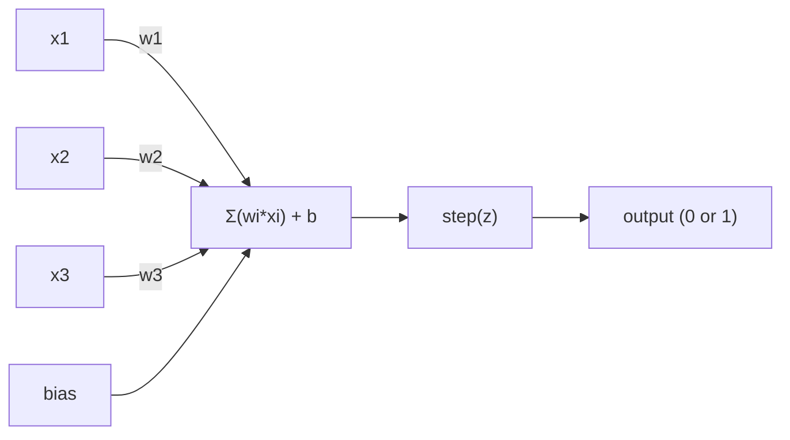
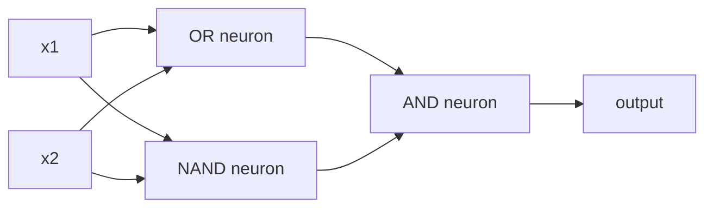

# Perceptron

> Perceptron es el átomo de la red neuronal. Cuando la deshaces, verás pesas, un sesgo y una decisión.

**类型：**Construcción
**语言：**Python
**先修要求：**Fase 1 ((Algebra lineal 直觉)
**时间：**- 60 minutos

## El objetivo del aprendizaje
- Usar Python desde cero para implementar una Perceptron, incluyendo la regla de actualización de peso y la función de activación de pasos
- Explica por qué un solo Perceptron sólo puede resolver problemas linealmente separables, y muestra el caso de fallo XOR
-                                                                                                                                                                                                                                                                                                                                                                                                                                                                                                                              
- Utiliza activación sigmoide y backpropagation  entrenar una red de dos capas, hacer que su aprendizaje automático XOR

##  problemas
Ya entiendes el producto vectorial y punto. ¿Sabes que la Matrix transformará las entradas en salidas?

Perceptron  ha respondido a esta pregunta― es la máquina de aprendizaje más simple: recibe algunas entradas, multiplica los pesos, suma los prejuicios, y luego toma una decisión binaria―, luego vuelve a ajustar―, así es― cada red neuronal construida en la historia, en esencia es la idea de que se acumula una capa de la misma―.

Comprender Perceptron, significa entender el aprendizaje en el código hasta que el número se ajuste continuamente hasta que el resultado se ajuste a la realidad.

## 概念
### Un neurón, una decisión.

Un Perceptron 接收 n 个输入,将每一个输入 乘以一个权重,求和,加偏,然后把结果传入一个激活函数――



Función de paso 非常直接: si la suma ponderada加 bias >= 0, entonces la salida 为 1──否则, la salida 为 0──

```
step(z) = 1  if z >= 0
           0  if z < 0
```

Este es un clasificador lineal. Los pesos y los sesgos definen una línea o definen un hiperplano en el espacio superior.

### El límite de la decisión

Para dos entradas, Perceptron se encuentra en el espacio 2D.

```
  x2
  ┤
  │  Class 1        /
  │    (0)          /
  │                /
  │               / w1·x1 + w2·x2 + b = 0
  │              /
  │             /     Class 2
  │            /        (1)
  ┼───────────/──────────── x1
```

線一側所有点出口 为 0──另一側所有点出口 为 1── el proceso de entrenamiento se moverá esta línea hasta que pueda correctamente separar estas clases──

### La regla de aprendizaje

La regla de aprendizaje de Perceptron es muy simple:

```
For each training example (x, y_true):
    y_pred = predict(x)
    error = y_true - y_pred

    For each weight:
        w_i = w_i + learning_rate * error * x_i
    bias = bias + learning_rate * error
```

Si la predicción es correcta, error = 0, todo no cambiará. Si se predice a 0 pero debería ser 1, los pesos aumentarán. Si se predice a 1, pero debería ser 0, los pesos disminuirán.

### El problema de la XOR

Mira estas puertas lógicas:

```
AND gate:           OR gate:            XOR gate:
x1  x2  out         x1  x2  out         x1  x2  out
0   0   0           0   0   0           0   0   0
0   1   0           0   1   1           0   1   1
1   0   0           1   0   1           1   0   1
1   1   1           1   1   1           1   1   0
```

Y 和 OR es linealmente separable de: se puede dibujar una línea,把 0 和 1 分开;; XOR 则不是──没有任何一条直线能把 [0,1] 和 [1,0] 与 [0,0] 和 [1,1] 分开──

```
AND (separable):        XOR (not separable):

  x2                      x2
  1 ┤  0     1            1 ┤  1     0
    │     /                 │
  0 ┤  0 / 0              0 ┤  0     1
    ┼──/──────── x1         ┼──────────── x1
       line works!          no single line works!
```

Esto es una limitación fundamental. Un solo Perceptron sólo puede resolver problemas linealmente separables. Minsky y Papert lo demostraron en 1969, y esto casi hizo que los estudios de redes neuronales se detuvieran durante una década.

 solución: 把 Perceptron 堆叠成层――multi-layer perceptron puede mediante la combinación de dos decisiones lineales 组合成一个非线性决定来解决XOR──


```figure
perceptron-boundary
```

## Construirlo
### 步骤 1:La clase de Perceptron

```python
class Perceptron:
    def __init__(self, n_inputs, learning_rate=0.1):
        self.weights = [0.0] * n_inputs
        self.bias = 0.0
        self.lr = learning_rate

    def predict(self, inputs):
        total = sum(w * x for w, x in zip(self.weights, inputs))
        total += self.bias
        return 1 if total >= 0 else 0

    def train(self, training_data, epochs=100):
        for epoch in range(epochs):
            errors = 0
            for inputs, target in training_data:
                prediction = self.predict(inputs)
                error = target - prediction
                if error != 0:
                    errors += 1
                    for i in range(len(self.weights)):
                        self.weights[i] += self.lr * error * inputs[i]
                    self.bias += self.lr * error
            if errors == 0:
                print(f"Converged at epoch {epoch + 1}")
                return
        print(f"Did not converge after {epochs} epochs")
```

### Paso 2: en las puertas lógicas 上训练

```python
and_data = [
    ([0, 0], 0),
    ([0, 1], 0),
    ([1, 0], 0),
    ([1, 1], 1),
]

or_data = [
    ([0, 0], 0),
    ([0, 1], 1),
    ([1, 0], 1),
    ([1, 1], 1),
]

not_data = [
    ([0], 1),
    ([1], 0),
]

print("=== AND Gate ===")
p_and = Perceptron(2)
p_and.train(and_data)
for inputs, _ in and_data:
    print(f"  {inputs} -> {p_and.predict(inputs)}")

print("\n=== OR Gate ===")
p_or = Perceptron(2)
p_or.train(or_data)
for inputs, _ in or_data:
    print(f"  {inputs} -> {p_or.predict(inputs)}")

print("\n=== NOT Gate ===")
p_not = Perceptron(1)
p_not.train(not_data)
for inputs, _ in not_data:
    print(f"  {inputs} -> {p_not.predict(inputs)}")
```

### 步骤 3: observar XOR 失败

```python
xor_data = [
    ([0, 0], 0),
    ([0, 1], 1),
    ([1, 0], 1),
    ([1, 1], 0),
]

print("\n=== XOR Gate (single perceptron) ===")
p_xor = Perceptron(2)
p_xor.train(xor_data, epochs=1000)
for inputs, expected in xor_data:
    result = p_xor.predict(inputs)
    status = "OK" if result == expected else "WRONG"
    print(f"  {inputs} -> {result} (expected {expected}) {status}")
```

Nunca converge. Es una sola prueba de que el Perceptron no puede aprender XOR.

### Paso 4: Con dos capas  resolver XOR

技巧是:XOR = (x1 O x2) Y NO (x1 Y x2)



```python
def xor_network(x1, x2):
    or_neuron = Perceptron(2)
    or_neuron.weights = [1.0, 1.0]
    or_neuron.bias = -0.5

    nand_neuron = Perceptron(2)
    nand_neuron.weights = [-1.0, -1.0]
    nand_neuron.bias = 1.5

    and_neuron = Perceptron(2)
    and_neuron.weights = [1.0, 1.0]
    and_neuron.bias = -1.5

    hidden1 = or_neuron.predict([x1, x2])
    hidden2 = nand_neuron.predict([x1, x2])
    output = and_neuron.predict([hidden1, hidden2])
    return output


print("\n=== XOR Gate (multi-layer network) ===")
for inputs, expected in xor_data:
    result = xor_network(inputs[0], inputs[1])
    print(f"  {inputs} -> {result} (expected {expected})")
```

Cuatro situaciones todo correcto. Colocar el Perceptron en capas, puede crear un solo Perceptron.

### Paso 5: Entrenamiento de una red de dos capas

Paso 4 Hands Connect Weights. Esto es efectivo para XOR, pero para usted que ya no sabe exactamente el peso es un problema real.

```python
class TwoLayerNetwork:
    def __init__(self, learning_rate=0.5):
        import random
        random.seed(0)
        self.w_hidden = [[random.uniform(-1, 1), random.uniform(-1, 1)] for _ in range(2)]
        self.b_hidden = [random.uniform(-1, 1), random.uniform(-1, 1)]
        self.w_output = [random.uniform(-1, 1), random.uniform(-1, 1)]
        self.b_output = random.uniform(-1, 1)
        self.lr = learning_rate

    def sigmoid(self, x):
        import math
        x = max(-500, min(500, x))
        return 1.0 / (1.0 + math.exp(-x))

    def forward(self, inputs):
        self.inputs = inputs
        self.hidden_outputs = []
        for i in range(2):
            z = sum(w * x for w, x in zip(self.w_hidden[i], inputs)) + self.b_hidden[i]
            self.hidden_outputs.append(self.sigmoid(z))
        z_out = sum(w * h for w, h in zip(self.w_output, self.hidden_outputs)) + self.b_output
        self.output = self.sigmoid(z_out)
        return self.output

    def train(self, training_data, epochs=10000):
        for epoch in range(epochs):
            total_error = 0
            for inputs, target in training_data:
                output = self.forward(inputs)
                error = target - output
                total_error += error ** 2

                d_output = error * output * (1 - output)

                saved_w_output = self.w_output[:]
                hidden_deltas = []
                for i in range(2):
                    h = self.hidden_outputs[i]
                    hd = d_output * saved_w_output[i] * h * (1 - h)
                    hidden_deltas.append(hd)

                for i in range(2):
                    self.w_output[i] += self.lr * d_output * self.hidden_outputs[i]
                self.b_output += self.lr * d_output

                for i in range(2):
                    for j in range(len(inputs)):
                        self.w_hidden[i][j] += self.lr * hidden_deltas[i] * inputs[j]
                    self.b_hidden[i] += self.lr * hidden_deltas[i]
```

```python
net = TwoLayerNetwork(learning_rate=2.0)
net.train(xor_data, epochs=10000)
for inputs, expected in xor_data:
    result = net.forward(inputs)
    predicted = 1 if result >= 0.5 else 0
    print(f"  {inputs} -> {result:.4f} (rounded: {predicted}, expected {expected})")
```

Tiene dos diferencias clave con el paso 4. Primero, el sigmoide sustituye la función del paso, porque es plano, por lo que existe un gradiente.`train`方法把 error de salida Backpropagation a la capa oculta, y según cada peso la proporción de contribuciones a los errores de ajustarlos.

Este es el puente de la lección 03`d_output`Y `hidden_deltas`La matemática de atrás, es la regla de la cadena, se aplica al gráfico de la red.

## Usalo
Todo el contenido que estás construyendo desde cero, está en una importación:

```python
from sklearn.linear_model import Perceptron as SkPerceptron
import numpy as np

X = np.array([[0,0],[0,1],[1,0],[1,1]])
y = np.array([0, 0, 0, 1])

clf = SkPerceptron(max_iter=100, tol=1e-3)
clf.fit(X, y)
print([clf.predict([x])[0] for x in X])
```

Tu 30 páginas.`Perceptron`La clase hace lo mismo. La versión de Sklearn aumenta los controles de convergencia, varias funciones de pérdida, así como el soporte de entradas escasasas, pero el ciclo central es completamente el mismo: suma ponderada, función de pasos, en error, y el peso de actualización.

Las diferencias reales se manifestarán en la escala.

- Función de paso se convertirá en sigmoide ∞ ReLU u otra activación plana
- Pesos 会通过背扩散 自动学习(Ley 03)
- Las capas se vuelven más profundas: 3 ̊10 ̊100+ capas
- El mismo principio sigue vigente: cada capa está en la producción de la primera capa, crea nuevas características en el medio.

Solo puedes dibujar una línea recta. Si las juntas, puedes dibujar cualquier forma.

##  entregarlo
Encuentro de trabajo:
- `outputs/skill-perceptron.md`- Una habilidad, explica cuándo se necesita una arquitectura de una sola capa y una de varias capas

##  ejercicios
1. En la puerta NAND, cualquier circuito lógico puede ser construido por NAND.
2. Modificar la clase Perceptron, hacer que en cada época Seguir el límite de decisión ((w1*x1 + w2*x2 + b = 0) ▽ 印印在 AND gate 训练期间这条线如何移动──
3. Construir un Perceptron de 3 entradas: sólo cuando 3 entradas entre al menos 2 个为 1 时才输出 1(función de voto mayoritario) ;;¿es linealmente separable de? ¿por qué?

## 关键术语: "El hombre es un hombre"
| Term | What people say | What it actually means |
|------|----------------|----------------------|
| Perceptron | “一个假的 neuron” | 一个 linear classifier：inputs 与 weights 的 dot product，加上 bias，再通过 step function |
| Weight | “一个 input 有多重要” | 一个 multiplier，用来缩放每个 input 对 decision 的贡献 |
| Bias | “threshold” | 一个 constant，用来平移 decision boundary，让 Perceptron 即使在 inputs 为零时也能触发 |
| Activation function | “压缩数值的东西” | 一个在 weighted sum 之后应用的 function：Perceptron 使用 step function，现代 networks 使用 sigmoid/ReLU |
| Linearly separable | “你能在它们之间画一条线” | 一个 dataset，其中单个 hyperplane 可以完美分离 classes |
| XOR problem | “Perceptron 做不到的那件事” | single-layer networks 无法学习 non-linearly-separable functions 的证明 |
| Decision boundary | “classifier 发生切换的位置” | 将 input space 分成两个 classes 的 hyperplane w*x + b = 0 |
| Multi-layer perceptron | “一个真正的 Neural Network” | 按 layers 堆叠的 Perceptron，其中每一层的 output 会输入到下一层 |

## 延伸阅读
- Frank Rosenblatt, The Perceptron: Un modelo probabilístico para el almacenamiento y organización de la información en el cerebro(1958) -- 开创这一切的原始论文
- Minsky & Papert, Perceptrons 1969-- Este libro demostró que XOR no puede ser resuelto por redes de una sola capa, y que el estudio de Perceptron se detuvo durante una década.
- Michael Nielsen, Redes neuronales y aprendizaje profundo, Capítulo 1http://neuralnetworksanddeeplearning.com/）--免费在线资源, es la mejor explicación visiblemente posible de cómo Perceptron compone redes
