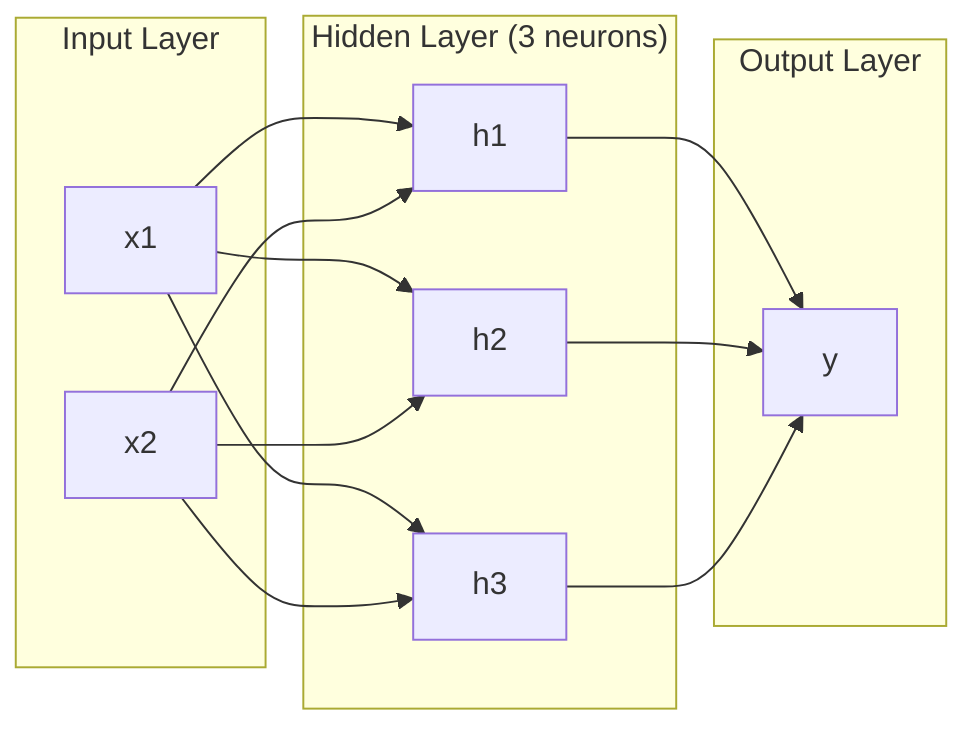
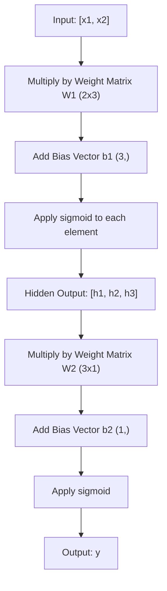
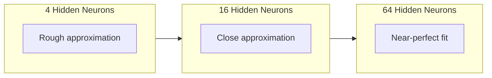

# Multilevel network con pases de adelanto

> Un neurón traza una línea... y si las juntas, puedes trazar cualquier cosa.

**Type:** 构建
**Languages:** Python
**Prerequisites:** Phase 01（Math Foundations），Lesson 03.01（The Perceptron）
**Time:** 约 90 分钟

## El objetivo del aprendizaje

- Utiliza capa y red de clase desde cero construir una red de varias capas, completar completo pase adelante
-  Redes de seguimiento de cada capa de Matriz  dimensión,并识别形 不匹配
- 解释堆叠非线性激活 如何让网络学习曲的决策边界
- Uso 2-2-1  arquitectura y manipulación 权重解决 XOR 问题

##  problemas

单个神经元就是一个画线器――仅此而已―― sólo puede dibujar una línea recta en tus datos―― cada verdadero problema en AI - 图像识别,语言理解,下围棋 - 都需要曲线――把神经元堆叠成层,就是获得曲线的方法――

En 1969, Minsky y Papert demostraron que esta limitación es mortal: una sola red de nivel no puede aprender XOR. No es difícil aprender.

Esto hizo que el apoyo de la red neuronal se detuviera durante más de diez años. En la actualidad, el método de reparación es evidente: no sólo usar una capa.

Este conjunto es una red de múltiples capas. Es la base de cada modelo de aprendizaje profundo en el entorno de producción actual. El paso adelante - datos desde la entrada, flujo y capa oculta hasta la salida - es lo primero que debes construir antes de cualquier otra cosa que pueda funcionar.

## 概念

### 层:输入,隐藏,输出

Una red de múltiples niveles tiene tres clases:

**输入层**--  estrictamente dicho no es una capa.  conserva datos originales.  Dos características significan dos puntos de entrada.

**Hidden layer**-- 工作发生的地方── cada neurón recibe cada salida de una capa superior, aplica peso y un sesgo, y luego transmite el resultado a la función activa── se llama Hidden, porque no se ven estos valores directamente en los datos de entrenamiento──

**输出层**-- última respuesta── para las clases, usar un neurón con sigmoide── para las clases, cada clase un neurón──



Este es un 2-3-1 网络── dos entradas, tres neuronas ocultas, una salida── cada conexión lleva un peso── cada neurón (excepto entradas) lleva un sesgo──

Cada uno de los niveles genera un grupo de vectores de números, llamados estado oculto. Para el texto, el estado oculto aumentará la dimensión. Colocar un texto codificado en 768 números para capturar el significado de la palabra. Para las imágenes, disminuirán la dimensión. Colocar millones de imágenes comprimidas en representaciones manejables.

### El cerebro y el cerebro

Cada neural hace tres cosas:

1. Cada entrada se multiplicará por el peso de la correspondencia
2. Se multiplican todas las cantidades y se suman a un sesgo
3. Para hacer esto y para transmitir la función de activación

Ahora, la función activada es sigmoide:

```
sigmoid(z) = 1 / (1 + e^(-z))
```

Sigmoides se comprimirán a cualquier número en el rango (0, 1) ⋅ más grande de entrada positiva se moverá hacia 1 ⋅ más grande de entrada negativa se moverá hacia 0 ⋅ 0 ⋅ 0.0 ⋅ 0.5 ⋅ esta curva plana hace posible el aprendizaje - diferente a la percepción de la percepción de la dura etapa, sigmoides en cada posición tienen Gradiente ⋅

### Pases de adelanto: datos cómo流动

El paso adelante hará que la entrada de datos pase por la red hasta que llegue el paso adelante. Durante el paso adelante no ocurrirá aprendizaje.



En cada uno de los niveles, tres operaciones suceden en orden:

```
z = W * input + b       (linear transformation)
a = sigmoid(z)           (activation)
```

Una capa de entrada se convierte en una capa inferior.

### Matriz 维度

追踪维度 es la habilidad de entrenamiento más importante en el aprendizaje profundo.

| Step | Operation | Dimensions | Result Shape |
|------|-----------|------------|-------------|
| 输入 | x | -- | (2,) |
| Hidden 线性部分 | W1 * x + b1 | W1: (3, 2), b1: (3,) | (3,) |
| Hidden 激活 | sigmoid(z1) | -- | (3,) |
| 输出线性部分 | W2 * h + b2 | W2: (1, 3), b2: (1,) | (1,) |
| 输出激活 | sigmoid(z2) | -- | (1,) |

规则:第 k 层的权重矩阵 W 的形状是 (neurones_in_layer_k, neurones_in_layer_k_minus_1) 』行对应应应上一层──列对应上一层──如果形对不上,你就有bug──

### Teorema de la aproximación universal

En 1989, George Cybenko demostró un hecho extraordinario: una red neuronal con una sola capa oculta y neuronas suficientes, puede acercarse a cualquier función continua con la precisión que se espera.

Esto no significa una capa oculta 总是最佳选择── significa que la estructura tiene capacidad teórica── en la práctica, una red más profunda (más niveles, cada nivel menos neuronas) puede utilizar una función similar en un conjunto de parámetros de aprendizaje de una red más amplia y más larga── es la razón por la cual el aprendizaje profundo puede funcionar──

直觉是: cada uno de los nervios de la capa oculta aprende una 凸起或特征── siempre y cuando haya suficientes de los nervios, y los coloque en la posición correcta, podrá acercarse a cualquier curva plana── cada vez más nervios, cada vez más nervios, cada vez más nervios, cada vez más nervios, cada vez más nervios, cada vez más nervios, cada vez más nervios, cada vez más nervios, cada vez más nervios, cada vez más nervios, cada vez más nervios, cada vez más nervios, cada vez más nervios, cada vez más nervios, cada vez más nervios, cada vez más nervios, cada vez más nervios, cada vez más nervios, cada vez más nervios, cada vez más nervios, cada vez más nervios, cada vez más nervios, cada vez más nervios, cada vez más nervios, cada vez más nervios, cada vez más nervios, cada vez más nervios, cada vez más nervios, cada vez más nervios, más nervios, más nervios, más nervios, más nervios, más nervios, más nervios, más nervios, más nervios, más nervios, más nervios, más nervios, más nervios, más nervios, más nervios, más nervios, más nervios, más nervios, más nervios, más nervios, más nervios, más nervios, más más más nervios, más más más más más que más que más que más.



### Componente

La red neuronal es un conjunto de sistemas. Puedes componerlos, conectarlos, ejecutarlos. Modelo de susurros Utiliza una red de codificadores, procesar el audio, y utilizar una red de codificadores independiente.


```figure
mlp-forward
```

## Construirlo

純 Python──不使用 numpy──每一个矩阵操作都从零编写──

### 步骤 1: Sigmoid 激活

```python
import math

def sigmoid(x):
    x = max(-500.0, min(500.0, x))
    return 1.0 / (1.0 + math.exp(-x))
```

Si se pone el valor de la sujeción a [500, 500] puede evitar la revuelta.`math.exp(500)`Mucho pero todavía limitado―`math.exp(1000)`Es un gran éxito.

### 步骤 2: Clase de capa

Todas las operaciones más importantes en el aprendizaje profundo son la matriz 乘法──每一层、每次注意头──每次前进通过-- 底层都是matmul──一线层 接收一个输入向量,将它乘以权重矩阵,并加上偏差向量:y = Wx + b── esta unidad de la ruta ocupa el 90% de la cantidad de cálculo en la red neuronal──

Una capa de almacenamiento de una matriz de peso y un vector de sesgo. Su método de avance recibe un vector de entrada y vuelve a activar la salida.

```python
class Layer:
    def __init__(self, n_inputs, n_neurons, weights=None, biases=None):
        if weights is not None:
            self.weights = weights
        else:
            import random
            self.weights = [
                [random.uniform(-1, 1) for _ in range(n_inputs)]
                for _ in range(n_neurons)
            ]
        if biases is not None:
            self.biases = biases
        else:
            self.biases = [0.0] * n_neurons

    def forward(self, inputs):
        self.last_input = inputs
        self.last_output = []
        for neuron_idx in range(len(self.weights)):
            z = sum(
                w * x for w, x in zip(self.weights[neuron_idx], inputs)
            )
            z += self.biases[neuron_idx]
            self.last_output.append(sigmoid(z))
        return self.last_output
```

权重矩阵的形状是 (n_neurones, n_inputs) ―― cada línea es un neural a través de todas las entradas de权重── método avanzado 遍历神经元,计算加权和加偏见,应用 sigmoid,并收集结果──

### Paso 3: Clasificación de red

Una red es una lista de niveles. El pase delantero los enlazará: las salidas de la segunda capa ingresan a la tercera capa k+1.

```python
class Network:
    def __init__(self, layers):
        self.layers = layers

    def forward(self, inputs):
        current = inputs
        for layer in self.layers:
            current = layer.forward(current)
        return current
```

Éste es todo el paso adelante.

### Paso 4: Usar el manual para resolver el peso XOR

En la Lección 01 , hemos resuelto XOR                                                                                                                                                                                                                                                          

```python
hidden = Layer(
    n_inputs=2,
    n_neurons=2,
    weights=[[20.0, 20.0], [-20.0, -20.0]],
    biases=[-10.0, 30.0],
)

output = Layer(
    n_inputs=2,
    n_neurons=1,
    weights=[[20.0, 20.0]],
    biases=[-30.0],
)

xor_net = Network([hidden, output])

xor_data = [
    ([0, 0], 0),
    ([0, 1], 1),
    ([1, 0], 1),
    ([1, 1], 0),
]

for inputs, expected in xor_data:
    result = xor_net.forward(inputs)
    predicted = 1 if result[0] >= 0.5 else 0
    print(f"  {inputs} -> {result[0]:.6f} (rounded: {predicted}, expected: {expected})")
```

较大的权重(20, -20) Que el sigmoide se manifieste como una función de escale jump。 primer neurón oculto 近似 OR。 segundo近似 NAND。输出神经元把它们组合成 AND,也就是 XOR。

### Paso 5: 圆形分类

Un problema más difícil: clasificar los puntos 2D en un centro de punto de origen, con un diámetro de 0,5 círculos dentro o fuera de un círculo. Esto requiere un límite de decisión de la trama.

```python
import random
import math

random.seed(42)

data = []
for _ in range(200):
    x = random.uniform(-1, 1)
    y = random.uniform(-1, 1)
    label = 1 if (x * x + y * y) < 0.25 else 0
    data.append(([x, y], label))

circle_net = Network([
    Layer(n_inputs=2, n_neurons=8),
    Layer(n_inputs=8, n_neurons=1),
])
```

Usando el peso de tiempo, el efecto de la red se va a mejorar. Pero el paso adelante sigue funcionando.

```python
correct = 0
for inputs, expected in data:
    result = circle_net.forward(inputs)
    predicted = 1 if result[0] >= 0.5 else 0
    if predicted == expected:
        correct += 1

print(f"Accuracy with random weights: {correct}/{len(data)} ({100*correct/len(data):.1f}%)")
```

随机权重会得到较差的准确率--通常甚至比猜多数类还差──训练后 (Leyón 03), que posee 8 neuronas ocultas de la misma estructura trazará una 曲边界, la parte interna y externa abierta.

## Usalo

PyTorch utiliza cuatro líneas de código para completar todo lo que se dice:

```python
import torch
import torch.nn as nn

model = nn.Sequential(
    nn.Linear(2, 8),
    nn.Sigmoid(),
    nn.Linear(8, 1),
    nn.Sigmoid(),
)

x = torch.tensor([[0.0, 0.0], [0.0, 1.0], [1.0, 0.0], [1.0, 1.0]])
output = model(x)
print(output)
```

`nn.Linear(2, 8)`Es tu clase de capa:forma 为 (8, 2) del peso de la matriz,forma 为 (8,) del sesgo de vector.`nn.Sigmoid()`Es tu sigmoide 函数, por elemento aplicado.`nn.Sequential`Es tu clase de red: según el orden串联各层──

La diferencia depende de la velocidad y la escala. PyTorch se ejecuta en GPUs, procesa millones de muestras en lote, y se calcula automáticamente para el Gradiente de Backpropagation.

##  entregarlo

Este curso se ha desarrollado como un proyecto de red red de diseño:

- `outputs/prompt-network-architect.md`

Cuando necesites decidir cuántos niveles de neuronas por nivel y qué funciones activas puedes usar para un problema determinado.

##  ejercicios

1. Construir una 2-4-2-1 网络(dos capas ocultas), y utilizar los datos XOR en el Asimismo, utilizar el paso adelante──imprimir la salida de la capa oculta en el medio, observar cómo cambia en cada capa──

2. La capa oculta en el redondo del separador de divisores, de 8 a 2, se vuelve a 32... ¿La cantidad de neuronas ocultas cambiará el rango de salida o distribución? ¿Por qué?

3. En la clase de red arriba lograr una `count_parameters`método, regreso de peso y sesgo de entrenamiento. ¿Cuántos parámetros tiene?

4. Para un 3-4-4-2 网络构建 Forward pass──向它输入 RGB 颜色值(归结到0-1),并观察两个输出──这是一个两类简单颜色分类器的构建──

5. Usar una función de paso filtrado para reemplazar sigmoide: si z < 0, entonces regresa 0.01 * z, o regresa 1.0── usar el mismo manual de paso 4 en el paso XOR, en el que se ejecuta el paso adelante── ¿Seguirá siendo válido? ¿Por qué se prefiere un sigmoide más liso que un corte duro?

## 关键术语: "El hombre es un hombre"

| Term | 人们会怎么说 | 它实际意味着什么 |
|------|----------------|----------------------|
| Forward pass | “运行模型” | 将输入推过每一层 -- 乘以权重、加上 bias、激活 -- 以产生输出 |
| Hidden layer | “中间部分” | 输入和输出之间的任意层，其值不会在数据中被直接观察到 |
| Multi-layer network | “一个深的 Neural Network” | 按顺序堆叠的神经元层，其中每一层的输出会输入到下一层 |
| Activation function | “非线性” | 在线性变换之后应用的函数，用来把曲线引入决策边界 |
| Sigmoid | “S 曲线” | sigma(z) = 1/(1+e^(-z))，将任意实数压缩到 (0,1)，平滑且处处可微 |
| Weight matrix | “参数” | 一个 shape 为 (current_layer_neurons, previous_layer_neurons) 的 Matrix W，包含可学习的连接强度 |
| Bias vector | “偏移量” | 在 Matrix 乘法之后添加的 Vector，使神经元即使在所有输入为零时也能激活 |
| Universal approximation | “Neural Network 可以学习任何东西” | 一个拥有足够多神经元的单 hidden layer 可以逼近任意连续函数 -- 但“足够多”可能意味着数十亿 |
| Linear transformation | “Matrix 乘法步骤” | z = W * x + b，激活前的计算，将输入映射到一个新空间 |
| Decision boundary | “分类器切换的地方” | 输入空间中的一个曲面，网络输出在这里跨过分类阈值 |

## 延伸阅读

- Michael Nielsen, "Redes neuronales y aprendizaje profundo", Capítulo 1-2 (http://neuralnetworksanddeeplearning.com/) -- 关于前进通和网络结构最清晰的免费解释,包含交互式可视化
- Cybenko, "Aproximación por superposiciones de una función sigmoidal" (1989) -- inicial universal teorema de aproximación 论文,出乎意料地易读
- 3Blue1Brown, "Pero ¿qué es una red neuronal?"https://www.youtube.com/watch?v=aircAruvnKk) -- 20 minutos de visibilización de la capa, el peso y el paso adelante, ayudar a establecer un modelo de mentalidad correcto
- Bienvenido, Bengio, Courville, "Aprendizaje profundo", capítulo 6 (https://www.deeplearningbook.org/) -- Multilayer Network's Standard Reference, libre de leer en línea
