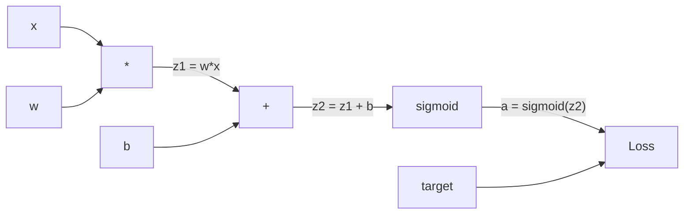
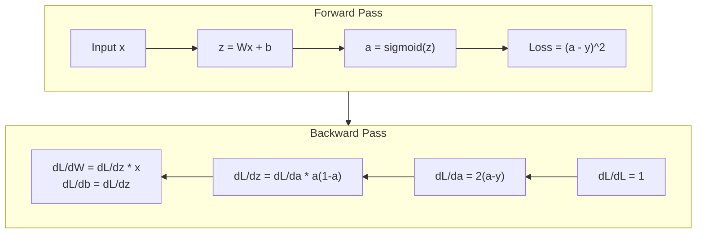
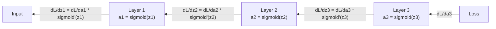

# Desde el 0 para lograr la retropropagación

> La retropropagación es hacer posible el aprendizaje de algoritmos. Sin ella, la red neuronal es sólo un costoso generador de números al azar.

**Type:** Build
**Languages:** Python
**Prerequisites:** Lesson 03.02 (Multi-Layer Networks)
**Time:** ~120 minutes

## El objetivo del aprendizaje
-                                                                                                                                                                                                                                                                                                                                                                                                                                                                                                                              
- Uso de la regla de la cadena 推导 adición, multiplicación y sigmoid de Pasado hacia atrás
-  sólo usando el motor de retropropagación de la realización desde el cero, en XOR y clasificación de círculo  entrenar una red de múltiples capas
- 识别深层 sigmoid network 中的消失梯度 问题,并解释为什么 Gradient 会指数级缩小

##  problemas
Tu red tiene una capa oculta, que contiene 768 entradas y 3072 salidas. Es decir, 2.359.296 pesos. Ha hecho una predicción errónea. ¿Qué pesos han provocado este error?

La práctica simple es: tomar un peso, molestarlo un poco, volver a ejecutarlo una vez más, medir la pérdida es subir o bajar. Esto le dará un grado de peso. Luego, cada peso en la red lo hace.

La propagación hacia atrás  resolvió este problema― una vez el paso hacia adelante, una vez el paso hacia atrás, todos los gradientes se calculan― la clave es la regla de cadena en el cálculo, aplicada sistemáticamente al gráfico computacional 上― es este algoritmo que hace que el aprendizaje profundo  se haga práctico― sin él, todavía sólo podemos estar atrapados en el problema del juego―

## 概念
### Regla de cadena, aplicada a la red

Usted está en la Fase 01, Lección 05 中见过链条规则──快速回顾: si y = f(g(x)), entonces dy/dx = f'(g(x)) * g'(x)──你沿着链条相乘衍生物──

En la red neuronal, la cadena de red es la secuencia de operaciones desde la entrada hasta la pérdida. Cada nivel de aplicación tiene un peso de carga, se suma a la activación, se comparan las funciones de pérdida. La función final de salida se compara con el objetivo. La propagación de vuelta se realiza a lo largo de esta cadena de seguimiento, calculación de cada operación a la contribución al error.

### Gráficos computacionales

Cada vez que Forward Pass, la ciudad construye un gráfico. Cada nodo es una operación.



Pasado hacia adelante:valor de la izquierda hacia la derecha.

Paso hacia atrás: Gradiente de derecha hacia izquierda 流动。 de dL/da 开始(Loss 如何随激活 改变)。乘以 da/dz2(sigmoid derivative)。 obtenido dL/dz2。拆分成 dL/db(Equivale a dL/dz2, pues z2 = z1 + b) 和 dL/dz1。 luego dL/dw = dL/dz1 * x,dL/dx = dL/dz1 * w。

Cada nodo en el gráfico durante el Paso Atrás  sólo tiene una tarea: recibir el gradiente de la parte superior, multiplicar su propia derivada local, y luego a la parte inferior de la transmisión 

### Avanti y hacia atrás



El pasante hacia adelante almacenará cada valor intermedio: z、a、 cada entrada de una capa. El pasante hacia atrás necesita estos valores almacenados para calcular el Gradiente.

### Gradiente en la red de flujo

Para una red de tres capas, el Gradiente se enlace a través de cada capa:



En cada uno de los niveles, el gradiente se multiplicará por derivada sigmoide. La derivada sigmoide es un * (1 - a), el valor máximo es 0.25 (cuando a = 0.5 时) ⋅ profundamente en los tres niveles.

### Los gradientes desaparecen

Éste es el problema de la disminución del gradiente. El sigmoide se reduce a 0 y entre 1 y su derivado es siempre menor que 0.25 y se acumula en la capa sigmoide.

```
sigmoid(z):     Output range [0, 1]
sigmoid'(z):    Max value 0.25 (at z = 0)

After 5 layers:   gradient * 0.25^5 = 0.001x original
After 10 layers:  gradient * 0.25^10 = 0.000001x original
```

Es por eso que la red sigmoide de nivel profundo es casi imposible de entrenar. El problema es lo que ha pasado.

### 推导 Gradiente de la red de dos capas

A continuación se muestra un ejemplo matemático concreto: red con entrada x 带 sigmoid de capa oculta 带 sigmoid de salida de capa, así como MSE Loss ⋅

Pasillo de avanzada:
```
z1 = W1 * x + b1
a1 = sigmoid(z1)
z2 = W2 * a1 + b2
a2 = sigmoid(z2)
L = (a2 - y)^2
```

Paso hacia atrás (逐步应用链规则):
```
dL/da2 = 2(a2 - y)
da2/dz2 = a2 * (1 - a2)
dL/dz2 = dL/da2 * da2/dz2 = 2(a2 - y) * a2 * (1 - a2)

dL/dW2 = dL/dz2 * a1
dL/db2 = dL/dz2

dL/da1 = dL/dz2 * W2
da1/dz1 = a1 * (1 - a1)
dL/dz1 = dL/da1 * da1/dz1

dL/dW1 = dL/dz1 * x
dL/db1 = dL/dz1
```

Cada gradiente es un derivado local de la pérdida que se puede rastrear.


```figure
backprop-vanishing
```

## Construirlo
### Paso 1: Nodo de valor

Cada número en nuestro cálculo se convierte en un valor. Almacena sus propios datos, Gradiente, así como cómo se crea. Así que sabe cómo invertir el Gradiente de cálculo.

```python
class Value:
    def __init__(self, data, children=(), op=''):
        self.data = data
        self.grad = 0.0
        self._backward = lambda: None
        self._children = set(children)
        self._op = op

    def __repr__(self):
        return f"Value(data={self.data:.4f}, grad={self.grad:.4f})"
```

No hay Gradiente (0.0)`_children`Así que podemos hacer una clasificación topológica del gráfico.

### Paso 2: 带 Función de retroceso de operación

Cada operación crea un nuevo valor, y define el gradiente cómo revertir el flujo a través de él.

```python
def __add__(self, other):
    other = other if isinstance(other, Value) else Value(other)
    out = Value(self.data + other.data, (self, other), '+')

    def _backward():
        self.grad += out.grad
        other.grad += out.grad

    out._backward = _backward
    return out

def __mul__(self, other):
    other = other if isinstance(other, Value) else Value(other)
    out = Value(self.data * other.data, (self, other), '*')

    def _backward():
        self.grad += other.data * out.grad
        other.grad += self.data * out.grad

    out._backward = _backward
    return out
```

 Para la adición: d  a + b) / da = 1, d  a + b) / db = 1── por lo tanto, dos entradas obtendrán directamente la salida de Gradiente──

对于乘法:d(a*b)/da = b,d(a*b)/db = a── cada entrada ciudad会获得另一个输入的值 乘以输出级别──

`+=`很关键──一个值可能会被多个操作使用──它的渐进是来自所有路径的渐进之和──

### 步骤 3: Sigmoide y pérdida

```python
import math

def sigmoid(self):
    x = self.data
    x = max(-500, min(500, x))
    s = 1.0 / (1.0 + math.exp(-x))
    out = Value(s, (self,), 'sigmoid')

    def _backward():
        self.grad += (s * (1 - s)) * out.grad

    out._backward = _backward
    return out
```

Derivada sigmoide:sigmoide(x) * (1 - sigmoide(x))。

```python
def mse_loss(predicted, target):
    diff = predicted + Value(-target)
    return diff * diff
```

单个输出的 MSE:(previsto - objetivo) ^2。 我们把减法表达为加上一个取负的值──

### Paso 4: Pasado hacia atrás

Tipo topológico  asegurarnos de que el nodo de un nodo en el orden correcto sea completamente acumulado antes de que continúe propagándose ∙

```python
def backward(self):
    topo = []
    visited = set()

    def build_topo(v):
        if v not in visited:
            visited.add(v)
            for child in v._children:
                build_topo(child)
            topo.append(v)

    build_topo(self)
    self.grad = 1.0
    for v in reversed(topo):
        v._backward()
```

Desde la pérdida 开始(Gradiente = 1.0, porque dL/dL = 1)── en el gráfico de la secuencia posterior de cada nodo `_backward`El Gradient lo enviará a sus hijos.

### 步骤 5: capa y red

```python
import random

class Neuron:
    def __init__(self, n_inputs):
        scale = (2.0 / n_inputs) ** 0.5
        self.weights = [Value(random.uniform(-scale, scale)) for _ in range(n_inputs)]
        self.bias = Value(0.0)

    def __call__(self, x):
        act = sum((wi * xi for wi, xi in zip(self.weights, x)), self.bias)
        return act.sigmoid()

    def parameters(self):
        return self.weights + [self.bias]


class Layer:
    def __init__(self, n_inputs, n_outputs):
        self.neurons = [Neuron(n_inputs) for _ in range(n_outputs)]

    def __call__(self, x):
        out = [n(x) for n in self.neurons]
        return out[0] if len(out) == 1 else out

    def parameters(self):
        params = []
        for n in self.neurons:
            params.extend(n.parameters())
        return params


class Network:
    def __init__(self, sizes):
        self.layers = []
        for i in range(len(sizes) - 1):
            self.layers.append(Layer(sizes[i], sizes[i + 1]))

    def __call__(self, x):
        for layer in self.layers:
            x = layer(x)
            if not isinstance(x, list):
                x = [x]
        return x[0] if len(x) == 1 else x

    def parameters(self):
        params = []
        for layer in self.layers:
            params.extend(layer.parameters())
        return params

    def zero_grad(self):
        for p in self.parameters():
            p.grad = 0.0
```

Una Neuron  recepción de entrada, calcular la suma ponderada + sesgo, luego aplicar sigmoid──权重初始化按平方(2/n_inputs) 缩放, para prevenir la saturación de sigmoid en la red más profunda── una capa es la lista de neurones── una red es la lista de capas──`parameters()`El método reunirá todos los valores que se pueden aprender, para que podamos actualizarlos.

### Paso 6: En XOR

```python
random.seed(42)
net = Network([2, 4, 1])

xor_data = [
    ([0.0, 0.0], 0.0),
    ([0.0, 1.0], 1.0),
    ([1.0, 0.0], 1.0),
    ([1.0, 1.0], 0.0),
]

learning_rate = 1.0

for epoch in range(1000):
    total_loss = Value(0.0)
    for inputs, target in xor_data:
        x = [Value(i) for i in inputs]
        pred = net(x)
        loss = mse_loss(pred, target)
        total_loss = total_loss + loss

    net.zero_grad()
    total_loss.backward()

    for p in net.parameters():
        p.data -= learning_rate * p.grad

    if epoch % 100 == 0:
        print(f"Epoch {epoch:4d} | Loss: {total_loss.data:.6f}")

print("\nXOR Results:")
for inputs, target in xor_data:
    x = [Value(i) for i in inputs]
    pred = net(x)
    print(f"  {inputs} -> {pred.data:.4f} (expected {target})")
```

 observar pérdida  下降── desde la pronóstico de la XOR hasta la salida correcta, completamente por la retropropagación  calcular Gradiente 并向正确方向微调权重来驱动──

### Paso 7: Clasificación de círculos

En la lección 02 , tú tienes que clasificar el círculo de la red.

```python
random.seed(7)

def generate_circle_data(n=100):
    data = []
    for _ in range(n):
        x1 = random.uniform(-1.5, 1.5)
        x2 = random.uniform(-1.5, 1.5)
        label = 1.0 if x1 * x1 + x2 * x2 < 1.0 else 0.0
        data.append(([x1, x2], label))
    return data

circle_data = generate_circle_data(80)

circle_net = Network([2, 8, 1])
learning_rate = 0.5

for epoch in range(2000):
    random.shuffle(circle_data)
    total_loss_val = 0.0
    for inputs, target in circle_data:
        x = [Value(i) for i in inputs]
        pred = circle_net(x)
        loss = mse_loss(pred, target)
        circle_net.zero_grad()
        loss.backward()
        for p in circle_net.parameters():
            p.data -= learning_rate * p.grad
        total_loss_val += loss.data

    if epoch % 200 == 0:
        correct = 0
        for inputs, target in circle_data:
            x = [Value(i) for i in inputs]
            pred = circle_net(x)
            predicted_class = 1.0 if pred.data > 0.5 else 0.0
            if predicted_class == target:
                correct += 1
        accuracy = correct / len(circle_data) * 100
        print(f"Epoch {epoch:4d} | Loss: {total_loss_val:.4f} | Accuracy: {accuracy:.1f}%")
```

Aquí usamos SGD en línea - cada muestra  después de actualizar el peso, en lugar de acumulación del lote completo. Esto será más rápido para romper la comparabilidad, y evitar que en el paisaje de pérdida completa se produzca saturación sigmoide.

没有手动调参──网络会自己发现圆形决策界限──这就是反扩散的力量:你定义建筑、损失函数和数据──算法会找出权重──

## Usalo
PyTorch utiliza varias líneas de código para completar todo el trabajo de arriba.

```python
import torch
import torch.nn as nn

model = nn.Sequential(
    nn.Linear(2, 4),
    nn.Sigmoid(),
    nn.Linear(4, 1),
    nn.Sigmoid(),
)
optimizer = torch.optim.SGD(model.parameters(), lr=1.0)
criterion = nn.MSELoss()

X = torch.tensor([[0,0],[0,1],[1,0],[1,1]], dtype=torch.float32)
y = torch.tensor([[0],[1],[1],[0]], dtype=torch.float32)

for epoch in range(1000):
    pred = model(X)
    loss = criterion(pred, y)
    optimizer.zero_grad()
    loss.backward()
    optimizer.step()

print("PyTorch XOR Results:")
with torch.no_grad():
    for i in range(4):
        pred = model(X[i])
        print(f"  {X[i].tolist()} -> {pred.item():.4f} (expected {y[i].item()})")
```

`loss.backward()`Es tu .`total_loss.backward()`¿Qué es eso?`optimizer.step()`Es lo que escribiste a mano.`p.data -= lr * p.grad`¿Qué es eso?`optimizer.zero_grad()`Es tu .`net.zero_grad()` El mismo algoritmo, la realización de nivel industrial  PyTorch  responsable de la aceleración de la GPU  precisión mixta  control de gradientes, así como cientos de tipos de capas  Pero Backward Pass  sigue siendo la misma regla de cadena, aplicada en el mismo gráfico computacional 

训练会运行前进通行,然后运行后进通行,再更新权重――Inference Sólo运行前进通行――没有 Gradient,没有更新―― Esta diferencia es importante, porque la inferencia 才是生产环境中发生的事情―― Cuando usted llama a Claude o GPT, como API 时, usted ejecuta la inferencia -- Su prompt向前流经网络,Token from the other end output―― no tiene el poder de cambiar. Comprender la backpropagation 很重要, porque ha moldeado cada uno de los derechos de la red en ese contexto.

##  entregarlo
Encuentro de trabajo:
- `outputs/prompt-gradient-debugger.md`-- Una rápida y repetible, para diagnosticar cualquier Gradiente en la red neuronal  problemas de desaparición, explosión, NaN)

##  ejercicios
1. 给 Value class 添加一个 `__sub__`método(a - b = a + (-1 * b))。 para luego lograr una `__neg__`método── a través de la comparación con el simple expresamiento (a - b) ^2) de cálculo manual, la prueba de grado es correcta─

2. 给值 添加一个 `relu`método(salida para max(0, x),derivado en x > 0 时为1,否则为0) ―― en la capa oculta en el relu 替换 sigmoid,并再次在 XOR 上训练──比较收速度──你应该会看到训练更快--这是第04课的预告──

3. En el valor de arriba para lograr una potencia de enteros utilizados de `__pow__`método... Usalo.`mse_loss` sustitución en verdadero `(predicted - target) ** 2`Expresar: △ △ △ △ △ △ △ △ △ △ △ △ △ △ △ △ △ △ △ △ △ △ △ △ △ △ △ △ △ △ △ △ △ △ △ △ △ △ △ △ △ △ △ △ △ △ △ △ △ △ △ △ △ △ △ △ △ △ △ △ △ △ △ △ △ △ △ △ △ △ △ △ △ △ △ △ △ △ △ △ △ △ △ △ △ △ △ △ △ △ △ △ △                                                                                                                                                                

4. 给训练循环 添加梯度剪切:调用 `backward()`后把所有 Gradient clip到 [-1, 1]──训练一个更深的网络(4+ capas con sigmoid),并比较有无剪切的损失曲线──这是你对抗爆炸梯度的第一防线──

5. Construir una visualización: después de completar el entrenamiento de XOR, imprimir Gradiente de cada parámetro en la red.

## 关键术语: "El hombre es un hombre"
| Term | What people say | What it actually means |
|------|----------------|----------------------|
| Backpropagation | “Network 学会了” | 一种算法，通过沿 Computational Graph 反向应用 chain rule，为每个权重计算 dL/dw |
| Computational graph | “Network 结构” | 一个有向无环 graph，其中 node 是 operation，edge 承载 value（forward）和 Gradient（backward） |
| Chain rule | “把 derivative 相乘” | 如果 y = f(g(x))，那么 dy/dx = f'(g(x)) * g'(x) -- Backpropagation 的数学基础 |
| Gradient | “最陡上升方向” | Loss 相对于某个 parameter 的 partial derivative -- 告诉你如何改变该 parameter 来降低 Loss |
| Vanishing gradient | “深层 network 学不会” | 当 Gradient 通过带有 sigmoid 这类 saturating activation 的 layer 传播时，会指数级缩小 |
| Forward pass | “运行 network” | 通过顺序应用每一层的 operation，从 input 计算 output，并存储 intermediate value |
| Backward pass | “计算 Gradient” | 反向遍历 Computational Graph，在每个 node 使用 chain rule 累积 Gradient |
| Learning rate | “学习速度” | 一个控制权重更新步长的 scalar：w_new = w_old - lr * gradient |
| Topological sort | “正确顺序” | 一种 graph node 排序方式，使每个 node 都出现在其依赖的所有 node 之后 -- 确保 Gradient 在传播前已完全累积 |
| Autograd | “自动微分” | 一个在 forward computation 期间构建 Computational Graph，并自动计算 Gradient 的系统 -- PyTorch 的 engine 做的就是这个 |

## 延伸阅读
- Rumelhart, Hinton & Williams, "Aprender representaciones mediante errores de propagación posterior" (1986) -- 这篇论文让 Backpropagation 成为主流,并解锁了多层网络培训
- 3Blue1Brown, serie de "Redes Neurales" (https://www.youtube.com/playlist?list=PLZHQObOWTQDNU6R1_67000Dx_ZCJB-3pi) --  sobre la retropropagación y la mejor explicación de cómo fluye la red gradual
