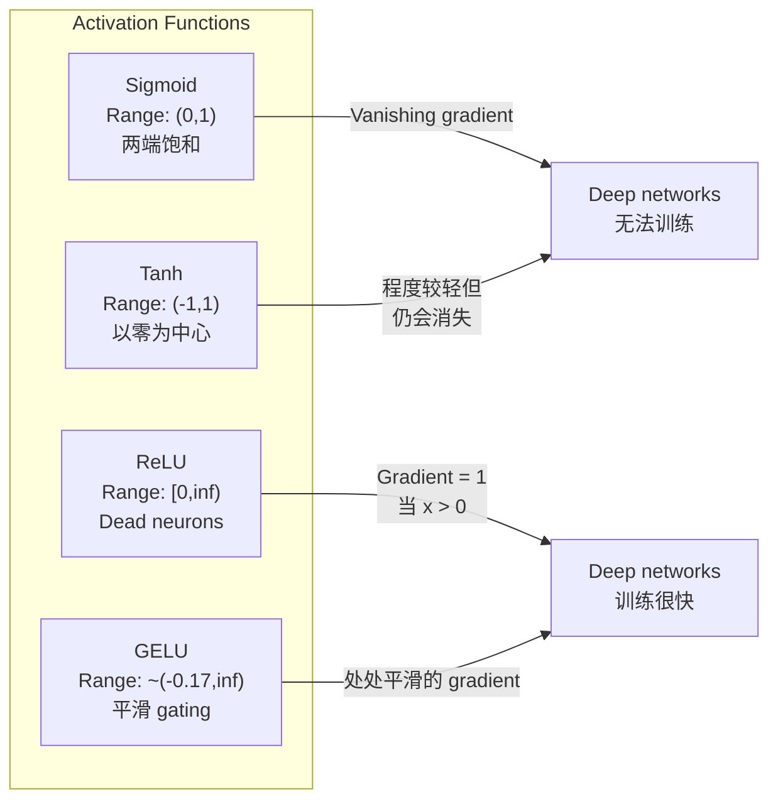
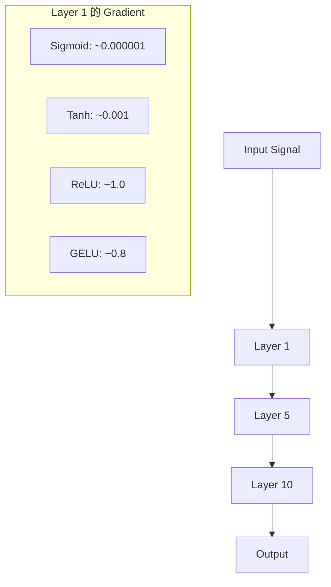
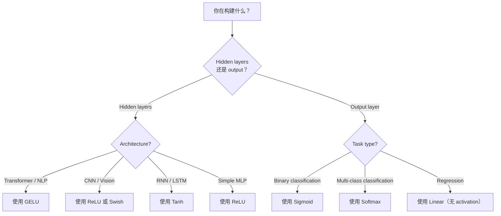

# 激活函数

> 没有非线性, tu red de 100 capas 只是 una exquisita multiplicación de la matriz―.

**Type:** Build
**Languages:** Python
**Prerequisites:** Lesson 03.03 (Backpropagation)
**Time:** ~75 分钟

## El objetivo del aprendizaje

- Desde el zero de la realización de sigmoid、tanh、ReLU、Leaky ReLU、GELU、Swish 和 softmax  y sus derivados
- 通过测量不同激活在10+ 层中的激活大小,诊断消失梯度问题
- Reprobar la red de neuronas muertas en el centro de la red de la RELU,并解释为什么 GELU 能避免这种失败模式
- Para determinar la arquitectura de la función de activación (transformer, CNN, RNN, output layer)

##  problemas

堆叠两个 transformaciones lineales: y = W2(W1x + b1) + b2。展开它:y = W2W1x + W2b1 + b2。 éstas son simplemente y = Ax + c una sola transformación lineal。 independientemente de cuántas capas lineales se encuentren en la pila, el resultado de cada uno se acumulará en una sola matriz multiplicada。 tu red de 100 capas tiene la misma capacidad de expresión。

Esto no es un fenómeno teórico. Significa que una red lineal profunda no puede aprender XOR, no puede clasificar un conjunto de datos en espiral, no puede reconocer la cara de una persona.

Funciones de activación 打破线性──las pasan por una función no lineal 扭曲每一层的输出,让网络 能够曲决策界限、近似任意函数,并真正学习── pero si se elige la activación errónea, sus gradientes desaparecerán hasta zero (sigmoide)  (sigmoide)  (explosion)  (infinidad)  (no se inicializa con precaución)  (no se inicializa con límites ilimitados)  (o sus neuronas morirán permanentemente)  (ReLU)  (regularidad) )  (la elección de la función de activación determina directamente si su red puede aprender o no.

## 概念

### ¿Por qué es necesario no lineal?

La multiplicación de matriz es complicable. La matriz A se multiplica por un vector, la matriz B se multiplica por un resultado, igual al valor de AB. Esto significa que se acumulan diez capas lineales que matemáticamente se equiparan a una capa lineal de una matriz con una gran cantidad de dimensiones. Todos estos parámetros, todas estas profundidades se han perdido.

La siguiente es la prueba: una capa lineal  calcular f(x) = Wx + b。

```
Layer 1: h = W1 * x + b1
Layer 2: y = W2 * h + b2
```

¿Qué es esto?

```
y = W2 * (W1 * x + b1) + b2
y = (W2 * W1) * x + (W2 * b1 + b2)
y = A * x + c
```

Una capa. En la que se puede ver la activación no lineal:

```
h = g(W1 * x + b1)
y = W2 * h + b2
```

Ahora代入被打破了──W2 * g(W1 * x + b1) + b2 不能再简化为单线性转换──网络可以表示非线性函数──每增加一层带激活的层,都会增加表示能力──

### Sigmoides

La última función de activación de la red neuronal.

```
sigmoid(x) = 1 / (1 + e^(-x))
```

输出范围:(0, 1)──平滑、可微, será cualquier número real mapeado a un valor similar a la probabilidad.

derivados:

```
sigmoid'(x) = sigmoid(x) * (1 - sigmoid(x))
```

El valor máximo de esta derivada es 0.25, en la espaldación, los gradientes se multiplican de una forma a otra.

```
0.25^10 = 0.000000953674
```

No llega a los millones de señales primitivas. Este es el problema de los gradientes que se están desvaneciendo. Las primeras capas de los gradientes se vuelven muy pequeñas, los pesos casi no se actualizan.

Otro problema:sigmoide 输出始终为正(0到 1), lo que significa pesos de los gradientes superiores 总是同号── esto causará que el proceso de descenso del gradiente aparezca en forma de temblor──

### Tanh

Sigmoid de la versión de hoy.

```
tanh(x) = (e^x - e^(-x)) / (e^x + e^(-x))
```

输出范围:(-1, 1)──以零为中心,可以消除之字形问题──

derivados:

```
tanh'(x) = 1 - tanh(x)^2
```

El mayor derivado en x = 0 时为 1.0比sigmoid 好四倍――但消失梯度问题 仍然存在――对于很大的正输入或负输入,derivative 会趋近零――十层仍然会压碎梯度,只是没有那么激烈――

### ¿Qué pasa ?

La Unidad Lineal Rectificada──Nair 和 Hinton en 2010 la promovió en el aprendizaje profundo.

```
relu(x) = max(0, x)
```

输出范围:[0, infinito) ・derivado 非常简单:

```
relu'(x) = 1  if x > 0
            0  if x <= 0
```

 Para la entrada correcta, no existe gradiente desapareciente―gradiente justo bueno es 1, será directamente transmitido pasado― esta es la razón por la que las redes profundas ReLU realizar realizar realizar realizar realizar realizar realizar realizar realizar realizar realizar realizar realizar realizar realizar realizar realizar realizar realizar realizar realizar realizar realizar realizar realizar realizar realizar realizar realizar realizar realizar realizar realizar realizar realizar realizar realizar realizar realizar realizar realizar realizar realizar realizar realizar realizar realizar realizar realizar realizar re realizar realizar re realizar re

Pero tiene un modo de falla: problema de neuronas muertas. Si una neurona tiene una entrada ponderada siempre negativa, su salida será siempre para cero, el gradiente siempre para cero, por lo que nunca se actualizará.

### ReLU filtrado

Las neuronas muertas, el mejor método de reparación.

```
leaky_relu(x) = x        if x > 0
                alpha * x if x <= 0
```

Entre ellos, el alfa es un pequeño número constante, normalmente de 0.01──un eje negativo tiene una pequeña inclinación en lugar de cero, por lo que las neuronas muertas  todavía pueden obtener la señal de gradiente, y tienen la oportunidad de recuperarse──

### GELU:现代默认选择

Unidad lineal de error gaussiano― presentada en 2016 por Hendrycks 和 Gimpel―: BERT、GPT y la mayoría de los transformadores modernos―:

```
gelu(x) = x * Phi(x)
```

Entre ellos Phi(x) es la función de distribución acumulada de la distribución normal estándar.

```
gelu(x) ~= 0.5 * x * (1 + tanh(sqrt(2/pi) * (x + 0.044715 * x^3)))
```

GELU está en posición de planeación, permite un menor valor negativo (((no como ReLU 那样硬截断为零), y hay una probabilidad de explicación: depende de cada entrada en la distribución gaussiana 下为正的可能性对其加权──. Este gateage plano es superior a ReLU en las arquitecturas de transformadores, ya que ofrece un mejor flujo de gradiente,并完全避免死神经元问题──.

### El precio de la venta

Por Ramachandran et al. En 2017 a través de búsqueda automática 发现的自闭门激活──

```
swish(x) = x * sigmoid(x)
```

Swish es un sistema de búsqueda automática que se encuentra en el espacio de funciones de activación de Google.

Como GELU, se planea, no se maneja, y permite un menor valor negativo. La diferencia es muy pequeña:Swish utiliza sigmoid como portalaje, mientras que GELU utiliza CDF gaussiano. En la práctica, la prestación es casi la misma.

### Softmax: salida de activación

No se utiliza en capas ocultas. Softmax se convertirá en puntajes en bruto de los logitos.

```
softmax(x_i) = e^(x_i) / sum(e^(x_j) for all j)
```

Cada salida está entre 0 y 1 ⋅ todas las salidas y 1 ⋅ esto hace que sea la activación final estándar de la clasificación de múltiples clases ⋅ la lógica más grande obtendrá la mayor probabilidad, pero no es igual a argmax, softmax es muy pequeño, y conserva información de confianza relativa ⋅

### 形形对比



### Flujo gradiente en relación con



### ¿Cuándo usar qué tipo de activación?



## 动手构建 动手构建

### 步骤 1: Realizar todas las funciones de activación  y sus derivados

Cada función recibe una flota y regresa a una flota. Cada función derivada recibe el mismo ingreso y regresa a un gradiente.

```python
import math

def sigmoid(x):
    x = max(-500, min(500, x))
    return 1.0 / (1.0 + math.exp(-x))

def sigmoid_derivative(x):
    s = sigmoid(x)
    return s * (1 - s)

def tanh_act(x):
    return math.tanh(x)

def tanh_derivative(x):
    t = math.tanh(x)
    return 1 - t * t

def relu(x):
    return max(0.0, x)

def relu_derivative(x):
    return 1.0 if x > 0 else 0.0

def leaky_relu(x, alpha=0.01):
    return x if x > 0 else alpha * x

def leaky_relu_derivative(x, alpha=0.01):
    return 1.0 if x > 0 else alpha

def gelu(x):
    return 0.5 * x * (1 + math.tanh(math.sqrt(2 / math.pi) * (x + 0.044715 * x ** 3)))

def gelu_derivative(x):
    phi = 0.5 * (1 + math.erf(x / math.sqrt(2)))
    pdf = math.exp(-0.5 * x * x) / math.sqrt(2 * math.pi)
    return phi + x * pdf

def swish(x):
    return x * sigmoid(x)

def swish_derivative(x):
    s = sigmoid(x)
    return s + x * s * (1 - s)

def softmax(xs):
    max_x = max(xs)
    exps = [math.exp(x - max_x) for x in xs]
    total = sum(exps)
    return [e / total for e in exps]
```

### Paso 2: Visualización Gradientes en donde muere

En 100 个间隔点 (de -5 a 5), en el gráfico de cálculo, imprime un histograma de texto, mostrando el gráfico de cada activación en el que se acerca a cero.

```python
def gradient_scan(name, derivative_fn, start=-5, end=5, n=100):
    step = (end - start) / n
    near_zero = 0
    healthy = 0
    for i in range(n):
        x = start + i * step
        g = derivative_fn(x)
        if abs(g) < 0.01:
            near_zero += 1
        else:
            healthy += 1
    pct_dead = near_zero / n * 100
    print(f"{name:15s}: {healthy:3d} healthy, {near_zero:3d} near-zero ({pct_dead:.0f}% dead zone)")

gradient_scan("Sigmoid", sigmoid_derivative)
gradient_scan("Tanh", tanh_derivative)
gradient_scan("ReLU", relu_derivative)
gradient_scan("Leaky ReLU", leaky_relu_derivative)
gradient_scan("GELU", gelu_derivative)
gradient_scan("Swish", swish_derivative)
```

### Paso 3: Desvanecimiento Gradiente 实验

Utiliza sigmoid y ReLU, haga pasar una señal a través de N 层 forward-pass.

```python
import random

def vanishing_gradient_experiment(activation_fn, name, n_layers=10, n_inputs=5):
    random.seed(42)
    values = [random.gauss(0, 1) for _ in range(n_inputs)]

    print(f"\n{name} through {n_layers} layers:")
    for layer in range(n_layers):
        weights = [random.gauss(0, 1) for _ in range(n_inputs)]
        z = sum(w * v for w, v in zip(weights, values))
        activated = activation_fn(z)
        magnitude = abs(activated)
        bar = "#" * int(magnitude * 20)
        print(f"  Layer {layer+1:2d}: magnitude = {magnitude:.6f} {bar}")
        values = [activated] * n_inputs

vanishing_gradient_experiment(sigmoid, "Sigmoid")
vanishing_gradient_experiment(relu, "ReLU")
vanishing_gradient_experiment(gelu, "GELU")
```

### Paso 4: Neurón muerto 检测器

Crear una red de ReLU, transmitir entradas aleatorias entre ellas, estadísticas de cuántas neuronas no activadas.

```python
def dead_neuron_detector(n_inputs=5, hidden_size=20, n_samples=1000):
    random.seed(0)
    weights = [[random.gauss(0, 1) for _ in range(n_inputs)] for _ in range(hidden_size)]
    biases = [random.gauss(0, 1) for _ in range(hidden_size)]

    fire_counts = [0] * hidden_size

    for _ in range(n_samples):
        inputs = [random.gauss(0, 1) for _ in range(n_inputs)]
        for neuron_idx in range(hidden_size):
            z = sum(w * x for w, x in zip(weights[neuron_idx], inputs)) + biases[neuron_idx]
            if relu(z) > 0:
                fire_counts[neuron_idx] += 1

    dead = sum(1 for c in fire_counts if c == 0)
    rarely_fire = sum(1 for c in fire_counts if 0 < c < n_samples * 0.05)
    healthy = hidden_size - dead - rarely_fire

    print(f"\nDead Neuron Report ({hidden_size} neurons, {n_samples} samples):")
    print(f"  Dead (never fired):     {dead}")
    print(f"  Barely alive (<5%):     {rarely_fire}")
    print(f"  Healthy:                {healthy}")
    print(f"  Dead neuron rate:       {dead/hidden_size*100:.1f}%")

    for i, c in enumerate(fire_counts):
        status = "DEAD" if c == 0 else "WEAK" if c < n_samples * 0.05 else "OK"
        bar = "#" * (c * 40 // n_samples)
        print(f"  Neuron {i:2d}: {c:4d}/{n_samples} fires [{status:4s}] {bar}")

dead_neuron_detector()
```

### Paso 5: Entrenamiento en comparación Sigmoide vs ReLU vs GELU

En el conjunto de datos de círculos, el punto de la circunferencia = clase 1, el círculo de la circunferencia = clase 0), se utiliza tres tipos diferentes de activaciones para entrenar con una red de dos capas.

```python
def make_circle_data(n=200, seed=42):
    random.seed(seed)
    data = []
    for _ in range(n):
        x = random.uniform(-2, 2)
        y = random.uniform(-2, 2)
        label = 1.0 if x * x + y * y < 1.5 else 0.0
        data.append(([x, y], label))
    return data


class ActivationNetwork:
    def __init__(self, activation_fn, activation_deriv, hidden_size=8, lr=0.1):
        random.seed(0)
        self.act = activation_fn
        self.act_d = activation_deriv
        self.lr = lr
        self.hidden_size = hidden_size

        self.w1 = [[random.gauss(0, 0.5) for _ in range(2)] for _ in range(hidden_size)]
        self.b1 = [0.0] * hidden_size
        self.w2 = [random.gauss(0, 0.5) for _ in range(hidden_size)]
        self.b2 = 0.0

    def forward(self, x):
        self.x = x
        self.z1 = []
        self.h = []
        for i in range(self.hidden_size):
            z = self.w1[i][0] * x[0] + self.w1[i][1] * x[1] + self.b1[i]
            self.z1.append(z)
            self.h.append(self.act(z))

        self.z2 = sum(self.w2[i] * self.h[i] for i in range(self.hidden_size)) + self.b2
        self.out = sigmoid(self.z2)
        return self.out

    def backward(self, target):
        error = self.out - target
        d_out = error * self.out * (1 - self.out)

        for i in range(self.hidden_size):
            d_h = d_out * self.w2[i] * self.act_d(self.z1[i])
            self.w2[i] -= self.lr * d_out * self.h[i]
            for j in range(2):
                self.w1[i][j] -= self.lr * d_h * self.x[j]
            self.b1[i] -= self.lr * d_h
        self.b2 -= self.lr * d_out

    def train(self, data, epochs=200):
        losses = []
        for epoch in range(epochs):
            total_loss = 0
            correct = 0
            for x, y in data:
                pred = self.forward(x)
                self.backward(y)
                total_loss += (pred - y) ** 2
                if (pred >= 0.5) == (y >= 0.5):
                    correct += 1
            avg_loss = total_loss / len(data)
            accuracy = correct / len(data) * 100
            losses.append(avg_loss)
            if epoch % 50 == 0 or epoch == epochs - 1:
                print(f"    Epoch {epoch:3d}: loss={avg_loss:.4f}, accuracy={accuracy:.1f}%")
        return losses


data = make_circle_data()

configs = [
    ("Sigmoid", sigmoid, sigmoid_derivative),
    ("ReLU", relu, relu_derivative),
    ("GELU", gelu, gelu_derivative),
]

results = {}
for name, act_fn, act_d_fn in configs:
    print(f"\n=== Training with {name} ===")
    net = ActivationNetwork(act_fn, act_d_fn, hidden_size=8, lr=0.1)
    losses = net.train(data, epochs=200)
    results[name] = losses

print("\n=== Final Loss Comparison ===")
for name, losses in results.items():
    print(f"  {name:10s}: start={losses[0]:.4f} -> end={losses[-1]:.4f} (improvement: {(1 - losses[-1]/losses[0])*100:.1f}%)")
```


```figure
softmax-temperature
```

## Usalo

PyTorch ofrece estas funciones en dos formas funcionales y módulos:

```python
import torch
import torch.nn as nn
import torch.nn.functional as F

x = torch.randn(4, 10)

relu_out = F.relu(x)
gelu_out = F.gelu(x)
sigmoid_out = torch.sigmoid(x)
swish_out = F.silu(x)

logits = torch.randn(4, 5)
probs = F.softmax(logits, dim=1)

model = nn.Sequential(
    nn.Linear(10, 64),
    nn.GELU(),
    nn.Linear(64, 32),
    nn.GELU(),
    nn.Linear(32, 5),
)
```

Clasificación de la capa de salida:softmax──regressión de la capa de salida: no(lineal)── probabilidad de la capa de salida:sigmoid──就是這樣──先從這些默认值開始──只有你有證據才改變它们──

RNNs y LSTMs para estado oculto Uso tanh, uso de puertas Uso sigmoide, pero si hoy se construye desde cero, usted probablemente no usará RNNs. Si sus neuronas en la red de RLU están muriendo, se cambian a GELU. No elija con la mano Leaky ReLU, a menos que tenga razones claras.

## 交付成果  交付成果                                                                                                                                                                                                                                                                                                                                                                                                                                                                                                                     

Encuentro de trabajo:
- `outputs/prompt-activation-selector.md` Un prompt de repetición, ayudarle para cualquier arquitectura  seleccionar la función de activación correcta

##  ejercicios

1. 实现 Parametric ReLU (PReLU), en el que la pendiente negativa alfa es un parámetro de aprendizaje.

2. ¿Experimentará el gradiente de desaparición de 10 niveles en 50 niveles de operación? ¿Descrebirá sigmoides, tanh, relú y gelú en cada nivel de magnitud? ¿En qué nivel de activación se alcanza realmente el cero?

3. 实现 ELU (Unidad Lineal Exponencial):elu(x) = x si x > 0, alfa * (e^x - 1) si x <= 0── en la misma red 上将它的 neural mortalidad con ReLU对比──

4. Construir un monitor de salud de grado, durante el entrenamiento: durante cada época  calcular la magnitud media del gradiente de cada capa―en cualquier capa de gradiente  inferior a 0,001 o superior a 100 时印 warning―

5.  Modificar el entrenamiento en comparación, usando el conjunto de datos XOR en la Lección 01 en lugar de círculos. ¿Qué tipo de activación en XOR se obtiene más rápido? ¿Por qué es diferente con los resultados del círculo?

## 关键术语: "El hombre es un hombre"

| Term | 人们怎么说 | 它实际是什么意思 |
|------|----------------|----------------------|
| Activation function | “非线性部分” | 应用于每个 neuron 输出的函数，用于打破线性，使 network 能够学习 nonlinear mappings |
| Vanishing gradient | “Gradients 在 deep networks 中消失” | 当 activation 的 derivative 小于 1 时，gradients 会通过 layers 指数级缩小，使早期 layers 无法训练 |
| Exploding gradient | “Gradients 爆炸” | 当有效乘数超过 1 时，gradients 会通过 layers 指数级增长，导致训练不稳定 |
| Dead neuron | “停止学习的 neuron” | 输入永久为负的 ReLU neuron，会产生零输出和零 gradient |
| Sigmoid | “把值压缩到 0-1” | logistic function 1/(1+e^-x)，历史上很重要，但会在 deep networks 中导致 vanishing gradients |
| ReLU | “把负数裁剪为零” | max(0, x)——通过保留 gradient magnitude 让 deep learning 变得实用的 activation |
| GELU | “transformer activation” | Gaussian Error Linear Unit，一种平滑 activation，会根据输入为正的概率对输入加权 |
| Swish/SiLU | “Self-gated ReLU” | x * sigmoid(x)，通过 automated search 发现，用于 EfficientNet |
| Softmax | “把分数变成概率” | 将 logits 的 Vector 归一化为 probability distribution，其中所有值都在 (0,1) 内且总和为 1 |
| Leaky ReLU | “不会死亡的 ReLU” | max(alpha*x, x)，其中 alpha 很小（0.01），通过允许较小的 negative gradients 来防止 dead neurons |
| Saturation | “sigmoid 的平坦部分” | activation 的 derivative 趋近于零的区域，会阻断 gradient flow |
| Logit | “softmax 之前的原始分数” | 应用 softmax 或 sigmoid 之前，final layer 的未归一化输出 |

## 延伸阅读

- Nair & Hinton, "Unidades Lineares Rectificadas Mejoran las Máquinas Restringidas de Boltzmann" (2010) 介绍 ReLU 并促成深度网络 训练的论文
- Hendrycks & Gimpel, "Unidades Lineares de Erro Gaussian (GELU) " (2016)  propuesto posteriormente convertirse en transformadores 默认选择的 activación función
- Ramachandran et al., "Buscar funciones de activación" (2017) utilizar búsqueda automática 发现 Swish, mostrar activación 设计可以自动化
- Glorot & Bengio, "Comprender la dificultad de entrenar redes neuronales de entrada profunda" (2010)  diagnóstico de gradientes desaparecientes/explosivos 并提出 Xavier inicialization 的论文
- Bienvenido, Bengio, Courville, "Aprendizaje profundo" Capítulo 6.3 (https://www.deeplearningbook.org/) Exemplos estrictos de las unidades ocultas y las funciones de activación
