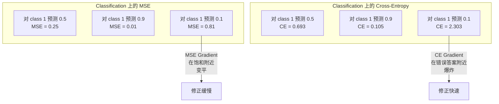
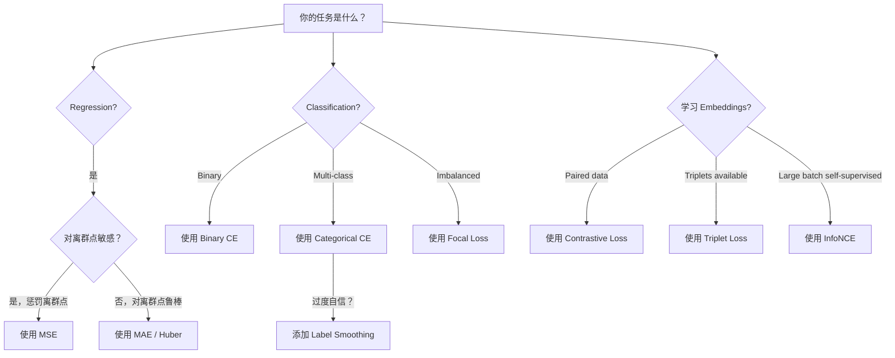
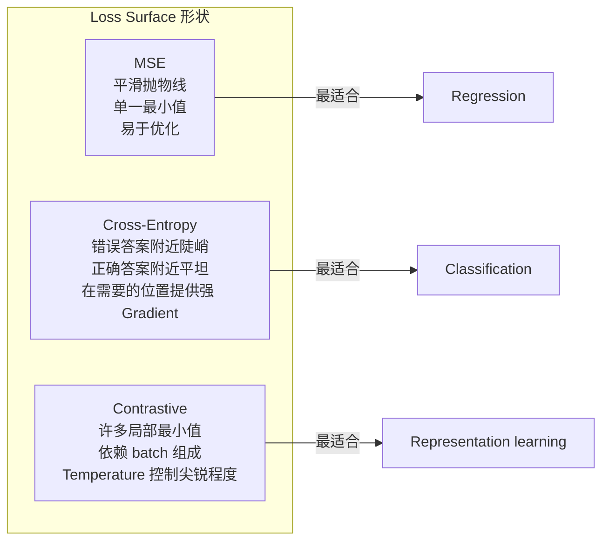

# Funciones perdidas

> Su red neuronal hace una predicción. La verdad fundamental da una respuesta diferente. ¿Se puede equivocar? Ese número es la función de pérdida.

**Type:** Build
**Languages:** Python
**Prerequisites:** Lesson 03.04 (Activation Functions)
**Time:** ~75 minutes

## El objetivo del aprendizaje

- Desde la realización de las MSE, la entropía cruzada binaria, la entropía cruzada categórica y la pérdida de contraste (InfoNCE), así como su gradiente
- 通过演示对所有样本都预测 0.5的失败模式,解释为什么MSE不适合分类
- Se utiliza para la entropía cruzada, y describe cómo se previene la previsión de la confianza excesiva
- Para la regresión, la clasificación binaria, la clasificación multiclas y la incorporación de las tareas de aprendizaje seleccionar la función de pérdida correcta

##  problemas

En el modelo de MSE minimizado en el problema de clasificación, se prevé con mucha confianza todo lo que se prevé 0.5―.

La función de pérdida es el único objeto de optimización real del modelo. No es la precisión. No es la puntuación de F1. Ni tampoco es cualquier métrica del gestor. El optimizador toma el gradiente de la función de pérdida y ajusta el peso para hacer que este número sea pequeño. Si la función de pérdida no capta lo que realmente te preocupa, el modelo encontrará la manera más económica matemática para satisfacerlo, y esa forma casi no es siempre lo que quieres.

Aquí hay un ejemplo concreto. Hay una clasificación binaria 任务── dos categorías, 50/50 分布── usted utiliza MSE 作为损失──模型对每输入都预测 0.5──平均 MSE 平均 MSE 平均是0.25,这是在任何没学到的情况下可能达到的最小值──这个模型没有任何分辨能力,但从技术上说它已经最小化了你的损失函数──换成交叉后, el mismo modelo se verá obligado a proponer la predicción hacia 0 o 1, porque - (log0.5) = 0.693 es una pérdida muy mala, y -log(0.99) = 0.01 会奖励信心和正确的预测──Loss Function's choice, is the difference between the model of learning and the metric of the empty-born model──

 situación también empeorará. En el aprendizaje auto supervisado, ni siquiera tienes etiquetas. Contrastivo Perdida  completamente define el aprendizaje de señales: qué es similar, qué es diferente, y el modelo debe tener más poder para separarlos. Contrastivo Perdida  escribir errores, tus embeddings se desmoronarán a un punto.

## 概念

### Erro medio cuadrado (MSE)

El cálculo de la diferencia entre el valor de la predicción y el valor objetivo en el cuadrado, y la media en todas las muestras.

```
MSE = (1/n) * sum((y_pred - y_true)^2)
```

Por qué el cuadrado es importante: se castiga de forma secundaria los grandes errores. El precio de los errores de 2 es 4 veces el precio de 1 error. El precio de los errores de 10 es 100 veces. Esto hace que el MSE sea sensible a los puntos de separación.

Número real: si tu modelo prevé el precio de la casa, se diferencia en la mayoría de las casas $10,000，但对一栋豪宅偏差 $200.000,MSE tendrá la fuerza de intentar reparar ese primer casito, podría dañar el rendimiento de otros 99 suites de viviendas.

MSE relativa al valor de pronóstico es:

```
dMSE/dy_pred = (2/n) * (y_pred - y_true)
```

Esto se refiere a la Regresión es una característica (el gran error requiere una gran corrección), a la Clasificación es un problema (quiere un punimiento de índice de la respuesta a la confianza pero la equivocación, en lugar de un punimiento lineal).

### Perdida de entropía cruzada

La función de pérdida de clasificación se deriva de la teoría de la información - medir la diferencia entre la distribución de probabilidad de pronóstico y la distribución real.

**Binary Cross-Entropy (BCE):**

```
BCE = -(y * log(p) + (1 - y) * log(1 - p))
```

Entre ellos y es el verdadero indicador ((0 o 1),p es la probabilidad de pronóstico.

Por qué -log(p) tiene efecto: cuando el verdadero marcador es 1 y tu predicción p = 0.99 时,Loss es -log(0.99) = 0.01。 Cuando tu predicción p = 0.01 时,Loss es -log(0.01) = 4.6。 esta diferencia de 460 倍 es de entropía cruzada tiene efecto.

Gradient 讲述是同一个故事:

```
dBCE/dp = -(y/p) + (1-y)/(1-p)
```

Cuando y = 1 y p 接近零时, Gradiente es -1/p, tendencia negativa infinita. El modelo obtiene una señal enorme para corregir el error.

**Categorical Cross-Entropy:**

Utilizado para la clasificación de múltiples clases de un único objetivo de codificación.

```
CCE = -sum(y_i * log(p_i))
```

只有真实类别会贡献损失(因为所有其他 y_i 都是零) ⋅ Si hay 10 categorías, la probabilidad de obtener la clase correcta es 0.1 ⋅ ⋅ ⋅ ⋅ ⋅ ⋅ ⋅ ⋅ ⋅ ⋅ ⋅ ⋅ ⋅ ⋅ ⋅ ⋅ ⋅ ⋅ ⋅ ⋅ ⋅ ⋅ ⋅ ⋅ ⋅ ⋅ ⋅ ⋅ ⋅ ⋅ ⋅ ⋅ ⋅ ⋅ ⋅ ⋅ ⋅ ⋅ ⋅ ⋅ ⋅ ⋅ ⋅ ⋅ ⋅ ⋅ ⋅ ⋅ ⋅ ⋅ ⋅ ⋅ ⋅ ⋅ ⋅ ⋅ ⋅ ⋅ ⋅ ⋅ ⋅ ⋅ ⋅ ⋅ ⋅ ⋅ ⋅ ⋅ ⋅ ⋅ ⋅ ⋅ ⋅ ⋅ ⋅ ⋅ ⋅ ⋅ ⋅ ⋅ ⋅ ⋅ ⋅ ⋅ ⋅ ⋅ ⋅ ⋅ ⋅ ⋅ ⋅ ⋅ ⋅ ⋅ ⋅ ⋅ ⋅ ⋅ ⋅ ⋅ ⋅ ⋅ ⋅ ⋅ ⋅ ⋅ ⋅ ⋅ ⋅ ⋅ ⋅ ⋅ ⋅ ⋅ ⋅ ⋅ ⋅ ⋅ ⋅ ⋅ ⋅ ⋅ ⋅ ⋅ ⋅ ⋅ ⋅ ⋅ ⋅ ⋅ ⋅ ⋅ ⋅ ⋅ ⋅ ⋅ ⋅ ⋅ ⋅ ⋅ ⋅ ⋅ ⋅ ⋅ ⋅ ⋅ ⋅ ⋅ ⋅ ⋅ ⋅ ⋅ ⋅ ⋅ ⋅ ⋅ ⋅   ⋅ ⋅    ⋅                                                                                                                                                 

### ¿Por qué el MSE no se ajusta a la clasificación?



Cuando el pronóstico se acerca a 0 o 1 时, el gradiente de MSE cambia de plano debido a la sigmoide 和) ―― el gradiente de entropía cruzada compensa este punto -- -log 抵消了sigmoide's flat region,在最需要的位置给出强的 gradient──

### Limpiación de etiquetas

                                                                                                                                                                                                                                                              

```
smooth_label = (1 - alpha) * one_hot + alpha / num_classes
```

Cuando alfa = 0,1 且有10 个类别时: objetivo ya no es [0, 0, 1, 0, ...], sino [0,01, 0.01, 0.91, 0.01,...]── el objetivo del modelo es 0.91, no 1.0──

Por qué esto es efectivo: un intento de pasar por softmax 输出精确 1.0 de modelos, necesita mover los logits 推向无穷── esto conducirá a una exceso de confianza, dañar la capacidad de generalización, y hacer que el modelo se vuelva vulnerable a la distribución desviada──Liftilagering Linizaje objetivo limitado a 0.9 ((cuando alfa=0.1 时), hacer que los logits 保持 en un rango razonable──GPT y la mayoría de los modelos modernos usan la forma de suavizamiento de etiquetas o similares──

### Perdida contrastada

没有标签. 没有类别. 只有输入对和一个问题: ¿Son similares o diferentes?

**SimCLR-style contrastive loss (NT-Xent / InfoNCE):**

取一张图像── crear sus dos aumentos视图(crop、rotate、color jitter)── ellas son un par positivo - 它们 deben tener embebidos similares── cada una de las otras imágenes en el lote forma un par negativo - 它们 deben tener diferentes embebidos──

```
L = -log(exp(sim(z_i, z_j) / tau) / sum(exp(sim(z_i, z_k) / tau)))
```

Entre ellos sim() es la similitud cosínica, z_i 和 z_j es el par positivo, y busca y cubre todos los negativos,tau (temperatura)  control de la distribución de punta 程度──更低的温度 = 更难的负面 = 更激进的分离──

El número verdadero: tamaño del lote 256 significa cada par positivo tiene 255 个负面――Temperatura tau = 0.07(SimCLR 默认值)。 Esta pérdida parece ser a la similitud de hacer softmax-- espera que la similitud de la pareja positiva sea la más alta de las 256 opciones─

**Triplet Loss:**

接收三个输入:anchor、positive(same类别)、negativo(不同类别)。

```
L = max(0, d(anchor, positive) - d(anchor, negative) + margin)
```

Margen (normalmente 0.2-1.0) Forza la distancia positiva y negativa entre el mínimo de intervalos. Si el negativo ya está lo suficientemente lejos, la pérdida es zero.

### Perdida de foco

Usó en un conjunto de datos desequilibrados. Entropias cruzas estándar se trata de igual a igual a todos los ejemplos de diferentes clases.

```
FL = -alpha * (1 - p_t)^gamma * log(p_t)
```

Entre ellos p_t es la probabilidad de pronóstico de la gama  control de concentración. Cuando gamma = 0 时, esto es el estándar de entropía cruzada.

- Ejemplo fácil (p_t = 0,9): peso = (0,1) ^2 = 0,01──基本被忽略──
- Ejemplo duro (p_t = 0.1): peso = (0.9) ^2 = 0.81──完整的 Gradient 信号──

La pérdida focal, propuesta por Lin et al., para la detección de objetos, el 99% de las áreas candidatas son de fondo (fácil negativo) ⋅ sin pérdida focal ⋅ cuando el modelo se inunda en ejemplos de fondo fáciles, siempre aprenderá a examinar objetos⋅ si lo tiene, el modelo concentrará su capacidad en dificultades realmente importantes、模糊样本⋅

### Función de pérdida 决策树



### Descenso de la pérdida




```figure
cross-entropy-loss
```

## Construirlo

### 步骤 1: MSE  y su Gradiente

```python
def mse(predictions, targets):
    n = len(predictions)
    total = 0.0
    for p, t in zip(predictions, targets):
        total += (p - t) ** 2
    return total / n

def mse_gradient(predictions, targets):
    n = len(predictions)
    grads = []
    for p, t in zip(predictions, targets):
        grads.append(2.0 * (p - t) / n)
    return grads
```

### 步骤 2:Entropía binaria cruzada

log(0)   problema es real existente de. Si el modelo a un ejemplo positivo 精确预测 0,log(0) = 负无穷.

```python
import math

def binary_cross_entropy(predictions, targets, eps=1e-15):
    n = len(predictions)
    total = 0.0
    for p, t in zip(predictions, targets):
        p_clipped = max(eps, min(1 - eps, p))
        total += -(t * math.log(p_clipped) + (1 - t) * math.log(1 - p_clipped))
    return total / n

def bce_gradient(predictions, targets, eps=1e-15):
    grads = []
    for p, t in zip(predictions, targets):
        p_clipped = max(eps, min(1 - eps, p))
        grads.append(-(t / p_clipped) + (1 - t) / (1 - p_clipped))
    return grads
```

### Paso 3: 带 Softmax de la entropía cruzada categórica

Softmax se convertirá en probabilidad. Luego, en base a objetivos de un solo tipo, se calcula la entropía cruzada.

```python
def softmax(logits):
    max_val = max(logits)
    exps = [math.exp(x - max_val) for x in logits]
    total = sum(exps)
    return [e / total for e in exps]

def categorical_cross_entropy(logits, target_index, eps=1e-15):
    probs = softmax(logits)
    p = max(eps, probs[target_index])
    return -math.log(p)

def cce_gradient(logits, target_index):
    probs = softmax(logits)
    grads = list(probs)
    grads[target_index] -= 1.0
    return grads
```

Softmax + de la entropía cruzada Gradient 会优雅地化简化: para las clases reales, es simplemente la probabilidad de predicción - 1), para todas las demás clases, es simplemente la probabilidad de predicción) ⋅ Esta simplificación de la elegancia no es una coincidencia - Éste es el motivo de la utilización de softmax y de la entropía cruzada.

### Paso 4: Limpiación de etiquetas

```python
def label_smoothed_cce(logits, target_index, num_classes, alpha=0.1, eps=1e-15):
    probs = softmax(logits)
    loss = 0.0
    for i in range(num_classes):
        if i == target_index:
            smooth_target = 1.0 - alpha + alpha / num_classes
        else:
            smooth_target = alpha / num_classes
        p = max(eps, probs[i])
        loss += -smooth_target * math.log(p)
    return loss
```

### 步骤 5: Pérdida contrastable (InfoNCE)

```python
def cosine_similarity(a, b):
    dot = sum(x * y for x, y in zip(a, b))
    norm_a = math.sqrt(sum(x * x for x in a))
    norm_b = math.sqrt(sum(x * x for x in b))
    if norm_a < 1e-10 or norm_b < 1e-10:
        return 0.0
    return dot / (norm_a * norm_b)

def contrastive_loss(anchor, positive, negatives, temperature=0.07):
    sim_pos = cosine_similarity(anchor, positive) / temperature
    sim_negs = [cosine_similarity(anchor, neg) / temperature for neg in negatives]

    max_sim = max(sim_pos, max(sim_negs)) if sim_negs else sim_pos
    exp_pos = math.exp(sim_pos - max_sim)
    exp_negs = [math.exp(s - max_sim) for s in sim_negs]
    total_exp = exp_pos + sum(exp_negs)

    return -math.log(max(1e-15, exp_pos / total_exp))
```

### Paso 6: Clasificación de MSE vs. Entropia cruzada

Utiliza dos tipos de función de pérdida  entrenamiento lección 04 中的同一个神经网络(circle dataset) ―― observar la entropía cruzada 收得更快──

```python
import random

def sigmoid(x):
    x = max(-500, min(500, x))
    return 1.0 / (1.0 + math.exp(-x))

def make_circle_data(n=200, seed=42):
    random.seed(seed)
    data = []
    for _ in range(n):
        x = random.uniform(-2, 2)
        y = random.uniform(-2, 2)
        label = 1.0 if x * x + y * y < 1.5 else 0.0
        data.append(([x, y], label))
    return data


class LossComparisonNetwork:
    def __init__(self, loss_type="bce", hidden_size=8, lr=0.1):
        random.seed(0)
        self.loss_type = loss_type
        self.lr = lr
        self.hidden_size = hidden_size

        self.w1 = [[random.gauss(0, 0.5) for _ in range(2)] for _ in range(hidden_size)]
        self.b1 = [0.0] * hidden_size
        self.w2 = [random.gauss(0, 0.5) for _ in range(hidden_size)]
        self.b2 = 0.0

    def forward(self, x):
        self.x = x
        self.z1 = []
        self.h = []
        for i in range(self.hidden_size):
            z = self.w1[i][0] * x[0] + self.w1[i][1] * x[1] + self.b1[i]
            self.z1.append(z)
            self.h.append(max(0.0, z))

        self.z2 = sum(self.w2[i] * self.h[i] for i in range(self.hidden_size)) + self.b2
        self.out = sigmoid(self.z2)
        return self.out

    def backward(self, target):
        if self.loss_type == "mse":
            d_loss = 2.0 * (self.out - target)
        else:
            eps = 1e-15
            p = max(eps, min(1 - eps, self.out))
            d_loss = -(target / p) + (1 - target) / (1 - p)

        d_sigmoid = self.out * (1 - self.out)
        d_out = d_loss * d_sigmoid

        for i in range(self.hidden_size):
            d_relu = 1.0 if self.z1[i] > 0 else 0.0
            d_h = d_out * self.w2[i] * d_relu
            self.w2[i] -= self.lr * d_out * self.h[i]
            for j in range(2):
                self.w1[i][j] -= self.lr * d_h * self.x[j]
            self.b1[i] -= self.lr * d_h
        self.b2 -= self.lr * d_out

    def compute_loss(self, pred, target):
        if self.loss_type == "mse":
            return (pred - target) ** 2
        else:
            eps = 1e-15
            p = max(eps, min(1 - eps, pred))
            return -(target * math.log(p) + (1 - target) * math.log(1 - p))

    def train(self, data, epochs=200):
        losses = []
        for epoch in range(epochs):
            total_loss = 0.0
            correct = 0
            for x, y in data:
                pred = self.forward(x)
                self.backward(y)
                total_loss += self.compute_loss(pred, y)
                if (pred >= 0.5) == (y >= 0.5):
                    correct += 1
            avg_loss = total_loss / len(data)
            accuracy = correct / len(data) * 100
            losses.append((avg_loss, accuracy))
            if epoch % 50 == 0 or epoch == epochs - 1:
                print(f"    Epoch {epoch:3d}: loss={avg_loss:.4f}, accuracy={accuracy:.1f}%")
        return losses
```

## Usalo

PyTorch  proporcionó todas las funciones de pérdida estándar, y ha incorporado la estabilidad numérica:

```python
import torch
import torch.nn as nn
import torch.nn.functional as F

predictions = torch.tensor([0.9, 0.1, 0.7], requires_grad=True)
targets = torch.tensor([1.0, 0.0, 1.0])

mse_loss = F.mse_loss(predictions, targets)
bce_loss = F.binary_cross_entropy(predictions, targets)

logits = torch.randn(4, 10)
labels = torch.tensor([3, 7, 1, 9])
ce_loss = F.cross_entropy(logits, labels)
ce_smooth = F.cross_entropy(logits, labels, label_smoothing=0.1)
```

Uso `F.cross_entropy`(en lugar de `F.nll_loss`加手动软max) ―― se combinará log-softmax y log-probabilidad negativa 合并为一个数值稳定的操作――先单独应用软max 再取 log 稳定性更差--在大指数的相减中会丢失精度――

 Para el aprendizaje contrastivo, la mayoría de los equipos utilizarán la autodeterminación, o el uso `lightly`¿Qué es esto?`pytorch-metric-learning`Así pues, el ciclo central siempre es el mismo: calcularse a la similitud, basándose en los positivos y los negativos, crear softmax, luego Backpropagation.

##  entregarlo

Encuentro de trabajo:
- `outputs/prompt-loss-function-selector.md`-- Una llamada repetible, para seleccionar la función de pérdida correcta
- `outputs/prompt-loss-debugger.md`-- Un diagnóstico rápido, para tratar la pérdida de la curva de la situación parece incómoda

##  ejercicios

1. 实现 Huber loss(smooth L1 loss), se trata de un pequeño error utilizando MSE, un gran error utilizando MAE。 entrenar una Red Neural de Regressión 来预测 y = sin(x), y un 5% 训练目标被加入随机噪音(离群点) en caso de MSE y Huber。 comparar el error de prueba final。

2. La pérdida focal se añade a la clasificación binaria  entrenamiento en ciclo  crear un conjunto de datos desequilibrado  90% clase 0,10% clase 1)  Comparar el estándar BCE con la pérdida focal (gamma=2) en 200 épocas  después de la recuerdo de una minoría de clases 

3. 实现带带半硬负矿的三重损失──为 5 个类别生成 2D Embedding 数据──对每一个基,找到仍然比积极更远的最硬负半硬)──将收情况与随机三重选择进行比较──

4. 运行 MSE vs. cross-entropy对比, pero durante el entrenamiento, seguir cada uno de los niveles de magnitud de gradiente―) trazar la norma de gradiente media de cada época―) 验证在模型最不确定早期 epochs,cross-entropy 会产生更大的 gradient―).

5. 实现 KL divergencia pérdida,并验证当真实分布是一热时,最小化 KL(true 精算预测) 会给与交叉的相似的 Gradient──然后尝试软目标──如知识蒸化), 真实分布来自教师模型的软max 输出──

## 关键术语: "El hombre es un hombre"

| Term | 人们常说的说法 | 它实际意味着什么 |
|------|----------------|----------------------|
| Loss function | “模型错得有多离谱” | 一个可微函数，将预测和目标映射到 Optimizer 要最小化的标量 |
| MSE | “平均平方误差” | 预测和目标之间平方差的均值；以二次方式惩罚大误差 |
| Cross-entropy | “Classification 的 Loss” | 使用 -log(p) 衡量预测概率分布和真实分布之间的差异 |
| Binary cross-entropy | “BCE” | 两个类别的 cross-entropy：-(y*log(p) + (1-y)*log(1-p)) |
| Label smoothing | “软化目标” | 用软值（例如 0.1/0.9）替换硬 0/1 目标，以防止过度自信并提升泛化能力 |
| Contrastive loss | “拉近，推远” | 一种通过让相似对在 Embedding 空间中更近、非相似对更远来学习表示的 Loss |
| InfoNCE | “CLIP/SimCLR Loss” | 对相似度分数进行 normalized temperature-scaled cross-entropy；将 contrastive learning 视为 Classification |
| Focal loss | “不平衡数据修复方案” | 用 (1-p_t)^gamma 加权的 cross-entropy，用于降低 easy examples 的权重并聚焦 hard examples |
| Triplet loss | “Anchor-positive-negative” | 在 Embedding 空间中，使 anchor 比 negative 至少按一个 margin 更接近 positive |
| Temperature | “尖锐度旋钮” | 作用在 logits/相似度上的标量除数，用于控制结果分布的峰值程度；越低越尖锐 |

## 延伸阅读

- Lin et al., "Pérdida focal para la detección de objetos densos" (2017) --  introducción de pérdida focal, utilizada para procesar la detección de objetos 中的极端类别不平衡(RetinaNet)
- Chen et al., "Un marco simple para el aprendizaje contrastivo de las representaciones visuales" (SimCLR, 2020) -- Utilize NT-Xent loss definió moderno aprendizaje contrastivo 流程
- Szegedy et al., "Rethinking the Inception Architecture" (2016) -- 引入标签 smoothing 作为正则化技术,如今已成为多数大模型的标准做法
- Hinton et al., "Destillación del conocimiento en una red neuronal" (2015) -- Using soft targets 和 KL divergencia de la destilación del conocimiento, es la base de un modelo comprimido
