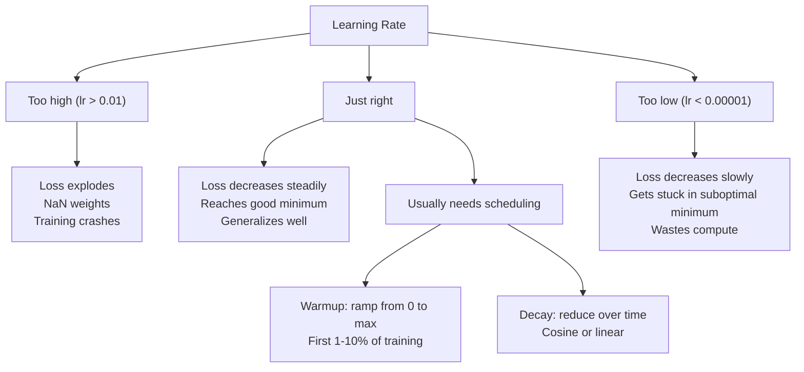
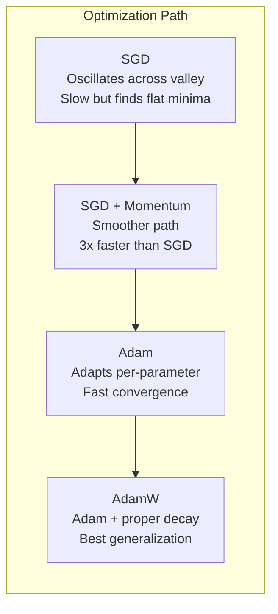
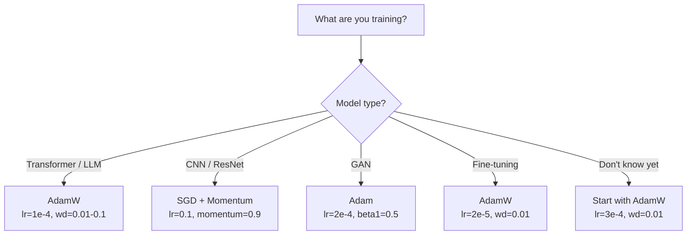

# Optimizadores

> Descenso gradual  te dice en qué dirección debes moverte. No indica ni mucho más lejos ni mucho más rápido.

**Type:** Build
**Languages:** Python
**Prerequisites:** Lesson 03.05 (Loss Functions)
**Time:** ~75 minutes

## El objetivo del aprendizaje

- Usando Python desde cero para implementar SGD 带 momentum de SGD  Adami y AdamW Optimizers
-  Explicar la corrección de sesgo de Adam  Cómo compensar entrenamiento temprano pasos de la etapa inicial a la de la estimación del momento de la iniciación
-  demostrando por qué en la misma tarea, AdamW con regularización de L2 de Adam  tiene una mejor capacidad de generalización
- Para transformadores, CNN, GAN y ajustes finos, optar por un optimizador y hiperparámetros de forma predeterminada

##  problemas

Ya has calculado el Gradiente. ¿Sabes que el peso de 4.721 debería disminuir 0.003 para reducir la pérdida? Pero ¿cuál es la unidad de 0.003? ¿Cómo se puede reducir? ¿Debemos mover el mismo volumen?

El descenso del gradiente de vainilla en cada paso a cada parámetro  aplica la misma tasa de aprendizaje: w = w - lr * gradiente― esto generará tres problemas, hacer entrenar la red neuronal en la práctica se vuelve muy doloroso―

Primer, la oscilación. La pérdida de paisaje es muy poco parecida a una placa plana. Es más parecida a una línea de valle larga y estrecha. El descenso gradual se dirige hacia el valle en dirección a través de la misma.

Segundo, para todos los parámetros, usar el mismo ritmo de aprendizaje es erróneo. Algunos pesos necesitan actualizarse considerablemente.

En el espacio alto, el paisaje de pérdida existe una gran parte de la región plana, en la que el Gradiente  casi cero. La SGD de vainilla se arrastra a la velocidad de Gradiente en estas regiones, mientras que esta velocidad en realidad se acerca a cero. El modelo parece estar en la zona plana, pero no está en la zona plana, y por otro lado, hay una dirección de descenso útil.

Adam  resolvió estos tres problemas.  El sistema de corrección de sesgo de los primeros pasos ofrece un único optimizador de los hiperparámetros por defecto para tratar el 80% de los problemas.  El programa de este curso se desarrollará desde cero, para que comprendas exactamente qué es y qué es lo que va a fallar en el otro 20% de los escenarios.

## 概念

### Descenso de gradiente estocástico (SGD)

Último Optimizador en mini-parcela, en el que se calcula el Gradiente, se hace en dirección opuesta.

```
w = w - lr * gradient
```

stochastic indica que usted utiliza datos de un conjunto de datos de manera automática (mini-batch) para estimar el gradiente, en lugar de usar un conjunto completo de datos. Este ruido es prácticamente útil.

La tasa de aprendizaje es única. La tasa de pérdida de tiempo es demasiado alta. La tasa de aprendizaje es muy baja. La tasa de aprendizaje depende de la arquitectura, los datos y el tamaño del lote, así como de la etapa de entrenamiento actual.

### El impulso

Las clases de pequeño rollo abajo de la montaña se usan demasiado, pero es preciso. No sólo se basa en el gradiente de progreso, sino que se mantiene una velocidad, para acumular los gradientes pasados.

```
m_t = beta * m_{t-1} + gradient
w = w - lr * m_t
```

Beta(normalmente por 0,9) controlar conservar mucho información histórica;; cuando beta = 0,9 时,momentum 大致等于最近10 个梯度的平均值;;1/ (1 - 0,9) = 10);;

Por qué esto puede reparar la oscilación: se acumulan gradientes de la misma dirección. Se obtienen contraindicaciones entre sí. En ese estrecho valle, la cantidad de gradientes cambia y se reduce en cada paso.

En el panorama de pérdidas en condiciones muy malas, el SGD solo puede requerir 10.000 pasos.

### RMSProp

La primera verdadera eficacia de la tasa de aprendizaje adaptativo por parámetro 方法── por Hinton 在 Coursera 课程中提出 (从未正式发表) ──

```
s_t = beta * s_{t-1} + (1 - beta) * gradient^2
w = w - lr * gradient / (sqrt(s_t) + epsilon)
```

S_t Seguir el promedio de funcionamiento de los gradientes cuadrados―continuar teniendo parámetros de Gradientes más grandes ‧excluidos por un número más grande ‧ menor tasa de aprendizaje efectiva―.

Esto resolvió todos los parámetros usando el mismo ritmo de aprendizaje. Uno ha conseguido un peso muy rápido, probablemente cerca del objetivo. Uno ha conseguido un peso muy pequeño, probablemente poco entrenamiento.

Epsilon (normalmente 1e-8) se encuentra en un parámetro que no se ha actualizado para evitar que se descompone en el cero.

### Adam: Momentum + RMSProp

Adam 结结了两种思想―― para cada parámetro 维护两个 promedios móviles exponenciales:

```
m_t = beta1 * m_{t-1} + (1 - beta1) * gradient        (first moment: mean)
v_t = beta2 * v_{t-1} + (1 - beta2) * gradient^2       (second moment: variance)
```

**Bias correction**Es la mayoría de las explicaciones saltarán los detalles clave. En el primer paso, m_1 = (1 - beta1) * gradiente. Cuando beta1 = 0.9 时, es 0.1 * gradiente.

```
m_hat = m_t / (1 - beta1^t)
v_hat = v_t / (1 - beta2^t)
```

Se trata de un punto de referencia de la corrección de la parte anterior de la pieza.

更新公式:

```
w = w - lr * m_hat / (sqrt(v_hat) + epsilon)
```

Adam 默认值:lr = 0.001,beta1 = 0.9,beta2 = 0.999,epsilon = 1e-8。 Estos valores de seguridad se aplican a 80% de los problemas。 Cuando no se aplican, primero se modifica lr。 luego se modifica beta2── casi siempre no se modifica beta1 o epsilon──

### AdamW: 正确处理 Descenso de peso

En el caso de la vanilla SGD, esto equivale a la pérdida de peso, cada paso del peso en el caso de la pérdida de lambda, esta relación de precio se pierde.

Loshchilov & Hutter's洞见是: Cuando pones L2 adicionado a la pérdida, entonces deja que Adam 处理 Gradient 时, adaptable learning rate también se reducirá a término de regularización.

AdamW                                                                                                                                                                                                                                                                                                                                                                                                                                                                                                                            

```
w = w - lr * m_hat / (sqrt(v_hat) + epsilon) - lr * lambda * w
```

El término de descenso de peso (lr * lambda * w) no será afectado por el factor adaptativo de Adam 缩放── cada parámetro obtiene la misma proporción de contracción──

Esto parece ser un pequeño detalle. No es. AdamW en casi todas las tareas de todo el mundo se encuentra en una mejor solución que la regularización de Adam + L2. Es el tipo de PyTorch utilizado para entrenar transformadores, modelos de difusión y la mayoría de las arquitecturas modernas.

### Taja de aprendizaje: Hiperparámetro más importante



Si sólo ajustes un hiperparámetro, entonces ajustes la tasa de aprendizaje. La tasa de aprendizaje cambia 10 veces, más importante es la decisión que tomas en cualquier arquitectura.

- SGD: lr = 0,01 a 0,1
- Adam/AdamW: lr = 1e-4 a 3e-4
- Modelos pre-entrenados para ajuste fino: lr = 1e-5 a 5e-5
- Calentamiento de la tasa de aprendizaje: en los primeros pasos del 1 al 10%

### Optimizador en relación con



### Cada Optimizer ¿Cuándo se gana?




```figure
optimizer-trajectory
```

## Construirlo

### 步骤 1: SGD de vainilla

```python
class SGD:
    def __init__(self, lr=0.01):
        self.lr = lr

    def step(self, params, grads):
        for i in range(len(params)):
            params[i] -= self.lr * grads[i]
```

### Paso 2: 带 Momentum de SGD

```python
class SGDMomentum:
    def __init__(self, lr=0.01, beta=0.9):
        self.lr = lr
        self.beta = beta
        self.velocities = None

    def step(self, params, grads):
        if self.velocities is None:
            self.velocities = [0.0] * len(params)
        for i in range(len(params)):
            self.velocities[i] = self.beta * self.velocities[i] + grads[i]
            params[i] -= self.lr * self.velocities[i]
```

### Paso 3: Adán

```python
import math

class Adam:
    def __init__(self, lr=0.001, beta1=0.9, beta2=0.999, epsilon=1e-8):
        self.lr = lr
        self.beta1 = beta1
        self.beta2 = beta2
        self.epsilon = epsilon
        self.m = None
        self.v = None
        self.t = 0

    def step(self, params, grads):
        if self.m is None:
            self.m = [0.0] * len(params)
            self.v = [0.0] * len(params)

        self.t += 1

        for i in range(len(params)):
            self.m[i] = self.beta1 * self.m[i] + (1 - self.beta1) * grads[i]
            self.v[i] = self.beta2 * self.v[i] + (1 - self.beta2) * grads[i] ** 2

            m_hat = self.m[i] / (1 - self.beta1 ** self.t)
            v_hat = self.v[i] / (1 - self.beta2 ** self.t)

            params[i] -= self.lr * m_hat / (math.sqrt(v_hat) + self.epsilon)
```

### 步骤 4: Adán

```python
class AdamW:
    def __init__(self, lr=0.001, beta1=0.9, beta2=0.999, epsilon=1e-8, weight_decay=0.01):
        self.lr = lr
        self.beta1 = beta1
        self.beta2 = beta2
        self.epsilon = epsilon
        self.weight_decay = weight_decay
        self.m = None
        self.v = None
        self.t = 0

    def step(self, params, grads):
        if self.m is None:
            self.m = [0.0] * len(params)
            self.v = [0.0] * len(params)

        self.t += 1

        for i in range(len(params)):
            self.m[i] = self.beta1 * self.m[i] + (1 - self.beta1) * grads[i]
            self.v[i] = self.beta2 * self.v[i] + (1 - self.beta2) * grads[i] ** 2

            m_hat = self.m[i] / (1 - self.beta1 ** self.t)
            v_hat = self.v[i] / (1 - self.beta2 ** self.t)

            params[i] -= self.lr * m_hat / (math.sqrt(v_hat) + self.epsilon)
            params[i] -= self.lr * self.weight_decay * params[i]
```

### Paso 5: Entrenamiento en comparación

En el conjunto de datos del círculo de la lección 05 , utiliza todos los cuatro optimizadores para entrenar con una red de dos niveles.

```python
import random

def sigmoid(x):
    x = max(-500, min(500, x))
    return 1.0 / (1.0 + math.exp(-x))

def make_circle_data(n=200, seed=42):
    random.seed(seed)
    data = []
    for _ in range(n):
        x = random.uniform(-2, 2)
        y = random.uniform(-2, 2)
        label = 1.0 if x * x + y * y < 1.5 else 0.0
        data.append(([x, y], label))
    return data


class OptimizerTestNetwork:
    def __init__(self, optimizer, hidden_size=8):
        random.seed(0)
        self.hidden_size = hidden_size
        self.optimizer = optimizer

        self.w1 = [[random.gauss(0, 0.5) for _ in range(2)] for _ in range(hidden_size)]
        self.b1 = [0.0] * hidden_size
        self.w2 = [random.gauss(0, 0.5) for _ in range(hidden_size)]
        self.b2 = 0.0

    def get_params(self):
        params = []
        for row in self.w1:
            params.extend(row)
        params.extend(self.b1)
        params.extend(self.w2)
        params.append(self.b2)
        return params

    def set_params(self, params):
        idx = 0
        for i in range(self.hidden_size):
            for j in range(2):
                self.w1[i][j] = params[idx]
                idx += 1
        for i in range(self.hidden_size):
            self.b1[i] = params[idx]
            idx += 1
        for i in range(self.hidden_size):
            self.w2[i] = params[idx]
            idx += 1
        self.b2 = params[idx]

    def forward(self, x):
        self.x = x
        self.z1 = []
        self.h = []
        for i in range(self.hidden_size):
            z = self.w1[i][0] * x[0] + self.w1[i][1] * x[1] + self.b1[i]
            self.z1.append(z)
            self.h.append(max(0.0, z))

        self.z2 = sum(self.w2[i] * self.h[i] for i in range(self.hidden_size)) + self.b2
        self.out = sigmoid(self.z2)
        return self.out

    def compute_grads(self, target):
        eps = 1e-15
        p = max(eps, min(1 - eps, self.out))
        d_loss = -(target / p) + (1 - target) / (1 - p)
        d_sigmoid = self.out * (1 - self.out)
        d_out = d_loss * d_sigmoid

        grads = [0.0] * (self.hidden_size * 2 + self.hidden_size + self.hidden_size + 1)
        idx = 0
        for i in range(self.hidden_size):
            d_relu = 1.0 if self.z1[i] > 0 else 0.0
            d_h = d_out * self.w2[i] * d_relu
            grads[idx] = d_h * self.x[0]
            grads[idx + 1] = d_h * self.x[1]
            idx += 2

        for i in range(self.hidden_size):
            d_relu = 1.0 if self.z1[i] > 0 else 0.0
            grads[idx] = d_out * self.w2[i] * d_relu
            idx += 1

        for i in range(self.hidden_size):
            grads[idx] = d_out * self.h[i]
            idx += 1

        grads[idx] = d_out
        return grads

    def train(self, data, epochs=300):
        losses = []
        for epoch in range(epochs):
            total_loss = 0.0
            correct = 0
            for x, y in data:
                pred = self.forward(x)
                grads = self.compute_grads(y)
                params = self.get_params()
                self.optimizer.step(params, grads)
                self.set_params(params)

                eps = 1e-15
                p = max(eps, min(1 - eps, pred))
                total_loss += -(y * math.log(p) + (1 - y) * math.log(1 - p))
                if (pred >= 0.5) == (y >= 0.5):
                    correct += 1
            avg_loss = total_loss / len(data)
            accuracy = correct / len(data) * 100
            losses.append((avg_loss, accuracy))
            if epoch % 75 == 0 or epoch == epochs - 1:
                print(f"    Epoch {epoch:3d}: loss={avg_loss:.4f}, accuracy={accuracy:.1f}%")
        return losses
```

## Usalo

PyTorch Optimizers 会 procesar grupos de parámetros, recortes de gradientes y programación de la tasa de aprendizaje:

```python
import torch
import torch.optim as optim

model = torch.nn.Sequential(
    torch.nn.Linear(784, 256),
    torch.nn.ReLU(),
    torch.nn.Linear(256, 10),
)

optimizer = optim.AdamW(model.parameters(), lr=3e-4, weight_decay=0.01)

scheduler = optim.lr_scheduler.CosineAnnealingLR(optimizer, T_max=100)

for epoch in range(100):
    optimizer.zero_grad()
    output = model(torch.randn(32, 784))
    loss = torch.nn.functional.cross_entropy(output, torch.randint(0, 10, (32,)))
    loss.backward()
    torch.nn.utils.clip_grad_norm_(model.parameters(), max_norm=1.0)
    optimizer.step()
    scheduler.step()
```

模式始终是:zero_grad、forward、loss、backward、(clip)、step、(schedule)。记住这个顺序──弄错它──例如在优化器.step() 之前调用调度器.step()) 是细微 bug 的常见来源──

Para las CNNs, muchos practicantes siguen prefiriendo usar SGD de impulso ⋅lr=0.1,momentum=0.9,weight_decay=1e-4),并搭配 step或 cosine schedule──SGD encontrará mínimos más planos, y esto suele tener una mejor generalización──Para los transformadores y LLMs, llevar calentamiento + cosine decay ⋅AdamW es una opción común.

##  entregarlo

本课产 出:
- `outputs/prompt-optimizer-selector.md`-- Un eje eje ejecutivo para la arquitectura arbitraria  seleccionar correctamente Optimizer y tasa de aprendizaje de la decisión de la solicitud

##  ejercicios

1. 实现 el impulso de Nesterov, en el que estás en la posición de la velocidad de observación  位置(w - lr * beta * v) en lugar de la posición actual de cálculo Gradiente。 en el conjunto de datos de círculos 上比较它与标准动力的收情况。

2.  Realizar un horario de calentamiento de la tasa de aprendizaje: en el entrenamiento del 10% de los pasos del medio desde 0 线性 ramp hasta max_lr, luego la descomposición del cosino hasta 0 ⋅ comparar Adam + calentamiento con Adam sin calentamiento ⋅ medir en el conjunto de datos de círculo arriba para alcanzar el 90% de precisión ⋅ necesita cuántas épocas⋅

3. Durante el entrenamiento de Adam, el ritmo de aprendizaje válido de cada parámetro fue seguido. ¿Todos los parámetros se actualizaron a la misma velocidad?

4. 实现 gradiente clipping(con la norma global clip) ・・・将max gradient norm 设置为 1.0。使用较高学习率(Adam的 lr=0.01)分别在有剪剪和无剪的情况下训练──统计 10 种子中,有多少次运行 会发散(Loss 变为 NaN) ・・・

5. En una red de grandes pesos, comparar a Adam y AdamW── se iniciará todos los pesos en [-5, 5] entre los valores de caducidad de los cuales se calcula que el peso es más grande que el valor normal ([[5]]).

## 关键术语: "El hombre es un hombre"

| Term | 人们通常怎么说 | 它实际意味着什么 |
|------|----------------|----------------------|
| Learning rate | “Step size” | Gradient update 上的标量乘数；训练中影响最大的单个 hyperparameter |
| SGD | “Basic gradient descent” | Stochastic Gradient Descent：通过减去 lr * gradient 来更新 weights，Gradient 在 mini-batch 上计算 |
| Momentum | “Rolling ball analogy” | 过去 Gradients 的 exponential moving average；削弱振荡，并加速一致方向 |
| RMSProp | “Adaptive learning rate” | 用近期 Gradients 的 running RMS 除以每个 parameter 的 Gradient；均衡 learning rates |
| Adam | “The default optimizer” | 将 momentum（first moment）和 RMSProp（second moment）结合起来，并对初始 steps 进行 bias correction |
| AdamW | “Adam done right” | 带 decoupled weight decay 的 Adam；直接对 weights 应用 regularization，而不是通过 Gradient |
| Bias correction | “Warmup for running averages” | 除以 (1 - beta^t)，用于补偿 Adam 的 moment estimates 的零初始化 |
| Weight decay | “Shrink the weights” | 每一步减去 weight 值的一部分；一种惩罚大 weights 的 regularizer |
| Learning rate schedule | “Changing lr over time” | 在训练期间调整 learning rate 的函数；warmup + cosine decay 是现代默认方案 |
| Gradient clipping | “Capping the gradient norm” | 当 Gradient Vector 的 norm 超过阈值时对其进行缩放；防止 exploding gradient updates |

## 延伸阅读

- Kingma & Ba, Adam: Un método para la optimización estocástica (2014) -- 原始 Adam paper,包含融合分析和偏差修正 推导
- Loshchilov & Hutter, Descoupled Weight Decay Regularization (2017) -- provaba la regularización de L2 en el Adán con la pérdida de peso 不等价,并提出 AdamW
- Smith, Tas de aprendizaje cíclico para la formación de redes neuronales (2017) --  introducir el test de rango LR y los horarios cíclicos, reducir la necesidad de ajustar la tasa de aprendizaje fija
- Ruder, Una visión general de los algoritmos de optimización de descenso gradual (2016) -- 关于所有优化器 变体的最佳单篇综述,比较清晰,直觉解释也明确
