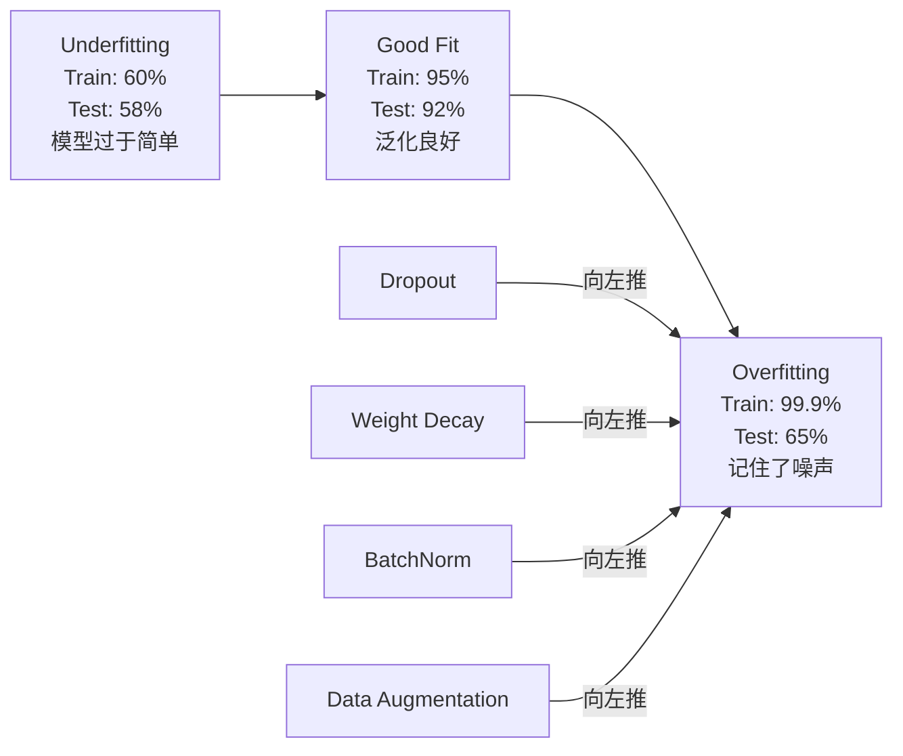
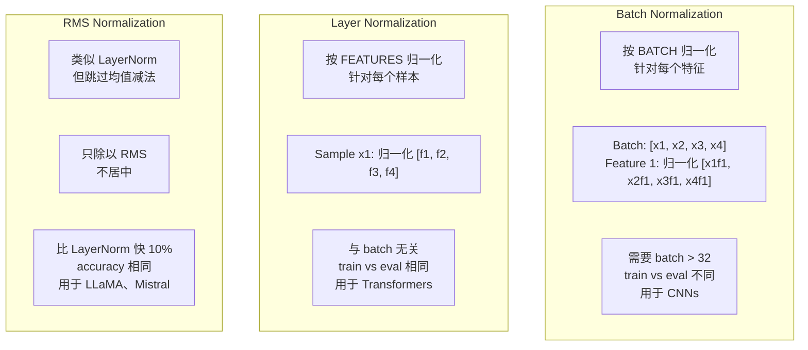
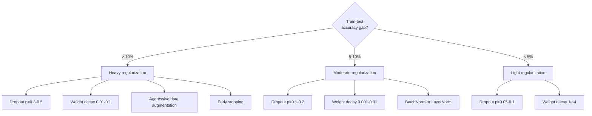

# Regularización

> Tu modelo alcanza el 99% en datos de entrenamiento, pero sólo el 60% en datos de prueba.

**Type:** Build
**Languages:** Python
**Prerequisites:** Lesson 03.06 (Optimizers)
**Time:** ~75 minutes

## El objetivo del aprendizaje
- Desde el 0 de la realización de la escala invertida de la caída de L2 de desintegración de peso, normalización de lote, normalización de capa y RMSNorm
- Mejura la brecha de precisión de los ensayos de tren,并 a través de regularización  experimento diagnóstico sobreajuste
-  Explicar por qué el Transformer utiliza LayerNorm y no BatchNorm, y por qué los LLM modernos prefieren RMSNorm
- De acuerdo con la gravedad del exceso de adaptación, la aplicación correcta de regularización 技术组合

##  problemas
Una red neuronal con suficientes parámetros puede recordar cualquier conjunto de datos. Esto no es una hipótesis. Zhang et al. (2017)                                                                                                                                                                                                                                                 

Este es el problema de sobreajuste, y el modelo es más grande, el problema es más grave. GPT-3 tiene 175 mil millones de parámetros.

 La diferencia entre el rendimiento de entrenamiento y el rendimiento de prueba es la brecha de sobreajuste🏼 Cada técnica de esta clase ataca esta brecha desde diferentes ángulos🏼 Droput  obliga a la red a no depender de ningún neurón🏼 Pese de peso  evita que ningún peso individual se vuelva demasiado grande🏼 Normalización de lote Plaza de pérdida de paisaje, que permite al optimizador encontrar un mínimo más plano🏼  Más generalizable🏼 Normalización de capa hacer lo mismo, pero puede hacer lo mismo en lugares donde la normalización  fracasa🏼 Lea de trabajo Lea de trabajo  Lea de duración 🏼 🏼 RMSNorm                                                                                                                                                                     

## 概念
### El espectro de los excesos

Cada modelo se encuentra en una posición de subajuste (más que simple, no capturable) a sobrajuste (más que complejo, hasta capturar ruido).



### Desistir

La regularización más simple 技术, pero con la mejor explicación  durante el entrenamiento, es probable que la salida de cada neurón sea de cero 

```
output = activation(z) * mask    where mask[i] ~ Bernoulli(1 - p)
```

Cuando p = 0,5 , cada paso adelante, la ciudad pondrá a la mitad de los nervios en cero. La red debe aprender redundante, ya que no puede predecir qué nervios pueden ser utilizados. Esto evitará la co-adaptación, es decir, que los nervios dependen de la existencia de otros nervios específicos.

Ensemble  explica: una tiene N 个神经元并使用中断的网络会创建2^N个可能的子网络 (conjunto de todas las neurales abiertas o cerradas) ⋅ usar dropout 训练近似于同时训练所有2^N个子网络, cada uno de ellos en diferentes mini-batches 上训练──测试时,你使用所有神经元(无中断),并将输出按 (1 - p)缩小,缩小,以匹配训练期间的期望值── esto equivale a un precio de 2^N 个子网络预测平均单个模型得到一个巨大的 ensembles──

实践中,缩放会在训练期间应用,而不是测试期间应用(invertido dropout):

```
During training:  output = activation(z) * mask / (1 - p)
During testing:   output = activation(z)   (no change needed)
```

Así que es mejor, porque el código de prueba no necesita saber que se ha abandonado.

默认比例:Transformer 使用 p = 0.1,MLPs 使用 p = 0.5,CNNs 使用 p = 0.2-0.3──更高的 dropup = 更强的规范化 = 更高的不适应风险──

### Descenso de peso (regularización L2)

Se añade a la pérdida:

```
total_loss = task_loss + (lambda / 2) * sum(w_i^2)
```

El Gradiente de regularización es lambda * w. Esto significa que en cada paso, cada peso se reducirá a cero en función de su tamaño en proporción a la reducción.

Por qué esto ayuda a la generalización: el modelo sobrealimentado suele tener un mayor peso, aumentará el ruido en los datos de entrenamiento. La descomposición del peso permite que el peso se mantenga menor, lo que limita la capacidad efectiva del modelo, y lo obliga a depender de las características de la estabilidad y generalización, en lugar de recordar detalles casuales.

El hiperparámetro lambda  control强度──valor típico:

- Transformer 上的 AdamW Uso 0.01
- Las CNNs de arriba SGD Utiliza 1e-4
- 严重 overfit 的模型使用 0.1

Como se habla en la lección 6: disminución del peso y regularización de la L2 en el SGD, pero en el Adam en el Adam en el Adam en el Training, siempre en el AdamW (desacoplado)

### Normalización de lote

En el transcurso de cada capa de salida a la siguiente, primero en mini-parcela de dimensiones para su integración.

对于某一层的一批激活:

```
mu = (1/B) * sum(x_i)           (batch mean)
sigma^2 = (1/B) * sum((x_i - mu)^2)   (batch variance)
x_hat = (x_i - mu) / sqrt(sigma^2 + eps)   (normalize)
y = gamma * x_hat + beta        (scale and shift)
```

Gamma y beta son parámetros que se pueden aprender, para que la red en el mejor de los casos pueda revocar esta normalización. Sin ellos, se obligará a que cada capa de salida se convierta en un valor medio, unitario en cuadrados, y esto no es necesariamente lo que la red quiere.

**Training vs inference split:**Durante el entrenamiento, mu 和 sigma de la mini-parcela actual. Durante el entrenamiento, tu uso acumula promedios de ejecución durante el entrenamiento.

BatchNorm ¿Por qué es válido todavía hay controversia? El artículo original afirma que reduce el "cambio de covariado interno" (con el cambio de actualización temprana, la distribución de entradas de niveles se produce) Santurkar et al. (2018)                                                                                                                                                                                                                                                                                                                                                                                                                                                                  

BatchNorm tiene una limitación fundamental: depende de las estadísticas de lote. Cuando el tamaño del lote es de 1 时, el promedio y la diferencia de tamaño no tienen significado. Cuando el lote es de muy pequeño tamaño, el ruido de la estadística es muy grande, daña el rendimiento. Esto es importante para la detección de objetos y el modelado de lenguaje.

### Normalización de las capas

En la dimensión de las características, en lugar de en la dimensión de los lotes.

```
mu = (1/D) * sum(x_j)           (feature mean)
sigma^2 = (1/D) * sum((x_j - mu)^2)   (feature variance)
x_hat = (x_j - mu) / sqrt(sigma^2 + eps)
y = gamma * x_hat + beta
```

D es la característica de la dimensión. Cada muestra se clasifica independientemente. No depende del tamaño del lote.

La capa de norma de transformador se aplicará en cada bloque de autoatención y cada bloque de alimentación avanzada después de la LN, o se aplicará antes de ellos.

### RMSNorm

La norma de reducción de la media de valor de trabajo fue presentada por Zhang & Sennrich (2019).

```
rms = sqrt((1/D) * sum(x_j^2))
y = gamma * x / rms
```

En este caso, no hay un valor promedio calculado, no hay un parámetro beta. El resultado de la observación es: La reducción de valor promedio de la capa normal es muy pequeña, pero tiene un costo calculado.

LLaMA、LLaMA 2、LLaMA 3、Mistral y la mayoría de las LLM modernas utilizan RMSNorm en lugar de LayerNorm── en la escala de miles de millones de parámetros y billones de Tokens, este 10% de ahorro es muy significativo──

### Comparación de normalización



###  Como regularización de aumento de datos

Esto no es una modificación del modelo, sino una modificación de datos.

- Imágenes: cosecha aleatoria, giro, rotación, nerviosismo de color, corte
- Texto: sustitución de sinónimos, traducción posterior, eliminación aleatoria
- Audio: extensión de tiempo, cambio de tono, adición de ruido

 efectos y regularización: aumenta el tamaño efectivo del conjunto de entrenamiento, haciendo que el modelo sea más difícil de recordar un patrón específico.  Uno sólo ve cada imagen en forma original de una vez.

### Pararse temprano

La normalización más simple es: cuando la pérdida de validación  empieza a subir cuando se detiene el entrenamiento. En la práctica, tú cada época sigue la pérdida de validación, conserva el mejor modelo, y sigue entrenando una ventana de "paciencia" (normalmente 5-20 épocas) ✿ Si la pérdida de validación en la ventana de paciencia dentro no mejora, deja de cargar el mejor modelo de conservación.

### Cuándo aplicar qué




```figure
l2-regularization
```

## Construirlo
### 步骤 1: Descanso (treno y modo Eval)

```python
import random
import math


class Dropout:
    def __init__(self, p=0.5):
        self.p = p
        self.training = True
        self.mask = None

    def forward(self, x):
        if not self.training:
            return list(x)
        self.mask = []
        output = []
        for val in x:
            if random.random() < self.p:
                self.mask.append(0)
                output.append(0.0)
            else:
                self.mask.append(1)
                output.append(val / (1 - self.p))
        return output

    def backward(self, grad_output):
        grads = []
        for g, m in zip(grad_output, self.mask):
            if m == 0:
                grads.append(0.0)
            else:
                grads.append(g / (1 - self.p))
        return grads
```

### Paso 2: Descenso de peso L2

```python
def l2_regularization(weights, lambda_reg):
    penalty = 0.0
    for w in weights:
        penalty += w * w
    return lambda_reg * 0.5 * penalty

def l2_gradient(weights, lambda_reg):
    return [lambda_reg * w for w in weights]
```

### Paso 3: Normalización del lote

```python
class BatchNorm:
    def __init__(self, num_features, momentum=0.1, eps=1e-5):
        self.gamma = [1.0] * num_features
        self.beta = [0.0] * num_features
        self.eps = eps
        self.momentum = momentum
        self.running_mean = [0.0] * num_features
        self.running_var = [1.0] * num_features
        self.training = True
        self.num_features = num_features

    def forward(self, batch):
        batch_size = len(batch)
        if self.training:
            mean = [0.0] * self.num_features
            for sample in batch:
                for j in range(self.num_features):
                    mean[j] += sample[j]
            mean = [m / batch_size for m in mean]

            var = [0.0] * self.num_features
            for sample in batch:
                for j in range(self.num_features):
                    var[j] += (sample[j] - mean[j]) ** 2
            var = [v / batch_size for v in var]

            for j in range(self.num_features):
                self.running_mean[j] = (1 - self.momentum) * self.running_mean[j] + self.momentum * mean[j]
                self.running_var[j] = (1 - self.momentum) * self.running_var[j] + self.momentum * var[j]
        else:
            mean = list(self.running_mean)
            var = list(self.running_var)

        self.x_hat = []
        output = []
        for sample in batch:
            normalized = []
            out_sample = []
            for j in range(self.num_features):
                x_h = (sample[j] - mean[j]) / math.sqrt(var[j] + self.eps)
                normalized.append(x_h)
                out_sample.append(self.gamma[j] * x_h + self.beta[j])
            self.x_hat.append(normalized)
            output.append(out_sample)
        return output
```

### Paso 4: Normalización de la capa

```python
class LayerNorm:
    def __init__(self, num_features, eps=1e-5):
        self.gamma = [1.0] * num_features
        self.beta = [0.0] * num_features
        self.eps = eps
        self.num_features = num_features

    def forward(self, x):
        mean = sum(x) / len(x)
        var = sum((xi - mean) ** 2 for xi in x) / len(x)

        self.x_hat = []
        output = []
        for j in range(self.num_features):
            x_h = (x[j] - mean) / math.sqrt(var + self.eps)
            self.x_hat.append(x_h)
            output.append(self.gamma[j] * x_h + self.beta[j])
        return output
```

### 步骤 5: RMSNorm

```python
class RMSNorm:
    def __init__(self, num_features, eps=1e-6):
        self.gamma = [1.0] * num_features
        self.eps = eps
        self.num_features = num_features

    def forward(self, x):
        rms = math.sqrt(sum(xi * xi for xi in x) / len(x) + self.eps)
        output = []
        for j in range(self.num_features):
            output.append(self.gamma[j] * x[j] / rms)
        return output
```

### Paso 6: Formación con y sin regularización

```python
def sigmoid(x):
    x = max(-500, min(500, x))
    return 1.0 / (1.0 + math.exp(-x))


def make_circle_data(n=200, seed=42):
    random.seed(seed)
    data = []
    for _ in range(n):
        x = random.uniform(-2, 2)
        y = random.uniform(-2, 2)
        label = 1.0 if x * x + y * y < 1.5 else 0.0
        data.append(([x, y], label))
    return data


class RegularizedNetwork:
    def __init__(self, hidden_size=16, lr=0.05, dropout_p=0.0, weight_decay=0.0):
        random.seed(0)
        self.hidden_size = hidden_size
        self.lr = lr
        self.dropout_p = dropout_p
        self.weight_decay = weight_decay
        self.dropout = Dropout(p=dropout_p) if dropout_p > 0 else None

        self.w1 = [[random.gauss(0, 0.5) for _ in range(2)] for _ in range(hidden_size)]
        self.b1 = [0.0] * hidden_size
        self.w2 = [random.gauss(0, 0.5) for _ in range(hidden_size)]
        self.b2 = 0.0

    def forward(self, x, training=True):
        self.x = x
        self.z1 = []
        self.h = []
        for i in range(self.hidden_size):
            z = self.w1[i][0] * x[0] + self.w1[i][1] * x[1] + self.b1[i]
            self.z1.append(z)
            self.h.append(max(0.0, z))

        if self.dropout and training:
            self.dropout.training = True
            self.h = self.dropout.forward(self.h)
        elif self.dropout:
            self.dropout.training = False
            self.h = self.dropout.forward(self.h)

        self.z2 = sum(self.w2[i] * self.h[i] for i in range(self.hidden_size)) + self.b2
        self.out = sigmoid(self.z2)
        return self.out

    def backward(self, target):
        eps = 1e-15
        p = max(eps, min(1 - eps, self.out))
        d_loss = -(target / p) + (1 - target) / (1 - p)
        d_sigmoid = self.out * (1 - self.out)
        d_out = d_loss * d_sigmoid

        for i in range(self.hidden_size):
            d_relu = 1.0 if self.z1[i] > 0 else 0.0
            d_h = d_out * self.w2[i] * d_relu
            self.w2[i] -= self.lr * (d_out * self.h[i] + self.weight_decay * self.w2[i])
            for j in range(2):
                self.w1[i][j] -= self.lr * (d_h * self.x[j] + self.weight_decay * self.w1[i][j])
            self.b1[i] -= self.lr * d_h
        self.b2 -= self.lr * d_out

    def evaluate(self, data):
        correct = 0
        total_loss = 0.0
        for x, y in data:
            pred = self.forward(x, training=False)
            eps = 1e-15
            p = max(eps, min(1 - eps, pred))
            total_loss += -(y * math.log(p) + (1 - y) * math.log(1 - p))
            if (pred >= 0.5) == (y >= 0.5):
                correct += 1
        return total_loss / len(data), correct / len(data) * 100

    def train_model(self, train_data, test_data, epochs=300):
        history = []
        for epoch in range(epochs):
            total_loss = 0.0
            correct = 0
            for x, y in train_data:
                pred = self.forward(x, training=True)
                self.backward(y)
                eps = 1e-15
                p = max(eps, min(1 - eps, pred))
                total_loss += -(y * math.log(p) + (1 - y) * math.log(1 - p))
                if (pred >= 0.5) == (y >= 0.5):
                    correct += 1
            train_loss = total_loss / len(train_data)
            train_acc = correct / len(train_data) * 100
            test_loss, test_acc = self.evaluate(test_data)
            history.append((train_loss, train_acc, test_loss, test_acc))
            if epoch % 75 == 0 or epoch == epochs - 1:
                gap = train_acc - test_acc
                print(f"    Epoch {epoch:3d}: train_acc={train_acc:.1f}%, test_acc={test_acc:.1f}%, gap={gap:.1f}%")
        return history
```

## Usalo
PyTorch en forma de módulo proporciona toda normalización y regularización:

```python
import torch
import torch.nn as nn

model = nn.Sequential(
    nn.Linear(784, 256),
    nn.BatchNorm1d(256),
    nn.ReLU(),
    nn.Dropout(0.3),
    nn.Linear(256, 128),
    nn.BatchNorm1d(128),
    nn.ReLU(),
    nn.Dropout(0.3),
    nn.Linear(128, 10),
)

model.train()
out_train = model(torch.randn(32, 784))

model.eval()
out_test = model(torch.randn(1, 784))
```

`model.train()`- ¿ Qué ?`model.eval()`切换非常关键──它会开开/关闭 dropout,并告诉BatchNorm  使用批量统计 还是运行统计──推理前忘记调用 `model.eval()`Es uno de los errores más comunes en el aprendizaje profundo. Su precisión de prueba se mueve a la vez, ya que el abandono está todavía en estado activo, mientras que BatchNorm sigue utilizando estadísticas de mini-batches.

对于Transformer,模式不同:

```python
class TransformerBlock(nn.Module):
    def __init__(self, d_model=512, nhead=8, dropout=0.1):
        super().__init__()
        self.attention = nn.MultiheadAttention(d_model, nhead, dropout=dropout)
        self.norm1 = nn.LayerNorm(d_model)
        self.ff = nn.Sequential(
            nn.Linear(d_model, d_model * 4),
            nn.GELU(),
            nn.Linear(d_model * 4, d_model),
            nn.Dropout(dropout),
        )
        self.norm2 = nn.LayerNorm(d_model)
        self.dropout = nn.Dropout(dropout)

    def forward(self, x):
        attended, _ = self.attention(x, x, x)
        x = self.norm1(x + self.dropout(attended))
        x = self.norm2(x + self.ff(x))
        return x
```

LayerNorm, en lugar de BatchNorm.

##  entregarlo
Encuentro de trabajo:
- `outputs/prompt-regularization-advisor.md`-- Una rápida, para diagnosticar sobrepetición y proponer una regularización correcta estrategia

##  ejercicios
1. Para realizar el descenso espacial de datos 2D: no dejes de abandonar un solo neurón, sino que dejes de abandonar todos los canales de características.

2. La lección 05 de la lección 05 de la lección 05 de la lección 05 de la lección 05 de la lección 05 de la lección 05 de la lección 05 de la lección 05 de la lección 05 de la lección 05 de la lección 05 de la lección 05 de la lección 05 de la lección 05 de la lección 05 de la lección 05 de la lección 05 de la lección 05 de la lección 05 de la lección 05 de la lección 05 de la lección 05 de la lección 05 de la lección 05 de la lección 05 de la lección 05 de la lección 05 de la lección 05 de la lección 05 de la lección 05 de la lección 05 de la lección 05 de la lección 05 de la lección 05 de la lección 05 de la lección 05 de la lección 05 de la lección 05 de la lección 05 de la lección 05 de la lección 05 de la lección 05 de la lección

3. En su red de conjunto de datos de círculos, entre la capa oculta y la activación, añadir una capa BatchNorm. En las tasas de aprendizaje 0.01、0.05 y 0.1 abajo, separarse de usar y no usar BatchNorm. Entrenamiento. BatchNorm. debería poder diseminarse en la red de vainilla.

4. 实现 detener temprano: cada época Seguir la pérdida de prueba, conservar el mejor peso, si la pérdida de prueba 连续 20 个时代 没有改善则停止――运行规律化网络 1000 个时代――报告哪个时代 拥有最佳测试精度,以及你节省了多少时代的计算――

5. En una red de 4 capas ((no sólo 2 niveles) comparar LayerNorm y RMSNorm.

## 关键术语: "El hombre es un hombre"
| Term | What people say | What it actually means |
|------|----------------|----------------------|
| Overfitting | "模型记住了数据" | 当模型的训练表现显著高于测试表现时，表示它学到了噪声而不是信号 |
| Regularization | "防止 overfitting" | 任何约束模型复杂度以改善泛化的技术：dropout、weight decay、normalization、augmentation |
| Dropout | "随机删除神经元" | 训练期间以概率 p 将随机神经元置零，迫使模型学习冗余表示；等价于训练一个 ensemble |
| Weight decay | "L2 penalty" | 每一步通过减去 lambda * w 将所有权重向零收缩；通过权重大小惩罚复杂度 |
| Batch normalization | "按 batch 归一化" | 训练期间使用 batch statistics、推理期间使用 running averages，在 batch 维度上对层输出进行归一化 |
| Layer normalization | "按样本归一化" | 在每个样本内部跨特征归一化；与 batch 无关，用于 batch size 可变的 Transformer |
| RMSNorm | "没有均值的 LayerNorm" | Root mean square normalization；从 LayerNorm 中去掉均值减法，以相同 accuracy 获得 10% 加速 |
| Early stopping | "在 overfit 前停止" | 当 validation loss 不再改善时停止训练；最简单的 regularizer，通常与其他方法一起使用 |
| Data augmentation | "用更少数据生成更多数据" | 变换训练输入（flip、crop、noise）以增加有效数据集大小，并迫使模型学习不变性 |
| Generalization gap | "Train-test split" | 训练表现与测试表现之间的差异；regularization 的目标是最小化这个 gap |

## 延伸阅读
- Srivastava et al., "Dropout: Una forma simple de prevenir que las redes neuronales se sobreajusten" (2014) -- 原始 dropout 论文,包含 ensemble 解释和大量实验
- Ioffe & Szegedy, "Batch Normalization: Accelerating Deep Network Training by Reducing Internal Covariate Shift" (2015) -- Introducción a BatchNorm  y su proceso de entrenamiento, es uno de los más citados en Deep Learning 论文
- Zhang & Sennrich, "Rot Mean Square Layer Normalization" (2019) --  demostró que RMSNorm 能以更少计算匹配 LayerNorm precisión; fue adoptado por LLaMA 和 Mistral 
- Zhang et al., "Comprender el aprendizaje profundo requiere repensar la generalización" (2017) -- 里程碑论文, mostrar la red neuronal puede recordar como se marca, desafió la perspectiva generalizada tradicional
