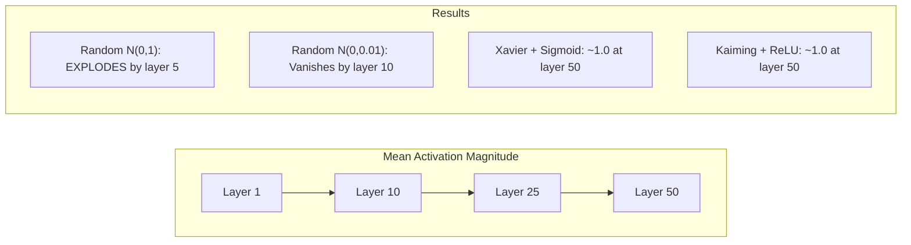
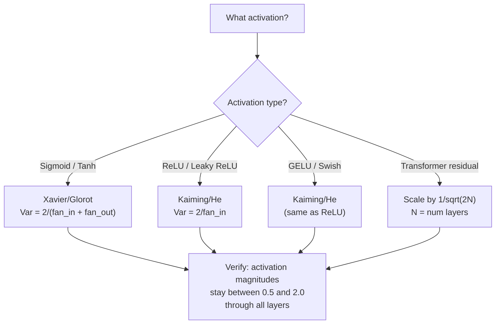

# Peso Iniciación y entrenamiento estabilidad

> Iniciación errónea, el entrenamiento no puede comenzar. Iniciación a 50 niveles también puede ser como entrenamiento plano de 3 niveles.

**Type:** Build
**Languages:** Python
**Prerequisites:** Lesson 03.04 (Activation Functions), Lesson 03.07 (Regularization)
**Time:** ~90 minutes

## El objetivo del aprendizaje
- 实现 cero、random、Xavier/Glorot 和 Kaiming/He inicialización 策略,并测量它们对50层中激活幅度的影响
- 推导为什么 Xavier init 使用 Var(w) = 2/(fan_in + fan_out), mientras que Kaiming 使用 Var(w) = 2/fan_in
- 演示零初始化的对称性 问题,并解释为什么仅靠随机尺度还不够
- 将正确的初始化 策略匹配到激活函数:sigmoid/tanh 使用Xavier,ReLU/GELU 使用Kaiming

##  problemas
Para empezar, todos los pesos se inician en cero. Cada neurona calcula la misma función, recibe el mismo gradiente y se actualiza de la misma manera. Después de 10.000 épocas, tu capa oculta de 512 neuronas sigue siendo sólo 512 copias de la misma neurona.

Las actividades se explotan en toda la red. Hasta la capa 10, el número de valores alcanza 1e15. Hasta la capa 20, se desbordan en infinito.

Desde la distribución normal estándar, el inicio aleatorio es válido en 3 niveles, hasta los 50 niveles, el signo se reduce a cero, o se explota hasta el infinito, dependiendo de la escala aleatoria, es menor o menor.

La inicialización de peso es la decisión más subestimada de Deep Learning. Arquitectura tendrá artículos. Los optimizadores tendrán blogs. La inicialización normalmente solo se realiza con una nota. Pero si aquí está mal, todo lo demás no importa.

## 概念
### El problema de la simetría

Cada neurona en una capa tiene la misma estructura: con pesas  multiplicando entradas, más sesgo, activación de aplicación. Si todos los pesos comienzan desde el mismo valor, cada neurona calcula la misma salida. Durante la retropropagación, cada neurona recibe el mismo gradiente. Durante el paso de actualización, cada neurona cambia la misma cantidad.

Te quedas atrapado. En la red hay cientos de parámetros, pero todos se mueven simultáneamente. Esto se llama simetría, y la inicialización aleatoria es un método violento para romperlo. Cada neurona comienza en una posición diferente en el espacio de peso, por lo que cada neurona aprende diferentes características.

Pero el azar no es suficiente. La escala de las relaciones sexuales decide si la red puede entrenar.

### La propagación de la variación a través de capas

考虑一个具有风扇_in 个输入的单个层:

```
z = w1*x1 + w2*x2 + ... + w_n*x_n
```

Si cada peso wi proviene de la variación de la distribución de Var(w), y cada entrada xi de la variación de Var(x), entonces la variación de salida de la variación de Var ((x):

```
Var(z) = fan_in * Var(w) * Var(x)
```

Si Var(w) = 1 且 fan_in = 512, entonces la variación de salida es la variación de entrada de 512 倍──经过 10 层:512^10 = 1.2e27──tu señal 已爆炸──

Si Var(w) = 0.001, entonces la variación de salida Cada nivel en 0.001 * 512 = 0.512 缩小──经过 10 层:0.512^10 = 0.00013──tu señal 已消失──

目標: seleccionar Var(w), hace que Var(z) = Var(x)。La magnitud del señal en los diferentes niveles permanezca constante─

### Inicialización de Xavier/Glorot

Glorot y Bengio (2010) 推导了适用于 sigmoid 和 tanh activaciones 的解──为了在前和后的通过 中都保持变异恒定:

```
Var(w) = 2 / (fan_in + fan_out)
```

实践中,pesos de la siguiente distribución 中采样:

```
w ~ Uniform(-limit, limit)  where limit = sqrt(6 / (fan_in + fan_out))
```

O bien:

```
w ~ Normal(0, sqrt(2 / (fan_in + fan_out)))
```

Esto es porque la sigmoide y tanh están cerca de cero, y las activaciones posteriores a la iniciación se encuentran en esta región.

### La inicialización de Kaiming/He

ReLU va a matar la mitad de las salidas (todas las negativas se convierten en cero) ⋅ efectivo fan_in ⋅ reducido, porque en promedio se mira la mitad de las entradas se coloca en cero. Xavier init ⋅ no considera esto - se subestimó la variación necesaria ⋅

He et al. (2015) 调整了公式:

```
Var(w) = 2 / fan_in
```

Pesos de la siguiente distribución en el modelo:

```
w ~ Normal(0, sqrt(2 / fan_in))
```

En el caso de las reacciones de la red de luz, el número 2 se utiliza para compensar la red de luz, la mitad de las reacciones se pondrán en cero.

### Iniciación del transformador

GPT-2 introdujo otro modelo. Las conexiones residuales pondrán la salida de cada sub- capa a su entrada:

```
x = x + sublayer(x)
```

Cada vez más se incrementa la variación. Para N 个 residual layers, la variación se incrementa en N 成比例.

Los parámetros de Llama 3 ((405B,126 capas) utilizan un esquema similar. Si no hay esta reducción, el flujo residual se encuentra en 126 capas.

```mermaid
flowchart TD
    subgraph "Zero Init"
        Z1["Layer 1<br/>All weights = 0"] --> Z2["Layer 2<br/>All neurons identical"]
        Z2 --> Z3["Layer 3<br/>Still identical"]
        Z3 --> ZR["Result: 1 effective neuron<br/>regardless of width"]
    end

    subgraph "Xavier Init"
        X1["Layer 1<br/>Var = 2/(fan_in+fan_out)"] --> X2["Layer 2<br/>Signal stable"]
        X2 --> X3["Layer 50<br/>Signal stable"]
        X3 --> XR["Result: Trains with<br/>sigmoid/tanh"]
    end

    subgraph "Kaiming Init"
        K1["Layer 1<br/>Var = 2/fan_in"] --> K2["Layer 2<br/>Signal stable"]
        K2 --> K3["Layer 50<br/>Signal stable"]
        K3 --> KR["Result: Trains with<br/>ReLU/GELU"]
    end
```



### Praver 50 niveles de Magnitud de activación



### Elegir el corazón correcto




```figure
weight-init-variance
```

## Construirlo
### Paso 1: Estrategias de inicialización

Iniciación de la matriz de peso de cuatro formas. Cada forma de regresar a una lista de listas. Una matriz 2D, de la cual hay fan_in 列 y fan_out 行。

```python
import math
import random


def zero_init(fan_in, fan_out):
    return [[0.0 for _ in range(fan_in)] for _ in range(fan_out)]


def random_init(fan_in, fan_out, scale=1.0):
    return [[random.gauss(0, scale) for _ in range(fan_in)] for _ in range(fan_out)]


def xavier_init(fan_in, fan_out):
    std = math.sqrt(2.0 / (fan_in + fan_out))
    return [[random.gauss(0, std) for _ in range(fan_in)] for _ in range(fan_out)]


def kaiming_init(fan_in, fan_out):
    std = math.sqrt(2.0 / fan_in)
    return [[random.gauss(0, std) for _ in range(fan_in)] for _ in range(fan_out)]
```

### 步骤 2: Funciones de activación

Necesitamos sigmoid, tanh y ReLU, para poder realizar pruebas con cada estrategia inicial y su activación anticipada.

```python
def sigmoid(x):
    x = max(-500, min(500, x))
    return 1.0 / (1.0 + math.exp(-x))


def tanh_act(x):
    return math.tanh(x)


def relu(x):
    return max(0.0, x)
```

### Paso 3: Pasar hacia adelante a través de 50 capas

让随机数据 通过一个深度网络,并测量每层的平均激活大小──

```python
def forward_deep(init_fn, activation_fn, n_layers=50, width=64, n_samples=100):
    random.seed(42)
    layer_magnitudes = []

    inputs = [[random.gauss(0, 1) for _ in range(width)] for _ in range(n_samples)]

    for layer_idx in range(n_layers):
        weights = init_fn(width, width)
        biases = [0.0] * width

        new_inputs = []
        for sample in inputs:
            output = []
            for neuron_idx in range(width):
                z = sum(weights[neuron_idx][j] * sample[j] for j in range(width)) + biases[neuron_idx]
                output.append(activation_fn(z))
            new_inputs.append(output)
        inputs = new_inputs

        magnitudes = []
        for sample in inputs:
            magnitudes.append(sum(abs(v) for v in sample) / width)
        mean_mag = sum(magnitudes) / len(magnitudes)
        layer_magnitudes.append(mean_mag)

    return layer_magnitudes
```

### Paso 4: El experimento

运行所有组合:zero init、random N(0,1)、random N(0,0.01)、Xavier con sigmoid、Xavier con tanh、Kaiming con ReLU──打印关键层的大小──

```python
def run_experiment():
    configs = [
        ("Zero init + Sigmoid", lambda fi, fo: zero_init(fi, fo), sigmoid),
        ("Random N(0,1) + ReLU", lambda fi, fo: random_init(fi, fo, 1.0), relu),
        ("Random N(0,0.01) + ReLU", lambda fi, fo: random_init(fi, fo, 0.01), relu),
        ("Xavier + Sigmoid", xavier_init, sigmoid),
        ("Xavier + Tanh", xavier_init, tanh_act),
        ("Kaiming + ReLU", kaiming_init, relu),
    ]

    print(f"{'Strategy':<30} {'L1':>10} {'L5':>10} {'L10':>10} {'L25':>10} {'L50':>10}")
    print("-" * 80)

    for name, init_fn, act_fn in configs:
        mags = forward_deep(init_fn, act_fn)
        row = f"{name:<30}"
        for idx in [0, 4, 9, 24, 49]:
            val = mags[idx]
            if val > 1e6:
                row += f" {'EXPLODED':>10}"
            elif val < 1e-6:
                row += f" {'VANISHED':>10}"
            else:
                row += f" {val:>10.4f}"
        print(row)
```

### Paso 5: demostración de simetría

 mostrar que el principio cero producirá neuronas completamente iguales 

```python
def symmetry_demo():
    random.seed(42)
    weights = zero_init(2, 4)
    biases = [0.0] * 4

    inputs = [0.5, -0.3]
    outputs = []
    for neuron_idx in range(4):
        z = sum(weights[neuron_idx][j] * inputs[j] for j in range(2)) + biases[neuron_idx]
        outputs.append(sigmoid(z))

    print("\nSymmetry Demo (4 neurons, zero init):")
    for i, out in enumerate(outputs):
        print(f"  Neuron {i}: output = {out:.6f}")
    all_same = all(abs(outputs[i] - outputs[0]) < 1e-10 for i in range(len(outputs)))
    print(f"  All identical: {all_same}")
    print(f"  Effective parameters: 1 (not {len(weights) * len(weights[0])})")
```

### Paso 6: Informe de magnitud capa por capa

打印 activación magnitudes en 50 niveles de la forma de la imagen 条形图.

```python
def magnitude_report(name, magnitudes):
    print(f"\n{name}:")
    for i, mag in enumerate(magnitudes):
        if i % 5 == 0 or i == len(magnitudes) - 1:
            if mag > 1e6:
                bar = "X" * 50 + " EXPLODED"
            elif mag < 1e-6:
                bar = "." + " VANISHED"
            else:
                bar_len = min(50, max(1, int(mag * 10)))
                bar = "#" * bar_len
            print(f"  Layer {i+1:3d}: {bar} ({mag:.6f})")
```

## Usalo
PyTorch ofrecerá estas funciones como función de configuración:

```python
import torch
import torch.nn as nn

layer = nn.Linear(512, 256)

nn.init.xavier_uniform_(layer.weight)
nn.init.xavier_normal_(layer.weight)

nn.init.kaiming_uniform_(layer.weight, nonlinearity='relu')
nn.init.kaiming_normal_(layer.weight, nonlinearity='relu')

nn.init.zeros_(layer.bias)
```

Cuando tú调用 `nn.Linear(512, 256)`时,PyTorch 默认使用Kaiming uniform initialization──这就是为什么大多数简单网络 只是工作--PyTorch 已经做出正确选择──但当你构建自定义架构时,或深入到超过20层时,你需要理解正在发生什么,并且可能需要覆盖默认设置──

Para los transformadores, los modelos de HuggingFace suelen estar en ellos.`_init_weights`方法中处理初始化── GPT-2 的实现会按1/sqrt(N) 缩放残投影── Si usted comienza a construir transformador desde zero, necesita añadirse este punto──

##  entregarlo
Encuentro de trabajo:
- `outputs/prompt-init-strategy.md`-- Una inicialización de peso para el diagnóstico 问题并推正确策略的提示

##  ejercicios
1. 添加 LeCun inicialización(Var = 1/fan_in,为 SELU activación 设计) ・运行50 niveles experimento, usando LeCun init + tanh,并与Xavier + tanh对比──

2. 实现 GPT-2 escala residual: 之前, se ejecutará en 50 niveles en caso de que se incluya el flujo residual  antes de que se incluya la producción de cada una de las capas  multiplicada por 1/sqrt  2 * N) ⋅分别在有规模和无规模的情况下, medir la magnitud residual 增多多快──

3. Crear una función de "comprobar la salud de la iniciación", dimensiones de la capa de la red de recepción y tipo de activación, luego proponer la inicialización correcta, y en el momento en que se inicia causará problemas y dará una advertencia.

4. Utiliza fan_in = 16 与 fan_in = 1024 运行实验──Xavier 和 Kaiming 会适配 fan_in,但随机 init 不会──展示随着层变大,工作和休之间的差距如何扩大──

5. 实现 inicialización ortogonal(generar una matriz aleatoria, calcular su SVD, utilizar la matriz ortogonal U) ―― con Kaiming de 50 niveles de redes ReLU 进行比较──

## 关键术语: "El hombre es un hombre"
| Term | What people say | What it actually means |
|------|----------------|----------------------|
| Weight initialization | “随机设置 starting weights” | 选择 initial weight values 的策略，它决定一个 network 是否有可能训练 |
| Symmetry breaking | “让 neurons 变得不同” | 使用 random initialization 确保 neurons 学习不同 features，而不是计算完全相同的函数 |
| Fan-in | “一个 neuron 的 inputs 数量” | incoming connections 的数量，它决定 input variance 如何在 weighted sum 中累积 |
| Fan-out | “一个 neuron 的 outputs 数量” | outgoing connections 的数量，与在 Backpropagation 期间维持 Gradient variance 有关 |
| Xavier/Glorot init | “sigmoid initialization” | Var(w) = 2/(fan_in + fan_out)，旨在通过 sigmoid 和 tanh activations 保持 variance |
| Kaiming/He init | “ReLU initialization” | Var(w) = 2/fan_in，考虑了 ReLU 会将一半 activations 置零 |
| Variance propagation | “signals 如何在 layers 中增长或缩小” | 基于 weight scale，逐层分析 activation variance 如何变化的数学分析 |
| Residual scaling | “GPT-2 的 init trick” | 将 residual connection weights 按 1/sqrt(2N) 缩放，以防止 variance 在 N 个 transformer layers 中增长 |
| Dead network | “什么都训练不了” | 一个因 initialization 不佳而导致所有 Gradients 为 zero 或所有 activations 饱和的 network |
| Exploding activations | “数值走向 infinity” | 当 weight variance 过高时，activation magnitudes 会在 layers 中指数级增长 |

## 延伸阅读
- Glorot & Bengio, "Entender la dificultad de entrenar redes neuronales de entrada profunda" (2010) -- 原始 Xavier inicialization 论文,包含变异分析
- He et al., "Enmergando profundamente en los rectificadores" (2015) -- introdujo la inicialización de Kaiming para las redes de ReLU
- Radford et al., "Los modelos de lenguaje son aprendices multitarea no supervisados" (2019) -- GPT-2 论文, entre ellos contiene inicialización de escala residual
- Mishkin & Matas, "Todo lo que necesitas es una buena iniciación" (2016) -- inicialización de la unidad secuencial de la unidad, un método de experiencia alternativa
