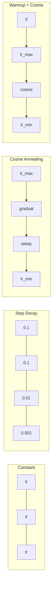
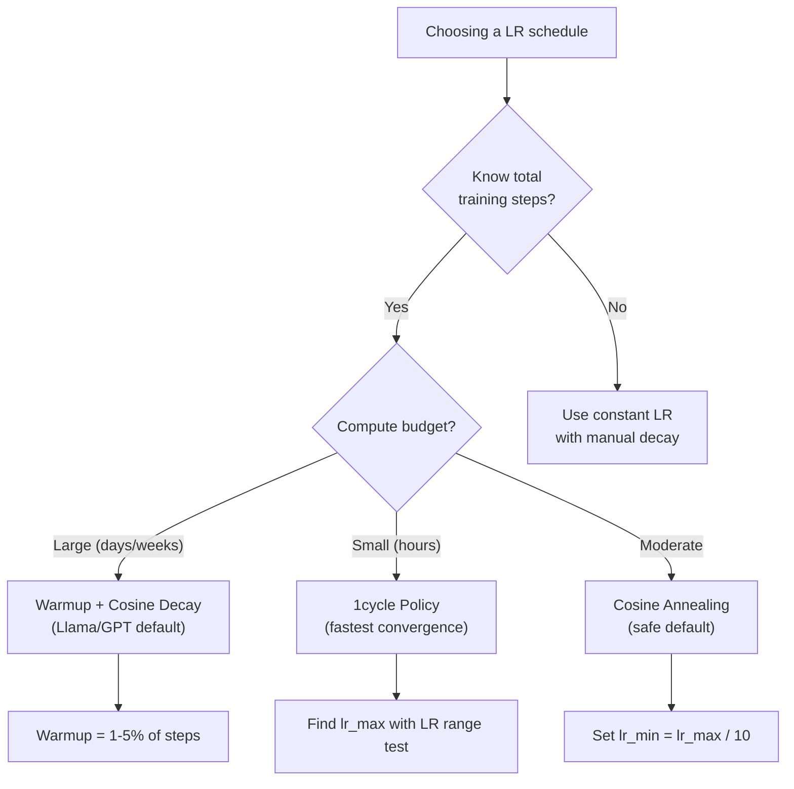
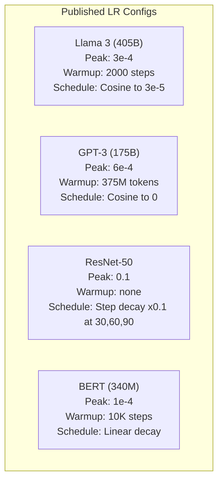

# Los horarios de aprendizaje y el calentamiento

> La tasa de aprendizaje es el único hiperparámetro más importante. No es la arquitectura. No es el tamaño del conjunto de datos.

**类型：**Construcción
**语言：**Python
**先修：**Lección 03.06 (Optimizaciones), Lección 03.08 (Peso de inicialización)
**时间：**90 minutos

## El objetivo del aprendizaje

- Desde el 0 de la realización de la constante, la degradación en pasos, el anelamiento de los cosinos, el calentamiento + cosinos y los horarios de la tasa de aprendizaje de un ciclo
- 演示学习率 选择的三种失败模式:divergencia (过高) 停滞 (过低) y oscilación (没有衰退)
- Explica por qué el optimizador basado en Adam necesita calentamiento y cómo estabilizar el entrenamiento temprano
- En comparación con las cinco tareas de la misma velocidad de convergencia del calendario, y para un presupuesto de formación determinado

##  problemas

Colocar la tasa de aprendizaje en 0.1―la formación divergirá--Perdida en 3 pasos saltando a infinidad―lo colocará en 0.0001―la formación se ralentizará a la escala--100 épocas , el modelo  casi se quedará en estado de casualidad―lo colocará en 0.01―la formación en las 50 épocas anteriores es efectiva, después de eso la pérdida se encuentra en un mínimo que siempre llega a ser imposible   oscila cerca, porque los pasos son demasiado grandes―

La tasa de aprendizaje óptima no es constante. Varia durante el proceso de entrenamiento. En la primera fase, se espera que el tiempo de entrenamiento sea más rápido.

过去三年发表的每个主流模型都使用了学习率时间表――Llama 3 使用峰值 lr=3e-4,2000 个升温步骤,并通过了宇宙衰退 衰减到3e-5――GPT-3 使用 lr=6e-4,并进行升温了375万代币――这些不是随意选择――它们是花费数百万美元的大规模超参数扫扫的结果――

Usted necesita entender los horarios, porque el valor predeterminado no siempre se aplica a su problema. Cuando usted ajusta a la perfección un modelo pre-entrenado, el horario correcto no es como el de entrenamiento cero. Cuando usted aumenta el tamaño del lote, el período de calentamiento también necesita cambiar. Cuando el entrenamiento en el paso 10.000 se desploma, usted necesita saber que es el horario.

## 概念

### Rate de aprendizaje constante

El método más simple es... escoger un número, usarlo cada paso.

```
lr(t) = lr_0
```

很少是最优的──它要么对训练末期来说太高 (((在最小的 附近的振荡),要么对训练初步来说太低 ((在小步上浪费计算) ──对小模型和调试来说也可以──对任何需要训练超过一小时的任务都是糟糕的选择──

### Paso de descomposición

Desde ResNet 时代的老派方法── en épocas fijas 处按某因子 (generalmente 10x) disminuir la tasa de aprendizaje──

```
lr(t) = lr_0 * gamma^(floor(epoch / step_size))
```

Entre ellos gamma = 0,1 y step_size = 30 indican:lr Cada 30 épocas  disminuir 10x──ResNet-50 就用了这个 --lr=0.1, en épocas 30、60 和 90 时降低 10x──

问题是:最优衰变 点取决于数据集和结构――转到另一个问题,就需要重新调调什么时候降低――转变也很突然--当速度突然变时,Loss可能会峰――

### Coseña de la piel

Según la curva cosínica, desde el máximo de aprendizaje tasa de desintegración plana al mínimo valor:

```
lr(t) = lr_min + 0.5 * (lr_max - lr_min) * (1 + cos(pi * t / T))
```

Entre ellos t es el paso actual, T es el número de pasos.

Cuando t=0 时,cosin 项为1,所以 lr = lr_max──当 t=T 时,cosin 项为 -1,所以 lr = lr_min──decay 一开始很平缓,中间加速,接近末尾时再次变得平缓──

Es la opción de la mayoría de los entrenamientos modernos. Además de lr_max y lr_min, no hay necesidad de ajustar los hiperparámetros.

### ¿Por qué empezar desde pequeño?

Adam 和其他适应优化器 会维护 Gradient mean 和 variance 运行估计――在步骤0中, estas estimaciones fueron iniciadas en zERO―― las primeras actualizaciones de Gradient 基于很差的统计量――

El calentamiento puede reparar este problema. Primero, desde una tasa de aprendizaje muy pequeña, se inicia, normalmente, en lr_max / warmup_steps, incluso para zero, y luego, en los primeros N pasos, se incrementa linealmente hasta lr_max.

```
lr(t) = lr_max * (t / warmup_steps)     for t < warmup_steps
```

典型暖化:总训练步骤的 1-5%──Llama 3 训练了约1.8万亿代币,并暖化了2000步骤──GPT-3 在375 millones de代币上进行了暖化──

### Calentamiento lineal + desintegración cosina

Primero, una rampa lineal, luego, una decadencia cosínica.

```
if t < warmup_steps:
    lr(t) = lr_max * (t / warmup_steps)
else:
    progress = (t - warmup_steps) / (total_steps - warmup_steps)
    lr(t) = lr_min + 0.5 * (lr_max - lr_min) * (1 + cos(pi * progress))
```

Éste es el método utilizado por la mayoría de los transformadores modernos.

### Política de ciclo

Descubrimiento de Leslie Smith: en la primera mitad del entrenamiento, aumentar la tasa de aprendizaje de la baja a la alta, y en la segunda mitad bajar la tasa de aprendizaje.

理論是: alta tasa de aprendizaje 会通過向優化軌跡 中加入噪聲來起起的正常化作用──模型 在 ramp-up 阶段會探索更多 損失風景,从而找到更好的盆栽──然后 ramp-down 阶段在找到最佳盆栽進行精煉──

```
Phase 1 (0 to T/2):    lr ramps from lr_max/25 to lr_max
Phase 2 (T/2 to T):    lr ramps from lr_max to lr_max/10000
```

En el presupuesto de computación fija, el ciclo de seguimiento es más rápido que el de anulación cosínica.

### Plan de trabajo



###                                                                                                                                                                                                                                                                                                                                                                                                                                                                                                                              



### 已发表的模型 中的真实数值 已发表的模型 中的真实数值 中的真实数值 中的真实数值 中的真实数值 中的真实数值 中的真实数值 中的真实数值 中的真实数值 中的真实数值 中的真实数值 中的真实数值 中的真实数值 中的真实数值 中的真实数值 中的真实数值 中的真实数值 中的真实数值 中的真实数值 中的真实数值 中的真实数值 中的真实数值 中的真实数值 中的真实数值 中的真实数值 中的真实数值 中的真实数值




```figure
lr-schedule
```

## Construirlo

### 步骤 1:Trabajo de la agenda

Cada función 接收当前步骤,并返回该步的学习率──

```python
import math


def constant_schedule(step, lr=0.01, **kwargs):
    return lr


def step_decay_schedule(step, lr=0.1, step_size=100, gamma=0.1, **kwargs):
    return lr * (gamma ** (step // step_size))


def cosine_schedule(step, lr=0.01, total_steps=1000, lr_min=1e-5, **kwargs):
    if step >= total_steps:
        return lr_min
    return lr_min + 0.5 * (lr - lr_min) * (1 + math.cos(math.pi * step / total_steps))


def warmup_cosine_schedule(step, lr=0.01, total_steps=1000, warmup_steps=100, lr_min=1e-5, **kwargs):
    if total_steps <= warmup_steps:
        return lr * (step / max(warmup_steps, 1))
    if step < warmup_steps:
        return lr * step / warmup_steps
    progress = (step - warmup_steps) / (total_steps - warmup_steps)
    return lr_min + 0.5 * (lr - lr_min) * (1 + math.cos(math.pi * progress))


def one_cycle_schedule(step, lr=0.01, total_steps=1000, **kwargs):
    mid = max(total_steps // 2, 1)
    if step < mid:
        return (lr / 25) + (lr - lr / 25) * step / mid
    else:
        progress = (step - mid) / max(total_steps - mid, 1)
        return lr * (1 - progress) + (lr / 10000) * progress
```

### Paso 2: Visualización de todos los horarios

Imprimir una trama basada en el texto, mostrando cada programa en el proceso de entrenamiento.

```python
def visualize_schedule(name, schedule_fn, total_steps=500, **kwargs):
    steps = list(range(0, total_steps, total_steps // 20))
    if total_steps - 1 not in steps:
        steps.append(total_steps - 1)

    lrs = [schedule_fn(s, total_steps=total_steps, **kwargs) for s in steps]
    max_lr = max(lrs) if max(lrs) > 0 else 1.0

    print(f"\n{name}:")
    for s, lr_val in zip(steps, lrs):
        bar_len = int(lr_val / max_lr * 40)
        bar = "#" * bar_len
        print(f"  Step {s:4d}: lr={lr_val:.6f} {bar}")
```

### Paso 3: Red de entrenamiento

En el conjunto de datos del círculo, usamos una red simple de dos capas, igual que las anteriores, pero esta vez cambiamos el horario.

```python
import random


def sigmoid(x):
    x = max(-500, min(500, x))
    return 1.0 / (1.0 + math.exp(-x))


def relu(x):
    return max(0.0, x)


def relu_deriv(x):
    return 1.0 if x > 0 else 0.0


def make_circle_data(n=200, seed=42):
    random.seed(seed)
    data = []
    for _ in range(n):
        x = random.uniform(-2, 2)
        y = random.uniform(-2, 2)
        label = 1.0 if x * x + y * y < 1.5 else 0.0
        data.append(([x, y], label))
    return data


def train_with_schedule(schedule_fn, schedule_name, data, epochs=300, base_lr=0.05, **kwargs):
    random.seed(0)
    hidden_size = 8
    total_steps = epochs * len(data)

    std = math.sqrt(2.0 / 2)
    w1 = [[random.gauss(0, std) for _ in range(2)] for _ in range(hidden_size)]
    b1 = [0.0] * hidden_size
    w2 = [random.gauss(0, std) for _ in range(hidden_size)]
    b2 = 0.0

    step = 0
    epoch_losses = []

    for epoch in range(epochs):
        total_loss = 0
        correct = 0

        for x, target in data:
            lr = schedule_fn(step, lr=base_lr, total_steps=total_steps, **kwargs)

            z1 = []
            h = []
            for i in range(hidden_size):
                z = w1[i][0] * x[0] + w1[i][1] * x[1] + b1[i]
                z1.append(z)
                h.append(relu(z))

            z2 = sum(w2[i] * h[i] for i in range(hidden_size)) + b2
            out = sigmoid(z2)

            error = out - target
            d_out = error * out * (1 - out)

            for i in range(hidden_size):
                d_h = d_out * w2[i] * relu_deriv(z1[i])
                w2[i] -= lr * d_out * h[i]
                for j in range(2):
                    w1[i][j] -= lr * d_h * x[j]
                b1[i] -= lr * d_h
            b2 -= lr * d_out

            total_loss += (out - target) ** 2
            if (out >= 0.5) == (target >= 0.5):
                correct += 1
            step += 1

        avg_loss = total_loss / len(data)
        accuracy = correct / len(data) * 100
        epoch_losses.append(avg_loss)

    return epoch_losses
```

### Paso 4: Comparación de todos los horarios

Utilice cada programa  entrenar con una misma red,并比较最终 Loss 和 convergencia 行为──

```python
def compare_schedules(data):
    configs = [
        ("Constant", constant_schedule, {}),
        ("Step Decay", step_decay_schedule, {"step_size": 15000, "gamma": 0.1}),
        ("Cosine", cosine_schedule, {"lr_min": 1e-5}),
        ("Warmup+Cosine", warmup_cosine_schedule, {"warmup_steps": 3000, "lr_min": 1e-5}),
        ("1cycle", one_cycle_schedule, {}),
    ]

    print(f"\n{'Schedule':<20} {'Start Loss':>12} {'Mid Loss':>12} {'End Loss':>12} {'Best Loss':>12}")
    print("-" * 70)

    for name, schedule_fn, extra_kwargs in configs:
        losses = train_with_schedule(schedule_fn, name, data, epochs=300, base_lr=0.05, **extra_kwargs)
        mid_idx = len(losses) // 2
        best = min(losses)
        print(f"{name:<20} {losses[0]:>12.6f} {losses[mid_idx]:>12.6f} {losses[-1]:>12.6f} {best:>12.6f}")
```

### Paso 5: LR 过高 vs 过低

演示三种失败模式: 过高(divergencia) 过低(爬行) y刚刚好──

```python
def lr_sensitivity(data):
    learning_rates = [1.0, 0.1, 0.01, 0.001, 0.0001]

    print("\nLR Sensitivity (constant schedule, 100 epochs):")
    print(f"  {'LR':>10} {'Start Loss':>12} {'End Loss':>12} {'Status':>15}")
    print("  " + "-" * 52)

    for lr in learning_rates:
        losses = train_with_schedule(constant_schedule, f"lr={lr}", data, epochs=100, base_lr=lr)
        start = losses[0]
        end = losses[-1]

        if end > start or math.isnan(end) or end > 1.0:
            status = "DIVERGED"
        elif end > start * 0.9:
            status = "BARELY MOVED"
        elif end < 0.15:
            status = "CONVERGED"
        else:
            status = "LEARNING"

        end_str = f"{end:.6f}" if not math.isnan(end) else "NaN"
        print(f"  {lr:>10.4f} {start:>12.6f} {end_str:>12} {status:>15}")
```

## Usalo

PyTorch está en`torch.optim.lr_scheduler`Entre ellos se ofrecen los horarios:

```python
import torch
import torch.optim as optim
from torch.optim.lr_scheduler import CosineAnnealingLR, OneCycleLR, StepLR

model = nn.Sequential(nn.Linear(10, 64), nn.ReLU(), nn.Linear(64, 1))
optimizer = optim.Adam(model.parameters(), lr=3e-4)

scheduler = CosineAnnealingLR(optimizer, T_max=1000, eta_min=1e-5)

for step in range(1000):
    loss = train_step(model, optimizer)
    scheduler.step()
```

Para calentar + cosin, usar el programación lambda, o usar HuggingFace `get_cosine_schedule_with_warmup`¿Qué es esto ?

```python
from transformers import get_cosine_schedule_with_warmup

scheduler = get_cosine_schedule_with_warmup(
    optimizer,
    num_warmup_steps=2000,
    num_training_steps=100000,
)
```

La función HuggingFace es la mayoría de los guiones de ajuste fino de Llama y GPT.

##  entregarlo

Encuentro de trabajo:
- `outputs/prompt-lr-schedule-advisor.md`-- Un prompt, para usar en función de su entrenamiento de configuración de recomendación adecuado de la tasa de aprendizaje horario y hiperparámetros

##  ejercicios

1. 实现 decadencia exponencial:lr(t) = lr_0 * gamma^t, de los cuales gamma = 0,999── en el conjunto de datos del círculo 上与 cosino annealing 比较──

2. 实现 aprendizaje de la tasa de rango de prueba(Leslie Smith): entrenar varios cientos de pasos, al mismo tiempo que LR aumentará de 1e-7 índice a 1― dibujar pérdida vs LR―, lo mejor máximo LR 位于 Loss 开始增加之前―,

3. Utiliza calentamiento + cosino entrenamiento, pero cambia calentamiento 长度:总步骤的 0%、1%、5%、10%、20%── encontrar el mejor lugar estable del entrenamiento──

4. 实现带热启动的共振: cada paso de T se pondrá el ritmo de aprendizaje en lr_max, luego se desmorona nuevamente.

5. Construir un quadro de cirujano, controlar el entrenamiento Loss, y en 稳定时自动从加热转换到阴; si Loss plateau 太久,则降低 lr。

## 关键术语: "El hombre es un hombre"

| Term | 人们通常怎么说 | 它真正的含义 |
|------|----------------|----------------------|
| Learning rate | “model 学得有多快” | 用来乘以 Gradient、决定参数更新大小的标量 |
| Schedule | “随时间改变 LR” | 将 training step 映射到 learning rate 的 function，旨在优化 convergence |
| Warmup | “从小 LR 开始” | 在最初 N steps 中，将 LR 从接近零 linearly ramp 到目标值，以稳定 Optimizer 统计量 |
| Cosine annealing | “平滑 LR decay” | 在训练过程中，让 LR 按 cosine 曲线从 lr_max 降低到 lr_min |
| Step decay | “在 milestones 降低 LR” | 在固定 epoch intervals，将 LR 乘以一个因子（通常是 0.1） |
| 1cycle policy | “先上后下” | Leslie Smith 的方法：在单个 cycle 中将 LR 先 ramp up 再 ramp down，以获得更快 convergence |
| LR range test | “找到最佳 learning rate” | 在短时间训练中逐步增加 LR，以找到 Loss 开始 diverge 的数值 |
| Cosine with warm restarts | “重置并重复” | 周期性地将 LR 重置为 lr_max，并再次 decay（SGDR） |
| Eta min | “LR 的下限” | schedule 最终 decay 到的最小 learning rate |
| Peak learning rate | “最大 LR” | 训练过程中达到的最高 LR，通常出现在 warmup 之后 |

## 延伸阅读

- Loshchilov & Hutter, "SGDR: Descenso de gradiente estocástico con reinicios cálidos" (2017) --  introdujo el anelamiento cosino y reinicios cálidos
- Smith, "Super-Convergencia: Formación muy rápida de redes neuronales utilizando grandes tasas de aprendizaje" (2018) -- política de 1 ciclo 论文
- Touvron et al., "Llama 2: Open Foundation and Fine-Tuned Chat Models" (2023) -- 记录了大规模使用的暖化 + cosine schedule
- Goyal et al., "GD de Minibatch exacto y grande: Entrenamiento ImageNet en 1 hora" (2017) -- la regla de escalación lineal de entrenamiento de grandes lotes 和 calentamiento
