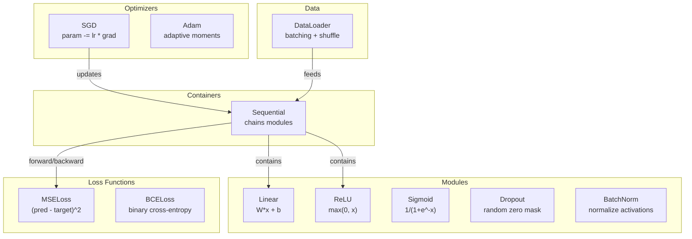
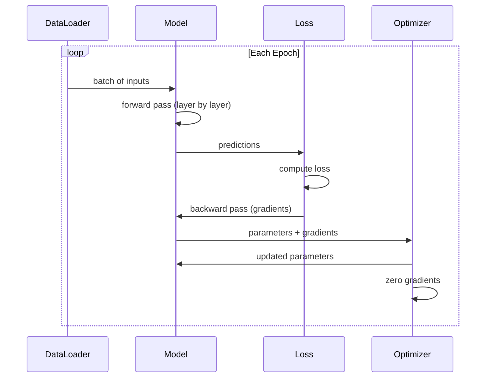
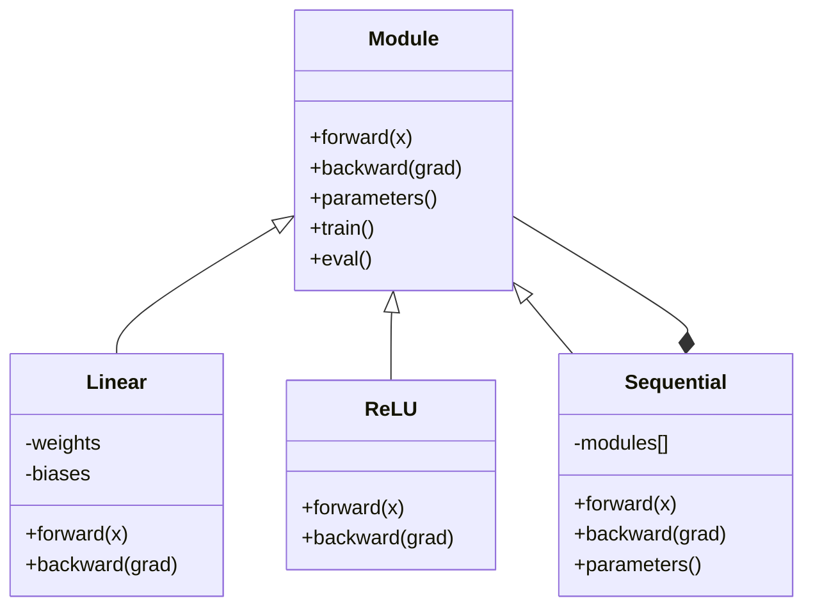

#  Construir su propio Mini Framework

> Ya has construido neuronas, capas, redes, backprops, activaciones, pérdida de función, optimizadores, regularización, inicialización y calendarios LR. Son todos componentes independientes distribuidos. Ahora los conectas en un marco.

**类型:**Construcción
**语言:**Python
**前置知识:**Fase 03 Todos los contenidos
**时间:**~ 120 minutos

## El objetivo del aprendizaje

- Construir un marco de aprendizaje profundo completo (~ 500 行), que incluya módulos, lineal, reLU, sigmoide, depósito, batchNorm, secuencialidad, pérdida de funciones, optimizadores y DataLoader
- 解释 Modulo abstracción ((avant, retroceder, parámetros), así como por qué hay que cambiar de tren/modo de escala
- Conectar todos los componentes en un bucle de entrenamiento funcional, utilizado para entrenar en una red de cuatro capas en la clasificación de círculos
- Para que cada componente de su marco se mapee a la respuesta PyTorch 等价物(nn.Module、nn.Sequenciales、optim.Adam、DataLoader)

##  problemas

Ya en diez secciones has construido bloques de construcción dispersos en diferentes documentos.`Value`En la clase, hay un bucle de entrenamiento, en otro archivo hay inicialización de peso, en otro archivo hay horarios de tasa de aprendizaje. Para entrenar una red, necesitas copiar el código de adhesión en cinco secciones diferentes de la clase, y luego conectarlo manualmente.

Este es el marco para resolver el problema.`nn.Module`¿Qué es esto?`nn.Sequential`¿Qué es esto?`optim.Adam`¿Qué es esto?`DataLoader`, y el patrón de ciclo de entrenamiento que se ha formado en su conjunto.`keras.Layer`¿Qué es esto?`keras.Sequential`¿Qué es esto?`keras.optimizers.Adam`Todos estos no son magia son modelos de organización, que permiten definir, entrenar y evaluar redes, sin necesidad de reinventar cada vez más la lógica de conexión de base

Usted usará aproximadamente 500 行 Python  construir lo mismo. No se necesita numpy. No se necesita dependencia externa. Este marco puede definir cualquier red de entrada, utilizar SGD o Adam  entrenar, hacer batches de datos, aplicar dropout y batch normalización, utilizar cualquier activación,并调度学习率──

Después de terminar, te darás cuenta de todo.`model = nn.Sequential(...)`Cuando pasó lo que... entenderás por qué existe.`model.train()`Y `model.eval()`¿Sabes por qué?`optimizer.zero_grad()`Es un uso único. Lo entenderás todo, porque todos ellos fueron construidos por tu propia mano.

## 核心概念 核心概念 核心概念 核心概念

### Abstracción de módulos

Cada capa de PyTorch se ha heredado de sí misma .`nn.Module`◊ Un módulo tiene tres responsabilidades:

1. **forward()**-- 给定输入,计算输出
2. **parameters()**-- 返回所有可训练的重量
3. **backward()**-- 计算 gradients(en PyTorch 中由自动级处理, en nuestro marco en el cual se realiza de forma evidente)

La capa lineal es un módulo. La activación de ReLU es un módulo. La capa de abandono es un módulo. La capa de normalización de lote es también un módulo.

### Contenedor secuencial

`nn.Sequential`会串联模块──Forward pass:让数据依次通过模块 1、模块 2、模块 3──Backward pass:反向遍历这条链──container 本身也是一个模块--它有前面() ‧参数() 和后面(()──这是复合模式:一串模块 本身也是一个模块──

### 训练 vs Evaluación 模式

El abandono en el entrenamiento de las neuronas se pone a cero, pero en la evaluación de las neuronas se permite que todo sea aprobado.`train()`Y `eval()`Los métodos utilizados para cambiar este comportamiento. Cada módulo tiene un`training`bandera

### Optimizador

Optimizer utiliza los gradientes de los parámetros para actualizarlos.`param -= lr * grad` Adam:维护 momentum 和 variance estimates, luego se actualiza── Optimizer no necesita saber la arquitectura de red -- sólo ve una lista de parámetros y sus gradientes

### Datarregistros

Batching  es importante, hay dos razones. Primero, para los problemas grandes, no puedes poner todo el conjunto de datos en memoria. Segundo, el mini-batch Gradient Descent  proporciona ruido, ayuda a escapar de los mínimos locales.

### Arquitectura de marco



### El ciclo de entrenamiento



### La jerarquía de módulos




```figure
gradient-clipping
```

## Construirlo

### Paso 1: Clase base del módulo

Cada capa tiene que realizar una interfaz abstracta.

```python
class Module:
    def __init__(self):
        self.training = True

    def forward(self, x):
        raise NotImplementedError

    def backward(self, grad):
        raise NotImplementedError

    def parameters(self):
        return []

    def train(self):
        self.training = True

    def eval(self):
        self.training = False
```

### 步骤 2: capa lineal

Último elemento básico: peso de almacenamiento y sesgos, hacia adelante: calcular Wx + b, hacia atrás: calcular gradientes de peso/entrada:

```python
import math
import random


class Linear(Module):
    def __init__(self, fan_in, fan_out):
        super().__init__()
        std = math.sqrt(2.0 / fan_in)
        self.weights = [[random.gauss(0, std) for _ in range(fan_in)] for _ in range(fan_out)]
        self.biases = [0.0] * fan_out
        self.weight_grads = [[0.0] * fan_in for _ in range(fan_out)]
        self.bias_grads = [0.0] * fan_out
        self.fan_in = fan_in
        self.fan_out = fan_out
        self.input = None

    def forward(self, x):
        self.input = x
        output = []
        for i in range(self.fan_out):
            val = self.biases[i]
            for j in range(self.fan_in):
                val += self.weights[i][j] * x[j]
            output.append(val)
        return output

    def backward(self, grad):
        input_grad = [0.0] * self.fan_in
        for i in range(self.fan_out):
            self.bias_grads[i] += grad[i]
            for j in range(self.fan_in):
                self.weight_grads[i][j] += grad[i] * self.input[j]
                input_grad[j] += grad[i] * self.weights[i][j]
        return input_grad

    def parameters(self):
        params = []
        for i in range(self.fan_out):
            for j in range(self.fan_in):
                params.append((self.weights, i, j, self.weight_grads))
            params.append((self.biases, i, None, self.bias_grads))
        return params
```

### 步骤 3: módulos de activación

Se realizarán los módulos RELU, Sigmoid y Tanh. Cada uno de ellos se almacenará en el pasaporte retrogrado.

```python
class ReLU(Module):
    def __init__(self):
        super().__init__()
        self.mask = None

    def forward(self, x):
        self.mask = [1.0 if v > 0 else 0.0 for v in x]
        return [max(0.0, v) for v in x]

    def backward(self, grad):
        return [g * m for g, m in zip(grad, self.mask)]


class Sigmoid(Module):
    def __init__(self):
        super().__init__()
        self.output = None

    def forward(self, x):
        self.output = []
        for v in x:
            v = max(-500, min(500, v))
            self.output.append(1.0 / (1.0 + math.exp(-v)))
        return self.output

    def backward(self, grad):
        return [g * o * (1 - o) for g, o in zip(grad, self.output)]


class Tanh(Module):
    def __init__(self):
        super().__init__()
        self.output = None

    def forward(self, x):
        self.output = [math.tanh(v) for v in x]
        return self.output

    def backward(self, grad):
        return [g * (1 - o * o) for g, o in zip(grad, self.output)]
```

### Paso 4: Modulo de abandono

訓練時随機將元素置零──將保留下來的元素按1/(1-p) 缩放,使期望值保持不變──在 eval 时不做任何处理──

```python
class Dropout(Module):
    def __init__(self, p=0.5):
        super().__init__()
        self.p = p
        self.mask = None

    def forward(self, x):
        if not self.training:
            return x
        self.mask = [0.0 if random.random() < self.p else 1.0 / (1 - self.p) for _ in x]
        return [v * m for v, m in zip(x, self.mask)]

    def backward(self, grad):
        if self.mask is None:
            return grad
        return [g * m for g, m in zip(grad, self.mask)]
```

### 步骤 5: Modulo de BatchNorm

按功能 在批量上将激活 归一化为零 mean 和单元变量──为 eval modo 维护运行统计──

```python
class BatchNorm(Module):
    def __init__(self, size, momentum=0.1, eps=1e-5):
        super().__init__()
        self.size = size
        self.gamma = [1.0] * size
        self.beta = [0.0] * size
        self.gamma_grads = [0.0] * size
        self.beta_grads = [0.0] * size
        self.running_mean = [0.0] * size
        self.running_var = [1.0] * size
        self.momentum = momentum
        self.eps = eps
        self.x_norm = None
        self.std_inv = None
        self.batch_input = None

    def forward_batch(self, batch):
        batch_size = len(batch)
        output_batch = []

        if self.training:
            mean = [0.0] * self.size
            for sample in batch:
                for j in range(self.size):
                    mean[j] += sample[j]
            mean = [m / batch_size for m in mean]

            var = [0.0] * self.size
            for sample in batch:
                for j in range(self.size):
                    var[j] += (sample[j] - mean[j]) ** 2
            var = [v / batch_size for v in var]

            self.std_inv = [1.0 / math.sqrt(v + self.eps) for v in var]

            self.x_norm = []
            self.batch_input = batch
            for sample in batch:
                normed = [(sample[j] - mean[j]) * self.std_inv[j] for j in range(self.size)]
                self.x_norm.append(normed)
                output = [self.gamma[j] * normed[j] + self.beta[j] for j in range(self.size)]
                output_batch.append(output)

            for j in range(self.size):
                self.running_mean[j] = (1 - self.momentum) * self.running_mean[j] + self.momentum * mean[j]
                self.running_var[j] = (1 - self.momentum) * self.running_var[j] + self.momentum * var[j]
        else:
            std_inv = [1.0 / math.sqrt(v + self.eps) for v in self.running_var]
            for sample in batch:
                normed = [(sample[j] - self.running_mean[j]) * std_inv[j] for j in range(self.size)]
                output = [self.gamma[j] * normed[j] + self.beta[j] for j in range(self.size)]
                output_batch.append(output)

        return output_batch

    def forward(self, x):
        result = self.forward_batch([x])
        return result[0]

    def backward(self, grad):
        if self.x_norm is None:
            return grad
        for j in range(self.size):
            self.gamma_grads[j] += self.x_norm[0][j] * grad[j]
            self.beta_grads[j] += grad[j]
        return [grad[j] * self.gamma[j] * self.std_inv[j] for j in range(self.size)]

    def parameters(self):
        params = []
        for j in range(self.size):
            params.append((self.gamma, j, None, self.gamma_grads))
            params.append((self.beta, j, None, self.beta_grads))
        return params
```

### Paso 6: Contenedor secuencial

串联模块──Forward de izquierda a derecha, hacia atrás de derecha a izquierda──

```python
class Sequential(Module):
    def __init__(self, *modules):
        super().__init__()
        self.modules = list(modules)

    def forward(self, x):
        for module in self.modules:
            x = module.forward(x)
        return x

    def backward(self, grad):
        for module in reversed(self.modules):
            grad = module.backward(grad)
        return grad

    def parameters(self):
        params = []
        for module in self.modules:
            params.extend(module.parameters())
        return params

    def train(self):
        self.training = True
        for module in self.modules:
            module.train()

    def eval(self):
        self.training = False
        for module in self.modules:
            module.eval()
```

### Paso 7: Pérdida de funciones

MSE y Binary Cross-Entropy── cada uno de ellos devuelve el valor de pérdida,并 proporciona un retroceso() para volver a Gradient──

```python
class MSELoss:
    def __call__(self, predicted, target):
        self.predicted = predicted
        self.target = target
        n = len(predicted)
        self.loss = sum((p - t) ** 2 for p, t in zip(predicted, target)) / n
        return self.loss

    def backward(self):
        n = len(self.predicted)
        return [2 * (p - t) / n for p, t in zip(self.predicted, self.target)]


class BCELoss:
    def __call__(self, predicted, target):
        self.predicted = predicted
        self.target = target
        eps = 1e-7
        n = len(predicted)
        self.loss = 0
        for p, t in zip(predicted, target):
            p = max(eps, min(1 - eps, p))
            self.loss += -(t * math.log(p) + (1 - t) * math.log(1 - p))
        self.loss /= n
        return self.loss

    def backward(self):
        eps = 1e-7
        n = len(self.predicted)
        grads = []
        for p, t in zip(self.predicted, self.target):
            p = max(eps, min(1 - eps, p))
            grads.append((-t / p + (1 - t) / (1 - p)) / n)
        return grads
```

### Paso 8: SGD y Adam Optimizers

两者都接收参数 list,并使用梯度 更新重量──

```python
class SGD:
    def __init__(self, parameters, lr=0.01):
        self.params = parameters
        self.lr = lr

    def step(self):
        for container, i, j, grad_container in self.params:
            if j is not None:
                container[i][j] -= self.lr * grad_container[i][j]
            else:
                container[i] -= self.lr * grad_container[i]

    def zero_grad(self):
        for container, i, j, grad_container in self.params:
            if j is not None:
                grad_container[i][j] = 0.0
            else:
                grad_container[i] = 0.0


class Adam:
    def __init__(self, parameters, lr=0.001, beta1=0.9, beta2=0.999, eps=1e-8):
        self.params = parameters
        self.lr = lr
        self.beta1 = beta1
        self.beta2 = beta2
        self.eps = eps
        self.t = 0
        self.m = [0.0] * len(parameters)
        self.v = [0.0] * len(parameters)

    def step(self):
        self.t += 1
        for idx, (container, i, j, grad_container) in enumerate(self.params):
            if j is not None:
                g = grad_container[i][j]
            else:
                g = grad_container[i]

            self.m[idx] = self.beta1 * self.m[idx] + (1 - self.beta1) * g
            self.v[idx] = self.beta2 * self.v[idx] + (1 - self.beta2) * g * g

            m_hat = self.m[idx] / (1 - self.beta1 ** self.t)
            v_hat = self.v[idx] / (1 - self.beta2 ** self.t)

            update = self.lr * m_hat / (math.sqrt(v_hat) + self.eps)

            if j is not None:
                container[i][j] -= update
            else:
                container[i] -= update

    def zero_grad(self):
        for container, i, j, grad_container in self.params:
            if j is not None:
                grad_container[i][j] = 0.0
            else:
                grad_container[i] = 0.0
```

### Paso 9: DataLoader

Los datos se dividen en lotes, y se pueden cambiar en cada época.

```python
class DataLoader:
    def __init__(self, data, batch_size=32, shuffle=True):
        self.data = data
        self.batch_size = batch_size
        self.shuffle = shuffle

    def __iter__(self):
        indices = list(range(len(self.data)))
        if self.shuffle:
            random.shuffle(indices)
        for start in range(0, len(indices), self.batch_size):
            batch_indices = indices[start:start + self.batch_size]
            batch = [self.data[i] for i in batch_indices]
            inputs = [item[0] for item in batch]
            targets = [item[1] for item in batch]
            yield inputs, targets

    def __len__(self):
        return (len(self.data) + self.batch_size - 1) // self.batch_size
```

### Paso 10: En el círculo de clasificación , entrenamiento de red de 4 capas

Definir el modelo, seleccionar la función de pérdida, seleccionar el optimizador, ejecutar el ciclo de entrenamiento.

```python
def make_circle_data(n=500, seed=42):
    random.seed(seed)
    data = []
    for _ in range(n):
        x = random.uniform(-2, 2)
        y = random.uniform(-2, 2)
        label = 1.0 if x * x + y * y < 1.5 else 0.0
        data.append(([x, y], [label]))
    return data


def train():
    random.seed(42)

    model = Sequential(
        Linear(2, 16),
        ReLU(),
        Linear(16, 16),
        ReLU(),
        Linear(16, 8),
        ReLU(),
        Linear(8, 1),
        Sigmoid(),
    )

    criterion = BCELoss()
    optimizer = Adam(model.parameters(), lr=0.01)

    data = make_circle_data(500)
    split = int(len(data) * 0.8)
    train_data = data[:split]
    test_data = data[split:]

    loader = DataLoader(train_data, batch_size=16, shuffle=True)

    model.train()

    for epoch in range(100):
        total_loss = 0
        total_correct = 0
        total_samples = 0

        for batch_inputs, batch_targets in loader:
            batch_loss = 0
            for x, t in zip(batch_inputs, batch_targets):
                pred = model.forward(x)
                loss = criterion(pred, t)
                batch_loss += loss

                optimizer.zero_grad()
                grad = criterion.backward()
                model.backward(grad)
                optimizer.step()

                predicted_class = 1.0 if pred[0] >= 0.5 else 0.0
                if predicted_class == t[0]:
                    total_correct += 1
                total_samples += 1

            total_loss += batch_loss

        avg_loss = total_loss / total_samples
        accuracy = total_correct / total_samples * 100

        if epoch % 10 == 0 or epoch == 99:
            print(f"Epoch {epoch:3d} | Loss: {avg_loss:.6f} | Train Accuracy: {accuracy:.1f}%")

    model.eval()
    correct = 0
    for x, t in test_data:
        pred = model.forward(x)
        predicted_class = 1.0 if pred[0] >= 0.5 else 0.0
        if predicted_class == t[0]:
            correct += 1
    test_accuracy = correct / len(test_data) * 100
    print(f"\nTest Accuracy: {test_accuracy:.1f}% ({correct}/{len(test_data)})")

    return model, test_accuracy
```

## Usalo

A continuación se muestra la versión de PyTorch que está construyendo:

```python
import torch
import torch.nn as nn
from torch.utils.data import DataLoader, TensorDataset

model = nn.Sequential(
    nn.Linear(2, 16),
    nn.ReLU(),
    nn.Linear(16, 16),
    nn.ReLU(),
    nn.Linear(16, 8),
    nn.ReLU(),
    nn.Linear(8, 1),
    nn.Sigmoid(),
)

criterion = nn.BCELoss()
optimizer = torch.optim.Adam(model.parameters(), lr=0.01)

for epoch in range(100):
    model.train()
    for inputs, targets in dataloader:
        optimizer.zero_grad()
        predictions = model(inputs)
        loss = criterion(predictions, targets)
        loss.backward()
        optimizer.step()

    model.eval()
    with torch.no_grad():
        test_predictions = model(test_inputs)
```

La estructura es totalmente coherente.`Sequential`¿Qué es esto?`Linear`¿Qué es esto?`ReLU`¿Qué es esto?`Sigmoid`¿Qué es esto?`BCELoss`¿Qué es esto?`Adam`¿Qué es esto?`zero_grad`¿Qué es esto?`backward`¿Qué es esto?`step`¿Qué es esto?`train`¿Qué es esto?`eval` Cada concepto es un mismo.  Diferencia es que PyTorch se procesa automáticamente en autograd (no se necesita realizar hacia atrás en cada módulo) )  puede funcionar en la GPU y pasar por muchos años de optimización.  Pero la estructura es la misma.

Ahora, cuando ves el código PyTorch, sabes con certeza lo que está pasando en cada línea.

## 交付内容

Encuentro de trabajo:
- `outputs/prompt-framework-architect.md`-- Un prompt para diseñar arquitecturas de redes neuronales basadas en abstracciones de marco

##  ejercicios

1. Por la clasificación de varias clases 添加一个 `SoftmaxCrossEntropyLoss`clase── para predicciones hacer softmax, calcular pérdida de entropía cruzada,并处理组合后的倒退通过── en un conjunto de datos espiral de 3 clases 上测试它──

2. En optimización de la programación de la tasa de aprendizaje: Add a `set_lr()`método,并接入 09 中的 cosin schedule──使用暖化+ cosin 训练圈分类器,并与恒 LR对比──

3. Por secuencia 添加 `save()`Y `load()`método, se procesarán todos los pesos en un archivo JSON, y se volverán a cargar.

4. En Adam Optimizer lograr la pérdida de peso (L2)`weight_decay`Parámetro, haciendo que los pesos en cada paso se contraigan a cero.

5. Usar una verdadera mini-parcela Gradiente acumulación  sustituir por muestra de entrenamiento ciclo: en todas las muestras de un lote de arriba gradientes acumulados, luego se separa en tamaño de lote, volver a ejecutar una vez más Optimizer paso── medir esto es si va a cambiar la velocidad de recepción──

## 关键术语: "El hombre es un hombre"

| Term | 人们通常怎么说 | 它真正的含义 |
|------|----------------|----------------------|
| Module | “一个 layer” | framework 中的基础 abstraction -- 任何具有 forward()、backward() 和 parameters() 的东西 |
| Sequential | “按顺序堆叠 layers” | 一个串联 modules 的 container，在 forward 时按顺序应用，在 backward 时反向应用 |
| Forward pass | “运行 network” | 按顺序让 input 通过每个 module 来计算 output |
| Backward pass | “计算 gradients” | 将 Loss Gradient Backpropagation通过每个 module，以计算 parameter gradients |
| Parameters | “可训练 weights” | network 中 Optimizer 可以更新的所有值 -- weights 和 biases |
| Optimizer | “更新 weights 的东西” | 一种使用 gradients 更新 parameters 的算法，实现 SGD、Adam 或其他规则 |
| DataLoader | “喂 data 的东西” | 一个 iterator，将 dataset 切分为 batches，并可选择在 epochs 之间 shuffle |
| Training mode | “model.train()” | 一个启用 stochastic 行为的 flag，例如 dropout，以及使用 batch stats 的 batch normalization |
| Evaluation mode | “model.eval()” | 一个禁用 dropout 并让 batch normalization 使用 running statistics 的 flag |
| Zero grad | “清空 gradients” | 在计算下一个 batch 的 gradients 之前，将所有 parameter gradients 重置为零 |

## 延伸阅读

- Paszke et al., "PyTorch: Un estilo imperativo, de alto rendimiento de la biblioteca de aprendizaje profundo" (2019) -- 描述 PyTorch 设计决策的论文
- Chollet, "Aprendizaje profundo con Python, Segunda edición" (2021) -- Capítulo 3 介绍 Keras internals, usar idéntico módulo/arrasa de abstracción
- Johnson, "Tiny-DNN" (https://github.com/tiny-dnn/tiny-dnn) -- Un marco de aprendizaje profundo C++ solo en encabezado, para entender los elementos internos del marco
