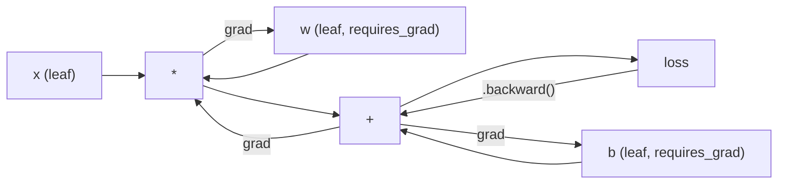
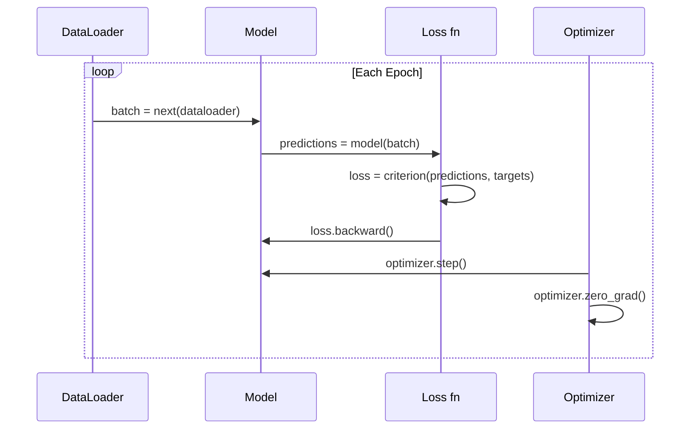

# PyTorch entrada

> Ya has construido un motor con un clavado y un piezo. Ahora vamos a aprender a todos a abrir la verdadera.

**Type:** Build
**Languages:** Python
**Prerequisites:** Lesson 03.10 (Build Your Own Mini Framework)
**Time:** ~75 minutes

## El objetivo del aprendizaje
- Utiliza PyTorch de nn.Module、nn.Secuencial 和 autograd 构建并训练 Neural Network
- Utiliza PyTorch Tensor、GPU 加速, así como el ciclo de entrenamiento estándar ((zero_grad、avance、loss、backward、step)
- Convirtiendo los componentes de un mini marco de implementación de la pieza de pieza de pieza de pieza para la pieza de pieza de pieza de pieza de pieza de pieza de pieza de pieza de pieza de pieza de pieza de pieza de pieza de pieza de pieza de pieza de pieza de pieza de pieza de pieza de pieza de pieza de pieza de pieza de pieza de pieza de pieza de pieza de pieza de pieza de pieza de pieza de pieza de pieza de pieza de pieza de pieza de pieza de pieza de pieza de pieza de pieza de pieza de pieza de pieza de pieza de pieza de pieza de pieza de pieza de pieza de pieza de pieza de pieza de pieza de pieza de pieza de pieza de pieza de pieza de pieza de pieza de pieza de pieza de pieza de pieza de pieza de pieza de pieza de pieza de pieza
- En el mismo perfil de tarea y comparar su marco de Python puro con la velocidad de entrenamiento de PyTorch

##  problemas
Ya tienes un mini marco que se puede trabajar. Las capas lineales, ReLU, drop-out, batch norm, Adam, un DataLoader, un ciclo de entrenamiento. Puede utilizar Python en forma de red de cuatro capas.

Pero en el mismo problema, también es 500 veces más lento que PyTorch.

Su mini framework utiliza un emplazamiento Python  ciclo una vez para procesar una muestra. PyTorch distribuirá la misma operación a través de kernels C++/CUDA optimizados, y se ejecuta en GPU. En un solo bloque NVIDIA A100, PyTorch  entrenar un ResNet-50(25.6M parámetros) procesar ImageNet(1.28M imágenes) requiere aproximadamente 6 horas. Su framework en la misma tarea requiere aproximadamente 3.000 horas.

速度不是唯一差距──你的框架 没有 GPU 支持──没有自动区分你为每个模块手写后退了()──没有序列化──没有分布式训练──没有混合精度──除了打印 语句,没有办法调整 Gradient flow──

PyTorch  Completó todas estas carencias. Pero también conserva el mismo modelo de mentalidad que ya has creado: módulo, adelante, parámetros, retroceder, optimizar, paso, paso, concepto de un mismo tipo de respuesta.

## 概念
### Por qué PyTorch ganó

2015 , TensorFlow  Requiere que usted esté en funcionamiento cualquier contenido antes de definir un gráfico de computación estática.

PyTorch en 2017 lanzó, adoptó diferentes conceptos: ejecución ansiosa.`y = model(x)`会真的立刻计算 y, en lugar de 给稍后才会计算 y 的图 添加一个节点──这意味着标准Python调试工具都能工作──打印() 能工作──pdb 能工作──前进通过 里 if/else 能工作──

Para el año 2020, el mercado ya ha dado la respuesta. La participación de PyTorch en los trabajos de investigación ML aumentó de 7% en 2017 a más de 75% en 2022.

El objetivo de esta sección es que la experiencia del desarrollador crezca de nuevo. Un poco más lento, pero con un error de error de casi el 50% del marco, todo el mundo ganará.

### Tensores

El tensor es un número de dimensiones, con tres características clave: forma, tipo y dispositivo.

```python
import torch

x = torch.zeros(3, 4)           # shape: (3, 4), dtype: float32, device: cpu
x = torch.randn(2, 3, 224, 224) # batch of 2 RGB images, 224x224
x = torch.tensor([1, 2, 3])     # from a Python list
```

**Shape**Indicar la forma de la escala es (), el vector es (n), la matriz es (m, n), una serie de imágenes es (batch, canales, altura, ancho)

**Dtype**Control de la precisión y la memoria.

| dtype | Bits | Range | Use case |
|-------|------|-------|----------|
| float32 | 32 | ~7 位十进制数字 | 默认训练 |
| float16 | 16 | ~3.3 位十进制数字 | Mixed precision |
| bfloat16 | 16 | 与 float32 相同的范围，精度更低 | LLM 训练 |
| int8 | 8 | -128 到 127 | Quantized inference |

**Device**Decide cuál es el lugar donde ocurre.

```python
device = torch.device("cuda" if torch.cuda.is_available() else "cpu")
x = torch.randn(3, 4, device=device)
x = x.to("cuda")
x = x.cpu()
```

Cada operación requiere que el tensor esté en el mismo dispositivo. Este es el error PyTorch más comúnmente encontrado por los principiantes.`RuntimeError: Expected all tensors to be on the same device`◊ Método de reparación es calcular antes de mover todo el contenido a un mismo dispositivo.

**Reshaping**Es un tiempo de operación habitual que cambia los metadatos, no los datos.

```python
x = torch.randn(2, 3, 4)
x.view(2, 12)      # reshape to (2, 12) -- must be contiguous
x.reshape(6, 4)    # reshape to (6, 4) -- works always
x.permute(2, 0, 1) # reorder dimensions
x.unsqueeze(0)     # add dimension: (1, 2, 3, 4)
x.squeeze()        # remove size-1 dimensions
```

### Autograd

Su mini marco  requiere que usted para cada módulo  implementar hacia atrás ) ・ PyTorch no necesita── se pondrá Tensor                                                                                                                                                                                                                                              



PYTORCH utiliza auto-difusión basada en cinta. Cada operación se añade a una página en el pasillo.`.backward()`Me voy a volver a poner esta cinta.

```python
x = torch.randn(3, requires_grad=True)
y = x ** 2 + 3 * x
z = y.sum()
z.backward()
print(x.grad)  # dz/dx = 2x + 3
```

Autograd 的三条规则:

1. Sólo con`requires_grad=True`La tensión de la hoja se acumula Gradiente
2. Gradiente 默认会累积 por pasa hacia atrás 前调用 `optimizer.zero_grad()`
3. `torch.no_grad()`会禁用 Seguimiento de grado (en el período de evaluación)

### Modulo nn

`nn.Module`Es la base de cada componente de la red neuronal en PyTorch. Ya ha construido este abstracto en la Lección 10. La versión de PyTorch ha aumentado el registro automático de parámetros, el descubrimiento de módulos recursivos, la gestión de dispositivos y la serialización de dictados de estado.

```python
import torch.nn as nn

class MLP(nn.Module):
    def __init__(self, input_dim, hidden_dim, output_dim):
        super().__init__()
        self.layer1 = nn.Linear(input_dim, hidden_dim)
        self.relu = nn.ReLU()
        self.layer2 = nn.Linear(hidden_dim, output_dim)

    def forward(self, x):
        x = self.layer1(x)
        x = self.relu(x)
        x = self.layer2(x)
        return x
```

Cuando estás en`__init__`En el medio`nn.Module`O `nn.Parameter`Cuando se le da el valor, PyTorch se lo registra automáticamente.`model.parameters()`Recuerde cada parámetro registrado. Por eso ya no necesita pesas como en el mini marco.

核心 building blocks:

| Module | What it does | Parameters |
|--------|-------------|------------|
| nn.Linear(in, out) | Wx + b | in*out + out |
| nn.Conv2d(in_ch, out_ch, k) | 2D convolution | in_ch*out_ch*k*k + out_ch |
| nn.BatchNorm1d(features) | Normalize activations | 2 * features |
| nn.Dropout(p) | Random zeroing | 0 |
| nn.ReLU() | max(0, x) | 0 |
| nn.GELU() | Gaussian error linear | 0 |
| nn.Embedding(vocab, dim) | Lookup table | vocab * dim |
| nn.LayerNorm(dim) | Per-sample normalization | 2 * dim |

### Funciones de pérdida y optimizadores

PyTorch se lleva a cabo la producción de todo el contenido que has construido.

**Loss functions**(de la`torch.nn`):

| Loss | Task | Input |
|------|------|-------|
| nn.MSELoss() | Regression | 任意 shape |
| nn.CrossEntropyLoss() | Multi-class classification | Logits（不是 softmax） |
| nn.BCEWithLogitsLoss() | Binary classification | Logits（不是 sigmoid） |
| nn.L1Loss() | Regression（robust） | 任意 shape |
| nn.CTCLoss() | Sequence alignment | Log probabilities |

Nota:`CrossEntropyLoss`内部组合了                                                                                                                                                                                                                                                                                                                                                                                                                                                                                                                         `LogSoftmax`¿ Qué es eso ?`NLLLoss` Introducir logits crudos, en lugar de salidas de softmax  Este es un error habitual, generando un error Gradiente 

**Optimizers**(de la`torch.optim`):

| Optimizer | When to use | Typical LR |
|-----------|-------------|-----------|
| SGD(params, lr, momentum) | CNNs、调优良好的 pipelines | 0.01--0.1 |
| Adam(params, lr) | 默认起点 | 1e-3 |
| AdamW(params, lr, weight_decay) | Transformers、fine-tuning | 1e-4--1e-3 |
| LBFGS(params) | Small-scale、second-order | 1.0 |

### El ciclo de entrenamiento

Cada ciclo de entrenamiento PyTorch sigue el mismo modelo de 5 pasos.



规范模式:

```python
for epoch in range(num_epochs):
    model.train()
    for inputs, targets in train_loader:
        inputs, targets = inputs.to(device), targets.to(device)
        optimizer.zero_grad()
        outputs = model(inputs)
        loss = criterion(outputs, targets)
        loss.backward()
        optimizer.step()
```

El ciclo de lote 内部五行── entrenamiento de GPT-4、Stable Diffusion 和 LLaMA 的也就是这五行──arquitectura 会变──data 会变──这五行不会变──

### Dataset y DataLoader

PyTorch de `Dataset`Es una clase abstracta con dos métodos:`__len__`Y `__getitem__`¿Qué es eso?`DataLoader`En él envasado batching, mezcla y carga de datos de múltiples procesos.

```python
from torch.utils.data import Dataset, DataLoader

class MNISTDataset(Dataset):
    def __init__(self, images, labels):
        self.images = images
        self.labels = labels

    def __len__(self):
        return len(self.labels)

    def __getitem__(self, idx):
        return self.images[idx], self.labels[idx]

loader = DataLoader(dataset, batch_size=64, shuffle=True, num_workers=4)
```

`num_workers=4`Se iniciará 4 procesos y se cargará datos, mientras que la GPU se entrenará en el batch actual.

### Formación de GPU

Mover el modelo a la GPU:

```python
device = torch.device("cuda" if torch.cuda.is_available() else "cpu")
model = model.to(device)
```

Esto se devolverá al lugar de cada parámetro y el buffer se moverá a la GPU... y luego durante el entrenamiento se moverá cada lote:

```python
inputs, targets = inputs.to(device), targets.to(device)
```

**Mixed precision**会在现代 GPU(A100、H100、RTX 4090) 上把内存使用减半、吞吐量翻倍:前后使用 float16 运行,同时主权重保持在 float32:

```python
from torch.amp import autocast, GradScaler

scaler = GradScaler()
for inputs, targets in loader:
    with autocast(device_type="cuda"):
        outputs = model(inputs)
        loss = criterion(outputs, targets)
    scaler.scale(loss).backward()
    scaler.step(optimizer)
    scaler.update()
    optimizer.zero_grad()
```

### Por el contrario, el sistema de gestión de la información se ha convertido en un sistema de gestión de datos.

| Feature | Mini Framework (L10) | PyTorch | JAX |
|---------|---------------------|---------|-----|
| Autodiff | Manual backward() | Tape-based autograd | Functional transforms |
| Execution | Eager（Python loops） | Eager（C++ kernels） | Traced + JIT compiled |
| GPU support | 无 | 有（CUDA、ROCm、MPS） | 有（CUDA、TPU） |
| Speed (MNIST MLP) | ~300s/epoch | ~0.5s/epoch | ~0.3s/epoch |
| Module system | Custom Module class | nn.Module | Stateless functions（Flax/Equinox） |
| Debugging | print() | print()、pdb、breakpoint() | 更难（JIT tracing 会破坏 print） |
| Ecosystem | 无 | Hugging Face、Lightning、timm | Flax、Optax、Orbax |
| Learning curve | 你已经构建过它 | 中等 | 陡峭（functional paradigm） |
| Production use | Toy problems | Meta、OpenAI、Anthropic、HF | Google DeepMind、Midjourney |


```figure
dropout-mask
```

## Construirlo
Uno sólo utiliza PyTorch primitivos en el entrenamiento de MNIST MLP de 3 capas.`torchvision.datasets`◊ Nosotros mismos descargar y analizar datos brutos.

### Paso 1: desde el archivo original

MNIST 以 4 个 gziped archivos 发布: training images(60,000 x 28 x 28) ✓ training labels、test images(10,000 x 28 x 28) ✓ test labels──我们下载它们并解析二进制形式──

```python
import torch
import torch.nn as nn
import struct
import gzip
import urllib.request
import os

def download_mnist(path="./mnist_data"):
    base_url = "https://storage.googleapis.com/cvdf-datasets/mnist/"
    files = [
        "train-images-idx3-ubyte.gz",
        "train-labels-idx1-ubyte.gz",
        "t10k-images-idx3-ubyte.gz",
        "t10k-labels-idx1-ubyte.gz",
    ]
    os.makedirs(path, exist_ok=True)
    for f in files:
        filepath = os.path.join(path, f)
        if not os.path.exists(filepath):
            urllib.request.urlretrieve(base_url + f, filepath)

def load_images(filepath):
    with gzip.open(filepath, "rb") as f:
        magic, num, rows, cols = struct.unpack(">IIII", f.read(16))
        data = f.read()
        images = torch.frombuffer(bytearray(data), dtype=torch.uint8)
        images = images.reshape(num, rows * cols).float() / 255.0
    return images

def load_labels(filepath):
    with gzip.open(filepath, "rb") as f:
        magic, num = struct.unpack(">II", f.read(8))
        data = f.read()
        labels = torch.frombuffer(bytearray(data), dtype=torch.uint8).long()
    return labels
```

### 步骤 2: Definición del modelo

Una MLP de 3 capas: 784 -> 256 -> 128 -> 10。Activaciones de RELU。Uz Dropout hacer regularización。Para mantenerse simple, no utilizar la norma de lote。

```python
class MNISTModel(nn.Module):
    def __init__(self):
        super().__init__()
        self.net = nn.Sequential(
            nn.Linear(784, 256),
            nn.ReLU(),
            nn.Dropout(0.2),
            nn.Linear(256, 128),
            nn.ReLU(),
            nn.Dropout(0.2),
            nn.Linear(128, 10),
        )

    def forward(self, x):
        return self.net(x)
```

capa de salida  producir 10 个 logits en bruto( cada dígito 一个) ――不使用softmax`CrossEntropyLoss`Me gustaría que lo tratara internamente.

El parámetro de cuenta: 784*256 + 256 + 256*128 + 128 + 128*10 + 10 = 235.146。 en el estándar moderno para ver muy pequeño。 GPT-2 pequeño tiene 124M。 este modelo en unos segundos es capaz de completar el entrenamiento。

### Paso 3: Bucle de entrenamiento

规范的前进损失后退步模式

```python
def train_one_epoch(model, loader, criterion, optimizer, device):
    model.train()
    total_loss = 0
    correct = 0
    total = 0
    for images, labels in loader:
        images, labels = images.to(device), labels.to(device)
        optimizer.zero_grad()
        outputs = model(images)
        loss = criterion(outputs, labels)
        loss.backward()
        optimizer.step()
        total_loss += loss.item() * images.size(0)
        _, predicted = outputs.max(1)
        correct += predicted.eq(labels).sum().item()
        total += labels.size(0)
    return total_loss / total, correct / total


def evaluate(model, loader, criterion, device):
    model.eval()
    total_loss = 0
    correct = 0
    total = 0
    with torch.no_grad():
        for images, labels in loader:
            images, labels = images.to(device), labels.to(device)
            outputs = model(images)
            loss = criterion(outputs, labels)
            total_loss += loss.item() * images.size(0)
            _, predicted = outputs.max(1)
            correct += predicted.eq(labels).sum().item()
            total += labels.size(0)
    return total_loss / total, correct / total
```

Atención a la evaluación  durante `torch.no_grad()` Se desactivará el autogrado, se reducirá el uso de la memoria y se acelerará la inferencia.

### Paso 4: Conectar todas las partes

```python
def main():
    device = torch.device("cuda" if torch.cuda.is_available() else "cpu")

    download_mnist()
    train_images = load_images("./mnist_data/train-images-idx3-ubyte.gz")
    train_labels = load_labels("./mnist_data/train-labels-idx1-ubyte.gz")
    test_images = load_images("./mnist_data/t10k-images-idx3-ubyte.gz")
    test_labels = load_labels("./mnist_data/t10k-labels-idx1-ubyte.gz")

    train_dataset = torch.utils.data.TensorDataset(train_images, train_labels)
    test_dataset = torch.utils.data.TensorDataset(test_images, test_labels)
    train_loader = torch.utils.data.DataLoader(
        train_dataset, batch_size=64, shuffle=True
    )
    test_loader = torch.utils.data.DataLoader(
        test_dataset, batch_size=256, shuffle=False
    )

    model = MNISTModel().to(device)
    criterion = nn.CrossEntropyLoss()
    optimizer = torch.optim.Adam(model.parameters(), lr=1e-3)

    num_params = sum(p.numel() for p in model.parameters())
    print(f"Device: {device}")
    print(f"Parameters: {num_params:,}")
    print(f"Train samples: {len(train_dataset):,}")
    print(f"Test samples: {len(test_dataset):,}")
    print()

    for epoch in range(10):
        train_loss, train_acc = train_one_epoch(
            model, train_loader, criterion, optimizer, device
        )
        test_loss, test_acc = evaluate(
            model, test_loader, criterion, device
        )
        print(
            f"Epoch {epoch+1:2d} | "
            f"Train Loss: {train_loss:.4f} | Train Acc: {train_acc:.4f} | "
            f"Test Loss: {test_loss:.4f} | Test Acc: {test_acc:.4f}"
        )

    torch.save(model.state_dict(), "mnist_mlp.pt")
    print(f"\nModel saved to mnist_mlp.pt")
    print(f"Final test accuracy: {test_acc:.4f}")
```

10 个时代 后的预期输出:~97.8% de la precisión de las pruebas―CPU 上训练时间:~30 秒──GPU 上:~5 秒──Usar la misma arquitectura de su mini marco:~45 分钟──

## Usalo
### 快速对比: Mini Framework vs PyTorch

| Mini Framework (Lesson 10) | PyTorch |
|---------------------------|---------|
| `model = Sequential(Linear(784, 256), ReLU(), ...)` | `model = nn.Sequential(nn.Linear(784, 256), nn.ReLU(), ...)` |
| `pred = model.forward(x)` | `pred = model(x)` |
| `optimizer.zero_grad()` | `optimizer.zero_grad()` |
| `grad = criterion.backward()` then `model.backward(grad)` | `loss.backward()` |
| `optimizer.step()` | `optimizer.step()` |
| 无 GPU | `model.to("cuda")` |
| 每个 module 都要手写 backward | Autograd 处理所有内容 |

La interfaz es casi la misma. La diferencia está en todo lo que está en la parte inferior.

### Modelos de ahorro y carga

```python
torch.save(model.state_dict(), "model.pt")

model = MNISTModel()
model.load_state_dict(torch.load("model.pt", weights_only=True))
model.eval()
```

始终保存   siempre en el tiempo`state_dict()`(parámetro diccionario), en lugar de objeto modelo.

### Programación de las tasas de aprendizaje

```python
scheduler = torch.optim.lr_scheduler.CosineAnnealingLR(
    optimizer, T_max=10
)
for epoch in range(10):
    train_one_epoch(model, train_loader, criterion, optimizer, device)
    scheduler.step()
```

PyTorch 自带15+ agendadores:StepLR、ExponentialLR、CosineAnnealingLR、OneCycleLR、ReduceLROnPlateau── todos pueden conectarse a la misma interfaz de optimizador──

##  entregarlo
本课会产 de dos artefactos:

- `outputs/prompt-pytorch-debugger.md` Para el diagnóstico habitual PyTorch  entrenamiento de fracaso rápido
- `outputs/skill-pytorch-patterns.md`PyTorch entrenamiento de la modalidad de referencia de habilidades

##  ejercicios
1. **添加 batch normalization。**En cada capa lineal después de la activación antes de la inserción`nn.BatchNorm1d` Comparar la precisión de los ensayos y la velocidad de entrenamiento con la versión de abandono de uso único.

2. **实现 learning rate finder。**Usar índice de aumento de la tasa de aprendizaje (((de 1e-7 a 1.0) entrenar una época― dibujar pérdida vs LR―optimal LR 位于 loss 开始上升之前―usarlo para el modelo MNIST 选择更好的 LR―

3. **迁移到 GPU 并使用 mixed precision。**En el ciclo de entrenamiento`torch.amp.autocast`Y `GradScaler`△ en GPU 上测量使用和不使用混合精度 时的吞吐量(muestras/segundo) △ en A100 上,预期约2x speedup──

4. **构建 custom Dataset。**Descargar moda-MNIST (en inglés)`__getitem__`Y `__len__`de la `FashionMNISTDataset(Dataset)`La clase―entrenamiento del mismo MLP no comparar precisión―MNIST-Mode-MNIST Más difícil Previsión de ~88%, en lugar de ~98%―

5. **用 SGD + momentum 替换 Adam。**Uso `SGD(params, lr=0.01, momentum=0.9)`訓練── comparar curvas de convergencia──然后加入 `CosineAnnealingLR`¿Es que el SGD puede seguir a Adam en la época 10?

## 关键术语: "El hombre es un hombre"
| Term | What people say | What it actually means |
|------|----------------|----------------------|
| Tensor | “一个多维数组” | 一个有类型、device-aware 的数组，每个操作都内置 automatic differentiation 支持 |
| Autograd | “Automatic backprop” | 一个 tape-based 系统，在 forward pass 期间记录操作，然后反向重放它们以计算精确 Gradient |
| nn.Module | “一个 layer” | 任意 differentiable computation block 的基类——注册 parameters、支持 nesting、处理 train/eval modes |
| state_dict | “model weights” | 一个把 parameter names 映射到 Tensor 的 OrderedDict——trained model 的可移植、可序列化表示 |
| .backward() | “计算 Gradient” | 反向遍历 computational graph，为每个带有 requires_grad=True 的 leaf Tensor 计算并累积 Gradient |
| .to(device) | “移动到 GPU” | 递归地把所有 parameters 和 buffers 转移到指定 device（CPU、CUDA、MPS） |
| DataLoader | “data pipeline” | 一个 iterator，会对来自 Dataset 的数据执行 batching、shuffling，并可选地并行化 data loading |
| Mixed precision | “使用 float16” | 使用 float16 forward/backward 提升速度，同时保留 float32 master weights 以保证 numerical stability |
| Eager execution | “立即运行” | 操作在被调用时立即执行，而不是推迟到之后的 compilation step——这是区分 PyTorch 与 TF 1.x 的核心设计选择 |
| zero_grad | “重置 Gradient” | 在下一次 backward pass 前把所有 parameter gradients 置零，因为 PyTorch 默认会累积 Gradient |

## 延伸阅读
- Paszke et al., PyTorch: Un estilo imperativo, de alto rendimiento de la biblioteca de aprendizaje profundo (2019) explicar PyTorch 设计权衡的原始论文
- Tutoriales de PyTorch: Aprender PyTorch con ejemplos (https://pytorch.org/tutorials/beginner/pytorch_with_examples.html) desde Tensor hasta nn.Module
- Guía de ajuste de rendimiento PyTorch (https://pytorch.org/tutorials/recipes/recipes/tuning_guide.html)precisión mixta  trabajadores de DataLoader  memoria pinada y otras optimizaciones de producción
- Horace He, "Hacer que el aprendizaje profundo vaya brrrr"https://horace.io/brrr_intro.html¿Por qué la capacitación de GPU 快速, así como las estrategias de optimización específicas de PyTorch
