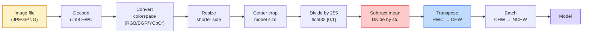
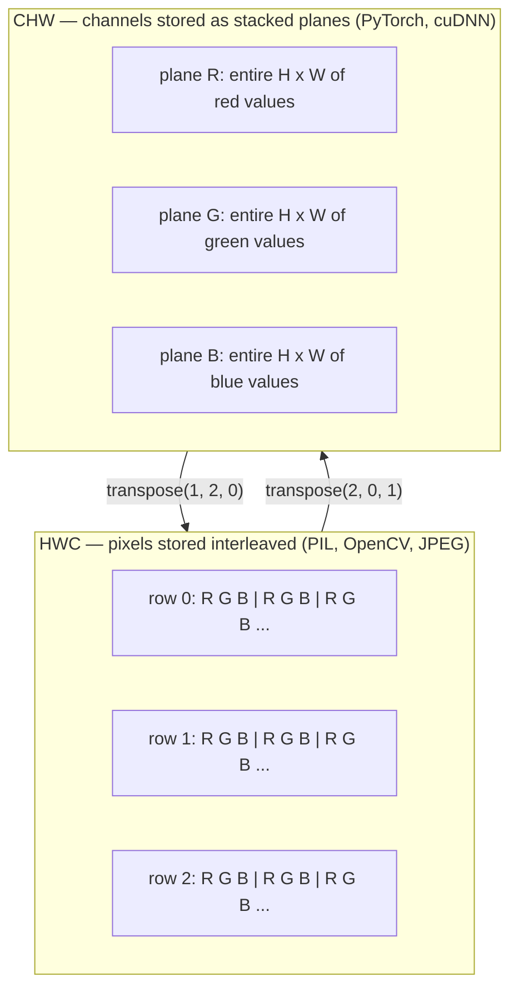

# 图像基础  píxeles、canal、espacios de color

> La imagen es una tensión de luz. Cada modelo de visión que usará después, empieza con este hecho.

**类型：**Construir
**语言：**Python
**前置要求：**Fase 1 Lección 12 (Operaciones de tensión), Fase 3 Lección 11 (Intro a PyTorch)
**时间：** 45 minutos

## El objetivo del aprendizaje

- Explicar cómo los escenarios continuos se desprenden en píxeles, así como por qué la toma y la determinación de decisiones determinará el límite superior de cada modelo de abajo
- Cambia las imágenes como una matriz NumPy 读取、切片和检查, y experimenta el intercambio entre el diseño HWC y el CHW
- En RGB, escala de grises, HSV y YCbCr, se explica la razón de la existencia de cada espacio de color.
- 严格按照火视的预期应用 Pixel 级预处理(normalize、standardize、size、channel-first)

##  problemas

Usted leerá cada artículo de la publicación, descargará cada peso pre-entrenado, utilizará cada API de visión, y supondrá que la entrada tiene un código específico.`uint8`图像传给期望   imágenes`float32`El modelo sigue funcionando y produce resultados inútiles. Si el BGR se da a la red entrenada en RGB, la precisión disminuye un 10% de punto. Cuando el modelo espera que los canales sean los primeros, y si se le da los canales de entrada, la primera capa de convección considerará la altitud como el canal de características.

Una vez que se sabe la convolución en lo que se desliza, en sí misma no es compleja. El punto difícil es que, una imagen de la cámara, un decodificador JPEG, un PIL, un OpenCV, una torchvision y un kernel CUDA tienen diferentes significados. Cada pila tiene su propio orden de eje, un rango de bytes y un canal de convención.

Este curso va a corregir esta base, para que el contenido de la siguiente etapa pueda construirse sobre ella. Hasta el final, usted sabrá lo que es un píxel, por qué cada píxel tiene tres números en lugar de uno, normaliza con las estadísticas de ImageNet  lo que realmente está haciendo, y cómo moverse entre los dos o tres diseños que se utilizan de forma automática en este período.

## 概念

### 完整预处理 pipeline 一览

Cada sistema de visión de producción es el mismo proceso de transformación inversa.



Los dos cuadros de rojo y azul son donde el 80% de silencio fracasa: falta de estandarización, así como el diseño  error.

### El píxel es una muestra, no es un cuadrado

El sensor de cámara se encuentra en un pequeño detector de fotos en la red. Cada detector en un pequeño período de tiempo acumula luz y emite una tensión proporcional a la cantidad de fotos que le afectan.

```
Continuous scene                 Sensor grid                     Digital image
(infinite detail)                (H x W detectors)               (H x W integers)

    ~~~~~                        +--+--+--+--+--+                 210 198 180 155 120
   ♪ ♪ y luego de todo, me siento como si fuera un niño ♪
  - - - - - - - - - - - - - - - - - - - - - - - - - - - - - - - - - - - - - - - - - - - - - - - - - - - - - - - - - - - - - - - - - - - - - - - - - - - - - - - - - - - - - - - - - - - - - - - - - - - - - - - - - - - - - - - - - - - - - - - - - - - - - - - - - - - - - - - - - - - - - - - - - - - - - - - - - - - - - - - - - - - - - - - - - - - - - - - - - - - - - - - - - - - - - - - - - - - - - - - - - - - - - - - - - - - - - - - - - - - - - - - - - - - - - - - - - - - - - - - - - - - - - - - - - - - - - - - - - - - - - - - - - - - - - - - - - - - - - - - - - - - - - - - - - - - - - - - - - - - - - - - - - - - - - - - - - - - - - - - - - - - - - - - - - - - - - - - - - - - - - - - - - - - - - - - - - - - - - - - - - - - - - - - - - - - - - - - - - - - - - - - - - - - - - - - - - - - - - - - - - - - - - - - - - - - - - - - - - - - - - - - - - - - - - - - - - - - - - - - - - - - - - - - - - - - - - - - - - - - - - - - - - - - - - - - - - - - - - - - - - - - - - - - - - - - - - - - - - - - - - - - - - - - - - -
   ~~~~~                         |  |  |  |  |  |                 195 185 170 148 112
                                 +--+--+--+--+--+                 188 180 165 145 108
```

Este paso se producirá en dos opciones, que determinan los límites máximos de todas las tareas siguientes:

- **Spatial sampling**Decide en cada escenario cuánto tiempo se debe de un detector.
- **Intensity quantization**Decide voltaje                                                                                                                                                                                                                                                                                                                                                                                                                                                                                                                          

El píxel no es un pequeño cuadrado de color de superficie. Es una medida única. Cuando se mide o gira, se está repetiendo esta cuadrícula de medición.

### ¿Por qué hay tres canales?

Un detector 会统计 todo el espectro de fotos de la gama de la luz visible, es decir, la escala de grises. Para obtener el color, el sensor utiliza el mosaico de filtros rojos, verdes y azules. Después de desmosacar, cada ubicación espacial tiene tres números: detector de filtros rojos, detector de filtros verdes y detector de filtros azules.

```
One pixel in memory:

    (R, G, B) = (210, 140, 30)   <- reddish-orange

An H x W RGB image:

    shape (H, W, 3)     stored as   H rows of W pixels of 3 values
                                    each in [0, 255] for uint8
```

La cámara profunda añadirá un canal Z. La cámara de profundidad añadirá un canal Z. La cámara de profundidad añadirá un canal infrarrojo y una banda ultravioleta. La exploración médica normalmente tiene un canal.

### 两种布局公约:HWC 和 CHW

Con un tensor, dos tipos de ordenes. Cada uno de ellos elige uno.

```
HWC (height, width, channels)           CHW (channels, height, width)

   W ->                                    H ->
  +-----+-----+-----+                     +-----+-----+
H |R G B|R G B|R G B|                   C |R R R R R R|
| +-----+-----+-----+                   | +-----+-----+
v |R G B|R G B|R G B|                   v |G G G G G G|
  +-----+-----+-----+                     +-----+-----+
                                          |B B B B B B|
                                          +-----+-----+

   PIL, OpenCV, matplotlib,              PyTorch, most deep learning
   almost every image file on disk       frameworks, cuDNN kernels
```

La razón de la existencia de CHW es que el núcleo de convolución se encuentra junto a H y W 滑动──把 canal eje 放在前面, significa que cada núcleo puede ver cada canal  上连续的 2D plane, de modo que pueda purificar el formato de disco 保持 HWC, pues este sensor 输出扫描线的方式──

Usted entrará en 1000 veces una línea de cambio:

```
img_chw = img_hwc.transpose(2, 0, 1)      # NumPy
img_chw = img_hwc.permute(2, 0, 1)        # PyTorch tensor
```

Disposiciones de memoria 可视化:



### Rango de byte y dtipo

Tres convenciones

| Convention | dtype | Range | 你会在哪里见到它 |
|------------|-------|-------|------------------|
| Raw | `uint8` | [0, 255] | Disk 上的文件、PIL、OpenCV output |
| Normalized | `float32` | [0.0, 1.0] | `img.astype('float32') / 255` 之后 |
| Standardized | `float32` | 大约 [-2, +2] | 减去 mean 并除以 std 之后 |

La red convolucionaria está en entrada estandarizada.`mean=[0.485, 0.456, 0.406]`¿Qué es esto?`std=[0.229, 0.224, 0.225]`Es en el conjunto de entrenamiento completo de ImageNet, en el que se utiliza el [0, 1] para calcular los tres canales de los píxeles normalizados y la desviación estándar.`uint8`输入给期望的标准化浮游的模型,是应用视觉中最常见的静默失败──

### Espacios de color y por qué existen

RGB es formato de captura, pero no siempre es el más útil para el modelo.

```
 RGB               HSV                       YCbCr / YUV

 R red             H hue (angle 0-360)       Y luminance (brightness)
 G green           S saturation (0-1)        Cb chroma blue-yellow
 B blue            V value/brightness (0-1)  Cr chroma red-green

 Linear to         Separates color from      Separates brightness from
 sensor output     brightness. Useful for    color. JPEG and most video
                   color thresholding, UI    codecs compress the chroma
                   sliders, simple filters   channels harder because the
                                             human eye is less sensitive
                                             to chroma detail than to Y.
```

Para la mayoría de las CNN modernas, se entra en RGB.

- **HSV** código de CV clásico  segmentación basada en el color  balance de blanco 
- **YCbCr** 读取 JPEG 内部、视频管道、 sólo en el modelo de super-resolución de operación y arriba 
- **Grayscale** OCR 、modelo de documento, así como cualquier color es variable de molestia y no la situación de la señal 

Desde RGB 转灰度是加权和, no es el valor medio, ya que el ojo humano es más sensible al verde que al rojo o al azul:

```
Y = 0.299 R + 0.587 G + 0.114 B       (ITU-R BT.601, the classic weights)
```

### Ratio de aspecto, dimensionamiento y interpolación

Cada modelo tiene un tamaño de entrada fijo. La mayoría de los clasificadores de ImageNet son 224x224, detector moderno 常用 384x384或 512x512)

- **Resize shorter side, then center crop** 标准 ImageNet recipe── conservar la relación de aspecto, abandonar una 条边缘 Pixel──
- **Resize and pad** Mantenga la relación de aspecto y cada píxel, añadir negro.
- **Resize directly to target** 拉伸图像──便宜, se torcerá la geometría, pero para muchas tareas de clasificación 足够好──

Cuando la nueva red se desajusta con la antigua, el método de interpolación decide cómo calcular entre los píxeles:

```
Nearest neighbour     fastest, blocky, only choice for masks/labels
Bilinear              fast, smooth, default for most image resizing
Bicubic               slower, sharper on upscaling
Lanczos               slowest, best quality, used for final display
```

經驗法则:entrenamiento con bilinear, tú verás de cerca el activo con bicubio o lanzós, cualquier cosa que contenga un número completo de identificación de clase con lo más cercano.


```figure
conv-output-size
```

## Construirlo

### Paso 1: Cargar imágenes y revisar la forma

Usar almohada Cargar cualquier JPEG o PNG, convertir en NumPy, y imprimir el contenido que obtienes.

```python
import numpy as np
from PIL import Image

def synthetic_rgb(h=128, w=192, seed=0):
    rng = np.random.default_rng(seed)
    yy, xx = np.meshgrid(np.linspace(0, 1, h), np.linspace(0, 1, w), indexing="ij")
    r = (np.sin(xx * 6) * 0.5 + 0.5) * 255
    g = yy * 255
    b = (1 - yy) * xx * 255
    rgb = np.stack([r, g, b], axis=-1) + rng.normal(0, 6, (h, w, 3))
    return np.clip(rgb, 0, 255).astype(np.uint8)

arr = synthetic_rgb()
# 或从 disk 加载：
# arr = np.asarray(Image.open("your_image.jpg").convert("RGB"))

print(f"type:   {type(arr).__name__}")
print(f"dtype:  {arr.dtype}")
print(f"shape:  {arr.shape}     # (H, W, C)")
print(f"min:    {arr.min()}")
print(f"max:    {arr.max()}")
print(f"pixel at (0, 0): {arr[0, 0]}")
```

预期 producción:`shape: (H, W, 3)`¿Qué es esto?`dtype: uint8`、rango `[0, 255]`❖ Sea cual sea el byte de la cámara ◦ JPEG decodificador o generador sintético, esto es canónica en el disco representación ◦

### Paso 2: Desmantelar el canal y volver a rediseñar el diseño

Se extraen de R、G、B, y luego se transforman de HWC a PyTorch usando CHW.

```python
R = arr[:, :, 0]
G = arr[:, :, 1]
B = arr[:, :, 2]
print(f"R shape: {R.shape}, mean: {R.mean():.1f}")
print(f"G shape: {G.shape}, mean: {G.mean():.1f}")
print(f"B shape: {B.shape}, mean: {B.mean():.1f}")

arr_chw = arr.transpose(2, 0, 1)
print(f"\nHWC shape: {arr.shape}")
print(f"CHW shape: {arr_chw.shape}")
```

Tres planos a escala de gris, cada canal un. CHW 只是重排轴; cuando el diseño de memoria 允许时,严格来说不需要数据副本.

### Paso 3:Conversión de la escala gris y HSV

Añade derechos y escalas grises, y luego se mueve RGB-HSV.

```python
def rgb_to_grayscale(rgb):
    weights = np.array([0.299, 0.587, 0.114], dtype=np.float32)
    return (rgb.astype(np.float32) @ weights).astype(np.uint8)

def rgb_to_hsv(rgb):
    rgb_f = rgb.astype(np.float32) / 255.0
    r, g, b = rgb_f[..., 0], rgb_f[..., 1], rgb_f[..., 2]
    cmax = np.max(rgb_f, axis=-1)
    cmin = np.min(rgb_f, axis=-1)
    delta = cmax - cmin

    h = np.zeros_like(cmax)
    mask = delta > 0
    rmax = mask & (cmax == r)
    gmax = mask & (cmax == g)
    bmax = mask & (cmax == b)
    h[rmax] = ((g[rmax] - b[rmax]) / delta[rmax]) % 6
    h[gmax] = ((b[gmax] - r[gmax]) / delta[gmax]) + 2
    h[bmax] = ((r[bmax] - g[bmax]) / delta[bmax]) + 4
    h = h * 60.0

    s = np.where(cmax > 0, delta / cmax, 0)
    v = cmax
    return np.stack([h, s, v], axis=-1)

gray = rgb_to_grayscale(arr)
hsv = rgb_to_hsv(arr)
print(f"gray shape: {gray.shape}, range: [{gray.min()}, {gray.max()}]")
print(f"hsv   shape: {hsv.shape}")
print(f"hue range: [{hsv[..., 0].min():.1f}, {hsv[..., 0].max():.1f}] degrees")
print(f"sat range: [{hsv[..., 1].min():.2f}, {hsv[..., 1].max():.2f}]")
print(f"val range: [{hsv[..., 2].min():.2f}, {hsv[..., 2].max():.2f}]")
```

Hue de la unidad de salida es grado, saturación y valor en [0, 1] en el centro.`hsv_full`Convención 匹配──

### Paso 4: Normaliza, estandariza y reversa hacia el regreso

Desde el byte bruto 转到预训练的 ImageNet modelo 期望的精确 Tensor,然后再转回来──

```python
mean = np.array([0.485, 0.456, 0.406], dtype=np.float32)
std = np.array([0.229, 0.224, 0.225], dtype=np.float32)

def preprocess_imagenet(rgb_uint8):
    x = rgb_uint8.astype(np.float32) / 255.0
    x = (x - mean) / std
    x = x.transpose(2, 0, 1)
    return x

def deprocess_imagenet(chw_float32):
    x = chw_float32.transpose(1, 2, 0)
    x = x * std + mean
    x = np.clip(x * 255.0, 0, 255).astype(np.uint8)
    return x

x = preprocess_imagenet(arr)
print(f"preprocessed shape: {x.shape}     # (C, H, W)")
print(f"preprocessed dtype: {x.dtype}")
print(f"preprocessed mean per channel:  {x.mean(axis=(1, 2)).round(3)}")
print(f"preprocessed std  per channel:  {x.std(axis=(1, 2)).round(3)}")

roundtrip = deprocess_imagenet(x)
max_diff = np.abs(roundtrip.astype(int) - arr.astype(int)).max()
print(f"roundtrip max pixel diff: {max_diff}    # 应该是 0 或 1")
```

Por canal medio 应接近0,std 接近1── este par de preproceso/desproceso 正是每火vision `transforms.Normalize`Llamen a las cosas que hacen en el fondo.

### Paso 5: redimensionar con tres métodos de interpolación

En la escala superior, la comparación más cercana, bilinear y bicubico, así la diferencia será más evidente.

```python
target = (arr.shape[0] * 3, arr.shape[1] * 3)

nearest = np.asarray(Image.fromarray(arr).resize(target[::-1], Image.NEAREST))
bilinear = np.asarray(Image.fromarray(arr).resize(target[::-1], Image.BILINEAR))
bicubic = np.asarray(Image.fromarray(arr).resize(target[::-1], Image.BICUBIC))

def local_roughness(x):
    gy = np.diff(x.astype(float), axis=0)
    gx = np.diff(x.astype(float), axis=1)
    return float(np.abs(gy).mean() + np.abs(gx).mean())

for name, out in [("nearest", nearest), ("bilinear", bilinear), ("bicubic", bicubic)]:
    print(f"{name:>8}  shape={out.shape}  roughness={local_roughness(out):6.2f}")
```

La rugosidad más cercana, la mayor, ya que conserva la dura margen. La más plana, bilinaria, se mantiene la agudeza sensorial en el caso de que no haya escaleras.

## Usalo

`torchvision.transforms`El contenido de la página se puede combinar en un conjunto de datos.`preprocess_imagenet`Hacer cosas,并额外加入 resize 和 crop。

```python
import torch
from torchvision import transforms
from PIL import Image

img = Image.fromarray(synthetic_rgb(256, 256))

pipeline = transforms.Compose([
    transforms.Resize(256),
    transforms.CenterCrop(224),
    transforms.ToTensor(),
    transforms.Normalize(mean=[0.485, 0.456, 0.406], std=[0.229, 0.224, 0.225]),
])

x = pipeline(img)
print(f"tensor type:  {type(x).__name__}")
print(f"tensor dtype: {x.dtype}")
print(f"tensor shape: {tuple(x.shape)}      # (C, H, W)")
print(f"per-channel mean: {x.mean(dim=(1, 2)).tolist()}")
print(f"per-channel std:  {x.std(dim=(1, 2)).tolist()}")

batch = x.unsqueeze(0)
print(f"\nbatched shape: {tuple(batch.shape)}   # (N, C, H, W) — ready for a model")
```

Cuatro pasos, el orden debe ser así:`Resize(256)`Colocar el lado más corto en 256;`CenterCrop(224)`Desde el medio se toma un parche 224x224;`ToTensor()`A partir de 255 y sustituyendo a HWC por CHW;`Normalize`减去ImageNet significa并除以 std──颠倒这个顺序会改变到达模型的内容──

##  entregarlo

Encuentro de trabajo:

- `outputs/prompt-vision-preprocessing-audit.md` Una tarjeta de modelo o de conjunto de datos de cualquier tipo puede ser convertida en una lista, lista de equipos que deben cumplir con la invariante de preprocesamiento exacta.
- `outputs/skill-image-tensor-inspector.md` Una habilidad, dado cualquier Tensor o matriz en forma de imagen, informe dtype, diseño, rango, así como que se vea como crudo, normalizado o estandarizado.

##  ejercicios

1. **(Easy)**Se utiliza OpenCV (`cv2.imread`) 和 almohada 加载一张 JPEG──打印`(0, 0)`处的Pixel──explicar el canal-orden 差异, luego escribir una línea de transformación, hacer que el array OpenCV con el array Pillow 完全一致──
2. **(Medium)**编写 `standardize(img, mean, std)` y su inverso, hacer que el segundo pueda en cualquier imagen`roundtrip_max_diff <= 1`测试──Tu función debe ser capaz de usar la misma llamada simultáneamente para procesar imágenes de un solo cupo en el HWC y batches de NCHW──
3. **(Hard)**Toma un Tensor estándar de 3 canales ImageNet, haz que pase por un 1x1 conv, este conv aprender RGB a un solo canal de escala gris `[0.299, 0.587, 0.114]`,结结它们,并验证输出与你的手动 `rgb_to_grayscale`En el ámbito de error de punto flotante 匹配. ¿Qué otras transformaciones clásicas de color-espacio se pueden escribir en 1x1 convolución?

## 关键术语: "El hombre es un hombre"

| Term | 人们的说法 | 它实际的意思 |
|------|----------------|----------------------|
| Pixel | “一个彩色方块” | 一个 grid location 上的一次光强采样；color 用三个数字，grayscale 用一个数字 |
| Channel | “颜色” | 堆叠成 image Tensor 的并行 spatial grid 之一；在 HWC 中是最后一个 axis，在 CHW 中是第一个 |
| HWC / CHW | “shape” | image Tensor 的 axis ordering；disk 和 PIL 使用 HWC，PyTorch 和 cuDNN 使用 CHW |
| Normalize | “缩放图像” | 除以 255，让 Pixel 落在 [0, 1] 中；这是必要的，但还不充分 |
| Standardize | “零中心化” | 按 channel 减去 mean 并除以 std，使 input distribution 匹配模型训练时看到的分布 |
| Grayscale conversion | “对 channel 求平均” | 使用系数 0.299/0.587/0.114 的加权和，匹配人类 luminance perception |
| Interpolation | “resize 如何选 Pixel” | 当新 grid 与旧 grid 不对齐时决定 output value 的规则；label 用 nearest，training 用 bilinear，display 用 bicubic |
| Aspect ratio | “宽高比” | 区分“resize and pad”和“resize and stretch”的 ratio |

## 延伸阅读

- [Charles Poynton — A Guided Tour of Color Space](https://poynton.ca/PDFs/Guided_tour.pdf)   Sobre por qué hay tanto espacio de color y cada una de las explicaciones técnicas más importantes y claras en el momento
- [PyTorch Vision Transforms Docs](https://pytorch.org/vision/stable/transforms.html) Tu en la producción real se compone de transformación completa del oleoducto
- [How JPEG Works (Colt McAnlis)](https://www.youtube.com/watch?v=F1kYBnY6mwg) Para el submuestreo de croma ̊DCT y por qué JPEG ̊Code YCbCr y no RGB ̊C
- [ImageNet Preprocessing Conventions (torchvision models)](https://pytorch.org/vision/stable/models.html)¿ Qué es esto ?`mean=[0.485, 0.456, 0.406]`La fuente de autoridad, así como los modelos del zoológico en cada modelo por qué todos esperan que sea
