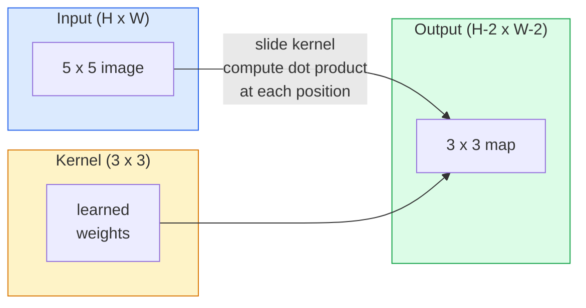
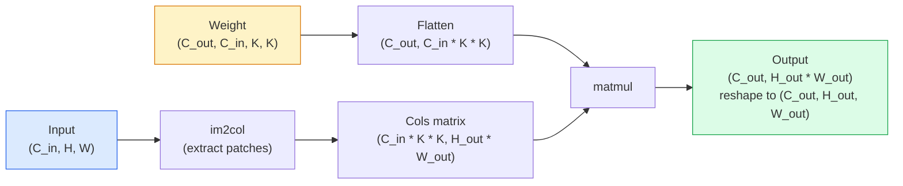

# Convolucciones desde cero

> La convolución es una capa densa muy pequeña, la haces pasar por una imagen y comparte el mismo grupo de peso en cada posición.

**Type:** Build
**Languages:** Python
**Prerequisites:** Phase 3 (Deep Learning Core), Phase 4 Lesson 01 (Image Fundamentals)
**Time:** ~75 分钟

## El objetivo del aprendizaje
- Sólo utilizar NumPy desde el punto de vista de la realización de la convolución 2D, incluyendo en el bucle de anidación  versión y vectorizada `im2col` versión
- 针对输入尺寸、内核尺寸、padding 和 step 的任意组合,计算输出空间尺寸,并解释 `(H - K + 2P) / S + 1`公式为什么成立
- Hand工设计 kernels ((edge、blur、sharpen、Sobel), y explicar por qué se producen las activaciones de la respuesta 模式
- La convulsión se acumula en un extractor de características, y la profundidad de la convulsión se conecta con el tamaño del campo receptivo.

##  problemas
En una imagen RGB de 224x224 usando una capa completamente conectada, cada neurona necesita 224 * 224 * 3 = 150,528 p/s de peso de entrada. Una capa oculta de sólo 1.000 unidades ya tiene 1.5 mil millones de parámetros, y esto es antes de que aprendas algo útil. Lo peor es que esta capa no sabe que un perro en la esquina superior izquierda y un perro en la esquina inferior derecha son el mismo modelo.

El modelo de imagen requiere dos características:**translation equivariance**(Inputo movido cuando la salida también se mueve) y **parameter sharing**(El mismo detector de características en todas las ubicaciones)

La conversión no fue inventada para el aprendizaje profundo. También es la compresión JPEG, la detección de borros gaussianos en Photoshop, la detección de bordes en la visión industrial, así como casi todas las operaciones detrás del filtro de audio. La razón de que las CNN de 2012 a 2020 dominan ImageNet es que la conversión es una forma adecuada para este tipo de datos.

## 概念
### Un núcleo, deslizándose

La convolución 2D tomará una pequeña matriz de peso llamada kernel, la pasará a través de la entrada y en cada posición calculará cada elemento multiplicado por su y.



Un ejemplo concreto de 3x3, entrada para 5x5 ((no relleno, paso 1):

```
Input X (5 x 5):                Kernel W (3 x 3):

  1  2  0  1  2                   1  0 -1
  0  1  3  1  0                   2  0 -2
  2  1  0  2  1                   1  0 -1
  1  0  2  1  3
  2  1  1  0  1

The kernel slides across every valid 3 x 3 window. Output Y is 3 x 3:

 Y[0,0] = sum( W * X[0:3, 0:3] )
 Y[0,1] = sum( W * X[0:3, 1:4] )
 Y[0,2] = sum( W * X[0:3, 2:5] )
 Y[1,0] = sum( W * X[1:4, 0:3] )
 ... and so on
```

Esta es una fórmula, es decir.**shared weights、locality、sliding window**, es todo un pensamiento completo. Todo lo demás es contabilidad.

### Formula de tamaño de salida

给定输入空间尺寸 `H`、tamaño del núcleo `K`、padding `P`、 paso `S`¿Qué es esto ?

```
H_out = floor( (H - K + 2P) / S ) + 1
```

Remememorándola. Lo calcularás en cada arquitectura.

| Scenario | H | K | P | S | H_out |
|----------|---|---|---|---|-------|
| Valid conv，无 padding | 32 | 3 | 0 | 1 | 30 |
| Same conv（保持尺寸） | 32 | 3 | 1 | 1 | 32 |
| 按 2 倍 downsample | 32 | 3 | 1 | 2 | 16 |
| Pool 2x2 | 32 | 2 | 0 | 2 | 16 |
| 大 receptive field | 32 | 7 | 3 | 2 | 16 |

"El mismo relleno" significa seleccionar P, para que cuando S == 1 时 H_out == H。 para el núcleo extraño K,也就是 P = (K - 1) / 2。

### Padding

 sin relleno , cada convolución reducirá el mapa de características                                                                                                                                                                                                                                                      

```
Zero padding (P = 1) on a 5 x 5 input:

  0  0  0  0  0  0  0
  0  1  2  0  1  2  0
  0  0  1  3  1  0  0
  0  2  1  0  2  1  0       Now the kernel can centre on pixel
  0  1  0  2  1  3  0       (0, 0) and still have three rows and
  0  2  1  1  0  1  0       three columns of values to multiply.
  0  0  0  0  0  0  0
```

实践中会遇到的模式:`zero`(más comúnmente)`reflect`(镜像边缘, en modelos generativos entre evitar un límite duro)`replicate`(Replicar el borde)`circular`(Environ, en problemas toroidales 中使用)

### El paso

El paso es un paso de movimiento.`stride=1`Es un valor de seguridad.`stride=2`Cada tipo de arquitectura moderna (ResNet,ConvNeXt,MobileNet) se utiliza en algún lugar con convases de paso a paso para reemplazar el máximo pool).

```
Stride 1 on a 5 x 5 input, 3 x 3 kernel:

  starts: (0,0) (0,1) (0,2)        -> output row 0
          (1,0) (1,1) (1,2)        -> output row 1
          (2,0) (2,1) (2,2)        -> output row 2

  Output: 3 x 3

Stride 2 on the same input:

  starts: (0,0) (0,2)              -> output row 0
          (2,0) (2,2)              -> output row 1

  Output: 2 x 2
```

### Cánalles de entrada múltiples

En realidad, cada entrada tiene un pedazo de 3x3 en cada posición espacial, se multiplican y se suman los tres pedazos, y se agrega un sesgo.

```
Input:   (C_in,  H,  W)        3 x 5 x 5
Kernel:  (C_in,  K,  K)        3 x 3 x 3 (one kernel)
Output:  (1,     H', W')       2D map

For a layer that produces C_out output channels, you stack C_out kernels:

Weight:  (C_out, C_in, K, K)   e.g. 64 x 3 x 3 x 3
Output:  (C_out, H', W')       64 x 3 x 3

Parameter count: C_out * C_in * K * K + C_out   (the + C_out is biases)
```

Última línea es el contenido de tu modelo de planificación.`64 * 3 * 3 * 3 + 64 = 1,792`个参数── es muy conveniente──

### El truco de im2col

Los bucles anidados  fácil de leer, pero muy lento. Los GPUs  quieren que las matrices grandes se multipliquen.



Cada nivel de producción de con- puesta en práctica es este pensamiento y el caché de la técnica de algún tipo de variación de la técnica de con- puesta en caché de la técnica de con- puesta en caché de la máquina de la máquina de la máquina de la máquina de la máquina de la máquina de la máquina de la máquina de la máquina de la máquina de la máquina de la máquina de la máquina de la máquina de la máquina de la máquina de la máquina de la máquina de la máquina de la máquina de la máquina de la máquina de la máquina de la máquina de la máquina de la máquina de la máquina de la máquina de la máquina de la máquina de la máquina de caché de la máquina de la máquina de la máquina de la máquina de la máquina de la máquina de la máquina de la máquina de caché de la máquina de la máquina de la máquina de la máquina de la máquina de la máquina de la máquina de la máquina de la máquina de la máquina de la máquina de la máquina de la máquina de la máquina de la máquina de la máquina de la máquina de la máquina de la máquina de la máquina de la máquina de la máquina de la máquina de la máquina de la máquina de la máquina de la máquina de la máquina de la máquina de la máquina de la máquina de la máquina de la máquina de la máquina de la máquina de la máquina de la máquina de la máquina de la máquina de la máquina de la máquina de la máquina de la máquina de la máquina de la máquina de la máquina de la máquina de la máquina de la máquina de la máquina de la máquina de la máquina de la máquina de la máquina de la máquina de la máquina de la máquina de la máquina de la máquina de la máquina de la máquina de la máquina de la máquina de la máquina de la máquina de la máquina de la máquina de la máquina de la máquina de la máquina de la máquina de la máquina de la máquina de la máquina de la máquina de la máquina de la máquina de la máquina de la máquina de la máquina de la máquina de la máquina de la máquina de la máquina de la máquina de la máquina de la máquina de la máquina de la máquina de la máquina de la máquina de la máquina de la máquina de la máquina de la máquina de la máquina de la máquina de la máquina de la máquina de la máquina de la máquina de la máquina de la máquina de la máquina de la máquina de la máquina de la máquina de la máquina de la máquina de la máquina de la máquina de la máquina de

### Campo de recepción

单个3x3 conv 会查看9 输入像素──堆叠两个3x3 conv, una neurona en la segunda capa 会查看5x5 输入像素──三个3x3 conv 给出7x7──一般来说:

```
RF after L stacked K x K convs (stride 1) = 1 + L * (K - 1)

With strides:   RF grows multiplicatively with stride along each layer.
```

La razón fundamental de que "一路 3x3" 能够有效(VGG、ResNet、ConvNeXt) sea válida es que dos convases 3x3 看到的输入区域与一个5x5 conv 类似, pero los参数 son menores, y en el medio hay una no linealidad──


```figure
convolution-kernel
```

## Construirlo
### Paso 1: Ponga un cuadro

Desde el mínimo de primitivo 开始: una en la matriz H x W  alrededor de complementar a 0 de la función。

```python
import numpy as np

def pad2d(x, p):
    if p == 0:
        return x
    h, w = x.shape[-2:]
    out = np.zeros(x.shape[:-2] + (h + 2 * p, w + 2 * p), dtype=x.dtype)
    out[..., p:p + h, p:p + w] = x
    return out

x = np.arange(9).reshape(3, 3)
print(x)
print()
print(pad2d(x, 1))
```

Actos de seguimiento 技巧 `x.shape[:-2]`De hecho, la misma función sin necesidad de modificación puede funcionar en `(H, W)`¿Qué es esto?`(C, H, W)`O `(N, C, H, W)`¿Qué es eso?

### Paso 2: Utiliza un ciclo de implantes para lograr una convolución 2D

参考实现:慢,但毫不含糊. En principio, esto es todo.`torch.nn.functional.conv2d`Hacer cosas.

```python
def conv2d_naive(x, w, b=None, stride=1, padding=0):
    c_in, h, w_in = x.shape
    c_out, c_in_w, kh, kw = w.shape
    assert c_in == c_in_w

    x_pad = pad2d(x, padding)
    h_out = (h + 2 * padding - kh) // stride + 1
    w_out = (w_in + 2 * padding - kw) // stride + 1

    out = np.zeros((c_out, h_out, w_out), dtype=np.float32)
    for oc in range(c_out):
        for i in range(h_out):
            for j in range(w_out):
                hs = i * stride
                ws = j * stride
                patch = x_pad[:, hs:hs + kh, ws:ws + kw]
                out[oc, i, j] = np.sum(patch * w[oc])
        if b is not None:
            out[oc] += b[oc]
    return out
```

Cuatro bucles anidados (enlace de salida, línea, columna, re-agregación a la C_in,kh,kw)

### Paso 3: Verificación del kernel con diseño manual

Construir un núcleo de Sobel vertical, aplicarlo a una imagen de paso de sintetizado arriba, y luego observar el borde vertical 被点亮──

```python
def synthetic_step_image():
    img = np.zeros((1, 16, 16), dtype=np.float32)
    img[:, :, 8:] = 1.0
    return img

sobel_x = np.array([
    [[-1, 0, 1],
     [-2, 0, 2],
     [-1, 0, 1]]
], dtype=np.float32)[None]

x = synthetic_step_image()
y = conv2d_naive(x, sobel_x, padding=1)
print(y[0].round(1))
```

预期在第7 列出现较大的正值(从左到右亮度增加),其他位置为零──这个印记就是你确认数学正确的理智检查──

### 步骤 4: en el

Añadir en cada ventana de tamaño de núcleo  convertir en una matriz de una columna ⋅ para `C_in=3, K=3`, cada uno de los números es de 27 .

```python
def im2col(x, kh, kw, stride=1, padding=0):
    c_in, h, w = x.shape
    x_pad = pad2d(x, padding)
    h_out = (h + 2 * padding - kh) // stride + 1
    w_out = (w + 2 * padding - kw) // stride + 1

    cols = np.zeros((c_in * kh * kw, h_out * w_out), dtype=x.dtype)
    col = 0
    for i in range(h_out):
        for j in range(w_out):
            hs = i * stride
            ws = j * stride
            patch = x_pad[:, hs:hs + kh, ws:ws + kw]
            cols[:, col] = patch.reshape(-1)
            col += 1
    return cols, h_out, w_out
```

Todavía es un ciclo de Python, pero ahora el cálculo pesado se convierte en una matmul vectorial.

### Paso 5: a través de im2col + matmul                                                                                                                                                                                                                                                                                                                                                                                                                                                                                                                   

Usando una vez la multiplicación de la matriz sustituir el ciclo cuadruplo.

```python
def conv2d_im2col(x, w, b=None, stride=1, padding=0):
    c_out, c_in, kh, kw = w.shape
    cols, h_out, w_out = im2col(x, kh, kw, stride, padding)
    w_flat = w.reshape(c_out, -1)
    out = w_flat @ cols
    if b is not None:
        out += b[:, None]
    return out.reshape(c_out, h_out, w_out)
```

Verificación de exactitud: se realizan dos comparancias.

```python
rng = np.random.default_rng(0)
x = rng.normal(0, 1, (3, 16, 16)).astype(np.float32)
w = rng.normal(0, 1, (8, 3, 3, 3)).astype(np.float32)
b = rng.normal(0, 1, (8,)).astype(np.float32)

y_naive = conv2d_naive(x, w, b, padding=1)
y_im2col = conv2d_im2col(x, w, b, padding=1)

print(f"max abs diff: {np.max(np.abs(y_naive - y_im2col)):.2e}")
```

`max abs diff`¿ Qué es eso ?`1e-5`左右── esta diferencia proviene de un punto flotante 累加顺序, no de un bug──

### Paso 6: Un grupo de núcleos de diseño manual

5 filtros, muestra una sola capa de conventos que puede expresar antes de cualquier entrenamiento.

```python
KERNELS = {
    "identity": np.array([[0, 0, 0], [0, 1, 0], [0, 0, 0]], dtype=np.float32),
    "blur_3x3": np.ones((3, 3), dtype=np.float32) / 9.0,
    "sharpen": np.array([[0, -1, 0], [-1, 5, -1], [0, -1, 0]], dtype=np.float32),
    "sobel_x": np.array([[-1, 0, 1], [-2, 0, 2], [-1, 0, 1]], dtype=np.float32),
    "sobel_y": np.array([[-1, -2, -1], [0, 0, 0], [1, 2, 1]], dtype=np.float32),
}

def apply_kernel(img2d, kernel):
    x = img2d[None].astype(np.float32)
    w = kernel[None, None]
    return conv2d_im2col(x, w, padding=1)[0]
```

 aplicado a cualquier imagen a escala de gris 上时,blur 会柔化,sharpen 会让边缘更清晰,Sobel-x 会点亮垂直边缘,Sobel-y 会点亮水平边缘──正正是AlexNet 和 VGG中第一个训练出的 conv layer 最终学到的模式,因为优秀的图像模型无论后续任务是什么,都需要边缘和斑探测器──

## Usalo
PyTorch de `nn.Conv2d`Utilizando autograd, CUDA y cuDNN optimización  empaquetado en el mismo operativo.

```python
import torch
import torch.nn as nn

conv = nn.Conv2d(in_channels=3, out_channels=64, kernel_size=3, stride=1, padding=1)
print(conv)
print(f"weight shape: {tuple(conv.weight.shape)}   # (C_out, C_in, K, K)")
print(f"bias shape:   {tuple(conv.bias.shape)}")
print(f"param count:  {sum(p.numel() for p in conv.parameters())}")

x = torch.randn(8, 3, 224, 224)
y = conv(x)
print(f"\ninput  shape: {tuple(x.shape)}")
print(f"output shape: {tuple(y.shape)}")
```

¿ Qué ?`padding=1`换成   cambió`padding=0`, , , , , , , , , , , , , , , , , , , , , , , , , , , , , , , , , , , , , , , , , , , , , , , , , , , , , , , , , , , , , , , , , , , , , , , , , , , , , , , , , , , , , , , , , , , , , , , , , , , , , , , , , , , , , , , , , , , , , , , , , , , , , , , , , , , , , , , , , , , , , , , , , , , , , , , , , , , , , , , , , , , , , , , , , , , , , , , , , , , , , , , , , , , , , , , , , , , , , , , , , , , , , , , , , , , , , , , , , , , , , , , , , , , , , , , , , , , , , , , , , , , , , , , , , , , , , , , , , , , , , , , , , , , , , , , , , , , , , , , , , , , , , , , , , , , , , , , , , , , , , , , , , , , , , , , , , , , , , , , , , , , , , , , , , , , , , , , , , , , , , , , , , , , , , , , , , , , , , , , , , , , , , , , , , , , , , , , , , , , , , , , , , , , , , , , , , , , , , , , , , , , , , , , , , , , , , , , , , , , , , , , , , , , , , , , , , , , , , , , , , , , , , , , , , , , , , , , , , , , , , , , , , , , , , , , , , , , , , , , , , , , , , , , , , , , , , , , , , y , , , , , , , , , , , ,`stride=1`换成   cambió`stride=2`, perdidas en la reducción a 112x112... es la misma fórmula que recordaste.

##  entregarlo
Encuentro de trabajo:

- `outputs/prompt-cnn-architect.md`: un prompt, dado el tamaño de entrada determinado, presupuesto y parámetro objetivo campo receptivo 后, diseño一组 `Conv2d`Las capas, y en cada paso utilizar el K/S/P correcto
- `outputs/skill-conv-shape-calculator.md`Una habilidad, cada uno de los niveles de la especificación de red, y regresa a la forma de salida de cada bloque, campo receptivo y número de parámetros.

##  ejercicios
1. **(Easy)**给定一个 128x128 grayscale 输入,以及一组 `[Conv3x3(s=1,p=1), Conv3x3(s=2,p=1), Conv3x3(s=1,p=1), Conv3x3(s=2,p=1)]`, manualmente calcula cada nivel de tamaño de espacio de salida y campo receptivo .`nn.Sequential` realizar la prueba.
2. **(Medium)**扩展 `conv2d_naive`Y `conv2d_im2col`, que las acepten .`groups`参数―― prueba `groups=C_in=C_out`Puede volver a ver la convolución de profundidad, y su parámetro cuenta es `C * K * K`, en lugar de`C * C * K * K`¿Qué es eso?
3. **(Hard)**  手工实现 `conv2d_im2col`de paso hacia atrás:给定输出 Gradiente, calcular `x`Y `w`de Gradiente. en la misma entrada y peso en la misma`torch.autograd.grad`验证──关键技巧是: Im2col de Gradiente es `col2im`, y debe tener una ventana sobre la otra.

## 关键术语: "El hombre es un hombre"
| Term | What people say | What it actually means |
|------|----------------|----------------------|
| Convolution | “滑动一个 filter” | 一个在每个空间位置用 shared weights 应用的可学习 dot product；数学上是 cross-correlation，但大家都叫它 convolution |
| Kernel / filter | “feature detector” | 一个形状为 (C_in, K, K) 的小型 weight tensor，它与输入窗口的 dot product 会产生一个输出像素 |
| Stride | “每次跳多远” | 连续 kernel placements 之间的步长；stride 2 会让每个空间维度减半 |
| Padding | “边缘上的零” | 在输入周围添加的额外值，使 kernel 可以以边界像素为中心；`same` padding 会让输出尺寸等于输入尺寸 |
| Receptive field | “neuron 能看到多少” | 某个输出 activation 所依赖的原始输入 patch，会随着深度和 stride 增长 |
| im2col | “GEMM trick” | 把每个 receptive window 重排成列，让 convolution 变成一次大型 matrix multiply，这是每个快速 conv kernel 的核心 |
| Depthwise conv | “每个 channel 一个 kernel” | 一个满足 `groups == C_in` 的 conv，每个输出 channel 只由匹配的输入 channel 计算得到；是 MobileNet 和 ConvNeXt 的 backbone |
| Translation equivariance | “输入平移，输出平移” | 输入平移 k 个像素时，输出也平移 k 个像素的性质；shared weights 天然带来这个性质 |

## 延伸阅读
- [A guide to convolution arithmetic for deep learning (Dumoulin & Visin, 2016)](https://arxiv.org/abs/1603.07285) Cada门课程都会借鉴的填充/步骤/扩张 权威图解
- [CS231n: Convolutional Neural Networks for Visual Recognition](https://cs231n.github.io/convolutional-networks/) 经典讲座笔记,incluyendo inicial im2col 解释
- [The Annotated ConvNet (fast.ai)](https://nbviewer.org/github/fastai/fastbook/blob/master/13_convolutions.ipynb) Un cuaderno de escritura a mano convolución 走到训练数字分类器
- [Receptive Field Arithmetic for CNNs (Dang Ha The Hien)](https://distill.pub/2019/computing-receptive-fields/)                                                                                                                                                                                                                                                              
