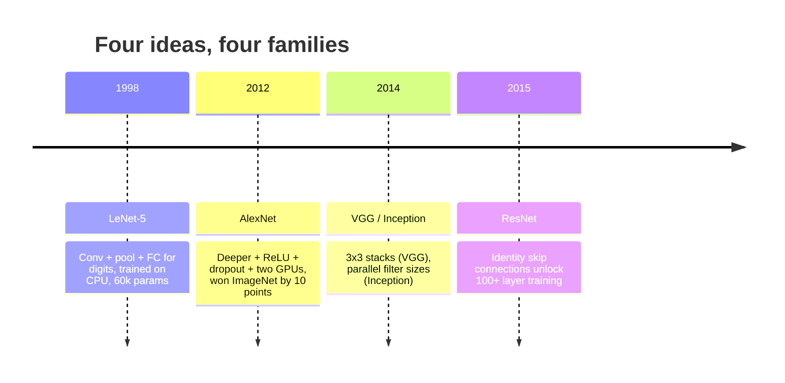
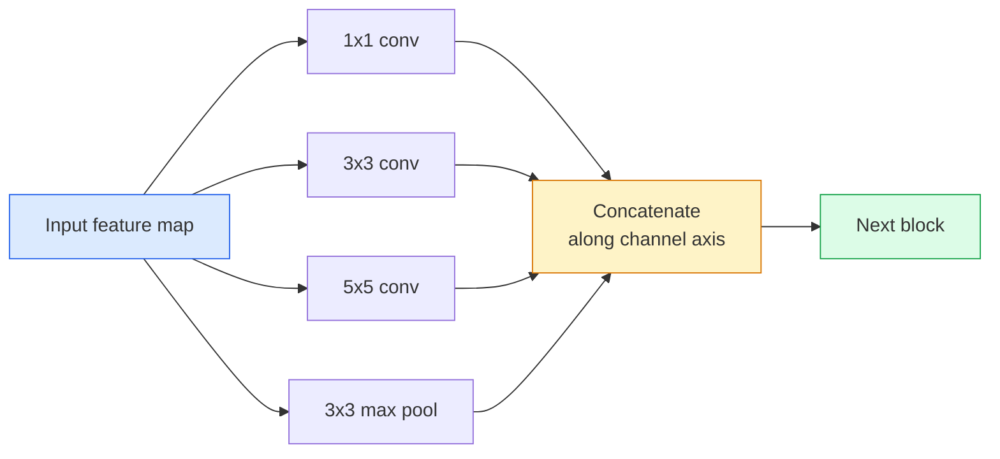
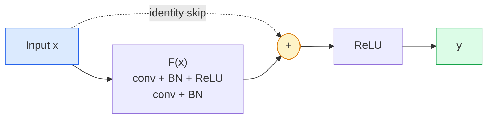

# CNNs  LeNet a ResNet

> En los últimos tres años, cada CNN importante, en esencia, es la misma no linealidad, muestra de la forma, recopilación de una nueva idea.

**Type:** 学习 + 构建
**Languages:** Python
**先修要求：**Fase 3 Lección 11 (PyTorch), Fase 4 Lección 01 (Imagen Fundamentales), Fase 4 Lección 02 (Convolucciones desde cero)
**Time:** ~75 分钟

## El objetivo del aprendizaje
-  追踪 LeNet-5 -> AlexNet -> VGG -> Inception -> ResNet's architecture repertoire,并说明每个家庭贡献的单一新想法
- En PyTorch implementar LeNet-5 、 un bloque de estilo VGG, así como un ResNet BasicBlock, cada uno de ellos controlado en 40 行内
- Explicar por qué las conexiones residuales pueden convertir una red de 1.000 capas incesante en el estado de la técnica
- 阅读一个现代脊柱 (ResNet-18, ResNet-50), y查看源码前预测 su forma de salida、campo receptivo 和 parámetro de conteo

##  problemas
En 2011, la mejor clasificación de ImageNet fue de 74% en 2012 y AlexNet alcanzó el 85% en 2015 y ResNet alcanzó el 96% en 2015 y no hay nuevos datos. No hay nueva generación de GPU. Se trata de un proyecto de arquitectura. Un ingeniero de visión que puede trabajar debe saber qué idea viene de qué artículo, ya que cada uno de los artículos de producción que se publicará en 2026 es una reestructuración de estos mismos componentes.

按顺序学习这些网络也能让你避免一个常见错误: en una red de tamaño LeNet就能解决问题时,直接使用可用的最大模型――MNIST 不需要ResNet――了解每个家庭的规模曲线,能告诉你应该落在曲线的位置――

## 概念
###  Cambiar la visión                                                                                                                                                                                                                                                                                                                                                                                                                                                                                                                         



En la visión clásica, nada más importante que este cuatro saltos.

### LeNet-5 (1998)

El reconocedor de dígitos de Yann LeCun ∼60.000 个参数── dos bloques de conjuntos ∼ dos capas completamente conectadas ∼ tanh activaciones── define cada modelo de CNN 继承:

```
input (1, 32, 32)
  conv 5x5 -> (6, 28, 28)
  avg pool 2x2 -> (6, 14, 14)
  conv 5x5 -> (16, 10, 10)
  avg pool 2x2 -> (16, 5, 5)
  flatten -> 400
  dense -> 120
  dense -> 84
  dense -> 10
```

El mundo moderno dice que CNN, es decir, la conversión alterna y la muestreo inferior, vuelve a tener una cabeza de clasificador pequeño, en esencia es la capa de más, canales, más, activaciones, mejor LeNet.

### AlexNet (2012)

Tres cambios en la red ImageNet:

1. ¿ Qué ?**ReLU**替代 tanh──Gradientes no desaparecen más──entrenamiento velocidad提升六倍──
2. En la cabeza totalmente conectada 中使用 **Dropout**La regularización se convierte en una capa, no en una técnica.
3. **Depth and width**❖ Cinco capas de conventos, tres capas densas, parámetros 60M, en dos bloques de GPUs

La figura 2 del artículo todavía muestra la división de la GPU, es decir, dos flujos paralelos. Este paralelismo es una solución a nivel de hardware, no una estructura.

### VGG (2014)

VGG  pregunta una pregunta: ¿Qué pasaría si usas 3x3 convolutions, y continuas creciendo?

```
stack:   conv 3x3 -> conv 3x3 -> pool 2x2
repeat:  16 or 19 conv layers
```

两个 convases 3x3 See de la superficie de entrada con una conva 5x5 similar, pero los parámetros más pequeños (2 * 9 * C^2 = 18C^2 vs 25 * C^2), y en el medio extra un ReLU。 VGG Colocar esta observación en la estructura completa。 Su sencillez, es decir, un tipo de bloque 反复堆叠, hacer que sea el punto de referencia de todas las estructuras.

代价: 138M parámetros, entrenamiento lento, inferencia 昂贵

### La creación (2014,同年)

¿Qué tamaño de núcleo debería usar Google?



Cada rama de la ciudad se especializa en: 1x1 para mezclar canales, 3x3 para texturas locales, 5x5 para patrones más grandes, conjugando para características invariables de turno; concatenar 让下一层选择任何有用的分支.

### Problemas de degradación

Hasta 2015, VGG-19 能工作, mientras que VGG-32 不能──Deepth debería haber ayudado, pero después de más de 20 niveles, la pérdida de entrenamiento y la pérdida de pruebas han cambiado.

```
Plain deep network:
  y = f_L( f_{L-1}( ... f_1(x) ... ) )

Gradient wrt early layer:
  dL/dW_1 = dL/dy * df_L/df_{L-1} * ... * df_2/df_1 * df_1/dW_1

Each multiplicative term has magnitude roughly (weight magnitude) * (activation gain).
Stack 100 of them with gains < 1 and the gradient is effectively zero.
```

VGG puede trabajar en 19 niveles, es debido a la norma de lote (casi al mismo tiempo) permite que las activaciones mantengan una buena medida, pero incluso la norma de lote, también no puede salvar más de 30 niveles de profundidad o más.

### ResNet (2015)

Él, Zhang, Ren, Sun propusieron una solución para todo.

```
standard block:   y = F(x)
residual block:   y = F(x) + x
```

`+ x`Se muestra la capa 总能通过把 `F(x)`推到零来选择什么都不做── un ResNet de 1.000 capas 现在最差也不差比1 layer network 差,因为 cada bloque adicional tiene una pequeña escotilla de escape──有这个保证,Optimizer 愿意让每个块 变得*稍微*有用;而稍微有用的块 堆叠100次,就是最先进的──



Los dos cambios de este bloque son visibles en todas partes:

- **BasicBlock**(ResNet-18, ResNet-34): dos tres convases, saltar 跨过二者──
- **Bottleneck**(ResNet-50, -101, -152): 1x1 abajo, 3x3 medio, 1x1 arriba, saltar 跨过三者──Cuando el canal cuenta 很高时更便宜──

Cuando saltar  tenían que cruzar la muestra descendente (pasada=2) 时, la ruta de identidad 会被替换为一个1x1 paso=2 conv,以匹配形──

### ¿Por qué los residuos significan más que la visión?

Esta idea realmente no se preocupa por la clasificación de imágenes. Se trata de transformar las redes profundas de Gradients en herramientas de ingeniería fiables y ampliables. En la siguiente etapa, cada transformador que leerás, en cada bloque, tendrá la misma conexión de salto.


```figure
pooling
```

## Construirlo
### Paso 1: LeNet-5

Una mínima y fiel LeNet.Tanh activaciones, media de agrupación.`nn.CrossEntropyLoss`, en lugar de las conexiones gaussianas originales.

```python
import torch
import torch.nn as nn
import torch.nn.functional as F

class LeNet5(nn.Module):
    def __init__(self, num_classes=10):
        super().__init__()
        self.conv1 = nn.Conv2d(1, 6, kernel_size=5)
        self.conv2 = nn.Conv2d(6, 16, kernel_size=5)
        self.pool = nn.AvgPool2d(2)
        self.fc1 = nn.Linear(16 * 5 * 5, 120)
        self.fc2 = nn.Linear(120, 84)
        self.fc3 = nn.Linear(84, num_classes)

    def forward(self, x):
        x = self.pool(torch.tanh(self.conv1(x)))
        x = self.pool(torch.tanh(self.conv2(x)))
        x = torch.flatten(x, 1)
        x = torch.tanh(self.fc1(x))
        x = torch.tanh(self.fc2(x))
        return self.fc3(x)

net = LeNet5()
x = torch.randn(1, 1, 32, 32)
print(f"output: {net(x).shape}")
print(f"params: {sum(p.numel() for p in net.parameters()):,}")
```

Producción esperada: `output: torch.Size([1, 10])`¿ Qué ?`params: 61,706`This is the complete digit classifier of OpenModern Vision

### Paso 2: Un bloque de VGG

Un bloque recíproco: dos convases 3x3, ReLU, norma de lote, piscina máxima.

```python
class VGGBlock(nn.Module):
    def __init__(self, in_c, out_c):
        super().__init__()
        self.conv1 = nn.Conv2d(in_c, out_c, kernel_size=3, padding=1)
        self.bn1 = nn.BatchNorm2d(out_c)
        self.conv2 = nn.Conv2d(out_c, out_c, kernel_size=3, padding=1)
        self.bn2 = nn.BatchNorm2d(out_c)
        self.pool = nn.MaxPool2d(2)

    def forward(self, x):
        x = F.relu(self.bn1(self.conv1(x)))
        x = F.relu(self.bn2(self.conv2(x)))
        return self.pool(x)

class MiniVGG(nn.Module):
    def __init__(self, num_classes=10):
        super().__init__()
        self.stack = nn.Sequential(
            VGGBlock(3, 32),
            VGGBlock(32, 64),
            VGGBlock(64, 128),
        )
        self.head = nn.Sequential(
            nn.AdaptiveAvgPool2d(1),
            nn.Flatten(),
            nn.Linear(128, num_classes),
        )

    def forward(self, x):
        return self.head(self.stack(x))

net = MiniVGG()
x = torch.randn(1, 3, 32, 32)
print(f"output: {net(x).shape}")
print(f"params: {sum(p.numel() for p in net.parameters()):,}")
```

En la entrada de tamaño CIFAR, se utilizan tres bloques VGG, una piscina adaptativa, una capa lineal. Aproximadamente 290k parámetros.

### Paso 3: Un ResNet BasicBlock

El bloque central de la ResNet-18 y la ResNet-34

```python
class BasicBlock(nn.Module):
    def __init__(self, in_c, out_c, stride=1):
        super().__init__()
        self.conv1 = nn.Conv2d(in_c, out_c, kernel_size=3, stride=stride, padding=1, bias=False)
        self.bn1 = nn.BatchNorm2d(out_c)
        self.conv2 = nn.Conv2d(out_c, out_c, kernel_size=3, stride=1, padding=1, bias=False)
        self.bn2 = nn.BatchNorm2d(out_c)
        if stride != 1 or in_c != out_c:
            self.shortcut = nn.Sequential(
                nn.Conv2d(in_c, out_c, kernel_size=1, stride=stride, bias=False),
                nn.BatchNorm2d(out_c),
            )
        else:
            self.shortcut = nn.Identity()

    def forward(self, x):
        out = F.relu(self.bn1(self.conv1(x)))
        out = self.bn2(self.conv2(out))
        out = out + self.shortcut(x)
        return F.relu(out)
```

Conv las capas arriba de `bias=False`Es una norma de lote, ya que el parámetro beta de BN ya ha tratado el sesgo, así que a la vez lleva con el sesgo de conformación es el gasto.`shortcut`Sólo necesito una verdadera convicción, si no es una identidad sin operaciones.

### Paso 4: Una pequeña ResNet

堆叠四组 BasicBlocks, obtener una adecuada para las entradas de tamaño CIFAR de la ResNet de trabajo.

```python
class TinyResNet(nn.Module):
    def __init__(self, num_classes=10):
        super().__init__()
        self.stem = nn.Sequential(
            nn.Conv2d(3, 32, kernel_size=3, stride=1, padding=1, bias=False),
            nn.BatchNorm2d(32),
            nn.ReLU(inplace=True),
        )
        self.layer1 = self._make_group(32, 32, num_blocks=2, stride=1)
        self.layer2 = self._make_group(32, 64, num_blocks=2, stride=2)
        self.layer3 = self._make_group(64, 128, num_blocks=2, stride=2)
        self.layer4 = self._make_group(128, 256, num_blocks=2, stride=2)
        self.head = nn.Sequential(
            nn.AdaptiveAvgPool2d(1),
            nn.Flatten(),
            nn.Linear(256, num_classes),
        )

    def _make_group(self, in_c, out_c, num_blocks, stride):
        blocks = [BasicBlock(in_c, out_c, stride=stride)]
        for _ in range(num_blocks - 1):
            blocks.append(BasicBlock(out_c, out_c, stride=1))
        return nn.Sequential(*blocks)

    def forward(self, x):
        x = self.stem(x)
        x = self.layer1(x)
        x = self.layer2(x)
        x = self.layer3(x)
        x = self.layer4(x)
        return self.head(x)

net = TinyResNet()
x = torch.randn(1, 3, 32, 32)
print(f"output: {net(x).shape}")
print(f"params: {sum(p.numel() for p in net.parameters()):,}")
```

Cuatro grupos de bloque, cada grupo dos. Segundo, tres, cuatro grupos de inicio de uso paso dos. Cada muestra baja de canal cuenta el doble. Aproximadamente 2,8M parámetros.

### Paso 5: Comparación de la eficiencia de parámetro a característica

Cuando se entre en tres redes, se cuentan los parámetros.

```python
def summary(name, net, x):
    y = net(x)
    params = sum(p.numel() for p in net.parameters())
    print(f"{name:12s}  input {tuple(x.shape)} -> output {tuple(y.shape)}  params {params:>10,}")

x = torch.randn(1, 3, 32, 32)
summary("LeNet5",     LeNet5(),       torch.randn(1, 1, 32, 32))
summary("MiniVGG",    MiniVGG(),      x)
summary("TinyResNet", TinyResNet(),   x)
```

Tres modelos, tres tiempos, parámetro de recuento 相差三个数级──对于CIFAR-10精度,训练几个时代 后大致需要:LeNet 60%,MiniVGG 89%,TinyResNet 93%──

## Usalo
`torchvision.models`提供上所有模型的预训练版本──不同家族的呼叫签名 完全一致, esto es exactamente lo que significa la abstracción de la columna vertebral──

```python
from torchvision.models import resnet18, ResNet18_Weights, vgg16, VGG16_Weights

r18 = resnet18(weights=ResNet18_Weights.IMAGENET1K_V1)
r18.eval()

print(f"ResNet-18 params: {sum(p.numel() for p in r18.parameters()):,}")
print(r18.layer1[0])
print()

v16 = vgg16(weights=VGG16_Weights.IMAGENET1K_V1)
v16.eval()
print(f"VGG-16   params: {sum(p.numel() for p in v16.parameters()):,}")
```

ResNet-18 tiene 11.7M parámetros──VGG-16 tiene 138M──ImageNet top-1 precisión 接近 (69.8% vs 71.6%)──Residual connections 给你带来12x de parámetros de eficiencia 收益──这就是为什么从2016年到ViT在 2021年出现之前,ResNet variantes siempre dominaron, y en el cálculo siguen dominando en los límites de implementación real──

Para el aprendizaje de transferencia, la preparación siempre es la misma: carga pre-entrenada, congelación de la columna vertebral, reemplazo de cabeza de clasificador

```python
for p in r18.parameters():
    p.requires_grad = False
r18.fc = nn.Linear(r18.fc.in_features, 10)
```

三行── ahora tienes un clasificador CIFAR de 10 clases, que hereda las representaciones entrenadas por ImageNet──

##  entregarlo
Encuentro de trabajo:

- `outputs/prompt-backbone-selector.md`: Una respuesta rápida, según la tarea, el tamaño del conjunto de datos y el presupuesto de cálculo  seleccionar la familia CNN (LeNet/VGG/ResNet/MobileNet/ConvNeXt) 👇
- `outputs/skill-residual-block-reviewer.md`: una habilidad, se leerá el módulo PyTorch y se marcará el salto de la conexión  error(cambio de paso 时缺少快捷切捷的启动序、BN 相对的位置)

##  ejercicios
1. **(Easy)**Hand动逐层计算 `TinyResNet`Los parámetros de la`sum(p.numel() for p in net.parameters())`¿La mayor parte del presupuesto de parámetros se ha ido a dónde, con convistas, o con cabeza de clasificación?
2. **(Medium)** implementar el bloque de cuello de botella (1x1 -> 3x3 -> 1x1 con saltar), y con él construir una red de estilo ResNet-50 de CIFAR.`TinyResNet`En comparación.
3. **(Hard)**Desde`BasicBlock`En el caso de los sistemas de conexión de CIFAR-10, se puede utilizar una red de 34 bloques "plain" y una ResNet de 34 bloques, cada uno de ellos puede utilizar 10 épocas.

## 关键术语: "El hombre es un hombre"
| Term | What people say | What it actually means |
|------|----------------|----------------------|
| Backbone | “模型” | 产生 feature map 并馈送给 task head 的 convolutional blocks 堆栈 |
| Residual connection | “Skip connection” | `y = F(x) + x`；通过将 F 设为零，让 Optimizer 学习 identity，从而让任意 depth 可训练 |
| BasicBlock | “两个带 skip 的 3x3 convs” | ResNet-18/34 的 building block：conv-BN-ReLU-conv-BN-add-ReLU |
| Bottleneck | “1x1 down，3x3，1x1 up” | ResNet-50/101/152 block；在高 channel counts 下成本低，因为 3x3 运行在缩减后的 width 上 |
| Degradation problem | “更深反而更差” | 超过约 20 个 plain conv layers 后，training error 和 test error 都会增加；由 residual connections 解决，而不是靠更多数据 |
| Stem | “第一层” | 将 3-channel input 转换为基础 feature width 的初始 conv；ImageNet 通常是 7x7 stride 2，CIFAR 通常是 3x3 stride 1 |
| Head | “分类器” | final backbone block 之后的 layers：adaptive pool、flatten、linear(s) |
| Transfer learning | “Pretrained weights” | 加载在 ImageNet 上训练过的 backbone，并且只在你的 task 上 fine-tune head |

## 延伸阅读
- [Deep Residual Learning for Image Recognition (He et al., 2015)](https://arxiv.org/abs/1512.03385) ResNet 论文; cada uno de ellos vale la pena ser estudiado
- [Very Deep Convolutional Networks (Simonyan & Zisserman, 2014)](https://arxiv.org/abs/1409.1556) VGG 论文; todavía es entender por qué es el mejor referente de 3x3
- [ImageNet Classification with Deep CNNs (Krizhevsky et al., 2012)](https://papers.nips.cc/paper_files/paper/2012/hash/c399862d3b9d6b76c8436e924a68c45b-Abstract.html) AlexNet;终结-manual-feature 时代的论文
- [Going Deeper with Convolutions (Szegedy et al., 2014)](https://arxiv.org/abs/1409.4842) Iniciación v1; todavía aparecerá en transformadores de visión
