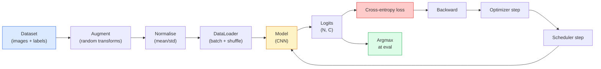

# Clasificación de imágenes

> El clasificador es una función de distribución de probabilidades desde píxeles hasta clases superiores. Todo lo demás es un tubo de trabajo.

**Type:** Build
**Languages:** Python
**Prerequisites:** Phase 2 Lesson 09 (Model Evaluation), Phase 3 Lesson 10 (Mini Framework), Phase 4 Lesson 03 (CNNs)
**Time:** ~75 minutes

## El objetivo del aprendizaje

- En CIFAR-10 la construcción de un conjunto de datos de clasificación de imágenes de extremo a extremo: conjunto de datos, aumento, modelo, ciclo de formación, evaluación
- 解释每个组件的作用(dataloader、loss、optimizer、scheduler、augmentation),并预测 cualquiera de ellos
- Desde el zero lograr mezcla, recorte y suavización de etiquetas, y explicar cuándo vale la pena añadirlos
- 阅读混亂矩阵 和 por clase de precisión/recall table, con precisión agregada 之外的信息诊断数据集与模型的失败模式

##  problemas

Cada tarea de visión final en línea, en algún nivel, se volverá a la clasificación de imágenes. La detección se realizará en regiones, la clasificación se realizará en segmentación, los píxeles se realizarán en clasificaciones. La recuperación se realizará según la similaridad de los centros de clase. La clasificación se realizará en círculos de datos, la política de aumento, pérdida, evaluación se realizará en esta fase, y se puede transferir a la capacidad central de todas las demás tareas.

La mayoría de los errores de clasificación no están en el modelo. Están en el pipeline: la normalización de los deterioros, sin cambios en el conjunto de entrenamiento, la ampliación de las etiquetas, la torsión de los datos de entrenamiento, la división de la validación de la contaminación, la tasa de aprendizaje diseminada después de la época 30. Una tasa de aprendizaje en el CIFAR-10 puede alcanzar el 93% en la CNN, en el CIFAR-10 en el conjunto de los deterioros, normalmente sólo puede obtener el 70-75%, mientras que la curva de pérdida parece todo el camino muy razonable.

Esta clase se está haciendo todo el pipeline, deja que cada parte sea revisada.`torchvision.datasets`Todo lo que pueda ocultar un insecto.

## 核心概念 核心概念 核心概念 核心概念

### Línea de clasificación



Cada línea en este ciclo puede tener errores.`model(x).softmax()`Las adiciones sólo se aplican a las entradas, no se aplican a las etiquetas, excepto a la mezcla, ya que se mezclan simultáneamente las dos.`optimizer.zero_grad()` debe ejecutarse cada paso una vez; saltando por encima de él se acumula Gradiente, parece que la tasa de aprendizaje 极不稳定── cada uno de estos errores hará que la curva de aprendizaje se aplique, pero no se lanzará errores──

### Entropia cruzada ̊logits con softmax

clasificador 会为每张图像产生 `C`个数字, denominados logits. 应用 softmax 会把它们转换为概率分布:

```
softmax(z)_i = exp(z_i) / sum_j exp(z_j)
```

La probabilidad de registro negativo de la clase de entropía cruzada 衡量正确 的负记录概率:

```
CE(z, y) = -log( softmax(z)_y )
        = -z_y + log( sum_j exp(z_j) )
```

Forma derecha es forma numérica estable (log-sum-exp)`nn.CrossEntropyLoss`En una op, se combina softmax + NLL,并 directamente recibe logits crudos.

### ¿Por qué el aumento es efectivo?

CNN tiene un sesgo inductivo (desde el reparto de peso), pero no tiene una invariencia interna en las culturas, los volticios, los nervios de color o la oclusión. La única forma de hacer que estas invariencias sean observadas es para que puedan reflejar estos cambios en los píxeles.

```
Original crop:  "dog facing left"
Flip:           "dog facing right"       <- same label, different pixels
Rotate(+15):    "dog, slight tilt"
Colour jitter:  "dog in warmer light"
RandomErasing:  "dog with patch missing"
```

规则是:augmentation 必须保留标签──对数字做切割和旋转可能将将6 变成9; para este conjunto de datos, debes usar rangos de rotación más pequeños,并选择尊重数字-specific invariances的增长──

### Mezcla y mezcla

Normal aumento 会转换像素, pero mantener las etiquetas para un solo caliente.**Mixup**Y **cutmix**Me gustaría que lo hicieran.

```
Mixup:
  lambda ~ Beta(a, a)
  x = lambda * x_i + (1 - lambda) * x_j
  y = lambda * y_i + (1 - lambda) * y_j

Cutmix:
  paste a random rectangle of x_j into x_i
  y = area-weighted mix of y_i and y_j
```

Por qué es útil: el modelo no recuerda objetivos de punta, sino que aprende entre clases                                                                                                                                                                                                                                                     

### Limpiación de etiquetas

No me lo digas.`[0, 0, 1, 0, 0]`Como objetivo de entrenamiento, sino usar `[eps/C, eps/C, 1-eps, eps/C, eps/C]`, entre ellos `eps`Es como 0.1 este tipo de pequeño valor. Impide que el modelo produzca cualquier logite de punta, y casi a ningún costo mejora la calibración. Desde PyTorch 1.10 se ha incorporado en el sistema.`nn.CrossEntropyLoss(label_smoothing=0.1)`¿Qué es eso?

### Evaluación fuera de la exactitud

La precisión agregada ocultará el desequilibrio. Si siempre predice la clase mayoritaria, también puede obtener el 90%.

- **Per-class accuracy** Cada clase un número; inmediatamente exponer la clase de la falta de rendimiento.
- **Confusion matrix** C x C rejilla, en la cual la fila i col j = clase verdadera i 被预测为类 j 的数量; diagonal 是正确预测, off-diagonales 才是模型 问题所在。
- **Top-1 / Top-5** Es cierto que la clase está en el top 1 o en el top 5 de las predicciones; Top-5 para ImageNet  es importante, porque como Norwich Terrier y Norfolk Terrier clases de este tipo                                                                                                                                                                                                                                                                                                                                                                                                                                                                          
- **Calibration (ECE)** 0.8 confianza  ¿Es realmente cierto el 80% del tiempo?  Redes modernas  sistematicamente demasiado confiadas; puede utilizarse escala de temperatura o etiqueta suavizando 


```figure
receptive-field
```

## Construirlo

### 步骤 1: conjunto de datos sintéticos de determinación

CIFAR-10  se encuentra en un disco. Para hacer que este curso pueda ser reproducido y rápido, construimos un conjunto de datos sintético que parezca a CIFAR, es decir, con una estructura específica de clase, modelo, debe aprender 32x32 imágenes RGB.

```python
import numpy as np
import torch
from torch.utils.data import Dataset


def synthetic_cifar(num_per_class=1000, num_classes=10, seed=0):
    rng = np.random.default_rng(seed)
    X = []
    Y = []
    for c in range(num_classes):
        centre = rng.uniform(0, 1, (3,))
        freq = 2 + c
        for _ in range(num_per_class):
            yy, xx = np.meshgrid(np.linspace(0, 1, 32), np.linspace(0, 1, 32), indexing="ij")
            r = np.sin(xx * freq) * 0.5 + centre[0]
            g = np.cos(yy * freq) * 0.5 + centre[1]
            b = (xx + yy) * 0.5 * centre[2]
            img = np.stack([r, g, b], axis=-1)
            img += rng.normal(0, 0.08, img.shape)
            img = np.clip(img, 0, 1)
            X.append(img.astype(np.float32))
            Y.append(c)
    X = np.stack(X)
    Y = np.array(Y)
    idx = rng.permutation(len(X))
    return X[idx], Y[idx]


class ArrayDataset(Dataset):
    def __init__(self, X, Y, transform=None):
        self.X = X
        self.Y = Y
        self.transform = transform

    def __len__(self):
        return len(self.X)

    def __getitem__(self, i):
        img = self.X[i]
        if self.transform is not None:
            img = self.transform(img)
        img = torch.from_numpy(img).permute(2, 0, 1)
        return img, int(self.Y[i])
```

Cada clase tiene su propia paleta de colores y patrón de frecuencia, reajunta el ruido gaussiano, oblige el modelo a aprender la señal, en lugar de los píxeles de memoria.

### Paso 2:Normalización y aumento

Cada línea de visión tiene estas dos transformaciones.

```python
def standardize(mean, std):
    mean = np.array(mean, dtype=np.float32)
    std = np.array(std, dtype=np.float32)
    def _fn(img):
        return (img - mean) / std
    return _fn


def random_hflip(p=0.5):
    def _fn(img):
        if np.random.random() < p:
            return img[:, ::-1, :].copy()
        return img
    return _fn


def random_crop(pad=4):
    def _fn(img):
        h, w = img.shape[:2]
        padded = np.pad(img, ((pad, pad), (pad, pad), (0, 0)), mode="reflect")
        y = np.random.randint(0, 2 * pad)
        x = np.random.randint(0, 2 * pad)
        return padded[y:y + h, x:x + w, :]
    return _fn


def compose(*fns):
    def _fn(img):
        for fn in fns:
            img = fn(img)
        return img
    return _fn
```

En el cultivo  antes de usar reflejo-pad, en lugar de cero-pad, ya que el borde negro es una señal, el modelo 会学会以一种无用的方式忽略它.

### 步骤 3: mezcla

En el paso de entrenamiento 内部混合两张图像 和两个标签── se realiza para la transformación de lote, por lo que se encuentra cerca del paso hacia adelante, en lugar de dentro del conjunto de datos──

```python
def mixup_batch(x, y, num_classes, alpha=0.2):
    if alpha <= 0:
        return x, torch.nn.functional.one_hot(y, num_classes).float()
    lam = float(np.random.beta(alpha, alpha))
    idx = torch.randperm(x.size(0), device=x.device)
    x_mixed = lam * x + (1 - lam) * x[idx]
    y_onehot = torch.nn.functional.one_hot(y, num_classes).float()
    y_mixed = lam * y_onehot + (1 - lam) * y_onehot[idx]
    return x_mixed, y_mixed


def soft_cross_entropy(logits, soft_targets):
    log_probs = torch.log_softmax(logits, dim=-1)
    return -(soft_targets * log_probs).sum(dim=-1).mean()
```

`soft_cross_entropy`Es contra la entropía cruzada de la distribución de etiquetas blandas. Cuando el objetivo es un solo calor, se descompone en una situación de calor común.

### Paso 4: Ciclo de entrenamiento

完整配方: recorrer una vez los datos, cada lote 计算一次梯度, cada época 执行一次时间表步

```python
import torch
import torch.nn as nn
from torch.utils.data import DataLoader
from torch.optim import SGD
from torch.optim.lr_scheduler import CosineAnnealingLR

def train_one_epoch(model, loader, optimizer, device, num_classes, use_mixup=True):
    model.train()
    total, correct, loss_sum = 0, 0, 0.0
    for x, y in loader:
        x, y = x.to(device), y.to(device)
        if use_mixup:
            x_m, y_soft = mixup_batch(x, y, num_classes)
            logits = model(x_m)
            loss = soft_cross_entropy(logits, y_soft)
        else:
            logits = model(x)
            loss = nn.functional.cross_entropy(logits, y, label_smoothing=0.1)
        optimizer.zero_grad()
        loss.backward()
        optimizer.step()
        loss_sum += loss.item() * x.size(0)
        total += x.size(0)
        # Training accuracy vs the un-mixed labels `y` is only an approximation
        # when mixup is on (the model saw soft targets, not y). Treat it as a
        # rough progress signal; rely on val accuracy for real performance.
        with torch.no_grad():
            pred = logits.argmax(dim=-1)
            correct += (pred == y).sum().item()
    return loss_sum / total, correct / total


@torch.no_grad()
def evaluate(model, loader, device, num_classes):
    model.eval()
    total, correct = 0, 0
    loss_sum = 0.0
    cm = torch.zeros(num_classes, num_classes, dtype=torch.long)
    for x, y in loader:
        x, y = x.to(device), y.to(device)
        logits = model(x)
        loss = nn.functional.cross_entropy(logits, y)
        pred = logits.argmax(dim=-1)
        for t, p in zip(y.cpu(), pred.cpu()):
            cm[t, p] += 1
        loss_sum += loss.item() * x.size(0)
        total += x.size(0)
        correct += (pred == y).sum().item()
    return loss_sum / total, correct / total, cm
```

Cada vez que escribe un ciclo de entrenamiento , debe revisar cinco invariantes:

1. formación 前调用 `model.train()`,Evaluación 前调用 `model.eval()`, esto cambiará el abandono y el comportamiento de la serie.
2. En el`.backward()`Pre调用 `.zero_grad()`¿Qué es eso?
3. 累积 métricas 时使用 `.item()`, así no dejará que el gráfico de cálculo siempre sobreviva.
4. evaluación 期间使用 `@torch.no_grad()`, ahorrar tiempo y memoria, prevenir pequeños accidentes.
5. Para los logitos crudos hacer argmax, en lugar de hacer argmax para softmax, el resultado es el mismo, menos una opção.

### Paso 5: Rápido

Uso de la primera clase `TinyResNet`, entrenar varias épocas, luego evaluar.

```python
from main import synthetic_cifar, ArrayDataset
from main import standardize, random_hflip, random_crop, compose
from main import mixup_batch, soft_cross_entropy
from main import train_one_epoch, evaluate
# TinyResNet comes from the previous lesson (03-cnns-lenet-to-resnet).
# Adjust the import path to wherever you stored the previous lesson's code.
from cnns_lenet_to_resnet import TinyResNet  # example placeholder

X, Y = synthetic_cifar(num_per_class=500)
split = int(0.9 * len(X))
X_train, Y_train = X[:split], Y[:split]
X_val, Y_val = X[split:], Y[split:]

mean = [0.5, 0.5, 0.5]
std = [0.25, 0.25, 0.25]
train_tf = compose(random_hflip(), random_crop(pad=4), standardize(mean, std))
eval_tf = standardize(mean, std)

train_ds = ArrayDataset(X_train, Y_train, transform=train_tf)
val_ds = ArrayDataset(X_val, Y_val, transform=eval_tf)

train_loader = DataLoader(train_ds, batch_size=128, shuffle=True, num_workers=0)
val_loader = DataLoader(val_ds, batch_size=256, shuffle=False, num_workers=0)

device = "cuda" if torch.cuda.is_available() else "cpu"
model = TinyResNet(num_classes=10).to(device)
optimizer = SGD(model.parameters(), lr=0.1, momentum=0.9, weight_decay=5e-4, nesterov=True)
scheduler = CosineAnnealingLR(optimizer, T_max=10)

for epoch in range(10):
    tr_loss, tr_acc = train_one_epoch(model, train_loader, optimizer, device, 10, use_mixup=True)
    va_loss, va_acc, _ = evaluate(model, val_loader, device, 10)
    scheduler.step()
    print(f"epoch {epoch:2d}  lr {scheduler.get_last_lr()[0]:.4f}  "
          f"train {tr_loss:.3f}/{tr_acc:.3f}  val {va_loss:.3f}/{va_acc:.3f}")
```

En el conjunto de datos sintético, alcanzará una precisión de validación casi perfecta en cinco épocas, esto es lo que se centra en: la tubería es correcta, el modelo puede aprender algo.

### Paso 6: Leer la matriz de confusión

Solo por la precisión nunca puedo decirte el modelo en donde fracasó.

```python
def print_confusion(cm, labels=None):
    c = cm.shape[0]
    labels = labels or [str(i) for i in range(c)]
    print(f"{'':>6}" + "".join(f"{l:>5}" for l in labels))
    for i in range(c):
        row = cm[i].tolist()
        print(f"{labels[i]:>6}" + "".join(f"{v:>5}" for v in row))
    print()
    tp = cm.diag().float()
    fp = cm.sum(dim=0).float() - tp
    fn = cm.sum(dim=1).float() - tp
    prec = tp / (tp + fp).clamp_min(1)
    rec = tp / (tp + fn).clamp_min(1)
    f1 = 2 * prec * rec / (prec + rec).clamp_min(1e-9)
    for i in range(c):
        print(f"{labels[i]:>6}  prec {prec[i]:.3f}  rec {rec[i]:.3f}  f1 {f1[i]:.3f}")

_, _, cm = evaluate(model, val_loader, device, 10)
print_confusion(cm)
```

行是真实类,列是预测;; entre las clases 3 y 5 出现了一非方形数, significa que el modelo 混了这两类,并为定向数据收集或类别增强提供起点;;

## Usalo

`torchvision`Todo lo que hay arriba se empaque en componentes usados. Para el verdadero CIFAR-10, todo el pipeline sólo necesita cuatro líneas, añadir un nuevo ciclo de entrenamiento.

```python
from torchvision.datasets import CIFAR10
from torchvision.transforms import Compose, RandomCrop, RandomHorizontalFlip, ToTensor, Normalize

mean = (0.4914, 0.4822, 0.4465)
std = (0.2470, 0.2435, 0.2616)
train_tf = Compose([
    RandomCrop(32, padding=4, padding_mode="reflect"),
    RandomHorizontalFlip(),
    ToTensor(),
    Normalize(mean, std),
])
eval_tf = Compose([ToTensor(), Normalize(mean, std)])

train_ds = CIFAR10(root="./data", train=True,  download=True, transform=train_tf)
val_ds   = CIFAR10(root="./data", train=False, download=True, transform=eval_tf)
```

Hay dos puntos que tener en cuenta: medio/std es **dataset-specific**En realidad, son calculadas en el conjunto de entrenamiento CIFAR-10, y no en ImageNet; el reflejo pad es la política de cultivo de la comunidad por defecto.

##  entregarlo

Encuentro de trabajo:

- `outputs/prompt-classifier-pipeline-auditor.md` Un guión de entrenamiento de auditoría rápido, para verificar si satisface las cinco invariantes anteriores, y expone la primera violación.
- `outputs/skill-classification-diagnostics.md` Una habilidad, dado matriz de confusión y nombres de clases 列表后,总结 per clase de fracasos,并提出最有影响力的单个修复──

##  ejercicios

1. **(Easy)**En el conjunto de datos sintéticos, con el mismo modelo, se ha entrenado de forma diferente y se ha combinado una versión sin mezcla, cada uno de ellos ha entrenado en cinco épocas.
2. **(Medium)**实现 Cutout: en cada imagen de entrenamiento 中随机把一个8x8 方块置零,并运行ablation,对比无增强、hflip+crop、hflip+crop+cutout、hflip+crop+mixup──报告每种设置的 val精度──
3. **(Hard)**Construir la tubería CIFAR-100(100 clases, el mismo tamaño de entrada),并复现一次ResNet-34 training run,使结果与发表精度差在1%以内──额外任务:扫三学习率和两个权重衰减,记录到本地CSV,并生成最终的混-matrix-top-confusions table──

## 关键术语: "El hombre es un hombre"

| Term | 人们通常怎么说 | 它实际是什么意思 |
|------|----------------|----------------------|
| Logits | “Raw outputs” | 每张图像对应的 pre-softmax C 维 Vector；cross-entropy 期望接收它们，而不是 softmaxed values |
| Cross-entropy | “The loss” | 正确 class 的 negative log-probability；在一个稳定 op 中结合 log-softmax 和 NLL |
| DataLoader | “The batcher” | 用 shuffling、batching 和（可选）multi-worker loading 包装 dataset；一半 training bugs 都会被怪到它头上 |
| Augmentation | “Random transforms” | training time 的任何 pixel-level transform，只要它保留 label；教会 CNN 它原生不具备的 invariances |
| Mixup / Cutmix | “Mix two images” | 同时混合 inputs 和 labels，让 classifier 学习平滑插值，而不是硬边界 |
| Label smoothing | “Softer targets” | 用 (1-eps, eps/(C-1), ...) 替换 one-hot；改善 calibration，并略微提升 accuracy |
| Top-k accuracy | “Top-5” | 正确 class 位于 k 个最高 probability predictions 之中；用于包含真实歧义 classes 的 datasets |
| Confusion matrix | “Where errors live” | C x C table，其中 entry (i, j) 统计 true class i 被预测为 j 的 images 数量；diagonal 是正确项，off-diagonal 告诉你该修什么 |

## 延伸阅读

- [CS231n: Training Neural Networks](https://cs231n.github.io/neural-networks-3/)                                                                                                                                                                                                                                                                                                                                                                                                                                                                                                                            
- [Bag of Tricks for Image Classification (He et al., 2019)](https://arxiv.org/abs/1812.01187) Todos los pequeños trucos juntos, podemos hacer que la precisión de ResNet de ImageNet en arriba  aumentar el 3-4%
- [mixup: Beyond Empirical Risk Minimization (Zhang et al., 2017)](https://arxiv.org/abs/1710.09412) El primer trabajo de mezcla; 3 páginas de teoría y experimentos convincentes
- [Why temperature scaling matters (Guo et al., 2017)](https://arxiv.org/abs/1706.04599)Este artículo prueba que las redes modernas existen errores de calibración y lo corrige con un parámetro escalar.
