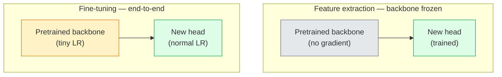

# Transferencia de aprendizaje y ajuste

> 别人已经花了上百万GPU 小时,教会一个神经网络 识别边缘、纹理和物体部件是什么样子──在训练你自己的模型之前,你应该借这些功能──

**Type:** Build
**Languages:** Python
**Prerequisites:** Phase 4 Lesson 03 (CNNs), Phase 4 Lesson 04 (Image Classification)
**Time:** ~75 minutes

## El objetivo del aprendizaje
- 区分 características extracción y ajuste fino,并 en función del tamaño del conjunto de datos, distancia del dominio y presupuesto de cálculo 选择合适方法
- Cargar la columna vertebral preentrenada, reemplazar su cabeza clasificadora y en 20 行 sólo entrenar la cabeza  obtener la línea de base disponible
- Utiliza tasas de aprendizaje discriminatorias  gradualmente descifrar las capas, haciendo que las características genéricas tempranas de la actualización amplitud sea menor que las características específicas de tareas de la última fase
- 诊断三类常见失败:bloques no congelados 上 LR 过高导致 características deriva、minian conjuntos de datos 上 BN estadísticas colapso, así como el olvido catastrófico

##  problemas
En ImageNet, entrenar una ResNet-50 requiere aproximadamente 2.000 horas de GPU. Pocos equipos pueden hacer este presupuesto para cada tarea que se haga en línea.

Este no es un paso directo. Cualquier otra cadena de televisión que haya entrenado en ImageNet, su primer bloque de conexión, el de la ciudad, aprenderá bordes y similar a Gabor. Los siguientes bloques, aprenderán texturas y simples motivos. Los bloques intermedios, aprenderán partes de objetos. Los últimos bloques, aprenderán casi un millar de categorías de ImageNet. El 90% de la estructura de esta capa puede transferirse a la imagen médica, la inspección industrial, los datos satelitales, así como a cualquier otra visión, porque los bordes y las texturas de la naturaleza son limitados. El último 10% es la parte de la formación que realmente necesitas.

Hay tres errores que te esperan: usar una tasa de aprendizaje demasiado alta para destruir características previamente entrenadas; hacer que las estadísticas de ejecución de BatchNorm se desplacen a un pequeño conjunto de datos, mientras que el resto de la red neuronal nunca ha aprendido nada de este conjunto de datos.

## 概念
### Tácticas de ajuste

两种模式, depender de si tienes más confianza en las características pre-entrenadas, así como cuántos datos tienes.



经验法则:

| Dataset size | Domain distance | Recipe |
|--------------|-----------------|--------|
| < 1k images | 接近 ImageNet | 冻结 backbone，只训练 head |
| 1k-10k | 接近 | 冻结前 2-3 个 stages，fine-tune 其余部分 |
| 10k-100k | 任意 | 使用 discriminative LR 进行 end-to-end fine-tune |
| 100k+ | 远 | Fine-tune 全部参数；如果 domain 足够远，考虑从零训练 |

 acercarse a la imagen de la red 大致 significa con contenido similar a objetos de fotos RGB naturales―censos de tomografía computarizada médica―censos por satélite y microscopía  pertenecen a dominios lejanos, características  todavía son útiles, pero necesitas permitir más capas 适应―

### ¿Por qué el congelamiento funciona en absoluto?

Las características de ImageNet que CNN ha aprendido no se adaptan específicamente a estas 1.000 categorías de imágenes. Son especialmente adaptadas a las características estadísticas de las imágenes naturales: bordes de direcciones específicas, texturas, patrones de contraste, formas primitivas. Estas características estadísticas son muy estables en casi todos los dominios visuales que el ser humano puede decir. Es por eso que un modelo entrenado en ImageNet, en CIFAR-10 con una nueva evaluación de tiro cero, sólo puede agregar una cabeza lineal (no de tono fino) con una precisión del 80%+.

### Taxas de aprendizaje discriminatorias

Cuando realmente se resuelven las primeras capas, deberían ser más lentas que las últimas. Las primeras capas son las características genéricas que quieres conservar.

```
Typical recipe:

  stage 0 (stem + first group): lr = base_lr / 100    (mostly fixed)
  stage 1:                       lr = base_lr / 10
  stage 2:                       lr = base_lr / 3
  stage 3 (last backbone group): lr = base_lr
  head:                          lr = base_lr  (or slightly higher)
```

En PyTorch, esto es sólo transmitir a los grupos de parámetros de Optimizer 列表── un modelo, cinco tasas de aprendizaje, 零额外代码──

### El problema de la norma de batch

BN capas  tenido en ImageNet `running_mean`Y `running_var`Buffers. Si tu tarea tiene una distribución de píxeles diferente, por ejemplo, diferentes iluminaciones, diferentes sensores, diferentes espacios de color, entonces estos buffers es la falla de la prioridad.

1. **在 train mode 下 fine-tune BN。**让 BN 随其它部分一起更新运行统计――当任务数据集 中等大小(>= 5k ejemplos)
2. **在 eval mode 下冻结 BN。**Mantenga las estadísticas de ImageNet, sólo entrenar pesas── Cuando tu conjunto de datos pequeño a BN de promedio móvil 会很杂时,这是正确选择──
3. **用 GroupNorm 替换 BN。**完全移除移动平均 问题──用于检测和细分背骨,因为 cada GPU 很小的批量.

Esto hace que el error sea preciso, baja del 5 al 15%...

### Diseño de la cabeza

La cabeza del clasificador es de 1-3 capas lineales, con una descarga opcional. Cada columna vertebral de la visión de la antorcha tiene una cabeza por defecto, necesitas reemplazarla.

```
backbone.fc = nn.Linear(backbone.fc.in_features, num_classes)          # ResNet
backbone.classifier[1] = nn.Linear(..., num_classes)                    # EfficientNet, MobileNet
backbone.heads.head = nn.Linear(..., num_classes)                       # torchvision ViT
```

Para los conjuntos de datos pequeños, una sola capa lineal normalmente es suficiente.  Cuando la distribución de tareas y la distribución de formación de la columna vertebral se encuentran más lejos, añadir una capa oculta                                                                                                                                                                                                                                      

### Desintegración de las capas LR

Esta es la versión más suave de LR de la moderna afinidad (BEiT, DINOv2, ViT-B) utilizada en la actualidad.

```
lr_layer_k = base_lr * decay^(L - k)
```

Cuando la descomposición = 0,75 y L = 12 bloques de transformador 时, el primer bloque de entrenamiento LR es la cabeza LR `0.75^11 ≈ 0.04x` Esto es más importante para los cambios de tono que para las CNN; para las CNN, las LR de grupo de escenarios suelen ser suficientes

### Qué evaluar

Las carreras de transferencia de aprendizaje requieren dos que no seguirán el número en el ejecutar a partir de cero:

- **Pretrained-only accuracy**La exactitud de la cabeza... es tu piso.
- **Fine-tuned accuracy** entrenamiento de extremo a extremo 后同一个模型的精度──这是你的天花板──

Si está bien ajustado 低于预训练的,你就有学习率或BN bug──始终打印两者──


```figure
transfer-learning
```

## Construirlo
### 步骤 1: Cargue una columna vertebral preentrenada y inspeccionela

```python
import torch
import torch.nn as nn
from torchvision.models import resnet18, ResNet18_Weights

backbone = resnet18(weights=ResNet18_Weights.IMAGENET1K_V1)
print(backbone)
print()
print("classifier head:", backbone.fc)
print("feature dim:", backbone.fc.in_features)
```

`ResNet18`Hay cuatro etapas.`layer1..layer4`), extra un tallo 和 uno `fc`Cada columna vertebral de la clasificación de la visión de la antorcha tiene una estructura similar.

### 步骤 2: Extracción de características  congelar todo, reemplazar la cabeza

```python
def make_feature_extractor(num_classes=10):
    model = resnet18(weights=ResNet18_Weights.IMAGENET1K_V1)
    for p in model.parameters():
        p.requires_grad = False
    model.fc = nn.Linear(model.fc.in_features, num_classes)
    return model

model = make_feature_extractor(num_classes=10)
trainable = sum(p.numel() for p in model.parameters() if p.requires_grad)
frozen = sum(p.numel() for p in model.parameters() if not p.requires_grad)
print(f"trainable: {trainable:>10,}")
print(f"frozen:    {frozen:>10,}")
```

Sólo .`model.fc`Es entrenable. La espalda es un extractor de características congeladas.

### 步骤 3: ajuste fino discriminatorio

Una utilidad, para construir grupos de parámetros de tasas de aprendizaje específicas de etapas.

```python
def discriminative_param_groups(model, base_lr=1e-3, decay=0.3):
    stages = [
        ["conv1", "bn1"],
        ["layer1"],
        ["layer2"],
        ["layer3"],
        ["layer4"],
        ["fc"],
    ]
    groups = []
    for i, names in enumerate(stages):
        lr = base_lr * (decay ** (len(stages) - 1 - i))
        params = [p for n, p in model.named_parameters()
                  if any(n.startswith(k) for k in names)]
        if params:
            groups.append({"params": params, "lr": lr, "name": "_".join(names)})
    return groups

model = resnet18(weights=ResNet18_Weights.IMAGENET1K_V1)
model.fc = nn.Linear(model.fc.in_features, 10)
for p in model.parameters():
    p.requires_grad = True

groups = discriminative_param_groups(model)
for g in groups:
    print(f"{g['name']:>10s}  lr={g['lr']:.2e}  params={sum(p.numel() for p in g['params']):>8,}")
```

`decay=0.3`Indican que la velocidad de entrenamiento de cada etapa es del 30% de la siguiente etapa.`fc`¿ Qué ?`base_lr`¿ Qué ?`layer4`¿ Qué ?`0.3 * base_lr`¿ Qué ?`conv1`¿ Qué ?`0.3^5 * base_lr ≈ 0.00243 * base_lr` Parece muy extremo; la experiencia sobre él realmente es eficaz

### 步骤 4: Manejo de lotesNormal

Utilizando las estadísticas de BN y no usando el soporte de sus pesos.

```python
def freeze_bn_stats(model):
    for m in model.modules():
        if isinstance(m, (nn.BatchNorm1d, nn.BatchNorm2d, nn.BatchNorm3d)):
            m.eval()
            for p in m.parameters():
                p.requires_grad = False
    return model
```

En cada época , empieza a establecerse .`model.train()`Después lo usaste.`model.train()`Se puede cortar todo el contenido en el modo de entrenamiento; esta función sólo se aplicará a las capas BN reversales.

### 步骤 5: Un ciclo de ajuste fino mínimo de extremo a extremo

```python
from torch.optim import SGD
from torch.utils.data import DataLoader
from torch.optim.lr_scheduler import CosineAnnealingLR
import torch.nn.functional as F

def fine_tune(model, train_loader, val_loader, device, epochs=5, base_lr=1e-3, freeze_bn=False):
    model = model.to(device)
    groups = discriminative_param_groups(model, base_lr=base_lr)
    optimizer = SGD(groups, momentum=0.9, weight_decay=1e-4, nesterov=True)
    scheduler = CosineAnnealingLR(optimizer, T_max=epochs)

    for epoch in range(epochs):
        model.train()
        if freeze_bn:
            freeze_bn_stats(model)
        tr_loss, tr_correct, tr_total = 0.0, 0, 0
        for x, y in train_loader:
            x, y = x.to(device), y.to(device)
            logits = model(x)
            loss = F.cross_entropy(logits, y, label_smoothing=0.1)
            optimizer.zero_grad()
            loss.backward()
            optimizer.step()
            tr_loss += loss.item() * x.size(0)
            tr_total += x.size(0)
            tr_correct += (logits.argmax(-1) == y).sum().item()
        scheduler.step()

        model.eval()
        va_total, va_correct = 0, 0
        with torch.no_grad():
            for x, y in val_loader:
                x, y = x.to(device), y.to(device)
                pred = model(x).argmax(-1)
                va_total += x.size(0)
                va_correct += (pred == y).sum().item()
        print(f"epoch {epoch}  train {tr_loss/tr_total:.3f}/{tr_correct/tr_total:.3f}  "
              f"val {va_correct/va_total:.3f}")
    return model
```

Usando la receta de arriba en CIFAR-10 entrenar cinco épocas, se puede hacer`ResNet18-IMAGENET1K_V1`De aproximadamente el 70% de la precisión de la sonda lineal de disparos cero 提升到约93% de precisión de ajuste fino―... si sólo entrenamos la cabeza y la columna vertebral completamente inmóvil, la precisión estaría en aproximadamente el 86% 进入 la meseta――

### Paso 6: Descongelamiento progresivo

Una forma de descifrar una etapa de cada época de extremo a extremo.

```python
def progressive_unfreeze_schedule(model):
    stages = ["layer4", "layer3", "layer2", "layer1"]
    yielded = set()

    def start():
        for p in model.parameters():
            p.requires_grad = False
        for p in model.fc.parameters():
            p.requires_grad = True

    def unfreeze(epoch):
        if epoch < len(stages):
            name = stages[epoch]
            yielded.add(name)
            for n, p in model.named_parameters():
                if n.startswith(name):
                    p.requires_grad = True
            return name
        return None

    return start, unfreeze
```

En la primera época , antes de la primera .`start()`在每时代 开始时调用 `unfreeze(epoch)` Cada vez que los parámetros entrenables  conjunto ocurren cambios, hay que volver a construir el optimizador, de lo contrario parámetros congelados  todavía tienen momentos almacenados, se interrumpe 

## Usalo
Para la mayoría de las tareas reales,`torchvision.models`Además de los tres tipos de código, ya es suficiente. Mecanismo más pesado, sólo es importante cuando se encuentran con problemas de biblioteca que no pueden resolverse.

```python
from torchvision.models import resnet50, ResNet50_Weights

model = resnet50(weights=ResNet50_Weights.IMAGENET1K_V2)
model.fc = nn.Linear(model.fc.in_features, num_classes)
optimizer = torch.optim.AdamW(model.parameters(), lr=1e-4, weight_decay=1e-4)
```

Otras dos incumplimientos de nivel de producción:

- `timm` proporcionar alrededor de 800 个 preentrenado de la visión de la columna vertebral,并带有一致的API(`timm.create_model("resnet50", pretrained=True, num_classes=10)`Para cualquier tono fino fuera del zoológico, es una opción estándar.
-  Para los transformadores,`transformers.AutoModelForImageClassification.from_pretrained(name, num_labels=N)`El texto se puede leer en el texto de la página web.

##  entregarlo
Encuentro de trabajo:

- `outputs/prompt-fine-tune-planner.md` Una respuesta rápida, en función del tamaño del conjunto de datos, la distancia del dominio y el presupuesto de cálculo, elegir la extracción de características, ajuste progresivo o ajuste fino de extremo a extremo.
- `outputs/skill-freeze-inspector.md` Una habilidad, dada el modelo PyTorch 后, reportará qué parámetros son entrenables, qué capas BatchNorm 处于评估模式,以及 Optimizer 是否真的得到了训练可行的参数──

##  ejercicios
1. **(Easy)**En el mismo conjunto de datos de CIFAR sintético,`ResNet18`Se trata de un estudio de la información de la información de la información de la información de la información de la información de la información.
2. **(Medium)**Tengo la intención de introducir un error:`base_lr = 1e-1`, en lugar de la cabeza arriba. Muestra la pérdida de entrenamiento explosión, luego a través de la aplicación.`discriminative_param_groups`ayudante de recuperación. Registran cada etapa.
3. **(Hard)**选取一个医学成像数据集 (por ejemplo, CheXpert-small、PatchCamelyon 或 HAM10000),比较三种制度:(a) Rehabilitado por ImageNet para la columna vertebral congelada + cabeza lineal;(b) Rehabilitado por ImageNet para la finalización de la sintonía de extremo a extremo;(c) entrenamiento de rascacielos──报告每种方法的精确性和计算成本──在什么数据集尺寸下,开始具备竞争力?

## 关键术语: "El hombre es un hombre"
| Term | What people say | What it actually means |
|------|----------------|----------------------|
| Feature extraction | “Freeze and train head” | Backbone parameters 冻结，只有新的 classifier head 接收 Gradient |
| Fine-tuning | “Retrain end-to-end” | 所有 parameters 都 trainable，通常使用比 scratch training 小得多的 LR |
| Discriminative LR | “Smaller LR for early layers” | Optimizer parameter groups，其中 early-stage LR 是 late-stage LR 的一部分 |
| Layer-wise LR decay | “Smooth LR gradient” | 每层 LR 乘以 decay^(L - k)；常见于 transformer fine-tunes |
| Catastrophic forgetting | “The model lost ImageNet” | 过高 LR 在新任务信号被学到之前覆盖了 pretrained features |
| BN statistics drift | “Running mean is wrong” | BatchNorm running_mean/var 是在不同于当前任务的 distribution 上计算的，会悄悄损害 accuracy |
| Linear probe | “Frozen backbone + linear head” | 对 pretrained features 的评估，即 frozen representation 之上最佳 linear classifier 的 accuracy |
| Catastrophic collapse | “Everything predicts one class” | 当 fine-tuning 的 LR 高到在 head 的 Gradient 能稳定之前就破坏 features 时发生 |

## 延伸阅读
- [How transferable are features in deep neural networks? (Yosinski et al., 2014)](https://arxiv.org/abs/1411.1792) Este artículo mide las características entre diferentes capas 
- [Universal Language Model Fine-tuning (ULMFiT, Howard & Ruder, 2018)](https://arxiv.org/abs/1801.06146) La receta inicial de descongelación discriminatoria LR / progresiva; estos pensamientos pueden transferirse directamente a la visión
- [timm documentation](https://huggingface.co/docs/timm) 现代 visión de la columna vertebral 以 y su entrenamiento 时精确调节默认的参考
- [A Simple Framework for Linear-Probe Evaluation (Kornblith et al., 2019)](https://arxiv.org/abs/1805.08974) Por qué la precisión de la sonda lineal  es importante, y cómo correctamente reportarlo
