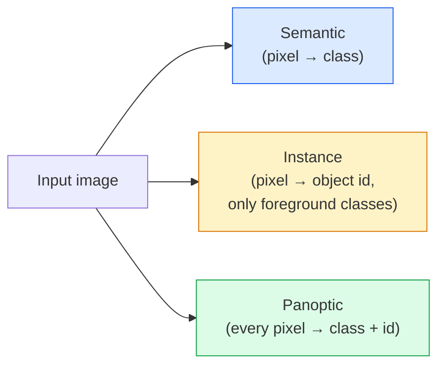
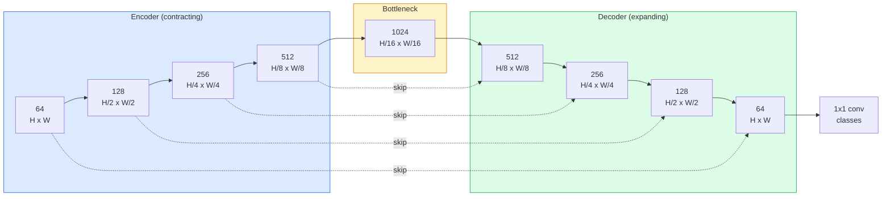

# Segmentación semántica  U-Net

> Segmentación es para cada píxel  realizar Clasificación. U-Net                                                                                                                                                                                                                                                                                                                                                                                                                                                                                                             

**Type:** Build
**Languages:** Python
**Prerequisites:** Phase 4 Lesson 03 (CNNs), Phase 4 Lesson 04 (Image Classification)
**Time:** ~75 minutes

## El objetivo del aprendizaje
- 区分语义,实例和全观分区,并为给定问题选择正确任务
- En PyTorch, desde el zero construye U-Net, contiene bloque de codificador, cuello de botella, con decodificador de convolucciones transpuestas, así como conexiones saltadas
-                                                                                                                                                                                                                                                                                                                                                                                                                                                                                                                              
- 按类 解读 IoU 和 Dice métricas,并诊断低分是来自小物体回忆、边界精度,还是类失衡

##  problemas
Clasificación para cada imagen 输出一个标签──Detección para cada imagen 输出少量框──Segmentación para cada píxel 输出一个标签──对于大小为`H x W`La entrada, la salida es forma`H x W`(semántica) o `H x W x N_instances`Esto significa que cada imagen tiene millones de predicciones, no una sola.

La estructura de segmentación explica por qué se apoya en casi todas las visiones de predicción densa  productos: imágenes médicas (máscaras tumorales)  conducción autónoma (carreteras, carriles, obstáculos)  satélite (marcas de construcción, límites de cultivos)  análisis de documentos (zonas de diseño)  robótica (regiones comprensibles)  Estas tareas no pueden ser realizadas para que el objeto pueda dibujar una caja para resolver; necesitan una silueta precisa―

 La cuestión de la arquitectura es simple, pero la solución no es simple: necesitas una red para ver el contexto global de la imagen (¿qué tipo de escena es esta?) y detalles de píxeles locales (¿qué píxel es la carretera, cuál es el pavimento?) 

## 概念
### 语义 vs 实例 vs 全景



- **Semantic**Expreso que este píxel es un camino, ese píxel es un coche. Dos vehículos vecinos se juntan en una mancha.
- **Instance**Indica que este píxel es el coche #3, ese píxel es el coche #5.
- **Panoptic**Para que los dos se unan: cada pixel se obtiene una etiqueta de clase, cada instancia se obtiene una identificación única, las cosas y las cosas se segmenta.

本课涵盖语义──下一课(Máscara R-CNN)

### La forma de la red



El codificador reducirá la resolución espacial  mitad cuatro veces,并将 canales 翻倍──Decoder Reverso ejecutar:将空间分辨率 翻倍四次,并将频道 减半──Skip connections 会在每个分辨率上把匹配的编码功能与解码功能 进行连锁──最终的1x1 conv 在完整分辨率下将`64 -> num_classes`¿Qué es eso?

Por qué saltar conexiones es necesario: cuando el decodificador intenta emitir predicciones a nivel de píxeles, sólo ve mapas de características muy pequeños. No saltan, no puede localizar los bordes con precisión, ya que esta información ya está comprimida en el codificador.

### Transpuesto vs muestra ascendente bilinear

El decodificador necesita ampliar las dimensiones espaciales 

- **Transposed convolution**(El artículo`nn.ConvTranspose2d`)   可学习的上方程式──历史上的 U-Net 默认方案──如果步骤和内核尺寸 不能整除,可能产生棋牌文物──
- **Bilinear upsample + 3x3 conv** 平滑 upsample 后接一个 conv──Artifactos, mucho menos, parámetros, mucho menos, ahora es moderno默认方案──

El segundo en el proyecto real se puede ver.

### Grilla de píxeles de arriba de la entropía cruzada

对于包含C 个类的语义分类,model output es `(N, C, H, W)`❖ El objetivo es `(N, H, W)`, contiene ID de clase entera. La entropía cruzada es exactamente la misma que la clasificación, sólo se aplica en cada posición espacial.

```
Loss = mean over (n, h, w) of -log( softmax(logits[n, :, h, w])[target[n, h, w]] )
```

PyTorch 中的 `F.cross_entropy`Origin生处理这种形状──不需要重塑──

### La pérdida de dados y por qué lo necesita

En la mayoría de las imágenes de una clase, esto es incorrecto. La imagen médica: un fondo de 99, un tumor de 1%. La red puede ser utilizada en todas las posiciones para predecir el fondo.

La pérdida de dados                                                                                                                                                                                                                                                                                                                                                                                                                                                                                                                         

```
Dice(p, y) = 2 * sum(p * y) / (sum(p) + sum(y) + epsilon)
Dice_loss = 1 - Dice
```

Entre ellos `p`Es un mapa de probabilidad de sigmoide/softmax de una clase.`y`Es una máscara de verdad binaria. Sólo cuando se superponen, la pérdida es para cero.

实践中, utilización **combined loss**¿Qué es esto ?

```
L = L_cross_entropy + lambda * L_dice       (lambda ~ 1)
```

La entropía cruzada en el entrenamiento  temprano proporciona un gradiente estable; Dice se centrará en el entrenamiento  posterior                                                                                                                                                                                                                                                                                                                                                                                                                                                                                               

### Metricas de evaluación

- **Pixel accuracy** 预测 exacta de píxeles 百分比──计算便宜──与分类中的精度一样, en datos desequilibrados 上会失效──
- **IoU per class** Cada clase de máscara de la intersección sobre la unión; entre las clases 求平均 = mIoU。
- **Dice (F1 on pixels)** 类似 IoU;`Dice = 2 * IoU / (1 + IoU)`❖ Imágenes médicas, más preferencia Dice, conducción de la comunidad, más preferencia IoU;
- **Boundary F1**  Medir los límites previstos y la proximidad de los límites de la verdad de fondo, incluso un pequeño desvío también será castigado                                                                                                                                                                                                                                               

                                                                                                                                                                                                                                                                                                                                                                                                                                                                                                                             

### Resolución de entrada 权衡

El codificador de U-Net se reducirá en resolución a la mitad de cuatro veces, por lo que la entrada debe ser utilizada en 16 imágenes médicas.`H * W * C_max`缩放, en 1024x1024 且瓶頸频为 1024 时,前传 已会使用数GB VRAM──

 Dos soluciones de trabajo estándar:
1. Tela la entrada  处理带 sobreposición de 256x256 azulejos, y luego coser。
2. Usando convulsiones dilatadas  sustituir el cuello de botella, en mantener una resolución espacial más alta                                                                                                                                                                                                                                                                                                                                                                                                                                                                                                     

Para el primer modelo, utilizar 256x256 entrada y 64-canal base U-Net puede en 8 GB VRAM en un entrenamiento cómodo 


```figure
segmentation-flood
```

## Construirlo
### Paso 1: Bloqueo de codificación

两个 convistas 3x3, con norma de lote y ReLU.

```python
import torch
import torch.nn as nn
import torch.nn.functional as F

class DoubleConv(nn.Module):
    def __init__(self, in_c, out_c):
        super().__init__()
        self.net = nn.Sequential(
            nn.Conv2d(in_c, out_c, kernel_size=3, padding=1, bias=False),
            nn.BatchNorm2d(out_c),
            nn.ReLU(inplace=True),
            nn.Conv2d(out_c, out_c, kernel_size=3, padding=1, bias=False),
            nn.BatchNorm2d(out_c),
            nn.ReLU(inplace=True),
        )

    def forward(self, x):
        return self.net(x)
```

Este bloque será de uso completo.`bias=False`Es porque la beta de BN ya ha tratado el sesgo.

### Paso 2: Bloques hacia abajo y hacia arriba

```python
class Down(nn.Module):
    def __init__(self, in_c, out_c):
        super().__init__()
        self.net = nn.Sequential(
            nn.MaxPool2d(2),
            DoubleConv(in_c, out_c),
        )

    def forward(self, x):
        return self.net(x)


class Up(nn.Module):
    def __init__(self, in_c, out_c):
        super().__init__()
        self.up = nn.Upsample(scale_factor=2, mode="bilinear", align_corners=False)
        self.conv = DoubleConv(in_c, out_c)

    def forward(self, x, skip):
        x = self.up(x)
        if x.shape[-2:] != skip.shape[-2:]:
            x = F.interpolate(x, size=skip.shape[-2:], mode="bilinear", align_corners=False)
        x = torch.cat([skip, x], dim=1)
        return self.conv(x)
```

Sólo inspeccionar la forma espacial`shape[-2:]`) puede procesar dimensiones no puede ser subyacida 16 entradas; una segura `F.interpolate`Las diferencias de la cantidad de canales también se producen en la forma completa, y este tipo de diferencias deben ser claramente comunicadas, no deben ser interpoladas silenciosamente.

### 步骤 3: La red de datos

```python
class UNet(nn.Module):
    def __init__(self, in_channels=3, num_classes=2, base=64):
        super().__init__()
        self.inc = DoubleConv(in_channels, base)
        self.d1 = Down(base, base * 2)
        self.d2 = Down(base * 2, base * 4)
        self.d3 = Down(base * 4, base * 8)
        self.d4 = Down(base * 8, base * 16)
        self.u1 = Up(base * 16 + base * 8, base * 8)
        self.u2 = Up(base * 8 + base * 4, base * 4)
        self.u3 = Up(base * 4 + base * 2, base * 2)
        self.u4 = Up(base * 2 + base, base)
        self.outc = nn.Conv2d(base, num_classes, kernel_size=1)

    def forward(self, x):
        x1 = self.inc(x)
        x2 = self.d1(x1)
        x3 = self.d2(x2)
        x4 = self.d3(x3)
        x5 = self.d4(x4)
        x = self.u1(x5, x4)
        x = self.u2(x, x3)
        x = self.u3(x, x2)
        x = self.u4(x, x1)
        return self.outc(x)

net = UNet(in_channels=3, num_classes=2, base=32)
x = torch.randn(1, 3, 256, 256)
print(f"output: {net(x).shape}")
print(f"params: {sum(p.numel() for p in net.parameters()):,}")
```

Forma de salida `(1, 2, 256, 256)` Es igual al tamaño espacial de la entrada, incluye `num_classes`¿Qué es lo que está pasando?`base=32`时约7.7M parámetros

### Paso 4: pérdidas

```python
def dice_loss(logits, targets, num_classes, eps=1e-6):
    probs = F.softmax(logits, dim=1)
    targets_one_hot = F.one_hot(targets, num_classes).permute(0, 3, 1, 2).float()
    dims = (0, 2, 3)
    intersection = (probs * targets_one_hot).sum(dim=dims)
    denom = probs.sum(dim=dims) + targets_one_hot.sum(dim=dims)
    dice = (2 * intersection + eps) / (denom + eps)
    return 1 - dice.mean()


def combined_loss(logits, targets, num_classes, lam=1.0):
    ce = F.cross_entropy(logits, targets)
    dc = dice_loss(logits, targets, num_classes)
    return ce + lam * dc, {"ce": ce.item(), "dice": dc.item()}
```

Dice 按类 计算后再平均(macro Dice)。`eps`防止批 中缺失某些类 时出现除零──

### Paso 5: Metrica de la UIE

```python
@torch.no_grad()
def iou_per_class(logits, targets, num_classes):
    preds = logits.argmax(dim=1)
    ious = torch.zeros(num_classes)
    for c in range(num_classes):
        pred_c = (preds == c)
        true_c = (targets == c)
        inter = (pred_c & true_c).sum().float()
        union = (pred_c | true_c).sum().float()
        ious[c] = (inter / union) if union > 0 else torch.tensor(float("nan"))
    return ious
```

返回长度为 C's Vector。`nan`标记批 中缺失类  计算mIoU 时不要把这些值纳入平均――

### 步骤 6: Datos sintéticos para la verificación de extremo a extremo

En los fondos de colores, se generan formas, por lo que la red debe aprender la forma, en lugar del color de píxel.

```python
import numpy as np
from torch.utils.data import Dataset, DataLoader

def synthetic_segmentation(num_samples=200, size=64, seed=0):
    rng = np.random.default_rng(seed)
    images = np.zeros((num_samples, size, size, 3), dtype=np.float32)
    masks = np.zeros((num_samples, size, size), dtype=np.int64)
    for i in range(num_samples):
        bg = rng.uniform(0, 1, (3,))
        images[i] = bg
        masks[i] = 0
        num_shapes = rng.integers(1, 4)
        for _ in range(num_shapes):
            cls = int(rng.integers(1, 3))
            color = rng.uniform(0, 1, (3,))
            cx, cy = rng.integers(10, size - 10, size=2)
            r = int(rng.integers(4, 12))
            yy, xx = np.meshgrid(np.arange(size), np.arange(size), indexing="ij")
            if cls == 1:
                mask = (xx - cx) ** 2 + (yy - cy) ** 2 < r ** 2
            else:
                mask = (np.abs(xx - cx) < r) & (np.abs(yy - cy) < r)
            images[i][mask] = color
            masks[i][mask] = cls
        images[i] += rng.normal(0, 0.02, images[i].shape)
        images[i] = np.clip(images[i], 0, 1)
    return images, masks


class SegDataset(Dataset):
    def __init__(self, images, masks):
        self.images = images
        self.masks = masks

    def __len__(self):
        return len(self.images)

    def __getitem__(self, i):
        img = torch.from_numpy(self.images[i]).permute(2, 0, 1).float()
        mask = torch.from_numpy(self.masks[i]).long()
        return img, mask
```

Tres clases: fondo (0) 、círculos (1) 、cuadrados (2)  Red 必须学会区分形──

### Paso 7: Ciclo de entrenamiento

```python
def train_one_epoch(model, loader, optimizer, device, num_classes):
    model.train()
    loss_sum, total = 0.0, 0
    iou_sum = torch.zeros(num_classes)
    for x, y in loader:
        x, y = x.to(device), y.to(device)
        logits = model(x)
        loss, _ = combined_loss(logits, y, num_classes)
        optimizer.zero_grad()
        loss.backward()
        optimizer.step()
        loss_sum += loss.item() * x.size(0)
        total += x.size(0)
        iou_sum += iou_per_class(logits, y, num_classes).nan_to_num(0)
    return loss_sum / total, iou_sum / len(loader)
```

En el conjunto de datos sintéticos 上运行 10-30 épocas, observar las clases de forma de mIoU 爬升到0.9 以上──注意,`nan_to_num(0)`Para obtener la UIE exacta por clase, en la fase de evaluación debe hacerse en presencia, y se realizan máscaras.`torch.nanmean`, en lugar de aquí en la media directa.

## Usalo
 para la producción,`segmentation_models_pytorch`("smp") con cualquier torchvision o timm backbone 封装了所有标准细分结构──三行代码:

```python
import segmentation_models_pytorch as smp

model = smp.Unet(
    encoder_name="resnet34",
    encoder_weights="imagenet",
    in_channels=3,
    classes=3,
)
```

实际工作中 también vale la pena conocer:
- **DeepLabV3+**Utilice convases dilatadas  sustituir por muestras de baja basadas en el máximo pool, para mantener la resolución del cuello de botella  mantener la resolución; en satélite y los datos de conducción  上边界更快──
- **SegFormer**将 conv encoder 替换为等级变压器; en muchos puntos de referencia 上是当前SOTA。
- **Mask2Former**- ¿ Qué ?**OneFormer**En una arquitectura única, la segmentación semántica, la instancia y la panóptica se han dividido.

Esto es lo que está pasando.`smp`O `transformers`Se puede utilizar como reemplazo de entrada,并 utilizar el mismo cargador de datos.

##  entregarlo
本课产 出:

- `outputs/prompt-segmentation-task-picker.md` Un prompt, utilizado para realizar una selección entre la segmentación semántica, instancia y panóptica,并为给定任务命名架构──
- `outputs/skill-segmentation-mask-inspector.md` Una habilidad para informar sobre la distribución de clases, estadísticas de máscaras predicidas, así como clases de menos predicidas o con límites borrados―

##  ejercicios
1. **(Easy)**Por tarea de segmentación binaria (previo frente a fondo)`bce_dice_loss` En el conjunto de datos sintético de dos clases 上验证, en primer plano sólo representa el 5% de píxeles 时, pérdida combinada de un solo BCE 收更快──
2. **(Medium)**¿ Qué ?`nn.Upsample + conv`Up-block 替换为 `nn.ConvTranspose2d`Up-block──在合成数据集上训练二者并比较 mIoU──观察转载-conv 版本中棋牌文物 出现位置──
3. **(Hard)**选取一个真实分区数据集(Oxford-IIIT Petes、Citiescapes mini split, o un subconjunto médico),并将 U-Net 训练到距离 `smp.Unet`Referencia no excede de 2 puntos de IoU. Reporte por clase de IoU, y identifique qué clases de los participantes participan en los dados de los resultados de los resultados de los resultados de los resultados de los resultados de los resultados de los resultados de los resultados de los resultados de los resultados de los resultados de los resultados de los resultados de los resultados de los resultados de los resultados de los resultados de los resultados de los resultados de los resultados de los resultados de los resultados de los resultados de los resultados de los resultados de los resultados de los resultados de los resultados de los resultados de los resultados de los resultados de los resultados de los resultados de los resultados de los resultados de los resultados de los resultados de los resultados de los resultados de los resultados de los resultados de los resultados de los resultados de los resultados de los resultados de los resultados de los resultados de los resultados de los resultados de los resultados de los resultados de los resultados de los resultados de los resultados de los resultados de los resultados de los resultados de los resultados de los resultados de los resultados de los resultados de los resultados de los resultados de los resultados de los resultados de los resultados de los resultados de los resultados de los resultados de los resultados de los resultados de los resultados de los resultados de los resultados de los resultados de los resultados de los resultados de los resultados de los resultados de los resultados de los resultados de los resultados de los resultados de los resultados de los resultados de los resultados de los resultados de los resultados de los resultados de los resultados de los resultados de los resultados de los resultados de los resultados de los resultados de los resultados de los resultados de los resultados de los resultados de los resultados de los resultados de los resultados de los resultados de los resultados de los resultados de los resultados de los resultados de los resultados de los resultados de los resultados de los resultados de los resultados de los resultados de los resultados de los resultados de los resultados de los resultados de los resultados de los resultados de los resultados de los resultados de los resultados de los resultados de los resultados de los resultados de los resultados de los resultados de los resultados de los resultados de los resultados de los resultados de los resultados de los resultados de los resultados de los resultados de los resultados de los resultados de los resultados de los cuyoyoyoyoyoyoyoyoyoyoyoyoyoyoyoyoyoyoyoyoyoyoyoyoyoyoyoyoyoyoyoyoyoyoyoyoyoyoyoyoyoyoyoyoyoyoyoyoyoyoyoyoyoyoyoyoyoyoyoyo

## 关键术语: "El hombre es un hombre"
| Term | What people say | What it actually means |
|------|----------------|----------------------|
| Semantic segmentation | “标注每个 pixel” | 对每个 pixel 进行 C classes 的 Classification；同一 class 的 instances 会合并 |
| Instance segmentation | “标注每个 object” | 分离同一 class 的不同 instances；仅 foreground |
| Panoptic segmentation | “Semantic + instance” | 每个 pixel 得到一个 class；每个 thing instance 还得到一个唯一 id |
| Skip connection | “U-Net bridge” | 将 encoder features concatenate 到匹配 resolution 的 decoder features 中；保留 high-frequency detail |
| Transposed conv | “Deconvolution” | 可学习的 upsampling；可能产生 checkerboard artifacts |
| Dice loss | “Overlap loss” | 1 - 2|A ∩ B| / (|A| + |B|)；直接优化 mask overlap，并且对 class imbalance 鲁棒 |
| mIoU | “Mean intersection over union” | 跨 classes 平均 IoU；segmentation 的 community-standard metric |
| Boundary F1 | “Boundary accuracy” | 只在 boundary pixels 上计算的 F1 score；对 precision-critical tasks 很重要 |

## 延伸阅读
- [U-Net: Convolutional Networks for Biomedical Image Segmentation (Ronneberger et al., 2015)](https://arxiv.org/abs/1505.04597) Papel original; todos volverán a escribir la figura en la segunda página
- [Fully Convolutional Networks (Long et al., 2015)](https://arxiv.org/abs/1411.4038) 首个将分分 变成端到端 conv problema de papel
- [segmentation_models_pytorch](https://github.com/qubvel/segmentation_models.pytorch) Segmentación de la producción de referencia; contiene toda la arquitectura estándar y todas las pérdidas estándar
- [Lessons learned from training SOTA segmentation (kaggle.com competitions)](https://www.kaggle.com/code/iafoss/carvana-unet-pytorch) 讲解为什么 TTA 伪标签 和类重量在真实数据上很重要
