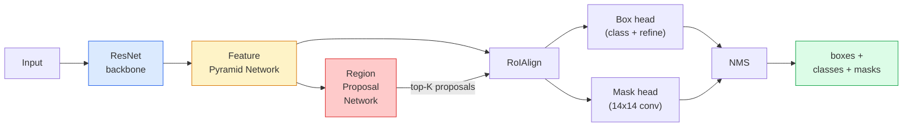

# Segmentación de instancia  Máscara R-CNN

> Damos un detector R-CNN más rápido, además de una pequeña rama de máscara, obtenemos la segmentación de la instancia.

**Type:** Build + Learn
**Languages:** Python
**Prerequisites:** Phase 4 Lesson 06 (YOLO), Phase 4 Lesson 07 (U-Net)
**Time:** ~75 minutes

## El objetivo del aprendizaje
- 端到端追踪 Máscara R-CNN 架构:espina dorsal、FPN、RPN、RoIAlign、caja de cabeza、máscara de cabeza
- Desde el principio de RoIAlign,并 explica por qué RoIPool no se usa más
- Usando torchvision de`maskrcnn_resnet50_fpn_v2`modelo pre-entrenado 生成生产质量 instancias máscaras,并正确读取它的输出格式
- 通过换盒和面具头,并保持脊柱 结,在小型自定义数据集上细调面具 R-CNN

##  problemas
Segmentación semántica para cada clase  dar una máscara―Segmentación de instancia para cada objeto  dar una máscara, incluso si dos objetos  pertenecen a la misma clase―Statistics Individual Number、跨 Tracking, as well as measurement objects (((de cada bloque de la pared en la caja de límites、 cada célula en las imágenes) todos necesitan segmentación de instancia―

Máscara R-CNN (He et al., 2017) 通过把实例细分重新表述为检测-plus-a-mask来解决这个问题―― Este diseño es muy simple, hasta el siguiente cinco años, casi cada artículo de la segmentación de instancia es una variación de Mask R-CNN, y la implementación de torchvision hasta el día de hoy sigue siendo una opción de producción de pequeños conjuntos de datos―.

困难的工程问题是采样: ¿Cómo cortar una región de características fija de tamaño determinado desde una caja de propuestas, mientras que el punto de esquina de esta caja no está en línea con los límites de píxeles?

## 概念
### La arquitectura



需要理解五个部分:

1. **Backbone** En ImageNet 上 entrenamiento de ResNet-50 o ResNet-101── generar paso 为 4、8、16、32 de mapas de características 层级──
2. **FPN (Feature Pyramid Network)** Conexiones laterales de arriba hacia abajo, que cada nivel tenga muchas características de los canales C―Detección 
3. **RPN (Region Proposal Network)** Una pequeña cabeza de cubo, en cada posición de anclaje 上预测 Aquí ¿hay algún objeto?以及我该如何精细盒?── cada imagen genera aproximadamente 1000 propuestas──
4. **RoIAlign** Desde el nivel de FPN arbitrario de la caja arbitraria de la caja de la caja de la caja de la caja de la caja de la caja de la caja de la caja de la caja de la caja de la caja de la caja de la caja de la caja de la caja de la caja de la caja de la caja de la caja de la caja de la caja de la caja de la caja de la caja de la caja de la caja de la caja de la caja de la caja de la caja de la caja de la caja de la caja de la caja de la caja de la caja de la caja de la caja de la caja de la caja de la caja de la caja de la caja de la caja de la caja de la caja de la caja de la caja de la caja de la caja de la caja de la caja de la caja de la caja de la caja de la caja de la caja de la caja de la caja de la caja de la caja de la caja de la caja de la caja de la caja de la caja de la caja de la caja de la caja de la caja de la caja de la caja de la caja de la caja de la caja de la caja de la caja de la caja de la caja de la caja de la caja de la caja de la caja de la caja de la caja de la caja de la caja de la caja de la caja de la caja de la caja de la caja de la caja de la caja de la caja de la caja de la caja de la caja de la caja de la caja de la caja de la caja de la caja de la caja de la caja de la caja de la caja de la caja de la caja de la caja de la caja de la caja de la caja de la caja de la caja de la caja de la caja de la caja de la caja de la caja de la caja de la caja de la caja de la caja de la caja de la caja de la caja de la caja de la caja de la caja de la caja de la caja de la caja de la caja de la caja de la caja de la caja de la caja de la caja de la caja de la caja de la caja de la caja de la caja de la caja de la caja de la caja de la caja de la caja de la caja de la caja de la caja de la caja de la caja de la caja de la caja de la caja de la caja de la caja de la caja de la caja de la caja de la caja de la caja de
5. **Heads** 两层 box head,用于精细盒并选择类;再加一个小型卷头,为每一个提案 输出一个 `28x28`mascarilla binaria.

### ¿Por qué RoIAlign y no RoIPool?

El primer Fast R-CNN utiliza RoIPool, que descompone la caja de propuestas en una cuadrícula, toma la mayor característica en cada célula, y hace que todos los estándares redondeen hasta el número completo. Esta redondeación permitirá que el mapa de características con las coordenadas de los píxeles de entrada, el máximo error en un pixel de mapa de características completo, en 224x224                                                                                                                                                                                                                                                                                                                                                                                                                              

```
RoIPool:
  box (34.7, 51.3, 98.2, 142.9)
  round -> (34, 51, 98, 142)
  split grid -> round each cell boundary
  misalignment accumulates at every step

RoIAlign:
  box (34.7, 51.3, 98.2, 142.9)
  sample at exact float coordinates using bilinear interpolation
  no rounding anywhere
```

RoIAlign puede actualizar 3-4 puntos de máscara en COCO. Ahora cada detector de localización de la importancia lo utiliza, incluyendo YOLOv7 seg、RT-DETR、Máscara2Former。

### El RPN en un párrafo

En cada posición del mapa de características, coloca K 个 个不同尺寸和形状的基箱. 对于每个基箱 预测一个对象性分数,以及一个回归抵消,用来将基变成更贴合对象的盒. 根据分数保留前约1000 个盒,在 IoU 0.7 下应用 NMS,然后把保留下来的盒 交给头部. RPN utiliza su propia mini-loss 训练, su estructura es similar a la de Lesson 6 约洛损失, sólo hay dos clases de objetos / no objetos) 

### La cabeza de la máscara

Para cada propuesta, la cabeza de máscara es una pequeña FCN: cuatro convases 3x3, una 2x deconv, una final de 1x1, en`28x28`resolución 下生成 `num_classes`个输出 道──只保留与预测类对应的 道;其他 道 会被忽视── 这将掩盖预测与分类解──

Colocar una muestra de máscara de 28x28 en la propuesta del tamaño original de píxel, obtendrá la máscara binaria final.

### Las pérdidas

Máscara R-CNN tiene cuatro clases de pérdidas en adición:

```
L = L_rpn_cls + L_rpn_box + L_box_cls + L_box_reg + L_mask
```

- `L_rpn_cls`¿ Qué ?`L_rpn_box` Objetividad de las propuestas de RPN + caja Regresión。
- `L_box_cls` clasificador de cabezas 上针对 (C+1) clases(incluye fondo) de entropía cruzada。
- `L_box_reg` refinamiento de la caja de cabeza                                                                                                                                                                                                                                                           
- `L_mask` 28x28 salida de máscara 上的每像素二进制的交叉

Cada pérdida tiene su propio peso de prefijo; la implementación de torchvision los expondrá como argumentos constructores.

### Formatos de salida

`torchvision.models.detection.maskrcnn_resnet50_fpn_v2` Retorno a una lista de dictados, cada imagen a la siguiente:

```
{
    "boxes":  (N, 4) in (x1, y1, x2, y2) pixel coordinates,
    "labels": (N,) class IDs, 0 = background so indices are 1-based,
    "scores": (N,) confidence scores,
    "masks":  (N, 1, H, W) float masks in [0, 1] — threshold at 0.5 for binary,
}
```

la máscara 已是全像分辨率──28x28 cabeza de salida 已在内部完成上样子──


```figure
cv3-roialign-sampling
```

## Construirlo
### Paso 1: Alineación de la roya desde cero

Este componente de R-CNN, con código para entenderlo es más sencillo que con letras para describirlo.

```python
import torch
import torch.nn.functional as F

def roi_align_single(feature, box, output_size=7, spatial_scale=1 / 16.0):
    """
    feature: (C, H, W) single-image feature map
    box: (x1, y1, x2, y2) in original image pixel coordinates
    output_size: side of the output grid (7 for box head, 14 for mask head)
    spatial_scale: reciprocal of the feature map stride
    """
    C, H, W = feature.shape
    x1, y1, x2, y2 = [c * spatial_scale - 0.5 for c in box]
    bin_w = (x2 - x1) / output_size
    bin_h = (y2 - y1) / output_size

    grid_y = torch.linspace(y1 + bin_h / 2, y2 - bin_h / 2, output_size)
    grid_x = torch.linspace(x1 + bin_w / 2, x2 - bin_w / 2, output_size)
    yy, xx = torch.meshgrid(grid_y, grid_x, indexing="ij")

    gx = 2 * (xx + 0.5) / W - 1
    gy = 2 * (yy + 0.5) / H - 1
    grid = torch.stack([gx, gy], dim=-1).unsqueeze(0)
    sampled = F.grid_sample(feature.unsqueeze(0), grid, mode="bilinear",
                            align_corners=False)
    return sampled.squeeze(0)
```

Cada valor numérico proviene de la posición de muestreo bilinear. No hay redondeo, no hay cuantificación, tampoco hay gradientes perdidos.

### 步骤 2: Compare con la línea RoIA de torchvision

```python
from torchvision.ops import roi_align

feature = torch.randn(1, 16, 50, 50)
boxes = torch.tensor([[0, 10, 20, 100, 90]], dtype=torch.float32)  # (batch_idx, x1, y1, x2, y2)

ours = roi_align_single(feature[0], boxes[0, 1:].tolist(), output_size=7, spatial_scale=1/4)
theirs = roi_align(feature, boxes, output_size=(7, 7), spatial_scale=1/4, sampling_ratio=1, aligned=True)[0]

print(f"shape ours:   {tuple(ours.shape)}")
print(f"shape theirs: {tuple(theirs.shape)}")
print(f"max|diff|:    {(ours - theirs).abs().max().item():.3e}")
```

En el`sampling_ratio=1`且 `aligned=True`时,两者能在 `1e-5`Es un juego de palabras.

### Paso 3: Cargar una máscara pre-entrenada R-CNN

```python
import torch
from torchvision.models.detection import maskrcnn_resnet50_fpn_v2, MaskRCNN_ResNet50_FPN_V2_Weights

model = maskrcnn_resnet50_fpn_v2(weights=MaskRCNN_ResNet50_FPN_V2_Weights.DEFAULT)
model.eval()
print(f"params: {sum(p.numel() for p in model.parameters()):,}")
print(f"classes (including background): {len(model.roi_heads.box_predictor.cls_score.out_features * [0])}")
```

46M parámetros, 91 clases ((COCO) ⋅ la primera clase ((id 0) es el fondo; modelo de la prueba real todo el contenido está en la id 1 开始。

### Paso 4: ejecutar inferencias

```python
with torch.no_grad():
    x = torch.randn(3, 400, 600)
    predictions = model([x])
p = predictions[0]
print(f"boxes:  {tuple(p['boxes'].shape)}")
print(f"labels: {tuple(p['labels'].shape)}")
print(f"scores: {tuple(p['scores'].shape)}")
print(f"masks:  {tuple(p['masks'].shape)}")
```

la forma del tensor de la máscara es `(N, 1, H, W)`△ en 0,5 por umbral, para cada objeto  obtenga máscara binaria:

```python
binary_masks = (p['masks'] > 0.5).squeeze(1)  # (N, H, W) boolean
```

### 步骤 5: Cambiar las cabezas para un conteo de clases personalizado

常见的细调配方:复用脊椎、FPN 和 RPN; sustitución de dos cabezas de clasificadores。

```python
from torchvision.models.detection.faster_rcnn import FastRCNNPredictor
from torchvision.models.detection.mask_rcnn import MaskRCNNPredictor

def build_custom_maskrcnn(num_classes):
    model = maskrcnn_resnet50_fpn_v2(weights=MaskRCNN_ResNet50_FPN_V2_Weights.DEFAULT)
    in_features = model.roi_heads.box_predictor.cls_score.in_features
    model.roi_heads.box_predictor = FastRCNNPredictor(in_features, num_classes)
    in_features_mask = model.roi_heads.mask_predictor.conv5_mask.in_channels
    hidden_layer = 256
    model.roi_heads.mask_predictor = MaskRCNNPredictor(in_features_mask, hidden_layer, num_classes)
    return model

custom = build_custom_maskrcnn(num_classes=5)
print(f"custom cls_score.out_features: {custom.roi_heads.box_predictor.cls_score.out_features}")
```

`num_classes`tenemos que incluir una clase de fondo, por lo que una tiene 4 clases de objetos `num_classes=5`¿Qué es eso?

### Paso 6: Congela lo que no necesita entrenamiento

En pequeños conjuntos de datos, 结脊椎和 FPN── sólo deja que RPN objetividad + regresión y las dos cabezas aprendi­sen──

```python
def freeze_backbone_and_fpn(model):
    # torchvision Mask R-CNN packs the FPN inside `model.backbone` (as
    # `model.backbone.fpn`), so iterating `model.backbone.parameters()` covers
    # both the ResNet feature layers and the FPN lateral/output convs.
    for p in model.backbone.parameters():
        p.requires_grad = False
    return model

custom = freeze_backbone_and_fpn(custom)
trainable = sum(p.numel() for p in custom.parameters() if p.requires_grad)
print(f"trainable after freeze: {trainable:,}")
```

En el conjunto de datos de 500 imágenes, esta es la diferencia entre la recepción y la sobreajuste.

## Usalo
El ciclo de entrenamiento completo de R-CNN es de sólo 40 行, y en las diferentes tareas no cambia de lo esencial: sustituir los conjuntos de datos, y luego comenzar a entrenar.

```python
def train_step(model, images, targets, optimizer):
    model.train()
    loss_dict = model(images, targets)
    losses = sum(loss for loss in loss_dict.values())
    optimizer.zero_grad()
    losses.backward()
    optimizer.step()
    return {k: v.item() for k, v in loss_dict.items()}
```

`targets`La lista debe contener cada imagen que se responda a un dictado, entre ellos:`boxes`¿Qué es esto?`labels`Y `masks`(como `(num_instances, H, W)`Tensores binarios) ⋅ modelo en el entrenamiento ⋅ regresar cuatro pérdidas ⋅ dictado, en el evaluar ⋅ regresar predicciones ⋅ lista, esto por ⋅`model.training`Decidiron

`pycocotools`El evaluador 会同时为盒 和面具 生成 mAP@IoU=0.5:0.95; necesitas dos números, para juzgar la botella está en la cabeza de la caja o en la cabeza de la máscara。

##  entregarlo
Encuentro de trabajo:

- `outputs/prompt-instance-vs-semantic-router.md` Una pregunta rápida, presentará tres problemas,并选择实例 vs. semántica vs. panóptica,以及精确的起始模型──
- `outputs/skill-mask-rcnn-head-swapper.md`Una habilidad, una nueva.`num_classes`, para el modelo de detección de torcha de visión arbitraria 生成用于交换头的10 行代码──

##  ejercicios
1. **(Easy)**En 100 cajas al azar`torchvision.ops.roi_align`验证你的RoIAlign──报告最大绝对差值──同时运行RoIPool(pre-2017 behavior),并显示它在靠近边界的盒子上会偏离约1-2个特色地图像素──
2. **(Medium)**En un conjunto de datos personalizados de 50 imágenes, ajuste a las dos clases: globos, peces, agujeros, logotipos)`maskrcnn_resnet50_fpn_v2`结脊椎, entrenamiento 20 épocas, informe máscara AP@0.5。
3. **(Hard)**La cabeza de máscara de R-CNN se reemplaza por la versión 56x56 en lugar de 28x28 de la versión.

## 关键术语: "El hombre es un hombre"
| Term | What people say | What it actually means |
|------|----------------|----------------------|
| Mask R-CNN | “Detection plus masks” | Faster R-CNN + 一个小型 FCN head，为每个 proposal 的每个 class 预测一个 28x28 mask |
| FPN | “Feature pyramid” | top-down + lateral connections，让每个 stride level 都有 C channels 的语义丰富 features |
| RPN | “Region proposer” | 一个小型 conv head，每张图像生成约 1000 个 object/no-object proposals |
| RoIAlign | “No-rounding crop” | 从任意 float-coordinate box 中以 bilinear 方式采样固定大小的 feature grid |
| RoIPool | “Pre-2017 crop” | 与 RoIAlign 用途相同，但会 round box coordinates；已经过时 |
| Mask AP | “Instance mAP” | 使用 mask IoU 而不是 box IoU 计算的 average precision；COCO instance segmentation metric |
| Binary mask head | “Per-class mask” | 为每个 proposal 的每个 class 预测一个 binary mask；只保留 predicted class 的 channel |
| Background class | “Class 0” | 兜底的 “no object” class；真实 classes 的 indices 从 1 开始 |

## 延伸阅读
- [Mask R-CNN (He et al., 2017)](https://arxiv.org/abs/1703.06870) 论文; Sobre el RoIAlign 的第3节是关键阅读
- [FPN: Feature Pyramid Networks (Lin et al., 2017)](https://arxiv.org/abs/1612.03144) FPN 论文; cada detector moderno lo utiliza
- [torchvision Mask R-CNN tutorial](https://pytorch.org/tutorials/intermediate/torchvision_tutorial.html) red de ajuste fino
- [Detectron2 model zoo](https://github.com/facebookresearch/detectron2/blob/main/MODEL_ZOO.md) Implementaciones de producción, proporcionando casi todas las detecciones y segmentación de los pesos entrenados de los cambios
