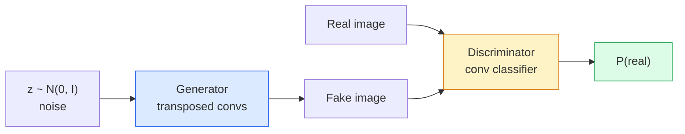
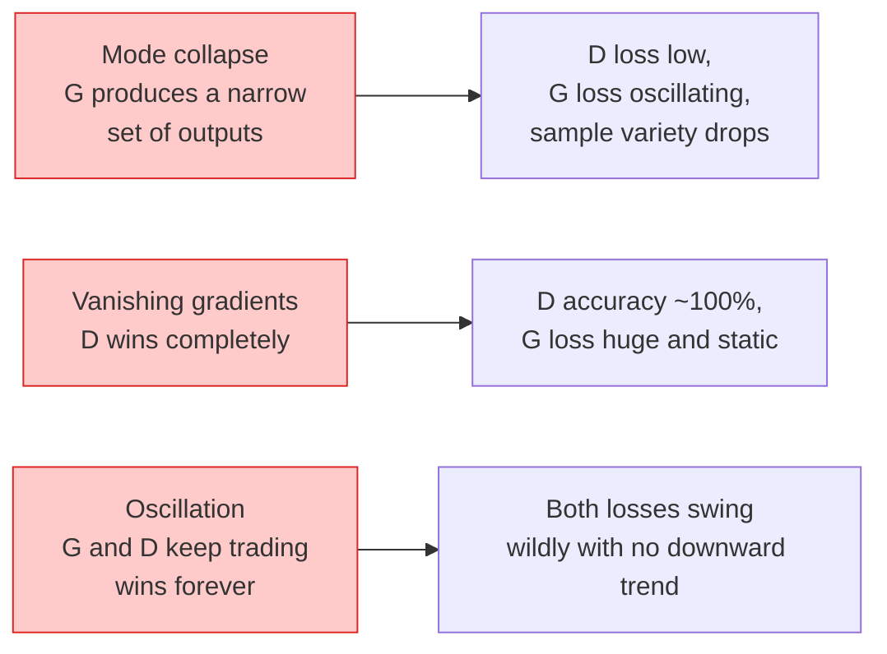

# Generación de imágenes  GAN

> GAN es un sistema fijo entre dos redes neuronales. Uno responsable de dibujar, otro responsable de evaluar.

**Type:** Build
**Languages:** Python
**Prerequisites:** Phase 4 Lesson 03 (CNNs), Phase 3 Lesson 06 (Optimizers), Phase 3 Lesson 07 (Regularization)
**Time:** ~75 分钟

## El objetivo del aprendizaje
- 解释                                                                                                                                                                                                                                                              
- En PyTorch se realiza DCGAN, y en 60 líneas se genera una imagen 32x32 de la composición de la línea
- Utiliza三种标准技巧稳定 GAN 训练: pérdida no saturante  norma espectral  Ttur (regla de actualización en dos escalas)
- 读取训练曲线,区分健康收与模式 collapse、oscillación、discriminador-ganas-completamente

##  problemas
Clasificación Iglesia de la red de imágenes se mapeará a etiquetas. La generación se reversa a este problema: la toma de muestras se ve como de la misma distribución de nuevas imágenes. Aquí no se puede utilizar la diferencia de comparación  correcta  salida; sólo una distribución que se quiere imitar.

标准 Loss Function (MSE、cross-entropy) no puede medir si este modelo proviene de la distribución real ── minimizar los errores de imagen generará un resultado medio confuso, en lugar de un modelo real ──突破点 lies in learning Loss: train a second network, make its task to distinguish real from fake, and use it to drive generator──

GANs (Goodfellow et al., 2014) definieron este marco. Hasta 2018, StyleGAN ya podía generar imágenes difíciles de distinguir entre 1024x1024 personas.

## 概念
### Las dos redes



**generator**G 接收一个噪音矢量 `z`Y sacar una imagen.**discriminator**D 接收一张图像并输出单个标量: 图像为真实的概率──

### El juego

G 希望 D 犯错――D 希望自己判断正确――形式化地说:

```
min_G max_D  E_x[log D(x)] + E_z[log(1 - D(G(z)))]
```

Desde la derecha hacia la izquierda:D está en el maximización de que en realidad`log D(real)`) y falso`log (1 - D(fake))`) Precisión en la imagen. G está en minimizar D en falso                                                                                                                                                                                                                                                      `D(G(z))`Es muy alto.

El buen amigo demostró que existe un equilibrio global entre estos mínimos.`p_G = p_data`,D en todas las posiciones producen 0.5 y generan la divergencia entre la distribución y la distribución real de Jensen-Shannon.

### Las pérdidas no saturantes

La forma de arriba está inestable en el valor numérico.`D(G(z))`Para cada falso, casi nada, por lo tanto.`log(1 - D(G(z)))`Se pierde el Gradiente de G.

```
L_D = -E_x[log D(x)] - E_z[log(1 - D(G(z)))]
L_G = -E_z[log D(G(z))]                          # non-saturating
```

Ahora mismo`D(G(z))`接近零时,G 的损失 很大,Gradient 也有信息量──每现代GAN都使用这个变体进行训练──

### Reglas de arquitectura DCGAN

Radford、Metz、Chintala (2015) transformó los experimentos de muchos años de fracaso en cinco reglas, haciendo que el entrenamiento de GAN sea más estable:

1. Usando convases graduadas  sustituyendo el pooling 
2. En el generador y el discriminador todos utilizan la norma de lote, pero G's output y D's input son excluidos.
3. En la estructura más profunda se mueven las capas completamente conectadas.
4. G 在除输出层外所有层使用 ReLU(输出层用 tanh,将输出限制在 [-1, 1])。
5. D 在所有层使用LeakyReLU(negativo_slope=0.2)。

Cada moderno GAN basado en convenciones (StyleGAN, BigGAN, GigaGAN) sigue surgiendo de estas reglas y una vez sustituye parte de ellas.

### Modo de falla  y sus características



- **Mode collapse**:G 找到一张能骗过 D 的图像,然后只生成它──修复:加入迷你批次歧视、光谱规范,或标签条件──
- **Discriminator wins**:D 变强太快,G 的 Gradient 消失──修复:减小 D、降低 D learning rate,或对真实标签 应用标签滑滑──
- **Oscillation**Las dos redes se aprovechan cada vez más entre sí, pero no se acercan al equilibrio.

### Evaluación

Los GAN no tienen verdad, ¿cómo sabes si están trabajando?

- **Sample inspection** Cada época 结时直接查看 64 个样本──不可妥协──
- **FID (Fréchet Inception Distance)** verdadero conjunto y generación de conjunto de distribución de características de Inception-v3  distancia entre──越低越好──社区标准──
- **Inception Score**较旧,也更脆弱; prioridad utilizar FID。
- **Precision/Recall for generative models**分别衡量质量 (precisión) y cobertura (record) ──比单独使用FID 更有信息量──

Para pequeñas operaciones de datos sintéticos, la inspección de muestras es suficiente.


```figure
cv-gan-image
```

## Construirlo
### 步骤 1: Generador

Un pequeño generador DCGAN, que recibe 64 dimensiones de ruido y genera una imagen de 32x32.

```python
import torch
import torch.nn as nn

class Generator(nn.Module):
    def __init__(self, z_dim=64, img_channels=3, feat=64):
        super().__init__()
        self.net = nn.Sequential(
            nn.ConvTranspose2d(z_dim, feat * 4, kernel_size=4, stride=1, padding=0, bias=False),
            nn.BatchNorm2d(feat * 4),
            nn.ReLU(inplace=True),
            nn.ConvTranspose2d(feat * 4, feat * 2, kernel_size=4, stride=2, padding=1, bias=False),
            nn.BatchNorm2d(feat * 2),
            nn.ReLU(inplace=True),
            nn.ConvTranspose2d(feat * 2, feat, kernel_size=4, stride=2, padding=1, bias=False),
            nn.BatchNorm2d(feat),
            nn.ReLU(inplace=True),
            nn.ConvTranspose2d(feat, img_channels, kernel_size=4, stride=2, padding=1, bias=False),
            nn.Tanh(),
        )

    def forward(self, z):
        return self.net(z.view(z.size(0), -1, 1, 1))
```

Cuatro convoyes transpuestas, cada uno de ellos.`kernel_size=4, stride=2, padding=1`, así que pueden hacerse netos en el espacio tamaño duplicado.

### 步骤 2: Discriminador

El generador de imágenes de la máquina de reproducción de datos de la máquina de reproducción de datos de la máquina de reproducción de datos de la máquina de reproducción de datos de la máquina de reproducción de datos de la máquina de reproducción de datos de la máquina de reproducción de datos de la máquina de reproducción de datos de la máquina de reproducción de datos de la máquina de reproducción de datos de la máquina de reproducción de datos de la máquina de reproducción de datos de la máquina de reproducción de datos de la máquina de reproducción de datos de la máquina de reproducción de datos de la máquina de reproducción de datos de la máquina de reproducción de datos de la máquina de reproducción de datos de la máquina de reproducción de datos de la máquina de la máquina de reproducción de datos de la máquina de la máquina de reproducción de datos de datos de la máquina de la máquina de reproducción de datos de datos de la máquina de la máquina de la máquina de reproducción de datos de datos de la máquina de la máquina de la máquina de la máquina de reproducción de datos de las máquinas de la máquina de la máquina de reproducción de las máquinas de las máquinas de reproducción de las máquinas de las máquinas de las máquinas de las máquinas de reproducción de las máquinas de las máquinas de las máquinas de las máquinas de las máquinas de las máquinas de las máquinas de las máquinas de las máquinas de las máquinas de las máquinas de las máquinas de reproducción de las máquinas de las máquinas de las máquinas de las máquinas de las máquinas de las máquinas de las máquinas de las máquinas de las máquinas de las máquinas de las máquinas de las máquinas de las máquinas de las máquinas de las máquinas de las máquinas de las máquinas de las máquinas de las máquinas de las máquinas de las de las máquinas de las de las de las máquinas de las de las de las máquinas de las de las de las máquinas de las de las máquinas de las de las de las máquinas de las de las de las de las de las de las máquinas de las de las de las máquinas de las las las máquinas de las de las las las las las de las de las las de las de las de las las las las de las de las máquinas de las las las las las de las de las de las las de las de las de las las de las de las de las las las de las de las de las de las de las de las de las de las de las de las de las de las de las de las de

```python
class Discriminator(nn.Module):
    def __init__(self, img_channels=3, feat=64):
        super().__init__()
        self.net = nn.Sequential(
            nn.Conv2d(img_channels, feat, kernel_size=4, stride=2, padding=1),
            nn.LeakyReLU(0.2, inplace=True),
            nn.Conv2d(feat, feat * 2, kernel_size=4, stride=2, padding=1, bias=False),
            nn.BatchNorm2d(feat * 2),
            nn.LeakyReLU(0.2, inplace=True),
            nn.Conv2d(feat * 2, feat * 4, kernel_size=4, stride=2, padding=1, bias=False),
            nn.BatchNorm2d(feat * 4),
            nn.LeakyReLU(0.2, inplace=True),
            nn.Conv2d(feat * 4, 1, kernel_size=4, stride=1, padding=0),
        )

    def forward(self, x):
        return self.net(x).view(-1)
```

El último conv.`4x4`mapa de características 降到 `1x1`◊输出是每张图像一个标量; sólo durante el período de Loss 计算 se aplica sigmoid♦

### Paso 3: Paso de formación

交替执行: cada lote primero actualiza una vez D, otra vez actualiza una vez G―

```python
import torch.nn.functional as F

def train_step(G, D, real, z, opt_g, opt_d, device):
    real = real.to(device)
    bs = real.size(0)

    # D step
    opt_d.zero_grad()
    d_real = D(real)
    d_fake = D(G(z).detach())
    loss_d = (F.binary_cross_entropy_with_logits(d_real, torch.ones_like(d_real))
              + F.binary_cross_entropy_with_logits(d_fake, torch.zeros_like(d_fake)))
    loss_d.backward()
    opt_d.step()

    # G step
    opt_g.zero_grad()
    d_fake = D(G(z))
    loss_g = F.binary_cross_entropy_with_logits(d_fake, torch.ones_like(d_fake))
    loss_g.backward()
    opt_g.step()

    return loss_d.item(), loss_g.item()
```

D paso en el medio `G(z).detach()`至关重要: 我们不希望在更新 D 时 Gradient 流入 G ⋅ olvidar que es un error de principiantes clásicos ⋅

### Paso 4: en formas sintéticas 上运行完整训练循环

```python
from torch.utils.data import DataLoader, TensorDataset
import numpy as np

def synthetic_images(num=2000, size=32, seed=0):
    rng = np.random.default_rng(seed)
    imgs = np.zeros((num, 3, size, size), dtype=np.float32) - 1.0
    for i in range(num):
        r = rng.uniform(6, 12)
        cx, cy = rng.uniform(r, size - r, size=2)
        yy, xx = np.meshgrid(np.arange(size), np.arange(size), indexing="ij")
        mask = (xx - cx) ** 2 + (yy - cy) ** 2 < r ** 2
        color = rng.uniform(-0.5, 1.0, size=3)
        for c in range(3):
            imgs[i, c][mask] = color[c]
    return torch.from_numpy(imgs)

device = "cuda" if torch.cuda.is_available() else "cpu"
data = synthetic_images()
loader = DataLoader(TensorDataset(data), batch_size=64, shuffle=True)

G = Generator(z_dim=64, img_channels=3, feat=32).to(device)
D = Discriminator(img_channels=3, feat=32).to(device)
opt_g = torch.optim.Adam(G.parameters(), lr=2e-4, betas=(0.5, 0.999))
opt_d = torch.optim.Adam(D.parameters(), lr=2e-4, betas=(0.5, 0.999))

for epoch in range(10):
    for (batch,) in loader:
        z = torch.randn(batch.size(0), 64, device=device)
        ld, lg = train_step(G, D, batch, z, opt_g, opt_d, device)
    print(f"epoch {epoch}  D {ld:.3f}  G {lg:.3f}")
```

`Adam(lr=2e-4, betas=(0.5, 0.999))`Es un juego de adversarios demasiado estable.

### Paso 5: Muestreo

```python
@torch.no_grad()
def sample(G, n=16, z_dim=64, device="cpu"):
    G.eval()
    z = torch.randn(n, z_dim, device=device)
    imgs = G(z)
    imgs = (imgs + 1) / 2
    return imgs.clamp(0, 1)
```

采样前始终切换到 eval modo── para DCGAN esto es importante, porque la norma del lote utilizará estadísticas de ejecución, en lugar de las estadísticas del lote actual──

### Paso 6: Normalización espectral

La mayoría de los ganadores de la Liga Nacional de Fútbol (FIFA) ganan demasiado duro.

```python
from torch.nn.utils import spectral_norm

def build_sn_discriminator(img_channels=3, feat=64):
    return nn.Sequential(
        spectral_norm(nn.Conv2d(img_channels, feat, 4, 2, 1)),
        nn.LeakyReLU(0.2, inplace=True),
        spectral_norm(nn.Conv2d(feat, feat * 2, 4, 2, 1)),
        nn.LeakyReLU(0.2, inplace=True),
        spectral_norm(nn.Conv2d(feat * 2, feat * 4, 4, 2, 1)),
        nn.LeakyReLU(0.2, inplace=True),
        spectral_norm(nn.Conv2d(feat * 4, 1, 4, 1, 0)),
    )
```

¿ Qué ?`Discriminator`替换为 `build_sn_discriminator()`后,你通常不再需要TTUR技巧──Spectro norma es la más fácil de aplicar de los únicos niveles de estabilidad ──

## Usalo
对于严的代,使用预训练的权重或转换到扩散──两个标准库:

- `torch_fidelity`Puede en su generador calcular FID / IS, y no necesita escribir un código de evaluación autodeterminado.
- `pytorch-gan-zoo`(legado) y `StudioGAN`提供经过测试的 DCGAN、WGAN-GP、SN-GAN、StyleGAN 和 BigGAN 实现──

Hasta 2026, los GANs siguen siendo la mejor opción de estos escenarios: realtime imagen generation (producción de imágenes) ]] latencia <10 ms) ]] transferencia de estilo ]] con un control preciso de la traducción de imagen a imagen ]]]] Pix2Pix、CycleGAN) ]] Difusión en el fotorealismo y el acondicionamiento de texto 上胜出──

##  entregarlo
本课产 出:

- `outputs/prompt-gan-training-triage.md` un prompt, para leer entrenamiento曲线描述并选择失败模式(modo colapso、D-wins、oscillación), así como un único sugerencia
- `outputs/skill-dcgan-scaffold.md`Una habilidad, según`z_dim`、 objetivo `image_size`Y `num_channels`编写DCGAN andamio, incluyendo el ciclo de entrenamiento y el salvador de muestras.

##  ejercicios
1. **(Easy)**En el conjunto de datos del círculo sintético, en el que se entrenan los DCGAN, y en cada época se guardan 16 muestras de red. ¿Hasta qué época se hace que el ciclo de generación se vuelva obvio?
2. **(Medium)**Usar la norma espectral  sustituir la norma de lote de discriminador 并排训练两个版本 哪一个收更快?哪一个在三个种子中上方差更低?
3. **(Hard)**实现 condicional DCGAN:将类标签 输入 G 和 D(在 G 中将 one-hot 拼接到噪音,在 D 中拼接一个类嵌入频道) ⋅ en la lección 7 del conjunto de datos sintético "círculos vs cuadrados" 上训练,并通过使用指定标签 采样来展示类调节 有效──

## 关键术语: "El hombre es un hombre"
| Term | What people say | What it actually means |
|------|----------------|----------------------|
| Generator (G) | “负责画东西的网络” | 将 noise 映射到图像；训练目标是骗过 discriminator |
| Discriminator (D) | “评判者” | Binary classifier；训练目标是区分真实图像与生成图像 |
| Minimax | “这个博弈” | 在 adversarial loss 上对 G 取 min、对 D 取 max；均衡是 p_G = p_data |
| Non-saturating loss | “数值上合理的版本” | G 的 Loss 是 -log(D(G(z)))，而不是 log(1 - D(G(z)))，以避免训练早期 Gradient 消失 |
| Mode collapse | “Generator 只生成一种东西” | G 只生成数据分布中的一小部分；用 SN、minibatch discrimination 或更大的 batch 修复 |
| TTUR | “两个 learning rates” | D 比 G 学得更快，通常快 2-4 倍；稳定训练 |
| Spectral norm | “1-Lipschitz layer” | 一种 weight-normalisation，用来限制每层的 Lipschitz constant；防止 D 变得任意陡峭 |
| FID | “Fréchet Inception Distance” | 真实集合与生成集合的 Inception-v3 feature distributions 之间的距离；标准评估指标 |

## 延伸阅读
- [Generative Adversarial Networks (Goodfellow et al., 2014)](https://arxiv.org/abs/1406.2661) Inicio de este proyecto
- [DCGAN (Radford, Metz, Chintala, 2015)](https://arxiv.org/abs/1511.06434) hacer que las GANs entrenadas
- [Spectral Normalization for GANs (Miyato et al., 2018)](https://arxiv.org/abs/1802.05957) Las técnicas de estabilización únicas más útiles
- [StyleGAN3 (Karras et al., 2021)](https://arxiv.org/abs/2106.12423)SOTA GAN; lee como es el conjunto de todos los trucos de la última década
