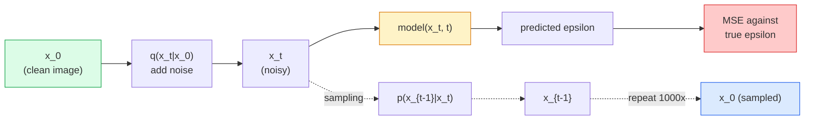

# 图像生成  Modelos de difusión

> El modelo de difusión es aprender a denoizar. Entrenarlo a eliminar una pequeña parte del ruido de la imagen con ruido, reverso y repetir este proceso mil veces, obtienes un generador de imágenes.

**Type:** Build
**Languages:** Python
**Prerequisites:** Phase 4 Lesson 07 (U-Net), Phase 1 Lesson 06 (Probability), Phase 3 Lesson 06 (Optimizers)
**Time:** ~75 分钟

## El objetivo del aprendizaje

- 推导 proceso de ruido avanzado `x_0 -> x_1 -> ... -> x_T`, y explicó por qué se cierra`q(x_t | x_0)`Para cualquier ciudad
- 实现 un objetivo de entrenamiento de estilo DDPM, para regresar a cada paso del ruido que se ha incorporado, y lograr un muestreo de ruido puro  retorno de imágenes paso a paso
- Construir una U-Net con tiempo condicionado(小到可以在CPU上训练), para predecir el ruido de cualquier paso de tiempo
-  Explicar las diferencias entre el muestreo de DDPM y DDIM, así como los escenarios de su aplicación.

##  problemas

Los modelos de difusión son generadores de generación: desde el ruido puro, a través de pequeños pasos denoise, los imágenes progresivamente surgen. Son rápidos, pero fácilmente entrenados. En los últimos cinco años, una característica más dominante fue que cualquier pequeño equipo puede entrenar un modelo de difusión y obtener un ejemplo razonable.

Además de entrenar estabilidad, la estructura de la generación de la difusión también desbloqueó todas las capacidades de la generación moderna de imágenes: condicionamiento de texto, pintura, edición de imágenes, superresolución, estilo controlado. Cada paso del ciclo de muestreo es una entrada en el nuevo conjunto. Es justo este gancho, que hace que la difusión estable, imagen, DALL-E 3 , Midjourney, así como cada modelo de imagen controlable que usará, se basen en la difusión.

Este curso construirá un DDPM mínimo: ruido hacia adelante, denuncio hacia atrás, ciclo de formación, y estabilidad de la difusión lo conectará a un sistema de producción, que incluye un codificador de texto y una guía libre de clasificadores.

## 核心概念 核心概念 核心概念 核心概念

### proceso avanzado

取一张图像                                                                                                                                                                                                                                                                                                                                                                                                                                                                                                                        `x_0` Añadir poco ruido gaussiano  get `x_1`△ Reincorporar poco ruido  get `x_2` Continuar el proceso hasta que`x_T`几乎无法与纯高斯噪音 区分──

```
q(x_t | x_{t-1}) = N(x_t; sqrt(1 - beta_t) * x_{t-1},  beta_t * I)
```

`beta_t`Es un horario de variación más pequeño, generalmente en T=1000 pasos, desde 0.0001 线性增长到0.02── cada paso reduce ligeramente la señal e inyecta un nuevo ruido──

### 闭式跳转 (cambio de tiempo)

 Paso a paso añadir ruido es una cadena de Markov, pero matemáticamente se puede doblar: puedes dar un paso directamente desde `x_0`muestra 出 `x_t`¿Qué es eso?

```
Define alpha_t = 1 - beta_t
Define alpha_bar_t = prod_{s=1..t} alpha_s

Then:
  q(x_t | x_0) = N(x_t; sqrt(alpha_bar_t) * x_0,  (1 - alpha_bar_t) * I)

Equivalently:
  x_t = sqrt(alpha_bar_t) * x_0 + sqrt(1 - alpha_bar_t) * epsilon
  where epsilon ~ N(0, I)
```

Esta única manera es la difusión, puede ser práctica.`t`, directamente desde`x_0`muestra 出 `x_t`,并一步完成训练, no necesita simular la cadena completa de Markov.

### proceso inverso

Proceso hacia adelante es fijo. Proceso inverso.`p(x_{t-1} | x_t)`Es una red neuronal que necesita aprender contenido.`x_{t-1}`Ellos prevé el ruido en el segundo paso`epsilon`, y luego por la fórmula matemática se deduce`x_{t-1}`¿Qué es eso?



###  entrenamiento Perdida

 Para cada paso de entrenamiento:

1. muestra 一张真实图像 `x_0`¿Qué es eso?
2. Desde [1, T] 中均样本 一个时间步骤 `t`¿Qué es eso?
3. ruido de muestra `epsilon ~ N(0, I)`¿Qué es eso?
4. 计算 `x_t = sqrt(alpha_bar_t) * x_0 + sqrt(1 - alpha_bar_t) * epsilon`¿Qué es eso?
5. Usado red 预测 `epsilon_theta(x_t, t)`¿Qué es eso?
6. Lo más pequeño .`|| epsilon - epsilon_theta(x_t, t) ||^2`¿Qué es eso?

Así es. La Red Neural Aprende a hacer ruido en cualquier paso de tiempo. La pérdida es MSE.

### muestreo (DDPM)

生成时: desde `x_T ~ N(0, I)`Empieza, paso a paso hacia atrás.

```
for t = T, T-1, ..., 1:
    eps = model(x_t, t)
    x_{t-1} = (1 / sqrt(alpha_t)) * (x_t - (beta_t / sqrt(1 - alpha_bar_t)) * eps) + sqrt(beta_t) * z
    where z ~ N(0, I) if t > 1, else 0
return x_0
```

El clave es que, aunque la condición inversa generalmente no tiene forma cerrada conocida, pero para este proceso Gaussian avanzado específico, es cerrado.

### ¿Por qué es 1000 pasos?

El objetivo de la selección del horario de ruido avanzado es hacer que cada paso se incluya un ruido suficientemente bueno, haciendo que el paso inverso sea muy similar al Gaussian.

### DDIM: rápidamente 20 veces de muestreo

訓練相同,樣本改變──DDIM(Song et al., 2020) define un proceso inverso de determinación, puede saltar pasos de tiempo en caso de no volver a entrenar── utilizar DDIM en 50 pasos, puede obtener cerca de 1000 pasos de calidad de DDPM──cada sistema de producción utiliza DDIM o más rápidos de variación(DPM-Solver、Euler ancestral)──

### Condicionamiento del tiempo

red `epsilon_theta(x_t, t)`需要知道它正在指明 哪个时间步骤──现代 Diffusion Models 通过突状时间嵌入 注入 `t`(La misma idea de codificación posicional en transformadores), y en cada nivel de U-Net añadirlo a los mapas de características arriba.

```
t_embedding = sinusoidal(t)
feature_map += MLP(t_embedding)
```

 sin tiempo condicionado, red  tiene que adivinar el nivel de ruido de la imagen en sí misma, esto también puede trabajar, pero la eficiencia de la muestra será mucho menor


```figure
cv-diffusion-image
```

## Construirlo

### 步骤 1: Programa de ruido

```python
import torch

def linear_beta_schedule(T=1000, beta_start=1e-4, beta_end=2e-2):
    return torch.linspace(beta_start, beta_end, T)


def precompute_schedule(betas):
    alphas = 1.0 - betas
    alphas_cumprod = torch.cumprod(alphas, dim=0)
    return {
        "betas": betas,
        "alphas": alphas,
        "alphas_cumprod": alphas_cumprod,
        "sqrt_alphas_cumprod": torch.sqrt(alphas_cumprod),
        "sqrt_one_minus_alphas_cumprod": torch.sqrt(1.0 - alphas_cumprod),
        "sqrt_recip_alphas": torch.sqrt(1.0 / alphas),
    }

schedule = precompute_schedule(linear_beta_schedule(T=1000))
```

预先计算一次, durante el entrenamiento y la muestreo 时按指数收集──

### 步骤 2: Diffusión hacia adelante (qu_sample)

```python
def q_sample(x0, t, noise, schedule):
    sqrt_a = schedule["sqrt_alphas_cumprod"][t].view(-1, 1, 1, 1)
    sqrt_one_minus_a = schedule["sqrt_one_minus_alphas_cumprod"][t].view(-1, 1, 1, 1)
    return sqrt_a * x0 + sqrt_one_minus_a * noise
```

Una línea cerrada en forma...`t`Es un conjunto de pasos en el tiempo, lote en el que cada imagen se encuentra en el mismo.

### Paso 3: Una pequeña U-Net con tiempo condicionado

```python
import torch.nn as nn
import torch.nn.functional as F
import math

def timestep_embedding(t, dim=64):
    half = dim // 2
    freqs = torch.exp(-math.log(10000) * torch.arange(half, device=t.device) / half)
    args = t[:, None].float() * freqs[None]
    emb = torch.cat([args.sin(), args.cos()], dim=-1)
    return emb


class TinyUNet(nn.Module):
    def __init__(self, img_channels=3, base=32, t_dim=64):
        super().__init__()
        self.t_mlp = nn.Sequential(
            nn.Linear(t_dim, base * 4),
            nn.SiLU(),
            nn.Linear(base * 4, base * 4),
        )
        self.t_dim = t_dim
        self.enc1 = nn.Conv2d(img_channels, base, 3, padding=1)
        self.enc2 = nn.Conv2d(base, base * 2, 4, stride=2, padding=1)
        self.mid = nn.Conv2d(base * 2, base * 2, 3, padding=1)
        self.dec1 = nn.ConvTranspose2d(base * 2, base, 4, stride=2, padding=1)
        self.dec2 = nn.Conv2d(base * 2, img_channels, 3, padding=1)
        self.time_proj = nn.Linear(base * 4, base * 2)

    def forward(self, x, t):
        t_emb = timestep_embedding(t, self.t_dim)
        t_emb = self.t_mlp(t_emb)
        t_proj = self.time_proj(t_emb)[:, :, None, None]

        h1 = F.silu(self.enc1(x))
        h2 = F.silu(self.enc2(h1)) + t_proj
        h3 = F.silu(self.mid(h2))
        d1 = F.silu(self.dec1(h3))
        d2 = torch.cat([d1, h1], dim=1)
        return self.dec2(d2)
```

两层 U-Net, y en cuello de botella Ingrese en el acondicionamiento de tiempo.

### Paso 4: Ciclo de entrenamiento

```python
def train_step(model, x0, schedule, optimizer, device, T=1000):
    model.train()
    x0 = x0.to(device)
    bs = x0.size(0)
    t = torch.randint(0, T, (bs,), device=device)
    noise = torch.randn_like(x0)
    x_t = q_sample(x0, t, noise, schedule)
    pred = model(x_t, t)
    loss = F.mse_loss(pred, noise)
    optimizer.zero_grad()
    loss.backward()
    optimizer.step()
    return loss.item()
```

Es un ciclo de entrenamiento completo. No hay juego de GAN, no hay pérdida especial. Solo una vez MSE.

### 步骤 5: Muestradora (DDPM)

```python
@torch.no_grad()
def sample(model, schedule, shape, T=1000, device="cpu"):
    model.eval()
    x = torch.randn(shape, device=device)
    betas = schedule["betas"].to(device)
    sqrt_one_minus_a = schedule["sqrt_one_minus_alphas_cumprod"].to(device)
    sqrt_recip_alphas = schedule["sqrt_recip_alphas"].to(device)

    for t in reversed(range(T)):
        t_batch = torch.full((shape[0],), t, dtype=torch.long, device=device)
        eps = model(x, t_batch)
        coef = betas[t] / sqrt_one_minus_a[t]
        mean = sqrt_recip_alphas[t] * (x - coef * eps)
        if t > 0:
            x = mean + torch.sqrt(betas[t]) * torch.randn_like(x)
        else:
            x = mean
    return x
```

Para crear un lote de muestras se necesita pasar 1000 veces hacia adelante. En el código real, lo reemplazarás por un muestreo de 50 pasos DDIM.

### 步骤 6: muestreo de DDIM (determinidad, aproximadamente 20 veces)

```python
@torch.no_grad()
def sample_ddim(model, schedule, shape, steps=50, T=1000, device="cpu", eta=0.0):
    model.eval()
    x = torch.randn(shape, device=device)
    alphas_cumprod = schedule["alphas_cumprod"].to(device)

    ts = torch.linspace(T - 1, 0, steps + 1).long()
    for i in range(steps):
        t = ts[i]
        t_prev = ts[i + 1]
        t_batch = torch.full((shape[0],), t, dtype=torch.long, device=device)
        eps = model(x, t_batch)
        a_t = alphas_cumprod[t]
        a_prev = alphas_cumprod[t_prev] if t_prev >= 0 else torch.tensor(1.0, device=device)
        x0_pred = (x - torch.sqrt(1 - a_t) * eps) / torch.sqrt(a_t)
        sigma = eta * torch.sqrt((1 - a_prev) / (1 - a_t) * (1 - a_t / a_prev))
        dir_xt = torch.sqrt(1 - a_prev - sigma ** 2) * eps
        noise = sigma * torch.randn_like(x) if eta > 0 else 0
        x = torch.sqrt(a_prev) * x0_pred + dir_xt + noise
    return x
```

`eta=0`Es totalmente definido: el mismo ruido:`eta=1`¡La DDPM se recuperará!

## Usalo

Productos y servicios`diffusers`¿Qué es esto ?

```python
from diffusers import DDPMScheduler, UNet2DModel

unet = UNet2DModel(sample_size=32, in_channels=3, out_channels=3, layers_per_block=2)
scheduler = DDPMScheduler(num_train_timesteps=1000)
```

Esta biblioteca ofrece programadores ya existentes (DDPM、DDIM、DPM-Solver、Euler、Heun)、可配置的 U-Nets、text-to-image 和 image-to-image pipelines, así como ayudantes de ajuste fino de LoRA。

En el estudio,`k-diffusion`(Katherine Crowson) hay las mejores variantes de muestreo y la más fiel referencia de realización.

##  entregarlo

Encuentro de trabajo:

- `outputs/prompt-diffusion-sampler-picker.md` Una respuesta rápida, basada en el objetivo de calidad 延迟预算和条件化 类型选择 DDPM / DDIM / DPM-Solver / Euler。
- `outputs/skill-noise-schedule-designer.md` Una habilidad, según el nivel de corrupción T 和 objetivo 生成线性、cosine 或 sigmoid beta schedule,并附带信号-噪音比 随着时间变化的诊断图――

##  ejercicios

1. **（简单）**可视化前进过程:取一张图像,并绘制 `t in [0, 100, 250, 500, 750, 1000]`时的 `x_t` Prueba`x_1000`Parece un ruido gaussiano puro.
2. **（中等）**En el conjunto de datos de círculos sintéticos, en 20 épocas, TinyUNet muestra 16 círculos.
3. **（困难）**实现 cosine noise schedule (Nichol & Dhariwal, 2021):`alpha_bar_t = cos^2((t/T + s) / (1 + s) * pi / 2)` Usar los horarios lineales y cosinos  entrenar con el mismo modelo,并 mostrar que el cosino en un número bajo de pasos puede producir mejores muestras 

## 关键术语: "El hombre es un hombre"

| Term | 人们通常怎么说 | 实际含义 |
|------|----------------|----------------------|
| Forward process | “随时间加入 noise” | 一个固定的 Markov chain，会在 T 步内把图像破坏成 Gaussian noise |
| Reverse process | “一步步 denoise” | 学到的分布，会从 noise 逐步走回图像 |
| Epsilon prediction | “预测 noise” | 训练目标：`epsilon_theta(x_t, t)` 预测在第 t 步加入的 noise |
| Beta schedule | “noise 大小” | T 个小 variance 组成的序列，定义每一步进入多少 noise |
| alpha_bar_t | “累计保留因子” | 到时间 t 为止的 (1 - beta_s) 乘积；t 越大，剩余信号越少 |
| DDPM sampler | “Ancestral，随机” | 从每个 x_{t-1} 的 conditional Gaussian 中 sample；1000 步 |
| DDIM sampler | “确定性，快速” | 将 sampling 重写为确定性 ODE；20-100 步即可得到相似质量 |
| Time conditioning | “告诉 model 当前是哪个 t” | 注入 U-Net 的 t 的 sinusoidal embedding，让它知道 noise level |

## 延伸阅读

- [Denoising Diffusion Probabilistic Models (Ho et al., 2020)](https://arxiv.org/abs/2006.11239) 让 Diffusion 变得实用和 FID 上击败 GANs 的论文
- [Improved DDPM (Nichol & Dhariwal, 2021)](https://arxiv.org/abs/2102.09672) calendario cosino y v-parametrización
- [DDIM (Song, Meng, Ermon, 2020)](https://arxiv.org/abs/2010.02502) 让实时推论 成为可能的确定性样本
- [Elucidating the Design Space of Diffusion (Karras et al., 2022)](https://arxiv.org/abs/2206.00364) Para cada difusión  diseño seleccionado 统一视角; actual mejor referencia
