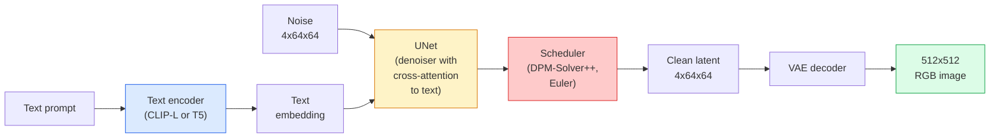

# Difusión estable  架构与细调

> La difusión estable es una forma de DDPM, que se ejecuta en el espacio latente de VAE, a través de la atención cruzada en el texto, utilizando un solvente ODE de rápida determinación para realizar la toma de ejemplos y guiarse por una guía libre de clasificadores.

**Type:** Learn + Use
**Languages:** Python
**Prerequisites:** Phase 4 Lesson 10 (Diffusion), Phase 7 Lesson 02 (Self-Attention)
**Time:** ~75 分钟

## El objetivo del aprendizaje
-  rastrear la flujo de difusión estable de cinco componentes: VAE, codificador de texto, U-Net, programador, verificador de seguridad, y entender lo que hacen en su propio
- Explicar la difusión latente, y por qué se puede entrenar en el espacio latente 4x64x64 en lugar de entrenar en 3x512x512  imágenes) se puede calcular en condiciones de no perder la calidad reducirá la cantidad 48x
- Uso `diffusers`生成图像,运行图像-to-image、inpainting 和 ControlNet 引导的生成
- En pequeños conjuntos de datos de auto-definición con LoRA de ajuste fino de la difusión estable, y la inferencia 时加载 LoRA adaptador

##  problemas
直接在 512x512 RGB 图像上训练 DDPM 成本很高. Cada paso de entrenamiento debe pasar por una U-Net hacer Backpropagation, mientras que esta U-Net 看到的是 3x512x512 = 786,432 个输入值;采样也需要通过同一个 U-Net 进行50+次前进通过. En el nivel de calidad de la Diffusion Stable 1.5(2022年发布) de la difusión de píxeles-espacio, se necesita aproximadamente 256 meses de entrenamiento de GPU, y en el nivel de consumo de GPUs en la GPUs más altas requiere 10-30 ⋅

让开放权重文字图像 变得实用技巧是 **latent diffusion**(Rombach et al., CVPR 2022)  entrenar un VAE, 3x512x512 图像映射到4x64x64 latente tensor 再映射回来,然后在这个 latente espacio 中做 Diffusion──计算量下降 `(3*512*512)/(4*64*64) = 48x`En el mismo bloque de GPU, el tiempo de muestra se reduce de unos pocos segundos a dos segundos.

几乎所有现代图像生成模型SDXL、SD3、FLUX、HunyuanDiT、Wan-Video都是隐藏的扩散模型,只是在自动编码器、denoiser(U-Net或 DiT) 和文本条件化上有所变化──学会稳定扩散,你已经掌握了这个模板──

## 概念
### El oleoducto



- **VAE** 结的 autoencoder──Encoder va a convertir imágenes en latences(para img2img 和训练)──Decoder va a convertir las latences 转回图像──
- **Text encoder** Código de texto CLIP(SD 1.x/2.x)、CLIP-L + CLIP-G(SDXL) o T5-XXL(SD3/FLUX)。 generar una serie de embeddings de tokens。
- **U-Net** denoiser──incluye la atención cruzada 层, en cada nivel de resolución desde los latentes de asistencia hasta el embebimiento de texto──
- **Scheduler** 采样算法(DDIM、Euler、DPM-Solver++)。 seleccionar sigmas,并将预测的噪音 混合回 latente。
- **Safety checker** 可選的输出图像 NSFW / 非法内容过器──

### Orientación sin clasificador (CFG)

Normal de texto condicionamiento se dirige a cada instante `c`El aprendizaje`epsilon_theta(x_t, t, c)` CFG  entrenamiento de la misma red, pero hay 10% del tiempo que se pierde `c`(substitución por embebido en el espacio), para obtener un modelo único de sonido condicional y incondicional ∞ en la inferencia:

```
eps = eps_uncond + w * (eps_cond - eps_uncond)
```

`w`Es la escala de orientación.`w=0`Es incondicional,`w=1`Es normal condicional,`w>1`Las condiciones de producción se han reducido, el precio se ha reducido.`w=7.5`¿Qué es eso?

CFG es el texto a la imagen “puede alcanzar la calidad de producción”.

### Geometría del espacio latente

La latencia de 4 canales de VAE no es sólo una imagen después de comprimir. Es un variado, en el que el cálculo de la operación de cálculo se produce en la ingeniería rápida + la interpolación se produce aquí, también en la red de difusión.

两个 resultados:

1. **Img2img**= Codificar imágenes como latente, incluir parte de ruido, ejecutar denoiser, volver a decodificar.
2. **Inpainting**= Igual, pero denoizador sólo actualiza la máscara 区域; no máscara 区域 reserva para el código latente。

### La arquitectura de la red U-Net

SD U-Net es la versión más grande de TinyUNet en la lección 10, y ha aumentado tres puntos:

- En cada espacio de resolución.**Transformer blocks**, contiene auto-atención + atención cruzada de la incorporación de texto.
-                                                                                                                                                                                                                                                                                                                                                                                                                                                                                                                              **Time embedding**¿Qué es eso?
- entre el codificador y el decodificador en la correspondencia de resolución **Skip connections**¿Qué es eso?

El aumento de los parámetros de SD 1.5 es principalmente de la capa de atención.

### Ajuste fino de la LORA

Para la difusión estable hacer un ajuste completo  necesita 20+ GB de VRAM,并更新 860M 个参数。LoRA(Low-Rank Adaptación) mantener el modelo base 结,并向 Attention 层注入小型级分解矩阵。 Se utiliza el adaptador LoRA de SD normalmente de 10-50 MB, en un solo bloque de consumo de GPU 上练 10-60 分钟, y en la inferencia 时作为滴进修 加载。

```
Original: W_q : (d_in, d_out)   frozen
LoRA:     W_q + alpha * (A @ B)   where A : (d_in, r), B : (r, d_out)

r is typically 4-32.
```

LoRA es el modo de diseño de casi todas las comunidades.

### Los horarios que verás

- **DDIM** 确定性, unos 50 pasos, simple...
- **Euler ancestral** 随机性,30-50 pasos,样本略有创意──
- **DPM-Solver++ 2M Karras** 确定性,20-30 pasos, producción默认选择──
- **LCM / TCD / Turbo** modelos de consistencia y variantes destiladas;

En el`diffusers`En cambio, el programa de cambio sólo necesita cambiar una línea, a veces no necesita ninguna reeducación en cuanto a la capacidad de reparar el problema de la toma de tiempo.


```figure
cv3-latent-compression
```

## Construirlo
本课端到端使用 `diffusers`, en lugar de reconstruir desde cero la difusión estable. Usted necesita reconstruir la parte de la misma.

### Paso 1: Texto a imagen

```python
import torch
from diffusers import StableDiffusionPipeline

pipe = StableDiffusionPipeline.from_pretrained(
    "runwayml/stable-diffusion-v1-5",
    torch_dtype=torch.float16,
).to("cuda")

image = pipe(
    prompt="a dog riding a skateboard in tokyo, studio ghibli style",
    guidance_scale=7.5,
    num_inference_steps=25,
    generator=torch.Generator("cuda").manual_seed(42),
).images[0]
image.save("dog.png")
```

`float16`En caso de pérdida de calidad no visible, VRAM se reducirá a la mitad.`num_inference_steps=25`El efecto es equivalente al uso de DDIM 时 `num_inference_steps=50`¿Qué es eso?

### 步骤 2: Cambiar el cronograma

```python
from diffusers import DPMSolverMultistepScheduler, EulerAncestralDiscreteScheduler

pipe.scheduler = DPMSolverMultistepScheduler.from_config(pipe.scheduler.config)
pipe.scheduler = EulerAncestralDiscreteScheduler.from_config(pipe.scheduler.config)
```

El estado del programador con los pesos de U-Net 解── puedes entrenar en DDPM, luego usar el programador arbitrario 采样──

### 步骤 3: Imagen a imagen

```python
from diffusers import StableDiffusionImg2ImgPipeline
from PIL import Image

img2img = StableDiffusionImg2ImgPipeline.from_pretrained(
    "runwayml/stable-diffusion-v1-5",
    torch_dtype=torch.float16,
).to("cuda")

init_image = Image.open("dog.png").convert("RGB").resize((512, 512))
out = img2img(
    prompt="a dog riding a skateboard, oil painting",
    image=init_image,
    strength=0.6,
    guidance_scale=7.5,
).images[0]
```

`strength`Indicar en denociando  antes de que se incluya mucho ruido(0.0 = 不变,1.0 = 完全重新生成)──0.5-0.7 es el rango estándar de transferencia de estilo──

### 步骤 4: Pintura

```python
from diffusers import StableDiffusionInpaintPipeline

inpaint = StableDiffusionInpaintPipeline.from_pretrained(
    "runwayml/stable-diffusion-inpainting",
    torch_dtype=torch.float16,
).to("cuda")

image = Image.open("dog.png").convert("RGB").resize((512, 512))
mask = Image.open("dog_mask.png").convert("L").resize((512, 512))

out = inpaint(
    prompt="a cat",
    image=image,
    mask_image=mask,
    guidance_scale=7.5,
).images[0]
```

Las imágenes blancas en la máscara son la región que debe regenerarse. Las imágenes negras se conservarán.

### 步骤 5: Carga de carga de carga

```python
pipe.load_lora_weights("sayakpaul/sd-lora-ghibli")
pipe.fuse_lora(lora_scale=0.8)

image = pipe(prompt="a village square in ghibli style").images[0]
```

`lora_scale`控制强度;0.0 = 无效,1.0 = 完整效果──`fuse_lora`El adaptador se pondrá en marcha para aumentar la velocidad, pero se bloqueará el cambio.`pipe.unfuse_lora()`¿Qué es eso?

### 步骤 6: Formación de la LRA (bozo)

El entrenamiento real de LoRA se encuentra en`peft`O `diffusers.training`En el siguiente:

```python
# Pseudocode
for step, batch in enumerate(dataloader):
    images, prompts = batch
    latents = vae.encode(images).latent_dist.sample() * 0.18215

    t = torch.randint(0, num_train_timesteps, (batch_size,))
    noise = torch.randn_like(latents)
    noisy_latents = scheduler.add_noise(latents, noise, t)

    text_emb = text_encoder(tokenizer(prompts))

    pred_noise = unet(noisy_latents, t, text_emb)  # LoRA weights injected here

    loss = F.mse_loss(pred_noise, noise)
    loss.backward()
    optimizer.step()
```

只有LoRA matrices 会接收 Gradient;base U-Net、VAE 和 text encoder都被结──使用批量为 1 和梯度检查点时,这可以适应8GBVRAM──

## Usalo
En la producción, las decisiones que realmente necesitas tomar son:

- **Model family**SD 1.5 Utilizado para código abierto  comunidad de música fina, SDXL Utilizado para mayor fidelidad, SD3 / FLUX Utilizado para estado de la técnica 和严格许可要求──
- **Scheduler**:20-30 pasos Utiliza DPM-Solver++ 2M Karras; cuando la latencia 低于1s 时使用 LCM-LoRA──
- **Precision**0480/4090 上使用 `float16`,A100 及 actualización de los equipos `bfloat16`,VRAM 紧张时使用 `int8`(a través de `bitsandbytes`O `compel`)。
- **Conditioning**Si necesitas un control más fuerte, en el tubo base 之上加入ControlNet(canny、depth、pose)

 para la producción en granel,`AUTO1111`- ¿ Qué ?`ComfyUI`Es un instrumento comunitario; para la producción de API, uso `diffusers`¿ Qué es eso ?`accelerate`, o utilizar con TensorRT compilación de `optimum-nvidia`¿Qué es eso?

##  entregarlo
本课产 出:

- `outputs/prompt-sd-pipeline-planner.md` Una respuesta rápida, en función del presupuesto de latencia, objetivo de fidelidad y restricción de licencias, optar por SD 1.5 / SDXL / SD3 / FLUX, así como programador y precisión.
- `outputs/skill-lora-training-setup.md` Una habilidad, utilizada para la auto-definición de datos de la configuración completa de entrenamiento de LoRA, incluyendo títulos, rango, tamaño de lote y tasa de aprendizaje.

##  ejercicios
1. **(Easy)**Uso `[1, 3, 5, 7.5, 10, 15]`En el centro`guidance_scale`¿Cuál es la guía para que los artefactos empiecen a aparecer?
2. **(Medium)**選取任意真实照片, en `[0.2, 0.4, 0.6, 0.8, 1.0]`de la `strength`Por el lado`StableDiffusionImg2ImgPipeline`¿Qué fuerza puede mantener la estructura al mismo tiempo que cambia el estilo? ¿Por qué 1.0 ignorará completamente la entrada?
3. **(Hard)**Utiliza un solo tema (物、logo、角色) de 10-20 张图像训练一个LoRA,并生成包含该主体的新场景――报告在不过适合输入图像的情况下产生最佳身份保持效果的LoRA级和训练步骤――

## 关键术语: "El hombre es un hombre"
| Term | What people say | What it actually means |
|------|----------------|----------------------|
| Latent diffusion | “在 latents 中 diffuse” | 在 VAE latent space（4x64x64）而不是 pixel space（3x512x512）中运行整个 DDPM；节省 48x 计算量 |
| VAE scale factor | “0.18215” | 将 VAE 的原始 latent 重新缩放到大致 unit variance 的常数；硬编码在每个 SD pipeline 中 |
| Classifier-free guidance | “CFG” | 混合 conditional 和 unconditional noise predictions；影响最大的 inference knob |
| Scheduler | “Sampler” | 将 noise + model predictions 转换为 denoised latent trajectory 的算法 |
| LoRA | “Low-rank adapter” | 小型 rank-decomposition matrices，可在不触碰 base weights 的情况下 fine-tune Attention 层 |
| Cross-attention | “Text-image attention” | 从 latent tokens 到 text tokens 的 Attention；在每个 U-Net 层级注入 prompt 信息 |
| ControlNet | “Structure conditioning” | 一个单独训练的 adapter，用额外输入（canny、depth、pose、segmentation）引导 SD |
| DPM-Solver++ | “默认 scheduler” | 二阶确定性 ODE solver；在低 step counts（20-30）下拥有最佳质量（2026 年） |

## 延伸阅读
- [High-Resolution Image Synthesis with Latent Diffusion (Rombach et al., 2022)](https://arxiv.org/abs/2112.10752) Dissolución estable 论文; contiene pruebas de que cada ablación de diseño razonable
- [Classifier-Free Diffusion Guidance (Ho & Salimans, 2022)](https://arxiv.org/abs/2207.12598) CFG 论文
- [LoRA: Low-Rank Adaptation of Large Language Models (Hu et al., 2021)](https://arxiv.org/abs/2106.09685)LoRA se utiliza originalmente en la PNL; casi no se necesita modificar para su traslado a SD
- [diffusers documentation](https://huggingface.co/docs/diffusers) Referencias de cada oleoducto SD / SDXL / SD3 / FLUX
