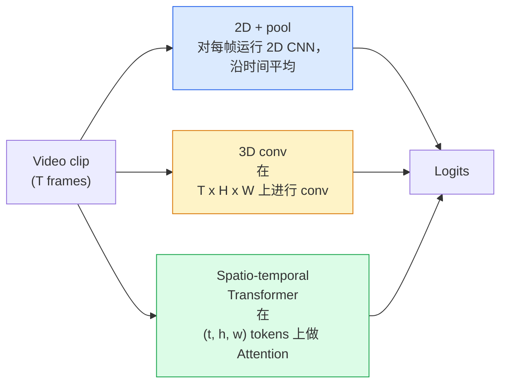

# Video Comprensión  时间建模

> 视频 es una serie de imágenes, además de las reglas físicas que las conectan. Cada modelo de video debe considerar el tiempo como un eje extra.

**类型：**学习 + 构建
**语言：**Python
**先修要求：**Fase 4 Lección 03(CNN),Fase 4 Lección 04(Clasificación de imágenes)
**时间：**- 45 minutos

## El objetivo del aprendizaje

- 区分三种主要视频建模方法(2D+pool、3D conv、espacio-temporal Transformer), y prever su tasa de costo y precisión
- En PyTorch se realiza el muestreo de cuadros, el agrupamiento temporal, así como un clasificador de línea base 2D+pool
-  Explicar por qué los núcleos 3D de I3D inflados 3D 能很好从 ImageNet pesos 迁移, así como las diferencias de con factorizados (2+1) D
- Comprender los conjuntos de datos estándar de reconocimiento de acción con métricas: Kinética-400/600、UCF101、Algo-Algo V2; nivel de vídeo y nivel de vídeo de precisión superior-1

##  problemas

Un video de 30 segundos ∼30 fps contiene 900张图像──en simple vista, la clasificación de vídeo es simplemente ejecutar una clasificación de 900 imágenes, luego hacer algún tipo de aglutinamiento──en el movimiento casi en cada uno de ellos, este método es efectivo 🏻🏻🏻🏻🏻🏻🏻🏻🏻🏻🏻🏻🏻🏻🏻🏻🏻🏻🏻🏻🏻🏻🏻🏻🏻🏻🏻🏻🏻🏻🏻🏻🏻🏻🏻🏻🏻🏻🏻🏻🏻🏻🏻🏻🏻🏻🏻🏻🏻🏻🏻🏻🏻🏻🏻🏻🏻🏻🏻🏻🏻🏻🏻🏻🏻🏻🏻🏻🏻🏻🏻🏻🏻🏻🏻🏻🏻🏻🏻🏻🏻🏻🏻🏻🏻🏻🏻🏻🏻🏻🏻🏻🏻🏻🏻🏻🏻🏻🏻🏻🏻🏻🏻🏻🏻🏻🏻🏻🏻🏻🏻🏻🏻🏻🏻🏻🏻🏻🏻🏻🏻🏻🏻🏻🏻🏻🏻🏻🏻🏻🏻🏻🏻🏻🏻🏻🏻🏻🏻🏻🏻🏻🏻🏻🏻🏻🏻🏻🏻🏻🏻🏻🏻🏻🏻🏻🏻🏻🏻🏻🏻🏻🏻🏻🏻🏻🏻🏻🏻🏻🏻🏻🏻🏻🏻🏻🏻🏻🏻🏻🏻🏻🏻🏻🏻🏻🏻🏻🏻🏻🏻🏻🏻🏻🏻🏻🏻🏻🏻🏻🏻🏻🏻🏻🏻🏻🏻🏻🏻🏻🏻🏻🏻🏻🏻🏻🏻🏻🏻🏻🏻🏻🏻🏻🏻🏻🏻🏻🏻🏻🏻🏻🏻🏻🏻🏻🏻🏻🏻🏻🏻🏻🏻🏻🏻🏻🏻🏻🏻🏻🏻🏻🏻🏻🏻🏻🏻🏻🏻🏻🏻🏻🏻🏻🏻🏻🏻🏻🏻🏻🏻🏻🏻🏻🏻🏻🏻🏻🏻🏻🏻🏻🏻🏻🏻🏻🏻🏻🏻🏻🏻🏻🏻🏻🏻🏻🏻🏻🏻🏻🏻🏻🏻🏻🏻🏻🏻🏻🏻🏻🏻🏻🏻🏻🏻🏻🏻🏻🏻🏻🏻🏻🏻🏻🏻🏻🏻🏻🏻🏻🏻🏻🏻🏻🏻🏻🏻🏻🏻🏻🏻🏻🏻🏻🏻🏻🏻🏻🏻🏻🏻🏻🏻🏻🏻🏻🏻🏻🏻🏻🏻🏻🏻🏻🏻🏻🏻🏻🏻🏻🏻🏻🏻🏻🏻🏻🏻🏻🏻🏻🏻🏻🏻🏻🏻🏻🏻🏻🏻🏻🏻🏻🏻🏻🏻🏻🏻🏻🏻🏻🏻🏻🏻🏻🏻🏻🏻🏻🏻🏻🏻🏻🏻🏻🏻🏻🏻🏻🏻🏻🏻🏻🏻🏻🏻🏻🏻🏻🏻🏻🏻🏻🏻🏻🏻🏻🏻🏻🏻🏻🏻🏻🏻🏻🏻🏻

El problema central de cada video arquitectura es: ¿Cuándo se construye la estructura temporal? La respuesta determinará todo lo demás, incluyendo el cálculo de costos, estrategias de retratamiento, si se puede utilizar de nuevo los pesos de ImageNet, así como en qué conjunto de datos se entrenará el modelo.

Este curso está diseñado para ser más breve que el de imágenes en estado. El mecanismo central de imágenes ya está en marcha, mientras que la comprensión de vídeo se centra principalmente en la dimensión del tiempo.

## 核心概念 核心概念 核心概念 核心概念

### Tres clases de arquitectura



### 2D + piscina

取一个2D CNN(ResNet、EfficientNet、ViT) ⋅在每个采样上独立运行它──对每的嵌入做平均(或最大池,或注意池)──将聚向量输入分类器──

优点:
- El preentrenamiento de ImageNet puede ser transferido directamente.
- 实现 lo más simple.
- 便宜:T  * 单张图像推理成本──

缺点:
- 无法建模运动──Acción = concentración de apariencias──
- El agrupamiento temporal es poco sensible al orden; la puerta abierta y la puerta cerrada se ven iguales.

适用场景: para la apariencia como tareas principales 小视频数据集中的转移学习 初始基线――

### Convolturas en 3D

Se realizarán convisiones simultáneas en el espacio y el tiempo.

I3D 技巧: Tome un modelo preentrenado de 2D ImageNet, va a cada núcleo 2D 沿新时间轴复制,从而膨胀──a una 3x3 2D conv 变成一个 3x3x3 3D conv──这让3D model 拥有强大的预训重量,而不是从零开始训练──

优点:
- 直接建模动作──
- Inflación I3D  proporcionar aprendizaje de transferencia gratis

缺点:
- Por ejemplo, el modelo de 2D de T/8 de FLOPs (en el núcleo temporal) se encuentra en una situación de 3 veces.
- Los núcleos temporales 很小; el movimiento de largo plazo 需要 piramide o doble corriente 方法──

适用场景:moción es el reconocimiento de la acción de los señales (Qualquier cosa-algo V2 、 contiene una gran cantidad de clases de movimiento pesado de la cinética) 

### 时空 Transformadores

将视频 Tokenize 成 espacio-tiempo parches 网格, y en todos los parches 之间 hacer Atención──TimeSformer、ViViT、Video Swin、VideoMAE──

importantes patrones de atención:
- **Joint** 在 (t, h, w) 上做一次大注意──对 `T*H*W`呈二次复杂度;昂贵──
- **Divided** Cada bloque hacer dos veces Atención: una vez a lo largo del tiempo, una vez a lo largo del espacio―
- **Factorised** Atención temporal y atención espacial entre bloques 交换──

优点:
- En todos los principales puntos de referencia, alcanzar la precisión de SOTA.
-                                                                                                                                                                                                                                                               
- 通过稀疏关注 支持长文段视频──

缺点:
- 计算需求高――
- 需要谨慎选择 Atención patrón, de lo contrario el tiempo de ejecución 会膨胀──

适用场景: 高保真 video comprensión 多模式视频+text tasks──

### Muestreo de los cuadros

Un clip de 10 segundos ∙ 30 fps tiene 300 ; poner todos los 300  en cualquier modelo es un gran desperdicio.

- **Uniform sampling** 在片中均选取 T ──2D+pool 的默认选择──
- **Dense sampling** 随机连续 T-frame window──3D convs 中常见,因为运动 需要相邻──
- **Multi-clip** Desde el mismo vídeo en el que se toman varias ventanas de T-frame,分分类, y en el ensayo se hacen previsiones promedio.

T normalmente es 8、16、32 o 64。 T superior = más señal temporal, también significa más cálculo。

### Evaluación

Dos niveles:
- **Clip-level accuracy** 模型 ver un clip de T-frame, reportar top-k。
- **Video-level accuracy** Las predicciones de nivel de clip para varios clips de cada video 取平均;更高且更稳定──

始终报告两者──一个分数为78% clip / 82% video的模型高度依赖测试时间平均;一个分数为80% / 81%的模型在每片上更强──

### Los datos que encontrará

- **Kinetics-400 / 600 / 700**  通用 acción conjunto de datos──400k clips; URL de YouTube(很多现在已经失效)──
- **Something-Something V2** Por movimiento 定义的行动(移动X de izquierda a derecha)
- **UCF-101**¿Qué es esto?**HMDB-51** 更老、更小, pero todavía se informa―
- **AVA** En el espacio y en el tiempo la acción *localización*; Más difícil que la clasificación


```figure
v4-video-temporal
```

## Construirlo

### 步骤 1: Muestradora de marco

适用于列表或视频的均和密集样本

```python
import numpy as np

def sample_uniform(num_frames_total, T):
    if num_frames_total <= T:
        return list(range(num_frames_total)) + [num_frames_total - 1] * (T - num_frames_total)
    step = num_frames_total / T
    return [int(i * step) for i in range(T)]


def sample_dense(num_frames_total, T, rng=None):
    rng = rng or np.random.default_rng()
    if num_frames_total <= T:
        return list(range(num_frames_total)) + [num_frames_total - 1] * (T - num_frames_total)
    start = int(rng.integers(0, num_frames_total - T + 1))
    return list(range(start, start + T))
```

Dos de ellos regresan .`T`Indices, para el tensor de vídeo de las piezas de corte

### Paso 2: Una línea de base 2D + pool

En cada uno de los 2D ResNet-18 funcionan con características de pool promedio, luego se clasifican.

```python
import torch
import torch.nn as nn
from torchvision.models import resnet18, ResNet18_Weights

class FramePool(nn.Module):
    def __init__(self, num_classes=400, pretrained=True):
        super().__init__()
        weights = ResNet18_Weights.IMAGENET1K_V1 if pretrained else None
        backbone = resnet18(weights=weights)
        self.features = nn.Sequential(*(list(backbone.children())[:-1]))  # global avg pool kept
        self.head = nn.Linear(512, num_classes)

    def forward(self, x):
        # x: (N, T, 3, H, W)
        N, T = x.shape[:2]
        x = x.view(N * T, *x.shape[2:])
        feats = self.features(x).view(N, T, -1)
        pooled = feats.mean(dim=1)
        return self.head(pooled)

model = FramePool(num_classes=10)
x = torch.randn(2, 8, 3, 224, 224)
print(f"output: {model(x).shape}")
print(f"params: {sum(p.numel() for p in model.parameters()):,}")
```

En las tareas de apariencia pesada, esta línea de base suele ser sólo de 5 a 10 puntos más baja que los modelos 3D reales, a veces incluso mejor, ya que utiliza una columna vertebral de ImageNet más fuerte.

### Paso 3: Convoltura 3D inflada en estilo I3D

通过沿新时间轴重复重重重重重重重重重重重重重重重重重重重重重重重重重重重重重重重重重重重重重重重重重重重重重重重重重重重重重重重重重重重重重重重重重重重重重重重重重重重重重重重重重重重重重重重重重重重重重重重重重重重重重重重重重重重重重重重重重重重重重重重重重重重重重重重重重重重重重重重重重重重重重重重重重重重重重重重重重重重重重重重重重重重重重重重重重重重重重重重重重重重重重重重重重重重重重重重重重重重重重重重重重重重重重重重重重重重重重重重重重重重重重重重重重重重重重重重重重重重重重重重重重重重重重重重重重重重重重重重重重重重重重重重重重重重重重重重重重重重重重重重重重重重重重重重重重重重重重重重重重重重重重重重重重重重重重重重重重重重重重重重重重重重重重重重重重重重重重重重重重重重重重重重重重重重重重重重重重重重重重重重重重重重重重重重重重重重重重重重重重重重重重重重重重重重重重重重重重重重重重重重重重重重重重重重重重重重重重重重重重重重重重重重重重重重重重重重重重重重重重重重重重重重重重重重重重重重重重重重重重重重重重重重重重重重重重重重重重重重重重重重重重重重重重重重重重重重重重重重重重重重重重重

```python
def inflate_2d_to_3d(conv2d, time_kernel=3):
    out_c, in_c, kh, kw = conv2d.weight.shape
    weight_3d = conv2d.weight.data.unsqueeze(2)  # (out, in, 1, kh, kw)
    weight_3d = weight_3d.repeat(1, 1, time_kernel, 1, 1) / time_kernel
    conv3d = nn.Conv3d(in_c, out_c, kernel_size=(time_kernel, kh, kw),
                        padding=(time_kernel // 2, conv2d.padding[0], conv2d.padding[1]),
                        stride=(1, conv2d.stride[0], conv2d.stride[1]),
                        bias=False)
    conv3d.weight.data = weight_3d
    return conv3d

conv2d = nn.Conv2d(3, 64, kernel_size=3, padding=1, bias=False)
conv3d = inflate_2d_to_3d(conv2d, time_kernel=3)
print(f"2D weight shape:  {tuple(conv2d.weight.shape)}")
print(f"3D weight shape:  {tuple(conv3d.weight.shape)}")
x = torch.randn(1, 3, 8, 56, 56)
print(f"3D output shape:  {tuple(conv3d(x).shape)}")
```

Además de`time_kernel`Las magnitudes de activación de la serie de datos de la serie de datos de la serie de datos de la serie de datos de la serie de datos de la serie de datos de la serie de datos de la serie de datos de la serie de datos de la serie de datos de la serie de datos de la serie de datos de la serie de datos de la serie de datos de la serie de datos de la serie de datos de la serie de datos de la serie de datos de la serie de datos de la serie de datos de la serie de datos de la serie de datos de la serie de datos de la serie de datos de la serie de datos de la serie de datos de la serie de datos de la serie de datos de la serie de datos de la serie de datos de la serie de datos de datos de la serie de datos de datos de la serie de datos de la serie de datos de la serie de datos de la serie de datos de datos de la serie de datos de la serie de datos de la serie de datos de la serie de datos de la serie de datos de la serie de datos de la serie de datos de la serie de datos de datos de la serie de datos de la serie de datos de la serie de datos de datos de la serie de datos de la serie de datos de la serie de datos de datos de la serie de datos de la serie de datos de la serie de datos de la serie de datos de la serie de datos de la serie de datos de la serie de la serie de datos de la serie de datos de la serie de la serie de la serie de datos de la serie de la serie de datos de la serie de la serie de la serie de la serie de la serie de la serie de datos de la serie de la serie de la serie de la serie de la serie de la serie de la serie de la serie de la serie de la serie de la serie de la serie de la serie de la serie de la serie de la serie de la serie de la serie de la serie de la serie de la serie de la serie de la serie de la serie de la serie de la serie de la serie de la de la serie de la de la serie de la serie de la de la serie de la serie de la de la serie de la de la de la serie de la de la de la serie de la serie de la serie de la serie de la serie de la serie de la de la serie de la de la de la serie de la de la de la serie de la de la de

### 步骤 4: Factorizado (2+1) D con

La conversión 3D se descompone en una conversión 2D y una conversión temporal. El mismo campo receptivo, menor de parámetros, en algunos puntos de referencia, aumenta la precisión.

```python
class Conv2Plus1D(nn.Module):
    def __init__(self, in_c, out_c, kernel_size=3):
        super().__init__()
        mid_c = (in_c * out_c * kernel_size * kernel_size * kernel_size) \
                // (in_c * kernel_size * kernel_size + out_c * kernel_size)
        self.spatial = nn.Conv3d(in_c, mid_c, kernel_size=(1, kernel_size, kernel_size),
                                 padding=(0, kernel_size // 2, kernel_size // 2), bias=False)
        self.bn = nn.BatchNorm3d(mid_c)
        self.act = nn.ReLU(inplace=True)
        self.temporal = nn.Conv3d(mid_c, out_c, kernel_size=(kernel_size, 1, 1),
                                  padding=(kernel_size // 2, 0, 0), bias=False)

    def forward(self, x):
        return self.temporal(self.act(self.bn(self.spatial(x))))

c = Conv2Plus1D(3, 64)
x = torch.randn(1, 3, 8, 56, 56)
print(f"(2+1)D output: {tuple(c(x).shape)}")
```

Completa red R  2 + 1) D es igual a una ResNet-18, sólo para reemplazar cada 3x3 conv`Conv2Plus1D`¿Qué es eso?

## Usalo

两个 bibliotecas cubren la producción de video trabajos:

- `torchvision.models.video` R(2+1) D、MViT、Swin3D, con pesos de cinética preentrenados──API y modelos de imagen 相同──
- `pytorchvideo`(Meta)  modelo de zoológico 、 para cargadores de datos de Kinética / SSv2 / AVA 、 estándares de transformaciones 、

对于视频模型视频语言 (Vision-Language) 视频标题,视频质量),使用 `transformers`(El artículo`VideoMAE`¿Qué es esto?`VideoLLaMA`¿Qué es esto?`InternVideo`)。

##  entregarlo

Encuentro de trabajo:

- `outputs/prompt-video-architecture-picker.md` Una respuesta rápida, según la apariencia-vs-movimiento, tamaño del conjunto de datos y presupuesto de cálculo  seleccionar 2D+pool / I3D / (2+1)D / Transformer。
- `outputs/skill-frame-sampler-auditor.md` Una habilidad, para examinar el muestreo de la tubería de vídeo,并标记常见错误:off-by-one index,`num_frames < T`时 muestreo 不均、缺少 aspect-preserving crop等──

##  ejercicios

1. **（简单）**计算 FramePool 在 T=8 时的 FLOPs(近似值),并与 T=8 的 I3D-style 3D ResNet对比──说明为什么 2D+pool 便宜 3-5 倍──
2. **（中等）**生成一个合成视频数据集:随机小球朝随机方向移动,并按运动方向标注(左到右、右到左、斜面) ⋅ en su entrenamiento FramePool── mostrar su precisión de tasa cerca de随机水平, de modo que demuestra sólo por la apariencia no es suficiente para completar las tareas de movimiento──
3. **（困难）**                                                                                                                                                                                                                                                                                                                                                                                                                                                                                                                             `Conv2Plus1D`, construir un R(2+1) D-18── con ImageNet-preentrenado ResNet-18 inflar el primer conv de pesos── en el ejercicio 2 del movimiento conjunto de datos 上训练,并超过 FramePool──

## 关键术语: "El hombre es un hombre"

| Term | 人们常说 | 实际含义 |
|------|----------------|----------------------|
| 2D + pool | “Per-frame classifier” | 在每个采样帧上运行 2D CNN，跨时间 average-pool features，然后分类 |
| 3D convolution | “Spatio-temporal kernel” | 在 (T, H, W) 上进行 conv 的 kernel；可以原生建模 motion |
| Inflation | “Lift 2D weights to 3D” | 通过沿新的时间轴重复 2D conv 的 weights 来初始化 3D conv weights，然后除以 kernel_T 以保持 activation scale |
| (2+1)D | “Factorised conv” | 将 3D 拆成 2D spatial + 1D temporal；参数更少，中间多一个非线性 |
| Divided attention | “Time then space” | 每层有两次 Attention 的 Transformer block：一次在同一帧的 tokens 上，一次在同一位置的 tokens 上 |
| Clip | “T-frame window” | T 帧的采样子序列；video model 消费的单位 |
| Clip vs video accuracy | “Two eval settings” | Clip = 每个视频一个 sample，video = 对多个 sampled clips 取平均 |
| Kinetics | “The ImageNet of video” | 400-700 个 action classes，300k+ YouTube clips，标准 video pretraining corpus |

## 延伸阅读

- [I3D: Quo Vadis, Action Recognition (Carreira & Zisserman, 2017)](https://arxiv.org/abs/1705.07750)   propuso inflación y conjunto de datos de la cinética
- [R(2+1)D: A Closer Look at Spatiotemporal Convolutions (Tran et al., 2018)](https://arxiv.org/abs/1711.11248) factorizado con, hasta ahora sigue siendo fuerte
- [TimeSformer: Is Space-Time Attention All You Need? (Bertasius et al., 2021)](https://arxiv.org/abs/2102.05095) El primer video transformador fuerte
- [VideoMAE (Tong et al., 2022)](https://arxiv.org/abs/2203.12602) Usado en el video de autoencoder enmascarado preentrenamiento; actual receta de preentrenamiento de la mayoría de los medios
