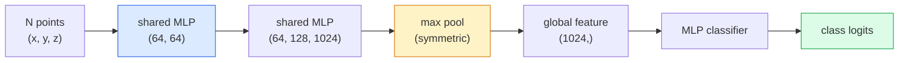

# Visión 3D  Nube de punto y NeRF

> La visión 3D tiene dos formas. La nube de punto es la salida original del sensor. NeRF es el campo volumétrico que se obtiene de aprendizaje.

**类型：**Aprender + Construir
**语言：**Python
**先修：**Fase 4 Lección 03 (CNN), Fase 1 Lección 12 (Operaciones de tensión)
**时间：**- 45 minutos

## El objetivo del aprendizaje
- 区分显式(nube de punto, malla, voxel) y隐式(segno de campo de distancia, NeRF) representaciones 3D,并理解各自适用场景
- Comprender la función simétrica de PointNet 技巧: cómo permite que la red neuronal para los grupos de puntos sin orden tenga una naturaleza invariable de permutación
-  rastrear el paso del NeRF hacia adelante: proyección de rayos  renderización volumétrica  codificación de posición  densidad MLP + cabeza de color
- Uso `nerfstudio`O `instant-ngp`Basado en imágenes de poca cantidad de poses realizar una reconstrucción 3D pre-entrenada

##  problemas
La cámara  produce imagen 2D―LIDAR  produce un grupo sin orden de puntos 3D―Structure-from-motion pipeline  produce raros puntos clave 3D cloud―NeRF puede reconstruir una imagen completa de la escena 3D―con poca cantidad de imágenes de la posición―Estos son de la visión, pero no son como el tenso denso que quiere CNN―

La visión 3D es importante, ya que casi todas las tareas de robots de alto valor se ejecutan en 3D: agarrar, evitar obstáculos, navegación, oclusión de AR, captura de contenido 3D. Sólo el ingeniero de visión de imágenes 2D puede entender, será excluido de la parte más rápida de este campo de crecimiento.

Estas dos clases de representaciones, por diferentes razones, están dominadas. Las nubes de puntos son sensores, gratis para ti.

## 概念
### Nube de punto

Nube de punto es un conjunto de puntos de N 个点, cada punto puede ser seleccionado con características de color, intensidad, normalidad.

```
cloud = [
  (x1, y1, z1, r1, g1, b1),
  (x2, y2, z2, r2, g2, b2),
  ...
  (xN, yN, zN, rN, gN, bN),
]
```

 sin red, sin conectividad                                                                                                                                                                                                                                                          

- **Permutation invariance** 输出 no puede depender de la orden de los puntos.
- **Variable N** 单个模型 必须能够处理不同大小的云

PointNet (Qi et al., 2017) utilizó una idea para resolver dos cosas: para cada aplicación de puntos compartidos MLP, luego con la función simétrica (((max pool)聚合── el resultado es un vector de tamaño fijo, y no depende de la secuencia──

```
f(P) = max_{p in P} MLP(p)
```

Este es el centro de todo PointNet.

### La arquitectura de PointNet



MLP compartida  significa la misma MLP 独立地运行在每个点上──为了效率, usualmente se realiza por la dimensión del punto en 1x1 conv──

### Los campos de radiación neuronal (NeRF)

NeRFs (Mildenhall et al., 2020) plantearon la pregunta: ¿¿¿Podemos reconstruir una escena 3D desde N 张照片?La respuesta es:`(x, y, z, viewing_direction)`映射到 `(density, colour)`染新视角 es un ciclo de proyección de rayos alrededor de la red.

```
NeRF MLP:  (x, y, z, theta, phi) -> (sigma, r, g, b)

To render a pixel (u, v) of a new view:
  1. Cast a ray from the camera through pixel (u, v)
  2. Sample points along the ray at distances t_1, t_2, ..., t_N
  3. Query the MLP at each point
  4. Composite the colours weighted by (1 - exp(-sigma * dt))
  5. The sum is the rendered pixel colour
```

Perdida de imágenes: ¿Qué se puede hacer con el pixel de la realidad de la tierra en la foto de entrenamiento?

### Encoderación de posición en el NeRF

作用在 `(x, y, z)`Los MLP de vainilla de arriba no pueden indicar detalles de alta frecuencia, ya que los MLP de arriba en la gama de frecuencias se desplazan hacia abajo en la gama de frecuencias.

```
gamma(p) = (sin(2^0 pi p), cos(2^0 pi p), sin(2^1 pi p), cos(2^1 pi p), ...)
```

Esto es lo mismo que los transformadores usan las mismas técnicas de posiciones, también aparecerá de nuevo en el tiempo de difusión (lección 10)

### Renderamiento volumétrico

```
C(r) = sum_i T_i * (1 - exp(-sigma_i * delta_i)) * c_i

T_i  = exp(- sum_{j<i} sigma_j * delta_j)
delta_i = t_{i+1} - t_i
```

`T_i`Es la transmisión, es decir, hay mucha luz que puede llegar a un punto.`(1 - exp(-sigma_i * delta_i))`Sí, la opacidad está en el punto.`c_i`Es color. El pixel final es el aumento de la radiación.

### Lo que sustituyó a las NERF

纯 NeRFs 训练慢(数小时), 染也慢(每张图数秒)

- **Instant-NGP**(2022)  codificación de red de hash 替代 MLP 的位置输入;数秒内完成训练──
- **Mip-NeRF 360** 处理 unlimited scenes 和 anti-aliasing。
- **3D Gaussian Splatting**(2023)  Usando millones de Gaussians 3D  sustituir el campo volumétrico; 数分钟训练,实时染──当前生产环境的默认选择──

En 2026 casi todos los productos reales de NeRF son en realidad 3D Gaussian splatting.

### Datos y referencias

- **ShapeNet** Clasificar y segmentar los modelos CAD 3D como nubes de puntos 
- **ScanNet** Usados para escanear en la cámara real de la segmentación.
- **KITTI** Usado para conducir autónomo de las nubes de puntos LIDAR fuera de casa 
- **NeRF Synthetic**- ¿ Qué ?**Blended MVS** Usado para ver conjuntos de datos de imágenes de la síntesis de imágenes posadas。
- **Mip-NeRF 360**conjunto de datos  escenas reales ilimitadas。


```figure
nerf-rays
```

## Construirlo
### 步骤 1: Clasificador de PointNet

```python
import torch
import torch.nn as nn

class PointNet(nn.Module):
    def __init__(self, num_classes=10):
        super().__init__()
        self.mlp1 = nn.Sequential(
            nn.Conv1d(3, 64, 1),    nn.BatchNorm1d(64),   nn.ReLU(inplace=True),
            nn.Conv1d(64, 64, 1),   nn.BatchNorm1d(64),   nn.ReLU(inplace=True),
        )
        self.mlp2 = nn.Sequential(
            nn.Conv1d(64, 128, 1),  nn.BatchNorm1d(128),  nn.ReLU(inplace=True),
            nn.Conv1d(128, 1024, 1), nn.BatchNorm1d(1024), nn.ReLU(inplace=True),
        )
        self.head = nn.Sequential(
            nn.Linear(1024, 512),   nn.BatchNorm1d(512),  nn.ReLU(inplace=True),
            nn.Dropout(0.3),
            nn.Linear(512, 256),    nn.BatchNorm1d(256),  nn.ReLU(inplace=True),
            nn.Dropout(0.3),
            nn.Linear(256, num_classes),
        )

    def forward(self, x):
        # x: (N, 3, num_points) — transposed for Conv1d
        x = self.mlp1(x)
        x = self.mlp2(x)
        x = torch.max(x, dim=-1)[0]       # (N, 1024)
        return self.head(x)

pts = torch.randn(4, 3, 1024)
net = PointNet(num_classes=10)
print(f"output: {net(pts).shape}")
print(f"params: {sum(p.numel() for p in net.parameters()):,}")
```

约1.6M parámetros― cada nube 运行在 1,024 个点上―

### 步骤 2: codificación de posición

```python
def positional_encoding(x, L=10):
    """
    x: (..., D) -> (..., D * 2 * L)
    """
    freqs = 2.0 ** torch.arange(L, dtype=x.dtype, device=x.device)
    args = x.unsqueeze(-1) * freqs * 3.141592653589793
    sinc = torch.cat([args.sin(), args.cos()], dim=-1)
    return sinc.reshape(*x.shape[:-1], -1)

x = torch.randn(5, 3)
y = positional_encoding(x, L=10)
print(f"input:  {x.shape}")
print(f"encoded: {y.shape}     # (5, 60)")
```

乘以                                                                                                                                                                                                                                                                                                                                                                                                                                                                                                                           `2^l * pi`Se obtendrán frecuencias cada vez más altas.

### Paso 3: Pequeña NeRF MLP

```python
class TinyNeRF(nn.Module):
    def __init__(self, L_pos=10, L_dir=4, hidden=128):
        super().__init__()
        self.L_pos = L_pos
        self.L_dir = L_dir
        pos_dim = 3 * 2 * L_pos
        dir_dim = 3 * 2 * L_dir
        self.trunk = nn.Sequential(
            nn.Linear(pos_dim, hidden), nn.ReLU(inplace=True),
            nn.Linear(hidden, hidden),  nn.ReLU(inplace=True),
            nn.Linear(hidden, hidden),  nn.ReLU(inplace=True),
            nn.Linear(hidden, hidden),  nn.ReLU(inplace=True),
        )
        self.sigma = nn.Linear(hidden, 1)
        self.color = nn.Sequential(
            nn.Linear(hidden + dir_dim, hidden // 2), nn.ReLU(inplace=True),
            nn.Linear(hidden // 2, 3), nn.Sigmoid(),
        )

    def forward(self, x, d):
        x_enc = positional_encoding(x, self.L_pos)
        d_enc = positional_encoding(d, self.L_dir)
        h = self.trunk(x_enc)
        sigma = torch.relu(self.sigma(h)).squeeze(-1)
        rgb = self.color(torch.cat([h, d_enc], dim=-1))
        return sigma, rgb

nerf = TinyNeRF()
x = torch.randn(128, 3)
d = torch.randn(128, 3)
s, c = nerf(x, d)
print(f"sigma: {s.shape}   rgb: {c.shape}")
```

Comparado con el original NeRF (((hay 2 个深度为 8 的 MLP trunks)相比非常小──足以演示建筑──

### 步骤 4: Renderización volumétrica a lo largo de un rayo

```python
def volumetric_render(sigma, rgb, t_vals):
    """
    sigma: (..., N_samples)
    rgb:   (..., N_samples, 3)
    t_vals: (N_samples,) distances along the ray
    """
    delta = torch.cat([t_vals[1:] - t_vals[:-1], torch.full_like(t_vals[:1], 1e10)])
    alpha = 1.0 - torch.exp(-sigma * delta)
    trans = torch.cumprod(torch.cat([torch.ones_like(alpha[..., :1]), 1.0 - alpha + 1e-10], dim=-1), dim=-1)[..., :-1]
    weights = alpha * trans
    rendered = (weights.unsqueeze(-1) * rgb).sum(dim=-2)
    depth = (weights * t_vals).sum(dim=-1)
    return rendered, depth, weights


N = 64
t_vals = torch.linspace(2.0, 6.0, N)
sigma = torch.rand(N) * 0.5
rgb = torch.rand(N, 3)
rendered, depth, weights = volumetric_render(sigma, rgb, t_vals)
print(f"rendered colour: {rendered.tolist()}")
print(f"depth:           {depth.item():.2f}")
```

Un rayo, 64 muestras, juntas para convertirse en un píxel RGB y una profundidad.

## Usalo
Usados para trabajar en realidad:

- `nerfstudio`(Tancik et al.)  当前用于 NeRF / Instant-NGP / Gaussian Splatting 的参考图书馆──命令行加网观看器──
- `pytorch3d`(Meta)  renderización diferenciable  utilidades de punto-nube  operaciones de malla 
- `open3d` procesamiento en la nube de punto, registro, visualización.

La distribución de gas en 3D ha sustituido fundamentalmente a las NeRF, ya que se transmite a una velocidad de 100 veces.

##  entregarlo
本课产 出:

- `outputs/prompt-3d-task-router.md` Una respuesta, según la tarea y los datos de entrada 路由到合适的 3D representación 点云、网、voxel、NeRF、Gaussian splat) 
- `outputs/skill-point-cloud-loader.md` Una habilidad para escribir PyTorch `Dataset`,cargar .ply / .pcd / .xyz 文件,并 llevar a cabo una normalización correcta, centrándose y tomando muestras de puntos,

##  ejercicios
1. **（Easy）**证明PointNet es una permutation-invariant:将同一个云运行两次,一次保持原顺序,一次打乱点――验证输出除了浮点噪音之外完全相同──
2. **（Medium）**实现 una función de generación de rayos mínima: dado la intrínseca de la cámara 和 pose, para cada píxel de H x W imagen 生成ray origines 和 direcciones。
3. **（Hard）**En cubo de color de visualizaciones renderizadas  sintetizado conjunto de datos 上训练 TinyNeRF(可通过可分化 rendering或简单射线追踪生成) ⋅报告时代 1、10 和 100 的 rendering loss──Modelo en qué época 产生可识别的 views?

## 关键术语: "El hombre es un hombre"
| Term | 人们常说 | 实际含义 |
|------|----------------|----------------------|
| Point cloud | “来自 LIDAR 的 3D points” | 无序的 (x, y, z) 集合 + 每个点可选的 features |
| PointNet | “第一个用于 point clouds 的 neural net” | 每个点一个 shared MLP + symmetric (max) pool；结构上天然 permutation-invariant |
| NeRF | “本身就是 scene 的 MLP” | 将 (x, y, z, dir) 映射到 (density, colour) 的 network；通过 ray casting 渲染 |
| Positional encoding | “Fourier features” | 将每个 coordinate 编码为多个 frequencies 下的 sin/cos，以克服 MLP 的低频偏置 |
| Volumetric rendering | “Ray integration” | 使用 transmittance 和 alpha 将 ray 上的 samples 合成为单个 pixel |
| Instant-NGP | “Hash-grid NeRF” | 用 multi-resolution hash grid 替换 NeRF 的 coordinate MLP；快 100-1000 倍 |
| 3D Gaussian splatting | “数百万个 Gaussians” | Scene = 3D Gaussians 的集合；实时渲染，数分钟训练 |
| SDF | “Signed distance field” | 返回到最近 surface 的 signed distance 的 function；另一种 implicit representation |

## 延伸阅读
- [PointNet (Qi et al., 2017)](https://arxiv.org/abs/1612.00593) Clasificador de permutaciones-invariantes
- [NeRF (Mildenhall et al., 2020)](https://arxiv.org/abs/2003.08934) 让从照片进行3D重建 成为神经网络问题 的论文
- [Instant-NGP (Müller et al., 2022)](https://arxiv.org/abs/2201.05989) redes de hash,1000 倍加速
- [3D Gaussian Splatting (Kerbl et al., 2023)](https://arxiv.org/abs/2308.04079) En la producción sustituye la arquitectura de los NeRF
