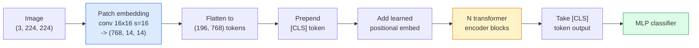

# Transformadores de visión (ViT)

> Para cortar las imágenes, cortar cada parche en una palabra, ejecutar el transformador estándar.

**类型：**Construcción
**语言：**Python
**前置要求：**Fase 7 Lección 02 (Atención personal), Fase 4 Lección 04 (Clasificación de imágenes)
**时间：**- 45 minutos

## El objetivo del aprendizaje

- Desde implementar el embebimiento de parches de cero, embebimiento posicional aprendido, token de clase y bloques de codificación de transformadores, construye una ViT mínima
-  Explicar por qué ViT                                                                                                                                                                                                                                                                                                                                                                                                                                                                                                                       
- Desde el punto de vista de la arquitectura anterior comparar ViT、Swin 和 ConvNeXt(无先验、local window attention、conv backbone)
- Uso `timm`和标准 linear-probe / fine-tune 流程, 在小数据集上 fine-tune 预训练 ViT

##  problemas

Durante diez años, la conversión 几乎就是计算机视觉的同义词──CNN 具有很强的诱导偏见,包括本地化,翻译等差,没人认为你能替代它们──随后 Dosovitskiy et al. (2020) 证明, a direct应用于展平图像补丁的普通变压器,完全不使用 convolutional 机制,也能在规模足够大时匹配甚至超过最好的CNN──

关键在于规模足够大──在 ImageNet-1k 上,ViT 输给了ResNet──先在 ImageNet-21k 或 JFT-300M 上预训练,再在 ImageNet-1k 上细调的 ViT则超过它──当时的结论是:transformers 缺少有用先验,但可以从足够多的数据中学习这些先验──后续工作 ((DeiT、MAE、DINO) 表明,只要训练配方正确,例如强增强、自监督预训、蒸,ViT 在小数据上也可以训练很好──

Hasta 2026 años, la CNN en los dispositivos de borde sigue teniendo una competencia fuerte, pero los transformadores han dominado casi todas las demás direcciones: segmentación, detección, Clip, Siglip, video, video, video, VJEPA, y la estructura de los bloques de VIT es el contenido que se debe dominar.

## 核心概念 核心概念 核心概念 核心概念

### 流程



七个步骤――Parches -> tokens -> attention -> classifier── cada cambio(DeiT、Swin、ConvNeXt、MAE preentrenamiento) todo sólo cambia uno dos de estos siete pasos, el resto mantener invariable──

### Embedado de parches

El primer conv es un clave. El núcleo de tamaño 16, paso 16, por lo tanto, un张 224x224 图像会变成 14x14 网格, compuesto por parches 16x16, cada parche se proyecta en 768-dimensional embebimiento.

```
Input:  (3, 224, 224)
Conv (3 -> 768, k=16, s=16, no padding):
Output: (768, 14, 14)
Flatten spatial: (196, 768)
```

196 parches = 196 tokens。 cada token tiene una dimensión de características de 768(ViT-B)、1024(ViT-L) o 1280(ViT-H)。

### Token de clase

En el primer número se agrega un vector aprendido:

```
tokens = [CLS; patch_1; patch_2; ...; patch_196]   shape (197, 768)
```

Después de pasar por los bloques de transformadores,`[CLS]`La salida es la imagen de la imagen en general.

### Emblazo posicional

Transformadores 没有内置的空间位置概念── para cada token añadido a un vector aprendido:

```
tokens = tokens + learned_pos_embedding   (also shape (197, 768))
```

Esta incorporación es un parámetro del modelo; el entrenamiento basado en gradientes lo hará adaptarse a la estructura de imágenes en 2D. También existe un reemplazo sinusoidal en 2D, pero en la práctica se utiliza muy poco.

### Bloque de codificación de transformador

标准结构──Multi-head auto-attention、MLP、conexiones residuales、pre-LayerNorm──

```
x = x + MSA(LN(x))
x = x + MLP(LN(x))

MLP is two-layer with GELU: Linear(d -> 4d) -> GELU -> Linear(4d -> d)
```

ViT-B/16                                                                                                                                                                                                                                                                                                                                                                                                                                                                                                                         

### ¿Por qué usar pre-LN

早期 transformadores 使用 post-LN(`x = LN(x + sublayer(x))`), en caso de no calentarse, el entrenamiento de más de 6-8 niveles es muy difícil.`x = x + sublayer(LN(x))`) puede entrenar estables redes más profundas sin calentamiento.

### Tamaño del parche 权衡

- 16x16 parches -> 196 tokens, estándar de configuración。
- 32x32 parches -> 49 tokens, más rápido pero resolución menor.
- 8x8 parches -> 784 tokens, más preciso, pero O(n^2) costo de atención 扩展性很差──

Más grandes parches = menos tokens = más rápido pero espacio detalles menor。SwinV2 en ventanas jerárquicas utiliza parches 4x4。

### DeiT en ImageNet-1k 上训练 ViT de la formación

Primero ViT necesita JFT-300M para superar a CNN―DeiT(Touvron et al., 2020) sólo con ImageNet-1k, en cuatro cambios:

1. Aumento pesado:Aumento aleatorio, mezcla, corte, mezcla, borrado aleatorio,
2. Profundidad estocástica (Train Time)
3. Aumento repetido (s)
4. Desde el profesor de CNN  realizar destilación                                                                                                                                                                                                                                                                                                                                                                                                                                                                                                                    

Cada moderno equipo de entrenamiento de VT proviene de DeiT.

### Swin vs ConvNeXt

- **Swin**(Liu et al., 2021)                                                                                                                                                                                                                                                           
- **ConvNeXt**(Liu et al., 2022)  重新设计的 CNN,匹配 Swin的架构选择(profundamente convs、LayerNorm、GELU、inverted bottleneck) 

En 2026 años, ConvNeXt-V2 y Swin-V2 están en la producción de la selección; la verdadera elección depende de su pila de inferencias.

### Preentrenamiento de la MAE

Autoencoder enmascarado(He et al., 2022):随机 mask 75% de parches, entrenamiento codificador sólo procesar 25% de visible, reentrenamiento un pequeño decodificador, según la salida del codificador 重建被 mask的补丁.

MAE 让 ViT sólo se puede entrenar con ImageNet-1k, alcanzar SOTA, y es un equipo auto supervisado ahora mismo.


```figure
batchnorm-inference
```

## Construirlo

### Paso 1: Embedado de parche

```python
import torch
import torch.nn as nn

class PatchEmbedding(nn.Module):
    def __init__(self, in_channels=3, patch_size=16, dim=192, image_size=64):
        super().__init__()
        assert image_size % patch_size == 0
        self.proj = nn.Conv2d(in_channels, dim, kernel_size=patch_size, stride=patch_size)
        num_patches = (image_size // patch_size) ** 2
        self.num_patches = num_patches

    def forward(self, x):
        x = self.proj(x)
        return x.flatten(2).transpose(1, 2)
```

Una con, una plana, una transpuesta... esto es el paso completo de la imagen a los tokens.

### Paso 2: Bloqueo de transformador

Pre-LN, autoatención multi-cabeza, MLP, conexiones residuales de GELU.

```python
class Block(nn.Module):
    def __init__(self, dim, num_heads, mlp_ratio=4, dropout=0.0):
        super().__init__()
        self.ln1 = nn.LayerNorm(dim)
        self.attn = nn.MultiheadAttention(dim, num_heads, dropout=dropout, batch_first=True)
        self.ln2 = nn.LayerNorm(dim)
        self.mlp = nn.Sequential(
            nn.Linear(dim, dim * mlp_ratio),
            nn.GELU(),
            nn.Dropout(dropout),
            nn.Linear(dim * mlp_ratio, dim),
            nn.Dropout(dropout),
        )

    def forward(self, x):
        a, _ = self.attn(self.ln1(x), self.ln1(x), self.ln1(x), need_weights=False)
        x = x + a
        x = x + self.mlp(self.ln2(x))
        return x
```

`nn.MultiheadAttention` responsable de desglosar cabezas ‧producto de puntos a escala y proyección de salida ‧`batch_first=True`, por lo tanto las formas es `(N, seq, dim)`¿Qué es eso?

### 步骤 3: ViT

```python
class ViT(nn.Module):
    def __init__(self, image_size=64, patch_size=16, in_channels=3,
                 num_classes=10, dim=192, depth=6, num_heads=3, mlp_ratio=4):
        super().__init__()
        self.patch = PatchEmbedding(in_channels, patch_size, dim, image_size)
        num_patches = self.patch.num_patches
        self.cls_token = nn.Parameter(torch.zeros(1, 1, dim))
        self.pos_embed = nn.Parameter(torch.zeros(1, num_patches + 1, dim))
        self.blocks = nn.ModuleList([
            Block(dim, num_heads, mlp_ratio) for _ in range(depth)
        ])
        self.ln = nn.LayerNorm(dim)
        self.head = nn.Linear(dim, num_classes)
        nn.init.trunc_normal_(self.pos_embed, std=0.02)
        nn.init.trunc_normal_(self.cls_token, std=0.02)

    def forward(self, x):
        x = self.patch(x)
        cls = self.cls_token.expand(x.size(0), -1, -1)
        x = torch.cat([cls, x], dim=1)
        x = x + self.pos_embed
        for blk in self.blocks:
            x = blk(x)
        x = self.ln(x[:, 0])
        return self.head(x)

vit = ViT(image_size=64, patch_size=16, num_classes=10, dim=192, depth=6, num_heads=3)
x = torch.randn(2, 3, 64, 64)
print(f"output: {vit(x).shape}")
print(f"params: {sum(p.numel() for p in vit.parameters()):,}")
```

Aproximadamente 2.8M parámetros, una pequeña ViT que se puede procesar en la CPU.`dim=768, depth=12, num_heads=12`¿Qué es eso?

### Paso 4: Verificación de la cordura  单图像 inferencia

```python
logits = vit(torch.randn(1, 3, 64, 64))
print(f"logits: {logits}")
print(f"probs:  {logits.softmax(-1)}")
```

应该能无错运行──Probabilidades 总和为 1──

## Usalo

`timm`提供了所有 ViT 变体及其ImageNet preentrenados pesos──一行代码:

```python
import timm

model = timm.create_model("vit_base_patch16_224", pretrained=True, num_classes=10)
```

`timm`Es la producción de transformadores de visión de 2026 años. Está en la misma API.

对于多模工作 (imagen + texto),`transformers`提供 CLIP、SigLIP、BLIP-2、LLaVA── estos modelos codifican imágenes de una especie de VT 变体──

##  entregarlo

Encuentro de trabajo:

- `outputs/prompt-vit-vs-cnn-picker.md` Una respuesta, según el tamaño del conjunto de datos, calcular y inferir la pila, en ViT, ConvNeXt o Swin 之间做做选择──
- `outputs/skill-vit-patch-and-pos-embed-inspector.md` Una habilidad, para verificar la inserción de parches de ViT y las formas de inserción posicional si coinciden con la longitud de la secuencia esperada del modelo, captura el bug de traslado más común。

##  ejercicios

1. **（Easy）**Imprimir en el viT pequeño en el medio de cada paso hacia adelante de forma tensor medio.`(N, 3, 64, 64)`-> parches `(N, 16, 192)`-> con CLS `(N, 17, 192)`-> entrada del clasificador `(N, 192)`-> salida `(N, num_classes)`¿Qué es eso?
2. **（Medium）**En la lección 4 de la sintética-CIFAR datos de ajuste fino en un entrenamiento previo `timm`ViT-S/16── con el mismo dato de ajuste del ResNet-18 hacer comparación── informe de tiempo de entrenamiento y precisión final──
3. **（Hard）**Para pequeñas VT                                                                                                                                                                                                                                                                                                                                                                                                                                                                                                                         

## 关键术语: "El hombre es un hombre"

| Term | 人们常说 | 实际含义 |
|------|----------------|----------------------|
| Patch embedding | “第一个 conv” | kernel size = stride = patch size 的 conv；将图像转换为 token embeddings 的网格 |
| Class token | “[CLS]” | 加在 token sequence 前面的 learned vector；它的最终 output 是全局图像表示 |
| Positional embedding | “Learned pos” | 添加到每个 token 上的 learned vector，让 transformer 知道每个 patch 来自哪里 |
| Pre-LN | “LayerNorm before sublayer” | 稳定的 transformer 变体：使用 `x + sublayer(LN(x))`，而不是 `LN(x + sublayer(x))` |
| Multi-head attention | “Parallel attention” | 标准 transformer attention，被拆分为 num_heads 个独立子空间，之后再 concatenated |
| ViT-B/16 | “Base, patch 16” | 规范尺寸：dim=768、depth=12、heads=12、patch_size=16、image=224；约 86M params |
| DeiT | “Data-efficient ViT” | 只用 ImageNet-1k 并配合强 augmentation 训练的 ViT；证明大型 pretraining datasets 并非绝对必要 |
| MAE | “Masked autoencoder” | Self-supervised pretraining：mask 75% 的 patches 并重建；主流 ViT pretraining 配方 |

## 延伸阅读

- [An Image is Worth 16x16 Words (Dosovitskiy et al., 2020)](https://arxiv.org/abs/2010.11929) ViT 论文
- [DeiT: Data-efficient Image Transformers (Touvron et al., 2020)](https://arxiv.org/abs/2012.12877) cómo usar sólo ImageNet-1k  entrenar ViT
- [Masked Autoencoders are Scalable Vision Learners (He et al., 2022)](https://arxiv.org/abs/2111.06377) MAE 预训练
- [timm documentation](https://huggingface.co/docs/timm) Referencia de cada transformador de visión que se utiliza en la producción
