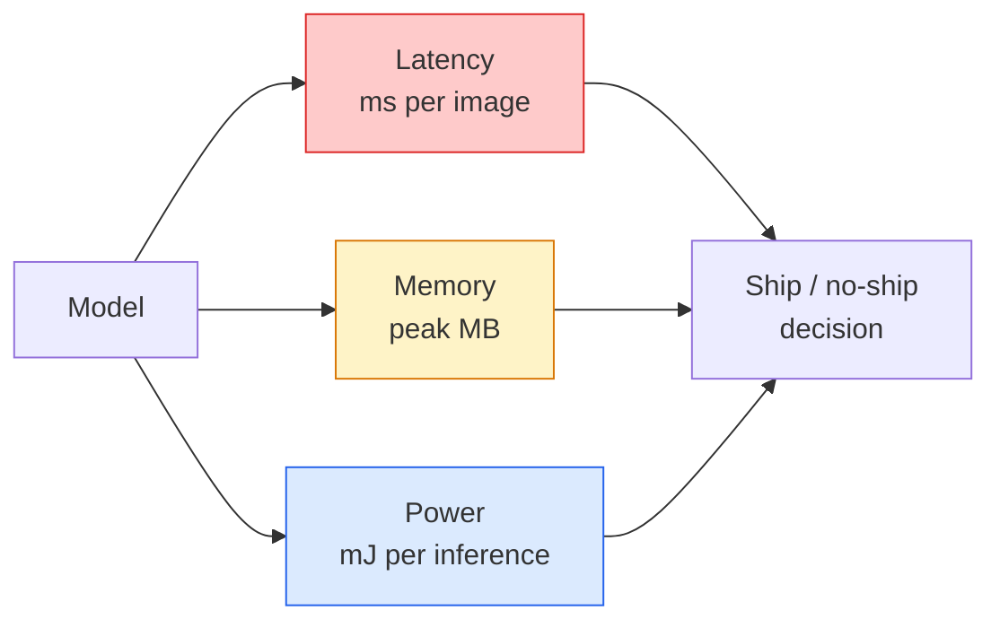

# Visión en tiempo real  边缘部署

> La inferencia de borde es hacer que un modelo de 90 puntos de precisión funcione con 30 fps en un dispositivo con sólo 2 GB de RAM. La precisión de cada punto de percentual debe ser cambiada con la latencia de milisegundos.

**Type:** Learn + Build
**Languages:** Python
**Prerequisites:** Phase 4 Lesson 04 (Image Classification), Phase 10 Lesson 11 (Quantization)
**Time:** ~75 minutes

## El objetivo del aprendizaje
- 测量任意 PyTorch model 的推理延迟、峰值存储和吞吐量,并读懂 FLOPs / params / latency 之间的权衡
- Utiliza PyTorch de la cuantificación post-entrenamiento, el modelo de visión 量化为INT8,并验证精度损失 < 1%
- 导出到ONNX,并使用ONNX Runtime或TensorRT 编译;说出三种最常见的导出失败原因及其修复方式
- 解释在边缘 约束下何时选择 MobileNetV3、EfficientNet-Lite、ConvNeXt-Tiny o MobileViT

##  problemas
 El modelo de visión de la fase de entrenamiento suele ser un punto flotante 巨兽──100M parámetros─ cada paso adelante 10 GFLOPs─2 GB VRAM── estos no pueden instalarse en el móvil、 unidad de infoentretenimiento en el vehículo、 cámara industrial o dron── entregar un sistema de visión, lo que significa que debe colocar la misma capacidad de predicción dentro de un presupuesto de 100 veces menor ⋅

La elección de modelos se realiza en tres giros: la elección de modelos, la cuantificación, la utilización de la misma receta, la arquitectura de la mejor tamaño, la utilización de la INT8 en sustitución de la FP32, y el tiempo de ejecución de la inferencia, la función de los módulos de cámara de 30 dólares.

Este curso primero establece la disciplina de medición, luego explica estos tres ciclos. El objetivo no es aprender a completar cada tipo de ejecución de la ventaja, sino saber qué palancas hay y cómo verificar cada palanca.

## 概念
### Tres presupuestos



- **Latency**:p50、p95、p99── sólo ver p50  media de valor se oculta en los sistemas en tiempo real  muy importante尾部行为──
- **Peak memory**El valor máximo que ha visto el equipo, en lugar de la media de estado estacionario, es un factor importante: los objetivos embedded en el OOM son mortales.
- **Power / energy**Por ejemplo, el tiempo de la CPU/GPU se compara a la de los equipos de suministro de energía.

Edge  decisión depende de una una (modelo, latencia, memoria, precisión) 表── cada unidad debe ser medida en el dispositivo objetivo, no en la estación de trabajo 上──

### Disciplina de medición

Cada vez que el perfil de borde deben cumplir tres reglas:

1. En la medida previa, con 5 a 10 veces de maniquí hacia adelante.**Warm up**modelo── frío almacenamiento y compilación JIT 会产生不代表性的 primer número de valores──
2. En el bloque de tiempo 前后用 `torch.cuda.synchronize()` **Synchronise**Las cargas de trabajo de la GPU──no, se detectó que es el despacho del núcleo, y no la ejecución del núcleo──
3. Los tamaños de entrada **Fix**Hasta la resolución de producción. 224x224 La latencia superior no es 512x512 La latencia superior.

### FLOPs  como proxy

FLOPs (en inglés FLOPs) es una proxy de latencia barata, no relacionada con el dispositivo. Se adapta a la comparación de arquitectura, pero como un reloj de pared absolutamente normal, se produce un error. En la práctica, un modelo de FLOPs de más del 10% puede ser 2x rápido, ya que utiliza opciones más adecuadas para el hardware.

规则: con FLOPs hacer búsqueda de arquitectura, con latencia en el dispositivo hacer decisiones de despliegue.

### Cuantificación 一段话说明

Utilice INT8  sustituir los pesos de FP32 y las activaciones。 tamaño del modelo  reducción 4x, ancho de banda de memoria  reducción 4x, en el hardware de los núcleos de INT8  reducción 2-4x (todos los modernos SoC móviles 所有带 Tensor Cores 的 NVIDIA GPU)  tareas de visión  pérdida de precisión de arriba normalmente es de 0.1-1 个百分点, utilizando cuantización estática post-entrenamiento 即可达到──

类型:

- **Dynamic** Capacitar los pesos  Cuantificar en INT8, activaciones 以 FP 计算──简单,速度提升较小──
- **Static (post-training)** 量化 weights, y en pequeño conjunto de calibración 上校准激活范围──比动态 快得多──
- **Quantisation-aware training (QAT)** En el entrenamiento, simulación de cuantificación, hacer que el modelo aprender a adaptarse a ella.

Para la visión, la cuantificación estática post-entrenamiento con un 5% de la capacidad de trabajo obtiene un beneficio del 95%.

### Triturado y destilación

- **Pruning** 移除不重要 weights (en función de la magnitud) o canales (en función de la estructura)    移除不重要重量 (en función de la magnitud)     移除不重要重量 (en función de la magnitud)              移除不重要重量 (en función de la magnitud)                                                                                                                                                                                                       
- **Distillation** 訓練一個小學生 去模仿大師的logits──通常能恢复缩小模型 后损失的大部分精度──producción de modelos de borde de la producción──

### Horarios de ejecución de la inferencia

- **PyTorch eager** 慢,不适用于部署── sólo para el desarrollo──
- **TorchScript** legado──已被 `torch.compile`Y la exportación de ONNX 取代──
- **ONNX Runtime** Centro de ejecución de la CPU, CUDA, CoreML, TensorRT, OpenVINO todos los proveedores de ONNX.
- **TensorRT** Compilador de NVIDIA── en las GPUs de NVIDIA(estación de trabajo y Jetson) ∞ ∞ ∞ ∞ ∞ ∞ ∞ ∞ ∞ ∞ ∞ ∞ ∞ ∞ ∞ ∞ ∞ ∞ ∞ ∞ ∞ ∞ ∞ ∞ ∞ ∞ ∞ ∞ ∞ ∞ ∞ ∞ ∞ ∞ ∞ ∞ ∞ ∞ ∞ ∞ ∞ ∞ ∞ ∞ ∞ ∞ ∞ ∞ ∞ ∞ ∞ ∞ ∞ ∞ ∞ ∞ ∞ ∞ ∞ ∞ ∞ ∞ ∞ ∞ ∞ ∞ ∞ ∞ ∞ ∞ ∞ ∞ ∞ ∞ ∞ ∞ ∞ ∞ ∞ ∞ ∞ ∞ ∞ ∞ ∞ ∞ ∞ ∞ ∞ ∞ ∞ ∞ ∞ ∞ ∞ ∞ ∞ ∞ ∞ ∞ ∞ ∞ ∞ ∞ ∞ ∞ ∞ ∞ ∞ ∞ ∞ ∞ ∞ ∞ ∞ ∞ ∞ ∞ ∞ ∞ ∞ ∞ ∞ ∞ ∞ ∞ ∞ ∞ ∞ ∞ ∞ ∞ ∞ ∞ ∞ ∞ ∞ ∞ ∞ ∞ ∞ ∞ ∞ ∞ ∞ ∞ ∞ ∞ ∞ ∞ ∞ ∞ ∞ ∞ ∞ ∞ ∞ ∞ ∞ ∞ ∞ ∞ ∞ ∞ ∞ ∞ ∞ ∞ ∞ ∞ ∞ ∞ ∞ ∞ ∞ ∞ ∞ ∞ ∞ ∞ ∞ ∞ ∞ ∞ ∞ ∞ ∞ ∞ ∞ ∞ ∞ ∞ ∞ ∞ ∞ ∞ ∞ ∞ ∞ ∞ ∞ ∞ ∞ ∞ ∞ ∞ ∞ ∞ ∞ ∞ ∞ ∞ ∞ ∞ ∞ ∞ ∞ ∞ ∞ ∞ ∞ ∞ ∞ ∞ ∞ ∞ ∞ ∞ ∞ ∞ ∞
- **Core ML** Tiempo de ejecución de iOS/macOS de Apple.`.mlmodel`O `.mlpackage`¿Qué es eso?
- **TFLite** Google Android / ARM tiempo de ejecución.`.tflite`¿Qué es eso?
- **OpenVINO** CPU / VPU de Intel tiempo de ejecución.`.xml`¿ Qué es eso ?`.bin`¿Qué es eso?

实践中:export PyTorch -> ONNX -> 为目标 选择运行时间。ONNX 是 lingua franca。

### Selector de arquitectura de borde

| Budget | Model | Why |
|--------|-------|-----|
| < 3M params | MobileNetV3-Small | 到处都能编译，是很好的 baseline |
| 3-10M | EfficientNet-Lite-B0 | TFLite 上每 param 的 accuracy 最好 |
| 10-20M | ConvNeXt-Tiny | accuracy-per-param 最好，且 CPU-friendly |
| 20-30M | MobileViT-S or EfficientViT | 具备 ImageNet accuracy 的 Transformer |
| 30-80M | Swin-V2-Tiny | 如果 stack 支持 window attention |

A menos que haya razones claras para no hacerlo, entonces califique todo esto como INT8


```figure
cnn-param-count
```

## Construirlo
### Paso 1: Medir la latencia con precisión

```python
import time
import torch

def measure_latency(model, input_shape, device="cpu", warmup=10, iters=50):
    model = model.to(device).eval()
    x = torch.randn(input_shape, device=device)
    with torch.no_grad():
        for _ in range(warmup):
            model(x)
        if device == "cuda":
            torch.cuda.synchronize()
        times = []
        for _ in range(iters):
            if device == "cuda":
                torch.cuda.synchronize()
            t0 = time.perf_counter()
            model(x)
            if device == "cuda":
                torch.cuda.synchronize()
            times.append((time.perf_counter() - t0) * 1000)
    times.sort()
    return {
        "p50_ms": times[len(times) // 2],
        "p95_ms": times[int(len(times) * 0.95)],
        "p99_ms": times[int(len(times) * 0.99)],
        "mean_ms": sum(times) / len(times),
    }
```

Calentar, sincronizar, usar `time.perf_counter()` Reportar porcentiles, no sólo significa

### Paso 2: Parámetro y FLOP cuenta

```python
def parameter_count(model):
    return sum(p.numel() for p in model.parameters())

def flops_estimate(model, input_shape):
    """
    Rough FLOP count for a conv/linear-only model. For production use `fvcore` or `ptflops`.
    """
    total = 0
    def conv_hook(m, inp, out):
        nonlocal total
        c_out, c_in, kh, kw = m.weight.shape
        h, w = out.shape[-2:]
        total += 2 * c_in * c_out * kh * kw * h * w
    def linear_hook(m, inp, out):
        nonlocal total
        total += 2 * m.in_features * m.out_features
    hooks = []
    for m in model.modules():
        if isinstance(m, torch.nn.Conv2d):
            hooks.append(m.register_forward_hook(conv_hook))
        elif isinstance(m, torch.nn.Linear):
            hooks.append(m.register_forward_hook(linear_hook))
    model.eval()
    with torch.no_grad():
        model(torch.randn(input_shape))
    for h in hooks:
        h.remove()
    return total
```

                                                                                                                                                                                                                                                                                                                                                                                                                                                                                                                             `fvcore.nn.FlopCountAnalysis`O `ptflops`• pueden tratar correctamente cada tipo de módulo.

### 步骤 3: Cuantización estática después del entrenamiento

```python
def quantise_ptq(model, calibration_loader, backend="x86"):
    import torch.ao.quantization as tq
    model = model.eval().cpu()
    model.qconfig = tq.get_default_qconfig(backend)
    tq.prepare(model, inplace=True)
    with torch.no_grad():
        for x, _ in calibration_loader:
            model(x)
    tq.convert(model, inplace=True)
    return model
```

Tres pasos:configurar, preparar, meter observadores, calibrar datos reales, convertir, fusionar y cuantizar.`Conv -> BN -> ReLU`- ¿ Qué ?`ConvBnReLU`), puede`torch.ao.quantization.fuse_modules`处理──

### Paso 4: 导出到ONNX

```python
def export_onnx(model, sample_input, path="model.onnx"):
    model = model.eval()
    torch.onnx.export(
        model,
        sample_input,
        path,
        input_names=["input"],
        output_names=["output"],
        dynamic_axes={"input": {0: "batch"}, "output": {0: "batch"}},
        opset_version=17,
    )
    return path
```

`opset_version=17`Es el valor garantizado para el año 2026.`dynamic_axes`让你可以使用任意批量 运行ONNX modelo。

### Paso 5: Indicadores de referencia y comparación de regímenes

```python
import torch.nn as nn
from torchvision.models import mobilenet_v3_small

def compare_regimes():
    model = mobilenet_v3_small(weights=None, num_classes=10)
    params = parameter_count(model)
    flops = flops_estimate(model, (1, 3, 224, 224))
    lat_fp32 = measure_latency(model, (1, 3, 224, 224), device="cpu")
    print(f"FP32 MobileNetV3-Small: {params:,} params  {flops/1e9:.2f} GFLOPs  "
          f"p50={lat_fp32['p50_ms']:.2f}ms  p95={lat_fp32['p95_ms']:.2f}ms")
```

¿ Qué ?`resnet50`¿Qué es esto?`efficientnet_v2_s`Y `convnext_tiny`运行同一个函数,你就能得到部署决策所需的比较表──

## Usalo
Las estacas de producción normalmente reciben hasta tres rutas:

- **Web / serverless**El mayor número de casos de la mayoría de las situaciones es bastante bueno.
- **NVIDIA edge (Jetson, GPU server)**La velocidad de la velocidad de la velocidad de la velocidad de la velocidad de la velocidad de la velocidad de la velocidad de la velocidad de la velocidad de la velocidad de la velocidad de la velocidad de la velocidad de la velocidad de la velocidad de la velocidad de la velocidad de la velocidad de la velocidad de la velocidad de la velocidad de la velocidad de la velocidad de la velocidad de la velocidad de la velocidad de la velocidad de la velocidad de la velocidad de la velocidad de la velocidad de la velocidad de la velocidad de la velocidad de la velocidad de la velocidad de la velocidad de la velocidad de la velocidad de la velocidad de la velocidad de la velocidad de la velocidad de la velocidad de la velocidad de la velocidad de la velocidad de la velocidad de la velocidad de la velocidad de la velocidad de la velocidad de la velocidad de la velocidad de la velocidad de la velocidad de la velocidad de la velocidad de la velocidad de la velocidad de la velocidad de la velocidad de la velocidad de la velocidad de la velocidad de la velocidad de la velocidad de la velocidad de la velocidad de la velocidad de la velocidad de la velocidad de la velocidad de la velocidad de la velocidad de la velocidad de la velocidad de la velocidad de la velocidad de la velocidad de la velocidad de la velocidad de la velocidad de la velocidad de la velocidad de la velocidad de la velocidad de la velocidad de la velocidad de la velocidad de la velocidad de la velocidad de la velocidad de la velocidad de la velocidad de la velocidad de la velocidad de la velocidad de la velocidad de la velocidad de la velocidad de la velocidad de la velocidad de la velocidad de la velocidad de la velocidad de la velocidad de la velocidad de la velocidad de la velocidad de la velocidad de la velocidad de la velocidad de la velocidad de la velocidad de la velocidad de la velocidad de la velocidad de la velocidad de la velocidad de la velocidad de la velocidad de la velocidad de la velocidad de la velocidad de la velocidad de la veloc
- **Mobile**:PyTorch -> ONNX -> Core ML (iOS) o TFLite (Android)

测量方面,`torch-tb-profiler`¿Qué es esto?`nvprof`- ¿ Qué ?`nsys`, y los instrumentos de macOS pueden darse una ruptura capa por capa.`benchmark_app`(OpenVINO) y `trtexec`(TensorRT) Puede dar un número independiente de CLI.

##  entregarlo
Encuentro de trabajo:

- `outputs/prompt-edge-deployment-planner.md` Una respuesta rápida, según el dispositivo objetivo y la latencia SLA  seleccionar la estrategia de columna vertebral  cuantificación 和 tiempo de ejecución 
- `outputs/skill-latency-profiler.md` Una habilidad, para escribir un guión completo de benchmarking de latencia, que incluye calentamiento, sincronización, percentiles y seguimiento de memoria.

##  ejercicios
1. **(Easy)**En la CPU en la medida de 224x224 `resnet18`¿Qué es esto?`mobilenet_v3_small`¿Qué es esto?`efficientnet_v2_s`Y `convnext_tiny`La latencia de p50: ⋅ ⋅ ⋅ ⋅ ⋅ ⋅ ⋅ ⋅ ⋅ ⋅ ⋅ ⋅ ⋅ ⋅ ⋅ ⋅ ⋅ ⋅ ⋅ ⋅ ⋅ ⋅ ⋅ ⋅ ⋅ ⋅ ⋅ ⋅ ⋅ ⋅ ⋅ ⋅ ⋅ ⋅ ⋅ ⋅ ⋅ ⋅ ⋅ ⋅ ⋅ ⋅ ⋅ ⋅ ⋅ ⋅ ⋅ ⋅ ⋅ ⋅ ⋅ ⋅ ⋅ ⋅ ⋅ ⋅ ⋅ ⋅ ⋅ ⋅ ⋅ ⋅ ⋅ ⋅ ⋅ ⋅ ⋅ ⋅ ⋅ ⋅ ⋅ ⋅ ⋅ ⋅ ⋅ ⋅ ⋅ ⋅ ⋅ ⋅ ⋅ ⋅ ⋅ ⋅ ⋅ ⋅ ⋅ ⋅ ⋅ ⋅ ⋅ ⋅ ⋅ ⋅ ⋅ ⋅ ⋅ ⋅ ⋅ ⋅ ⋅ ⋅ ⋅ ⋅ ⋅ ⋅ ⋅ ⋅ ⋅ ⋅ ⋅ ⋅ ⋅ ⋅ ⋅ ⋅ ⋅ ⋅ ⋅ ⋅ ⋅ ⋅ ⋅ ⋅ ⋅                                                                                                                                                                                                                                                             
2. **(Medium)**¿ Qué ?`mobilenet_v3_small` aplicación de cuantificación estática post-entrenamiento― informe CIFAR-10 o similar conjunto de datos sostenido subconjunto 上的 FP32 vs INT8 latencia 和 precisión pérdida―
3. **(Hard)**¿ Qué ?`convnext_tiny`导出到ONNX,用 `CPUExecutionProvider` Por el `onnxruntime`运行,并将延迟与 PyTorch eager baseline比较──找出ONNX Runtime 第一个更快的层,并解释原因──

## 关键术语: "El hombre es un hombre"
| Term | What people say | What it actually means |
|------|----------------|----------------------|
| Latency | “有多快” | 从 input 到 output 的时间；看 p50/p95/p99 percentiles，而不是 mean |
| FLOPs | “Model size” | 每次 forward pass 的 floating-point ops；compute cost 的粗略 proxy |
| INT8 quantisation | “8-bit” | 用 8-bit integers 替代 FP32 weights/activations；体积约小 4x，速度快 2-4x |
| PTQ | “Post-training quantisation” | 在不 retraining 的情况下量化 trained model；简单，通常足够 |
| QAT | “Quantisation-aware training” | 训练期间模拟 quantisation；accuracy 最好，需要 labelled data |
| ONNX | “中立格式” | 每个主流 inference runtime 都支持的 model exchange format |
| TensorRT | “NVIDIA compiler” | 将 ONNX 编译为面向 NVIDIA GPUs 的 optimised engine |
| Distillation | “Teacher -> student” | 训练 small model 去模仿 big model 的 logits；恢复大部分损失的 accuracy |

## 延伸阅读
- [EfficientNet (Tan & Le, 2019)](https://arxiv.org/abs/1905.11946) Escalación de compuestos de alta eficiencia arquitectura
- [MobileNetV3 (Howard et al., 2019)](https://arxiv.org/abs/1905.02244) arquitectura móvil-primero, que contiene h-swish y squeeze-excite
- [A Practical Guide to TensorRT Optimization (NVIDIA)](https://developer.nvidia.com/blog/accelerating-model-inference-with-tensorrt-tips-and-best-practices-for-pytorch-users/) 如何真正拿到论文中的吞吐量数 如何真正拿到论文中的吞吐量数 如何真正拿到论文中的吞吐量数 如何真正拿到论文中的吞吐量数 如何真正拿到论文中的吞吐量数 如何真正拿到论文中的吞吐量数 如何真正拿到论文中的吞吐量数
- [ONNX Runtime docs](https://onnxruntime.ai/docs/) cuantificación, optimización de gráficos, selección de proveedores
