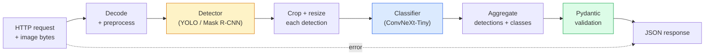

# 构建完整Vision Pipeline  Capstone

> El sistema de visión de nivel de producción es una cadena compuesta por modelos y reglas, y a través de un contrato de datos 串联起来── los componentes de esta etapa ya están listos; esta piedra angular los conectará de un extremo a otro.

**Type:** Build
**Languages:** Python
**Prerequisites:** Phase 4 Lessons 01-15
**Time:** ~120 minutes

## El objetivo del aprendizaje
- Diseñar un tubo de visión de producción, para examinar objetos, clasificarlos, y producir JSON estructurado, al mismo tiempo que procesar todos los caminos fallidos
- Se trata de un sistema de detección de datos de datos de la empresa de información de la empresa de información de la empresa de información de la empresa de información de la empresa de información de la empresa de información de la empresa de información de la empresa de información de la empresa de información de la empresa de información de la empresa de información de la empresa de información de la empresa de información de la empresa de información de la empresa de información de la empresa de información de la empresa de información de la empresa de información de la empresa de información de la empresa de información de la empresa de información de la empresa de información de la empresa de información de la empresa de información de la empresa de información de la empresa de información de la empresa de información de la empresa de información de la empresa de información de la empresa de información de la empresa de información de la empresa de información de la empresa de la empresa de información de la empresa de información de la empresa de la empresa de información de la empresa de la empresa de información de la empresa de la empresa de información de la empresa de la empresa de información de la empresa de la empresa de información de la empresa de la empresa de la empresa de información de la empresa de la empresa de la empresa de información de la empresa de la empresa de la empresa de la empresa de la empresa de la empresa de la empresa de la empresa de la empresa de la empresa de la empresa de la empresa de la empresa de la empresa de la empresa de la empresa de la empresa de la empresa de la empresa de la empresa de la empresa de la empresa de la empresa de la empresa de la empresa de la empresa de la empresa de la empresa de la empresa de la empresa de la empresa de la empresa de la empresa de la empresa de la empresa de la empresa de la empresa de la empresa de la empresa de la empresa de la empresa de la empresa de la empresa de la empresa de la empresa de la empresa de la empresa de la empresa de la empresa de la empresa de la empresa de la empresa de la empresa de la empresa de la empresa de la empresa de la empresa de la empresa de la empresa de la empresa de la empresa de la empresa de la empresa de la empresa de la empresa de la empresa de la empresa de la empresa de la empresa de la empresa de la empresa de la empresa de la empresa de la empresa de la empresa de la empresa de la empresa de la empresa de la empresa de la empresa de la empresa de la empresa de la empresa de la empresa de la empresa de la empresa de la empresa de la
- Para el pipeline de extremo a extremo  realizar un benchmark,并识别第一瓶頸(generalmente primero es el preprocesamiento, luego es el detector)
-  publicar un servicio mínimo de FastAPI, aceptar la carga de imágenes, operar la tubería, y regresar con la clasificación de detección  resultados

##  problemas
单个视觉模型 很有用;视觉产品是由它们组成的链条──零售货架审计是检测仪 加产品分类器 再加价格-OCR管道──自动驾驶是2D检测仪 加3D检测仪加分类器加跟踪仪加规划仪──医疗预查是分类器加地区分类器加临床医师 UI──

Para poner estas cadenas en contacto, es necesario distinguir entre el prototipo de ML y la parte clave del producto. Cada interfaz entre los modelos es una nueva fuente de error. Cada vez que se transforma la coordenada, cada vez que se normaliza, cada vez que se cambia el tamaño de la máscara, todo puede ser un punto de fracaso silencioso.

Esta piedra angular construir el menor oleoducto disponible: detección + clasificación + salida estructurada + capa de servicio。La fase 4 de los demás contenidos pueden ser insertados en este esqueleto:把 Máscara R-CNN 换成 YOLOv8, añadir cabeza OCR, añadir rama de segmentación, añadir rastreador。La estructura es estable; el componente es podedor de subtracción。

## 概念
### El oleoducto



七个阶段── dos modelos de etapa 开销很大; otras cinco fases es el lugar donde aparecen los errores más frecuentes──

### Utiliza Pydantic  definición contrato de datos

Cada modelo de límite se convierte en un objeto clasificado. Esto transformará el fracaso del silencio en un fracaso evidente.

```
Detection(
    box: tuple[float, float, float, float],   # (x1, y1, x2, y2), absolute pixels
    score: float,                              # [0, 1]
    class_id: int,                             # from detector's label map
    mask: Optional[list[list[int]]],           # RLE-encoded if present
)

PipelineResult(
    image_id: str,
    detections: list[Detection],
    classifications: list[Classification],
    inference_ms: float,
)
```

Cuando el detector regresa es`(cx, cy, w, h)`En vez de`(x1, y1, x2, y2)`Cuando, la validación de Pydantic se pierde en la frontera, usted encontrará el problema inmediatamente, en lugar de ir a probar una cosecha de descenso, es simplemente silenciosamente regresar a la región vacía.

### 延迟花在哪里 延迟花在哪里 延迟花在哪里 延迟花在哪里 延迟花在哪里 延迟花在哪里 延迟花在哪里

 Casi todos los proyectos de visión                                                                                                                                                                                                                                                           

1. **Preprocessing 通常是最大的单个模块。**解码 JPEG、转换颜色空间、尺寸, todo esto está ligado a la CPU, y es fácil de ignorar.
2. **Detector 主导 GPU 时间。**El 70-90% del tiempo de la GPU pasa hacia adelante en la detección.
3. **Postprocessing（NMS、RLE encode/decode）在 GPU 上便宜，在 CPU 上昂贵。**Una determinación para hacer un perfil con un ambiente real.

Comprender la distribución, para convertir la optimización en una lista de prioridad.

### Modo de falla

- **Empty detections** 返回空列表, no se derrumbe.
- **Out-of-bounds boxes** recortando 前 clamp hasta el tamaño de la imagen。
- **Tiny crops** Para clasificador                                                                                                                                                                                                                                                            
- **Corrupt upload** 返回带有具体错误代码 的 400 respuesta, en lugar de 500。
- **Model load failure** En el inicio de servicio  fracaso, en lugar de en la primera solicitud 时失败。

Producción de la línea de producción se encargará de cada situación, en lugar de escribir una generalizada.`try/except`Hombre de todo el fracaso tiene un código de nombre y respuesta.

### Los grupos

Producción de servicio de servicio de servicio de varios clientes. Transverso solicitud para la detección y clasificación. Para realizar batches se puede aumentar en forma de multiplicidad.`torchserve`Y `triton`El servicio de carga predecible de pequeño servicio normalmente se realiza por sí mismo micro-batcher.


```figure
v4-vision-pipeline
```

## Construirlo
### 步骤 1: Contratos de datos

```python
from pydantic import BaseModel, Field
from typing import List, Optional, Tuple

class Detection(BaseModel):
    box: Tuple[float, float, float, float]
    score: float = Field(ge=0, le=1)
    class_id: int = Field(ge=0)
    mask_rle: Optional[str] = None


class Classification(BaseModel):
    detection_index: int
    class_id: int
    class_name: str
    score: float = Field(ge=0, le=1)


class PipelineResult(BaseModel):
    image_id: str
    detections: List[Detection]
    classifications: List[Classification]
    inference_ms: float
```

Se puede hacer cualquier tipo de pipeline.

### Paso 2: Un tipo de tubería más pequeña

```python
import time
import numpy as np
import torch
from PIL import Image

class VisionPipeline:
    def __init__(self, detector, classifier, class_names,
                 device="cpu", min_crop=32):
        self.detector = detector.to(device).eval()
        self.classifier = classifier.to(device).eval()
        self.class_names = class_names
        self.device = device
        self.min_crop = min_crop

    def preprocess(self, image):
        """
        image: PIL.Image or np.ndarray (H, W, 3) uint8
        returns: CHW float tensor on device
        """
        if isinstance(image, Image.Image):
            image = np.asarray(image.convert("RGB"))
        tensor = torch.from_numpy(image).permute(2, 0, 1).float() / 255.0
        return tensor.to(self.device)

    @torch.no_grad()
    def detect(self, image_tensor):
        return self.detector([image_tensor])[0]

    @torch.no_grad()
    def classify(self, crops):
        if len(crops) == 0:
            return []
        batch = torch.stack(crops).to(self.device)
        logits = self.classifier(batch)
        probs = logits.softmax(-1)
        scores, cls = probs.max(-1)
        return list(zip(cls.tolist(), scores.tolist()))

    def run(self, image, image_id="anonymous"):
        t0 = time.perf_counter()
        tensor = self.preprocess(image)
        det = self.detect(tensor)

        crops = []
        detections = []
        valid_indices = []
        for i, (box, score, cls) in enumerate(zip(det["boxes"], det["scores"], det["labels"])):
            x1, y1, x2, y2 = [max(0, int(b)) for b in box.tolist()]
            x2 = min(x2, tensor.shape[-1])
            y2 = min(y2, tensor.shape[-2])
            detections.append(Detection(
                box=(x1, y1, x2, y2),
                score=float(score),
                class_id=int(cls),
            ))
            if (x2 - x1) < self.min_crop or (y2 - y1) < self.min_crop:
                continue
            crop = tensor[:, y1:y2, x1:x2]
            crop = torch.nn.functional.interpolate(
                crop.unsqueeze(0),
                size=(224, 224),
                mode="bilinear",
                align_corners=False,
            )[0]
            crops.append(crop)
            valid_indices.append(i)

        class_preds = self.classify(crops)

        classifications = []
        for valid_idx, (cls_id, cls_score) in zip(valid_indices, class_preds):
            classifications.append(Classification(
                detection_index=valid_idx,
                class_id=int(cls_id),
                class_name=self.class_names[cls_id],
                score=float(cls_score),
            ))

        return PipelineResult(
            image_id=image_id,
            detections=detections,
            classifications=classifications,
            inference_ms=(time.perf_counter() - t0) * 1000,
        )
```

Cada interfaz es clasificada. Cada ruta de fracaso tiene una decisión de tratamiento clara.

### Paso 3: Conectar un detector y un clasificador

```python
from torchvision.models.detection import maskrcnn_resnet50_fpn_v2
from torchvision.models import convnext_tiny

# Use ImageNet-pretrained weights for a realistic pipeline without training
detector = maskrcnn_resnet50_fpn_v2(weights="DEFAULT")
classifier = convnext_tiny(weights="DEFAULT")
class_names = [f"imagenet_class_{i}" for i in range(1000)]

pipe = VisionPipeline(detector, classifier, class_names)

# Smoke test with a synthetic image
test_image = (np.random.rand(400, 600, 3) * 255).astype(np.uint8)
result = pipe.run(test_image, image_id="demo")
print(result.model_dump_json(indent=2)[:500])
```

### Paso 4: Servicio de FastAPI

```python
from fastapi import FastAPI, UploadFile, HTTPException
from io import BytesIO

app = FastAPI()
pipe = None  # initialised on startup

@app.on_event("startup")
def load():
    global pipe
    detector = maskrcnn_resnet50_fpn_v2(weights="DEFAULT").eval()
    classifier = convnext_tiny(weights="DEFAULT").eval()
    pipe = VisionPipeline(detector, classifier, class_names=[f"c{i}" for i in range(1000)])

@app.post("/detect")
async def detect_endpoint(file: UploadFile):
    if file.content_type not in {"image/jpeg", "image/png", "image/webp"}:
        raise HTTPException(status_code=400, detail="unsupported image type")
    data = await file.read()
    try:
        img = Image.open(BytesIO(data)).convert("RGB")
    except Exception:
        raise HTTPException(status_code=400, detail="cannot decode image")
    result = pipe.run(img, image_id=file.filename or "upload")
    return result.model_dump()
```

Uso `uvicorn main:app --host 0.0.0.0 --port 8000`运行。使用 `curl -F 'file=@dog.jpg' http://localhost:8000/detect`¿Qué es eso?

### Paso 5:Bénchmark de esta tubería

```python
import time

def benchmark(pipe, num_runs=20, image_size=(400, 600)):
    img = (np.random.rand(*image_size, 3) * 255).astype(np.uint8)
    pipe.run(img)  # warm up

    stages = {"preprocess": [], "detect": [], "classify": [], "total": []}
    for _ in range(num_runs):
        t0 = time.perf_counter()
        tensor = pipe.preprocess(img)
        t1 = time.perf_counter()
        det = pipe.detect(tensor)
        t2 = time.perf_counter()
        crops = []
        for box in det["boxes"]:
            x1, y1, x2, y2 = [max(0, int(b)) for b in box.tolist()]
            x2 = min(x2, tensor.shape[-1])
            y2 = min(y2, tensor.shape[-2])
            if (x2 - x1) >= pipe.min_crop and (y2 - y1) >= pipe.min_crop:
                crop = tensor[:, y1:y2, x1:x2]
                crop = torch.nn.functional.interpolate(
                    crop.unsqueeze(0), size=(224, 224), mode="bilinear", align_corners=False
                )[0]
                crops.append(crop)
        pipe.classify(crops)
        t3 = time.perf_counter()
        stages["preprocess"].append((t1 - t0) * 1000)
        stages["detect"].append((t2 - t1) * 1000)
        stages["classify"].append((t3 - t2) * 1000)
        stages["total"].append((t3 - t0) * 1000)

    for stage, times in stages.items():
        times.sort()
        print(f"{stage:12s}  p50={times[len(times)//2]:7.1f} ms  p95={times[int(len(times)*0.95)]:7.1f} ms")
```

En la GPU, la detección es de 20 a 40 ms, en este momento el preproceso + clasificar en comparación con la proporción comienza a ser más importante.

## Usalo
El modelo final de producción se encuentra en la misma estructura, además de:

- **Model versioning** 始终在回应 中记录模型名 和重量哈希──
- **Per-request trace IDs** 记录 cada etapa de cada solicitud, así que podemos poner la respuesta lenta y la etapa 关联起来.
- **Fallback path** Si el tiempo de tiempo del clasificador, regresar no lleva la detección de la clasificación, en lugar de hacer que toda la solicitud 失败。
- **Safety filters** NSFW / PII filtro 在分类后 、响应 离开服务 之前运行。
- **Batch endpoint**¿ Qué es eso ?`/detect_batch`, acepta la URL de la imagen 列表 para el procesamiento masivo。

 para la producción de servicio,`torchserve`¿Qué es esto?`Triton Inference Server`Y `BentoML`开箱即可处理批发,版本, métricas y controles de salud`FastAPI`适合原型 和小规模产品──

##  entregarlo
Encuentro de trabajo:

- `outputs/prompt-vision-service-shape-reviewer.md` Una respuesta rápida, para revisar el servicio de visión 代码中的合同/响应形式 违规,并指出第一个破裂 bug──
- `outputs/skill-pipeline-budget-planner.md` Una habilidad, dado un objetivo de latencia y rendimiento, para cada etapa del pipeline, repartición del presupuesto de tiempo, y marcado de la etapa que irá primero más allá del presupuesto.

##  ejercicios
1. **(Easy)**En un conjunto de datos abierto arbitrario, las 10 imágenes de la serie de datos se ejecutan en el conjunto de datos.
2. **(Medium)**- ¿ Qué ?`Detection`Añadir campo de salida de máscara,并将其编码为RLE──验证 incluso en la imagen de 10 objetos, JSON también se mantiene en 1MB 以下──
3. **(Hard)**En el clasificador, pre-añadir un micro-batcher: recoger el máximo de 10 ms de cosecha, usar una llamada de GPU para clasificarlos todos, y luego, según la solicitud, devolver el resultado.

## 关键术语: "El hombre es un hombre"
| Term | What people say | What it actually means |
|------|----------------|----------------------|
| Pipeline | “系统” | 由 preprocessing、inference 和 postprocessing step 组成的有序链条，每一对 step 之间都有类型化 interface |
| Data contract | “schema” | 每个 stage 的 input 和 output 都必须符合的 Pydantic / dataclass 定义；在边界处捕获 integration bug |
| Preprocessing | “model 之前” | 解码、颜色转换、resizing、normalising；通常是最大的 CPU 时间消耗点 |
| Postprocessing | “model 之后” | NMS、mask resize、threshold、RLE encode；在 GPU 上便宜，在 CPU 上昂贵 |
| Microbatcher | “先收集再 forward” | 在固定窗口内等待多个 request，然后运行一次 batched forward pass 的 aggregator |
| Trace ID | “Request id” | 每个 request 的标识符，会在每个 stage 记录，因此 slow request 可以端到端追踪 |
| Failure code | “命名错误” | 每类 failure 都有具体 error code，而不是泛化的 500；支持 client retry logic |
| Health check | “Readiness probe” | 一个低成本 endpoint，用于报告 service 是否可以响应；loadbalancer 依赖它 |

## 延伸阅读
- [Full Stack Deep Learning — Deploying Models](https://fullstackdeeplearning.com/course/2022/lecture-5-deployment/)                                                                                                                                                                                                                                                              
- [BentoML docs](https://docs.bentoml.com) 支持批发,版本和计量服务框架
- [torchserve docs](https://pytorch.org/serve/) PyTorch 官方 biblioteca de servicio
- [NVIDIA Triton Inference Server](https://developer.nvidia.com/triton-inference-server) 支持批发和多型的高吞吐量服务
