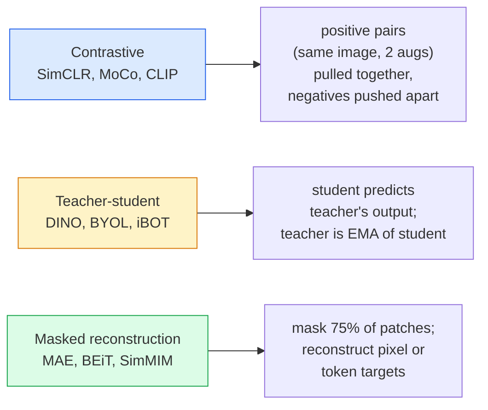

# Visión auto supervisada  SimCLR, DINO, MAE

> Etiquetas es botellas de visión supervisada. Auto-supervisado preentrenamiento  removerlos: de 100M 张无标记图像中学习视觉特征, volver a 10k 张有标记图像上精调──

**类型：**学习 + 构建
**语言：**Python
**先修要求：**Fase 4 Lección 04(Clasificación de imágenes),Fase 4 Lección 14(ViT)
**时间：**75 minutos

## El objetivo del aprendizaje

- 理三大 auto supervisado 家族  contrastivo SimCLR)  profesor-estudiante DINO)  reconstrucción enmascarada MAE)  并说明每种在优化什么
- Desde la cero de la pérdida de InfoNCE, explique por qué el tamaño del lote es 512 y el tamaño del lote es 32
-  Explica por qué el 75% de la MAE no es arbitrario, así como el 15% de los textos de BERT
- Utiliza DINOv2 o MAE ImageNet puntos de control  realizar la sondación lineal y la extracción de disparos cero

##  problemas

Supervisado ImageNet tiene 1.3M 张有标记图像, según las estimaciones, el costo de la marca es de 10M 美元。 Médicos y industriales datos más pequeños, el costo de la marca también más alto。 Cada visión 团队都会问: ¿Podemos primero preparar datos de marcaje barato  YouTube 、 web crawls  webcam footage  satelite sweeps  Luego en pequeña escala hay un conjunto de marcaje a la perfección?

El aprendizaje auto supervisado es la respuesta. Un ViT moderno auto supervisado en LAION o JFT, en el proceso de perfeccionamiento, puede alcanzar o superar el nivel de precisión supervisado. También se compara al preentrenamiento supervisado.

Concepto de transformación es: tarea de pretexto  模型被训练完成的任务  无必是下游任务──关键在于它是否迫使模型学习有用特征──预测灰度尺度 图像的颜色、旋转图像并让模型分类旋转角度、面具补丁并重建它们 这些方法都奏效过──能够规模化的三种方法是对比学习、教师-学生蒸和面具重建──

## 概念

### Tres familias



### Aprendizaje contrastero

取一张图像,应用两次随机增强,获得两次视图――将二者送入同一个编码加投影头――最小化一个损失,含义是

```
Loss for positive pair (z_i, z_j) among 2N views per batch:

   L_ij = -log( exp(sim(z_i, z_j) / tau) / sum_k in batch \ {i} exp(sim(z_i, z_k) / tau) )

sim = cosine similarity
tau = temperature (0.1 standard)
```

Esto es la pérdida de InfoNCE. Requiere de cada positivo, hay muchos negativos, por lo que el tamaño del lote es importante. SimCLR requiere 512-8192.

### Profesa-estudiante (DINO)

两个 estructuras de redes idénticas:estudiante y maestro;. profesor es el estudiante 权重的指数动平均(EMA)。二者都看到同一图像的增强视图──student的输出被训练为匹配的教师的输出 没有明显的负面──

```
loss = CE( student_output(view_1),  teacher_output(view_2) )
     + CE( student_output(view_2),  teacher_output(view_1) )

teacher_weights = m * teacher_weights + (1 - m) * student_weights   (m ≈ 0.996)
```

Por qué no se derrumbe 成预测 una constante: los resultados de los profesores se centran en la reducción de cada dimensión del valor medio) y no se afianzan en la reducción de la temperatura menor)

DINO es la base de la escala de DINOv2, DINOv2 en 142M 张 curated images 上训练──所得特征是当前零射视觉检索和密集预测的SOTA──

### Reconstrucción enmascarada (MAE)

Máscara un ViT  75% de los parches de entrada  Sólo se verá un 25% de los parches de envío en codificador  Un pequeño decodificador  recibo en codificador   salida y localización de tokens de máscara de las posiciones enmascaradas, y se ha entrenado para reconstruir los píxeles de parches enmascarados 

```
Encoder:  visible 25% of patches -> features
Decoder:  features + mask tokens at masked positions -> reconstructed pixels
Loss:     MSE between reconstructed and original pixels on masked patches only
```

让MAE 有效的关键设计选择:

- **75% mask ratio** 很高──迫使编码学习语义特征; reconstruir 25% 会接近微不足道(相邻像素的相关性太强,到CNN都能轻松完成)。
- **Asymmetric encoder/decoder** Grandes tipos de codificadores ViT sólo ver parches visibles; pequeño decodificador(8-layer,512-dim) procesamiento reconstrucción。比朴素 BEiT pretraining 快3 倍。
- **Pixel-space reconstruction target** Más sencillo que el objetivo tokenizado de BET, y mejor en ViT.

Después de la preparación, deja el decodificador.

### ¿Por qué es el 75% y no el 15%?

Máscara BERT 15% de tokens──máscara MAE 75%── diferenza en la densidad de información──

- El lenguaje natural Cada token de 很高──预测 15% de los tokens 仍然很难, porque cada posición enmascarada tiene muchas compleciones plausibles──
- Los parches de imagen de un área de vecindario que no está enmascarada normalmente pueden determinar con precisión los píxeles del parche enmascarado.

El 75% es lo suficientemente alto como para que el espacio fuera de la página sea imposible de resolver; el codificador debe mostrar el contenido de la imagen.

### Evaluación de la sonda lineal

Después de la formación preliminar, la evaluación estándar es:**linear probe**:结 codificador, basado en las etiquetas de ImageNet 训练一个单层线性分类器──报告顶级准确度──

- SimCLR ResNet-50: alrededor del 71%(2020)
- DINO ViT-S/16: alrededor del 77%
- MAE ViT-L/16: aproximadamente 76%(2022)
- DINOv2 ViT-g/14: alrededor del 86%

La sonda lineal es una medida pura de la calidad de las características; el ajuste fino generalmente aumenta de 2 a 5 puntos, pero también se mezcla con el efecto de la reentrenamiento de la cabeza.


```figure
data-augmentation
```

## Construirlo

### Paso 1:Pipeline de aumento de dos vistas

```python
import torch
import torchvision.transforms as T

two_view_train = lambda: T.Compose([
    T.RandomResizedCrop(96, scale=(0.2, 1.0)),
    T.RandomHorizontalFlip(),
    T.ColorJitter(0.4, 0.4, 0.4, 0.1),
    T.RandomGrayscale(p=0.2),
    T.ToTensor(),
])


class TwoViewDataset(torch.utils.data.Dataset):
    def __init__(self, base):
        self.base = base
        self.aug = two_view_train()

    def __len__(self):
        return len(self.base)

    def __getitem__(self, i):
        img, _ = self.base[i]
        v1 = self.aug(img)
        v2 = self.aug(img)
        return v1, v2
```

Cada uno .__getitem__Return de las dos vistas aumentadas de la misma imagen; no necesita etiquetas。

### 步骤 2:Perdida de información

```python
import torch.nn.functional as F

def info_nce(z1, z2, tau=0.1):
    """
    z1, z2: (N, D) L2-normalised embeddings of paired views
    """
    N, D = z1.shape
    z = torch.cat([z1, z2], dim=0)  # (2N, D)
    sim = z @ z.T / tau              # (2N, 2N)

    mask = torch.eye(2 * N, dtype=torch.bool, device=z.device)
    sim = sim.masked_fill(mask, float("-inf"))

    targets = torch.cat([torch.arange(N, 2 * N), torch.arange(0, N)]).to(z.device)
    return F.cross_entropy(sim, targets)
```

调用前先对 Embeddings  realizar la normalización de L2.`tau=0.1`Es el valor de SimCLR 默认; menor valor hará pérdida más punta, y no necesita más negativos.

### 步骤 3: Verificación de la sanidad InfoNCE

```python
z1 = F.normalize(torch.randn(16, 32), dim=-1)
z2 = z1.clone()
loss_same = info_nce(z1, z2, tau=0.1).item()
z2_random = F.normalize(torch.randn(16, 32), dim=-1)
loss_random = info_nce(z1, z2_random, tau=0.1).item()
print(f"InfoNCE with identical pairs:  {loss_same:.3f}")
print(f"InfoNCE with random pairs:     {loss_random:.3f}")
```

Para los pares similares  debería obtener una pérdida menor(en gran lote 和 bajo temperatura 下接近 0) ・・・随机 pares 应得到 log(2N-1) = ~log(31) = ~3.4, en el lote de 16 pares。

### 步骤 4: Enmascaramiento de estilo MAE

```python
def random_mask_indices(num_patches, mask_ratio=0.75, seed=0):
    g = torch.Generator().manual_seed(seed)
    n_keep = int(num_patches * (1 - mask_ratio))
    perm = torch.randperm(num_patches, generator=g)
    visible = perm[:n_keep]
    masked = perm[n_keep:]
    return visible.sort().values, masked.sort().values


num_patches = 196
visible, masked = random_mask_indices(num_patches, mask_ratio=0.75)
print(f"visible: {len(visible)} / {num_patches}")
print(f"masked:  {len(masked)} / {num_patches}")
```

简单、快速, y para una determinada semilla es determinista ⋅ real MAE 实现将对其进行批批,并保留每个样本的面具──

## Usalo

DINOv2 es el estándar de producción para 2026:

```python
import torch
from transformers import AutoImageProcessor, AutoModel

processor = AutoImageProcessor.from_pretrained("facebook/dinov2-base")
model = AutoModel.from_pretrained("facebook/dinov2-base")
model.eval()

# Per-image embeddings for zero-shot retrieval
with torch.no_grad():
    inputs = processor(images=[pil_image], return_tensors="pt")
    outputs = model(**inputs)
    embedding = outputs.last_hidden_state[:, 0]  # CLS token
```

Lo que se obtiene 768-dim Embedding es la recuperación de imágenes modernas, correspondencia densa y tuberías de transferencia de disparos cero.

 para los embedidos de texto de imágenes, SigLIP o OpenCLIP es un programa de tratamiento; para el ajuste fino de estilo MAE,`timm`El repo ha proporcionado todos los puntos de control de la MAE.

##  entregarlo

Encuentro de trabajo:

- `outputs/prompt-ssl-pretraining-picker.md` Una respuesta, según el tamaño del conjunto de datos, calcular y la tarea descendente  seleccionar SimCLR / MAE / DINOv2。
- `outputs/skill-linear-probe-runner.md` Una habilidad, para codificador congelado + conjunto de datos etiquetado 编写线性探测评──

##  ejercicios

1. **（Easy）**验证: Para los embebidos de buena calidad, la baja temperatura hará que la InfoNCE pierda, baja; para los embebidos de cualquier tipo, la baja temperatura hará que la pérdida suba, genera una y otra vez.`tau in [0.05, 0.1, 0.2, 0.5]`En el caso de las empresas, el riesgo de pérdida de capital es de
2. **（Medium）**实现 un buffer de centro de estilo DINO― mostrar si no se centra, el estudiante se reunirá en varias épocas dentro del colapso de un vector de la cantidad constante―
3. **（Hard）**Utiliza la lección 10 del MiniUNet como columna vertebral, en CIFAR-100  上训练 MAE。报告 10、50 和 200 épocas 时的线路探测精度──展示在同一个1000图像子集 上,MAE-pre-trained linear probe 优于从零监督线路探测──

## 关键术语: "El hombre es un hombre"

| Term | 人们的说法 | 实际含义 |
|------|----------------|----------------------|
| Self-supervised | “Label-free” | 一种 pretext task，用于从无标注数据中产生有用 representations |
| Pretext task | “假任务” | SSL 期间使用的 objective（reconstruct patches、match views）；pretraining 后会被丢弃 |
| Linear probe | “Frozen encoder + linear head” | 标准 SSL 评估：只在 frozen features 之上训练一个 linear classifier |
| InfoNCE | “Contrastive loss” | 对 cosine similarities 做 softmax；positive pair 是目标类别，所有其他项都是 negatives |
| EMA teacher | “Moving-average teacher” | 权重是 student 的 exponential moving average 的 teacher；BYOL、MoCo、DINO 使用它 |
| Mask ratio | “隐藏的 patches 百分比” | MAE 期间被 mask 的 patches 比例；vision 为 75%，text 为 15% |
| Representation collapse | “Constant output” | SSL 失败模式：encoder 对所有输入输出一个常量 Vector；通过 centring、sharpening 或 negatives 防止 |
| DINOv2 | “生产级 SSL backbone” | Meta 2023 年的 self-supervised ViT；2026 年最强的通用 image features |

## 延伸阅读

- [SimCLR (Chen et al., 2020)](https://arxiv.org/abs/2002.05709) aprendizaje contrastero 参考
- [DINO (Caron et al., 2021)](https://arxiv.org/abs/2104.14294) 带动力, centrar, afilar de los profesores y estudiantes
- [MAE (He et al., 2022)](https://arxiv.org/abs/2111.06377) 面向 ViT de autoencoder enmascarado preentrenamiento
- [DINOv2 (Oquab et al., 2023)](https://arxiv.org/abs/2304.07193) Extenderse a la calidad de producción de la VT auto supervisada
