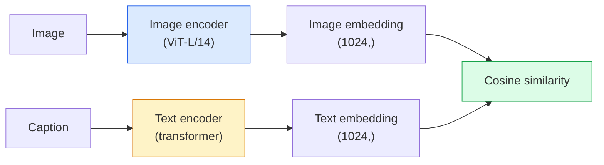

# Visión de vocabulario abierto  CLIP

> Para hacer un codificador de imágenes y un codificador de texto, se debe entrenar, hacer que coincida (imagen, captura) con el mismo punto en el espacio compartido.

**Type:** Build + Use
**Languages:** Python
**Prerequisites:** Phase 4 Lesson 14 (ViT), Phase 4 Lesson 17 (Self-Supervised)
**Time:** ~45 分钟

## El objetivo del aprendizaje

-  Explicar la arquitectura de dos torres de CLIP y el objetivo de formación contrastable
- Utilice CLIP pre-entrenado (o SigLIP) para realizar una clasificación de tiro cero, sin necesidad de ningún entrenamiento específico de tarea
- Desde zero lograr la clasificación de disparos cero: instrucciones de clase de código 計算 cosinus similarity 取 argmax
- 区分 CLIP、SigLIP、OpenCLIP y modelos de visión LLaVA/LLaMA se utilizan cada uno en 2026

##  problemas

传统分类器是闭词库:一个1000级ImageNet模型只能预测1000个标签──每一个新类别都需要标签数据 和重新训练的头──

CLIP(Radford et al., OpenAI 2021) indican que en los 400M pares de (imagen, leyenda) de la web capturados en el entrenamiento, se puede obtener un modelo, que puede inferir 时分类到任何类集合中, mientras que estas clases sólo necesitan usar la descripción de lenguaje natural.

Esta capacidad  transferencia de tiro cero  éstas son las razones de cada sistema de visión moderno  desde el punto de control de la familia CLIP  la detección  la segmentación  la redundante de DINO  OWL-ViT  la segmentación  la recuperación  la moderación de contenido  los VLM y la generación de texto a imagen  se basan en embebedidos conjuntos de estilo CLIP 

## 概念

### Dos torres



两个 codificadores 最后都会通过线性投影 投影到相同的嵌入维度 ((CLIP-B/32 为 512,CLIP-L/14 为 1024) ⋅ realizar L2-normalizar 并计算共弦相似之──

###  objetivo

给定一个包含 N 个 (imagen, captura) pares de lote, construir una matriz de similitud NxN。 entrenar dos codificadores, hacer diagonales(pares de coincidencia) con alta similitud, mientras que fuera de diagonales(no coincidencia) con baja similitud。

```
sim_matrix = image_embeddings @ text_embeddings.T / tau

loss_i2t = cross_entropy(sim_matrix,       targets=arange(N))
loss_t2i = cross_entropy(sim_matrix.T,     targets=arange(N))
loss = (loss_i2t + loss_t2i) / 2
```

Es simétrico, porque la extracción de imagen a texto y texto a imagen deberían ser útiles.`tau`(temperatura) normalmente como parámetro escalar, inicialmente 0.07

### SigLIP: mejor pérdida

SigLIP(Zhai et al., 2023) con sigmoide por pareja  sustituyó softmax:

```
loss = mean over pairs of log(1 + exp(-y_ij * sim_ij))
y_ij = +1 if matching, -1 otherwise
```

Per-pair Loss 移除 CLIP required batch-level normalization──SigLIP en pequeños lotes 下训练更好,并在相同数据量下匹配或超过 CLIP──

### Clasificación de tiro cero

给定一个训练好的Clip:

1. Para cada clase, 组合一个提示:"Una foto de una {clase}"
2. Usando el codificador de texto codificar todas las instrucciones de clase -> `T`forma (C, d)
3. Imagen de prueba de código de código -> `I`forma (1, d)
4. Similaridad = `I @ T.T`forma (1, C) ⋅
5. Argmax -> clase prevista。

La ingeniería rápida es muy importante. OpenAI para ImageNet publicó 80 plantillas de plantillas rápidas. Una foto de una {}, una foto borrosa de una {}, un boceto de una {}, una...')

### 2026 años de uso de modelos CLIP

- **Zero-shot classification** directa utilización。
- **Image retrieval** Encuentra una vez todas las imágenes, en inferencia 时 embed query。
- **Text-conditioned detection**Grounding DINO、OWL-ViT Clip text tower 包装在探测器 周围──
- **Text-conditioned segmentation**CLIPSeg;SAM 通过 CLIP 使用文本快速输入──
- **VLMs**LLaVA、Qwen-VL、InternVL va a codificar la visión de la familia CLIP 接入 LLM。
- **Text-to-image gen**Difusión estable DALL-E 3 以 CLIP text embeddings 为条件──

Una vez que tienes espacio compartido de incorporación, cada tarea de visión+lenguaje se convierte en distancia calculada.


```figure
clip-contrastive
```

## Construirlo

### Paso 1: Un modelo de dos torres muy pequeño

El CLIP verdadero es un transformador ViT +. En la actualidad, las torres se basan en las características de pre-extracción de pequeños MLP, por lo que las señales de entrenamiento en la CPU también pueden verse.

```python
import torch
import torch.nn as nn
import torch.nn.functional as F


class TwoTower(nn.Module):
    def __init__(self, img_in=128, txt_in=64, emb=64):
        super().__init__()
        self.image_proj = nn.Sequential(nn.Linear(img_in, 128), nn.ReLU(), nn.Linear(128, emb))
        self.text_proj = nn.Sequential(nn.Linear(txt_in, 128), nn.ReLU(), nn.Linear(128, emb))
        self.logit_scale = nn.Parameter(torch.ones([]) * 2.6592)  # ln(1/0.07)

    def forward(self, img_feats, txt_feats):
        i = F.normalize(self.image_proj(img_feats), dim=-1)
        t = F.normalize(self.text_proj(txt_feats), dim=-1)
        return i, t, self.logit_scale.exp()
```

两个 proyecciones √ compartida-dim salida √ temperatura aprendida √ forma √ real CLIP API √

### 步骤 2:Perdida contrastable

```python
def clip_loss(image_emb, text_emb, logit_scale):
    N = image_emb.size(0)
    sim = logit_scale * image_emb @ text_emb.T
    targets = torch.arange(N, device=sim.device)
    l_i = F.cross_entropy(sim, targets)
    l_t = F.cross_entropy(sim.T, targets)
    return (l_i + l_t) / 2
```

Simétrico, pero tiene un riesgo poco estable.

### 步骤 3: Clasificador de tiro cero

```python
@torch.no_grad()
def zero_shot_classify(model, image_feats, class_text_feats, class_names):
    """
    image_feats:      (N, img_in)
    class_text_feats: (C, txt_in)   one averaged embedding per class
    """
    i = F.normalize(model.image_proj(image_feats), dim=-1)
    t = F.normalize(model.text_proj(class_text_feats), dim=-1)
    sim = i @ t.T
    pred = sim.argmax(dim=-1)
    return [class_names[p] for p in pred.tolist()]
```

Cada paso en una línea. Este es el procedimiento de tiro cero exacto utilizado en el punto de control de producción CLIP.

### Paso 4: Control de salud

```python
torch.manual_seed(0)
model = TwoTower()

img = torch.randn(8, 128)
txt = torch.randn(8, 64)
i, t, scale = model(img, txt)
loss = clip_loss(i, t, scale)
print(f"batch size: {i.size(0)}   loss: {loss.item():.3f}")
```

 para el modelo de inicio de la oportunidad, la pérdida  debería acercarse `log(N) = log(8) = 2.08`Este es un objetivo de entropía cruzada simétrica de la estructura que aún no se ha aprendido.

## Usalo

OpenCLIP es una opción común para el año 2026.

```python
import open_clip
import torch
from PIL import Image

model, _, preprocess = open_clip.create_model_and_transforms("ViT-B-32", pretrained="laion2b_s34b_b79k")
tokenizer = open_clip.get_tokenizer("ViT-B-32")

image = preprocess(Image.open("dog.jpg")).unsqueeze(0)
text = tokenizer(["a photo of a dog", "a photo of a cat", "a photo of a car"])

with torch.no_grad():
    image_features = model.encode_image(image)
    text_features = model.encode_text(text)
    image_features = image_features / image_features.norm(dim=-1, keepdim=True)
    text_features = text_features / text_features.norm(dim=-1, keepdim=True)
    probs = (100.0 * image_features @ text_features.T).softmax(dim=-1)

print(probs)
```

SigLIP 更新, en pequeña escala entrenamiento mejor, y más adaptado a nuevos trabajos:`google/siglip-base-patch16-224`✿Cabos de cara 同时提供两者✿

##  entregarlo

Encuentro de trabajo:

- `outputs/prompt-zero-shot-class-picker.md`Un prompt, utilizado en las clases 列表和域 时, para cero disparos de CLIP 设计类模板──
- `outputs/skill-image-text-retriever.md`Una habilidad, con cualquier punto de control CLIP construir índice de incorporación de imágenes, soportar consulta por texto 和 consulta por imagen。

##  ejercicios

1. **（Easy）**Utilice el OpenCLIP ViT-B/32 preentrenado, y CIFAR-10 上 utiliza el conjunto de instrucciones de 80 plantillas hacer una clasificación de tiro cero.
2. **（Medium）**En la misma tarea CIFAR-10 上比较单模板("una foto de un {}") con 80 modelos embebidos promedio──量化差距并解释为什么模板有帮助──
3. **（Hard）**Construir un índice de recuperación de imágenes de cero disparos: con CLIP embebar 1.000 张 imágenes, construir un índice FAISS, hacer consultas en el lenguaje natural.

## 关键术语: "El hombre es un hombre"

| Term | 人们怎么说 | 它实际意味着什么 |
|------|----------------|----------------------|
| Two-tower | "Dual encoder" | 独立的 image 和 text encoders，末端是 shared-dim projection head |
| Zero-shot | "No task-specific training" | 在 inference 时分类到仅由文本描述的 classes；不接触 labels |
| Temperature / logit_scale | "tau" | 在 softmax 前缩放 similarity matrix 的 learned scalar |
| Prompt template | "A photo of a {}" | 包裹 class names 的自然语言包装器；平均多个 templates 会提升 zero-shot accuracy |
| CLIP | "Image+text model" | 2021 年的 OpenAI model；2026 年该领域的通用语汇 |
| SigLIP | "Sigmoid CLIP" | 将 softmax 替换为 per-pair sigmoid；在小 batch 下训练更好 |
| OpenCLIP | "Open reproduction" | 社区在 LAION 上训练的 CLIP variants；open-source pipelines 的 production default |
| VLM | "Vision-language model" | CLIP-family encoder 加上 LLM，训练用来回答关于 images 的问题 |

## 延伸阅读

- [CLIP：从自然语言监督中学习可迁移视觉模型（Radford et al., 2021）](https://arxiv.org/abs/2103.00020)
- [SigLIP：用于 Language-Image Pre-Training 的 Sigmoid Loss（Zhai et al., 2023）](https://arxiv.org/abs/2303.15343)
- [OpenCLIP](https://github.com/mlfoundations/open_clip) Base de código comunitario
- [DINOv2 vs CLIP vs MAE：features comparison](https://huggingface.co/blog/dinov2)incluyendo los casos de uso de la HF
