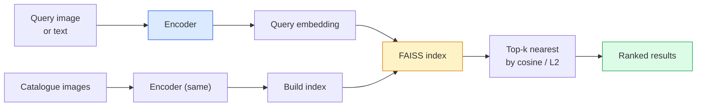

# Recuperación de imágenes y aprendizaje métrico

> Sistema de recuperación de datos de la distancia entre los espacios de inserción y la orden de los candidatos. El aprendizaje métrico es una disciplina que forma este espacio, haciendo que la distancia exprese el significado que desea.

**Type:** Build
**Languages:** Python
**Prerequisites:** Phase 4 Lesson 14 (ViT), Phase 4 Lesson 18 (CLIP)
**Time:** ~45 minutes

## El objetivo del aprendizaje
-  explicar las pérdidas de aprendizaje métrico tripartito 、contrastivo y basado en proxy,并为给定数据集选择合适的方法
- La normalización de L2 y la similitud cosina, y la revisión de "el mismo elemento" y la recuperación de "la misma clase"
- Construir índice FAISS, con texto y imágenes para consultarlo,并为持久查询集 报告 recall@K
- Para usar DINOv2、CLIP 和 SigLIP, entablar espinas y saber cuándo ganan.

##  problemas
Recuperación en producción de sistemas de visualización no existe:detección de duplicados, búsqueda de imágenes invertidas, búsqueda visual, "encontrar productos similares"), identificación de cara, re-identificación de persona, para controlar, re-identificación de persona, para el uso de la correspondencia de nivel de instancia en el comercio electrónico.

两个 diseño de decisiones deciden el sistema entero.  Embebedamiento, es decir, por qué el modelo produce Vector.  Índice, es decir, cómo encontrar el vecindario más cercano en el escenario de escalado.  Hasta 2026 años, ambos han sido comercializados.

Este tipo de formación es el aprendizaje métrico.

## 概念
### Recuperación en un vistazo



### Las cuatro familias de pérdida

| Loss | Requires | Pros | Cons |
|------|----------|------|------|
| **Contrastive** | (anchor, positive) + negatives | 简单，可用于任何 pair label | 没有大量 negatives 时收敛较慢 |
| **Triplet** | (anchor, positive, negative) | 直观；可直接控制 margin | Hard-triplet mining 成本高 |
| **NT-Xent / InfoNCE** | Pairs + batch-mined negatives | 可扩展到大 batch | 需要大 batch 或 momentum queue |
| **Proxy-based (ProxyNCA)** | 仅 class labels | 快速、稳定、无需 mining | 在小数据集上可能 overfit 到 proxies |

Para la mayoría de los casos de producción, primero desde la columna vertebral preentrenada  Inicio; sólo cuando fuera de la estantería Embedings en su ensayo de prueba en el que no se ha realizado, volver a añadir métricas de aprendizaje de la maquinaria.

### La pérdida de triplet formalmente

```
L = max(0, ||f(a) - f(p)||^2 - ||f(a) - f(n)||^2 + margin)
```

¿ Qué es eso ?`a`拉近 positivo `p`, lo empuje hacia el negativo .`n`,并使用 `margin`确保间隔──三图结构 puede generalizarse a cualquier orden de similitud──

Minería  很重要: triplos fáciles`n`Ya lo he hecho .`a`很远) Contribución零 Perdida; sólo triplicos duros 才能教会模型──Mimi-duro minería(`n`Más que`p`Más lejos pero todavía en margen dentro) fue el programa de FaceNet de 2016 y todavía es el principal.

### Similaridad de cosinos vs L2

两种标准,两套约定:

- **Cosine**:Véctor 之间的角── necesita L2-normalizaciones de los embebidos──
- **L2**Distancia euclidiana: ■ Puede utilizarse en bruto o en embraguamiento normalizado, pero normalmente se usa con L2 normalizado + L2 cuadrado 搭配―

Para la mayoría de las redes modernas, ambas son iguales:`||a|| = ||b|| = 1`时,`||a - b||^2 = 2 - 2 cos(a, b)`△ seleccionar con tu embebimiento 训练一致的约定;混用会改变 "más cercano" 的含义──

### Recall@K

标准 retorno métrica:

```
recall@K = fraction of queries where at least one correct match is in the top K results
```

Y排 report recall@1、@5、@10。若 recall@10 高于0.95而 recall@1 低于0.5,说明 Embedding space 结构正确,但排序有噪音;可以尝试更长的细节或重新排名步骤。

 Para la detección de duplicados, precisión@K es más importante, ya que cada falso positivo son errores visuales del usuario.

### FAISS en un párrafo

Facebook AI Similarity Search── фак фак фак стандарт的近隣搜索 库──三种索引 选择:

- `IndexFlatIP`- ¿ Qué ?`IndexFlatL2` fuerza bruta 精确 无需训练──可用到约1M vectores──
- `IndexIVFFlat` 划分为K个细胞, sólo busque las células más recientes 近似、快速、需要训练数据──
- `IndexHNSW` basado en gráficos, en mayor cantidad de consultas, tamaño del índice 较大──

 Para 100k vectores, tú podrías pensar en la similitud cosínica 上使用 `IndexFlatIP` Para 10M, uso `IndexIVFFlat`◊ Para 100M+,结合产品量化 (en inglés)`IndexIVFPQ`)。

### Recuperación de nivel de instancia frente a nivel de categoría

Dos problemas muy diferentes:

- **Category-level** "En mi catálogo, en el que buscan gatos"".
- **Instance-level** "En mi catálogo, encontrar este producto*──" 需要在同一类内视觉相似对象之间做细粒度区分;

Antes de elegir el modelo, siempre primero pregunta bien cuál es tu solución.


```figure
metric-embedding
```

## Construirlo
### Paso 1: pérdida de triplet

```python
import torch
import torch.nn.functional as F

def triplet_loss(anchor, positive, negative, margin=0.2):
    d_ap = F.pairwise_distance(anchor, positive, p=2)
    d_an = F.pairwise_distance(anchor, negative, p=2)
    return F.relu(d_ap - d_an + margin).mean()
```

Una línea. Aplicable a los embebidos normalizados o crudos de L2.

### 步骤 2: Minería semihardida

给定一批嵌和标签, para cada ancla 找到最难的半硬负面──

```python
def semi_hard_negatives(emb, labels, margin=0.2):
    dist = torch.cdist(emb, emb)
    same_class = labels[:, None] == labels[None, :]
    diff_class = ~same_class
    N = emb.size(0)

    positives = dist.clone()
    positives[~same_class] = float("-inf")
    positives.fill_diagonal_(float("-inf"))
    pos_idx = positives.argmax(dim=1)

    semi_hard = dist.clone()
    semi_hard[same_class] = float("inf")
    d_ap = dist[torch.arange(N), pos_idx].unsqueeze(1)
    semi_hard[dist <= d_ap] = float("inf")
    neg_idx = semi_hard.argmin(dim=1)

    fallback_mask = semi_hard[torch.arange(N), neg_idx] == float("inf")
    if fallback_mask.any():
        hardest = dist.clone()
        hardest[same_class] = float("inf")
        neg_idx = torch.where(fallback_mask, hardest.argmin(dim=1), neg_idx)
    return pos_idx, neg_idx
```

Cada ancla se obtendrá el más difícil de la clase positivo, así como un negativo semihardido más lejos que positivo pero en el margen.

### Paso 3: Recall@K

```python
def recall_at_k(query_emb, gallery_emb, query_labels, gallery_labels, k=1):
    sim = query_emb @ gallery_emb.T
    _, top_k = sim.topk(k, dim=-1)
    matches = (gallery_labels[top_k] == query_labels[:, None]).any(dim=-1)
    return matches.float().mean().item()
```

En los embustes normalizados L2 arriba según el producto interno 取 top-k, igual a la tasa de cosino 取 top-k.

### Paso 4: Ponerlo juntos

```python
import torch
import torch.nn as nn
from torch.optim import Adam

class Encoder(nn.Module):
    def __init__(self, in_dim=128, emb_dim=64):
        super().__init__()
        self.net = nn.Sequential(
            nn.Linear(in_dim, 128), nn.ReLU(),
            nn.Linear(128, emb_dim),
        )

    def forward(self, x):
        return F.normalize(self.net(x), dim=-1)

torch.manual_seed(0)
num_classes = 6
protos = F.normalize(torch.randn(num_classes, 128), dim=-1)

def sample_batch(bs=32):
    labels = torch.randint(0, num_classes, (bs,))
    x = protos[labels] + 0.15 * torch.randn(bs, 128)
    return x, labels

enc = Encoder()
opt = Adam(enc.parameters(), lr=3e-3)

for step in range(200):
    x, y = sample_batch(32)
    emb = enc(x)
    pos_idx, neg_idx = semi_hard_negatives(emb, y)
    loss = triplet_loss(emb, emb[pos_idx], emb[neg_idx])
    opt.zero_grad(); loss.backward(); opt.step()
```

Después de unos cientos de pasos, los grupos de incorporación formarán cada clase un grupo.

## Usalo
Producción de 2026 años:

- **DINOv2 + FAISS** 通用 visual retrieval──可 fuera de la estantería 使用──
- **CLIP + FAISS** Cuando la consulta es en el texto.
- **Fine-tuned DINOv2 + FAISS** recuperación a nivel de instancia, re-identificación de cara, moda, comercio electrónico.
- **Milvus / Weaviate / Qdrant**  En torno a los envases de DB de vectores gestionados de FAISS o HNSW。

Para la recuperación de instancia SOTA, la combinación es:DINOv2 espina dorsal, añadir cabeza de embebido, en pares etiquetados con instancia 上用 triplet 或 InfoNCE Loss fine-tune, y establecer índice en FAISS。

##  entregarlo
本课产 出:

- `outputs/prompt-retrieval-loss-picker.md` Una respuesta, utilizada para la recuperación determinada  problema seleccionar triplet / InfoNCE / ProxyNCA。
- `outputs/skill-recall-at-k-runner.md` Una habilidad, para escribir干净的回忆@K evaluación harness, contenido tren/val/galería divisiones 和正确的数据契约──

##  ejercicios
1. **(Easy)**运行 运行 运行 运行 运行 运行 运行 运行 运行 运行 运行 运行 运行 运行 运行 运行 运行 运行 运行 运行 运行 运行 运行 运行 运行 运行 运行 运行 运行 运行 运行 运行 运行 运行 运行 运行 运行 运行 运行 运行 运行 运行 运行 运行 运行 运行 运行 运行 运行 运行 运行 运行 运行 运行 运行 运行 运行 运行 运行 运行 运行 运行 运行 运行 运行 运行 运行 运行 运行 运行 运行 运行 运行 运行 运行 运行 运行 运行 运行 运行 运行 运行 运行 运行 运行 运行 运行 运行 运行 运行 运行 运行 运行 运行 运行 运行 运行 运运运运运运运行 运运运运运运运运运运运运运运 运 运 运 运 运 运 运 运 运 运 运 运 运 运 运 运 运 运 运 运 运 运 运 运 运 运 运 运 运 运 运 运 运 运 运 运 运 运 运 运 运 运 运 运 运
2. **(Medium)**添加 ProxyNCA Loss 实现: cada clase Una "proxy" aprendida, en similitud cosínica 上做标准交叉 Entropy── Compare con la pérdida de triplet 在 juguete datos 上的收速度──
3. **(Hard)**取 1,000 张 ImageNet validación de imágenes, a través de HuggingFace con DINOv2 生成 Embeddings, construir FAISS índice plano,并报告以同一批图像为查询 时的回忆@{1, 5, 10}(应为 1.0),以及以持久的分和 ImageNet etiquetas 作为 ground truth 时的结果──

## 关键术语: "El hombre es un hombre"
| Term | What people say | What it actually means |
|------|----------------|----------------------|
| Metric learning | "Shape the space" | 训练一个 encoder，使其输出空间中的距离反映目标相似度 |
| Triplet loss | "Pull and push" | L = max(0, d(a, p) - d(a, n) + margin)；经典的 metric-learning Loss |
| Semi-hard mining | "Useful negatives" | 比 positive 更远但仍在 margin 内的 negatives；经验上信息量最大 |
| Proxy-based loss | "Class prototypes" | 每个 class 一个 learned proxy；对 similarity-to-proxies 做 cross-entropy；无需 pair mining |
| Recall@K | "Top-K hit rate" | top K 中至少有一个正确结果的查询比例 |
| Instance retrieval | "Find this exact thing" | 细粒度匹配；off-the-shelf features 通常表现不足 |
| FAISS | "The NN library" | Facebook 的 nearest-neighbour 库；支持精确和近似 indexes |
| HNSW | "Graph index" | Hierarchical navigable small world；内存开销小的快速近似 NN |

## 延伸阅读
- [FaceNet: A Unified Embedding for Face Recognition (Schroff et al., 2015)](https://arxiv.org/abs/1503.03832) pérdida de triplet / minería semi-dura 论文
- [In Defense of the Triplet Loss for Person Re-Identification (Hermans et al., 2017)](https://arxiv.org/abs/1703.07737) tripleto de ajuste fino 实践指南
- [FAISS documentation](https://github.com/facebookresearch/faiss/wiki) Cada tipo de índice, cada tipo de compensación
- [SMoT: Metric Learning Taxonomy (Kim et al., 2021)](https://arxiv.org/abs/2010.06927) 现代 pérdidas  y su relación
