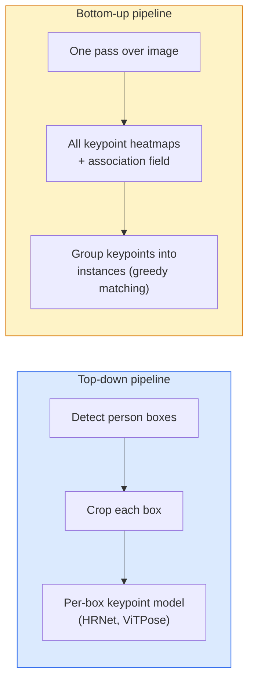

# Detección de puntos clave y estimación de posición

> Una pose es un grupo de puntos clave ordenados. Un detector de puntos clave es un regresor de mapas de calor. Todo lo demás es contabilidad.

**Type:** Build
**Languages:** Python
**Prerequisites:** Phase 4 Lesson 06 (Detection), Phase 4 Lesson 07 (U-Net)
**Time:** ~45 分钟

## El objetivo del aprendizaje
- 区分 arriba abajo y abajo arriba estimación de la posición,并说明各自何时使用
- Utiliza el objetivo Gaussian-por punto clave para K 个 puntos clave mapas de calor de regresión, y en la inferencia 时提取 puntos clave coordenadas
- 解释 Parte de campos de afinidad (PAFs), así como tuberías de abajo hacia arriba  cómo poner puntos clave 关联成 instancias
- Usar MediaPipe Pose o MMPose para hacer una estimación de los puntos clave de producción, y entender su formato de salida

##  problemas
Tarea clave Hay muchos nombres: pose humana ((17 articulaciones corporales) 、marcos faciales ((68 o 478 个点) 、mano ((21 个点) 、 pose animal 、 pose objeto robótico 、 marcos anatómicos médicos。 todos ellos comparten la misma estructura: en un objeto 上检测 K 个离散点,并输出它们的 (x, y) coordenadas。

La estimación de la posición es la captura de movimiento, aplicaciones de fitness, análisis deportivo, control de gestos, animación, experimentación de AR y captura robótica.

工程问题在于尺度──单图、单人 Pose 是一个20ms 问题──的人群中的多人 Pose 需要在30fps 下运行,则是一个完全不同的结构问题──

## 概念
### De arriba hacia abajo vs abajo hacia arriba



- **Top-down** Pre-examen de personas, re-procesamiento de cada cultivo 运行 por persona modelo de punto clave―precisión tasa más alta; con número de personas 线性扩展―
- **Bottom-up** Una vez más pase hacia adelante 预测 todos los puntos clave加一个协会字段;再把它们分组── independientemente del tamaño de la multitud 如何,耗时恒定──

La red de alta densidad de personas (HRNet, ViTPose) es el principal programa; la red de alta densidad de personas (OpenPose, HigherHRNet) es el principal programa entre las escenas de alta densidad de personas (Street).

### Regresión de la hoja de calor

No hay regresión directa.`(x, y)`, sino para cada punto clave 预测 uno `H x W`Mapa de calor, en el centro de la verdadera ubicación hay una mancha gaussiana.

```
target[k, y, x] = exp(-((x - cx_k)^2 + (y - cy_k)^2) / (2 sigma^2))
```

En la inferencia, el argmax de cada mapa de calor es la ubicación del punto clave de la predicción.

¿Por qué los mapas de calor son mejores que la regresión directa? ¿Por qué los mapas de calor son mejores que la regresión directa? ¿Por qué los mapas de calor son mejores que la regresión directa? ¿Por qué los mapas de calor son mejores que los mapas de la red? ¿Por qué los mapas de características de la red? ¿Por qué los objetivos gaussianos también se levantan hasta el efecto de regular                                                                                                                                                                                                                 

### Localización de subpixel

Argmax                                                                                                                                                                                                                                                                                                                                                                                                                                                                                                                            `(dx, dy) = 0.25 * (heatmap[y, x+1] - heatmap[y, x-1], ...)`Dirección:

### Los campos de afinidad de parte (PAF)

OpenPose utiliza técnicas de asociación de abajo hacia arriba. Para cada par de puntos clave de conexión (por ejemplo, hombro izquierdo al codo izquierdo), predice un campo de 2 canales, codifica el vector unitario de un punto que indica al otro punto.

```
For each connection (limb):
  PAF channels: 2 (unit vector x, y)
  Line integral: sum over sample points of (PAF . line_direction)
  Higher integral = stronger match
```

Este método es muy bueno y no se necesita cultivos por persona, puede extenderse a cualquier tamaño de la multitud.

### Puntos clave de COCO

标准的 body-pose dataset: cada persona 17 个关键点, usando PCK (%) y OKS (%) 个关键点相似性 (%) 作为指标.

### 2D vs 3D

- **2D pose** Coordenadas de imagen; ya alcanzado la producción质量 (MediaPipe, HRNet, ViTPose) 
- **3D pose** coordenadas del mundo / cámara; todavía está activo en el estudio de la dirección.
  - Usando una pequeña MLP, las predicciones 2D se elevan a 3D.
  - directamente desde la imagen hacer regresión 3D PyMAF, MHFormer)
  - Configuraciones de múltiples visualizaciones para la verdad de tierra.


```figure
cv3-pose-heatmap
```

## Construirlo
### 步骤 1: meta de la mapa de calor de Gaussian

```python
import numpy as np
import torch

def gaussian_heatmap(size, cx, cy, sigma=2.0):
    yy, xx = np.meshgrid(np.arange(size), np.arange(size), indexing="ij")
    return np.exp(-((xx - cx) ** 2 + (yy - cy) ** 2) / (2 * sigma ** 2)).astype(np.float32)

hm = gaussian_heatmap(64, 32, 32, sigma=2.0)
print(f"peak: {hm.max():.3f} at ({hm.argmax() % 64}, {hm.argmax() // 64})")
```

Llevo el eje del canal  acumulado por puntos clave mapas de calor, obtiene el tensor objetivo completo 

### Paso 2: Tía pequeña de teclado

Un modelo de estilo U-Net, salida de K 个 calor mapa canales.

```python
import torch.nn as nn
import torch.nn.functional as F

class TinyKeypointNet(nn.Module):
    def __init__(self, num_keypoints=4, base=16):
        super().__init__()
        self.down1 = nn.Sequential(nn.Conv2d(3, base, 3, 2, 1), nn.ReLU(inplace=True))
        self.down2 = nn.Sequential(nn.Conv2d(base, base * 2, 3, 2, 1), nn.ReLU(inplace=True))
        self.mid = nn.Sequential(nn.Conv2d(base * 2, base * 2, 3, 1, 1), nn.ReLU(inplace=True))
        self.up1 = nn.ConvTranspose2d(base * 2, base, 2, 2)
        self.up2 = nn.ConvTranspose2d(base, num_keypoints, 2, 2)

    def forward(self, x):
        h1 = self.down1(x)
        h2 = self.down2(h1)
        h3 = self.mid(h2)
        u1 = self.up1(h3)
        return self.up2(u1)
```

输入  `(N, 3, H, W)`, de salida`(N, K, H, W)` Las pérdidas son en MSE por píxel de objetivos gaussianos.

### 步骤 3: Inferencia  extraer las coordenadas de puntos clave

```python
def heatmap_to_coords(heatmaps):
    """
    heatmaps: (N, K, H, W)
    returns:  (N, K, 2) float coordinates in image pixels
    """
    N, K, H, W = heatmaps.shape
    hm = heatmaps.reshape(N, K, -1)
    idx = hm.argmax(dim=-1)
    ys = (idx // W).float()
    xs = (idx % W).float()
    return torch.stack([xs, ys], dim=-1)

coords = heatmap_to_coords(torch.randn(2, 4, 32, 32))
print(f"coords: {coords.shape}")  # (2, 4, 2)
```

Para el refinamiento de sub-pixel, en argmax  alrededor de la inserción de valor.

### 步骤 4: conjunto de datos de puntos clave sintéticos

很简单: en tela blanca 上画四个点,并学习预测它们──

```python
def make_synthetic_sample(size=64):
    img = np.ones((3, size, size), dtype=np.float32)
    rng = np.random.default_rng()
    kps = rng.integers(8, size - 8, size=(4, 2))
    for cx, cy in kps:
        img[:, cy - 2:cy + 2, cx - 2:cx + 2] = 0.0
    hms = np.stack([gaussian_heatmap(size, cx, cy) for cx, cy in kps])
    return img, hms, kps
```

Esta tarea es bastante simple, modelo pequeño, en un minuto ya puedes aprender.

### Paso 5: Formación

```python
model = TinyKeypointNet(num_keypoints=4)
opt = torch.optim.Adam(model.parameters(), lr=3e-3)

for step in range(200):
    batch = [make_synthetic_sample() for _ in range(16)]
    imgs = torch.from_numpy(np.stack([b[0] for b in batch]))
    hms = torch.from_numpy(np.stack([b[1] for b in batch]))
    pred = model(imgs)
    # Upsample pred to full resolution
    pred = F.interpolate(pred, size=hms.shape[-2:], mode="bilinear", align_corners=False)
    loss = F.mse_loss(pred, hms)
    opt.zero_grad(); loss.backward(); opt.step()
```

## Usalo
- **MediaPipe Pose** Estimador de posición de producción de Google; proporciona WebGL + tiempos de ejecución móviles, retraso inferior a 10 ms。
- **MMPose**(OpenMMLab)  全面的研究代码库;包含每种SOTA arquitectura 及预训练的权重──
- **YOLOv8-pose** Última postura de múltiples personas en tiempo real, usando un pase único hacia adelante―
- **transformers HumanDPT / PoseAnything** Utilizando la postura de vocabulario abierto (en términos de objetos o puntos clave) en comparación con los nuevos enfoques del lenguaje de visión.

##  entregarlo
本课产 出:

- `outputs/prompt-pose-stack-picker.md` Una respuesta rápida, según la latencia, el tamaño de la multitud, así como 2D vs 3D 需求选择 MediaPipe / YOLOv8-pose / HRNet / ViTPose。
- `outputs/skill-heatmap-to-coords.md` Una habilidad, para escribir cada modelo de producción de postura se utiliza hasta la rutina de sub-pixel de mapa de calor a la coordinación。

##  ejercicios
1. **(Easy)**En un conjunto de datos sintético de 4 puntos, la formación de un modelo de punto clave pequeño.
2. **(Medium)**添加 sub-pixel refinamiento: dado la posición de argmax determinada, en la dirección x y y 方向 using neighboring pixels 拟合 1D parabola。 report relative to integer argmax 精度增──
3. **(Hard)**Construir un conjunto de datos sintéticos de 2 personas, en el que cada imagen  muestra dos ejemplos de patrón de 4 puntos clave―entrenar una tubería de abajo hacia arriba de PAFs, predictar qué punto clave  pertenece a qué instancia,并评估 OKS―

## 关键术语: "El hombre es un hombre"
| Term | 人们怎么说 | 它实际是什么意思 |
|------|----------------|----------------------|
| Keypoint | "一个 landmark" | object 上的一个特定有序点（joint、corner、feature） |
| Pose | "skeleton" | 属于一个 instance 的一组有序 keypoints |
| Top-down | "先 detect，再 pose" | Two-stage pipeline：person detector + per-crop keypoint model；准确率最高 |
| Bottom-up | "先 pose，后 group" | Single-pass all-keypoint prediction + grouping；在 crowd size 上耗时恒定 |
| Heatmap | "Gaussian target" | 每个 keypoint 一个 H x W tensor，峰值位于真实位置；首选的 Regression target |
| PAF | "Part Affinity Field" | 编码 limb directions 的 2-channel unit vector field；用于把 keypoints 分组为 instances |
| OKS | "Keypoint IoU" | Object Keypoint Similarity；COCO 的 pose metric |
| HRNet | "High-Resolution Net" | 主流 top-down keypoint architecture；全程保留 high-res features |

## 延伸阅读
- [OpenPose (Cao et al., 2017)](https://arxiv.org/abs/1812.08008) Usar PAFs de abajo hacia arriba; sigue siendo el mejor material de instrucción del método
- [HRNet (Sun et al., 2019)](https://arxiv.org/abs/1902.09212) de arriba hacia abajo 参考架构
- [ViTPose (Xu et al., 2022)](https://arxiv.org/abs/2204.12484) Uso de ViT simple  como columna vertebral de la postura; en muchos puntos de referencia 上是当前 SOTA
- [MediaPipe Pose](https://developers.google.com/mediapipe/solutions/vision/pose_landmarker) Posición en tiempo real de producción de nivel;2026 años de depósito de la pila más rápida
