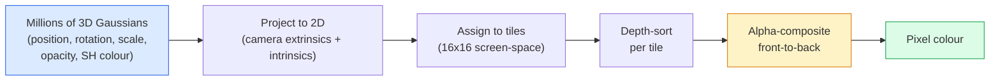

# Desde la realización de 3D Gaussian Splatting

> Una escena es un grupo de millones de Gaussianos 3D  que componen una nube. Cada Gaussiano tiene una posición, orientación, escala, opacidad, así como un color que depende de la dirección de visión.

**类型：**Construcción
**语言：**Python
**先修要求：**Fase 4 Lección 13 (3D Vision & NeRF) Fase 1 Lección 12 (Operaciones de tensión) Fase 4 Lección 10 (Basics of Diffusion optional)
**时间：**90 minutos

## El objetivo del aprendizaje

-  Explicar por qué hasta 2026 años, el Gaussian Splating  ha sustituido a la NeRF, convirtiéndose en un modelo de producción estándar de reconstrucción 3D fotorrealista
- Cuál es el valor de cada uno de los seis tipos de parametros de Gaussian (posición, cuaternio de rotación, escala, opacidad, color de armonía esférica, característica opcional), así como cada tipo de contribución de cuántos flotantes
- Desde el 0 realizando un uso `alpha`composición de 2D Gaussian rasterizer de la descarga, luego explicar 3D  cómo proyectar hasta el mismo ciclo
- Uso `nerfstudio`¿Qué es esto?`gsplat`O `SuperSplat`Desde 20-50 张照片 reconstruir una escena,并导出为 `KHR_gaussian_splatting`Extensón de glTF o OpenUSD 26.03 `UsdVolParticleField3DGaussianSplat`esquema

##  problemas

NeRF almacenará el escenario en un solo peso de MLP. Cada pixel de color se necesita a lo largo de un rayo para realizar cientos de consultas de MLP. El entrenamiento requiere horas, el colorado requiere segundos y los pesos no pueden ser editados. Si quieres mover una silla en el escenario, debes volver a entrenar.

El 3D Gaussian Splating (Kerbl、Kopanas、Leimkühler、Drettakis, SIGGRAPH 2023) sustituyó todo esto. Un escenario es un conjunto de 3D Gaussian 集合──染色在 GPU 上以 100+ fps 进行的 rasterisation──染色在 GPU 上以几分钟时间时间时间时间时间时间时间时间时间时间时间时间时间时间时间时间时间时间时间时间时间时间时间时间时间时间时间时间时间时间时间时间时间时间时间时间时间时间时间时间时间时间时间时间时间时间时间时间时间时间时间时间时间时间时间时间时间时间时间时间时间时间时间时间时间时间时间时间时间时间时间时间时间时间时间时间时间时间时间时间时间时间时间时间时间时间时间时间时间时间时间时间时间时间时间时间时间时间时间时间时间时间时间时间时间时间时间时间时间时间时间时间时间时间时间时间时间时间时间时间时间时间时间时间时间时间时间时间时间时间时间时间时间时间时间时间时间时间时间时间时间时间时间时间时间时间时间时间时间时间时间时间时间时间时间时间时间时间时间时间时间时间时间时间时间时间时间时间时间时间时间时间时间时间时间时间时间时间时间时间时间时间时间时间时间时间时间时间时间时间时间时间时间时间时间时间时间时间时间时间时间时间时间时间时间时间时间时间时间时间时间时间时间: 时间时间时间时间时间时间时间时间时间时间时间时间时间时间时间时间时间时间时间时间时间时间时间时间时间时间时间时间时间: 时间时间时间时间时间时间时间时间时间时间时间时间时间时间时间时间时间时间时间时间时间时间时间时间时间时间: 时间时间时间时间时间时间时间时间时间时间时间时间时间时间时间时间时间时间时间时间时间时间时间时间时间时间时间时间时间: 时间时间时间时间时间时间时间时间时间时间时间时间时间时间时间时间时间时间时间时间时间时间时间时间时间时间时间: 时间时间时间时间时间时间时间时间时间时间时间时间时间时间时间时间时间时间时间时间时间时间时间时间时间时间时间: 时间时间时间时间时间时间时间时间时间时间时间时间时间时间时间时间时间时间时间时间时间时间时间时间时间: 时间时间时间时间时间时间时间时间时间时间时间时间时间时间时间时间时间时间时间时间时间时间时间时间时间时间时间时间: 时间时间时间时间时间时间时间

El modelo de mente es muy simple, pero matemáticamente hay suficientes partes de actividad, de modo que la mayoría de las presentaciones comienzan con rasterizamiento, luego saltan a través de la proyección y las armónicas esféricas.

## 核心概念 核心概念 核心概念 核心概念

### Un gaussiano que lleva lo que

Un gaussino 3D es una mancha parametrizada en el espacio, con estas propiedades:

```
position         mu         (3,)    centre in world coordinates
rotation         q          (4,)    unit quaternion encoding orientation
scale            s          (3,)    log-scales per axis (exponentiated at render time)
opacity          alpha      (1,)    post-sigmoid opacity [0, 1]
SH coefficients  c_lm       (3 * (L+1)^2,)   view-dependent colour
```

Rotation + escala 会 construir una covarianza 3x3:`Sigma = R S S^T R^T`∼ ése es el formato gaussiano en 3D. ∼ Armónicas esféricas 让颜色能随观方向 改变:especular highlights、微微光、view-dependent glow, no necesita almacenamiento por visión texturas── usar SH grado 3 时, cada canal de color tiene 16 个系数,也就是每个 Gaussian 只有颜色需要48 个浮点──

Una escena generalmente tiene 1-5 millones de Gaussianos. Cada uno tiene aproximadamente 60 almacenes flotantes. Un escenario de 5 millones de Gaussianos es de aproximadamente 240 MB, muy pequeño que el de la nube de puntos de comparación de textura por punto, también comparable a pesos de NeRF MLP de alta resolución.

### Es rasterizado, no es un rayo marchando



五个步骤, todo sobre GPU 友好──没有 MLP consulta de cada píxel──一张 RTX 3080 Ti puede ser en 147 fps 染色 600.000 spots──

### proyección 步骤

 en la posición mundial `mu`、 tienen una covarianza 3D `Sigma`de Gaussian 3D, se proyecta para la posición de la pantalla `mu'`、 tienen una covarianza 2D `Sigma'`de Gaussian 2D:

```
mu' = project(mu)
Sigma' = J W Sigma W^T J^T          (2 x 2)

W = viewing transform (rotation + translation of camera)
J = Jacobian of the perspective projection at mu'
```

La huella de Gaussian 2D es una elipse, su eje es `Sigma'`Los vectores propios de la elipse ⋅ cada píxel ⋅ ⋅ ⋅ ⋅ ⋅ ⋅ ⋅ ⋅ ⋅ ⋅ ⋅ ⋅ ⋅ ⋅ ⋅ ⋅ ⋅ ⋅ ⋅ ⋅ ⋅ ⋅ ⋅ ⋅ ⋅ ⋅ ⋅ ⋅ ⋅ ⋅ ⋅ ⋅ ⋅ ⋅ ⋅ ⋅ ⋅ ⋅ ⋅ ⋅ ⋅ ⋅ ⋅ ⋅ ⋅ ⋅ ⋅ ⋅ ⋅ ⋅ ⋅ ⋅ ⋅ ⋅ ⋅ ⋅ ⋅ ⋅ ⋅ ⋅ ⋅ ⋅ ⋅ ⋅ ⋅ ⋅ ⋅ ⋅ ⋅ ⋅ ⋅ ⋅ ⋅ ⋅ ⋅ ⋅ ⋅ ⋅ ⋅ ⋅ ⋅ ⋅ ⋅ ⋅ ⋅ ⋅ ⋅ ⋅ ⋅ ⋅ ⋅ ⋅ ⋅ ⋅ ⋅ ⋅ ⋅ ⋅ ⋅ ⋅ ⋅                                                                                                                                                                                                                                                                                                       `exp(-0.5 * (p - mu')^T Sigma'^-1 (p - mu'))`¿Qué es eso?

### Reglas de composición alfa

对于一个像素,覆盖它的高ussians会按前向排序 排序 排序 排序 排序 排序 排序 排序 排序 排序 排序 排序 排序 排序 排序 排序 排序 排序 排序 排序 排序 排序 排序 排序 排序 排序 排序 排序 排序 排序 排序 排序 排序 排序 排序 排序 排序 排序 排序 排序 排序 排序 排序 排序 排序 排序 排序 排序 排序 排序 排序 排序 排序 排序 排序 排序 排序 排序 排序 排序 排序 排序 排序 排序 排序 排序 排序 排序 排序 排序 排序 排序 排序 排序 排序 排序 排序 排序 排序 排序 排序 排序 排序 排序 排序 排序 排序 排序 排序 排序 排序 排序 排序 排序 排序 排序 排序 排序 排序 排序 排序 排序 排序 排 排 排 排 排 排 排 排 排 排 排 排 排 排 排 排 排 排 排 排 排 排 排 排 排 排 排 排 排 排 排 排 排 排 排 排 排 排 排 排 排 排 排 排 排 排 排 排 排 排 排 排 排 排 排 排 排 排 排 排 排 排 排 排 排 排 排 排 排 排 排 排 排 排 排 排 排 排 排 排 排 排 排 排 排 排 排 排 排 排 排 排 排

```
C_pixel = sum_i alpha_i * T_i * c_i

T_i = prod_{j < i} (1 - alpha_j)       transmittance up to i
alpha_i = opacity_i * exp(-0.5 * d^T Sigma'^-1 d)   local contribution
c_i = eval_SH(SH_i, view_direction)    view-dependent colour
```

Esto es lo que hace**NeRF 的 volumetric render 是同一个方程**, aunque aquí se calcula en un conjunto de Gaussianos raros de forma evidente, en lugar de en muestras densas de rayos superiores.

### ¿Por qué es diferenciable?

Cada paso: proyección, asignación de tilas, composición alfa, evaluación de SH, todo en comparación con Gaussian 参数是可分化的──给定一张 ground-truth image,计算 rendered pixel Loss,通过 rasteriser 进行后后,使用渐进下降 更新所有`(mu, q, s, alpha, c_lm)`◊ Tras unas 30.000 iteraciones, los Gaussianos encontrarán la posición correcta, la medida y el color.

### Densificación y poda

 Un número fijo de Gaussians  imposible de cubrir complejos escenarios  Entrenamiento contiene dos mecanismos de autoadaptación:

- **Clone**Cuando un Gaussian tiene una magnitud gradiente muy alta, pero la escala es muy pequeña, en su actual posición se construye un Gaussian.
- **Split**Cuando un gradiente gaussiano de gran escala se descompone en dos gaussianos más pequeños, es muy alto.
- **Prune**: elimina la opacidad de los gaussianos de bajo valor.

Densificación Cada N veces de iteración 运行一次── una escena generalmente va desde aproximadamente 100k 个初始高西人 (con puntos SfM初始化) crece hasta el final del entrenamiento 1-5M──

### Usando un mensaje para entender las armónicas esféricas

Color dependiente de la vista es una función en la superficie de la unidad`c(direction)`◊ Las armónicas esféricas son basadas en Fourier en la superficie de la bola―, cortadas hasta el grado `L`, cada canal se conseguirá`(L+1)^2`个基函数──为一个新视角评估颜色,就是将学到的SH系数与在观看方向上求值的基础做点产品──Degro 0 = un coeficiente = constante color──Degro 3 = 16 个系数 =足以捕捉拉伯特色、specular 和轻微反射──3D Gaussian Splating 论文默认使用度 3──

### Tecnología de producción de 2026

```
1. Capture         smartphone / DJI drone / handheld scanner
2. SfM / MVS       COLMAP or GLOMAP derives camera poses + sparse points
3. Train 3DGS      nerfstudio / gsplat / inria official / PostShot (~10-30 min on RTX 4090)
4. Edit            SuperSplat / SplatForge (clean floaters, segment)
5. Export          .ply -> glTF KHR_gaussian_splatting or .usd (OpenUSD 26.03)
6. View            Cesium / Unreal / Babylon.js / Three.js / Vision Pro
```

### 4D y generativo 变体

- **4D Gaussian Splatting**Gaussians es una función del tiempo utilizada en video volumétrico de Superman 2026, A$AP Rocky's "Helicóptero")
- **Generative splats**Los modelos de texto a plataformas de World Labs en Marmo, pueden alucinar en un escenario completo.
- **3D Gaussian Unscented Transform**NVIDIA NuRec utiliza para la simulación de conducción autónoma de variaciones.


```figure
cv3-gaussian-splat
```

## Construirlo

### Paso 1: Un Gaussian 2D

Primero construimos un rasterizador 2D. La situación en la proyección se volverá a aproximar a ella.

```python
import torch
import torch.nn as nn
import torch.nn.functional as F


def eval_2d_gaussian(means, covs, points):
    """
    means:  (G, 2)      centres
    covs:   (G, 2, 2)   covariance matrices
    points: (H, W, 2)   pixel coordinates
    returns: (G, H, W)  density at every pixel for every Gaussian
    """
    G = means.size(0)
    H, W, _ = points.shape
    flat = points.view(-1, 2)
    inv = torch.linalg.inv(covs)
    diff = flat[None, :, :] - means[:, None, :]
    d = torch.einsum("gpi,gij,gpj->gp", diff, inv, diff)
    density = torch.exp(-0.5 * d)
    return density.view(G, H, W)
```

`einsum`会对每个 (Gaussian, píxel) par  calcular forma cuadrática `diff^T Sigma^-1 diff`¿Qué es eso?

### 步骤 2:2D rasterizador de salpicaduras

La composición de alfa de frente a atrás. En la profundidad en 2D no tiene sentido, por lo que utilizamos un escalar gaussiano aprendido para expresar el orden.

```python
def rasterise_2d(means, covs, colours, opacities, depths, image_size):
    """
    means:     (G, 2)
    covs:      (G, 2, 2)
    colours:   (G, 3)
    opacities: (G,)     in [0, 1]
    depths:    (G,)     per-Gaussian scalar used for ordering
    image_size: (H, W)
    returns:   (H, W, 3) rendered image
    """
    H, W = image_size
    yy, xx = torch.meshgrid(
        torch.arange(H, dtype=torch.float32, device=means.device),
        torch.arange(W, dtype=torch.float32, device=means.device),
        indexing="ij",
    )
    points = torch.stack([xx, yy], dim=-1)

    densities = eval_2d_gaussian(means, covs, points)
    alphas = opacities[:, None, None] * densities
    alphas = alphas.clamp(0.0, 0.99)

    order = torch.argsort(depths)
    alphas = alphas[order]
    colours_sorted = colours[order]

    T = torch.ones(H, W, device=means.device)
    out = torch.zeros(H, W, 3, device=means.device)
    for i in range(means.size(0)):
        a = alphas[i]
        out += (T * a)[..., None] * colours_sorted[i][None, None, :]
        T = T * (1.0 - a)
    return out
```

No es rápido, realmente se implementará con kernels CUDA basados en azulejos, pero las matemáticas son completamente correctas y completamente diferenciables.

### Paso 3: Una escena de 2D de la salpicadura entrenable

```python
class Splats2D(nn.Module):
    def __init__(self, num_splats=128, image_size=64, seed=0):
        super().__init__()
        g = torch.Generator().manual_seed(seed)
        H, W = image_size, image_size
        self.means = nn.Parameter(torch.rand(num_splats, 2, generator=g) * torch.tensor([W, H]))
        self.log_scale = nn.Parameter(torch.ones(num_splats, 2) * math.log(2.0))
        self.rot = nn.Parameter(torch.zeros(num_splats))  # single angle in 2D
        self.colour_logits = nn.Parameter(torch.randn(num_splats, 3, generator=g) * 0.5)
        self.opacity_logit = nn.Parameter(torch.zeros(num_splats))
        self.depth = nn.Parameter(torch.rand(num_splats, generator=g))

    def covs(self):
        s = torch.exp(self.log_scale)
        c, si = torch.cos(self.rot), torch.sin(self.rot)
        R = torch.stack([
            torch.stack([c, -si], dim=-1),
            torch.stack([si, c], dim=-1),
        ], dim=-2)
        S = torch.diag_embed(s ** 2)
        return R @ S @ R.transpose(-1, -2)

    def forward(self, image_size):
        covs = self.covs()
        colours = torch.sigmoid(self.colour_logits)
        opacities = torch.sigmoid(self.opacity_logit)
        return rasterise_2d(self.means, covs, colours, opacities, self.depth, image_size)
```

`log_scale`¿Qué es esto?`opacity_logit`Y `colour_logits`Todos los parámetros son sin restricciones, en el tiempo de renderización 通过合适的激活 映射──这是每个 3DGS 实现的标准模式──

### Paso 4: Los Gaussianos 2D se adaptarán a la imagen de objetivo

```python
import math
import numpy as np

def make_target(size=64):
    yy, xx = np.meshgrid(np.arange(size), np.arange(size), indexing="ij")
    img = np.zeros((size, size, 3), dtype=np.float32)
    # Red circle
    mask = (xx - 20) ** 2 + (yy - 20) ** 2 < 10 ** 2
    img[mask] = [1.0, 0.2, 0.2]
    # Blue square
    mask = (np.abs(xx - 45) < 8) & (np.abs(yy - 40) < 8)
    img[mask] = [0.2, 0.3, 1.0]
    return torch.from_numpy(img)


target = make_target(64)
model = Splats2D(num_splats=64, image_size=64)
opt = torch.optim.Adam(model.parameters(), lr=0.05)

for step in range(200):
    pred = model((64, 64))
    loss = F.mse_loss(pred, target)
    opt.zero_grad(); loss.backward(); opt.step()
    if step % 40 == 0:
        print(f"step {step:3d}  mse {loss.item():.4f}")
```

经过200 步,64 个高西人会收收到这两个形状中──这是整个思路:在显式几何原始的上做渐进的下降──

### Paso 5: de 2D a 3D

3D  扩展保留同一个循环──新增部分包括:

1. Cada rotación gaussiana es un cuaternio, no un ángulo único.
2. La covarianza es`R S S^T R^T`, entre ellos `R`Por el cuaternion 构建,`S = diag(exp(log_scale))`¿Qué es eso?
3. Proyección `(mu, Sigma) -> (mu', Sigma')`Uso de las cámaras extrínsecas, así como en`mu`Proyección de perspectiva Jacobiana.
4. El color se convierte en una expansión esférica-armónica; en la dirección de visión, la evalúa.
5. Profundidad-tipo proviene de la verdadera cámara-espacio z, en lugar de aprender escalare.

Cada producción se realiza`gsplat`¿Qué es esto?`inria/gaussian-splatting`¿Qué es esto?`nerfstudio`Todo lo que se hace en la GPU con kernels CUDA basados en azulejos es justo esto.

### Paso 6: Evaluación de las armónicas esféricas

La base de SH de máximo hasta el grado 3 de cada canal tiene 16 puntos. Evaluación:

```python
def eval_sh_degree_3(sh_coeffs, dirs):
    """
    sh_coeffs: (..., 16, 3)   last dim is RGB channels
    dirs:      (..., 3)       unit vectors
    returns:   (..., 3)
    """
    C0 = 0.282094791773878
    C1 = 0.488602511902920
    C2 = [1.092548430592079, 1.092548430592079,
          0.315391565252520, 1.092548430592079,
          0.546274215296039]
    x, y, z = dirs[..., 0], dirs[..., 1], dirs[..., 2]
    x2, y2, z2 = x * x, y * y, z * z
    xy, yz, xz = x * y, y * z, x * z

    result = C0 * sh_coeffs[..., 0, :]
    result = result - C1 * y[..., None] * sh_coeffs[..., 1, :]
    result = result + C1 * z[..., None] * sh_coeffs[..., 2, :]
    result = result - C1 * x[..., None] * sh_coeffs[..., 3, :]

    result = result + C2[0] * xy[..., None] * sh_coeffs[..., 4, :]
    result = result + C2[1] * yz[..., None] * sh_coeffs[..., 5, :]
    result = result + C2[2] * (2.0 * z2 - x2 - y2)[..., None] * sh_coeffs[..., 6, :]
    result = result + C2[3] * xz[..., None] * sh_coeffs[..., 7, :]
    result = result + C2[4] * (x2 - y2)[..., None] * sh_coeffs[..., 8, :]

    # degree 3 terms omitted here for brevity; full 16-coefficient version in the code file
    return result
```

¿Cómo es que lo haces?`sh_coeffs`存储该Gaussian 在每个方向上的颜色──在转换时间,将其与当前视图方向 求值,就得到一个3向量RGB──

## Usalo

Verdaderos 3DGS 工作请使用 `gsplat`(Meta) o `nerfstudio`¿Qué es esto ?

```bash
pip install nerfstudio gsplat
ns-download-data example
ns-train splatfacto --data path/to/data
```

`splatfacto`Es un entrenador 3DGS del estudio nervioso. Para un escenario típico, la última vez que se ejecuta en RTX 4090 requiere 10-30 minutos.

En el año 2026 se han realizado:

- `.ply`:原始 Gaussian cloud(可移植,文件最大)
- `.splat`:PlayCanvas / SuperSplat cuantificado 格式。
- glTF `KHR_gaussian_splatting`:Khronos 标准,可在观众 间移植(2026 年 2 月 RC) 』
- OpenUSD `UsdVolParticleField3DGaussianSplat`:USD-nativo, utilizado en las tuberías NVIDIA Omniverse y Vision Pro

Para las escenas 4D / dinámicas,`4DGS`Y `Deformable-3DGS`Utilización de medios que varían en el tiempo y opacidades  ampliar el mismo mecanismo¬¬¬¬¬¬¬¬¬¬¬¬¬¬¬¬¬¬¬¬¬¬¬¬¬¬¬¬¬¬¬¬¬¬¬¬¬¬¬¬¬¬¬¬¬¬¬¬¬¬¬¬¬¬¬¬¬¬¬¬¬¬¬¬¬¬¬¬¬¬¬¬¬¬¬¬¬¬¬¬¬¬¬¬¬¬¬¬¬¬¬¬¬¬¬¬¬¬¬¬¬¬¬¬¬¬¬¬¬¬¬¬¬¬¬¬¬¬¬¬¬¬¬¬¬¬¬¬¬¬¬¬¬¬¬¬¬¬¬¬¬¬¬¬¬¬¬¬¬¬¬¬¬¬¬¬¬¬¬¬¬¬¬¬¬¬¬¬¬¬¬¬¬¬¬¬¬¬¬¬¬¬¬¬¬¬¬¬¬¬¬¬¬¬¬¬¬¬¬¬¬¬¬¬¬¬¬¬¬¬¬¬¬¬¬¬¬¬¬¬¬¬¬¬¬¬¬¬¬¬¬¬¬¬¬¬¬¬¬¬¬¬¬¬¬¬¬¬¬¬¬¬¬¬¬¬¬¬¬¬¬¬¬¬¬¬¬¬¬¬¬¬¬¬¬¬¬¬¬¬¬¬¬¬¬¬¬¬¬¬¬¬¬¬¬¬¬¬¬¬¬¬¬¬¬¬¬¬¬¬¬¬¬¬¬¬¬¬¬¬¬¬¬¬¬¬¬¬¬¬¬¬¬¬¬¬¬¬¬¬¬¬¬¬¬¬¬¬¬¬¬¬¬¬¬¬¬¬¬¬¬¬¬¬¬¬¬¬¬¬¬¬¬¬¬¬¬¬¬¬¬¬¬¬¬¬¬¬¬¬¬¬¬¬¬¬¬¬¬¬¬¬¬¬¬¬¬¬¬¬¬¬¬¬¬¬¬¬¬¬¬¬¬¬¬¬¬¬¬¬¬¬¬¬¬¬¬¬¬¬¬¬¬¬¬¬¬¬¬¬¬¬¬¬¬¬¬¬¬¬¬¬¬¬¬¬¬¬¬¬¬¬¬¬¬¬¬¬¬¬¬¬¬¬¬¬¬¬¬¬

##  entregarlo

Encuentro de trabajo:

- `outputs/prompt-3dgs-capture-planner.md`: Una llamada, utilizada para una sesión de captura de escenarios determinados (foto: 照片数量, camera path, lighting)
- `outputs/skill-3dgs-export-router.md`: una habilidad, para usar según el espectador o motor 选择合适的出口格式(`.ply`- ¿ Qué ?`.splat`/ glTF / USD)

##  ejercicios

1. **（简单）**En otra imagen sintética, arriba se ejecuta el entrenador de 2D.`num_splats`En el`[16, 64, 256]`En el caso de las empresas, el valor de la inversión en el mercado de la inversión se reduce a un nivel de interés.
2. **（中等）** Expandir rasterizador 2D, que lo hace apoyar por los colores RGB Gaussian, estos colores                                                                                                                                                                                                                                                                                                                                                                                                                                                                                                    
3. **（困难）**Cloning .`nerfstudio`, con tu propia escena capturar 20 张照片 (trenamiento)`splatfacto` Importar y exportar a la GTF`KHR_gaussian_splatting`, y en el espectador(Three.js `GaussianSplats3D`、SuperSplat、Babylon.js V9) 中打开──報告訓練時間、Gaussians 数量和染 fps──

## 关键术语: "El hombre es un hombre"

| Term | 人们通常怎么说 | 它实际意味着什么 |
|------|----------------|----------------------|
| 3DGS | "Gaussian splats" | 将场景显式表示为数百万个 3D Gaussians，每个 Gaussian 带有 position、rotation、scale、opacity、SH colour |
| Covariance | "Shape of the Gaussian" | `Sigma = R S S^T R^T`；一个 Gaussian 的 orientation 与 anisotropic scale |
| Alpha compositing | "Back-to-front blend" | 与 NeRF 的 volumetric render 相同的方程，但现在作用在显式稀疏集合上 |
| Densification | "Clone and split" | 在 reconstruction under-fit 的位置自适应添加新 Gaussians |
| Pruning | "Delete low-opacity" | 移除训练过程中 opacity 已塌缩到接近零的 Gaussians |
| Spherical harmonics | "View-dependent colour" | 球面上的 Fourier basis；将 colour 存储为 viewing direction 的函数 |
| Splatfacto | "nerfstudio's 3DGS" | 2026 年训练 3DGS 最简单的路径 |
| `KHR_gaussian_splatting` | "glTF standard" | Khronos 2026 extension，使 3DGS 能在 viewers 和 engines 之间移植 |

## 延伸阅读

- [3D Gaussian Splatting for Real-Time Radiance Field Rendering (Kerbl et al., SIGGRAPH 2023)](https://repo-sam.inria.fr/fungraph/3d-gaussian-splatting/) 原始论文
- [gsplat (Meta/nerfstudio)](https://github.com/nerfstudio-project/gsplat) Clasificación de producción de rasterizador CUDA
- [nerfstudio Splatfacto](https://docs.nerf.studio/nerfology/methods/splat.html) 参考 entrenamiento方案
- [Khronos KHR_gaussian_splatting extension](https://github.com/KhronosGroup/glTF/blob/main/extensions/2.0/Khronos/KHR_gaussian_splatting/README.md) 2026 años de forma transplantable
- [OpenUSD 26.03 release notes](https://openusd.org/release/)¿ Qué es esto ?`UsdVolParticleField3DGaussianSplat`esquema
- [THE FUTURE 3D State of Gaussian Splatting 2026](https://www.thefuture3d.com/blog-0/2026/4/4/state-of-gaussian-splatting-2026) 行业概览
