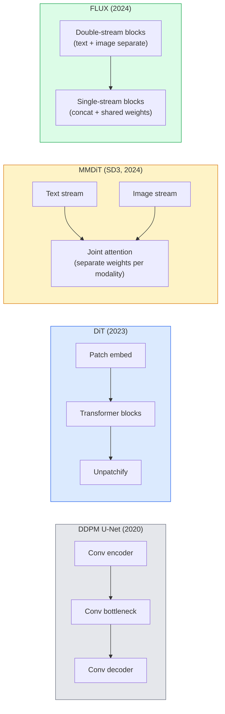

# Transformadores de difusión y flujo rectificado

> U-Net no es el secreto de la difusión. Si lo sustituye por un transformador, si cambia el horario de ruido a un flujo de ruta directa, de repente obtienes SD3 ̊FLUX, así como cada modelo de texto a imagen de 2026 ̊.

**类型：**学习 + 构建
**语言：**Python
**前置要求：**Fase 4 Lección 10 (DDPM de difusión), Fase 4 Lección 14 (ViT), Fase 7 Lección 02 (Autoatención)
**时间：**75 minutos

## El objetivo del aprendizaje

-  Seguimiento desde U-Net DDPM(Lección 10) hasta Transformador de Difusión (DiT) 、MMDiT (SD3), así como el desarrollo de DiT de un solo + doble flujo (FLUX)
-  Explicar el flujo rectificado: por qué el ruido y los datos   direct line trajectories pueden hacer que el modelo utiliza 20 pasos en lugar de 1000 pasos para completar la toma
-                                                                                                                                                                                                                                                                                                                                                                                                                                                                                                                              
-  según la arquitectura、parámetro cuenta 和 licencia 区分 modelo variantes(SD3、FLUX.1-dev、FLUX.1-schnell、Z-Image、Qwen-Image)

##  problemas

Lección 10 Con el denoizador U-Net  Construye un DDPM ⋅ Esta combinación se dirigió a 2020-2023 ⋅: U-Net + programa beta + pérdida de predicción de ruido ⋅ produce la difusión estable 1.5 ⋅ 2.1 y DALL-E 2 ⋅

Cada uno de los modelos de texto a imagen más avanzados del año 2026 ya lo ha superado. La difusión estable 3、FLUX、SD4、Z-Image、Qwen-Image、Hunyuan-Image no utiliza U-Net. Utilizan los Transformadores de difusión (DiT) ――SD3 y FLUX. También cambian el programa de ruido de DDPM en flujo rectificado, lo que llevará el camino del ruido a los datos directamente, y a través de la consistencia o variantes destiladas  soporte 1-4                                                                                                                                                                                                                                                                                                                                                                                          

Este cambio es importante, ya que es la generación de imágenes basada en difusión  变可控、快速-accurate SD3/SD4 解决文本染) y suficientemente rápido para entrar en producción .

## 核心概念 核心概念 核心概念 核心概念

### Desde la red hasta el transformador .



- **DiT**(Peebles & Xie, 2023) Con un Transformer similar a ViT  sustituir U-Net, en parches latentes 上运行── a través de la norma de capa adaptativa (AdaLN)  realizar el acondicionamiento──
- **MMDiT**(SD3, Esser et al., 2024) 为文本代币和图像代币 使用两个拥有独立权重的流,并共享一个共同关注――
- **FLUX**(Black Forest Labs, 2024) 前 N 个块 像 SD3 一样采用双流,后续块将代币连锁并共享重量(单流),以提高更深层结构的效率──
- **Z-Image**(2025)  un alto rendimiento de los parámetros 6B de la DiT de un solo flujo, desafió                                                                                                                                                                                                                                                 

### Usage of Rectified flow Usage of Rectified flow Usage of Rectified flow Usage of Rectified flow Usage of Rectified flow Usage of Rectified flow Usage of Rectified flow Usage of Rectified flow Usage of Rectified flow Usage of Rectified flow Usage of Rectified flow Usage of Rectified flow Usage of Rectified flow Usage of Rectified flow Usage of Rectified flow Usage of Rectified flow Usage of Rectified flow Usage of Rectified flow Usage of Rectified flow Usage of Rectified flow Usage of Rectified flow Usage of Rectified flow Usage of Rectified flow Usage of Rectified flow Usage of Rectified flow Usage of rectified flow Rectified flow Rectified flow Rectified flow Rectified flow Rectified flow Rectified flow Rectified flow Rectified flow Rectified flow Rectified flow Rectified flow Rectified flow Rectified flow Rectified flow Rectified flow Rectified flow Rectified flow Rectified flow Rectified flow Rectified flow Rectified flow Rectified flow Rectified flow Rectified flow Rectified flow Rectified flow Rectified flow Rectified flow Rectified flow Rectified flow Rectified flow Rectified flow Rectified flow Rectified flow Rectified flow Rectified flow Rectified flow Rectified flow Rectified flow Rectified flow Rectified flow Rectified flow Rectified flow Rectified flow Rectified flow Rectified flow Rectified flow Rectified flow Rectified flow Rectified flow Rectified flow Rectified flow Rectified flow Rectified flow Rectified flow Rectified flow Rectified flow Rectified flow Rectified flow Rectified flow Rectified flow Rectified flow Rectified flow Rectified flow Rectified flow Rectified flow Rectified flow Rectified flow Rectified flow Rectified flow Rectified flow Rectified flow Rectified flow Rectified

DDPM va a definir el proceso de avance como un SDE ruidoso, entre ellos`x_t`Se destruye paso a paso. El reverso del aprendizaje es el segundo SDE, que necesita 1000 pasos para resolver.

Flujo rectificado  definió entre datos limpios y ruido puro **直线**插值:

```
x_t = (1 - t) * x_0 + t * epsilon,     t in [0, 1]
```

Entrenando una red para predecir la velocidad`v_theta(x_t, t) = epsilon - x_0`也就是沿着从清洁数据到噪音的直线路径的前进方向(`dx_t/dt`En la actualidad, el volumen de datos de la ODE se acerca más a la línea recta, por lo que los pasos de integración necesarios para la adopción son mucho menores.

SD3 se llama**Rectified Flow Matching** FLUX、Z-Image 和 la mayoría del modelo 2026 años 使用相同的目标──典型推论:20-30 个 个 艾勒步骤(determinista),相比旧的DDPM 体系中的50+DDIM步骤──Destillada / turbo / schnell / LCM variantes puede reducirlo a 1-4 步──

### Condicionamiento de la AdaLN

Diets      **adaptive layer norm**En el paso del tiempo 和 clase/texto 上做 condicionamiento: desde el condicionamiento Vektor 中预测 `scale`Y `shift`, y luego las aplica en LayerNorm. Esto es más que la modulación estilo FiLM en U-Nets, es también la práctica estándar de cada moderno DiT.

```
cond -> MLP -> (scale, shift, gate)
norm(x) * (1 + scale) + shift, then residual add * gate
```

### Los codificadores de texto de SD3 y FLUX

- **SD3**Utiliza tres codificadores de texto: dos modelos CLIP + T5-XXL。 Embebedidos se concatenan 后作为文本调节 送入图像流──
- **FLUX**Utiliza un CLIP-L + T5-XXL
- **Qwen-Image / Z-Image**Las variantes utilizan LLM basados en codificadores de texto de desarrollo propio.

El codificador de texto es SD3/FLUX 之所以比SD1.5更能理解提示的重要原因──单独T5-XXL 就有4.7B参数──

### Orientación libre de clasificadores 仍然成立

El flujo rectificado  cambia es el muestreo, no el condicionamiento. Guía libre de clasificadores                                                                                                                                                                                                                                                                                                                                                                                                                                                                                                     

### Consistencia, Turbo, Schnell, LCM

Cuatro nombres indican la misma idea: poner un modelo de destilación de varios pasos a un modelo de pocos pasos a un ritmo rápido.

- **LCM (Latent Consistency Model)** entrenar a un estudiante, hacer que pueda de cualquier intermedio `x_t`Una fase de pronóstico final`x_0`¿Qué es eso?
- **SDXL Turbo / FLUX schnell** uso de destilación de difusión adversaria  entrenamiento de modelos de 1 a 4 pasos。
- **SD Turbo**将 OpenAI-style Modelos de Consistencia 适配到潜伏传播──

任何新型号的生产服务通常都会同时发布一个完整的质量检查点和一个turbo /快变异──Schnell((((((((((((((((((((((((((((((((((((((((((((((((((((((((((((((((((((((((((((((((((((((((((((((((((((((((((((((((((((((((((((((((((((((((((((((((((((((((((((((((((((((((((((((((((((((((((((((((((((((((((((((((((((((((((((((((((((((((((((((((((((((((((((((((((((((((((((((((((((((((((((((((((((((((((((((((((((((((((((((((((((((((((((((((((((((((((((((((((((((((((((((((((((((((((((((((((((((((((((((((((((((((((((((((((((((((((((((((((((((((((((((((((((((((((((((((((((((((((

### Paisaje modelo de 2026

| Model | Size | Architecture | License |
|-------|------|--------------|---------|
| Stable Diffusion 3 Medium | 2B | MMDiT | SAI Community |
| Stable Diffusion 3.5 Large | 8B | MMDiT | SAI Community |
| FLUX.1-dev | 12B | Double + Single Stream DiT | non-commercial |
| FLUX.1-schnell | 12B | same, distilled | Apache 2.0 |
| FLUX.2 | — | iterated FLUX.1 | mixed |
| Z-Image | 6B | S3-DiT (Scalable Single-Stream) | permissive |
| Qwen-Image | ~20B | DiT + Qwen text tower | Apache 2.0 |
| Hunyuan-Image-3.0 | ~80B | DiT | research |
| SD4 Turbo | 3B | DiT + distillation | SAI Commercial |

FLUX.1-schnell es el modelo de código abierto de 2026 años 默认选择──Z-Image es el líder en eficiencia──FLUX.2 和 SD4 es el modelo más dependiente de calidad actual──

### ¿Por qué esta etapa de transformación es importante?

DDPM + U-Net 能工作──DiT + flujo rectificado 工作得**更好、更快，并且扩展得更干净** Este cambio es similar al de la PNL en el transcurso de RNNs a transformadores: dos arquitecturas  solucionan el mismo problema, pero los transformadores pueden ampliar y ahora ocupan un lugar dominante  Cada uno de los artículos de 2026 sobre la generación de imágenes, videos o 3D utilizan un denoizador en forma de DiT, y usualmente utilizan objetivos de flujo rectificado  U-Net DDPM ahora se utiliza principalmente para enseñar  Lección 10.。


```figure
cv3-rectified-flow
```

## Construirlo

### Paso 1: con el bloqueo de DiT de AdaLN

```python
import torch
import torch.nn as nn


class AdaLNZero(nn.Module):
    """
    Adaptive LayerNorm with a gate. Predicts (scale, shift, gate) from the conditioning.
    Init such that the whole block starts as identity ("zero init").
    """

    def __init__(self, dim, cond_dim):
        super().__init__()
        self.norm = nn.LayerNorm(dim, elementwise_affine=False)
        self.mlp = nn.Linear(cond_dim, dim * 3)
        nn.init.zeros_(self.mlp.weight)
        nn.init.zeros_(self.mlp.bias)

    def forward(self, x, cond):
        scale, shift, gate = self.mlp(cond).chunk(3, dim=-1)
        h = self.norm(x) * (1 + scale.unsqueeze(1)) + shift.unsqueeze(1)
        return h, gate.unsqueeze(1)


class DiTBlock(nn.Module):
    def __init__(self, dim=192, heads=3, mlp_ratio=4, cond_dim=192):
        super().__init__()
        self.adaln1 = AdaLNZero(dim, cond_dim)
        self.attn = nn.MultiheadAttention(dim, heads, batch_first=True)
        self.adaln2 = AdaLNZero(dim, cond_dim)
        self.mlp = nn.Sequential(
            nn.Linear(dim, dim * mlp_ratio),
            nn.GELU(),
            nn.Linear(dim * mlp_ratio, dim),
        )

    def forward(self, x, cond):
        h, gate1 = self.adaln1(x, cond)
        a, _ = self.attn(h, h, h, need_weights=False)
        x = x + gate1 * a
        h, gate2 = self.adaln2(x, cond)
        x = x + gate2 * self.mlp(h)
        return x
```

`AdaLNZero`Una inicia es un mapeo de identidad, ya que sus pesos MLP se inicializan en zero.

### Paso 2: Una pequeña dieta

```python
def timestep_embedding(t, dim):
    import math
    half = dim // 2
    freqs = torch.exp(-math.log(10000) * torch.arange(half, device=t.device) / half)
    args = t[:, None].float() * freqs[None]
    return torch.cat([args.sin(), args.cos()], dim=-1)


class TinyDiT(nn.Module):
    def __init__(self, image_size=16, patch_size=2, in_channels=3, dim=96, depth=4, heads=3):
        super().__init__()
        self.patch_size = patch_size
        self.num_patches = (image_size // patch_size) ** 2
        self.patch = nn.Conv2d(in_channels, dim, kernel_size=patch_size, stride=patch_size)
        self.pos = nn.Parameter(torch.zeros(1, self.num_patches, dim))
        self.time_mlp = nn.Sequential(
            nn.Linear(dim, dim * 2),
            nn.SiLU(),
            nn.Linear(dim * 2, dim),
        )
        self.blocks = nn.ModuleList([DiTBlock(dim, heads, cond_dim=dim) for _ in range(depth)])
        self.norm_out = nn.LayerNorm(dim, elementwise_affine=False)
        self.head = nn.Linear(dim, patch_size * patch_size * in_channels)

    def forward(self, x, t):
        n = x.size(0)
        x = self.patch(x)
        x = x.flatten(2).transpose(1, 2) + self.pos
        t_emb = self.time_mlp(timestep_embedding(t, self.pos.size(-1)))
        for blk in self.blocks:
            x = blk(x, t_emb)
        x = self.norm_out(x)
        x = self.head(x)
        return self._unpatchify(x, n)

    def _unpatchify(self, x, n):
        p = self.patch_size
        h = w = int(self.num_patches ** 0.5)
        x = x.view(n, h, w, p, p, -1).permute(0, 5, 1, 3, 2, 4).reshape(n, -1, h * p, w * p)
        return x
```

### 步骤 3: Formación de flujo rectificada

```python
import torch.nn.functional as F

def rectified_flow_train_step(model, x0, optimizer, device):
    model.train()
    x0 = x0.to(device)
    n = x0.size(0)
    t = torch.rand(n, device=device)
    epsilon = torch.randn_like(x0)
    x_t = (1 - t[:, None, None, None]) * x0 + t[:, None, None, None] * epsilon

    target_velocity = epsilon - x0
    pred_velocity = model(x_t, t)

    loss = F.mse_loss(pred_velocity, target_velocity)
    optimizer.zero_grad()
    loss.backward()
    optimizer.step()
    return loss.item()
```

La pérdida de predicción del ruido de DDPM (LECCIÓN 10)`epsilon`, sino que prevé**velocity** `epsilon - x_0`, se ejecuta en dirección directa desde los datos hacia el ruido.

### 步骤 4: Muestra de Euler

El flujo rectificado es un ODE. El método de Euler es el método más simple, y para un buen modelo de flujo rectificado, practicamente es exactamente lo mismo en 20 pasos y más con los solventes de orden superior.

```python
@torch.no_grad()
def rectified_flow_sample(model, shape, steps=20, device="cpu"):
    model.eval()
    x = torch.randn(shape, device=device)
    dt = 1.0 / steps
    t = torch.ones(shape[0], device=device)
    for _ in range(steps):
        v = model(x, t)
        x = x - dt * v
        t = t - dt
    return x
```

20 pasos. En un modelo de entrenamiento bueno, esto producirá muestras comparables con el DDPM de 1000 pasos.

### Paso 5: Prueba de humo de extremo a extremo

```python
import numpy as np

def synthetic_blobs(num=200, size=16, seed=0):
    rng = np.random.default_rng(seed)
    out = np.zeros((num, 3, size, size), dtype=np.float32)
    yy, xx = np.meshgrid(np.arange(size), np.arange(size), indexing="ij")
    for i in range(num):
        cx, cy = rng.uniform(4, size - 4, size=2)
        r = rng.uniform(2, 4)
        mask = (xx - cx) ** 2 + (yy - cy) ** 2 < r ** 2
        colour = rng.uniform(-1, 1, size=3)
        for c in range(3):
            out[i, c][mask] = colour[c]
    return torch.from_numpy(out)
```

Usando flujo rectificado en este conjunto de datos entrenar uno `TinyDiT`Después de 500 pasos, las salidas muestran que deben parecer manchas de color.

## Usalo

对于使用FLUX / SD3 / Z-Image 的真实图像生成,`diffusers`Para cada modelo  proporcionar una API:

```python
from diffusers import FluxPipeline, StableDiffusion3Pipeline
import torch

pipe = FluxPipeline.from_pretrained(
    "black-forest-labs/FLUX.1-schnell",
    torch_dtype=torch.bfloat16,
).to("cuda")

out = pipe(
    prompt="a golden retriever surfing a tsunami, hyperrealistic, studio lighting",
    guidance_scale=0.0,           # schnell was trained without CFG
    num_inference_steps=4,
    max_sequence_length=256,
).images[0]
out.save("surf.png")
```

Tres pasos.`FLUX.1-schnell`Cuatro pasos completados.`black-forest-labs/FLUX.1-dev`Se puede realizar con el CFG en 20-30 pasos para obtener una calidad superior.

 Para SD3:

```python
pipe = StableDiffusion3Pipeline.from_pretrained(
    "stabilityai/stable-diffusion-3.5-large",
    torch_dtype=torch.bfloat16,
).to("cuda")
out = pipe(prompt, guidance_scale=3.5, num_inference_steps=28).images[0]
```

##  entregarlo

Encuentro de trabajo:

- `outputs/prompt-dit-model-picker.md` en given determin质量、延迟和许可 约束时, en SD3、FLUX.1-dev、FLUX.1-schnell、Z-Image、SD4 Turbo 之间做做选择──
- `outputs/skill-rectified-flow-trainer.md` redactar un completo ciclo de entrenamiento de flujo rectificado, que incluya muestreo de AdaLN DiT y Euler。

##  ejercicios

1. **（简单）**En el conjunto de datos de blob sintético, las muestras producidas por el TinyDiT 500 pasos se comparan con los pasos de 10、20 y 50 de Euler.
2. **（中等）**通过把一个学会类嵌入 拼接到时间嵌上,加入文本调节(按颜色划分的 10 个斑点 类) △分别用类 0、5 和 9 采样,并验证颜色匹配──
3. **（困难）**计算在同样大小的网络、同样数据、同样训练步数下, rectified-flow y DDPM 版本生成样本 之间的 Fréchet distance (FID proxy) ⋅报告哪一个收更快──

## 关键术语: "El hombre es un hombre"

| Term | 人们常说 | 实际含义 |
|------|----------------|----------------------|
| DiT | “Diffusion transformer” | 替代 U-Net 作为 diffusion denoiser 的 Transformer；在 patchified latents 上运行 |
| AdaLN | “Adaptive layer norm” | 通过学习到的 scale、shift、gate 进行 timestep/text conditioning，并在 LayerNorm 之后应用；每个现代 DiT 的标准做法 |
| MMDiT | “Multi-modal DiT (SD3)” | 为 text tokens 和 image tokens 使用独立 weight streams，并共享一个 joint self-attention |
| Single-stream / double-stream | “FLUX trick” | 前 N 个 blocks 为 double-stream（每种 modality 使用独立 weights），后续 blocks 为 single-stream（concat + shared weights），以提升效率 |
| Rectified flow | “Straight-line noise-to-data” | data 与 noise 之间的线性插值；网络预测 velocity；inference 所需 ODE steps 更少 |
| Velocity target | “epsilon - x_0” | rectified flow 中的 Regression target；从 clean data 指向 noise |
| CFG guidance | “classifier-free guidance” | 混合 conditional 与 unconditional predictions；rectified-flow models 中仍然使用 |
| Schnell / turbo / LCM | “1-4 step distillation” | 从 full-quality models distill 得到的小步数 variants；用于生产实时场景 |

## 延伸阅读

- [Scalable Diffusion Models with Transformers (Peebles & Xie, 2023)](https://arxiv.org/abs/2212.09748)DiT 论文
- [Scaling Rectified Flow Transformers (Esser et al., SD3 paper)](https://arxiv.org/abs/2403.03206) MMDiT de gran tamaño y flujo rectificado
- [FLUX.1 model card and technical report (Black Forest Labs)](https://huggingface.co/black-forest-labs/FLUX.1-dev)doble + de un solo flujo 细节
- [Z-Image: Efficient Image Generation Foundation Model (2025)](https://arxiv.org/html/2511.22699v1)6B DiT de corriente única
- [Elucidating the Design Space of Diffusion (Karras et al., 2022)](https://arxiv.org/abs/2206.00364) Referencia de cada difusión  diseño de compensación
- [Latent Consistency Models (Luo et al., 2023)](https://arxiv.org/abs/2310.04378)LCM-LoRA  Cómo lograr la inferencia en 4 pasos
