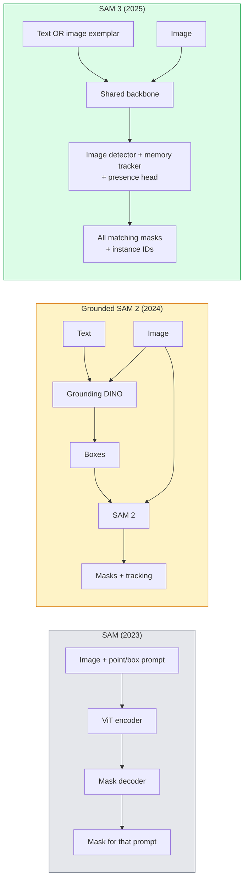

# SAM 3 y segmentación de vocabulario abierto

> 给模型一个文本提示和一张图像,即可获得每个匹配的对象的面具──SAM 3 让它变成一个单独的前进通──

**类型：**Uso + 构建
**语言：**Python
**先修要求：**Fase 4 Lección 07 (U-Net), Fase 4 Lección 08 (Máscara R-CNN), Fase 4 Lección 18 (CLIP)
**时间：**- 60 minutos

## El objetivo del aprendizaje

- 区分 SAM(sólo las instrucciones visuales) 、Mundo SAM / SAM 2(detector + SAM) y SAM 3(a través de Segmentación de concepto de la Promptable 原生支持文本提示)
- 解释 SAM 3 架构:comparted backbone + detector de imágenes + tracker de vídeo basado en memoria + cabeza de presencia + diseño de detector-tracker desconectado
- Uso de cara abrazada`transformers`de SAM 3 集成 realizar detección de texto, segmentación y seguimiento de vídeo
- ∆ De acuerdo con la latencia ∆ concepto de complejidad y objetivo de despliegue, entre SAM 3 ∆ Grounded SAM 2 ∆ YOLO-World y SAM-MI ∆ hacer la elección

##  problemas

SAM de 2023 es un modelo que sólo apoya el instante visual: si haces clic en un punto o dibujas una caja, regresa a una máscara. Para encontrar todo lo que hay en esta foto, necesitas un detector.

SAM 3(Meta,2025年11月,ICLR 2026) comprimió este nivel. Acoge una breve palabra en inglés短语或一个图像示范 作为提示, y una vez adelante pasa en regreso a todas las máscaras y ID de la instancia.**Promptable Concept Segmentation (PCS)**◊结合 2026 年 3 月的 Object Multiplex 更新(SAM 3.1), puede ser altamente eficaz en el video para seguir el mismo concepto en varias instancias。

Este curso se centra en el cambio estructural que representa. La segmentación 2D, la detección y la base de imágenes de texto ya se han combinado en un modelo. La cuestión de producción ya no es qué tuberías debo juntar, sino qué modelo rápido puede tratar mi caso de uso.

## 概念

### 3 años



### Segmentación de conceptos

concept prompt 是一个简短的名词短语(`"yellow school bus"`¿Qué es esto?`"striped red umbrella"`¿Qué es esto?`"hand holding a mug"`) o un ejemplar de imagen―, el modelo se retorna a la imagen para cada instancia del concepto que se ajusta a la misma , y para cada proyecto de correspondencia se retorna a la ID única del concepto .

Esto es diferente al SAM visual clásico.

1. No necesita un ejemplo por ejemplo  provide prompt: un prompt de texto  return all matches.
2. Vocabulario abierto: concepto puede ser cualquier contenido que pueda describirse en lenguaje natural.
3. Una vez regreso varias instancias, en lugar de cada instancia regreso una máscara.

### 关键架构组件 关键架构组件

- **Shared backbone**Un visor de imagen y un rastreador basado en memoria.
- **Presence head**El concepto de previsión ¿existe en la imagen o no? ¿existe aquí?
- **Decoupled detector-tracker**: detección a nivel de imagen y seguimiento a nivel de video Utiliza cabezas independientes, evitar interferencias entre sí
- **Memory bank**: transframe  almacenamiento de cada instancia de características, para el seguimiento de vídeo(con SAM 2 el mismo mecanismo de uso)

### Entrenamiento a gran escala

SAM 3 en **400 万个 unique concepts**上训练, estos conceptos fueron desarrollados por un motor de datos, que se modificó a través de AI + Auditoría de la gente.**SA-CO benchmark**Contiene 270K conceptos únicos, con 50 veces más de los valores de referencia anteriores.

### SAM 3.1 Objeto múltiple

2026 年 3 月更新:**Object Multiplex** Introducido un mecanismo de memoria compartida, utilizado para simultáneamente seguir múltiples instancias del mismo concepto.                                                                                                                                                                                                                                                   

### 2026 años SAM por tierra  sigue siendo un escenario importante

- Cuando necesites reemplazar un detector de vocabulario abierto específico
- Cuando la licencia SAM 3 se ha cerrado, se ha vuelto un obstáculo.
- Cuando necesites más control del umbral del detector que el SAM 3 ≈
- Utilizado en el trabajo de investigación / ablación del componente detector.

Los oleoductos modulares  siguen teniendo valor  para la mayoría de los trabajos de producción, el SAM 3 es la respuesta más simple

### YOLO-World vs SAM 3

- **YOLO-World**Solo detector de vocabulario abierto (no máscaras)
- **SAM 3**: segmentación completa + seguimiento。更慢, pero输出更丰富。

Productos de la industria de la información y la información (en inglés, "Radioactive Information Systems")

### 效率 SAM-MI

SAM-MI(2025-2026) resolver el cuello de botella del decodificador SAM──

- **Sparse point prompting**: utilizar menor cantidad de puntos de selección, en lugar de pedidos densos;
- **Shallow mask aggregation**Las predicciones de la máscara se convierten en una más clara.
- **Decoupled mask injection**:decoder 接收预计算的面具功能, en lugar de volver a implementar.

Resultado: en los puntos de referencia de vocabulario abierto, la velocidad de la base de SAM es de aproximadamente 1,6×.

### Tres modelos de formato de salida

它们 todas vuelven a la misma estructura general(cajas + etiquetas + puntuaciones + máscaras + ID), esto es muy útil: tu down游 pipeline no necesita depender de qué modelo está funcionando para dividirse.


```figure
cv3-open-vocab
```

## Construcción

### Paso 1: Construcción rápida

 Construir un ayudante,将用户句子转换为 SAM 3 concept prompts 列表──这是用户输入的内容和模型消费的内容之间的边界──

```python
def split_concepts(sentence):
    """
    Heuristic splitter for multi-concept prompts.
    Returns list of short noun phrases.
    """
    for sep in [",", ";", "and", "or", "&"]:
        if sep in sentence:
            parts = [p.strip() for p in sentence.replace("and ", ",").split(",")]
            return [p for p in parts if p]
    return [sentence.strip()]

print(split_concepts("cats, dogs and balloons"))
```

SAM 3 Cada paso adelante  acepta un concepto; para las consultas de múltiples conceptos, ciclo o lote de tratamiento de ellos 

### 步骤 2:Ajudantes de postprocesamiento

Conforme el contrato de tubería de la Lección 16 de la Fase 4, las salidas de SAM 3 se convertirán en pruebas de detección de limpieza.

```python
from dataclasses import dataclass
from typing import List

@dataclass
class ConceptDetection:
    concept: str
    instance_id: int
    box: tuple          # (x1, y1, x2, y2)
    score: float
    mask_rle: str       # run-length encoded


def rle_encode(binary_mask):
    flat = binary_mask.flatten().astype("uint8")
    runs = []
    prev, count = flat[0], 0
    for v in flat:
        if v == prev:
            count += 1
        else:
            runs.append((int(prev), count))
            prev, count = v, 1
    runs.append((int(prev), count))
    return ";".join(f"{v}x{c}" for v, c in runs)
```

Incluso si hay muchas máscaras de alta resolución, RLE también puede hacer que las cargas de respuesta sean más pequeñas.

### Paso 3: Interfaz de segmentación de vocabulario abierto

Cuando el backend cambia, el código de abajo no necesita cambiar.

```python
from abc import ABC, abstractmethod
import numpy as np

class OpenVocabSeg(ABC):
    @abstractmethod
    def detect(self, image: np.ndarray, concept: str) -> List[ConceptDetection]:
        ...


class StubOpenVocabSeg(OpenVocabSeg):
    """
    Deterministic stub used for pipeline testing when real models are not loaded.
    """
    def detect(self, image, concept):
        h, w = image.shape[:2]
        return [
            ConceptDetection(
                concept=concept,
                instance_id=0,
                box=(w * 0.2, h * 0.3, w * 0.5, h * 0.8),
                score=0.89,
                mask_rle="0x100;1x50;0x200",
            ),
            ConceptDetection(
                concept=concept,
                instance_id=1,
                box=(w * 0.55, h * 0.25, w * 0.85, h * 0.75),
                score=0.74,
                mask_rle="0x80;1x40;0x220",
            ),
        ]
```

Es verdadero.`SAM3OpenVocabSeg`Subclase 会封装 `transformers.Sam3Model`Y `Sam3Processor`¿Qué es eso?

### 步骤 4: Acogida de la cara SAM 3 用法(referencia)

                                                                                                                                                                                                                                                                                                                                                                                                                                                                                                                             `transformers`集成:

```python
from transformers import Sam3Processor, Sam3Model
import torch

processor = Sam3Processor.from_pretrained("facebook/sam3")
model = Sam3Model.from_pretrained("facebook/sam3").eval()

inputs = processor(images=pil_image, return_tensors="pt")
inputs = processor.set_text_prompt(inputs, "yellow school bus")

with torch.no_grad():
    outputs = model(**inputs)

masks = processor.post_process_masks(
    outputs.masks, inputs.original_sizes, inputs.reshaped_input_sizes
)
boxes = outputs.boxes
scores = outputs.scores
```

Una llamada, una llamada de vuelta a todos los ajustes.

### Paso 5: Medir SAM 2  gratis ofrece qué

Un punto de referencia honesto: ¿Qué pasará en la tubería real en el SAM 3 para reemplazar al SAM 2?

- Latencia:SAM 3 省掉一次前传 (no hay detector independiente), pero el modelo en sí mismo es más pesado; normalmente el sistema tiene un tamaño plano o un poco de velocidad.
- Accurate:SAM 3 en conceptos raros o de composición`"striped red umbrella"`) en los conceptos de palabras más frecuentes.
- Flexibilidad: SAM 2 en tierra permite que se sustituyan los detectores ((DINO-X、Florencia-2、DINO 1.5 en tierra); SAM 3 es monolitico。

结论:SAM 3 es una opción de tipo de segmento de vocabulario abierto de 2026 años. Cuando necesites flexibilidad de detector o diferentes términos de licencia, SAM 2 sigue siendo la respuesta correcta.

## Uso

El modelo de producción:

- **Real-time annotation**:SAM 3 + CVAT de etiqueta-como-texto-prompto función。标注员选择一个标签名;SAM 3 预标注每个匹配的实例──再进行审核和修──
- **Video analytics**:SAM 3.1 Object Multiplex Usado para el seguimiento de múltiples objetos;将 frames 输入 memoria-based tracker。
- **Robotics**:SAM 3 Used for open-vocaba manipulation (Pic up the red cup) como planificación primitiva (运行)
- **Medical imaging**En el caso de los sistemas de salud, el uso de la información médica es un problema de salud.

Ultralítica en su paquete Python envuelto SAM 3:

```python
from ultralytics import SAM

model = SAM("sam3.pt")
results = model(image_path, prompts="yellow school bus")
```

Con YOLO y SAM 2 utiliza la misma interfaz.

## 交付

Encuentro de trabajo:

- `outputs/prompt-open-vocab-stack-picker.md`Una en función de la latencia, la complejidad del concepto y la licencia  seleccionar SAM 3 / SAM 2 / YOLO-World / SAM-MI 
- `outputs/skill-concept-prompt-designer.md`Una persona puede tener una experiencia en el uso de un software de software de software de usuario.

##  ejercicios

1. **（Easy）**En 10 imágenes, se ejecuta SAM 3, y se utilizan los conceptos de su propia elección.
2. **（Medium）**En SAM 3 之之上构建一个 点击-to-incluir / click-to-excluded UI:text prompt 返回候选实例; usuario点击保留哪些算作 positive──将最终概念集合 输出为 JSON──
3. **（Hard）**En el conjunto de conceptos de auto-definición (por ejemplo, 5 componentes electrónicos) se ajusta a la medida de SAM 3, cada uno de los 20 张 de imágenes etiquetadas.

## 关键术语: "El hombre es un hombre"

| Term | 人们通常怎么说 | 实际含义 |
|------|----------------|----------------------|
| Open-vocabulary segmentation | “Segment by text” | 为自然语言描述的 objects 生成 masks，而不是使用固定 label set |
| PCS | “Promptable Concept Segmentation” | SAM 3 的核心任务：给定一个 noun-phrase 或 image exemplar，segment 所有匹配 instances |
| Concept prompt | “The text input” | 简短名词短语或 image exemplar；不是完整句子 |
| Presence head | “Is it here?” | SAM 3 中的模块，用于在 localisation 之前判断 concept 是否存在于 image 中 |
| SA-CO | “SAM 3 benchmark” | 包含 270K concepts 的 open-vocabulary segmentation benchmark；比以往 open-vocab benchmarks 大 50 倍 |
| Object Multiplex | “SAM 3.1 update” | Shared-memory multi-object tracking；快速联合跟踪多个 instances |
| Grounded SAM 2 | “Modular pipeline” | Detector + SAM 2 级联；当 detector 替换很重要时仍然相关 |
| SAM-MI | “Efficient SAM variant” | Mask Injection，相比 Grounded-SAM 实现 1.6x speedup |

## 延伸阅读

- [SAM 3: Segment Anything with Concepts (arXiv 2511.16719)](https://arxiv.org/abs/2511.16719)
- [SAM 3.1 Object Multiplex (Meta AI, March 2026)](https://ai.meta.com/blog/segment-anything-model-3/)
- [SAM 3 model page on Hugging Face](https://huggingface.co/facebook/sam3)
- [Grounded SAM 2 tutorial (PyImageSearch)](https://pyimagesearch.com/2026/01/19/grounded-sam-2-from-open-set-detection-to-segmentation-and-tracking/)
- [Ultralytics SAM 3 docs](https://docs.ultralytics.com/models/sam-3/)
- [SAM3-I: Instruction-aware SAM (arXiv 2512.04585)](https://arxiv.org/abs/2512.04585)
