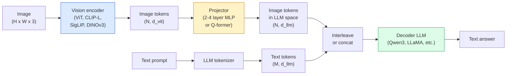

# Modelos de lenguaje de visión  ViT-MLP-LLM 模式

> El codificador de visión transformará imágenes en tokens. El proyector MLP transformará estos tokens en el espacio de incorporación del LLM. El modelo de lenguaje completará el resto del trabajo. Este modelo es la estructura común de todos los niveles de producción de VLM.

**类型：**学习 + 使用
**语言：**Python
**前置要求：**Fase 4 Lección 14 (ViT), Fase 4 Lección 18 (CLIP), Fase 7 Lección 02 (Autoatención)
**时间：**~ 75 minutos

## El objetivo del aprendizaje

- Explicar qué contribuyen los tres componentes
- Desde el parametro, longitud de contexto y rendimiento de referencia  ángulo comparado Qwen3-VL、InternVL3.5、LLaVA-Next y GLM-4.6V
- Explicar DeepStack: ¿Por qué las características de ViT de varios niveles son más estrechas que las características de la última capa de visión
- En el entorno de producción, la tasa de error transmodal (CMER) se utiliza para medir la alucinación de VLM, y se basa en esta señal para tomar medidas.

##  problemas

CLIP (Fase 4 Lección 18) para imágenes y texto proporcionar espacio de incorporación compartido, esto es suficiente para apoyar la clasificación y recuperación de disparos cero.

Modelos de lenguaje de visión (VLMs)  Qwen3-VL、InternVL3.5、LLaVA-Next、GLM-4.6V  Clíp-familia de imágenes codificador 接到一个完整语言模型 上。模型看到一张图像加一个问题,然后生成答案──到2026年, open source VLMs en benchmarks multimodal (MMMU, MMBench, DocVQA, ChartQA, MathVista, OSWorld) 上已经可以比肩甚至超过 GPT-5 和 Gemini-2.5-Pro──

Este grupo de tres componentes (ViT, Proyector, LLM) es el estándar de estructura. La diferencia entre los modelos consiste en el uso de qué ViT, qué proyector, qué LLM, datos de entrenamiento y la receta de alineación. Una vez que se entiende este modelo, reemplazar cualquier componente es un trabajo mecánico.

## 概念

### ViT-MLP-LLM 架构



1. **Vision encoder** 预训练 ViT(CLIP-L/14、SigLIP、DINOv3, o variante afinada)
2. **Projector** 一个小模块(2-4 层 MLP, o Q-former),将视觉代币映射到LLM的嵌入维度──la mayoría de los ajustes precisos 发生在这里──
3. **LLM** modelo de lenguaje solo para decodificadores(Qwen3、Llama、Mistral、GLM、InternLM) ――按序读取 visión + tokens de texto,并生成文本。

En la práctica, el codificador de visión y el LLM se mantienen congelados, sólo entrenan el proyector, de modo que pueden asumir con bajo costo de miles de millones de parámetros de escala de señales.

### Profundidad

La proyección normal sólo utiliza la última capa de ViT. DeepStack (Qwen3-VL) se basará en varias características de toma de profundidad de ViT.

### Tres fases de entrenamiento

现代 VLMs 分阶段训练:

1. **Alignment** congelar ViT 和 LLM── sólo en pares de captura de imágenes 上训练投影仪──教会投影仪 将视觉空间 映射到语言空间──
2. **Pre-training** 解所有部分──大规模交错图像文本数据(500M+ pares) 上训练──构建模型的视觉知识──
3. **Instruction tuning** 在精选的(图像, pregunta, respuesta) 三元组上细调──教会对话行为 和任务格式──这一步把视觉意识的LM变成可用助手──

La mayoría de los ajustes de LoRA se realizarán con un conjunto de datos de etiquetas de pequeña escala para la tercera etapa.

### 模型家族比较(2026 年初)

| Model | Params | Vision encoder | LLM | Context | Strengths |
|-------|--------|----------------|-----|---------|-----------|
| Qwen3-VL-235B-A22B (MoE) | 235B (22B active) | custom ViT + DeepStack | Qwen3 | 256K | 综合 SOTA，GUI agent |
| Qwen3-VL-30B-A3B (MoE) | 30B (3B active) | custom ViT + DeepStack | Qwen3 | 256K | 更小的 MoE 替代方案 |
| Qwen3-VL-8B (dense) | 8B | custom ViT | Qwen3 | 128K | 生产环境 dense 默认选择 |
| InternVL3.5-38B | 38B | InternViT-6B | Qwen3 + GPT-OSS | 128K | MMBench / MMVet 表现强 |
| InternVL3.5-241B-A28B | 241B (28B active) | InternViT-6B | Qwen3 | 128K | 可与 GPT-4o 竞争 |
| LLaVA-Next 72B | 72B | SigLIP | Llama-3 | 32K | 开放，易于 fine-tune |
| GLM-4.6V | ~70B | custom | GLM | 64K | Open-source，OCR 强 |
| MiniCPM-V-2.6 | 8B | SigLIP | MiniCPM | 32K | 适合边缘部署 |

### Agentes visuales

Qwen3-VL-235B en OSWorld arriba alcanza el máximo rendimiento global, OSWorld está en la dirección**visual agents**El modelo de evaluación de la GUI operable (tabletable, mobile, web) se utiliza para evaluar las acciones de la pantalla, entender la UI, y salir de la acción (click, type, scroll) ∙ Después de combinar las herramientas, puede cerrarse para completar las tareas de la mesa.

### Agente  capacidad + RoPE 变体

Los VLM necesitan saber que algo en el video está sucediendo.**什么时候**△Qwen3-VL desde T-RoPE (impregnados de posición rotativa temporal)**基于文本的时间 alignment**,也就是将显式时刻文字代币与视频框架交错――模型看`<timestamp 00:32>`Cuadro, rápido, podemos pensar en el tiempo.

### Alineación 问题

El 12% de los datos de crawling contienen pares de imágenes y texto que no están completamente descritos por la imagen.

Skywork.ai  Introducido **Cross-Modal Error Rate (CMER)**Para seguirlo:

```
CMER = fraction of outputs where the text confidence is high but the image-text similarity (via a CLIP-family checker) is low
```

El alto CMER significa que el modelo está diciendo con confianza que no está siendo apoyado por imágenes. La vigilancia del CMER, y considerándolo como un KPI de producción, en su implementación, reducirá la tasa de alucinación en torno al 35%.

### Utiliza LoRA / QLoRA  realizar ajustes finos

Para 70B VLM hacer el ajuste completo 超pasar el alcance de la capacidad de la mayoría de los equipos  en capas de atención + proyector  utilizar LoRA  rango 16-64), o utilizar QLoRA de 4 bits de peso base, puede ser instalado en un solo张 A100 / H100  costo: 5.000-50.000 个样本,$100-$5.000   cálculos costos,2-10 horas de entrenamiento tiempo.

### Razonamiento espacial  todavía薄弱

Cuando se utiliza VLMs en los puntos de referencia de razonamiento espacial ((abreviado-abajo, izquierda-derecha, contabilidad, distancia) en la puntuación es de 50-60%. Si su caso de uso depende de qué objeto está en otro objeto, se necesita una gran cantidad de pruebas, el rendimiento de VLM genérico es inferior al humano. Para las tareas de espacio puro, un mejor alternativo que VLM incluye: un punto clave especial / estimador de posición, modelo de profundidad o modelo de detección, además de geometría de caja  posterior tratamiento.


```figure
v4-vlm-projector
```

## Construirlo

### Paso 1: Proyector

Es la parte de tu entrenamiento más habitual.

```python
import torch
import torch.nn as nn


class Projector(nn.Module):
    def __init__(self, vit_dim=768, llm_dim=4096, hidden=4096):
        super().__init__()
        self.net = nn.Sequential(
            nn.Linear(vit_dim, hidden),
            nn.GELU(),
            nn.Linear(hidden, llm_dim),
        )

    def forward(self, x):
        return self.net(x)
```

输入 es una `(N_patches, d_vit)`Tensor simbólico.`(N_patches, d_llm)`❖LLM se convertirá en otro token.

### Paso 2: 端到端组装 ViT-MLP-LLM

En el siguiente es el paso del VLM hacia adelante 骨架──真实代码会使用 `transformers`Aquí se muestra el concepto de la estructura.

```python
class MinimalVLM(nn.Module):
    def __init__(self, vit, projector, llm, image_token_id):
        super().__init__()
        self.vit = vit
        self.projector = projector
        self.llm = llm
        self.image_token_id = image_token_id  # placeholder token in text prompt

    def forward(self, image, input_ids, attention_mask):
        # 1. vision features
        vision_tokens = self.vit(image)                     # (B, N_patches, d_vit)
        vision_embeds = self.projector(vision_tokens)       # (B, N_patches, d_llm)

        # 2. text embeddings
        text_embeds = self.llm.get_input_embeddings()(input_ids)  # (B, M, d_llm)

        # 3. replace image placeholder tokens with vision embeds
        merged = self._merge(text_embeds, vision_embeds, input_ids)

        # 4. run LLM
        return self.llm(inputs_embeds=merged, attention_mask=attention_mask)

    def _merge(self, text_embeds, vision_embeds, input_ids):
        out = text_embeds.clone()
        expected = vision_embeds.size(1)
        for b in range(input_ids.size(0)):
            positions = (input_ids[b] == self.image_token_id).nonzero(as_tuple=True)[0]
            if len(positions) != expected:
                raise ValueError(
                    f"batch item {b} has {len(positions)} image tokens but vision_embeds has {expected} patches."
                    " Every sample in the batch must be pre-padded to the same number of image placeholder tokens.")
            out[b, positions] = vision_embeds[b]
        return out
```

文本中   en el libro`<image>`Los tokens de poseedor de lugar serán reemplazados por embebedidos de imagen reales, LLaVA、Qwen-VL y InternVL de uso son todos los mismos modelos。

### Paso 3: CMER  calcular

Una pequeña cantidad de cargas en el coche.

```python
import torch.nn.functional as F


def cross_modal_error_rate(image_emb, text_emb, text_confidence, sim_threshold=0.25, conf_threshold=0.8):
    """
    image_emb, text_emb: embeddings of image and generated text (normalised internally)
    text_confidence:     mean per-token probability in [0, 1]
    Returns:             fraction of high-confidence outputs with low image-text alignment
    """
    image_emb = F.normalize(image_emb, dim=-1)
    text_emb = F.normalize(text_emb, dim=-1)
    sim = (image_emb * text_emb).sum(dim=-1)        # cosine similarity
    high_conf_low_sim = (text_confidence > conf_threshold) & (sim < sim_threshold)
    return high_conf_low_sim.float().mean().item()
```

C.M.E.R.                                                                                                                                                                                                                                                           

### 步骤 4: clasificador de juguete VLM (VLM)

演示投影机是可以训练的──伪造的ViT características输入; un pequeño token de estilo LLM 预测类别──

```python
class ToyVLM(nn.Module):
    def __init__(self, vit_dim=32, llm_dim=64, num_classes=5):
        super().__init__()
        self.projector = Projector(vit_dim, llm_dim, hidden=64)
        self.head = nn.Linear(llm_dim, num_classes)

    def forward(self, vision_tokens):
        projected = self.projector(vision_tokens)
        pooled = projected.mean(dim=1)
        return self.head(pooled)
```

Puedes usar en pares sintéticos de características, clases, y no hasta 200 pasos para adaptarlo, lo que te indica que el patrón de proyector es válido.

## Usalo

El año 2026 la producción de equipos utiliza VLMs de tres formas:

- **Hosted API** OpenAI Vision、Antropic Claude Vision、Google Gemini Vision──零 infraestructura, existe riesgo para los proveedores―
- **Open-source self-host**                                                                                                                                                                                                                                                                                                                                                                                                                                                                                                                            `transformers`Y `vllm`Uso Qwen3-VL o InternVL3.5──total control, pre-
- **在领域数据上 fine-tune** Cargar Qwen2.5-VL-7B o LLaVA-1.6-7B, en 5k-50k ejemplos de auto-configuración hacer LoRA, usar `vllm`O `TGI`服務──

```python
from transformers import AutoProcessor, AutoModelForVision2Seq
import torch
from PIL import Image

model_id = "Qwen/Qwen3-VL-8B-Instruct"
processor = AutoProcessor.from_pretrained(model_id)
model = AutoModelForVision2Seq.from_pretrained(model_id, torch_dtype=torch.bfloat16, device_map="auto")

messages = [{
    "role": "user",
    "content": [
        {"type": "image", "image": Image.open("plot.png")},
        {"type": "text", "text": "What does this chart show?"},
    ],
}]
inputs = processor.apply_chat_template(messages, add_generation_prompt=True, tokenize=True, return_dict=True, return_tensors="pt").to("cuda")
generated = model.generate(**inputs, max_new_tokens=256)
answer = processor.decode(generated[0][inputs["input_ids"].shape[1]:], skip_special_tokens=True)
```

`apply_chat_template`Escondiéndome .`<image>`Los modelos se han convertido en un conjunto de puntos de referencia.

##  entregarlo

Encuentro de trabajo:

- `outputs/prompt-vlm-selector.md` En el caso de la precisión, la latencia, la longitud del contexto y el presupuesto, elegir Qwen3-VL / InternVL3.5 / LLaVA-Next / API。
- `outputs/skill-cmer-monitor.md` 生成代码, con tasa de error transmódica para producir un punto final VLM de nivel, además de instrumentos, así como los tableros de alerta de los puntos finales,

##  ejercicios

1. **（简单）**En el mapa de imágenes, con VLM abierto arbitrario 跑三个提示(¿qué es esto?、 cuenta los objetos、describa la escena)
2. **（中等）**En el campo de objetivos 500 张带字幕 图像上,使用LoRA(ranking 16)fine-tune Qwen2.5-VL-3B 或 LLaVA-1.6-7B──相比零射和精细调的MMBench-style精度──
3. **（困难）**Para evaluar la densidad de las predicciones de las tareas de cálculo, el razonamiento espacial, se debe evaluar si se ha mejorado.

## 关键术语: "El hombre es un hombre"

| Term | 人们常说 | 实际含义 |
|------|----------------|----------------------|
| ViT-MLP-LLM | “VLM pattern” | Vision encoder + projector + language model；每个 2026 年 VLM 都如此 |
| Projector | “桥梁” | 2-4 层 MLP（或 Q-former），将 vision tokens 映射到 LLM embedding space |
| DeepStack | “Qwen3-VL feature trick” | stack 多层级 ViT features，而不是只使用最后一层 |
| Image token | “<image> placeholder” | text stream 中的 special token，会被 projected vision embeddings 替换 |
| CMER | “Hallucination KPI” | Cross-Modal Error Rate；当 text confidence 高但 image-text similarity 低时，该值较高 |
| Visual agent | “会点击的 VLM” | 通过 tool calls 操作 GUI（OSWorld、mobile、web）的 VLM |
| Q-former | “固定数量的 token bridge” | BLIP-2 风格的 projector，产出固定数量的 visual query tokens |
| Alignment / pre-training / instruction tuning | “三个阶段” | 标准 VLM 训练 pipeline |

## 延伸阅读

- [Qwen3-VL Technical Report (arXiv 2511.21631)](https://arxiv.org/abs/2511.21631)
- [InternVL3.5 Advancing Open-Source Multimodal Models (arXiv 2508.18265)](https://arxiv.org/html/2508.18265v1)
- [LLaVA-Next series](https://llava-vl.github.io/blog/2024-05-10-llava-next-stronger-llms/)
- [BentoML: Best Open-Source VLMs 2026](https://www.bentoml.com/blog/multimodal-ai-a-guide-to-open-source-vision-language-models)
- [MMMU: Multi-discipline Multimodal Understanding benchmark](https://mmmu-benchmark.github.io/)
- [VLMs in manufacturing (Robotics Tomorrow, March 2026)](https://www.roboticstomorrow.com/story/2026/03/when-machines-learn-to-see-like-experts-the-rise-of-vision-language-models-in-manufacturing/26335/)
