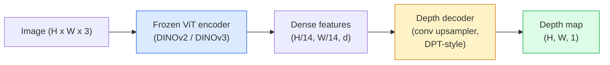

# Profundidad monocular y estimación geométrica

> El mapa de profundidad es una imagen de un solo canal, cada uno de los cuales muestra la distancia de la cámara. En el pasado, si no hay estéreo o LiDAR, solo desde un RGB  predicción se considera imposible.

**类型：**构建 + 使用
**语言：**Python
**前置要求：**Fase 4 Lección 14 (ViT), Fase 4 Lección 17 (Visión auto supervisada), Fase 4 Lección 07 (U-Net)
**时间：** 60 minutos

## El objetivo del aprendizaje

- 区分 relativa profundidad 和 profundidad métrica,并说明每个生产级模型(MiDaS, Marigold, Depth Anything V3, ZoeDepth) resolver es cual
- Uso de profundidad Cualquier cosa V3(DINOv2 espina dorsal) en caso de calibración sin necesidad, para cualquier unidad de imagen de profundidad de pronóstico
- 解释为什么 monocular depth 能从单张图像中成立的 perspective cuentas 纹理梯度 学历),以及它无法恢复什么 绝对规模 隐形几何)
- Utiliza un mapa de profundidad y las características de la cámara de agujero 2D

##  problemas

La profundidad es la visión de computadora 2D. Dado RGB, sabes dónde aparecen los objetos en el plano de imagen, pero no sabes cuánto lejos están. Los sensores de profundidad pueden resolver este problema directamente, pero son costosos, frágiles y tienen un rango limitado.

Estimación de profundidad monocular, es decir, desde un marco RGB  predicción de profundidad, pasado siempre produce模糊且不可靠的输出── hasta 2026 años, codificadores pre-entrenados grandes  cambiaron este punto: Profundidad Cualquier cosa V3 结的 DINOv2 espina dorsal,并生成能够泛化到室内、户外、医疗和卫星域的深度地图──Marigold volverá a重新表述为条件扩散问题──ZoeDepth 回归真实的 метриca distancias──

La profundidad también es el puente entre la detección 2D y la comprensión 3D: los píxeles de la caja detectada multiplican la profundidad, se puede elevar el objeto 2D a la nube de puntos 3D. Este es el núcleo de cada sistema de oclusión AR, cada tubo de evitación de obstáculos y cada uno de los robots que toman una copa.

## 概念

### Profundidad relativa frente a la métrica

- **Relative depth** 没有真实世界单位的序列 `z`Los valores A son más cercanos que B, pero la proporción de distancia no está determinada en metros.
- **Metric depth** Descargar de la cámara ∞ en metros ∞ en la distancia absoluta ∞ en el modelo de demanda ∞ aprender a las señales de imagen y la relación estadística entre la distancia real ∞

MiDaS 和 Depth Anything V3 生成 relativa profundidad。Marigold 生成 relativa profundidad。ZoeDepth、UniDepth 和 Metric3D 生成 métrica profundidad。Modelos métricos a la intrínseca de la cámara 敏感;relativos modelos 则不敏感。

### Encodificador-decodificador 模式



Profundidad Cualquier cosa V3 结 codificador, sólo entrenar DPT-style decoder──encoder  proporcionar abundantes características; decodificador va a incluir estas características 插值回图像分辨率,并回归深度──

### ¿Por qué sólo una imagen puede producir profundidad?

Una imagen 2D contiene muchas señales monoculares relacionadas con la profundidad:

- **Perspective** 3D en el centro de la línea de la línea en el centro de la 2D
- **Texture gradient**La superficie de las zonas más lejanas tiene una textura más pequeña y más densa.
- **Occlusion order**Los objetos más cercanos oscurecerán los más lejanos.
- **Size constancy** 已知物体 (autos, humanos) proporcionan una escala aproximada.
- **Atmospheric perspective** En escenas al aire libre, objetos alejados se ven más...

En miles de millones de imágenes entrenadas, ViT se encarga de incorporar estas señales. Siempre que los datos sean suficientes, la columna vertebral será suficientemente fuerte, con una profundidad monocular, incluso sin ninguna supervisión 3D clara, y alcanzará una precisión razonable.

### Profundidad monocular No puedo hacer nada

- 时没有 intrínseca o objeto conocido en el escenario 时, no se puede obtener **absolute metric scale** red se puede predecir cup  distancia es dos veces  cucharada, pero no se sabe si la copa es 1 m o 10 m 
- **Occluded geometry**La parte posterior de la silla es invisible, no se puede deducir.
- **真正无 texture / reflective surfaces** espejos, vidrio, paredes uniformes, red, información que parece razonable pero equivocada.

### 2026 años de profundidad cualquier cosa V3

- Uso original DINOv2 ViT-L/14 作为编码器(结)
- Descóderas de DPT
- En pares de imágenes de diferentes fuentes, además de la consistencia fotométrica, no se requiere una supervisión de profundidad evidente)
- 能够从 **任意数量的 visual inputs 中预测空间一致的 geometry，无论是否已知 camera poses**¿Qué es eso?
- En profundidad monocular, geometría de cualquier vista, renderización visual, estimación de la posición de la cámara, arriba a alcanzar SOTA.

Este es un modelo de caída en 2026 que necesita profundidad.

### Marigold  Usando la difusión de la profundidad

Marigold(Ke et al., CVPR 2024) va a evaluar la profundidad 重新表述为条件图像-to-image diffusion──Condicionamiento:RGB──Target:depth map──Utilización de mapas de profundidad preentrenados de la Estabilidad de la difusión 2 U-Net 作为脊柱──输出深度maps 在对象边界 处格外清晰──权衡:inference比进送模型 更慢(10-50 个个指责步)──

### Intrínsecas y cámaras de agujero

Tiene que tener profundidad.`d`de los píxeles `(u, v)`提升为相机坐标 中的 3D punto `(X, Y, Z)`¿Qué es esto ?

```
fx, fy, cx, cy = camera intrinsics
X = (u - cx) * d / fx
Y = (v - cy) * d / fy
Z = d
```

Intrínsecas de metadatos EXIF, patrón de calibración, o estimador de intrínsecas monoculares (PERSPECTIVE FELDS, UNIDEPHET) . . . . . . . . . . . . . . . . . . . . . . . . . . . . . . . . . . . . . . . . . . . . . . . . . . . . . . . . . . . . . . . . . . . . . . . . . . . . . . . . . . . . . . . . . . . . . . . . . . . . . . . . . . . . . . . . .

### Evaluación

 Dos criterios:

- **AbsRel**(errore relativo absoluto):`mean(|d_pred - d_gt| / d_gt)`△越低越好── modelos de producción de clase suelen ser de 0,05-0,1──
- **delta < 1.25**(precisión del umbral):满足 `max(d_pred/d_gt, d_gt/d_pred) < 1.25`Los píxeles de la imagen de la imagen de la imagen de la imagen de la imagen de la imagen de la imagen de la imagen de la imagen de la imagen de la imagen de la imagen de la imagen de la imagen de la imagen de la imagen de la imagen de la imagen de la imagen de la imagen de la imagen de la imagen de la imagen de la imagen de la imagen de la imagen de la imagen de la imagen de la imagen de la imagen de la imagen de la imagen de la imagen de la imagen de la imagen de la imagen de la imagen de la imagen de la imagen de la imagen de la imagen de la imagen de la imagen de la imagen de la imagen de la imagen de la imagen de la imagen de la imagen de la imagen de la imagen de la imagen de la imagen de la imagen de la imagen de la imagen de la imagen de la imagen de la imagen de la imagen de la imagen de la imagen de la imagen de la imagen de la imagen de la imagen de la imagen de la imagen de la imagen de la imagen de la imagen de la imagen de la imagen de la imagen de la imagen de la imagen de la imagen de la imagen de la imagen de la imagen de la imagen de la imagen de la imagen de la imagen de la imagen de la imagen de la imagen de la imagen de la imagen de la imagen de la imagen de la imagen de la imagen de la imagen de la imagen de la imagen de la imagen de la imagen de la imagen de la imagen de la imagen de la imagen de la imagen de la imagen de la imagen de la imagen de la imagen de la imagen de la imagen de la imagen de la imagen de la imagen de la imagen de la imagen de la imagen de la imagen de la imagen de la imagen de la imagen de la imagen de la imagen de la imagen de la imagen de la imagen de la imagen de la imagen de la

对于相对深度(Deepth Anything V3、MiDaS), evaluación 版本 版本 版本 版本 版本 版本 版本 版本 版本 版本 版本 版本 版本 版本 版本 版本 版本 版本 版本 版本 版本 版本 版本 版本 版本 版本 版本 版本 版本 版本 版本 版本 版本 版本 版本 版本 版本 版本 版本 版本 版本 版本 版本 版本 版本 版本 版本 版本 版本 版本 版本 版本 版本 版本 版本 版本 版本 版本 版本 版本 版本 版本 版本 版本 版本 版本 版本 版本 版本 版本 版本 版本 


```figure
depth-sweep
```

## Construcción

### 步骤 1: Metricas de profundidad

```python
import torch

def abs_rel_error(pred, target, mask=None):
    if mask is not None:
        pred = pred[mask]
        target = target[mask]
    return (torch.abs(pred - target) / target.clamp(min=1e-6)).mean().item()


def delta_accuracy(pred, target, threshold=1.25, mask=None):
    if mask is not None:
        pred = pred[mask]
        target = target[mask]
    ratio = torch.maximum(pred / target.clamp(min=1e-6), target / pred.clamp(min=1e-6))
    return (ratio < threshold).float().mean().item()
```

En la evaluación 前,始终面膜 无效的深度像素 ((cero、NaN、saturated) ⋅

### 步骤 2: Alineación de escala y cambio

 Para modelos de profundidad relativa, en las métricas de cálculo                                                                                                                                                                                                                                                        `a * pred + b = target`Hacer el cuadrados más bajos:

```python
def align_scale_shift(pred, target, mask=None):
    if mask is not None:
        p = pred[mask]
        t = target[mask]
    else:
        p = pred.flatten()
        t = target.flatten()
    A = torch.stack([p, torch.ones_like(p)], dim=1)
    coeffs, *_ = torch.linalg.lstsq(A, t.unsqueeze(-1))
    a, b = coeffs[:2, 0]
    return a * pred + b
```

En evaluación MiDaS / Profundidad Cualquier cosa 时,先运行 `align_scale_shift`, re运行 `abs_rel_error`¿Qué es eso?

### Paso 3: La profundidad se eleva a la nube de puntos

```python
import numpy as np

def depth_to_point_cloud(depth, intrinsics):
    H, W = depth.shape
    fx, fy, cx, cy = intrinsics
    v, u = np.meshgrid(np.arange(H), np.arange(W), indexing="ij")
    z = depth
    x = (u - cx) * z / fx
    y = (v - cy) * z / fy
    return np.stack([x, y, z], axis=-1)


depth = np.random.uniform(0.5, 4.0, (240, 320))
intr = (320.0, 320.0, 160.0, 120.0)
pc = depth_to_point_cloud(depth, intr)
print(f"point cloud shape: {pc.shape}  (H, W, 3)")
```

Una función, aplicable a todas las aplicaciones 3D-lifted―will punto nube 导出为 `.ply`, y se abre en MeshLab o CloudCompare.

### Paso 4: Use una escena de profundidad sintética para hacer una prueba de humo

```python
def synthetic_depth(size=96):
    yy, xx = np.meshgrid(np.arange(size), np.arange(size), indexing="ij")
    # Floor: linear gradient from near (top) to far (bottom)
    depth = 1.0 + (yy / size) * 4.0
    # Box in the middle: closer
    mask = (np.abs(xx - size / 2) < size / 6) & (np.abs(yy - size * 0.6) < size / 6)
    depth[mask] = 2.0
    return depth.astype(np.float32)


gt = torch.from_numpy(synthetic_depth(96))
pred = gt + 0.3 * torch.randn_like(gt)  # simulated prediction
aligned = align_scale_shift(pred, gt)
print(f"before align  absRel = {abs_rel_error(pred, gt):.3f}")
print(f"after align   absRel = {abs_rel_error(aligned, gt):.3f}")
```

### 步骤 5: Profundidad Cualquier cosa V3 使用方式(referencia)

```python
import torch
from transformers import pipeline
from PIL import Image

pipe = pipeline(task="depth-estimation", model="LiheYoung/depth-anything-v2-large")

image = Image.open("street.jpg").convert("RGB")
out = pipe(image)
depth_np = np.array(out["depth"])
```

Tres pasos.`out["depth"]`Es la escala de grises de PIL; se transfiere a numpy 后用于数学计算──对 Depth Anything V3,发布后替换模型 id 即可;API 保持不变──

## Uso

- **Depth Anything V3**(Meta AI / ByteDance, 2024-2026)  profundidad relativa de la elección de la memoria 
- **Marigold**(ETH, 2024)  La mejor calidad visual, la inferencia 慢──
- **UniDepth**(ETH, 2024) profundidad métrica,并带 cámara intrínseca estimación。
- **ZoeDepth**(Intel, 2023)  profundidad métrica; más antigua, pero todavía fiable
- **MiDaS v3.1** legado pero estabil;适合作为比较基线──

 típico patrón de integración:

1. El marco RGB llegó.
2. Modelo de profundidad 生成 mapa de profundidad
3. Detector de caja hecha.
4.  A través de la profundidad se elevarán los centros de caja a 3D; si hay nube de punto, se trata de un conjunto de
5. Downstream:Oclusión de la RA, planificación de la ruta, estimación del tamaño del objeto, reemplazo de estereo.

Para uso en tiempo real, la profundidad de cualquier cosa V2 Small ((INT8 cuantizada) en la GPU de consumo de arriba a 518x518 puede alcanzar aproximadamente 30 fps.

## 交付

本课会生成:

- `outputs/prompt-depth-model-picker.md`                                                                                                                                                                                                                                                              
- `outputs/skill-depth-to-pointcloud.md` Una habilidad de construir nubes de puntos desde la profundidad de mapas, correctamente procesar las intrínsecas y llevar a cabo `.ply`¿Qué es eso?

##  ejercicios

1. **（Easy）**En tu escritorio, cualquier 10 张图像上运行 Depth Anything V2──将深度 保存为灰度 PNGs并检查──找出一个预测深度 看看看错误的对象,并解释为什么单光线标识 失败──
2. **（Medium）**给定 Depth Cualquier cosa V2 de RGB + profundidad, se elevará a la nube de punto no se utiliza `open3d`染──比较两个场景(inner/outdoor),并记录哪个看起来更可信──
3. **（Hard）**拍摄五对图像, cada对只改变一个已知的物体的位置 (例如, la botella hacia la cercana se mueve 30 cm) ⋅ utilizar UniDepth 在两张图像上预测的米特里深度──报告预测的距离与真实的30 cm的差异──

## 关键术语: "El hombre es un hombre"

| Term | 人们常说 | 实际含义 |
|------|----------------|----------------------|
| Monocular depth | "Single-image depth" | 从一帧 RGB 进行 depth estimation，不使用 stereo 或 LiDAR |
| Relative depth | "Ordered depth" | 没有真实世界单位的有序 z-values |
| Metric depth | "Absolute distance" | 以 metres 表示的 depth；需要 calibration 或使用 metric supervision 训练的 model |
| AbsRel | "Absolute relative error" | |d_pred - d_gt| / d_gt 的平均值；标准 depth metric |
| Delta accuracy | "delta < 1.25" | prediction 位于 ground truth 25% 以内的 pixels 占比 |
| Pinhole camera | "fx, fy, cx, cy" | 用于将 (u, v, d) 提升到 (X, Y, Z) 的 camera model |
| DPT | "Dense Prediction Transformer" | 位于冻结 ViT encoders 之上的 conv-based decoder，用于 depth |
| DINOv2 backbone | "The reason it works" | 无需 depth labels 即可跨 domains 泛化的 self-supervised features |

## 延伸阅读

- [Depth Anything V3 paper page](https://depth-anything.github.io/) Utiliza el codificador DINOv2 de SOTA profundidad monocular
- [Marigold (Ke et al., CVPR 2024)](https://marigoldmonodepth.github.io/)  Estimación de profundidad basada en la difusión
- [UniDepth (Piccinelli et al., 2024)](https://arxiv.org/abs/2403.18913) 带 intrínseca de profundidad métrica
- [MiDaS v3.1 (Intel ISL)](https://github.com/isl-org/MiDaS) línea de base de profundidad relativa canónica
- [DINOv3 blog post (Meta)](https://ai.meta.com/blog/dinov3-self-supervised-vision-model/) 提升 profundidad de precisión de la familia de codificadores
