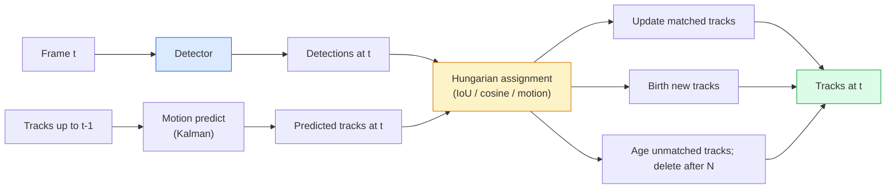

# Seguimiento de múltiples objetos y memoria de vídeo

> El seguimiento es la detección加 asociación──检测每一── según la identificación se ajustará a las detecciones de los anteriores──

**Type:** Build
**Languages:** Python
**Prerequisites:** Phase 4 Lesson 06 (YOLO Detection), Phase 4 Lesson 08 (Mask R-CNN), Phase 4 Lesson 24 (SAM 3)
**Time:** ~60 分钟

## El objetivo del aprendizaje

- 区分 tracking-by-detection 与 query-based tracking,并说出算法家族名称(SORT, DeepSORT, ByteTrack, BoT-SORT, SAM 2 memoria rastreador, SAM 3.1 Object Multiplex)
- Desde el 0 de realizar IoU + asignación húngara, para el seguimiento clásico por detección
- Explicar el banco de memoria de SAM 2, y por qué se asocia con IoU para tratar la oclusión
- 读懂三种跟踪指标(MOTA, IDF1, HOTA),并为给定用例 选择最重要的一项

##  problemas

El detector te dirá los objetos en el interior.`t`¿Cuál es la detección y el marco ?`t-1`Una detección en el medio es el mismo objeto. Sin este punto, no puedes calcular el número de veces que los objetos han atravesado una línea, no puedes seguir un globo en la oclusión, tampoco puedes saber que el coche #4 se ha parado en el camino durante 8 segundos.

El seguimiento de cada uno de los productos de los vídeos es fundamental: análisis deportivo, vigilancia, conducción autónoma, análisis de vídeo médico, monitoreo de vida silvestre, conteo de marcas de palabras.

El año 2026 trae dos nuevos modelos:**SAM 2 memory-based tracking**(Uz memoria de características 替代 motion-model asociación) y **SAM 3.1 Object Multiplex**(Para varias instancias del mismo concepto, compartiendo la memoria)

## 核心概念 核心概念 核心概念 核心概念

### Seguimiento por detección



Cada rastreador que encontrarás en 2026 es una variación de este ciclo.

- **SORT**(2016): Filtro Kalman + IoU Hungariano──简单、快速, no tiene modelo de apariencia──
- **DeepSORT**(2017): SORT + Cada track Una función de apariencia basada en CNN (ReID Embedding)
- **ByteTrack**(2021): 将低信度检测 作为第二阶段进行协会; no necesita características de apariencia, pero en el MOT17 上表现领先──
- **BoT-SORT**(2022): Byte + compensación de movimiento de la cámara + ReID。
- **StrongSORT / OC-SORT** El método posterior de ByteTrack, con mejor movimiento y apariencia.

### Un mensaje de entendimiento Kalman filtro

Filtro Kalman para cada pista  mantener un estado de covariance `(x, y, w, h, dx, dy, dw, dh)`在每一, primero utiliza el modelo de velocidad constante **predict** estado, y luego con la detección de la correspondencia **update** Cuando la incertidumbre de la predicción es mayor, actualiza la detección 会更信任.

Cada rastreador clásico está en el paso de predicción de movimiento usando el filtro Kalman.

### Algoritmo húngaro

给定一个 `M x N`Matriz de costos (tracks x detections), busca hacer total costos, la menor de una tarea en una contra de otra.`1 - IoU(track_bbox, detection_bbox)`, o características de apariencia de la similitud cosínica negativa.`scipy.optimize.linear_sum_assignment`En Python está bastante rápido.

### Key ideas de ByteTrack

标准 tracker 会丢弃低置信度 detections(< 0.5)。ByteTrack 会保留它们作为 **second-stage candidates**Primero, las pistas se ajustan a las detecciones de alta confianza, luego, las pistas no se ajustan con un umbral de IoU un poco más flexible, intentando ajustar las detecciones de baja confianza, para así recuperar oclusiones temporales y reducir los interruptores de identificación cercanos a la población.

### SAM 2 seguimiento basado en la memoria

SAM 2                                                                                                                                                                                                                                                                                                                                                                                                                                                                                                                            **memory bank**Para tratar el vídeo. En el siguiente video, el decodificador se encarga de la misma instancia en el nuevo.

没有 Kalman filter,也没有匈牙利任务──Association 隐含在记忆-注意中──

优点:
- Para oclusiones de gran alcance 鲁棒(memoria 会跨多携带实例身份)
- Las instrucciones de texto de SAM 3 结合时支持开放词典──
- 无需单独的运动模型──

缺点:
- Para el seguimiento de muchos objetos, más lento que ByteTrack.
- Banco de memoria 会增长; ventana de contexto 受限──

### SAM 3.1 Objeto múltiple

El rastreo SAM 2 / SAM 3 se realizará para cada instancia. Mantener un banco de memoria independiente. 50 objetos.**per-instance query tokens**El costo de la memoria compartida aumenta en función de los casos.

Multiplex es el nuevo modelo de seguimiento de multitudes para 2026: multitudes de conciertos, trabajadores de almacenes, cruces de tráfico.

### 需要掌握的三种计量

- **MOTA (Multi-Object Tracking Accuracy)** 1 - (FN + FP + ID switches) / GT。 según el tipo de error 加权; es una de las señales de detección y de asociación 混合在一起的单一 метрика。
- **IDF1 (ID F1)** Precisión de ID y medio armónico de recuerdo―专注衡量每条基实轨 在时间保持其ID的程度―对ID-switch-sensitive tasks 来说比MOTA更好―
- **HOTA (Higher Order Tracking Accuracy)** 分解为 detección precisión (DetA) y asociación precisión (AssA) ⋅ desde 2020 años de comunidad estándar; más completo──

对于监视(quién es quién):报告 IDF1──对体育分析(talla de pasajes):HOTA──对一般学术比较:HOTA──


```figure
cv3-track-assoc
```

## Construirlo

### Paso 1: Matriz de costos basada en IoU

```python
import numpy as np


def bbox_iou(a, b):
    """
    a, b: [x1, y1, x2, y2] 的 (N, 4) arrays。
    返回 (N_a, N_b) IoU matrix。
    """
    ax1, ay1, ax2, ay2 = a[:, 0], a[:, 1], a[:, 2], a[:, 3]
    bx1, by1, bx2, by2 = b[:, 0], b[:, 1], b[:, 2], b[:, 3]
    inter_x1 = np.maximum(ax1[:, None], bx1[None, :])
    inter_y1 = np.maximum(ay1[:, None], by1[None, :])
    inter_x2 = np.minimum(ax2[:, None], bx2[None, :])
    inter_y2 = np.minimum(ay2[:, None], by2[None, :])
    inter = np.clip(inter_x2 - inter_x1, 0, None) * np.clip(inter_y2 - inter_y1, 0, None)
    area_a = (ax2 - ax1) * (ay2 - ay1)
    area_b = (bx2 - bx1) * (by2 - by1)
    union = area_a[:, None] + area_b[None, :] - inter
    return inter / np.clip(union, 1e-8, None)
```

### Paso 2: Lo más pequeño de los SORT 风格 tracker

Para simplificar,省略 fijar la velocidad constante Kalman; aquí se utiliza simple asociación de IoU; en el entorno de producción, Kalman predice es indispensable.`sort`El paquete Python 提供完整版本──

```python
from scipy.optimize import linear_sum_assignment


class Track:
    def __init__(self, tid, bbox, frame):
        self.id = tid
        self.bbox = bbox
        self.last_frame = frame
        self.hits = 1

    def update(self, bbox, frame):
        self.bbox = bbox
        self.last_frame = frame
        self.hits += 1


class SimpleTracker:
    def __init__(self, iou_threshold=0.3, max_age=5):
        self.tracks = []
        self.next_id = 1
        self.iou_threshold = iou_threshold
        self.max_age = max_age

    def step(self, detections, frame):
        if not self.tracks:
            for d in detections:
                self.tracks.append(Track(self.next_id, d, frame))
                self.next_id += 1
            return [(t.id, t.bbox) for t in self.tracks]

        track_boxes = np.array([t.bbox for t in self.tracks])
        det_boxes = np.array(detections) if len(detections) else np.empty((0, 4))

        iou = bbox_iou(track_boxes, det_boxes) if len(det_boxes) else np.zeros((len(track_boxes), 0))
        cost = 1 - iou
        cost[iou < self.iou_threshold] = 1e6

        matched_track = set()
        matched_det = set()
        if cost.size > 0:
            row, col = linear_sum_assignment(cost)
            for r, c in zip(row, col):
                if cost[r, c] < 1.0:
                    self.tracks[r].update(det_boxes[c], frame)
                    matched_track.add(r); matched_det.add(c)

        for i, d in enumerate(det_boxes):
            if i not in matched_det:
                self.tracks.append(Track(self.next_id, d, frame))
                self.next_id += 1

        self.tracks = [t for t in self.tracks if frame - t.last_frame <= self.max_age]
        return [(t.id, t.bbox) for t in self.tracks]
```

60 行──Recepción de detecciones por marco, devolución de ID de pista por marco──真实系统也会加入Kalman predict、ByteTrack re-match de la segunda etapa, así como las características de apariencia──

### 步骤 3: Prueba de trayectoria sintética

```python
def synthetic_frames(num_frames=20, num_objects=3, H=240, W=320, seed=0):
    rng = np.random.default_rng(seed)
    starts = rng.uniform(20, 200, size=(num_objects, 2))
    velocities = rng.uniform(-5, 5, size=(num_objects, 2))
    frames = []
    for f in range(num_frames):
        dets = []
        for i in range(num_objects):
            cx, cy = starts[i] + f * velocities[i]
            dets.append([cx - 10, cy - 10, cx + 10, cy + 10])
        frames.append(dets)
    return frames


tracker = SimpleTracker()
for f, dets in enumerate(synthetic_frames()):
    tracks = tracker.step(dets, f)
```

Tres objetos en movimiento en línea recta deben poder mantener su identidad en todos los 20 .

### 步骤 4: métrica de interruptor de identificación

```python
def count_id_switches(tracks_per_frame, gt_per_frame):
    """
    tracks_per_frame:  list of list of (track_id, bbox)
    gt_per_frame:      list of list of (gt_id, bbox)
    返回 ID switches 的数量。
    """
    prev_assignment = {}
    switches = 0
    for tracks, gts in zip(tracks_per_frame, gt_per_frame):
        if not tracks or not gts:
            continue
        t_boxes = np.array([b for _, b in tracks])
        g_boxes = np.array([b for _, b in gts])
        iou = bbox_iou(g_boxes, t_boxes)
        for g_idx, (gt_id, _) in enumerate(gts):
            j = iou[g_idx].argmax()
            if iou[g_idx, j] > 0.5:
                t_id = tracks[j][0]
                if gt_id in prev_assignment and prev_assignment[gt_id] != t_id:
                    switches += 1
                prev_assignment[gt_id] = t_id
    return switches
```

Esta es una métrica simplificada, cercana a IDF1:统计一个地面真相对象更换其分配预测轨道ID的次数――真实的MOTA / IDF1 / HOTA 工具位于`py-motmetrics`Y `TrackEval`En el medio.

## Usalo

Traqueadores de producción de 2026:

- `ultralytics` YOLOv8 + 内置 ByteTrack / BoT-SORT。`results = model.track(source, tracker="bytetrack.yaml")`❖默认选择──
- `supervision`(Roboflow)  Envase de ByteTrack + utilidades de anotación。
- SAM 2 / SAM 3.1                                                                                                                                                                                                                                                                                                                                                                                                                                                                                                                        `processor.track()` realizar un seguimiento basado en la memoria¬¬¬
- Estaca personalizada: detector (YOLOv8 / RT-DETR) + `sort-tracker`- ¿ Qué ?`OC-SORT`- ¿ Qué ?`StrongSORT`¿Qué es eso?

选择方式:

- 30+ fps abajo de peatones / coches / cajas:**ByteTrack with ultralytics**¿Qué es eso?
- En el grupo de personas, hay un gran número de casos:**SAM 3.1 Object Multiplex**¿Qué es eso?
- Las oclusiones pesadas con apariencia reconocible:**DeepSORT / StrongSORT**(Figuración de ReID)
- Deportes / interacciones complejas:**BoT-SORT**O los rastreadores aprendidos (MOTRv3)

##  entregarlo

Encuentro de trabajo:

- `outputs/prompt-tracker-picker.md`   De acuerdo con el tipo de escena、 patrones de oclusión 和 presupuesto de latencia 选择 SORT / ByteTrack / BoT-SORT / SAM 2 / SAM 3.1。
- `outputs/skill-mot-evaluator.md` 编写一个完整的评估带,用于针对地面真相轨迹 评估MOTA / IDF1 / HOTA。

##  ejercicios

1. **(Easy)**Utilice el rastreador sintético de arriba, separando 3、10 y 30 objetos. Reporte el conteo de interruptores de ID en cada caso.
2. **(Medium)**En la asociación 之前加入 constante velocidad Kalman predicir paso──展示短暂(2-3 )
3. **(Hard)**集成 SAM 2                                                                                                                                                                                                                                                                                                                                                                                                                                                                                                                         `transformers`) como un respaldo de seguimiento alternativo. En un período de 30 segundos, el grupo de personas se ejecuta simultáneamente con SimpleTracker y SAM 2, y se comparan con los números de interruptores de identificación.

## 关键术语: "El hombre es un hombre"

| Term | 常见说法 | 实际含义 |
|------|----------------|----------------------|
| Tracking-by-detection | “先 detect 再 associate” | Per-frame detector + 基于 IoU / appearance 的 Hungarian assignment |
| Kalman filter | “Motion predict” | Linear dynamics + covariance，用于平滑 track predictions 和处理 occlusion |
| Hungarian algorithm | “Optimal assignment” | 求解 minimum-cost bipartite matching 问题；`scipy.optimize.linear_sum_assignment` |
| ByteTrack | “低置信度 second pass” | 将未匹配 tracks 重新匹配到低置信度 detections，以恢复短暂 occlusions |
| DeepSORT | “SORT + appearance” | 添加 ReID feature 用于跨帧匹配；更利于保持 ID |
| Memory bank | “SAM 2 trick” | 跨帧存储的 per-instance spatio-temporal features；cross-attention 替代显式 association |
| Object Multiplex | “SAM 3.1 shared memory” | 使用带 per-instance queries 的单一 shared memory，实现快速 many-object tracking |
| HOTA | “现代 tracking metric” | 分解为 detection 和 association accuracy；社区标准 |

## 延伸阅读

- [SORT (Bewley et al., 2016)](https://arxiv.org/abs/1602.00763) 最小 rastreo por detección 论文
- [DeepSORT (Wojke et al., 2017)](https://arxiv.org/abs/1703.07402) 添加 característica de apariencia
- [ByteTrack (Zhang et al., 2022)](https://arxiv.org/abs/2110.06864) 低置信度 segundo pase
- [BoT-SORT (Aharon et al., 2022)](https://arxiv.org/abs/2206.14651) Compensación de movimiento de la cámara
- [HOTA (Luiten et al., 2020)](https://arxiv.org/abs/2009.07736) 分解式 métrica de seguimiento
- [SAM 2 video segmentation (Meta, 2024)](https://ai.meta.com/sam2/) rastreador basado en la memoria
- [SAM 3.1 Object Multiplex (Meta, March 2026)](https://ai.meta.com/blog/segment-anything-model-3/)
