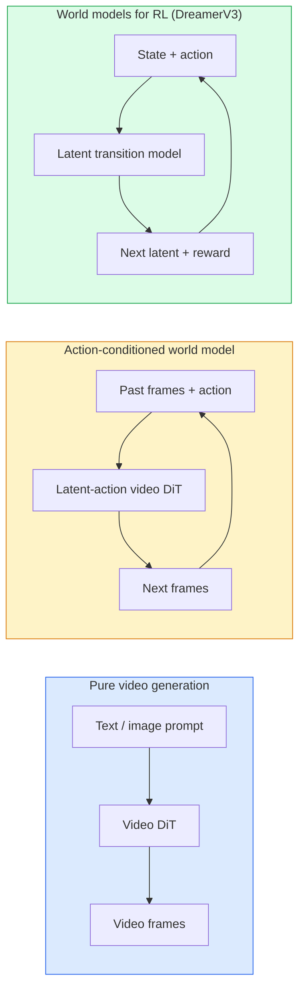

# Modelos mundiales y difusión de videos

> Un modelo de video capaz de predecir escenarios futuros en unos segundos, es un simulador de mundo.

**Type:** Learn + Build
**Languages:** Python
**Prerequisites:** Phase 4 Lesson 10 (Diffusion), Phase 4 Lesson 12 (Video Understanding), Phase 4 Lesson 23 (DiT + Rectified Flow)
**Time:** ~75 分钟

## El objetivo del aprendizaje
- 解释纯视频生成模型(Sora 2) y el modelo de mundo con condiciones de acción(Genie 3, DreamerV3)
-  describir el video DiT: parches espaciotemporales  3D codificación de posición                    `(T, H, W)`la atención conjunta de los tokens
- 追踪 World Model 如何接入机器人:VLM 规划 → modelo de vídeo 模拟 → dinámica inversa 输出动作
- 针对给定用例 ((creativo video、interactivo sim、autónomo-driving synthesis) 在 Sora 2、Genie 3、Runway GWM-1 Worlds、Wan-Video 和 HunyuanVideo 之间做选择

##  problemas
视频生成和 World Model 在 2026年走向融合──一个能够生成连连贯一分钟视频的模型, en cierto sentido ya ha aprendido cómo se mueve el mundo: la permanencia de objetos, la gravedad, la causalidad, el estilo── si se pone esta predicción en condiciones en movimiento, el modelo de video se convertirá en un simulador que se puede aprender, puede sustituir el motor de juego, el simulador de conducción o el entorno robótico──

Su impacto es muy específico. Genie 3 puede ser reproducido en un solo cuadro de un entorno jugable. Runoway GWM-1 Worlds  Sintesis Infinita Explorable de escenarios. Sora 2 生成带有同步音频和建模物理效果一分钟视频. NVIDIA Cosmos-Drive、Wayve Gaia-2 和 Tesla DrivingWorld 作为自主车训练数据 生成真实驾驶视频.

Este curso es el curso de la Fase 4 de la                                                                                                                                                                                                                                                         

## 概念
### El modelo mundial de tres clases



- **Sora 2**Es basado en las instrucciones  condicionadas  puro video generado                                                                                                                                                                                                                                                                                                                                                                                                                                                                                                               
- **Genie 3**¿Qué es esto?**GWM-1 Worlds**¿Qué es esto?**Mirage / Magica**Son modelos mundiales condicionados a la acción. Ellos deducen acciones latentes en el video de observación, luego se condicionan en la acción.
- **DreamerV3**和经典 RL World Model 家族 realizar predicciones en el espacio latente,并带有显式行动条件, basado en la señal de recompensa 训练――视觉性较弱; pero para RL más útil para la muestra-eficiente――

### Arquitectura de vídeo

```
Video latent:          (C, T, H, W)
Patchify (spatial):    grid of P_h x P_w patches per frame
Patchify (temporal):   group P_t frames into a temporal patch
Resulting tokens:      (T / P_t) * (H / P_h) * (W / P_w) tokens
```

La codificación posicional es 3D: para cada uno`(t, h, w)`坐标使用 rotary 或 learned embedding──Attención puede ser:

- **Full joint** Todos los tokens asisten a todos los tokens。 para N 个 tokens es O(N^2)。 para长视频来说代价过高──
- **Divided** 交替执行 temporal attention  la misma posición espacial 跨时间:`(H*W) * T^2`) y la atención espacial:`T * (H*W)^2`La mayoría de los DiTs de video usan este método.
- **Window** en `(t, h, w)`En el interior de la casa, el video es un video de la casa de la mujer.

Cada modelo de difusión de vídeo de 2026 utilizará uno de estos tres modelos, además de AdaLN acondicionamiento (Lección 23) y flujo rectificado.

### 基于动作的 Condicionamiento:modelos de acción latente

Genius 通过判别式地预测一对连续之间的动作,为每一学习一个 **latent action** Entonces el decodificador del modelo                                                                                                                                                                                                                                                                                                                                                                                                                                                                                                                    

Sora  completamente saltó la interacción de movimiento. Su decodificador de los tokens del espacio-tiempo pasado  predicción de los próximos tokens del espacio-tiempo.

### Plausibilidad física

Sora 2 de 2026 año de publicación de la declaración**physical plausibility**: Pesada, equilibrio, permanencia de objetos, causa y efecto, medido por el equipo a través de puntuaciones de plausibilidad de evaluación artificial, comparación con Sora 1, el modelo ha mejorado de forma evidente en escenarios como el caída de objetos, el choque de personajes y el fracaso intencional (una vez que no saltó)

La plausibilidad sigue siendo un modelo de fracaso principal. En el período 2024-2025 los videos de la gente que come italianas o beben agua con copa de cristal expusieron problemas de modelo de falta de representación de objetos duraderos. En el año 2026 el modelo (Sora 2 ∼ Runway Gen-5 ∼ HunyuanVideo) redujo estos problemas, pero no eliminó.

### Modelos del mundo autónomo

Modelos de conducción de mundo se generarán basados en trayectorias, cajas de enlace o mapas de navegación  condiciones de escenario real de la carretera:

- **Cosmos-Drive-Dreams**(NVIDIA)  Para el entrenamiento RL 生成数分钟驾驶视频。
- **Gaia-2**(Wayve)  Usado para la síntesis de escenarios condicionados por trayectoria de la evaluación de políticas。
- **DrivingWorld**(Tesla)  模拟多样气, hora del día 和交通条件──
- **Vista**(ByteDance)  响应式驾驶场景合成──

Los datos de la realidad virtual han sido reemplazados por los costosos datos del mundo real, para cubrir los casos de esquinas, como los tipos de vehículos raros, que requieren millones de kilómetros de conducción para ser recogidos.

### 机器人技术:VLM + modelo de vídeo + dinámica inversa

Está apareciendo tres componentes de la bucle robótica:

1. **VLM**解析目标(拿起红色杯子), planificar una secuencia de acción de alto nivel。
2. **Video generation model**模拟执行每个动作会是什么样子,预测未来 N  observaciones。
3. **Inverse dynamics model**提取会产生 estas observaciones de comandos motores específicos.

Esto sustituyó la formación de la recompensa y el RL pesado en muestras. El Modelo Mundial es responsable de la imaginación; la dinámica inversa en la ejecución de la configuración de los círculos cerrados.

### Evaluación

- **Visual quality** FVD (Fréchet Video Distance) 、 usuario研究──
- **Prompt alignment** Cada uno de los resultados de CLIPScore  Evaluación de estilo VQA
- **Physical plausibility** En la suite de benchmarks 上人工评分(Sora 2's internal benchmark、VBench)
- **Controllability**(a los modelos del mundo interactivo)  acción → consistencia de observación; ¿voiñacé否 volver al estado anterior?

### Modelo de la edición de 2026

| Model | Use | Parameters | Output | License |
|-------|-----|------------|--------|---------|
| Sora 2 | text-to-video, audio | — | 1-min 1080p + audio | API only |
| Runway Gen-5 | text/image-to-video | — | 10s clips | API |
| Runway GWM-1 Worlds | interactive world | — | infinite 3D rollout | API |
| Genie 3 | interactive world from image | 11B+ | playable frames | research preview |
| Wan-Video 2.1 | open text-to-video | 14B | high-quality clips | non-commercial |
| HunyuanVideo | open text-to-video | 13B | 10s clips | permissive |
| Cosmos / Cosmos-Drive | autonomous driving sim | 7-14B | driving scenes | NVIDIA open |
| Magica / Mirage 2 | AI-native game engine | — | modifiable worlds | product |


```figure
v4-world-rollout
```

## Construirlo
### Paso 1: video de 3D parchear

```python
import torch
import torch.nn as nn


class VideoPatch3D(nn.Module):
    def __init__(self, in_channels=4, dim=64, patch_t=2, patch_h=2, patch_w=2):
        super().__init__()
        self.proj = nn.Conv3d(
            in_channels, dim,
            kernel_size=(patch_t, patch_h, patch_w),
            stride=(patch_t, patch_h, patch_w),
        )
        self.patch_t = patch_t
        self.patch_h = patch_h
        self.patch_w = patch_w

    def forward(self, x):
        # x: (N, C, T, H, W)
        x = self.proj(x)
        n, c, t, h, w = x.shape
        tokens = x.reshape(n, c, t * h * w).transpose(1, 2)
        return tokens, (t, h, w)
```

Un paso igual que el núcleo de 3D convolverá como un parcheador espacio-temporal.`(T, H, W) -> (T/2, H/2, W/2)`Las fichas de la red

### 步骤 2: codificación de posición rotativa en 3D

Embedings de posición rotaria (RoPE) 分別沿 `t`¿Qué es esto?`h`¿Qué es esto?`w`轴应用:

```python
def rope_3d(tokens, t_dim, h_dim, w_dim, grid):
    """
    tokens: (N, T*H*W, D)
    grid: (T, H, W) sizes
    t_dim + h_dim + w_dim == D
    """
    T, H, W = grid
    n, seq, d = tokens.shape
    if t_dim + h_dim + w_dim != d:
        raise ValueError(f"t_dim+h_dim+w_dim ({t_dim}+{h_dim}+{w_dim}) must equal D={d}")
    assert seq == T * H * W
    t_idx = torch.arange(T, device=tokens.device).repeat_interleave(H * W)
    h_idx = torch.arange(H, device=tokens.device).repeat_interleave(W).repeat(T)
    w_idx = torch.arange(W, device=tokens.device).repeat(T * H)
    # Simplified: just scale channels by frequencies. Real RoPE rotates pairs.
    freqs_t = torch.exp(-torch.log(torch.tensor(10000.0)) * torch.arange(t_dim // 2, device=tokens.device) / (t_dim // 2))
    freqs_h = torch.exp(-torch.log(torch.tensor(10000.0)) * torch.arange(h_dim // 2, device=tokens.device) / (h_dim // 2))
    freqs_w = torch.exp(-torch.log(torch.tensor(10000.0)) * torch.arange(w_dim // 2, device=tokens.device) / (w_dim // 2))
    emb_t = torch.cat([torch.sin(t_idx[:, None] * freqs_t), torch.cos(t_idx[:, None] * freqs_t)], dim=-1)
    emb_h = torch.cat([torch.sin(h_idx[:, None] * freqs_h), torch.cos(h_idx[:, None] * freqs_h)], dim=-1)
    emb_w = torch.cat([torch.sin(w_idx[:, None] * freqs_w), torch.cos(w_idx[:, None] * freqs_w)], dim=-1)
    return tokens + torch.cat([emb_t, emb_h, emb_w], dim=-1)
```

Éste es un formato aditivo simplificado.

### Paso 3: Bloqueo de atención dividido

```python
class DividedAttentionBlock(nn.Module):
    def __init__(self, dim=64, heads=2):
        super().__init__()
        self.time_attn = nn.MultiheadAttention(dim, heads, batch_first=True)
        self.space_attn = nn.MultiheadAttention(dim, heads, batch_first=True)
        self.ln1 = nn.LayerNorm(dim)
        self.ln2 = nn.LayerNorm(dim)
        self.ln3 = nn.LayerNorm(dim)
        self.mlp = nn.Sequential(nn.Linear(dim, 4 * dim), nn.GELU(), nn.Linear(4 * dim, dim))

    def forward(self, x, grid):
        T, H, W = grid
        n, seq, d = x.shape
        # time attention: same (h, w), across t
        xt = x.view(n, T, H * W, d).permute(0, 2, 1, 3).reshape(n * H * W, T, d)
        a, _ = self.time_attn(self.ln1(xt), self.ln1(xt), self.ln1(xt), need_weights=False)
        xt = (xt + a).reshape(n, H * W, T, d).permute(0, 2, 1, 3).reshape(n, seq, d)
        # space attention: same t, across (h, w)
        xs = xt.view(n, T, H * W, d).reshape(n * T, H * W, d)
        a, _ = self.space_attn(self.ln2(xs), self.ln2(xs), self.ln2(xs), need_weights=False)
        xs = (xs + a).reshape(n, T, H * W, d).reshape(n, seq, d)
        xs = xs + self.mlp(self.ln3(xs))
        return xs
```

Atención temporal en cada posición espacial dentro de tiempo; Atención espacial en cada posición espacial dentro de tiempo; Atención espacial en cada uno de los lugares de tiempo.

### Paso 4: 组合一个小视频 DiT

```python
class TinyVideoDiT(nn.Module):
    def __init__(self, in_channels=4, dim=64, depth=2, heads=2):
        super().__init__()
        self.patch = VideoPatch3D(in_channels=in_channels, dim=dim, patch_t=2, patch_h=2, patch_w=2)
        self.blocks = nn.ModuleList([DividedAttentionBlock(dim, heads) for _ in range(depth)])
        self.out = nn.Linear(dim, in_channels * 2 * 2 * 2)

    def forward(self, x):
        tokens, grid = self.patch(x)
        for blk in self.blocks:
            tokens = blk(tokens, grid)
        return self.out(tokens), grid
```

No es un generador de video que se pueda trabajar; es una demostración de estructura, que demuestra que cada parte de la forma es correcta.

### 步骤 5:  inspeccionar las formas

```python
vid = torch.randn(1, 4, 8, 16, 16)  # (N, C, T, H, W)
model = TinyVideoDiT()
out, grid = model(vid)
print(f"input  {tuple(vid.shape)}")
print(f"tokens grid {grid}")
print(f"output {tuple(out.shape)}")
```

parche 后预期 `grid = (4, 8, 8)`且 `out = (1, 256, 32)`; cabeza 随后 proyectar hasta cada token para los parches espaciotemporales correspondientes, prepararse para desparchear 回视频。

## Usalo
Modelo de producción de 2026:

- **Sora 2 API**(OpenAI)  texto a vídeo 同步音频── Precio de precio.
- **Runway Gen-5 / GWM-1**(Runway)  imágenes a video ∞ mundos interactivos ∞
- **Wan-Video 2.1 / HunyuanVideo**  开源自托管──
- **Cosmos / Cosmos-Drive**(NVIDIA)  Simulación de conducción de pesos abiertos。
- **Genie 3** preview de la investigación, necesita solicitar la visita

Construir una demostración interactiva de modelo mundial: desde Wan-Video  empezar a obtener calidad, reimplanar un adaptador de acción latente para lograr la interacción ⋅ para la simulación de conducción autónoma: Cosmos-Drive es una referencia abierta de 2026 ⋅

现实中的 robótica pila:

1. Objetivo lingüístico -> VLM (Qwen3-VL) -> plan de alto nivel―
2. Plan -> modelo de vídeo de acción latente -> despliegue imaginado。
3. Rollout -> modelo de dinámica inversa -> acciones de bajo nivel。
4. 执行 Actions -> observación en el paso 1。

##  entregarlo
本课产 出:

- `outputs/prompt-video-model-picker.md`   根据任务、许可和延迟,在 Sora 2 / Runway / Wan / HunyuanVideo / Cosmos 之间做选择──
- `outputs/skill-physical-plausibility-checks.md` Una definición de la capacidad de inspección automática de objetos de permanencia, gravedad, continuidad, utilizada en cualquier video producido antes de la entrega.

##  ejercicios
1. **(Easy)**计算一个 5 秒 360p 视频在补丁-t=2、补丁-h=8、补丁-w=8 时的代币数――推理这个规模下关注的内存需求――
2. **(Medium)**Colocar el bloque de atención dividido de arriba  sustituido por el bloque de atención conjunta completo,并测量形和参数数.
3. **(Hard)**构建一个最小潜动视频模型:使用 `(frame_t, action_t, frame_{t+1})`triple 数据集(任意简单 2D game), entrenar un pequeño video de conditionación basado en embebedidos de acción,并展示不同动作会产生不同的下一──

## 关键术语: "El hombre es un hombre"
| Term | What people say | What it actually means |
|------|----------------|----------------------|
| World model | “Learned simulator” | 一个在给定 state 和 action 时预测未来 observations 的模型 |
| Video DiT | “Spacetime transformer” | 使用 3D patchification 和 divided attention 的 Diffusion transformer |
| Latent action | “Inferred control” | 从帧对中推断出的离散或连续 action latent；用于条件化 next-frame generation |
| Divided attention | “Time then space” | 每个 block 中的两个 attention 操作：先跨时间，再跨空间，用来让 O(N^2) 保持可控 |
| Object permanence | “Things stay real” | video models 必须学会的场景属性；在食物、玻璃器皿上的经典失败模式 |
| FVD | “Fréchet Video Distance” | FID 的视频等价物；主要 visual quality metric |
| Inverse dynamics model | “Observations to actions” | 给定 `(state, next state)`，输出连接二者的 action；闭合 robotics loop |
| Cosmos-Drive | “NVIDIA driving sim” | 用于 RL 和 evaluation 的 open-weights autonomous-driving world model |

## 延伸阅读
- [Sora technical report (OpenAI)](https://openai.com/index/video-generation-models-as-world-simulators/)
- [Genie: Generative Interactive Environments (Bruce et al., 2024)](https://arxiv.org/abs/2402.15391) Modelos de mundo de acción latente
- [TimeSformer (Bertasius et al., 2021)](https://arxiv.org/abs/2102.05095) Con la atención dividida de los transformadores de video
- [DreamerV3 (Hafner et al., 2023)](https://arxiv.org/abs/2301.04104) Utilizado en modelos mundiales de RL
- [Cosmos-Drive-Dreams (NVIDIA, 2025)](https://research.nvidia.com/labs/toronto-ai/cosmos-drive-dreams/) modelo mundial de conducción
- [Top 10 Video Generation Models 2026 (DataCamp)](https://www.datacamp.com/blog/top-video-generation-models)
- [From Video Generation to World Model — survey repo](https://github.com/ziqihuangg/Awesome-From-Video-Generation-to-World-Model/)
