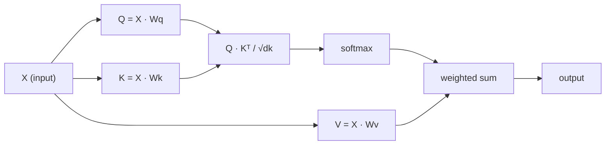

# Desde el 0o de la autoatención

> La atención es una hoja de preguntas, cada palabra de la cual se pregunta: ¿Quién es importante para mí?

**类型：**Construcción
**语言：**Python
**先修要求：**Fase 3 (Centro de Aprendizaje Profundo), Fase 5 Lección 10 (Secuencia a Secuencia)
**时间：**- 90 minutos

## El objetivo del aprendizaje

- 仅使用 NumPy 从零实现 escalado punto-producto autoatención, incluyendo consulta/clave/valor 投影和 softmax 加权求和
- Construir múltiples capas de atención 层, para desglosar la cabeza 計算并行注意,并拼接结果
-  rastrear la matriz de atención  cómo capturar Token 关系,并解释为什么除以 sqrt(d_k) puede prevenir softmax 和
-  aplicar el enmascaramiento causal,将 bidireccional atención 转换为 autoregressive(decoder-style) atención

##  problemas

RNNs una vez procesan un Token. Hasta que llegues a la 50a Token, la información de la 1a Token ya se ha comprimido 50 veces. La larga distancia de dependencia se comprime en un estado oculto de tamaño fijo.

El artículo de Bahdanau de 2014 muestra cómo entender: hacer que el decodificador vuelva a ver cada codificador  posición, y juzgar qué posiciones son importantes para los pasos actuales. Pero todavía está en el RNN de arriba. El artículo de 2017 "Attención es todo lo que necesitas" planteó una pregunta más aguda: si la atención es el único mecanismo?

La autoatención  permite que cada posición en la secuencia pueda asistir en un solo paso paralelos a cada otra posición ‒ esto es la razón por la que los transformadores ‒ rápidamente ‒ pueden expandirse y ocupar el lugar dominante―

## 概念

### Las tasas de datos

Imagina la atención en una consulta de base de datos:

```
Traditional database:
  Query: "capital of France"  -->  exact match  -->  "Paris"

Attention:
  Query: "capital of France"  -->  similarity to ALL keys  -->  weighted blend of ALL values
```

Cada token generará tres vectores:
- **Query (Q)**¿Qué estoy buscando?
- **Key (K)**¿Qué es lo que contiene?
- **Value (V)**Si fuese elegido, ¿qué información le daría?

Una consulta con el producto de puntos de todas las claves generará puntajes de atención.

### Q、K、V 计算

Cada token incorporado pasará por tres matrices de peso obtenidas para proyectar:

```
Input embeddings (sequence of n tokens, each d-dimensional):

  X = [x1, x2, x3, ..., xn]       shape: (n, d)

Three weight matrices:

  Wq  shape: (d, dk)
  Wk  shape: (d, dk)
  Wv  shape: (d, dv)

Projections:

  Q = X @ Wq    shape: (n, dk)      each token's query
  K = X @ Wk    shape: (n, dk)      each token's key
  V = X @ Wv    shape: (n, dv)      each token's value
```

Desde el punto de vista, para un Token:

```
             Wq
  x_i ------[*]------> q_i    "What am I looking for?"
       |
       |     Wk
       +----[*]------> k_i    "What do I contain?"
       |
       |     Wv
       +----[*]------> v_i    "What do I offer?"
```

### Matriz de atención

Una vez que obtengas todas las fichas de los puntos de atención formará una matriz:

```
Scores = Q @ K^T    shape: (n, n)

              k1    k2    k3    k4    k5
        +-----+-----+-----+-----+-----+
   q1   | 2.1 | 0.3 | 0.1 | 0.8 | 0.2 |   <- how much q1 attends to each key
        +-----+-----+-----+-----+-----+
   q2   | 0.4 | 1.9 | 0.7 | 0.1 | 0.3 |
        +-----+-----+-----+-----+-----+
   q3   | 0.2 | 0.6 | 2.3 | 0.5 | 0.1 |
        +-----+-----+-----+-----+-----+
   q4   | 0.9 | 0.1 | 0.4 | 1.7 | 0.6 |
        +-----+-----+-----+-----+-----+
   q5   | 0.1 | 0.3 | 0.2 | 0.5 | 2.0 |
        +-----+-----+-----+-----+-----+

Each row: one token's attention over the entire sequence
```

Una vez miré una consulta Cómo revisar todas las claves: cada línea se le da a cada token 打分,softmax Colocar las puntuaciones  en pesas, mientras que el vector de contexto es la combinación de valores 加权混合──

```figure
attention-matrix
```

### ¿Por qué se acurrucar?

Los productos de puntos se incrementarán con la dimensión de la superficie. Si la superficie de los productos de puntos es de 64, los productos de puntos podrían alcanzar un rango de 10 puntos, se introducirá la máxima suave en la región de la dimensión de la superficie de los puntos de la superficie.

```
Scaled scores = (Q @ K^T) / sqrt(dk)
```

Esto mantendrá el valor numérico en el rango de Gradientes útiles que pueden producirse a la máxima suave.

### Softmax se convertirá en Peso

Softmax 会将 original puntuaciones  transformar en probabilidad de distribución en cada línea:

```
Raw scores for q1:   [2.1, 0.3, 0.1, 0.8, 0.2]
                            |
                         softmax
                            |
Attention weights:   [0.52, 0.09, 0.07, 0.14, 0.08]   (sums to ~1.0)
```

Ahora, cada token tiene un grupo de pesas, lo que significa que debería asistir en gran medida a cada otro token.

### Valores de la

El resultado final de cada token es el incremento de todos los vectores de valor:

```
output_i = sum( attention_weight[i][j] * v_j  for all j )

For token 1:
  output_1 = 0.52 * v1 + 0.09 * v2 + 0.07 * v3 + 0.14 * v4 + 0.08 * v5
```

### 完整流程



Una línea de fórmula:

```
Attention(Q, K, V) = softmax( Q @ K^T / sqrt(dk) ) @ V
```

```figure
softmax-attention-scaling
```

## Construirlo

### Paso 1: Implementar Softmax desde cero

Softmax 会将原始logits 转换为概率──为了数值稳定性,首先减去最大值──

```python
import numpy as np

def softmax(x):
    shifted = x - np.max(x, axis=-1, keepdims=True)
    exp_x = np.exp(shifted)
    return exp_x / np.sum(exp_x, axis=-1, keepdims=True)

logits = np.array([2.0, 1.0, 0.1])
print(f"logits:  {logits}")
print(f"softmax: {softmax(logits)}")
print(f"sum:     {softmax(logits).sum():.4f}")
```

### 步骤 2: Atención a la escala de los productos

核心函数──接收 Q、K、V matrices,并返回注意输出 和重量矩阵──

```python
def scaled_dot_product_attention(Q, K, V):
    dk = Q.shape[-1]
    scores = Q @ K.T / np.sqrt(dk)
    weights = softmax(scores)
    output = weights @ V
    return output, weights
```

### Paso 3: Clasificación de autoatención de la proyección

Un módulo de autoatención completo, que incluye el uso de matrices de peso Wq、Wk、Wv de escalación de tipo Xavier inicialmente.

```python
class SelfAttention:
    def __init__(self, d_model, dk, dv, seed=42):
        rng = np.random.default_rng(seed)
        scale = np.sqrt(2.0 / (d_model + dk))
        self.Wq = rng.normal(0, scale, (d_model, dk))
        self.Wk = rng.normal(0, scale, (d_model, dk))
        scale_v = np.sqrt(2.0 / (d_model + dv))
        self.Wv = rng.normal(0, scale_v, (d_model, dv))
        self.dk = dk

    def forward(self, X):
        Q = X @ self.Wq
        K = X @ self.Wk
        V = X @ self.Wv
        output, weights = scaled_dot_product_attention(Q, K, V)
        return output, weights
```

### Paso 4: en una frase

Para una frase crea falsas incorporaciones,并 observar los pesos de atención.

```python
sentence = ["The", "cat", "sat", "on", "the", "mat"]
n_tokens = len(sentence)
d_model = 8
dk = 4
dv = 4

rng = np.random.default_rng(42)
X = rng.normal(0, 1, (n_tokens, d_model))

attn = SelfAttention(d_model, dk, dv, seed=42)
output, weights = attn.forward(X)

print("Attention weights (each row: where that token looks):\n")
print(f"{'':>6}", end="")
for token in sentence:
    print(f"{token:>6}", end="")
print()

for i, token in enumerate(sentence):
    print(f"{token:>6}", end="")
    for j in range(n_tokens):
        w = weights[i][j]
        print(f"{w:6.3f}", end="")
    print()
```

### Paso 5: utilizar la mapa de calor ASCII 可視化 Atención

Se puede ver en el mapa de la imagen.

```python
def ascii_heatmap(weights, tokens, chars=" ░▒▓█"):
    n = len(tokens)
    print(f"\n{'':>6}", end="")
    for t in tokens:
        print(f"{t:>6}", end="")
    print()

    for i in range(n):
        print(f"{tokens[i]:>6}", end="")
        for j in range(n):
            level = int(weights[i][j] * (len(chars) - 1) / weights.max())
            level = min(level, len(chars) - 1)
            print(f"{'  ' + chars[level] + '   '}", end="")
        print()

ascii_heatmap(weights, sentence)
```

## Usalo

PyTorch de `nn.MultiheadAttention`做的正是我们刚刚构建的事情, además incluye la división de múltiples cabezas y la proyección de salida:

```python
import torch
import torch.nn as nn

d_model = 8
n_heads = 2
seq_len = 6

mha = nn.MultiheadAttention(embed_dim=d_model, num_heads=n_heads, batch_first=True)

X_torch = torch.randn(1, seq_len, d_model)

output, attn_weights = mha(X_torch, X_torch, X_torch)

print(f"Input shape:            {X_torch.shape}")
print(f"Output shape:           {output.shape}")
print(f"Attention weight shape: {attn_weights.shape}")
print(f"\nAttn weights (averaged over heads):")
print(attn_weights[0].detach().numpy().round(3))
```

关键区别: atención multi-cabeza 会并行运行多个注意功能, cada uno tiene sus propias proyecciones Q、K、V,大小为 dk = d_model / n_heads,然后拼接结果──这让模型能够同时参加到不同类型的关系──

##  entregarlo

Encuentro de trabajo:
- `outputs/prompt-attention-explainer.md`- Una consulta de base de datos para explicar la atención de la solicitud

##  ejercicios

1. 修改                                                                                                                                                                                                                                                                                                                                                                                                                                                                                                                           `scaled_dot_product_attention`, que acepte una matriz de máscara opcional, antes de softmax  se establecerán ciertas posiciones para ser negativo infinito ((esto es el modo de trabajo de la máscara causal/decoder)
2. Desde el zero lograr atención multi-cabeza:将 Q、K、V 拆分为 `n_heads`个块, en cada bloque运行注意,拼接,并通过最终重矩阵 Wo 投影
3. Toma dos oraciones de la misma longitud, las introduzca en la misma instancia de autoatención, y compara sus patrones de atención. ¿Qué ha cambiado? ¿qué no ha cambiado?

## 关键术语: "El hombre es un hombre"

| Term | 人们常说 | 实际含义 |
|------|----------------|----------------------|
| Query (Q) | “问题 Vector” | 输入的一个学习投影，表示这个 Token 正在寻找什么信息 |
| Key (K) | “标签 Vector” | 一个学习投影，表示这个 Token 包含什么信息，并会与 queries 进行匹配 |
| Value (V) | “内容 Vector” | 一个学习投影，携带会基于 attention scores 被聚合的实际信息 |
| Scaled dot-product attention | “Attention 公式” | softmax(QK^T / sqrt(dk)) @ V - 缩放可以防止高维中的 softmax 饱和 |
| Self-attention | “Token 看自己和其他 Token” | Q、K、V 都来自同一序列的 Attention，让每个位置都能 attend 到其他每个位置 |
| Attention weights | “关注程度” | 位置上的概率分布，由 scaled dot products 上的 softmax 产生 |
| Multi-head attention | “并行 Attention” | 使用不同 projections 运行多个 attention functions，然后拼接结果，以获得更丰富的 representations |

## 延伸阅读

- [Attention Is All You Need (Vaswani et al., 2017)](https://arxiv.org/abs/1706.03762)- original transformador 论文
- [The Illustrated Transformer (Jay Alammar)](https://jalammar.github.io/illustrated-transformer/)- La mejor explicación visual de la arquitectura completa
- [The Annotated Transformer (Harvard NLP)](https://nlp.seas.harvard.edu/annotated-transformer/)- 带解释的逐行 PyTorch 实现
