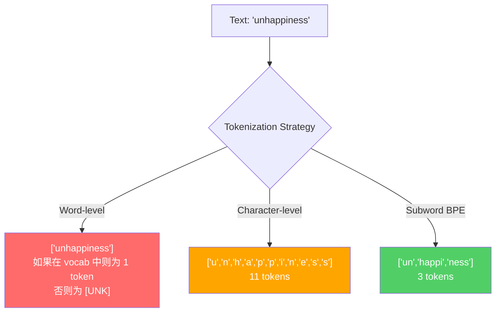
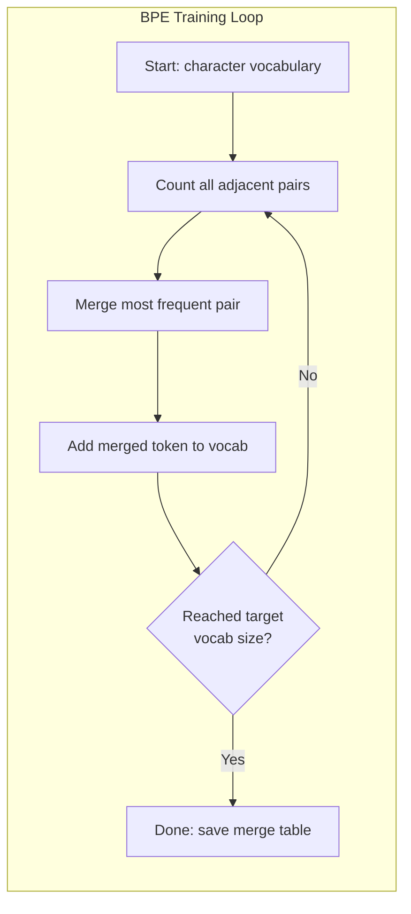
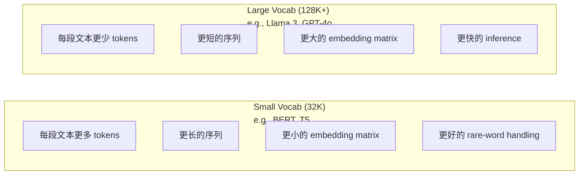

# Los tokenizers: BPE, WordPiece, SentencePiece

> Su LLM no se lee en inglés.

**Type:** Build
**Languages:** Python
**Prerequisites:** Phase 05 (NLP Foundations)
**Time:** ~90 minutes

## El objetivo del aprendizaje
- Desde la implementación de BPE, WordPiece y algoritmos de tokenización Unigram, y comparar sus estrategias de fusión
- explicar el tamaño del vocabulario  Cómo influir en la eficiencia del modelo: 过小会产生长序列, 过大会浪费嵌入参数
- 分析不同语言和代码中的代码化文物, identificando Tokenizers específicos en donde está en funcionamiento
- Utiliza tickoken y librerías de piezas de oración para tokenizar el texto, y revisa los ID de tokens generados

##  problemas
Su LLM no se lee en inglés.

Desde "Hola, mundo!" hasta [15496, 11, 995, 0] la diferencia entre los Tokenizer es: cada palabra, cada espacio, cada símbolo de punto de referencia, primero se debe convertir en un número entero, el modelo para tratarlo. Esta transformación no es secundaria.

Si hace errores, el modelo pierde capacidad, con varios Tokens para codificar palabras comunes. "Desafortunadamente" se convertirá en cuatro Tokens, en lugar de uno. "Para el texto de muchos voces, tu ventana de contexto de 128K se ha reducido en un 75%".

Usted hace una llamada de API para GPT-4 o Claude, todas las veces que se lanzan, son de acuerdo con el precio de los Tokens. Cada token generado por el modelo se consume en la computación.

## 概念
### Tres formas de perder y una forma de ganar)

Para convertir el texto en números, hay tres métodos evidentes: dos de ellos son inexplicables.

**Word-level tokenization**按空格和标点切分──"El gato se sentó" 会变成 ["El", "el gato", "sat"]──很简单──但"tokenization" 怎么办?"GPT-4o" 呢?或像"Geschwindigkeitsbegrenzung" 这样德语复合词呢?`[UNK]`token -- ése es un modelo en el que digo 我完全不知道这是什么── sólo en inglés hay más de un millón de palabras formas──再加代码,URLs,科学计数法以及另外100种语言,你需要一个无限大的词汇库──

**Character-level tokenization**走向另一个方向──"hola"将变成 ["h", "e", "l", "l", "o"]──Vocábular 很小(几百字符)──永远不会有未知代币──但序列将变得极长──一个本来是10个字级代币的句子,将变成50个字符级代币──模型必须学会"t", h",、"e" 放在一起表示"the" -- 把注意能力消耗在一个人类三岁就能学会的东西上──

**Subword tokenization**找到了平衡点──常见词保持完整:"the" 是一个代币──罕见词会分解成有意义的片段:"unhappy" 变成 ["un", "happy", "ness"]──vocabulary 保持可控(30K到128K tokens)──序列保持较短──tokens 基本消失,因为任何词都可以由子词的部分构建出来──

Cada LLM moderno utiliza la tokenización de palabras.



### BPE: codificación de pares de byte

BPE es un algoritmo de compresión de la memoria, que más tarde fue reutilizado para la tokenización.

Desde un solo carácter comienza. Cada pareja de palabras de la siguiente forma se fusiona en un nuevo Token.

Bajo está un corpus muy pequeño de BPE que funciona en la parte superior, que contiene "bajo""",bajo" y "más nuevo":

```
Corpus（带 word frequencies）:
  "lower"  x5
  "lowest" x2
  "newest" x6

Step 0 -- 从字符开始:
  l o w e r       (x5)
  l o w e s t     (x2)
  n e w e s t     (x6)

Step 1 -- 统计相邻 pairs:
  (e,s): 8    (s,t): 8    (l,o): 7    (o,w): 7
  (w,e): 13   (e,r): 5    (n,e): 6    ...

Step 2 -- Merge 最高频 pair (w,e) -> "we":
  l o we r        (x5)
  l o we s t      (x2)
  n e we s t      (x6)

Step 3 -- 重新统计并 merge (e,s) -> "es":
  l o we r        (x5)
  l o we s t      (x2)    <- 'es' 只由 'e'+'s' 形成，不是 'we'+'s'
  n e we s t      (x6)    <- 等等，'we' 前面有 'e'，'we' 后面有 's'

实际精确跟踪如下:
  在 "we" merge 之后，剩余 pairs:
  (l,o): 7   (o,we): 7   (we,r): 5   (we,s): 8
  (s,t): 8   (n,e): 6    (e,we): 6

Step 3 -- Merge (we,s) -> "wes" 或 (s,t) -> "st"（同为 8，选第一个）:
  Merge (we,s) -> "wes":
  l o we r        (x5)
  l o wes t       (x2)
  n e wes t       (x6)

Step 4 -- Merge (wes,t) -> "west":
  l o we r        (x5)
  l o west        (x2)
  n e west        (x6)

...继续，直到达到目标 vocab size。
```

La tabla de fusiones es un Tokenizer. Se debe codificar el nuevo texto, en función del orden de aplicación de las fusiones. El cuerpo de entrenamiento decide qué fusiones existen, y esta opción se forma permanentemente el contenido del modelo.



### BPE de nivel byte (GPT-2, GPT-3, GPT-4)

标准 BPE 在 Unicode characters 上运行──BPE en nivel de byte 在原始字节(0-255) 上运行── esto le dará un buen vocabulario básico de 256, capaz de procesar cualquier lenguaje o codificación, y nunca generará un token desconocido──

GPT-2 introdujo este método. El vocabulario básico cubre todos los posibles bytes.

- GPT-2: 50,257 tokens
- GPT-3.5/GPT-4: ~100,256 tokens (codigo de base cl100k)
- GPT-4o: 200 019 tokens (codificación base o200k)

### El proyecto de ley de la UE

WordPiece se parece a BPE, pero la forma de seleccionar fusiones es diferente. No utiliza la frecuencia original, sino que maximiza la probabilidad de entrenamiento de datos:

```
BPE merge criterion:      count(A, B)
WordPiece merge criterion: count(AB) / (count(A) * count(B))
```

BPE 问:哪个对出现在最频繁?WordPiece 问:哪个对出现在的频率高于随机情况的预期?

WordPiece también utiliza el prefijo "##" para expresar las subpalas de continuación:

```
"unhappiness" -> ["un", "##happi", "##ness"]
"embedding"   -> ["em", "##bed", "##ding"]
```

El prefijo "##"  tell you este pieza 延续前一个 Token──BERT utiliza WordPiece, vocabulario 为 30,522 tokens── cada variante de BERT -- DistilBERT, RoBERTa's Tokenizer 实际上是BPE,但BERT本身是 WordPiece──

### La frasePiece (Llama, T5)

SentencePiece Coloque la entrada en un caracteres Unicode original 流, incluyendo un código de código de código de código de código de código de código de código de código de código de código de código de código de código de código de código de código de código de código de código de código de código de código de código de código de código de código de código de código de código de código de código de código de código de código de código de código de código de código de código de código de código de código de código de código de código de código de código de código de código de código de código de código de código de código de código de código de código de código de código de código de código de código de código de código de código de código de código de código de código de código de código de código de código de código de código de código de código de código de código de código de código de código de código de código de código de código de código de código de código de código de código de código de código de código de código de código de código de código de código de código de código de código de código de código de código de código de código de código de código de código de código de código de código de código de código de código de código de código de código de código de código de código de código de código de código de código de código de código de código de código de código de código de código de código de código de código de código de código de código de código de código de código de código de código de código de código de código de código de código de código de código de código de código de código de código de código de código de código de código de código de código de código de código de código de código de código de código de código de código de código de código de código de código de código de código de código de código de código de código de código de código de código de código de código de código de código de código de código de código de código de código de código de código de código de código de código de código de código de código de código de código de código de código de código de código de código de código de código de código de código de código de código de código de código de código de código de código de código de código de código de código de código de código de código de código de código de código de código de código de código de código de código de código de código de código de código de código de código de código de código de código de código de código de código

SentencePiece 支持两种算法:
- **BPE mode**: La lógica de fusión similar a la estándar BPE, se utiliza para el secuencia de caracteres originales
- **Unigram mode**Desde un vocabulario grande  Inicio, luego 代移除对整体概率 影响最小的代币── es el proceso inverso de BPE -- no es fusionar, sino podar──

Llama 2 utiliza SentencePiece BPE, vocabulario 为 32,000 tokens。T5 使用 SentencePiece Unigram, vocabulario 为 32,000 tokens。 Nota: Llama 3 切换到了基于TikToken的字节级BPE Tokenizer,包含128,256 tokens。

### Compromiso de tamaño del vocabulario

Esta es una decisión de ingeniería real y tiene consecuencias medibles.



具体数字──对于一个128K词汇和4,096维嵌入,仅嵌矩阵就是128,000 x 4,096 =5,24亿参数──对于32K词汇,则是1.31亿参数──仅仅因为Tokenizer 选择不同,就会产生400M参数的差异──

Pero los vocabularios más grandes se intensificarán en el texto comprimido. Con un vocabulario de 32K se necesitarán 100 tokens, con un vocabulario de 128K se necesitarán solo 70 tokens. Esto significa que los pases generacionales se reducen en un 30%.

趋势很明确:tamaños del vocabulario 正在增长──GPT-2 使用 50,257──GPT-4 使用 ~100K──Llama 3 使用 128K──GPT-4o 使用 200K──

| Model | Vocab Size | Tokenizer Type | Avg Tokens per English Word |
|-------|-----------|----------------|---------------------------|
| BERT | 30,522 | WordPiece | ~1.4 |
| GPT-2 | 50,257 | Byte-level BPE | ~1.3 |
| Llama 2 | 32,000 | SentencePiece BPE | ~1.4 |
| GPT-4 | ~100,256 | Byte-level BPE | ~1.2 |
| Llama 3 | 128,256 | Byte-level BPE (tiktoken) | ~1.1 |
| GPT-4o | 200,019 | Byte-level BPE | ~1.0 |

### El impuesto multilingüe

Los Tokenizers basados en inglés son muy crueles para otros idiomas. En el Tokenizer de GPT-2, el promedio de cada palabra requiere de 2-3 tokens. Esto significa que la ventana de contexto de los usuarios de Korean Language es de hecho sólo la mitad de los usuarios de Inglés.

Es por eso que Llama 3 ampliará el vocabulario de 32K a 128K. La distribución de Tokens en sistemas de letras no ingleses es cada vez más grande, y la compresión entre los idiomas es cada vez más equitativa.


```figure
tokenizer-bpe
```

```figure
tokenizer-tradeoff
```

## Construirlo
### Paso 1: Tokenizaje de nivel de caracteres

Desde la base comienza. Tokenizer de nivel de caracteres proyectará cada caracter en su punto de código Unicode.

```python
class CharTokenizer:
    def encode(self, text):
        return [ord(c) for c in text]

    def decode(self, tokens):
        return "".join(chr(t) for t in tokens)
```

"Hola" se convertirá en [104, 101, 108, 108, 111]. Cada caracter es su propio Token.

### 步骤 2: Tokenizer de BPE desde cero

En el caso de los pares de datos, el par de datos se puede combinar en un par de datos.

```python
from collections import Counter

class BPETokenizer:
    def __init__(self):
        self.merges = {}
        self.vocab = {}

    def _get_pairs(self, tokens):
        pairs = Counter()
        for i in range(len(tokens) - 1):
            pairs[(tokens[i], tokens[i + 1])] += 1
        return pairs

    def _merge_pair(self, tokens, pair, new_token):
        merged = []
        i = 0
        while i < len(tokens):
            if i < len(tokens) - 1 and tokens[i] == pair[0] and tokens[i + 1] == pair[1]:
                merged.append(new_token)
                i += 2
            else:
                merged.append(tokens[i])
                i += 1
        return merged

    def train(self, text, num_merges):
        tokens = list(text.encode("utf-8"))
        self.vocab = {i: bytes([i]) for i in range(256)}

        for i in range(num_merges):
            pairs = self._get_pairs(tokens)
            if not pairs:
                break
            best_pair = max(pairs, key=pairs.get)
            new_token = 256 + i
            tokens = self._merge_pair(tokens, best_pair, new_token)
            self.merges[best_pair] = new_token
            self.vocab[new_token] = self.vocab[best_pair[0]] + self.vocab[best_pair[1]]

        return self

    def encode(self, text):
        tokens = list(text.encode("utf-8"))
        for pair, new_token in self.merges.items():
            tokens = self._merge_pair(tokens, pair, new_token)
        return tokens

    def decode(self, tokens):
        byte_sequence = b"".join(self.vocab[t] for t in tokens)
        return byte_sequence.decode("utf-8", errors="replace")
```

El ciclo de entrenamiento es el núcleo de BPE: pares de estadísticas, pares de fusiones,重复── cada vez que se fusiona, el número total de tokens se reduce──`num_merges`Después de la ronda, el vocabulario de 256 bytes de base creció a 256 + num_merges.

La codificación se aplicará según el aprendizaje de la aplicación de la combinación. Esto es importante. Si la combinación 1 crea "th", la combinación 5 crea "the", entonces la codificación debe primero aplicar la combinación 1, de modo que "the" 才能在 merge 5 中由 "th" + "e" 形成──

La decodificación es un proceso inverso: en el vocabulario, busque cada token ID, conecte bytes, y luego decode en UTF-8.

### 步骤 3: Encodigo y decodificación de viaje de ida y vuelta

```python
corpus = (
    "The cat sat on the mat. The cat ate the rat. "
    "The dog sat on the log. The dog ate the frog. "
    "Natural language processing is the study of how computers "
    "understand and generate human language. "
    "Tokenization is the first step in any NLP pipeline."
)

tokenizer = BPETokenizer()
tokenizer.train(corpus, num_merges=40)

test_sentences = [
    "The cat sat on the mat.",
    "Natural language processing",
    "tokenization pipeline",
    "unhappiness",
]

for sentence in test_sentences:
    encoded = tokenizer.encode(sentence)
    decoded = tokenizer.decode(encoded)
    raw_bytes = len(sentence.encode("utf-8"))
    ratio = len(encoded) / raw_bytes
    print(f"'{sentence}'")
    print(f"  Tokens: {len(encoded)} (from {raw_bytes} bytes) -- ratio: {ratio:.2f}")
    print(f"  Roundtrip: {'PASS' if decoded == sentence else 'FAIL'}")
```

La relación de compresión  tell you Tokenizer has more effective──ratio 为0.50 Indica que Tokenizer comprimirá el texto hasta los bytes originales, la mitad de la cantidad de Tokens──越低越好── en el corpus de entrenamiento, la relación se encuentra muy bien── en el "insatisfacción" de este tipo fuera de distribución 文本上(no aparece en el corpus), la relación se encuentra peor -- Tokenizer 会对未见的模式 回归到字符级编码──

### 步骤 4: Compare con el tiktoken

```python
import tiktoken

enc = tiktoken.get_encoding("cl100k_base")

texts = [
    "The cat sat on the mat.",
    "unhappiness",
    "Hello, world!",
    "def fibonacci(n): return n if n < 2 else fibonacci(n-1) + fibonacci(n-2)",
    "Geschwindigkeitsbegrenzung",
]

for text in texts:
    our_tokens = tokenizer.encode(text)
    tiktoken_tokens = enc.encode(text)
    tiktoken_pieces = [enc.decode([t]) for t in tiktoken_tokens]
    print(f"'{text}'")
    print(f"  Our BPE:   {len(our_tokens)} tokens")
    print(f"  tiktoken:  {len(tiktoken_tokens)} tokens -> {tiktoken_pieces}")
```

Tiktoken utiliza el mismo algoritmo, pero está entrenado en 100 GB de texto, y contiene 100.000 fusiones. El algoritmo es el mismo. La diferencia está en entrenar datos y fusiones. Tu Tokenizer sólo se entraña en una sola sección, y sólo hay 40 fusiones, no puede ser un corpus a gran escala.

### Paso 5: Análisis del vocabulario

```python
def analyze_vocabulary(tokenizer, test_texts):
    total_tokens = 0
    total_chars = 0
    token_usage = Counter()

    for text in test_texts:
        encoded = tokenizer.encode(text)
        total_tokens += len(encoded)
        total_chars += len(text)
        for t in encoded:
            token_usage[t] += 1

    print(f"Vocabulary size: {len(tokenizer.vocab)}")
    print(f"Total tokens across all texts: {total_tokens}")
    print(f"Total characters: {total_chars}")
    print(f"Avg tokens per character: {total_tokens / total_chars:.2f}")

    print(f"\nMost used tokens:")
    for token_id, count in token_usage.most_common(10):
        token_bytes = tokenizer.vocab[token_id]
        display = token_bytes.decode("utf-8", errors="replace")
        print(f"  Token {token_id:4d}: '{display}' (used {count} times)")

    unused = [t for t in tokenizer.vocab if t not in token_usage]
    print(f"\nUnused tokens: {len(unused)} out of {len(tokenizer.vocab)}")
```

Esto revelará la distribución de Zipf en tu vocabulario. Pocas fichas 占占占占主导(空格"",the"、"e") ∼ La mayoría de fichas 很少被使用── Producción de los tokenizers ∼ Producción de los niveles de fichas ∼ Producción de fichas ∼ Producción de fichas ∼ Producción de fichas ∼ Producción de fichas ∼ Producción de fichas ∼ Producción de fichas ∼ Producción de fichas ∼ Producción de fichas ∼ Producción de fichas ∼ Producción de fichas ∼ Producción de fichas ∼ Producción de fichas ∼ Producción de fichas ∼ Producción de fichas ∼ Producción de fichas ∼ Producción de fichas ∼ Producción de fichas ∼ Producción de fichas ∼ Producción de fichas ∼ Producción de fichas ∼ Producción de fichas ∼ Producción de fichas ∼ Producción de fichas ∼

## Usalo
Tu BPE puede trabajar. Ahora mira cómo es el instrumento de producción.

### Tiktoken (OpenAI)

```python
import tiktoken

enc = tiktoken.get_encoding("cl100k_base")

text = "Tokenizers convert text to integers"
tokens = enc.encode(text)
print(f"Tokens: {tokens}")
print(f"Pieces: {[enc.decode([t]) for t in tokens]}")
print(f"Roundtrip: {enc.decode(tokens)}")
```

Tiktoken utiliza Rust 编写,并提供 Python enlaces. Puede codificar millones de tokens por segundo.

### Embracing Face tokenizers

```python
from tokenizers import Tokenizer
from tokenizers.models import BPE
from tokenizers.trainers import BpeTrainer
from tokenizers.pre_tokenizers import ByteLevel

tokenizer = Tokenizer(BPE())
tokenizer.pre_tokenizer = ByteLevel()

trainer = BpeTrainer(vocab_size=1000, special_tokens=["<pad>", "<eos>", "<unk>"])
tokenizer.train(["corpus.txt"], trainer)

output = tokenizer.encode("The cat sat on the mat.")
print(f"Tokens: {output.tokens}")
print(f"IDs: {output.ids}")
```

Abrazar la biblioteca de tokenizers faciales  Base es igual a Rust ⋅ puede ser en unos segundos basado en GB  Clasificación corpora  entrenar BPE ⋅ es el instrumento que usted entrenar su propio modelo ⋅ utilizar

### Cargando el Tokenizer de Llama

```python
from transformers import AutoTokenizer

tokenizer = AutoTokenizer.from_pretrained("meta-llama/Llama-3.1-8B")

text = "Tokenizers are the unsung heroes of LLMs"
tokens = tokenizer.encode(text)
print(f"Token IDs: {tokens}")
print(f"Tokens: {tokenizer.convert_ids_to_tokens(tokens)}")
print(f"Vocab size: {tokenizer.vocab_size}")

multilingual = ["Hello world", "Hola mundo", "Bonjour le monde"]
for text in multilingual:
    ids = tokenizer.encode(text)
    print(f"'{text}' -> {len(ids)} tokens")
```

El vocabulario de 128K de Llama 3 para la compresión de textos no ingleses es claramente superior al vocabulario de 50K de GPT-2― puedes comprobar esto por ti mismo-- con varios idiomas codificar la misma frase, y luego统计 Tokens―

##  entregarlo
本课会产出                                                                                                                                                                                                                                                                                                                                                                                                                                                                                                                         `outputs/prompt-tokenizer-analyzer.md`-- Un prompt replicable, para analizar la eficiencia de tokenización de cualquier texto y conjunto de modelos.

##  ejercicios
1. Modificar el Tokenizer BPE, hacer que sea en cada paso de fusión imprimir el vocabulario, observar cómo "t" + "h" se convierte en "th", luego "th" + "e" cómo se convierte en "the"

2. 向 BPE Tokenizer 添加 tokens especiales(`<pad>`¿Qué es esto?`<eos>`¿Qué es esto?`<unk>`)── darles las identidades 0、1、2,并相应地移动所有其他 Tokens── lograr un paso de pre-tokenization, en el funcionamiento BPE 之前 en el espacio blanco 切分──

3. 实现 WordPiece merge criterion(usar la proporción de probabilidad en lugar de la frecuencia) ―― en el mismo corpus, con el mismo combinar la cantidad de entrenamiento BPE y WordPiece── comparar vocabularios generados -- 哪一个产生的子词在语言学上更有意义?

4. Construir un punto de referencia de eficiencia del Tokenizer multilingüe―selección de 10 frases de inglés, japonés, chino, japonés y árabe.  Usar ticktoken (cl100k_base) para tokenizar cada frase, y medir el promedio de cada caracter Tokens―quantificar el "impuesto multilingüe" de cada idioma.

5. En un corpus más grande, entrenar tu BPE Tokenizer (en inglés) para hacer que el índice de compresión de un mismo texto alcance el 10% de los tokens. Esto te hará comprender la relación entre el tamaño del corpus, el conteo de la combinación y la calidad de la compresión.

## 关键术语: "El hombre es un hombre"
| Term | What people say | What it actually means |
|------|----------------|----------------------|
| Token | “一个词” | 模型 vocabulary 中的一个单元 -- 可以是字符、subword、word，或 multi-word chunk |
| BPE | “某种压缩东西” | Byte Pair Encoding -- 迭代 merge 出现最频繁的相邻 token pair，直到达到目标 vocabulary size |
| WordPiece | “BERT 的 Tokenizer” | 类似 BPE，但 merges 最大化 likelihood ratio count(AB)/(count(A)*count(B))，而不是原始 frequency |
| SentencePiece | “一个 Tokenizer library” | 一种 language-agnostic Tokenizer，在没有 pre-tokenization 的情况下直接处理原始 Unicode，并支持 BPE 和 Unigram algorithms |
| Vocabulary size | “它知道多少词” | 唯一 Tokens 的总数：GPT-2 有 50,257，BERT 有 30,522，Llama 3 有 128,256 |
| Fertility | “不是 Tokenizer 术语” | 每个词的平均 Tokens 数 -- 衡量 Tokenizer 在不同语言上的效率（1.0 是理想值，3.0 表示模型要多工作三倍） |
| Byte-level BPE | “GPT 的 Tokenizer” | 在原始 bytes（0-255）而不是 Unicode characters 上运行的 BPE，保证任何输入都不会产生 unknown tokens |
| Merge table | “Tokenizer 文件” | 训练期间学习到的有序 pair merges 列表 -- 这就是 Tokenizer 本身，而且顺序很重要 |
| Pre-tokenization | “按空格切分” | 在 subword tokenization 之前应用的规则：whitespace splitting、digit separation、punctuation handling |
| Compression ratio | “Tokenizer 有多高效” | 生成的 Tokens 数除以输入 bytes 数 -- 越低表示压缩越好，inference 越快 |

## 延伸阅读
- [Sennrich et al., 2016 -- "Neural Machine Translation of Rare Words with Subword Units"](https://arxiv.org/abs/1508.07909)-- Este artículo introducirá BPE en la PNL, convirtiendo un algoritmo de compresión de 1994 en la base de la tokenización moderna
- [Kudo & Richardson, 2018 -- "SentencePiece: A simple and language independent subword tokenizer"](https://arxiv.org/abs/1808.06226)-- Tokenización lingüística-agnóstica, haciendo que los modelos multilingües
- [OpenAI tiktoken repository](https://github.com/openai/tiktoken)-- 用 Rust 编写并带有Python绑定的生产级 BPE 实现, por GPT-3.5/4/4o 使用
- [Hugging Face Tokenizers documentation](https://huggingface.co/docs/tokenizers)-- 具備 腐性能的生产级 Tokenizer formación
