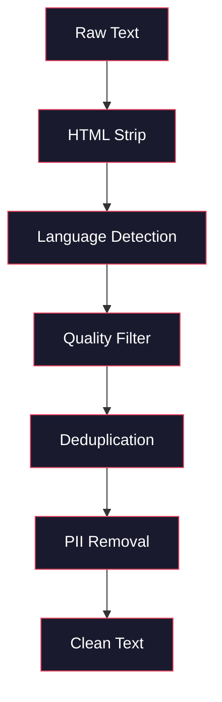
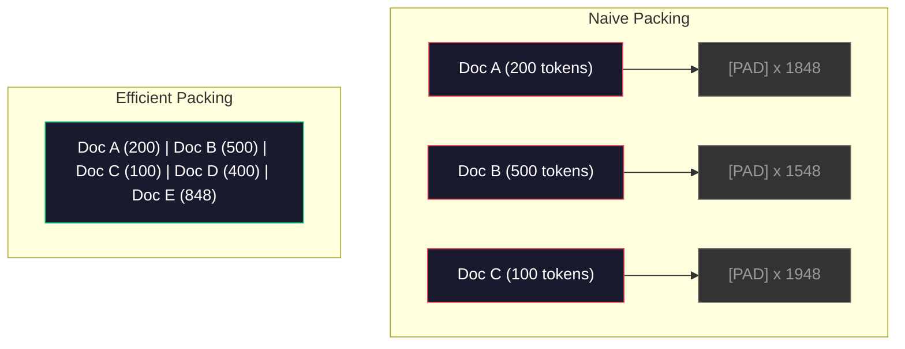

# Los datos de la formación previa

> El modelo es un espejo de superficie. Reflejará cualquier dato que le dé.

**Type:** Build
**Languages:** Python
**Prerequisites:** Phase 10, Lessons 01-02 (Tokenizers, Building a Tokenizer)
**Time:** ~90 minutes

## El objetivo del aprendizaje

- Construir un flujo de datos de tubería en el caso de que no se cargue todo el dato en memoria, realizar Tokenization, cutocks, shuffles y lotes de textos de TB
- 实现真实预训管线 中使用的数据质量过器(deduplication、language detection、content filtering)
- Crear un conjunto de entrenamientos de longitud fija,并正确处理注意面具和文档边界
- Perfil de la tubería de rendimiento, asegurar el cargador de datos 能跟上 GPU 训练速度

##  problemas

Ya tienes un Tokenizer. Ahora necesitas datos.

No es un conjunto de datos, sino un archivo CSV, sino que es un proyecto de TB que se ha desarrollado en el mundo de la tecnología.

La mayoría de las personas pensaban que entrenar un LLM en su núcleo era un modelo de estructura. No es cierto. Llama 3 utilizó 15.6 billones de tokens. GPT-3 utilizó 300 billones. DeepSeek-V2 utilizó 8.1 billones. La estructura de estos tres es la misma: un bloque de transformador, que contiene atención y la primera capa.

El documento de Chinchilla de DeepMind lo explica con precisión. Para un presupuesto de cálculo determinado, existe una proporción óptima entre el número de tokens de entrenamiento y el número de parámetros de modelos. Chinchilla muestra que la mayoría de los modelos de 2022 están gravemente subtraídos: en comparación con la cantidad de datos que ven, sus parámetros son demasiado grandes. Un modelo de parámetros de 70B entrenado en 1,4 billones de tokens (Chinchilla-optimal) es mejor que un modelo de 280B entrenado en 300 mil millones de tokens (Gopher).

Tu flujo de datos decide si tu modelo aprende lenguaje o ruido.

## 核心概念 核心概念 核心概念 核心概念

### ¿De dónde vienen los datos?

Cada modelo de lenguaje grande se entrena en datos mixtos de múltiples fuentes. Para la mayoría de los laboratorios, la composición de datos es estrictamente confidencial, pero ya sabemos lo suficiente para entender estas categorías.

| Source | Size | Quality | Used By |
|--------|------|---------|---------|
| Common Crawl | ~250 TB raw | 低（需要大量过滤） | GPT-3, Llama, most open models |
| Wikipedia | ~20 GB | 高 | Every major LLM |
| GitHub code | ~1 TB+ | 中等（大量重复、废弃代码） | StarCoder, CodeLlama, DeepSeek-Coder |
| Books (BookCorpus, Pile) | ~100 GB | 高 | GPT-2, GPT-3, early models |
| Academic papers (arXiv, S2ORC) | ~100 GB | STEM 领域质量高 | Llama, Galactica |
| StackOverflow, Reddit | ~100 GB | 中等 | Llama, Falcon |
| Curated web (C4, RefinedWeb) | ~5 TB | 中高（已预过滤） | T5, Falcon |

Llama 3 reveló su proporción de datos mezclados: aproximadamente el 50% de datos web, el 25% de código, el 13% de libros y documentos académicos, el 8% de datos matemáticos, así como el 4% de datos web multilingües.

Por ejemplo, el volumen y la cantidad de datos web son igualmente importantes. Los datos web son demasiado numerosos, el modelo se convierte en Reddit. El código es demasiado pequeño, no puede programarse.

### Número de datos

Datos web primitivos 很脏──Un típico depósito de rastreo común 包含:

- Etiquetas HTML y JavaScript
- 模板化 cabeceras, pies, menús de navegación
- 重复页面(total y casi igual)
- 机器生成的垃圾邮件
- Información de identificación personal (PII)
- 低质量文本(关键词列表、SEO spam)
- Contenido no escrito en formato de texto codificado

Limpiar no es una opción. Determinó si el modelo genera segmentos continuos o si saca etiquetas HTML mezcladas de la lista de productos.



Cada paso eliminará el ruido:

**HTML stripping:**移除所有标记──只保留可见文本内容──像 `trafilatura`O `readability`Este tipo de biblioteca extrae contenido de artículos, al mismo tiempo que abandona la dirección, la publicidad y el contenido de modelado.

**Language detection:**Utiliza fastText's Language Identification Model (FASTTEXT) para cada documento para realizar una clasificación. Si un documento es clasificado en inglés, pero la confianza es inferior a 0.8, es muy probable que no sea un inglés puro.

**Quality filtering:**Aquí comienza a ser interesante. RefinedWeb (en inglés: RefinedWeb) utiliza filtros basados en la perplejidad: primero entrenar un pequeño modelo de lenguaje en Wikipedia, luego dar a cada documento un par de partes.

**Deduplication:**单个最有影响力的清洗步骤――Common Crawl 包含海量重复页面:法律免责声明、cookie notifications、服务条款──在重复数据上训练会浪费计算,并可能导致模型记忆并逐字吐出特定段落──

**PII removal:**姓名、电子邮件地址、电话号码、社会安全号码── para la PII estructurada utiliza la inspección basada en regex, para el nombre en la siguiente utiliza modelos NER──

### Utiliza MinHash hacer la deduplicación

精确分复: se hace hash, se elimina la repetición de cada documento, pero el verdadero problema es la repetición de dos partes del mismo artículo de noticias, el anuncio alrededor es un poco diferente, es el repetición de casi 95% del mismo contenido, pero no coincide en la comparación de los guiones.

MinHash + Hashing sensitivo a la localidad (LSH) puede resolver este problema de manera eficaz.


Y ahora me lo digo.

1. **Shingling:**将每个文档转换为 n-gram 集合(例如词或字符的 5gram) ・・・"la zorra marrón rápida" 使用 3 palabras barandillas 会变成 {"la zorra marrón rápida", "zorra marrón rápida"}。

2. **MinHash:**Para cada conjunto de barandas de archivo, calcular k 个 hash 值── cada hash 值 es una función hash diferente ‒ bajo el hash mínimo de todos los barandas─ así se crea una firma  de tamaño fijo, para estimar de forma aproximada la similitud de Jaccard entre cualquier dos documentos──

3. **LSH:**Según la banda de firma de MinHash, se divide el archivo en cubos.

4. **Verify:**Para cada par de candidatos, calcular la similitud de Jaccard exacta. Si la similitud supera el valor  (normalmente 0.8), se elimina una copia de la misma.

El equipo de Llama informó que, a través de la deduplicación, eliminaron aproximadamente el 38% de los datos web.

### Envasado de secuencias

Su modelo espera fijar la longitud de la secuencia de entrada. Su archivo de longitud es variable. Algunos son 50 Tokens. Algunos son 50.000 Tokens.

Primera práctica: poner cada documento en el pad hasta la mayor secuencia de longitud.

Mejor práctica: poner un paquete de archivos en una serie, no utilizar el token de final de secuencia separado.



La máscara de atención 必须正确设置──同一个包装序列 中,Token of Document A 不应关注 Document B 的Token──这需要一个区块斜角的注意面罩──

长文档会在序列边界处被切断或拆分分分点很重要:在句子中分分会迫使模型看到不完整的思路──有些管道会尽可能把分分分分分分到齐到段落或句子边界──

### Ley de escala de Chinchilla

对于固定计算预算 C(以 FLOPs 衡量),最优模型大小 N 和数据集 大小 D 遵循:

```
N_opt ~ C^0.5
D_opt ~ C^0.5
```

En la práctica, esto significa que debes tener una gran cantidad de parámetros de un modelo de 10x más de tamaño y un conjunto de datos de tamaño igual a la proporción de un modelo de 10x más de tamaño, necesita aproximadamente 10x más de entrenamiento Token, para alcanzar la misma pérdida.

| Model | Parameters | Training Tokens | Chinchilla-Optimal? |
|-------|-----------|----------------|-------------------|
| GPT-3 | 175B | 300B | 否（undertrained 3-4x） |
| Chinchilla | 70B | 1.4T | 是（按设计） |
| Llama 2 | 70B | 2T | Overtrained（有意为之） |
| Llama 3 | 70B | 15T | 严重 overtrained |

Llama 3 intencionalmente violaron la ley de Chinchilla. Meta encontró que, en más datos sobreentrenamiento, la relación de sobrecomputación-óptima, generará modelos más adecuados para la inferencia. El costo de entrenamiento adicional solo se paga una vez, pero los modelos más pequeños en el servicio a largo plazo cuestan menos.


```figure
l5-data-pipeline
```

## Construirlo

### Paso 1: Limpiado de texto

剥离 HTML、规范化白空间、移除文本内容──我们将使用公共域文本(Proyecto Gutenberg) como pequeño corpus──

```python
import re

def clean_text(text):
    text = re.sub(r"<[^>]+>", "", text)
    text = re.sub(r"http\S+", "", text)
    text = re.sub(r"[^\x20-\x7E\n]", "", text)
    text = re.sub(r"\n{3,}", "\n\n", text)
    text = re.sub(r" {2,}", " ", text)
    return text.strip()

def quality_filter(text, min_words=50, max_ratio_caps=0.3, max_ratio_special=0.1):
    words = text.split()
    if len(words) < min_words:
        return False
    caps_ratio = sum(1 for w in words if w.isupper()) / len(words)
    if caps_ratio > max_ratio_caps:
        return False
    special_chars = sum(1 for c in text if not c.isalnum() and not c.isspace())
    if special_chars / max(len(text), 1) > max_ratio_special:
        return False
    return True
```

Este filtro de calidad capturará spam de SEO (todos los CAPS) ✓ generar ruido de máquinas (todos los CAPS) ✓ alto porcentaje de caracteres especiales (todos los tipos de caracteres) ✓ y páginas de contenido (todos los tipos de contenido) ✓ ✓ ✓ ✓ ✓ ✓ ✓ ✓ ✓ ✓ ✓ ✓ ✓ ✓ ✓ ✓ ✓ ✓ ✓ ✓ ✓ ✓ ✓ ✓ ✓ ✓ ✓ ✓ ✓ ✓ ✓ ✓ ✓ ✓ ✓ ✓ ✓ ✓ ✓ ✓ ✓ ✓ ✓ ✓ ✓ ✓ ✓ ✓ ✓ ✓ ✓ ✓ ✓ ✓ ✓ ✓ ✓ ✓ ✓ ✓ ✓ ✓ ✓ ✓ ✓ ✓ ✓ ✓ ✓ ✓ ✓ ✓ ✓ ✓ ✓ ✓ ✓ ✓ ✓ ✓ ✓ ✓ ✓ ✓ ✓ ✓ ✓ ✓ ✓ ✓ ✓ ✓ ✓ ✓ ✓ ✓ ✓ ✓ ✓ ✓ ✓ ✓ ✓ ✓ ✓ ✓ ✓ ✓ ✓ ✓ ✓ ✓ ✓ ✓ ✓ ✓ ✓ ✓ ✓ ✓ ✓ ✓ ✓ ✓ ✓ ✓ ✓ ✓ ✓ ✓ ✓ ✓ ✓ ✓ ✓ ✓ ✓ ✓ ✓ ✓ ✓ ✓ ✓ ✓ ✓ ✓ ✓ ✓ ✓ ✓ ✓ ✓ ✓ ✓ ✓ ✓ ✓ ✓ ✓ ✓ ✓ ✓ ✓ ✓ 

### 步骤 2: Desduplicación de MinHash

Desde el 0 de la implementación de MinHash.`hashlib`¿Qué es eso?

```python
import hashlib
from collections import defaultdict

def get_shingles(text, k=5):
    words = text.lower().split()
    if len(words) < k:
        return set()
    return {" ".join(words[i:i+k]) for i in range(len(words) - k + 1)}

def minhash_signature(shingles, num_hashes=128):
    signature = []
    for i in range(num_hashes):
        min_hash = float("inf")
        for shingle in shingles:
            h = int(hashlib.sha256(f"{i}:{shingle}".encode()).hexdigest(), 16)
            min_hash = min(min_hash, h)
        signature.append(min_hash)
    return signature

def lsh_buckets(signature, bands=16):
    rows_per_band = len(signature) // bands
    buckets = []
    for b in range(bands):
        start = b * rows_per_band
        band_data = tuple(signature[start:start + rows_per_band])
        bucket_hash = hashlib.md5(str(band_data).encode()).hexdigest()
        buckets.append((b, bucket_hash))
    return buckets

def deduplicate(documents, threshold=0.8, num_hashes=128, bands=16):
    signatures = []
    shingle_sets = []
    for doc in documents:
        shingles = get_shingles(doc)
        shingle_sets.append(shingles)
        signatures.append(minhash_signature(shingles, num_hashes))

    bucket_map = defaultdict(list)
    for doc_idx, sig in enumerate(signatures):
        for band_id, bucket_hash in lsh_buckets(sig, bands):
            bucket_map[(band_id, bucket_hash)].append(doc_idx)

    duplicate_pairs = set()
    for bucket_docs in bucket_map.values():
        if len(bucket_docs) < 2:
            continue
        for i in range(len(bucket_docs)):
            for j in range(i + 1, len(bucket_docs)):
                duplicate_pairs.add((bucket_docs[i], bucket_docs[j]))

    removed = set()
    for i, j in duplicate_pairs:
        if i in removed or j in removed:
            continue
        s1, s2 = shingle_sets[i], shingle_sets[j]
        if not s1 or not s2:
            continue
        jaccard = len(s1 & s2) / len(s1 | s2)
        if jaccard >= threshold:
            removed.add(j)

    return [doc for idx, doc in enumerate(documents) if idx not in removed], len(removed)
```

`num_hashes=128`Y `bands=16`参数控制精度回忆交易――更多哈希将给出更准确的相似性 估计――更多频段将提高回忆――捕获更多重复项),代价是更多的假正――这些值对典型的网页文本 效果很好――

### Paso 3: Tokeniza y no tienes que marcar el proceso

¢¢¢¢¢¢¢¢¢¢¢¢¢¢¢¢¢¢¢¢¢¢¢¢¢¢¢¢¢¢¢¢¢¢¢¢¢¢¢¢¢¢¢¢¢¢¢¢¢¢¢¢¢¢¢¢¢¢¢¢¢¢¢¢¢¢¢¢¢¢¢¢¢¢¢¢¢¢¢¢¢¢¢¢¢¢¢¢¢¢¢¢¢¢¢¢¢¢¢¢¢¢¢¢¢¢¢¢¢¢¢¢¢¢¢¢¢¢¢¢¢¢¢¢¢¢¢¢¢¢¢¢¢¢¢¢¢¢¢¢¢¢¢¢¢¢¢¢¢¢¢¢¢¢¢¢¢¢¢¢¢¢¢¢¢¢¢¢¢¢¢¢¢¢¢¢¢¢¢¢¢¢¢¢¢¢¢¢¢¢¢¢¢¢¢¢¢¢¢¢¢¢¢¢¢¢¢¢¢¢¢¢¢¢¢¢¢¢¢¢¢¢¢¢¢¢¢¢¢¢¢¢¢¢¢¢¢¢¢¢¢¢¢¢¢¢¢¢¢¢¢¢¢¢¢¢¢¢¢¢¢¢¢¢¢¢¢¢¢¢¢¢¢¢¢¢¢¢¢¢¢¢¢¢¢¢¢¢¢¢¢¢¢¢¢¢¢¢¢¢¢¢¢¢¢¢¢¢¢¢¢¢¢¢¢¢¢¢¢¢¢¢¢¢¢¢¢¢¢¢¢¢¢¢¢¢¢¢¢¢¢¢¢¢¢¢¢¢¢¢¢¢¢¢¢¢¢¢¢¢¢¢¢¢¢¢¢¢¢¢¢¢¢¢¢¢¢¢¢¢¢¢¢¢¢¢¢¢¢¢¢¢¢¢¢¢¢¢¢¢¢¢¢¢¢¢¢¢¢¢¢¢¢¢¢¢¢¢¢¢¢¢¢¢¢¢¢¢¢¢¢¢¢¢¢¢¢¢¢¢¢¢¢¢¢¢¢¢¢¢¢¢¢¢¢¢¢¢¢¢¢¢¢¢¢¢¢¢¢¢¢¢¢¢¢¢¢¢¢¢¢¢¢¢¢¢¢¢¢¢¢¢¢¢¢¢¢¢¢¢¢¢¢¢¢¢¢¢¢

```python
def tokenize_corpus(documents, tokenizer):
    all_tokens = []
    for doc in documents:
        tokens = tokenizer.encode(doc)
        all_tokens.extend(tokens)
        all_tokens.append(tokenizer.eos_id)
    return all_tokens

def pack_sequences(token_ids, seq_length, pad_id=0):
    sequences = []
    attention_masks = []
    for i in range(0, len(token_ids), seq_length):
        seq = token_ids[i:i + seq_length]
        mask = [1] * len(seq)
        if len(seq) < seq_length:
            pad_count = seq_length - len(seq)
            seq = seq + [pad_id] * pad_count
            mask = mask + [0] * pad_count
        sequences.append(seq)
        attention_masks.append(mask)
    return sequences, attention_masks
```

### Paso 4: Utiliza el DataLoader de entrenamiento

产出包装序列的随机批次──这是训练循环的内容──

```python
import random

class PreTrainingDataLoader:
    def __init__(self, sequences, attention_masks, batch_size, shuffle=True):
        self.sequences = sequences
        self.attention_masks = attention_masks
        self.batch_size = batch_size
        self.shuffle = shuffle

    def __len__(self):
        return (len(self.sequences) + self.batch_size - 1) // self.batch_size

    def __iter__(self):
        indices = list(range(len(self.sequences)))
        if self.shuffle:
            random.shuffle(indices)
        for start in range(0, len(indices), self.batch_size):
            batch_idx = indices[start:start + self.batch_size]
            batch_seqs = [self.sequences[i] for i in batch_idx]
            batch_masks = [self.attention_masks[i] for i in batch_idx]
            yield batch_seqs, batch_masks
```

### Paso 5: Estadísticas de conjunto de datos

計算重要数字:总 Token 数、唯一 Token 数、compresión ratio、文档长度分布──

```python
from collections import Counter

def compute_statistics(documents, token_ids, sequences, tokenizer_vocab_size):
    total_chars = sum(len(d) for d in documents)
    total_tokens = len(token_ids)
    unique_tokens = len(set(token_ids))
    compression_ratio = total_chars / total_tokens

    doc_lengths = [len(d.split()) for d in documents]
    avg_doc_length = sum(doc_lengths) / max(len(doc_lengths), 1)
    max_doc_length = max(doc_lengths) if doc_lengths else 0
    min_doc_length = min(doc_lengths) if doc_lengths else 0

    token_counts = Counter(token_ids)
    top_tokens = token_counts.most_common(10)

    non_pad_tokens = sum(sum(1 for t in seq if t != 0) for seq in sequences)
    total_positions = sum(len(seq) for seq in sequences)
    utilization = non_pad_tokens / max(total_positions, 1)

    stats = {
        "total_documents": len(documents),
        "total_characters": total_chars,
        "total_tokens": total_tokens,
        "unique_tokens": unique_tokens,
        "vocab_utilization": unique_tokens / tokenizer_vocab_size,
        "compression_ratio": compression_ratio,
        "avg_doc_length_words": avg_doc_length,
        "max_doc_length_words": max_doc_length,
        "min_doc_length_words": min_doc_length,
        "num_sequences": len(sequences),
        "sequence_utilization": utilization,
        "top_10_tokens": top_tokens,
    }
    return stats
```

La relación de compresión  te dice que el Tokenizer en este corpus tiene mucho alto efecto― Inglés texto normalmente se comprime a cada token ∼3 a 4 caracteres― Si ves cada token ∼1,5 caracteres, indique que tu Tokenizer 切分得太激进― Si ves 8+, indique que ha aprendido a fusionar en un área muy específica―

Utilización de secuencias  le dice que hay mucho de las secuencias empaquetadas es datos reales, no relleno.

## Usalo

### Con respecto a los conjuntos de datos HuggingFace

通过 HuggingFace's Datos de la biblioteca 加载同一个 corpus,并比较管道 速度──

```python
from datasets import load_dataset
from transformers import AutoTokenizer

ds = load_dataset("wikitext", "wikitext-2-raw-v1", split="train")
tokenizer = AutoTokenizer.from_pretrained("meta-llama/Meta-Llama-3-8B")

import time

start = time.time()
tokenized = ds.map(
    lambda x: tokenizer(x["text"], truncation=True, max_length=2048),
    batched=True,
    num_proc=4,
)
hf_time = time.time() - start
total_tokens = sum(len(t) for t in tokenized["input_ids"])
print(f"HuggingFace: {total_tokens:,} tokens in {hf_time:.2f}s ({total_tokens/hf_time:,.0f} tokens/sec)")
```

HuggingFace pipeline en el nivel inferior utiliza tokenizers de Rust, y en 4 núcleos arriba realizar un proceso de procesamiento. Su puro Python pipeline 会慢 10-50x. Esta diferencia es la razón por la que el equipo de producción utiliza tokenizers compilados.

##  entregarlo

Este curso se produce en un momento, para la verificación y la regulación del LLM  formación de la tubería de datos en el medio.`outputs/prompt-data-quality-checker.md`¿Qué es eso?

##  ejercicios

1. **Easy:**Utiliza un método simple de iniciación (字符集分析) hacia la limpieza del tubo 添加语言检测──只保留英文文档,并测量有多少文档被移除──
2. **Medium:**Además de la deduplicación cercana de MinHash, utiliza hashes SHA-256 para lograr la deduplicación exacta. En un corpus de raspaduras web, compara dos métodos para capturar la cantidad de repeticiones.
3. **Hard:**Construir un filtro de calidad basado en la perplejidad―en Wikipedia 文本上训练一个小型大грам语言模型,根据 perplexity 给每个文档打分,并移除底部20%―en comparación con los datos filtrados y no filtrados en el entrenamiento del modelo 输出质量―

## 关键术语: "El hombre es un hombre"

| Term | 人们通常怎么说 | 它真正的含义 |
|------|----------------|----------------------|
| Common Crawl | “互联网” | 一个每月抓取 web 的非营利组织：约 250TB 原始数据，是大多数 LLM 训练数据的起点 |
| MinHash | “某种 hashing trick” | 一种使用固定大小 signature 来估计集合间 Jaccard similarity 的技术：支持大规模 near-duplicate detection |
| LSH | “Locality-Sensitive Hashing” | 一种把相似项分到同一 bucket 的方法：将 pairwise comparisons 从 O(n^2) 降到接近线性 |
| Sequence packing | “拼接文档” | 用正确的 attention masks 把多个文档放入固定长度序列：消除 padding 浪费 |
| Chinchilla scaling | “在更多数据上训练” | 对于固定计算预算，最优性能要求模型大小和训练 Token 数大致等比例扩展 |
| Fertility | “Tokens per word” | 每个词平均对应的 Token 数：GPT-4 中英文约为 1.3，非拉丁文字系统更高 |
| Data mixing | “选择训练数据” | code、text、math、multilingual data 之间的比例：没有公式，需要实验 |
| Perplexity filter | “质量打分” | 使用小型语言模型给文档打分：高 perplexity 意味着文本不像干净的 reference data |
| Deduplication | “移除副本” | 消除完全重复和近似重复文档：通常会移除 30-40% 的原始 web data |
| Attention mask | “要看哪些 Token” | 一种 binary mask，用于阻止 packed sequences 中跨文档边界的 Attention |

## 延伸阅读

- [Hoffmann et al., 2022 -- Training Compute-Optimal Large Language Models (Chinchilla)](https://arxiv.org/abs/2203.15556)--  Cambiar nuestra comprensión de la forma en que el tamaño de los datos
- [Penedo et al., 2023 -- The RefinedWeb Dataset for Falcon LLM](https://arxiv.org/abs/2306.01116)-- 如何将普通爬虫 过成高质量数据 如何将普通爬虫 过成高质量数据
- [Touvron et al., 2023 -- Llama 2: Open Foundation and Fine-Tuned Chat Models](https://arxiv.org/abs/2307.09288)-- Llama 2 de la tubería de datos 细节
- [Lee et al., 2022 -- Deduplicating Training Data Makes Language Models Better](https://arxiv.org/abs/2107.06499)- ¿Por qué la deduplicación es más importante que lo que piensas ?
- [Broder, 1997 -- On the Resemblance and Containment of Documents](https://ieeexplore.ieee.org/document/666900)-- el papel original de MinHash
- [Meta, 2024 -- Llama 3 Technical Report](https://arxiv.org/abs/2407.21783)-- 15.6T Token DATA mixing ratios Filtrado de la tubería
