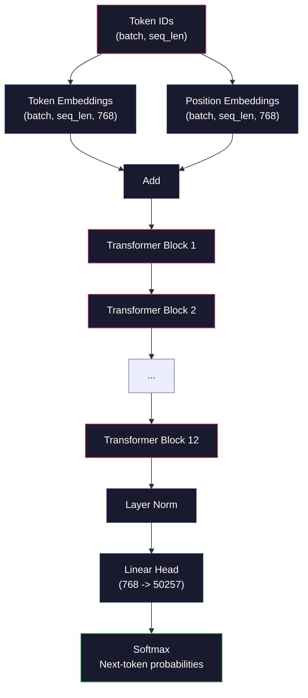
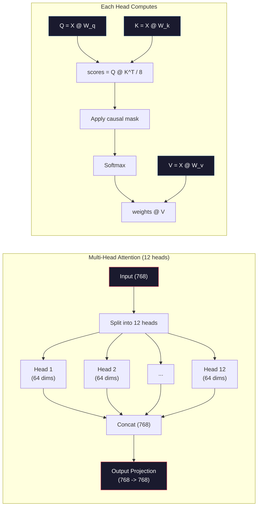
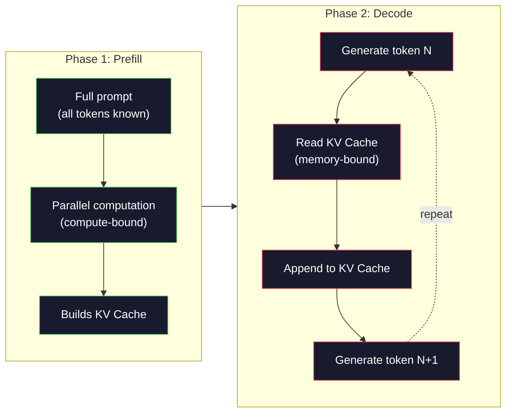

# Desde Zero Pre-Training Una Mini GPT(124M 参数)

> GPT-2 Small tiene 1.24 mil millones de parámetros. Es decir, 12 capas de Transformer, 12 cabezas de atención, así como 768 dimensiones de embebedimiento. Puedes entrenarlo desde cero en un GPU de un solo bloque con unas horas. La mayoría de la gente nunca lo hará. Utilizan puntos de control pre-entrenados. Pero si no se ha entrenado personalmente, en realidad no entiendes lo que está sucediendo dentro del modelo en el que estás construyendo los productos de los que dependes.

**类型：**Construir
**语言：**Python con numpy)
**前置要求：**Fase 10,Lecciones 01-03 ((Tokenizers, Construcción de un Tokenizer, Pipelines de datos)
**时间：**~ 120 minutos

## El objetivo del aprendizaje
- Desde zero implementar completo GPT-2 架构(124M 参数):Token Embeddings、position embeddings、transformer bloques, así como el modelo de lenguaje cabeza
- Utiliza predicción de tokens siguientes y pérdida de entropía cruzada, en el texto
- 实现带 temperatura muestreo y top-k/top-p filtrado de autoregresivos 文本生成
- monitorear las curvas de pérdida de entrenamiento,并验证模型学到了连贯的语言模式

##  problemas
Sabes que el Transformer es lo que eres. Has visto esas imágenes.

Esto no significa que entiendas lo que ocurrió cuando el modelo generó el texto.

GPT-2 Small (con gravedad de atadura) tiene 124.438.272 个参数── cada parámetro es configurado a través de un ciclo de entrenamiento de ejecución: pase hacia adelante、 cálculo pérdida、 pase hacia atrás、 actualización de peso──12 bloques de transformador── cada bloque 12 cabezas de atención── un espacio de embebimiento de 768 dimensiones── una que contiene 50.257 个 个 个 个 个 个 个 个 个 个 个 个 个 个 个 个 个 个 个 个 个 个 个 个 个 个 个 个 个 个 个 个 个 个 个 个 个 个 个 个 个 个 个 个 个 个 个 个 个 个 个 个 个 个 个 个 个 个 个 个 个 个 个 个 个 个 个 个 个 个 个 个 个 个 个 个 个 个 个 个 个 个 个 个 个 个 个 个 个 个 个 个 个 个 个 个 个 个 个 个 个 个 个 个 个 个 个 个 个 个 个 个 个 个 个 个 个 个 个 个 个 个 个 个 个 个 个 个 个 个 个 个 个 个 个 个 个 个 个 个 个 个 个 个 个 个 个 个 个 个 个 个 个 个 个 个 个 个 个 个 个 个 个 个 个 个 个 个 个 个 个 个 个 个 个 个 个 个 个 个 个 个 个 个 个 个 个 个 个 个 个 个 个 个 个 个 个 个 个 个 个 个 个 个 个 个 个 个

Si nunca has construido esto a mano, estás usando una caja negra. Puedes usar API. Puedes ajustarlo. Pero cuando surge un problema, el modelo se alucina, repite a sí mismo, rechaza seguir las instrucciones.

Este curso se desarrollará desde cero construyendo GPT-2 Small── no con PyTorch── con numpy── cada vez que la multiplicación de la matriz es visible── cada gradiente es calculado por tu código── verás con certeza 1.24 mil millones de números cómo se componen para predecir el siguiente palabra──

## 概念
### La arquitectura del GPT

GPT es un modelo de lenguaje autoregresista. El significado de autoregresista es que genera una vez un Token, cada Token está basado en todos los Token anteriores.

Abajo está el gráfico de cálculo completo de la identificación de tokens hasta las probabilidades de los próximos tokens:

1. Identificación de token 输入。Forma: (grado de lote, secuencia)。
2. Embedding de tokens búsqueda。 cada ID 映射到一个 768 维 Vector。Forma: (batch_size, seq_len, 768)。
3. Posición de inserción de búsqueda. Cada posición.
4. 将 Token Embeddings + posicionamiento de los embeddings 相加──
5. 通過 12 个 轉變器積木──
6. La última normalización de la capa.
7. Proyección lineal hasta tamaño del vocabulario.
8. Softmax  obtener la probabilidad.

Éste es todo el modelo. No hay convoluciones. No hay recurrencias. Sólo los embebidos. Atención.



### El bloque de transformador

12 bloques en el medio de cada uno siguen el mismo modelo.

1. La capaNorm
2. Atención personal de varias cabezas
3. Conexión residual (¡¡¡¡¡¡¡¡¡¡¡¡¡¡¡¡¡¡¡¡¡¡¡¡¡¡¡¡¡¡¡¡¡¡¡¡¡¡¡¡¡¡¡¡¡¡¡¡¡¡¡¡¡¡¡¡¡¡¡¡¡¡¡¡¡¡¡¡¡¡¡¡¡¡¡¡¡¡¡¡¡¡¡¡¡¡¡¡¡¡¡¡¡¡¡¡¡¡¡¡¡¡¡¡¡¡¡¡¡¡¡¡¡¡¡¡¡¡¡¡¡¡¡¡¡¡¡¡¡¡¡¡¡¡¡¡¡¡¡¡¡¡¡¡¡¡¡¡¡¡¡¡¡¡¡¡¡¡¡¡¡¡¡¡¡¡¡¡¡¡¡¡¡¡¡¡¡¡¡¡¡¡¡¡¡¡¡¡¡¡¡¡¡¡¡¡¡¡¡¡¡¡¡¡¡¡¡¡¡¡¡¡¡¡¡¡¡¡¡¡¡¡¡¡¡¡¡¡¡¡¡¡¡¡¡¡¡¡¡¡¡¡¡¡¡¡¡¡¡¡¡¡¡¡¡¡¡¡¡¡¡¡¡¡¡¡¡¡¡¡¡¡¡¡¡¡¡¡¡¡¡¡¡¡¡¡¡¡¡¡¡¡¡¡¡¡¡¡¡¡¡¡¡¡¡¡¡¡¡¡¡¡¡¡¡¡¡¡¡¡¡¡¡¡¡¡¡¡¡¡¡¡¡¡¡¡¡¡¡¡¡¡¡¡¡¡¡¡¡¡¡¡¡¡¡¡¡¡¡¡¡¡¡¡¡¡¡¡¡¡¡¡¡¡¡¡¡¡¡¡¡¡¡¡¡¡¡¡¡¡¡¡¡¡¡¡¡¡¡¡¡¡¡¡¡¡¡¡¡¡¡¡¡¡¡¡¡¡¡¡¡¡¡¡¡¡¡¡¡¡¡¡¡¡¡¡¡¡¡¡¡¡¡¡¡¡¡¡¡¡¡¡¡¡¡¡¡¡¡¡¡¡¡¡¡¡¡¡¡¡¡¡¡¡¡¡¡¡¡¡¡¡¡¡¡¡¡¡¡¡¡¡¡¡¡¡¡¡¡¡¡¡¡¡¡
4. La capaNorm
5. Red de transmisión de información (MLP)
6. Conexión residual (¡¡¡¡¡¡¡¡¡¡¡¡¡¡¡¡¡¡¡¡¡¡¡¡¡¡¡¡¡¡¡¡¡¡¡¡¡¡¡¡¡¡¡¡¡¡¡¡¡¡¡¡¡¡¡¡¡¡¡¡¡¡¡¡¡¡¡¡¡¡¡¡¡¡¡¡¡¡¡¡¡¡¡¡¡¡¡¡¡¡¡¡¡¡¡¡¡¡¡¡¡¡¡¡¡¡¡¡¡¡¡¡¡¡¡¡¡¡¡¡¡¡¡¡¡¡¡¡¡¡¡¡¡¡¡¡¡¡¡¡¡¡¡¡¡¡¡¡¡¡¡¡¡¡¡¡¡¡¡¡¡¡¡¡¡¡¡¡¡¡¡¡¡¡¡¡¡¡¡¡¡¡¡¡¡¡¡¡¡¡¡¡¡¡¡¡¡¡¡¡¡¡¡¡¡¡¡¡¡¡¡¡¡¡¡¡¡¡¡¡¡¡¡¡¡¡¡¡¡¡¡¡¡¡¡¡¡¡¡¡¡¡¡¡¡¡¡¡¡¡¡¡¡¡¡¡¡¡¡¡¡¡¡¡¡¡¡¡¡¡¡¡¡¡¡¡¡¡¡¡¡¡¡¡¡¡¡¡¡¡¡¡¡¡¡¡¡¡¡¡¡¡¡¡¡¡¡¡¡¡¡¡¡¡¡¡¡¡¡¡¡¡¡¡¡¡¡¡¡¡¡¡¡¡¡¡¡¡¡¡¡¡¡¡¡¡¡¡¡¡¡¡¡¡¡¡¡¡¡¡¡¡¡¡¡¡¡¡¡¡¡¡¡¡¡¡¡¡¡¡¡¡¡¡¡¡¡¡¡¡¡¡¡¡¡¡¡¡¡¡¡¡¡¡¡¡¡¡¡¡¡¡¡¡¡¡¡¡¡¡¡¡¡¡¡¡¡¡¡¡¡¡¡¡¡¡¡¡¡¡¡¡¡¡¡¡¡¡¡¡¡¡¡¡¡¡¡¡¡¡¡¡¡¡¡¡¡¡¡¡¡¡¡¡¡¡¡¡¡¡¡¡¡¡¡¡¡¡¡¡¡¡¡¡¡¡¡¡¡¡¡¡¡¡¡

Las conexiones residuales 至关重要──没有它们, en el proceso de Backpropagation , Gradiente hasta llegar al bloque 1 时会消失──有它们, Gradiente puede pasar por el camino skip desde la pérdida 直接流向任意层──这就是为什么你可以堆叠12、32,甚至96块(GPT-4传闻使用120个) 

### Atención: 核心机制

Autoatención 让每个代币 查看前面所有代币,并决定应该关注每个代币 多少──下面是数学形式──

Para cada posición de Token, desde la entrada 计算三个 vectores:
- **Query (Q)**¿Qué estoy buscando?
- **Key (K)**¿Qué es lo que contiene?
- **Value (V)**¿Qué información llevo consigo?

```
Q = input @ W_q    (768 -> 768)
K = input @ W_k    (768 -> 768)
V = input @ W_v    (768 -> 768)

attention_scores = Q @ K^T / sqrt(d_k)
attention_scores = mask(attention_scores)   # causal mask: -inf for future positions
attention_weights = softmax(attention_scores)
output = attention_weights @ V
```

La máscara causal es hacer que GPT  tenga un mecanismo de carácter autoregresor. La posición 5 puede asistir a las posiciones 0-5, pero no puede asistir a 6、7、8, según este tipo de sugerencias. Esto evitará que el modelo en el entrenamiento a través de la visión del futuro Token 来作弊──

**Multi-head attention**Se puede encontrar una línea de trabajo en el espacio, pero no en el espacio. Se puede encontrar una línea de trabajo en el espacio.



Además de en sqrt(d_k) sqrt(64) = 8 es escalado。 sin ella, el producto de puntos de un alto nivel vector se vuelve muy grande, y la suavidad máxima se reduce a la región de casi 零.

### KV Cache: 推理为什么快

训练时,你会处理整个序列一次――Inference 时,你会生成一个代币――如果没有优化,生成代币 N 需要为前面所有N-1 个代币 重新计算注意――对于每个生成代币,这是O(N),对长度为N的序列,总体是O(N^2) 的注意分 计算,并且还会重复执行大量输入侧矩阵乘点――

KV Cache  solucionó este problema. Por cada token  calcular K 和 V 后, ponerlos en almacenamiento. Cuando se genera un token N + 1 时, sólo necesitas un nuevo token 计算 Q,并查找所有之前的 token 缓存的 K 和 V ;; esto pondrá el costo de K 和 V 计算的每 token de O(N) 降至 O(1);; El cálculo de la puntuación de atención 仍然是 O(N), porque debes atender a la posición anterior, pero evitas realizar multiplicidades redundantes de la matriz ⋅

对于包含12 capas和12 capas GPT-2,KV cache 会为每 token 存储 2(K + V) x 12 capas x 12 capas x 64 dims = 18,432 个值。对于1024-Token secuencia,这在FP32 下大约是75MB──对于拥有128 capas Llama 3 405B,单个 secuencia的KV cache可能超过10GB──这就是为什么长文段推论受了内存约束──

### Preempleo vs Decodificación: 推理的两个阶段

Cuando se envíe a la LLM, la conferencia se divide en dos fases diferentes.

**Prefill**La atención de este paso es computación-ligadaGPU está en plena potencia  ejecutar multiplicidades de Matrix― en A100, un preempleo de 1000-Token de la respuesta requiere aproximadamente 20-50ms―

**Decode**La mayoría del tiempo está esperando para leer la memoria. Para GPT-2, cada paso de decodificación, el tiempo que se pasa es casi igual que las matrices.

Esta diferencia es importante para el sistema de producción. El rendimiento de preempleo  con la computación de GPU  expand expandimiento 更多 FLOPS = 更快 prefill)  Descoda rendimiento  con el ancho de banda de memoria 扩展  更快 memoria = 更快解码)  Esto es por qué NVIDIA H100 en comparación con A100 重点提升 memoria de ancho de banda  acelerará directamente la generación de tokens 



### El ciclo de entrenamiento

訓練 LLM 就是下一个代币预测──给定代币 [0, 1, 2, ..., N-1],预测代币 [1, 2, 3, ..., N]──Loss Function 是模型预测概率分布与真实下一个代币 之间的交叉──

Un paso de entrenamiento:

1. **Forward pass**: haga que el lote pase por todos los 12 bloques.
2. **Compute loss**:logits y tokens objetivo (input 向后平移一位) entre entropía cruzada
3. **Backward pass**: usar la propagación de retroceso 为全部 124M 参数计算 Gradient。
4. **Optimizer step**GPT-2 Uso con el ritmo de aprendizaje calentamiento y decadencia del cosino de Adam.

El ritmo de aprendizaje es más importante que lo que piensas. En los primeros 2.000 pasos, el GPT-2 se calienta desde 0 hasta el máximo de aprendizaje, y luego se desacelera.

### GPT-2 pequeño: los números

| Component | Shape | Parameters |
|-----------|-------|------------|
| Token embeddings | (50257, 768) | 38,597,376 |
| Position embeddings | (1024, 768) | 786,432 |
| Per-block attention (W_q, W_k, W_v, W_out) | 4 x (768, 768) | 2,359,296 |
| Per-block FFN (up + down) | (768, 3072) + (3072, 768) | 4,718,592 |
| Per-block LayerNorms (2x) | 2 x 768 x 2 | 3,072 |
| Final LayerNorm | 768 x 2 | 1,536 |
| **Total per block** | | **7,080,960** |
| **Total (12 blocks)** | | **85,054,464 + 39,383,808 = 124,438,272** |

Proyección de salida (logits head) con Token Embedding Matrix 共享权重──这叫重量绑定它减少38M参数,并提升性能,因为它迫使模型对输入和输出使用同一个表示空间──


```figure
sampling-decoder
```

## Construirlo
### Paso 1: Incluir capa

Embedings de tokens se proyectarán en un vector de 768 dimensiones. Cada uno de los 50257 posibles tokens se proyectará en un vector de 768 dimensiones.

```python
import numpy as np

class Embedding:
    def __init__(self, vocab_size, embed_dim, max_seq_len):
        self.token_embed = np.random.randn(vocab_size, embed_dim) * 0.02
        self.pos_embed = np.random.randn(max_seq_len, embed_dim) * 0.02

    def forward(self, token_ids):
        seq_len = token_ids.shape[-1]
        tok_emb = self.token_embed[token_ids]
        pos_emb = self.pos_embed[:seq_len]
        return tok_emb + pos_emb
```

Iniciación utiliza desviación estándar de 0.02 , proviene del papel GPT-2, demasiado grande, pasa hacia adelante inicial 会产生极端值,破坏训练稳定性──太小, inicial输出对所有输入 几乎相同,让早期渐进信号 失去作用──

### Paso 2: Autoatención de la máscara causal

Antes lograr la atención de una sola cabeza. Mascara causal 会在软max 之前把未来位置 设置为负无限, asegurar que cada posición sólo pueda atender a la posición del yo y más temprano.

```python
def attention(Q, K, V, mask=None):
    d_k = Q.shape[-1]
    scores = Q @ K.transpose(0, -1, -2 if Q.ndim == 4 else 1) / np.sqrt(d_k)
    if mask is not None:
        scores = scores + mask
    weights = np.exp(scores - scores.max(axis=-1, keepdims=True))
    weights = weights / weights.sum(axis=-1, keepdims=True)
    return weights @ V
```

softmax 实现会在 exponenciando 前减去最大值──否则,exp(large_number) 会溢出成无限──这是一个数值稳定性技巧,并不会改变输出,因为对于任意常数 c,softmax(x - c) = softmax(x)──

### Paso 3: Atención de múltiples cabezas

Para hacer una entrada de 768 dimensiones, dividir en 12 cabezas, cada cabeza 64 dimensiones.

```python
class MultiHeadAttention:
    def __init__(self, embed_dim, num_heads):
        self.num_heads = num_heads
        self.head_dim = embed_dim // num_heads
        self.W_q = np.random.randn(embed_dim, embed_dim) * 0.02
        self.W_k = np.random.randn(embed_dim, embed_dim) * 0.02
        self.W_v = np.random.randn(embed_dim, embed_dim) * 0.02
        self.W_out = np.random.randn(embed_dim, embed_dim) * 0.02

    def forward(self, x, mask=None):
        batch, seq_len, d = x.shape
        Q = (x @ self.W_q).reshape(batch, seq_len, self.num_heads, self.head_dim).transpose(0, 2, 1, 3)
        K = (x @ self.W_k).reshape(batch, seq_len, self.num_heads, self.head_dim).transpose(0, 2, 1, 3)
        V = (x @ self.W_v).reshape(batch, seq_len, self.num_heads, self.head_dim).transpose(0, 2, 1, 3)

        scores = Q @ K.transpose(0, 1, 3, 2) / np.sqrt(self.head_dim)
        if mask is not None:
            scores = scores + mask
        weights = np.exp(scores - scores.max(axis=-1, keepdims=True))
        weights = weights / weights.sum(axis=-1, keepdims=True)
        attn_out = weights @ V

        attn_out = attn_out.transpose(0, 2, 1, 3).reshape(batch, seq_len, d)
        return attn_out @ self.W_out
```

reshape-transpose-reshape Este conjunto de operaciones es una parte de atención multi-cabeza. Se produce: el tensor de forma forma de (batch, seq_len, 768) se transforma (batch, seq_len, 12, 64), se vuelve a transformar (batch, 12, seq_len, 64). Ahora cada uno de los 12 cabezas del medio tiene su propio (seq_len, 64) Matriz 来运行 Attention. Attention 结束后,我们反向执行这个过程:((batch, 12, seq_len, 64) 变成 (batch, seq_len, 12, 64), se vuelve a transformar (batch, seq_len, 768) ⋅

### Paso 4: Bloqueo de transformador

Un bloque completo de transformador:LayerNorm, con el residual de atención multi-cabeza, LayerNorm, con el residual de feedforward,

```python
class LayerNorm:
    def __init__(self, dim, eps=1e-5):
        self.gamma = np.ones(dim)
        self.beta = np.zeros(dim)
        self.eps = eps

    def forward(self, x):
        mean = x.mean(axis=-1, keepdims=True)
        var = x.var(axis=-1, keepdims=True)
        return self.gamma * (x - mean) / np.sqrt(var + self.eps) + self.beta


class FeedForward:
    def __init__(self, embed_dim, ff_dim):
        self.W1 = np.random.randn(embed_dim, ff_dim) * 0.02
        self.b1 = np.zeros(ff_dim)
        self.W2 = np.random.randn(ff_dim, embed_dim) * 0.02
        self.b2 = np.zeros(embed_dim)

    def forward(self, x):
        h = x @ self.W1 + self.b1
        h = np.maximum(0, h)  # GELU approximation: ReLU for simplicity
        return h @ self.W2 + self.b2


class TransformerBlock:
    def __init__(self, embed_dim, num_heads, ff_dim):
        self.ln1 = LayerNorm(embed_dim)
        self.attn = MultiHeadAttention(embed_dim, num_heads)
        self.ln2 = LayerNorm(embed_dim)
        self.ffn = FeedForward(embed_dim, ff_dim)

    def forward(self, x, mask=None):
        x = x + self.attn.forward(self.ln1.forward(x), mask)
        x = x + self.ffn.forward(self.ln2.forward(x))
        return x
```

La red de feedforward va a tener una representación interna más amplia en cada posición. GPT-2 utiliza la activación GELU, pero aquí para simplemente usar ReLU para entender la estructura de diferencia no es grande.

### 步骤 5: Modelo de GPT completo

堆叠 12 个 Transformer blocks──在前面加入嵌入层,在后面加入输出投影──

```python
class MiniGPT:
    def __init__(self, vocab_size=50257, embed_dim=768, num_heads=12,
                 num_layers=12, max_seq_len=1024, ff_dim=3072):
        self.embedding = Embedding(vocab_size, embed_dim, max_seq_len)
        self.blocks = [
            TransformerBlock(embed_dim, num_heads, ff_dim)
            for _ in range(num_layers)
        ]
        self.ln_f = LayerNorm(embed_dim)
        self.vocab_size = vocab_size
        self.embed_dim = embed_dim

    def forward(self, token_ids):
        seq_len = token_ids.shape[-1]
        mask = np.triu(np.full((seq_len, seq_len), -1e9), k=1)

        x = self.embedding.forward(token_ids)
        for block in self.blocks:
            x = block.forward(x, mask)
        x = self.ln_f.forward(x)

        logits = x @ self.embedding.token_embed.T
        return logits

    def count_parameters(self):
        total = 0
        total += self.embedding.token_embed.size
        total += self.embedding.pos_embed.size
        for block in self.blocks:
            total += block.attn.W_q.size + block.attn.W_k.size
            total += block.attn.W_v.size + block.attn.W_out.size
            total += block.ffn.W1.size + block.ffn.b1.size
            total += block.ffn.W2.size + block.ffn.b2.size
            total += block.ln1.gamma.size + block.ln1.beta.size
            total += block.ln2.gamma.size + block.ln2.beta.size
        total += self.ln_f.gamma.size + self.ln_f.beta.size
        return total
```

Atención a la unión de peso:`logits = x @ self.embedding.token_embed.T`△ proyección de salida 复用 Token Embedding Matrix(转置) ・・・ esto no es sólo una técnica de la sección de parametros── significa que el modelo utiliza el mismo espacio vectorial para entender Token(embeddings) y预测 Token(output)。

### Paso 6: Loop de entrenamiento

Para un entrenamiento real de 124M, necesitas GPU y PyTorch. Este ciclo de entrenamiento se desarrolla en un pequeño modelo que se puede ejecutar con pura numpy. Usamos un pequeño modelo.

```python
def cross_entropy_loss(logits, targets):
    batch, seq_len, vocab_size = logits.shape
    logits_flat = logits.reshape(-1, vocab_size)
    targets_flat = targets.reshape(-1)

    max_logits = logits_flat.max(axis=-1, keepdims=True)
    log_softmax = logits_flat - max_logits - np.log(
        np.exp(logits_flat - max_logits).sum(axis=-1, keepdims=True)
    )

    loss = -log_softmax[np.arange(len(targets_flat)), targets_flat].mean()
    return loss


def train_mini_gpt(text, vocab_size=256, embed_dim=128, num_heads=4,
                   num_layers=4, seq_len=64, num_steps=200, lr=3e-4):
    tokens = np.array(list(text.encode("utf-8")[:2048]))
    model = MiniGPT(
        vocab_size=vocab_size, embed_dim=embed_dim, num_heads=num_heads,
        num_layers=num_layers, max_seq_len=seq_len, ff_dim=embed_dim * 4
    )

    print(f"Model parameters: {model.count_parameters():,}")
    print(f"Training tokens: {len(tokens):,}")
    print(f"Config: {num_layers} layers, {num_heads} heads, {embed_dim} dims")
    print()

    for step in range(num_steps):
        start_idx = np.random.randint(0, max(1, len(tokens) - seq_len - 1))
        batch_tokens = tokens[start_idx:start_idx + seq_len + 1]

        input_ids = batch_tokens[:-1].reshape(1, -1)
        target_ids = batch_tokens[1:].reshape(1, -1)

        logits = model.forward(input_ids)
        loss = cross_entropy_loss(logits, target_ids)

        if step % 20 == 0:
            print(f"Step {step:4d} | Loss: {loss:.4f}")

    return model
```

La pérdida comenzó a acercarse a ln(vocab_size)  Para el vocabulario de nivel de byte de 256-Token, también se trata de ln(256) = 5.55。随机模型会给每个Token 分配相等概率──随着训练推进,Loss 会下降,因为模型学会预测常见模式:如 t 后面的 th、句号后的空格,等等──

En la producción, usará el optimizador Adam, junto con la acumulación de gradientes, el calentamiento de la tasa de aprendizaje y el recorte de gradientes.

### Paso 7: Generación de texto

Generación utiliza entrenamiento buen modelo una vez predicción un Token。 cada vez predicción todos de la muestra de la distribución de salida(o codiciosamente 取 argmax)。

```python
def generate(model, prompt_tokens, max_new_tokens=100, temperature=0.8):
    tokens = list(prompt_tokens)
    seq_len = model.embedding.pos_embed.shape[0]

    for _ in range(max_new_tokens):
        context = np.array(tokens[-seq_len:]).reshape(1, -1)
        logits = model.forward(context)
        next_logits = logits[0, -1, :]

        next_logits = next_logits / temperature
        probs = np.exp(next_logits - next_logits.max())
        probs = probs / probs.sum()

        next_token = np.random.choice(len(probs), p=probs)
        tokens.append(next_token)

    return tokens
```

Temperatura  control随机性──Temperatura 1.0 使用原始分布──Temperatura 0.5 会让分布更尖(更确定模型更经常选择顶级选择)──Temperatura 1.5 会让分布更平坦(更随机低概率代币 获得更大的机会)──Temperatura 0.0 es codificación codificada(总是选择最高概率代币)──

`tokens[-seq_len:]`Esta ventana es necesaria, ya que el modelo tiene la mayor longitud de contexto (GPT-2 para 1024). Una vez superada, hay que perder el token más antiguo.

## Usalo
### 完整训练与生成 Demo

```python
corpus = """The transformer architecture has revolutionized natural language processing.
Attention mechanisms allow the model to focus on relevant parts of the input.
Self-attention computes relationships between all pairs of positions in a sequence.
Multi-head attention splits the representation into multiple subspaces.
Each attention head can learn different types of relationships.
The feedforward network provides nonlinear transformations at each position.
Residual connections enable gradient flow through deep networks.
Layer normalization stabilizes training by normalizing activations.
Position embeddings give the model information about token ordering.
The causal mask ensures autoregressive generation during training.
Pre-training on large text corpora teaches the model general language understanding.
Fine-tuning adapts the pre-trained model to specific downstream tasks."""

model = train_mini_gpt(corpus, num_steps=200)

prompt = list("The transformer".encode("utf-8"))
output_tokens = generate(model, prompt, max_new_tokens=100, temperature=0.8)
generated_text = bytes(output_tokens).decode("utf-8", errors="replace")
print(f"\nGenerated: {generated_text}")
```

En los pequeños lenguajes y pequeños modelos, la generación de textos puede calcularse en medio tiempo. Se puede aprender de los textos de entrenamiento a algunos patrones de nivel de byte, pero no puede, como GPT-2, aprovechar los 40GB de datos de entrenamiento y la estructura de parámetros 124M completa para generalizarse.

##  entregarlo
本课会产出                                                                                                                                                                                                                                                                                                                                                                                                                                                                                                                         `outputs/prompt-gpt-architecture-analyzer.md` Un modelo de tipo GPT 架构选择的提示──把模型卡或技术报告 交给它,它将解解参数配置、注意设计和规模决策──

##  ejercicios
1. ¿Qué diferencia hay entre el modelo modificado para utilizar 24 capas y 16 cabezas, en lugar de 12/12?

2. 实现 GELU activación función(GELU(x) = x * 0.5 * (1 + erf(x / sqrt(2)))),并替换输送网络 中的 ReLU──分别使用两种激活 训练500步,并比较最终损失──

3. 给生成函数 添加 KV cache──在第一次前传后,存储每层的 K 和 V紧缩器,并后续代币中复用它们──测量加快:分别在有缓存和没有缓存的情况下生成200代币,并比较墙钟时间──

4. 实现 top-k sampling( sólo considerar la probabilidad máxima de k 个 Token) y top-p sampling(nucleus sampling: considerar la probabilidad acumulada superior a p de los mínimos Token 集合) ⋅ en temperatura 0.8 下比较 top-k=50与 top-p=0.95 的输出质量──

5. 构建一个训练损失曲线图案设计者──训练模型 1000 steps,并绘制损失 vs step──识别三个阶段:快速初始下降(学习常见字节)、较慢的中间阶段(学习字节模式) 以及平面(在小语料上过)──无论你训练的是128-dimensional model 还是GPT-4,这条曲线的形状都是一样的──

## 关键术语: "El hombre es un hombre"
| Term | What people say | What it actually means |
|------|----------------|----------------------|
| Autoregressive | “它一次生成一个词” | 每个输出 Token 都基于所有之前的 Token——模型预测 P(token_n \| token_0, ..., token_{n-1}) |
| Causal mask | “它看不到未来” | 一个由 -infinity 值组成的 upper-triangular Matrix，用于在训练期间阻止 Attention 指向未来 position |
| Multi-head attention | “多种 Attention pattern” | 将 Q、K、V 拆成并行 heads（例如 GPT-2 中 12 个 head，每个 64 dims），让每个 head 学习不同的关系类型 |
| KV Cache | “用于提速的缓存” | 存储来自之前 Token 的已计算 Key 和 Value tensors，以避免 autoregressive generation 期间的冗余计算 |
| Prefill | “处理 prompt” | 第一个 inference 阶段，所有 prompt Token 并行处理——在 GPU FLOPS 上 compute-bound |
| Decode | “生成 Token” | 第二个 inference 阶段，Token 一次生成一个——在 GPU bandwidth 上 memory-bound |
| Weight tying | “共享 embeddings” | 对 input Token embeddings 和 output projection head 使用同一个 Matrix——在 GPT-2 中节省 38M 参数 |
| Residual connection | “Skip connection” | 将 input 直接加到 sublayer 的 output 上（x + sublayer(x)）——支持 deep networks 中的 Gradient flow |
| Layer normalization | “规范化 activations” | 沿 feature dimension 规范化到 mean 0 和 variance 1，并带有可学习的 scale 与 bias 参数 |
| Cross-entropy loss | “预测错得有多离谱” | -log(分配给正确 next Token 的概率)，在所有 position 上取平均——标准 LLM 训练目标 |

## 延伸阅读
- [Radford et al., 2019 -- "Language Models are Unsupervised Multitask Learners" (GPT-2)](https://cdn.openai.com/better-language-models/language_models_are_unsupervised_multitask_learners.pdf)-- 介绍 124M hasta 1.5B 参数家族的 GPT-2 papel
- [Vaswani et al., 2017 -- "Attention Is All You Need"](https://arxiv.org/abs/1706.03762)--  propone escalado de la atención de producto punto y atención multi-cabeza de papel original transformador
- [Llama 3 Technical Report](https://arxiv.org/abs/2407.21783)-- Meta  cómo utilizar GPUs 16K genera la arquitectura GPT  expandiéndose a 405B 参数
- [Pope et al., 2022 -- "Efficiently Scaling Transformer Inference"](https://arxiv.org/abs/2211.05102)-- Preemplir vs decodificar con análisis de caché KV  formalizado papel
